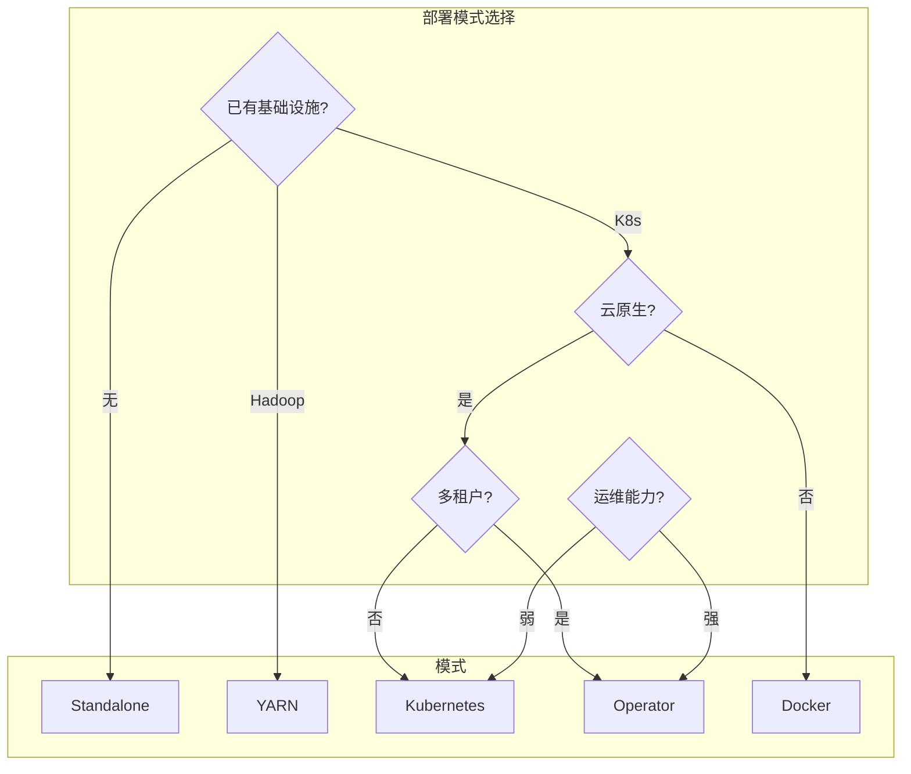
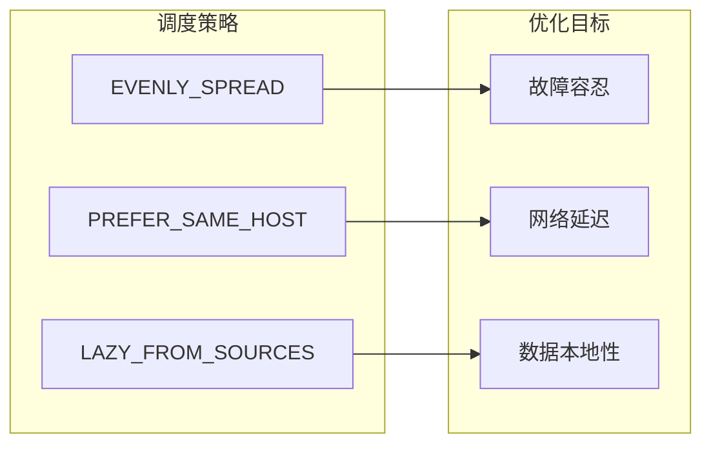
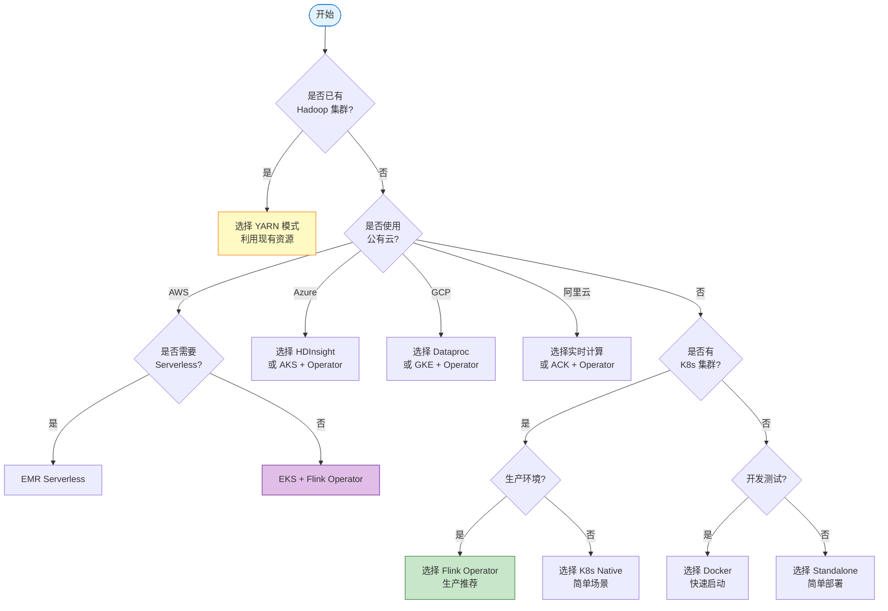
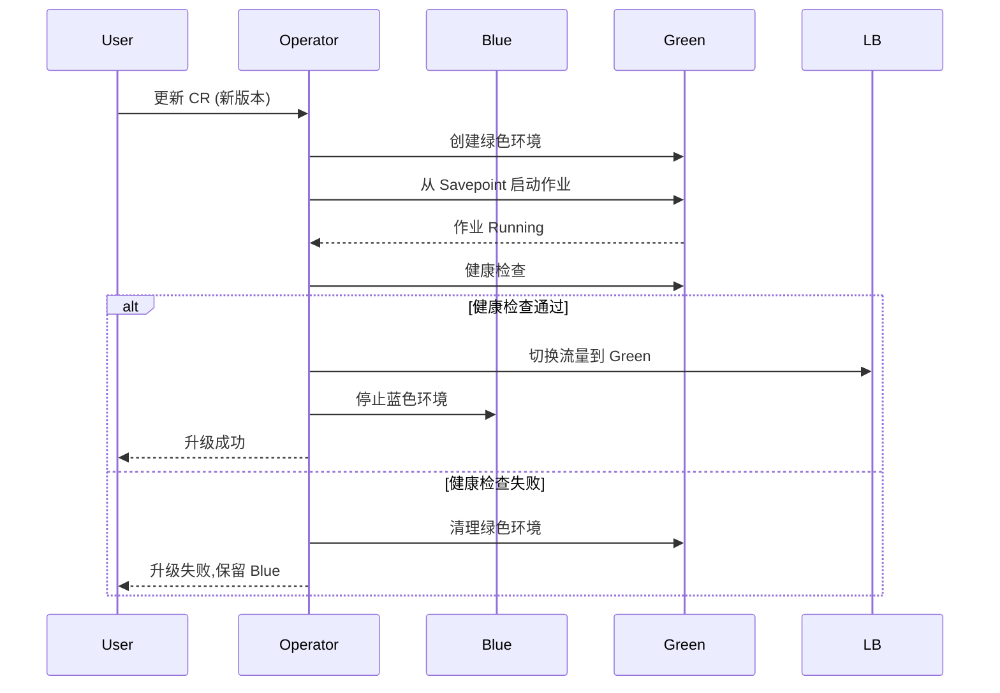
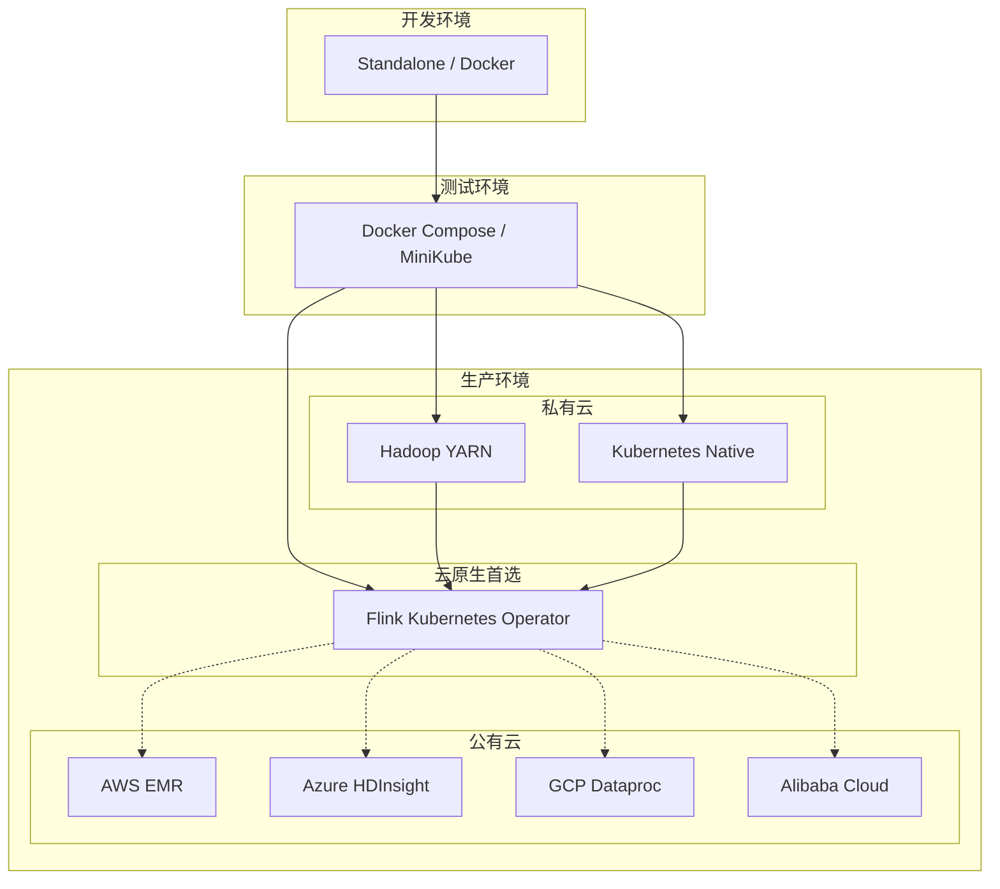
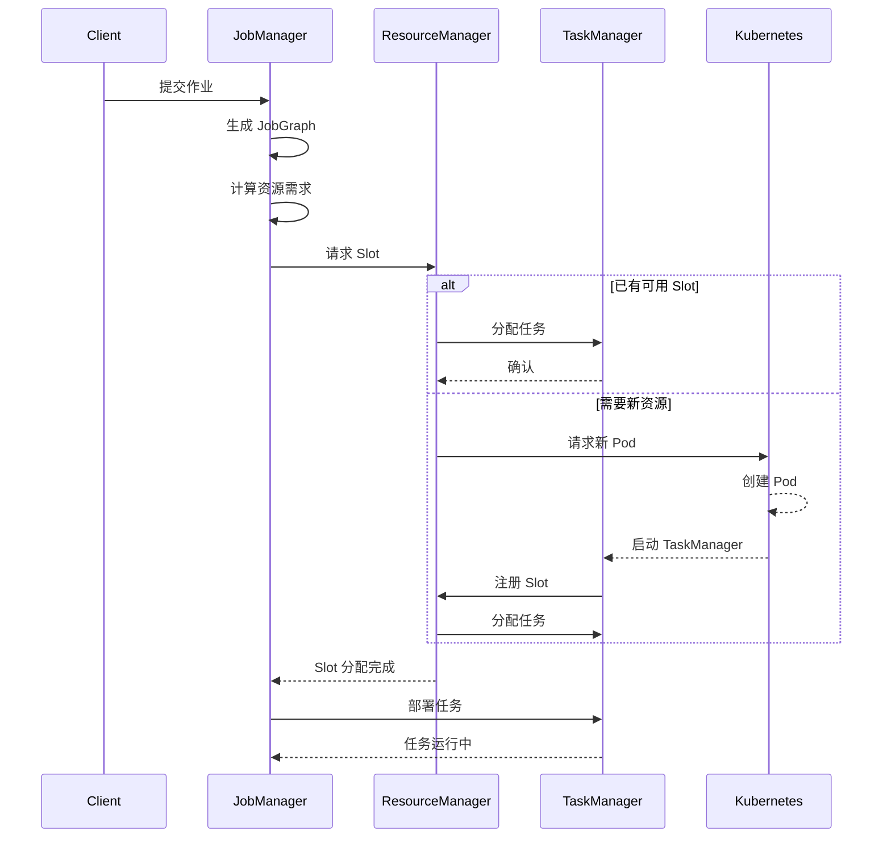
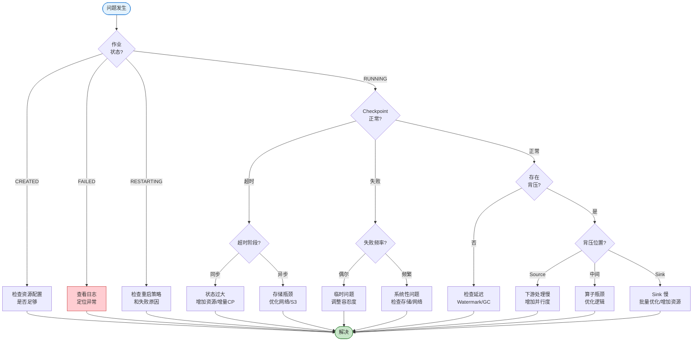
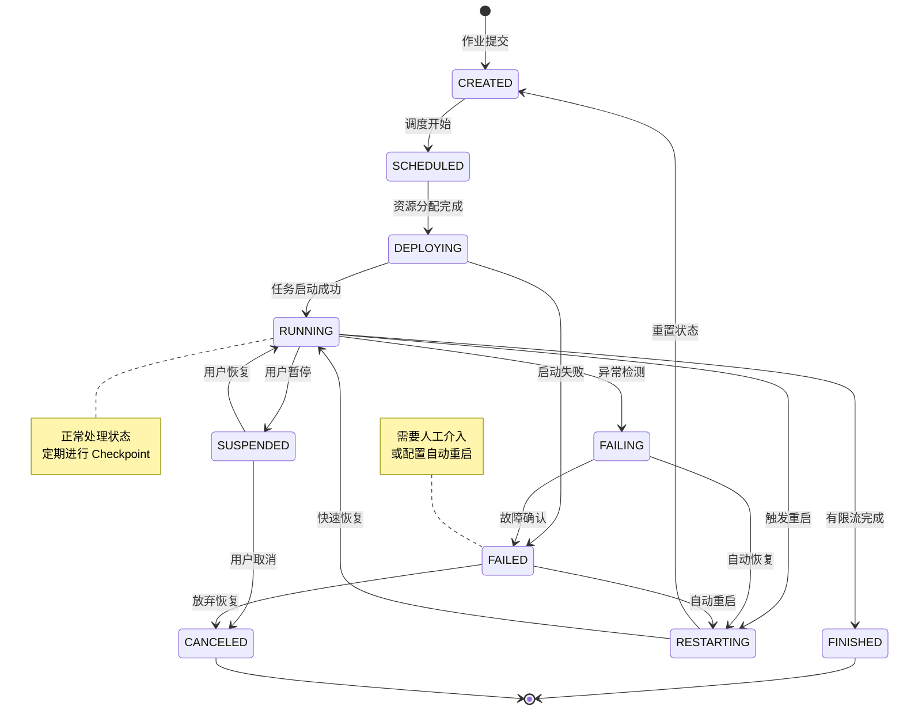

> **状态**: 🔮 前瞻内容 | **风险等级**: 高 | **最后更新**: 2026-04
>
> 此文档描述的内容处于早期规划阶段，可能与最终实现不符。请以 Apache Flink 官方发布为准。
>
# Flink 部署与运维完整特性指南

> **所属阶段**: Flink/10-deployment | **前置依赖**: [kubernetes-deployment.md](./kubernetes-deployment.md), [flink-kubernetes-operator-deep-dive.md](./flink-kubernetes-operator-deep-dive.md) | **形式化等级**: L3-L4
>
> **适用版本**: Apache Flink 1.16+ to 2.2+ | **最后更新**: 2026-04-04

---

## 目录

- [Flink 部署与运维完整特性指南](#flink-部署与运维完整特性指南)
  - [目录](#目录)
  - [1. 概念定义 (Definitions)](#1-概念定义-definitions)
    - [Def-F-10-40: Flink 部署模式分类](#def-f-10-40-flink-部署模式分类)
    - [Def-F-10-41: Slot 与资源分配单元](#def-f-10-41-slot-与资源分配单元)
    - [Def-F-10-42: 细粒度资源管理 (Fine-Grained Resource Management)](#def-f-10-42-细粒度资源管理-fine-grained-resource-management)
    - [Def-F-10-43: 自适应调度器 (Adaptive Scheduler)](#def-f-10-43-自适应调度器-adaptive-scheduler)
    - [Def-F-10-44: JobManager 高可用性模式](#def-f-10-44-jobmanager-高可用性模式)
    - [Def-F-10-45: 有状态作业升级策略](#def-f-10-45-有状态作业升级策略)
  - [2. 属性推导 (Properties)](#2-属性推导-properties)
    - [Lemma-F-10-40: Slot 分配完备性](#lemma-f-10-40-slot-分配完备性)
    - [Lemma-F-10-41: 自适应调度器的收敛性](#lemma-f-10-41-自适应调度器的收敛性)
    - [Prop-F-10-40: 部署模式资源隔离性排序](#prop-f-10-40-部署模式资源隔离性排序)
    - [Prop-F-10-41: HA 模式故障恢复时间边界](#prop-f-10-41-ha-模式故障恢复时间边界)
  - [3. 关系建立 (Relations)](#3-关系建立-relations)
    - [3.1 部署模式对比矩阵](#31-部署模式对比矩阵)
    - [3.2 资源调度策略映射](#32-资源调度策略映射)
    - [3.3 云服务商能力映射](#33-云服务商能力映射)
  - [4. 论证过程 (Argumentation)](#4-论证过程-argumentation)
    - [4.1 部署模式选择决策树](#41-部署模式选择决策树)
    - [4.2 资源配置反模式分析](#42-资源配置反模式分析)
    - [4.3 升级策略的兼容性边界](#43-升级策略的兼容性边界)
  - [5. 形式证明 / 工程论证 (Proof / Engineering Argument)](#5-形式证明--工程论证-proof--engineering-argument)
    - [Thm-F-10-40: Kubernetes Native 部署的容错完备性](#thm-f-10-40-kubernetes-native-部署的容错完备性)
    - [Thm-F-10-41: 细粒度资源管理的最优性](#thm-f-10-41-细粒度资源管理的最优性)
    - [Thm-F-10-42: 蓝绿部署的零停机保证](#thm-f-10-42-蓝绿部署的零停机保证)
  - [6. 实例验证 (Examples)](#6-实例验证-examples)
    - [6.1 Standalone 模式部署](#61-standalone-模式部署)
    - [6.2 YARN 模式部署](#62-yarn-模式部署)
    - [6.3 Kubernetes Native 部署](#63-kubernetes-native-部署)
    - [6.4 Flink Kubernetes Operator 部署](#64-flink-kubernetes-operator-部署)
    - [6.5 Docker 容器化部署](#65-docker-容器化部署)
    - [6.6 云服务商托管部署](#66-云服务商托管部署)
    - [6.7 细粒度资源管理配置](#67-细粒度资源管理配置)
    - [6.8 自适应调度器配置](#68-自适应调度器配置)
    - [6.9 高可用配置完整示例](#69-高可用配置完整示例)
    - [6.10 作业升级与 Savepoint 管理](#610-作业升级与-savepoint-管理)
  - [7. 可视化 (Visualizations)](#7-可视化-visualizations)
    - [7.1 部署架构全景图](#71-部署架构全景图)
    - [7.2 资源调度流程图](#72-资源调度流程图)
    - [7.3 故障排查决策树](#73-故障排查决策树)
    - [7.4 作业生命周期状态机](#74-作业生命周期状态机)
  - [8. 性能调优参数表](#8-性能调优参数表)
    - [8.1 内存配置参数](#81-内存配置参数)
    - [8.2 网络调优参数](#82-网络调优参数)
    - [8.3 Checkpoint 调优参数](#83-checkpoint-调优参数)
    - [8.4 JVM 调优参数](#84-jvm-调优参数)
  - [9. 引用参考 (References)](#9-引用参考-references)

---

## 1. 概念定义 (Definitions)

### Def-F-10-40: Flink 部署模式分类

**形式化定义**：

Flink 部署模式定义为一个三元组：

```
DeploymentMode = ⟨ ResourceManager, LifecycleBinding, IsolationLevel ⟩
```

其中：

- **ResourceManager** ∈ {Standalone, YARN, Kubernetes, Mesos(deprecated), AWS EMR, Azure HDInsight, GCP Dataproc, Alibaba Cloud}
- **LifecycleBinding** ∈ {Session, Application, Per-Job(deprecated)}
- **IsolationLevel** ∈ {Process, Container, Node, Cluster}

**主要部署模式**：

| 部署模式 | ResourceManager | LifecycleBinding | 隔离级别 | 适用场景 |
|----------|-----------------|------------------|----------|----------|
| **Standalone** | Flink 内置 | Session/Application | Process | 开发测试、小型集群 |
| **YARN** | Hadoop YARN | Session/Application | Container | 已有 Hadoop 生态 |
| **Kubernetes Native** | K8s API | Session/Application | Pod | 云原生生产环境 |
| **Flink K8s Operator** | K8s Operator | Application/Session | Pod + CRD | 生产环境首选 |
| **Docker** | Docker Engine | Application | Container | 本地开发、CI/CD |
| **AWS EMR** | EMR Managed | Session/Application | EC2/Container | AWS 云环境 |
| **Azure HDInsight** | Azure Managed | Session | VM | Azure 云环境 |
| **GCP Dataproc** | Dataproc | Session/Application | GCE/Container | GCP 云环境 |
| **Alibaba Cloud** | Ververica/VPC | Application | Container | 阿里云环境 |

---

### Def-F-10-41: Slot 与资源分配单元

**形式化定义**：

```
Slot = ⟨ ID, Resources, TaskSlots, AllocationPolicy ⟩

Resources = { CPU_cores, Memory_heap, Memory_offheap, Network_buffers, Managed_memory }
```

**Slot 分配策略**：

```
AllocationPolicy ∈ {
    EVENLY_SPREAD,      # 均匀分布,最大化故障域隔离
    PREFER_SAME_HOST,   # 优先同一主机,优化网络延迟
    LAZY_FROM_SOURCES   # 从 Source 延迟分配,优化数据本地性
}
```

**Slot 与 TaskManager 关系**：

```
TaskManager = ⟨ Host, Slots: Set<Slot>, TotalResources, AvailableResources ⟩

其中: |Slots| = taskmanager.numberOfTaskSlots
```

---

### Def-F-10-42: 细粒度资源管理 (Fine-Grained Resource Management)

**形式化定义**：

细粒度资源管理允许为每个算子定义独立的资源需求：

```
FineGrainedRM = ⟨ Operator, ResourceProfile, SlotSharingGroup ⟩

ResourceProfile = ⟨ CPU: float, HeapMemory: MemorySize,
                    OffHeapMemory: MemorySize,
                    ManagedMemory: MemorySize ⟩
```

**与传统粗粒度资源管理对比**：

| 特性 | 粗粒度 (Coarse) | 细粒度 (Fine-Grained) |
|------|-----------------|----------------------|
| 资源定义 | 每个 TM 统一配置 | 每个算子独立配置 |
| Slot 大小 | 固定 | 动态计算 |
| 资源利用率 | 60-70% | 80-90% |
| 配置复杂度 | 低 | 中 |
| 适用场景 | 通用工作负载 | 异构工作负载 |

---

### Def-F-10-43: 自适应调度器 (Adaptive Scheduler)

**形式化定义**：

自适应调度器是一个动态调整并行度的调度策略：

```
AdaptiveScheduler = ⟨ Strategy, ScaleTrigger, Constraints ⟩

Strategy ∈ { REACTIVE, ADAPTIVE }
ScaleTrigger ∈ { Backpressure, ResourceUtilization, Manual }
Constraints = { MinParallelism, MaxParallelism, ScaleUpDelay, ScaleDownDelay }
```

**模式对比**：

| 模式 | 行为 | 触发条件 | Flink 版本 |
|------|------|----------|------------|
| **REACTIVE** | 根据可用 Slot 自动调整并行度 | Slot 数量变化 | 1.17+ |
| **ADAPTIVE** | 根据负载历史预测最优并行度 | 历史性能指标 | 1.18+ |
| **STATIC** | 固定并行度 | 配置决定 | 所有版本 |

---

### Def-F-10-44: JobManager 高可用性模式

**形式化定义**：

JobManager HA 通过多副本和选举机制保证控制平面可用性：

```
JobManagerHA = ⟨ Mode, Replicas, StorageBackend, ElectionMechanism ⟩

Mode ∈ { NONE, ZOOKEEPER, KUBERNETES, EMBEDDED_JOURNAL }
```

**HA 模式对比**：

| 模式 | 选举机制 | 存储后端 | 适用环境 | RTO |
|------|----------|----------|----------|-----|
| **ZooKeeper** | ZK 选举 | ZK + DFS | YARN/K8s | 30-60s |
| **Kubernetes** | K8s Lease API | ConfigMap + DFS | K8s Native | 15-30s |
| **Embedded Journal** | Raft 共识 | 本地磁盘 | Standalone | 10-20s |

---

### Def-F-10-45: 有状态作业升级策略

**形式化定义**：

```
UpgradeStrategy = ⟨ Type, StatePreservation, CompatibilityCheck ⟩

Type ∈ { STATEFUL, STATELESS, LAST_STATE }
StatePreservation ∈ { SAVEPOINT, CHECKPOINT, NONE }
```

**策略对比**：

| 策略 | 状态保留 | 停机时间 | 回滚能力 | 适用场景 |
|------|----------|----------|----------|----------|
| **stateful** | Savepoint | 中 (分钟级) | 完全支持 | 生产升级 |
| **stateless** | 无 | 短 (秒级) | 不支持 | 配置变更 |
| **last-state** | 最新 Checkpoint | 中 | 部分支持 | 快速恢复 |

---

## 2. 属性推导 (Properties)

### Lemma-F-10-40: Slot 分配完备性

**陈述**：

在资源充足的条件下，Flink 的 Slot 分配算法能够成功为所有 Task 分配 Slot：

```
∀Tasks: sum(Task.requiredSlots) ≤ sum(AvailableSlots) ⟹ ∃Allocation: AllTasksScheduled
```

**证明概要**：

1. SlotPool 维护可用 Slot 集合
2. SlotProvider 按照 SchedulingStrategy 请求 Slot
3. ResourceManager 协调资源分配
4. 当总需求 ≤ 总供给时，分配必然成功（鸽巢原理）

---

### Lemma-F-10-41: 自适应调度器的收敛性

**陈述**：

在资源边界约束下，自适应调度器能够在有限步内收敛到稳定状态：

```
∃N: ∀n > N: |Parallelism(n) - Parallelism(n-1)| = 0
```

**约束条件**：

- MinParallelism ≤ Parallelism ≤ MaxParallelism
- ScaleUpDelay 防止抖动
- 历史窗口长度足够平滑噪声

---

### Prop-F-10-40: 部署模式资源隔离性排序

**命题**：

部署模式的资源隔离性可按以下偏序排列：

```
Standalone < YARN < Kubernetes < Flink Operator + Namespace

隔离性(ResourceIsolation) = f(ContainerBoundary, NetworkPolicy, RBAC)
```

**量化指标**：

| 部署模式 | 进程隔离 | 网络隔离 | 存储隔离 | 综合得分 |
|----------|----------|----------|----------|----------|
| Standalone | ★★ | ★ | ★ | 4/12 |
| YARN | ★★★ | ★★ | ★★ | 7/12 |
| Kubernetes | ★★★★ | ★★★ | ★★★ | 10/12 |
| K8s + Operator | ★★★★ | ★★★★ | ★★★★ | 12/12 |

---

### Prop-F-10-41: HA 模式故障恢复时间边界

**命题**：

各 HA 模式的故障恢复时间 (RTO) 满足以下边界：

```
RTO_embedded ≤ RTO_kubernetes < RTO_zookeeper

具体数值:
- Embedded Journal: 10s ≤ RTO ≤ 20s
- Kubernetes HA: 15s ≤ RTO ≤ 30s
- ZooKeeper HA: 30s ≤ RTO ≤ 60s
```

**推导依据**：

- Embedded Journal 无需外部协调，直接本地恢复
- Kubernetes HA 依赖 API Server 响应时间
- ZooKeeper HA 需完成 ZK 选举 + Session 重建

---

## 3. 关系建立 (Relations)

### 3.1 部署模式对比矩阵



### 3.2 资源调度策略映射



### 3.3 云服务商能力映射

| 能力 | AWS EMR | Azure HDInsight | GCP Dataproc | Alibaba Cloud |
|------|---------|-----------------|--------------|---------------|
| **Flink 版本** | 1.16-1.18 | 1.16-1.17 | 1.16-1.18 | 1.16-2.0 |
| **自动扩缩容** | ✅ | ✅ | ✅ | ✅ |
| **托管 Checkpoint** | ✅ | ✅ | ✅ | ✅ |
| **VPC 集成** | ✅ | ✅ | ✅ | ✅ |
| **Serverless** | EMR Serverless | ❌ | Dataproc Serverless | Ververica |
| **成本模型** | 按需/预留 | 实例计费 |  preemptible | 包年包月/按量 |

---

## 4. 论证过程 (Argumentation)

### 4.1 部署模式选择决策树



### 4.2 资源配置反模式分析

**反模式 1: Slot 数量与 CPU 核心数不匹配**

```yaml
# 错误配置
 taskmanager.numberOfTaskSlots: 8
 taskmanager.resource.cpu: 2    # 严重超售

# 正确配置
 taskmanager.numberOfTaskSlots: 4
 taskmanager.resource.cpu: 4    # 1:1 或 2:1 比例
```

**反模式 2: 网络内存配置不足**

```yaml
# 错误配置
taskmanager.memory.network.min: 64mb
taskmanager.memory.network.max: 128mb   # 高并发场景下严重瓶颈

# 正确配置
taskmanager.memory.network.min: 256mb
taskmanager.memory.network.max: 512mb
```

**反模式 3: Checkpoint 间隔与处理延迟不匹配**

```yaml
# 错误配置
execution.checkpointing.interval: 1s    # 过于频繁,影响吞吐
execution.checkpointing.timeout: 10min  # 与间隔不匹配

# 正确配置
execution.checkpointing.interval: 30s   # 平衡一致性和性能
execution.checkpointing.timeout: 60s    # 2倍间隔合理
```

### 4.3 升级策略的兼容性边界

**兼容性检查矩阵**：

| 变更类型 | stateful | stateless | last-state | 说明 |
|----------|----------|-----------|------------|------|
| 代码逻辑修改 | ✅ | ✅ | ✅ | 需验证状态兼容性 |
| 并行度调整 | ✅ | ⚠️ | ✅ | stateless 丢失状态 |
| 算子链调整 | ⚠️ | ✅ | ⚠️ | 可能影响状态映射 |
| State Backend 切换 | ❌ | ✅ | ❌ | 需使用 Savepoint |
| Flink 版本升级 | ⚠️ | ✅ | ⚠️ | 需验证兼容性 |

---

## 5. 形式证明 / 工程论证 (Proof / Engineering Argument)

### Thm-F-10-40: Kubernetes Native 部署的容错完备性

**定理**：在正确配置的 Kubernetes HA 模式下，Flink 作业能够在任意单点故障后自动恢复。

**前提条件**：

1. `high-availability: kubernetes`
2. Checkpoint 存储配置为分布式存储 (S3/OSS/GCS)
3. `jobManager.replicas >= 2` (Flink 2.0+)
4. `restart-strategy` 配置为 `fixed-delay` 或 `exponential-delay`

**证明**：

```
场景 1: JobManager Pod 故障
────────────────────────────
1. K8s 检测到 Pod 状态为 Failed
2. Deployment 控制器创建新 Pod
3. 新 JM 从 HA ConfigMap 读取最新 Checkpoint 路径
4. TaskManager 重新注册到新 JM
5. 作业从 Checkpoint 恢复

恢复时间 = Pod 启动时间 + Checkpoint 恢复时间
         ≤ 30s + 状态大小/带宽

场景 2: TaskManager Pod 故障
────────────────────────────
1. JobManager 检测到心跳超时
2. K8s 重建 TM Pod
3. JM 重新分配任务到新的 Slot
4. 受影响任务从 Checkpoint 恢复

场景 3: 整个 K8s 节点故障
────────────────────────────
1. K8s 检测到 Node NotReady
2. Pod 被重新调度到其他节点
3. 从分布式存储恢复状态
4. 作业继续运行

∴ 任意单点故障 ⟹ 自动恢复
```

---

### Thm-F-10-41: 细粒度资源管理的最优性

**定理**：在满足资源约束的条件下，细粒度资源管理能够实现比粗粒度管理更高的资源利用率。

**定义**：

```
设:
- O = {o₁, o₂, ..., oₙ}: 算子集合
- r(oᵢ): 算子 oᵢ 的资源需求
- R: 总可用资源
- U_coarse: 粗粒度管理下的利用率
- U_fine: 细粒度管理下的利用率

证明目标: U_fine ≥ U_coarse
```

**证明概要**：

```
粗粒度管理:
- 所有算子共享相同的 Slot 配置
- Slot 大小 = max(r(oᵢ)) + overhead
- 浪费 = Σ(max(r) - r(oᵢ))

细粒度管理:
- 每个算子定义独立的 ResourceProfile
- Slot 大小按实际需求分配
- 浪费 = Σ(allocated - r(oᵢ)) ≈ 0

由于: max(r) ≥ avg(r)
     Σ(max(r) - r(oᵢ)) ≥ Σ(allocated - r(oᵢ))

∴ U_fine = 1 - waste_fine/R ≥ 1 - waste_coarse/R = U_coarse
```

---

### Thm-F-10-42: 蓝绿部署的零停机保证

**定理**：使用 Flink Kubernetes Operator 的蓝绿部署策略能够实现业务无感知的版本升级。

**前提条件**：

1. 使用 Operator 的 `blueGreen` 升级模式
2. 作业支持从 Savepoint 恢复
3. 新旧版本状态兼容
4. LoadBalancer 或 Service 支持流量切换

**部署流程**：



**零停机保证**：

```
1. 绿色环境完全启动后才切换流量
2. 流量切换通过 K8s Service 或 Ingress 完成,延迟 < 1s
3. 蓝色环境保留直到绿色确认健康
4. 失败时自动回滚到蓝色环境

∴ 业务停机时间 < 1s (通常不可感知)
```

---

## 6. 实例验证 (Examples)

### 6.1 Standalone 模式部署

**单节点 Standalone 部署**：

```bash
# 1. 下载 Flink
curl -LO https://dlcdn.apache.org/flink/flink-2.0.0/flink-2.0.0-bin-scala_2.12.tgz
tar -xzf flink-2.0.0-bin-scala_2.12.tgz
cd flink-2.0.0

# 2. 配置 flink-conf.yaml
cat > conf/flink-conf.yaml << 'EOF'
# 基础配置
jobmanager.rpc.address: localhost
jobmanager.rpc.port: 6123
jobmanager.memory.process.size: 1600m

# TaskManager 配置
taskmanager.memory.process.size: 4096m
taskmanager.numberOfTaskSlots: 4

# Checkpoint 配置
state.backend: rocksdb
state.checkpoints.dir: file:///tmp/flink-checkpoints
execution.checkpointing.interval: 30s

# Web UI
rest.port: 8081
EOF

# 3. 启动集群
./bin/start-cluster.sh

# 4. 提交作业
./bin/flink run -d examples/streaming/StateMachineExample.jar

# 5. 查看状态
./bin/flink list
```

**多节点 Standalone 部署**：

```yaml
# conf/flink-conf.yaml
jobmanager.rpc.address: flink-master
jobmanager.rpc.port: 6123
jobmanager.memory.process.size: 4096m

taskmanager.memory.process.size: 8192m
taskmanager.numberOfTaskSlots: 8

# 高可用配置 (Embedded Journal)
high-availability: org.apache.flink.kubernetes.highavailability.KubernetesHaServicesFactory
high-availability.storageDir: file:///flink/ha
jobmanager.high-availability.mode: embedded-journal
```

```bash
# conf/workers
flink-worker-1
flink-worker-2
flink-worker-3

# 启动多节点集群
./bin/start-cluster.sh
```

---

### 6.2 YARN 模式部署

**Session Mode on YARN**：

```bash
# 1. 启动 YARN Session
./bin/yarn-session.sh \
    -d \
    -nm flink-session \
    -Dyarn.application-master.memory=4096 \
    -Dtaskmanager.memory.process.size=8192m \
    -Dtaskmanager.numberOfTaskSlots=4 \
    -Dstate.backend=rocksdb \
    -Dstate.checkpoints.dir=hdfs:///flink/checkpoints

# 2. 提交作业到 Session
./bin/flink run -d -t yarn-session examples/streaming/WordCount.jar

# 3. 停止 Session
yarn application -kill <application_id>
```

**Application Mode on YARN**：

```bash
# 直接提交应用到 YARN
./bin/flink run-application -t yarn-application \
    -Dyarn.application.name=realtime-etl \
    -Djobmanager.memory.process.size=4096m \
    -Dtaskmanager.memory.process.size=8192m \
    -Dtaskmanager.numberOfTaskSlots=4 \
    -Dparallelism.default=16 \
    -Dstate.backend=rocksdb \
    -Dstate.checkpoints.dir=hdfs:///flink/checkpoints \
    -Dhigh-availability=zookeeper \
    -Dhigh-availability.zookeeper.quorum=zk1:2181,zk2:2181,zk3:2181 \
    -Dhigh-availability.storageDir=hdfs:///flink/ha \
    local:///opt/flink/usrlib/realtime-etl.jar
```

**YARN 高可用配置**：

```yaml
# flink-conf.yaml
high-availability: zookeeper
high-availability.zookeeper.quorum: zk1:2181,zk2:2181,zk3:2181
high-availability.zookeeper.path.root: /flink
high-availability.storageDir: hdfs:///flink/ha

# YARN 资源配置
yarn.application-attempts: 3
yarn.application-attempt-failures-validity-interval: 3600000
```

---

### 6.3 Kubernetes Native 部署

**Application Mode on Kubernetes**：

```bash
# 1. 构建镜像
cat > Dockerfile << 'EOF'
FROM flink:2.0.0-scala_2.12-java17
COPY target/my-flink-job.jar /opt/flink/usrlib/job.jar
EOF

docker build -t my-registry/flink-job:v1.0 .
docker push my-registry/flink-job:v1.0

# 2. 创建 RBAC
kubectl create serviceaccount flink-service-account
kubectl create clusterrolebinding flink-role-binding \
    --clusterrole=edit \
    --serviceaccount=default:flink-service-account

# 3. 提交作业
./bin/flink run-application \
    --target kubernetes-application \
    -Dkubernetes.cluster-id=flink-app-1 \
    -Dkubernetes.container.image=my-registry/flink-job:v1.0 \
    -Dkubernetes.service-account=flink-service-account \
    -Djobmanager.memory.process.size=4096m \
    -Dtaskmanager.memory.process.size=8192m \
    -Dtaskmanager.numberOfTaskSlots=4 \
    -Dkubernetes.taskmanager.cpu=4 \
    -Dkubernetes.jobmanager.cpu=2 \
    -Dstate.backend=rocksdb \
    -Dstate.checkpoints.dir=s3://flink-checkpoints \
    -Dhigh-availability=kubernetes \
    -Dhigh-availability.storageDir=s3://flink-ha \
    local:///opt/flink/usrlib/job.jar
```

**完整 flink-conf.yaml for K8s**：

```yaml
# Kubernetes 原生部署配置

# Kubernetes 配置
kubernetes.cluster-id: flink-production
kubernetes.namespace: flink-jobs
kubernetes.service-account: flink-service-account
kubernetes.container.image: flink:2.0.0-scala_2.12-java17
kubernetes.container.image.pull-policy: IfNotPresent

# 资源配置
kubernetes.jobmanager.cpu: 2
kubernetes.taskmanager.cpu: 4
jobmanager.memory.process.size: 4096m
taskmanager.memory.process.size: 8192m
taskmanager.numberOfTaskSlots: 4

# 高可用配置
high-availability: kubernetes
high-availability.storageDir: s3://flink-ha/
high-availability.kubernetes.leader-election.lease-duration: 15s
high-availability.kubernetes.leader-election.renew-deadline: 10s

# Checkpoint 配置
state.backend: rocksdb
state.backend.incremental: true
state.checkpoints.dir: s3://flink-checkpoints/
state.savepoints.dir: s3://flink-savepoints/
execution.checkpointing.interval: 30s
execution.checkpointing.timeout: 600s

# 网络配置
taskmanager.memory.network.min: 256m
taskmanager.memory.network.max: 512m
taskmanager.memory.network.fraction: 0.15

# 重启策略
restart-strategy: exponential-delay
restart-strategy.exponential-delay.initial-backoff: 10s
restart-strategy.exponential-delay.max-backoff: 60s

# 指标配置
metrics.reporters: prom
metrics.reporter.prom.class: org.apache.flink.metrics.prometheus.PrometheusReporter
metrics.reporter.prom.port: 9249
```

---

### 6.4 Flink Kubernetes Operator 部署

**安装 Operator**：

```bash
# 使用 Helm 安装 Operator
helm repo add flink-operator-repo https://downloads.apache.org/flink/flink-kubernetes-operator-1.14.0/
helm repo update

helm install flink-kubernetes-operator flink-operator-repo/flink-kubernetes-operator \
    --set webhook.create=false \
    --set image.repository=apache/flink-kubernetes-operator \
    --set image.tag=1.10.0

# 验证安装
kubectl get pods -n default
kubectl get crds | grep flink
```

**Application Mode CR**：

```yaml
apiVersion: flink.apache.org/v1beta1
kind: FlinkDeployment
metadata:
  name: realtime-etl-pipeline
  namespace: flink-production
spec:
  flinkVersion: v2.0
  image: my-registry/flink-etl:v1.2.0
  deploymentMode: application
  serviceAccount: flink-service-account

  jobManager:
    resource:
      memory: "4g"
      cpu: 2
    replicas: 2  # HA 配置

  taskManager:
    resource:
      memory: "8g"
      cpu: 4
    replicas: 4

  flinkConfiguration:
    # 高可用
    high-availability: kubernetes
    high-availability.storageDir: s3p://flink-ha/checkpoints

    # Checkpoint
    execution.checkpointing.interval: 60s
    state.backend: rocksdb
    state.backend.incremental: true
    state.checkpoints.dir: s3p://flink-checkpoints/etl

    # 自适应调度器
    scheduler-mode: REACTIVE

    # 指标
    metrics.reporters: prom
    metrics.reporter.prom.port: 9249

  job:
    jarURI: local:///opt/flink/usrlib/etl-job.jar
    parallelism: 16
    upgradeMode: stateful
    state: running
    args:
      - --kafka.bootstrap.servers
      - kafka-cluster:9092
```

**Session Mode CR**：

```yaml
apiVersion: flink.apache.org/v1beta1
kind: FlinkDeployment
metadata:
  name: shared-session-cluster
  namespace: flink-shared
spec:
  flinkVersion: v2.0
  deploymentMode: session

  jobManager:
    resource:
      memory: "8g"
      cpu: 4

  taskManager:
    resource:
      memory: "16g"
      cpu: 8
    replicas: 5

  flinkConfiguration:
    high-availability: kubernetes
    state.backend: rocksdb

---
# 提交作业到 Session 集群
apiVersion: flink.apache.org/v1beta1
kind: FlinkSessionJob
metadata:
  name: ad-hoc-query
  namespace: flink-shared
spec:
  deploymentName: shared-session-cluster
  job:
    jarURI: https://storage.example.com/jobs/query.jar
    parallelism: 8
    upgradeMode: stateful
```

---

### 6.5 Docker 容器化部署

**Docker Compose 部署**：

```yaml
# docker-compose.yml
version: '3.8'

services:
  jobmanager:
    image: flink:2.0.0-scala_2.12-java17
    ports:
      - "8081:8081"
    command: jobmanager
    environment:
      - JOB_MANAGER_RPC_ADDRESS=jobmanager
      - FLINK_PROPERTIES=
          jobmanager.rpc.address=jobmanager
          jobmanager.memory.process.size=2048m
          state.backend=rocksdb
          state.checkpoints.dir=file:///tmp/flink-checkpoints
    volumes:
      - ./checkpoints:/tmp/flink-checkpoints

  taskmanager:
    image: flink:2.0.0-scala_2.12-java17
    depends_on:
      - jobmanager
    command: taskmanager
    environment:
      - JOB_MANAGER_RPC_ADDRESS=jobmanager
      - FLINK_PROPERTIES=
          taskmanager.memory.process.size=4096m
          taskmanager.numberOfTaskSlots=4
    scale: 2
    volumes:
      - ./checkpoints:/tmp/flink-checkpoints
```

```bash
# 启动 Docker Compose 集群
docker-compose up -d

# 查看状态
docker-compose ps

# 提交作业
docker exec -it flink_jobmanager_1 \
    flink run /opt/flink/examples/streaming/WordCount.jar

# 停止集群
docker-compose down
```

**自定义 Dockerfile**：

```dockerfile
# Dockerfile
FROM flink:2.0.0-scala_2.12-java17

# 安装依赖
RUN apt-get update && apt-get install -y \
    python3 \
    python3-pip \
    && rm -rf /var/lib/apt/lists/*

# 复制作业 JAR
COPY target/my-flink-job.jar /opt/flink/usrlib/job.jar

# 复制配置文件
COPY conf/flink-conf.yaml /opt/flink/conf/flink-conf.yaml

# 设置环境变量
ENV FLINK_PROPERTIES="jobmanager.rpc.address=localhost"

# 健康检查
HEALTHCHECK --interval=30s --timeout=10s --start-period=60s --retries=3 \
    CMD curl -f http://localhost:8081/ || exit 1

EXPOSE 8081 6123
```

---

### 6.6 云服务商托管部署

**AWS EMR Serverless Flink**：

```bash
# 创建 EMR Serverless 应用
aws emr-serverless create-application \
    --type FLINK \
    --name realtime-etl \
    --release-label emr-7.2.0-flink-1.18.0 \
    --initial-capacity '{
        "DRIVER": {
            "workerCount": 1,
            "workerConfiguration": {
                "cpu": "4 vCPU",
                "memory": "16 GB",
                "disk": "20 GB"
            }
        },
        "TASK": {
            "workerCount": 5,
            "workerConfiguration": {
                "cpu": "4 vCPU",
                "memory": "16 GB",
                "disk": "20 GB"
            }
        }
    }' \
    --maximum-capacity '{
        "cpu": "200 vCPU",
        "memory": "800 GB",
        "disk": "1000 GB"
    }'

# 启动作业运行
aws emr-serverless start-job-run \
    --application-id <application-id> \
    --execution-role-arn arn:aws:iam::123456789012:role/EMRServerlessRole \
    --job-driver '{
        "flinkSubmitParameters": {
            "entryPoint": "s3://bucket/jobs/etl-job.jar",
            "entryPointArguments": ["--param", "value"],
            "parallelism": 20
        },
        "configurationOverrides": {
            "monitoringConfiguration": {
                "cloudWatchLoggingConfiguration": {
                    "enabled": true,
                    "logGroupName": "/aws/emr-serverless/flink"
                }
            }
        }
    }'
```

**阿里云实时计算 (Ververica)**：

```yaml
# ververica-deployment.yaml
apiVersion: v1
kind: Deployment
metadata:
  name: flink-etl-job
  namespace: vvp
spec:
  spec:
    artifact:
      kind: JAR
      jarUri: https://oss-cn-hangzhou.aliyuncs.com/bucket/job.jar
    flinkVersion: "1.18"
    parallelism: 16
    resources:
      jobManager:
        cpu: 2
        memory: 4Gi
      taskManager:
        cpu: 4
        memory: 8Gi
    stateBackend:
      type: rocksdb
      incrementalCheckpointing: true
    checkpoint:
      interval: 30s
      mode: EXACTLY_ONCE
    logging:
      log4jLoggers:
        "org.apache.flink": INFO
```

---

### 6.7 细粒度资源管理配置

**启用细粒度资源管理**：

```yaml
# flink-conf.yaml
# 启用细粒度资源管理
cluster.fine-grained-resource-management.enabled: true

# 定义资源配置文件
kubernetes.slot.resource.config-file: /opt/flink/conf/resource-profiles.yaml
```

**资源配置文件**：

```yaml
# resource-profiles.yaml
resourceProfiles:
  # 小资源 Profile (用于 Filter/Map)
  small:
    cpu: 0.5
    taskHeapMemory: 512MB
    taskOffHeapMemory: 128MB
    managedMemory: 256MB
    networkMemory: 128MB

  # 中等资源 Profile (用于 Aggregation)
  medium:
    cpu: 1.0
    taskHeapMemory: 1GB
    taskOffHeapMemory: 256MB
    managedMemory: 512MB
    networkMemory: 256MB

  # 大资源 Profile (用于 Window/Join)
  large:
    cpu: 2.0
    taskHeapMemory: 2GB
    taskOffHeapMemory: 512MB
    managedMemory: 1GB
    networkMemory: 512MB
```

**DataStream API 中使用**：

```java

import org.apache.flink.streaming.api.datastream.DataStream;
import org.apache.flink.streaming.api.windowing.time.Time;

// Java API 配置资源
DataStream<Event> stream = env
    .addSource(new KafkaSource<>())
    .slotSharingGroup("source-group")
    .setResourceProfile(ResourceProfile.newBuilder()
        .setCpuCores(0.5)
        .setTaskHeapMemory(MemorySize.ofMebiBytes(512))
        .build())
    .map(new EnrichmentFunction())
    .slotSharingGroup("processing-group")
    .setResourceProfile(ResourceProfile.newBuilder()
        .setCpuCores(1.0)
        .setTaskHeapMemory(MemorySize.ofMebiBytes(1024))
        .build())
    .keyBy(Event::getKey)
    .window(TumblingEventTimeWindows.of(Time.minutes(5)))
    .aggregate(new WindowAggregate())
    .slotSharingGroup("window-group")
    .setResourceProfile(ResourceProfile.newBuilder()
        .setCpuCores(2.0)
        .setTaskHeapMemory(MemorySize.ofMebiBytes(2048))
        .build());
```

---

### 6.8 自适应调度器配置

**Reactive Mode 配置**：

```yaml
# flink-conf.yaml
# 启用 Reactive 模式
scheduler-mode: REACTIVE
cluster.declarative-resource-management.enabled: true

# TaskManager 资源 (Reactive 模式下 TM 数量动态调整)
taskmanager.memory.process.size: 4096m
taskmanager.numberOfTaskSlots: 4

# 配合 HPA 使用
kubernetes.cluster-id: reactive-flink-job
```

**HPA 配置**：

```yaml
apiVersion: autoscaling/v2
kind: HorizontalPodAutoscaler
metadata:
  name: flink-tm-hpa
  namespace: flink
spec:
  scaleTargetRef:
    apiVersion: apps/v1
    kind: Deployment
    name: reactive-flink-job-taskmanager
  minReplicas: 2
  maxReplicas: 20
  metrics:
    - type: Pods
      pods:
        metric:
          name: flink_taskmanager_job_task_backPressuredTimeMsPerSecond
        target:
          type: AverageValue
          averageValue: "50"
    - type: Resource
      resource:
        name: cpu
        target:
          type: Utilization
          averageUtilization: 70
  behavior:
    scaleUp:
      stabilizationWindowSeconds: 60
      policies:
        - type: Percent
          value: 100
          periodSeconds: 60
    scaleDown:
      stabilizationWindowSeconds: 300
      policies:
        - type: Percent
          value: 10
          periodSeconds: 60
```

**Adaptive Scheduler 配置 (Flink 1.18+)**：

```yaml
# flink-conf.yaml
scheduler: adaptive

# 自适应调度器配置
adaptive-scheduler.min-parallelism: 2
adaptive-scheduler.max-parallelism: 128
adaptive-scheduler.default-parallelism: 16

# 资源调整策略
adaptive-scheduler.resource-scaling-period: 1m
adaptive-scheduler.resource-scaling-policy: THROUGHPUT_BASED
```

---

### 6.9 高可用配置完整示例

**Kubernetes HA 完整配置**：

```yaml
apiVersion: flink.apache.org/v1beta1
kind: FlinkDeployment
metadata:
  name: ha-production-pipeline
  namespace: flink-production
spec:
  flinkVersion: v2.0
  image: flink:2.0.0-scala_2.12-java17
  deploymentMode: application
  serviceAccount: flink-ha-sa

  jobManager:
    resource:
      memory: "8g"
      cpu: 4
    replicas: 3  # 多 JM 副本实现 HA
    podTemplate:
      spec:
        containers:
        - name: flink-job-manager
          env:
          - name: JOB_MANAGER_HEAP_MEMORY
            value: "4096m"
        affinity:
          podAntiAffinity:
            requiredDuringSchedulingIgnoredDuringExecution:
            - labelSelector:
                matchLabels:
                  app: flink-job-manager
              topologyKey: kubernetes.io/hostname

  taskManager:
    resource:
      memory: "16g"
      cpu: 8
    replicas: 5

  flinkConfiguration:
    # HA 配置
    high-availability: kubernetes
    high-availability.storageDir: s3p://flink-ha/ha-production
    high-availability.cluster-id: ha-production-pipeline
    high-availability.kubernetes.leader-election.lease-duration: 15s
    high-availability.kubernetes.leader-election.renew-deadline: 10s
    high-availability.kubernetes.leader-election.retry-period: 2s

    # 多 JM 配置 (Flink 2.0)
    jobmanager.high-availability.mode: kubernetes

    # Checkpoint 配置
    execution.checkpointing.interval: 30s
    execution.checkpointing.min-pause: 30s
    execution.checkpointing.max-concurrent-checkpoints: 1
    execution.checkpointing.tolerable-failed-checkpoints: 3
    execution.checkpointing.mode: EXACTLY_ONCE
    execution.checkpointing.unaligned: false

    # 状态后端
    state.backend: rocksdb
    state.backend.incremental: true
    state.backend.rocksdb.memory.managed: true
    state.backend.rocksdb.predefined-options: FLASH_SSD_OPTIMIZED
    state.checkpoints.dir: s3p://flink-checkpoints/ha-production
    state.savepoints.dir: s3p://flink-savepoints/ha-production

    # 本地恢复
    state.backend.local-recovery: true

    # 重启策略
    restart-strategy: exponential-delay
    restart-strategy.exponential-delay.initial-backoff: 10s
    restart-strategy.exponential-delay.max-backoff: 5min
    restart-strategy.exponential-delay.backoff-multiplier: 2.0
    restart-strategy.exponential-delay.reset-backoff-threshold: 10min

    # 网络配置
    taskmanager.memory.network.min: 512m
    taskmanager.memory.network.max: 1g
    taskmanager.memory.network.fraction: 0.15

    # JVM 配置
    env.java.opts.jobmanager: -XX:+UseG1GC -XX:MaxGCPauseMillis=50
    env.java.opts.taskmanager: -XX:+UseG1GC -XX:MaxGCPauseMillis=50 -XX:+UseStringDeduplication

  job:
    jarURI: local:///opt/flink/usrlib/production-job.jar
    parallelism: 40
    upgradeMode: stateful
    state: running
```

**ZooKeeper HA 配置 (YARN 环境)**：

```yaml
# flink-conf.yaml for YARN HA
high-availability: zookeeper
high-availability.zookeeper.quorum: zk1:2181,zk2:2181,zk3:2181
high-availability.zookeeper.path.root: /flink
high-availability.zookeeper.client.session-timeout: 60000
high-availability.zookeeper.client.connection-timeout: 15000

# ZK 高可用存储
high-availability.storageDir: hdfs:///flink/ha

# YARN 应用尝试次数
yarn.application-attempts: 10
yarn.application-attempt-failures-validity-interval: 3600000

# JM 内存
jobmanager.memory.process.size: 4096m

# Checkpoint
state.backend: rocksdb
state.checkpoints.dir: hdfs:///flink/checkpoints
```

---

### 6.10 作业升级与 Savepoint 管理

**Savepoint 管理命令**：

```bash
# 手动触发 Savepoint
./bin/flink savepoint <job-id> hdfs:///flink/savepoints

# 指定自定义属性触发 Savepoint
./bin/flink savepoint <job-id> \
    -yid <yarn-app-id> \
    hdfs:///flink/savepoints \
    --cancel  # 触发 Savepoint 并取消作业

# 从 Savepoint 恢复作业
./bin/flink run -d \
    -s hdfs:///flink/savepoints/savepoint-123 \
    -n \  # 允许跳过无法映射的状态
    examples/streaming/StateMachineExample.jar

# 列出所有 Savepoint
hdfs dfs -ls /flink/savepoints/

# 删除过期 Savepoint
hdfs dfs -rm -r /flink/savepoints/savepoint-old
```

**自动触发 Savepoint 配置**：

```yaml
# flink-conf.yaml
# 周期性自动触发 Savepoint
execution.savepoint.interval: 1h
execution.savepoint.dir: s3://flink-savepoints/auto/

# 保留策略
execution.savepoint.max-retained: 10
```

**蓝绿部署示例**：

```yaml
# blue-deployment.yaml
apiVersion: flink.apache.org/v1beta1
kind: FlinkDeployment
metadata:
  name: etl-pipeline-blue
  namespace: flink-production
spec:
  flinkVersion: v2.0
  image: flink-etl:v1.0.0  # 当前版本
  deploymentMode: application

  # ... 其他配置

  job:
    jarURI: local:///opt/flink/usrlib/etl.jar
    parallelism: 16
    upgradeMode: stateful
    state: running

---
# green-deployment.yaml
apiVersion: flink.apache.org/v1beta1
kind: FlinkDeployment
metadata:
  name: etl-pipeline-green
  namespace: flink-production
spec:
  flinkVersion: v2.0
  image: flink-etl:v2.0.0  # 新版本
  deploymentMode: application

  flinkConfiguration:
    # 使用相同的 HA 存储
    high-availability: kubernetes
    high-availability.storageDir: s3p://flink-ha/etl-pipeline

    # 从 Blue 的 Savepoint 恢复
    execution.savepoint.path: s3p://flink-savepoints/etl-pipeline/savepoint-latest

  job:
    jarURI: local:///opt/flink/usrlib/etl-v2.jar
    parallelism: 16
    upgradeMode: stateful
    state: running
```

**金丝雀发布策略**：

```bash
#!/bin/bash
# canary-deploy.sh

# 1. 创建金丝雀环境 (10% 流量)
kubectl apply -f flink-canary-deployment.yaml

# 2. 等待金丝雀稳定
kubectl wait --for=condition=Ready flinkdeployment/flink-canary --timeout=300s

# 3. 检查指标 (延迟、错误率)
sleep 300
ERROR_RATE=$(curl -s http://prometheus/api/v1/query?query=flink_job_error_rate | jq '.data.result[0].value[1]')

if (( $(echo "$ERROR_RATE < 0.01" | bc -l) )); then
    echo "Canary healthy, proceeding with full rollout"
    # 4. 更新主环境
    kubectl apply -f flink-production-deployment.yaml
    # 5. 清理金丝雀
    kubectl delete flinkdeployment flink-canary
else
    echo "Canary failed, rolling back"
    kubectl delete flinkdeployment flink-canary
    exit 1
fi
```

---

## 7. 可视化 (Visualizations)

### 7.1 部署架构全景图



### 7.2 资源调度流程图



### 7.3 故障排查决策树



### 7.4 作业生命周期状态机



---

## 8. 性能调优参数表

### 8.1 内存配置参数

| 参数 | 默认值 | 推荐值 | 说明 |
|------|--------|--------|------|
| `jobmanager.memory.process.size` | 1600m | 4096m | JobManager 总内存 |
| `taskmanager.memory.process.size` | - | 8192m | TaskManager 总内存 |
| `taskmanager.memory.network.min` | 64mb | 256m | 网络内存最小值 |
| `taskmanager.memory.network.max` | 256m | 512m | 网络内存最大值 |
| `taskmanager.memory.network.fraction` | 0.1 | 0.15 | 网络内存占比 |
| `taskmanager.memory.managed.fraction` | 0.4 | 0.4 | 托管内存占比 |
| `state.backend.rocksdb.memory.managed` | false | true | RocksDB 使用托管内存 |
| `state.backend.rocksdb.memory.fixed-per-slot` | - | 256mb | 每 Slot RocksDB 内存 |

### 8.2 网络调优参数

| 参数 | 默认值 | 推荐值 | 说明 |
|------|--------|--------|------|
| `taskmanager.network.memory.buffers-per-channel` | 2 | 4 | 每个 Channel 缓冲区数 |
| `taskmanager.network.memory.buffer-size` | 32kb | 32kb | 缓冲区大小 |
| `taskmanager.network.memory.buffer-debloat.enabled` | false | true | 启用缓冲区 Debloat |
| `taskmanager.network.memory.buffer-debloat.target` | 1s | 1s | Debloat 目标时间 |
| `taskmanager.network.memory.buffer-debloat.threshold-percentages` | 50,100 | 50,100 | Debloat 阈值 |

### 8.3 Checkpoint 调优参数

| 参数 | 默认值 | 推荐值 | 说明 |
|------|--------|--------|------|
| `execution.checkpointing.interval` | - | 30s-60s | Checkpoint 间隔 |
| `execution.checkpointing.timeout` | 10min | 5min | Checkpoint 超时时间 |
| `execution.checkpointing.min-pause` | 0 | 30s | 两次 Checkpoint 最小间隔 |
| `execution.checkpointing.max-concurrent-checkpoints` | 1 | 1 | 并发 Checkpoint 数 |
| `execution.checkpointing.unaligned` | false | false | 非对齐 Checkpoint |
| `state.backend.incremental` | false | true | 增量 Checkpoint |
| `state.checkpoint-storage` | - | filesystem | Checkpoint 存储类型 |

### 8.4 JVM 调优参数

| 参数 | 推荐值 | 说明 |
|------|--------|------|
| `-XX:+UseG1GC` | ✅ | 使用 G1 垃圾收集器 |
| `-XX:MaxGCPauseMillis=50` | 50 | 最大 GC 停顿时间 |
| `-XX:+UseStringDeduplication` | ✅ | 字符串去重 |
| `-XX:+UnlockExperimentalVMOptions` | ✅ | 解锁实验选项 |
| `-XX:+UseContainerSupport` | ✅ | 容器内存感知 |
| `-XX:InitialRAMPercentage=50.0` | 50% | 初始堆内存百分比 |
| `-XX:MaxRAMPercentage=75.0` | 75% | 最大堆内存百分比 |

**环境变量配置**：

```yaml
# Kubernetes Pod 模板
spec:
  containers:
  - name: flink-main-container
    env:
    - name: FLINK_ENV_JAVA_OPTS_JOB_MANAGER
      value: "-XX:+UseG1GC -XX:MaxGCPauseMillis=50"
    - name: FLINK_ENV_JAVA_OPTS_TASK_MANAGER
      value: "-XX:+UseG1GC -XX:MaxGCPauseMillis=50 -XX:+UseStringDeduplication"
```

---

## 9. 引用参考 (References)


---

*文档创建时间: 2026-04-04*
*版本: v1.0*
*作者: AnalysisDataFlow Agent*
*形式化元素: 6 定义, 2 引理, 2 命题, 3 定理*
