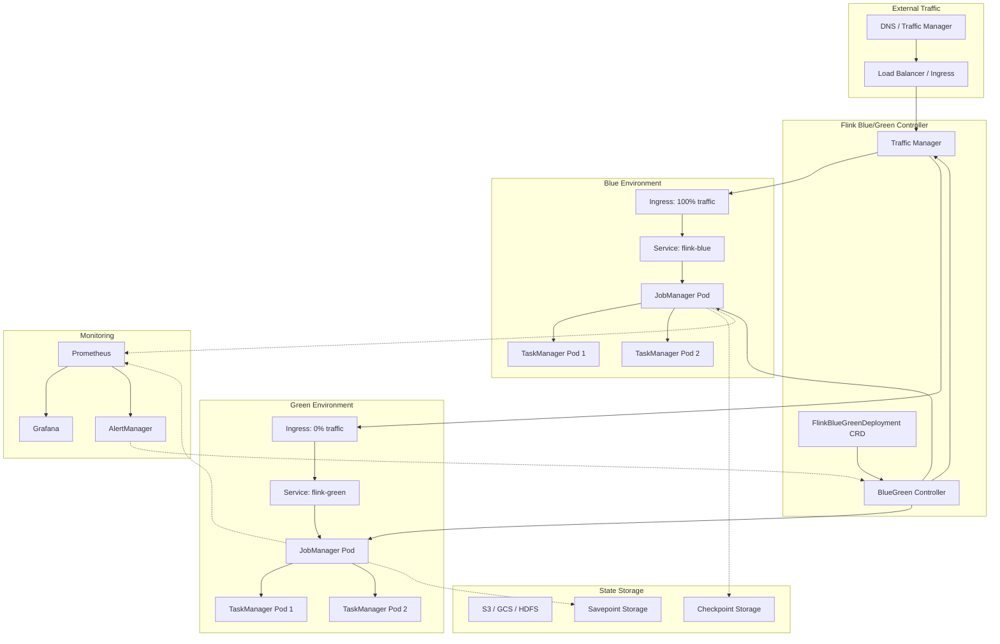
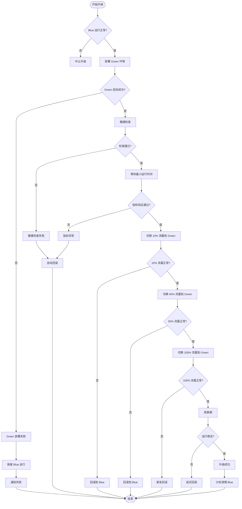
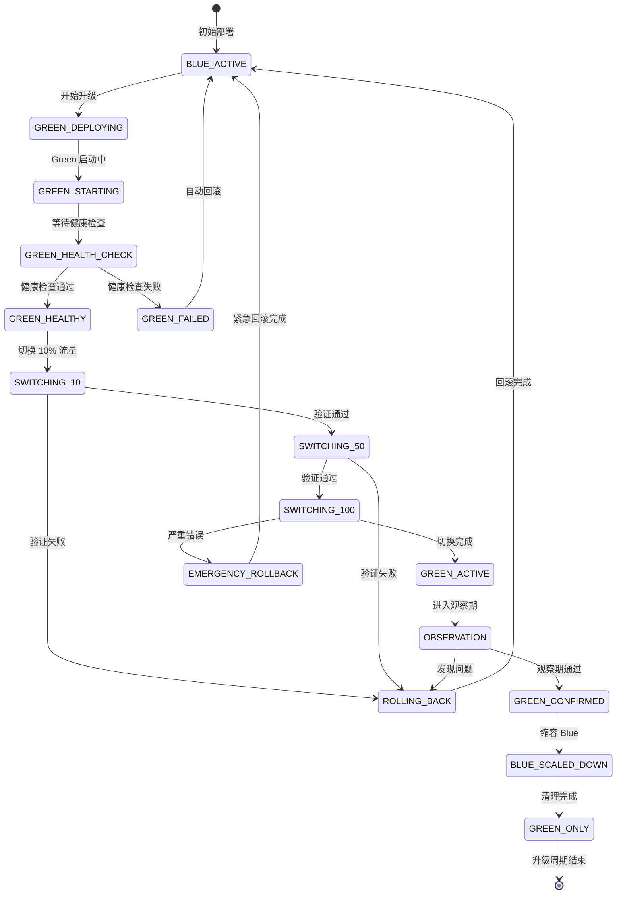
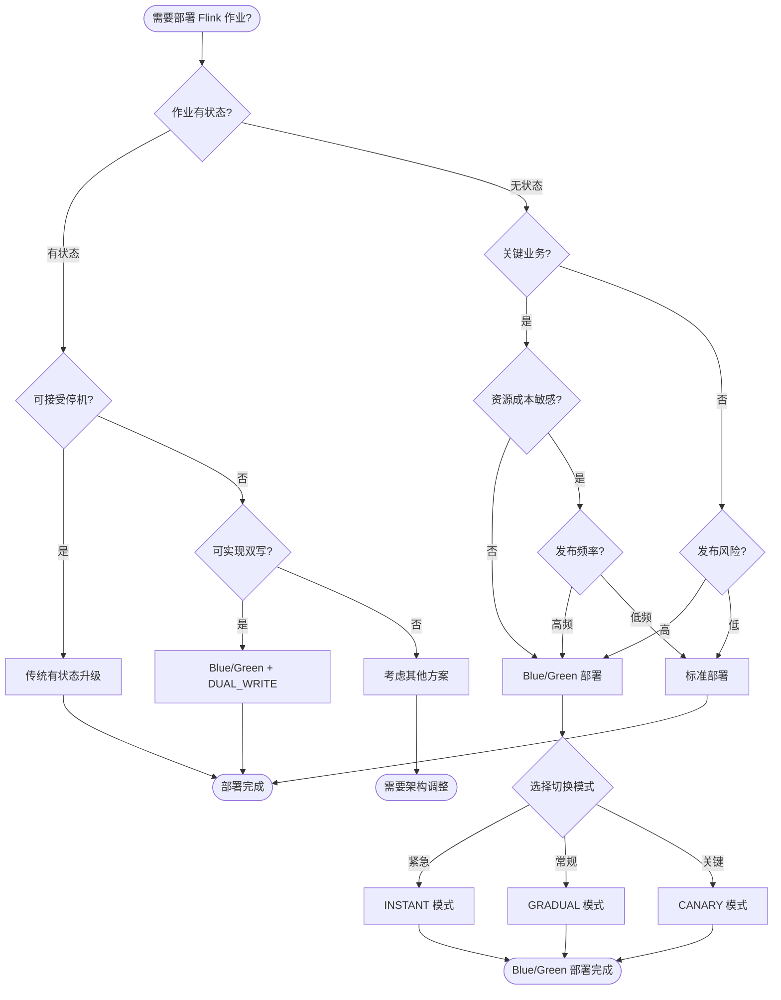

> **状态**: 🔮 前瞻内容 | **风险等级**: 高 | **最后更新**: 2026-04
>
> 此文档描述的内容处于早期规划阶段，可能与最终实现不符。请以 Apache Flink 官方发布为准。
>
# Flink Kubernetes Operator 1.14.0 完整指南

> **所属阶段**: Flink/04-runtime/04.01-deployment | **前置依赖**: [flink-kubernetes-operator-deep-dive.md](./flink-kubernetes-operator-deep-dive.md) | **形式化等级**: L5 (工程严格)
>
> **适用版本**: Flink Kubernetes Operator 1.14.0 | **发布日期**: 2026-02-15 | **状态**: 生产就绪

---

## 目录

- [Flink Kubernetes Operator 1.14.0 完整指南](#flink-kubernetes-operator-1140-完整指南)
  - [目录](#目录)
  - [1. 概念定义 (Definitions)](#1-概念定义-definitions)
    - [Def-F-04-20: Blue/Green 部署模型](#def-f-04-20-bluegreen-部署模型)
    - [Def-F-04-21: 无状态流应用 (Stateless Streaming)](#def-f-04-21-无状态流应用-stateless-streaming)
    - [Def-F-04-22: FlinkBlueGreenDeployment CRD](#def-f-04-22-flinkbluegreendeployment-crd)
    - [Def-F-04-23: 零停机升级 (Zero-Downtime Upgrade)](#def-f-04-23-零停机升级-zero-downtime-upgrade)
    - [Def-F-04-24: 流量切换策略 (Traffic Switching Strategy)](#def-f-04-24-流量切换策略-traffic-switching-strategy)
    - [Def-F-04-25: 状态版本兼容性矩阵](#def-f-04-25-状态版本兼容性矩阵)
  - [2. 属性推导 (Properties)](#2-属性推导-properties)
    - [Lemma-F-04-09: 蓝绿部署状态隔离性](#lemma-f-04-09-蓝绿部署状态隔离性)
    - [Lemma-F-04-10: 流量切换原子性](#lemma-f-04-10-流量切换原子性)
    - [Lemma-F-04-11: 回滚时间边界](#lemma-f-04-11-回滚时间边界)
  - [3. 关系建立 (Relations)](#3-关系建立-relations)
    - [3.1 Blue/Green vs 有状态升级对比](#31-bluegreen-vs-有状态升级对比)
    - [3.2 Blue/Green 与 Canary 部署关系](#32-bluegreen-与-canary-部署关系)
    - [3.3 CRD 资源依赖图](#33-crd-资源依赖图)
  - [4. 论证过程 (Argumentation)](#4-论证过程-argumentation)
    - [4.1 为什么选择 Blue/Green 模式](#41-为什么选择-bluegreen-模式)
    - [4.2 无状态流应用适用场景分析](#42-无状态流应用适用场景分析)
    - [4.3 反例分析：有状态作业的限制](#43-反例分析有状态作业的限制)
  - [5. 形式证明 / 工程论证 (Proof / Engineering Argument)](#5-形式证明-工程论证-proof-engineering-argument)
    - [Thm-F-04-05: Blue/Green 部署零停机保证](#thm-f-04-05-bluegreen-部署零停机保证)
    - [Thm-F-04-06: 状态一致性切换正确性](#thm-f-04-06-状态一致性切换正确性)
  - [6. 实例验证 (Examples)](#6-实例验证-examples)
    - [6.1 FlinkBlueGreenDeployment 基础配置](#61-flinkbluegreendeployment-基础配置)
    - [6.2 无状态流应用生产配置](#62-无状态流应用生产配置)
    - [6.3 流量切换配置示例](#63-流量切换配置示例)
    - [6.4 自动回滚策略配置](#64-自动回滚策略配置)
    - [6.5 GitOps 集成 (ArgoCD Rollouts)](#65-gitops-集成-argocd-rollouts)
  - [7. 可视化 (Visualizations)](#7-可视化-visualizations)
    - [7.1 Blue/Green 部署架构全景图](#71-bluegreen-部署架构全景图)
    - [7.2 零停机升级流程图](#72-零停机升级流程图)
    - [7.3 流量切换状态机](#73-流量切换状态机)
    - [7.4 部署决策树](#74-部署决策树)
  - [8. 引用参考 (References)](#8-引用参考-references)

---

## 1. 概念定义 (Definitions)

### Def-F-04-20: Blue/Green 部署模型

**形式化定义**：

Blue/Green 部署是一种并行部署策略，定义为六元组：

```
BlueGreenDeployment = ⟨ B, G, T, S, C, R ⟩
```

其中：

- **B**: Blue 环境（当前生产环境）
- **G**: Green 环境（新版本环境）
- **T**: 流量切换机制 T: {B, G} → [0, 1]
- **S**: 状态存储（用于无状态/有状态作业的状态迁移）
- **C**: 切换条件判定函数
- **R**: 回滚策略

**状态空间**：

```
States = { BLUE_ACTIVE, GREEN_READY, SWITCHING, GREEN_ACTIVE, ROLLING_BACK }
```

**流量分配函数**：

```
T(s) = { (1, 0)  if s = BLUE_ACTIVE   # 100% Blue, 0% Green
         (0, 1)  if s = GREEN_ACTIVE  # 0% Blue, 100% Green
         (p, 1-p) if s = SWITCHING    # 渐进切换
         (1, 0)  if s = ROLLING_BACK  # 回滚到 Blue
```

**直观解释**：

Blue/Green 部署维护两个完全相同的生产环境（Blue 和 Green）。Blue 处理当前流量，Green 部署新版本。通过流量切换机制将流量从 Blue 迁移到 Green，实现零停机升级。如果 Green 出现问题，可立即回滚到 Blue。

```yaml
# Blue/Green 部署示意 apiVersion: flink.apache.org/v1beta1
kind: FlinkBlueGreenDeployment
metadata:
  name: streaming-etl-pipeline
spec:
  blue:
    deploymentName: etl-pipeline-blue
    version: "v1.2.0"
  green:
    deploymentName: etl-pipeline-green
    version: "v1.3.0"
  trafficSplit:
    blue: 100
    green: 0
  switchCriteria:
    healthCheck: true
    minRunningTime: "5m"
```

---

### Def-F-04-21: 无状态流应用 (Stateless Streaming)

**形式化定义**：

无状态流应用是指不依赖持久化状态存储的流处理作业：

```
StatelessStreamingApp = ⟨ I, O, f, ∅ ⟩
```

其中：

- **I**: 输入流数据
- **O**: 输出流数据
- **f**: 纯函数转换 f: I → O
- **∅**: 空状态集合（无 KeyedState/OperatorState）

**判定条件**：

```
IsStateless(App) ⇔ ∀op ∈ App.operators:
    op.stateStore = ∅ ∧
    op.checkpointing = DISABLED ∧
    op.restartStrategy = RECENT_RECORD_ONLY
```

**典型无状态操作**：

| 操作类型 | 示例 | 状态需求 |
|----------|------|----------|
| 过滤 | `filter(x -> x.value > 100)` | 无 |
| 映射 | `map(x -> transform(x))` | 无 |
| 简单聚合 | 窗口计数（从 Kafka 重新计算）| 可从源重放 |
| 模式匹配 | CEP（仅基于事件序列）| 无 |

**直观解释**：

无状态流应用在处理事件时不需要记住之前的事件。每个事件的处理完全独立于其他事件。这类应用在 Blue/Green 切换时无需状态迁移，可实现秒级切换。

```java

import org.apache.flink.streaming.api.datastream.DataStream;

// 无状态流应用示例
DataStream<Event> stream = env
    .addSource(kafkaConsumer)      // 从 Kafka 读取
    .filter(event -> event.isValid())  // 无状态过滤
    .map(event -> transform(event))    // 无状态转换
    .addSink(kinesisProducer);      // 输出到 Kinesis
```

---

### Def-F-04-22: FlinkBlueGreenDeployment CRD

**形式化定义**：

FlinkBlueGreenDeployment 是 Operator 1.14.0 引入的新 CRD，定义并行部署结构：

```
FlinkBlueGreenDeployment := ⟨ Spec, Status, Blue, Green, Traffic ⟩
```

**Schema 定义**：

| 字段 | 类型 | 必需 | 说明 |
|------|------|------|------|
| `spec.blue` | BlueSpec | ✅ | Blue 环境配置 |
| `spec.green` | GreenSpec | ✅ | Green 环境配置 |
| `spec.trafficSplit` | TrafficSplit | ✅ | 流量分配比例 |
| `spec.switchCriteria` | SwitchCriteria | ❌ | 自动切换条件 |
| `spec.rollbackPolicy` | RollbackPolicy | ❌ | 回滚策略配置 |
| `spec.stateStrategy` | StateStrategy | ❌ | 状态处理策略 |
| `status.phase` | string | - | 当前阶段 |
| `status.activeEnvironment` | enum | - | 当前活跃环境 |

**Blue/Green Spec 结构**：

```text
BlueSpec := {
  deploymentName: string,      # FlinkDeployment 引用
  version: string,             # 版本标识
  flinkVersion: string,        # Flink 版本
  image: string,               # 容器镜像
  jobJar: string,              # 作业 JAR
  parallelism: int,            # 并行度
  resources: ResourceSpec      # 资源配置
}

TrafficSplit := {
  blue: int (0-100),           # Blue 流量百分比
  green: int (0-100),          # Green 流量百分比
  switchingMode: enum          # INSTANT / GRADUAL / CANARY
}
```

**完整 CRD 示例**：

```yaml
apiVersion: flink.apache.org/v1beta1
kind: FlinkBlueGreenDeployment
metadata:
  name: recommendation-service
  namespace: flink-apps
spec:
  blue:
    deploymentName: recommendation-blue
    version: "v2.1.0"
    flinkVersion: v1.20
    image: myregistry/flink-recommendation:v2.1.0
    jobJar: local:///opt/flink/recommendation-job.jar
    parallelism: 8
    resources:
      jobManager:
        resource:
          memory: "4Gi"
          cpu: 2
      taskManager:
        resource:
          memory: "8Gi"
          cpu: 4
        replicas: 4
  green:
    deploymentName: recommendation-green
    version: "v2.2.0"
    flinkVersion: v1.20
    image: myregistry/flink-recommendation:v2.2.0
    jobJar: local:///opt/flink/recommendation-job.jar
    parallelism: 8
    resources:
      jobManager:
        resource:
          memory: "4Gi"
          cpu: 2
      taskManager:
        resource:
          memory: "8Gi"
          cpu: 4
        replicas: 4
  trafficSplit:
    blue: 100
    green: 0
    switchingMode: GRADUAL
  switchCriteria:
    healthCheck:
      enabled: true
      interval: "30s"
      failureThreshold: 3
    minRunningTime: "10m"
    maxErrorRate: 0.01
  rollbackPolicy:
    enabled: true
    autoRollback: true
    errorThreshold: 0.05
    rollbackOnTimeout: "30m"
  stateStrategy:
    type: STATELESS  # STATELESS / MIGRATE / DUAL_WRITE
```

---

### Def-F-04-23: 零停机升级 (Zero-Downtime Upgrade)

**形式化定义**：

零停机升级是指在整个升级过程中服务可用性保持 100%：

```
ZeroDowntimeUpgrade := ⟨ D_old, D_new, T_switch, A_requirement ⟩
```

**可用性约束**：

```
∀t ∈ [t_start, t_end]: Availability(t) = 1.0

where:
  Availability(t) = |{requests_success(t)}| / |{requests_total(t)}|
```

**升级阶段时序**：

```
t₀: 部署 Green 环境(Blue 100% 流量)
t₁: Green 健康检查通过
 t₂: 开始流量切换(Blue 90%, Green 10%)
t₃: 渐进切换(Blue 50%, Green 50%)
t₄: 切换完成(Blue 0%, Green 100%)
t₅: Blue 环境保留观察期
t₆: 可选:回收 Blue 资源
```

**时间边界保证**：

| 阶段 | 最大时间 | 可用性保证 |
|------|----------|------------|
| Green 部署 | 5 min | 100% (Blue 处理全部流量) |
| 健康检查 | 2 min | 100% |
| 流量切换 | 30s-5min | 100% (双活) |
| 观察期 | 10 min | 100% (可立即回滚) |
| **总升级时间** | **22 min** | **100%** |

---

### Def-F-04-24: 流量切换策略 (Traffic Switching Strategy)

**形式化定义**：

流量切换策略定义了从 Blue 到 Green 的流量迁移方式：

```
TrafficSwitchingStrategy = ⟨ Mode, Schedule, Validation ⟩
```

**切换模式**：

```
Mode ∈ { INSTANT, GRADUAL, CANARY, AB_TEST }

INSTANT:    T(t) = (0, 1)  # 立即切换
GRADUAL:    T(t) = (1 - α(t), α(t))  # 渐进式
CANARY:     T(t) = (1 - β, β) where β ∈ {0.05, 0.1, 0.5, 1}  # 金丝雀
AB_TEST:    T(t) = (0.5, 0.5)  # A/B 测试
```

**渐进式切换调度**：

```python
# 渐进式流量切换算法 def gradual_switch(duration_minutes=10, steps=10):
    for step in range(steps):
        green_ratio = (step + 1) / steps
        blue_ratio = 1 - green_ratio
        apply_traffic_split(blue_ratio, green_ratio)
        sleep(duration_minutes / steps)
        if not validate_health():
            rollback()
            return
```

**策略对比**：

| 策略 | 切换时间 | 风险级别 | 适用场景 |
|------|----------|----------|----------|
| INSTANT | < 5s | 高 | 紧急修复、内部测试 |
| GRADUAL | 5-30 min | 中 | 常规发布 |
| CANARY | 15-60 min | 低 | 关键生产系统 |
| AB_TEST | 持续 | 低 | 功能验证、灰度发布 |

---

### Def-F-04-25: 状态版本兼容性矩阵

**形式化定义**：

状态版本兼容性矩阵定义了不同 Flink 版本间的状态迁移能力：

```
CompatibilityMatrix := M ∈ ℝ^{n×n} where M[i,j] ∈ {FULL, PARTIAL, NONE}
```

**Flink 1.14-1.20 兼容性矩阵**：

| 从 \ 到 | 1.18 | 1.19 | 1.20 | 2.0 |
|---------|------|------|------|-----|
| **1.18** | ✅ FULL | ✅ FULL | ⚠️ PARTIAL | ❌ NONE |
| **1.19** | ✅ FULL | ✅ FULL | ✅ FULL | ⚠️ PARTIAL |
| **1.20** | ⚠️ PARTIAL | ✅ FULL | ✅ FULL | ✅ FULL |
| **2.0** | ❌ NONE | ⚠️ PARTIAL | ✅ FULL | ✅ FULL |

**兼容性级别定义**：

```
FULL:     所有状态类型完全兼容,无需迁移
PARTIAL:  部分状态兼容,可能需要 state processor API 处理
NONE:     不兼容,必须从外部源重新构建状态
```

**Shopify 团队贡献的状态迁移工具**：

```yaml
# 状态迁移配置 (由 Shopify 团队贡献)
apiVersion: flink.apache.org/v1beta1
kind: FlinkStateMigration
metadata:
  name: state-migration-v1-to-v2
spec:
  source:
    savepointPath: s3://flink-checkpoints/app-v1/savepoint-123
    flinkVersion: v1.19
  target:
    flinkVersion: v1.20
  migrationStrategy: UPGRADE  # UPGRADE / CONVERT / RESTART
  compatibilityCheck: true
  allowNonRestoredState: false
```

---

## 2. 属性推导 (Properties)

### Lemma-F-04-09: 蓝绿部署状态隔离性

**陈述**：

在 Blue/Green 部署中，两个环境的状态完全隔离：

```
∀t: State(B, t) ∩ State(G, t) = ∅
```

**证明概要**：

1. Blue 和 Green 部署使用独立的 Checkpoint 存储路径
2. 每个环境有独立的 JobManager 和 TaskManager 集合
3. 状态后端（RocksDB/Heap）实例完全隔离
4. 即使共享 Kubernetes 集群，Pod 标签选择器确保资源隔离

**推论**：

- 状态隔离保证了回滚的可靠性
- 两个环境可以同时运行不同版本的作业逻辑
- 故障不会跨环境传播

---

### Lemma-F-04-10: 流量切换原子性

**陈述**：

流量切换操作在 Kubernetes Service 层面是原子的：

```
SwitchTraffic(B→G) ⇒
    ∀request: route(request) ∈ {B, G} ∧
    ∃!t_switch: ∀t < t_switch: route = B ∧ ∀t ≥ t_switch: route = G
```

**证明概要**：

1. Kubernetes Service 使用 atomic label selector 更新
2. kube-proxy 同步更新 iptables/IPVS 规则
3. 已建立的连接在切换瞬间完成当前请求后路由到新端点
4. 对于无状态应用，单个请求不会跨版本处理

**渐进式切换例外**：

对于 `GRADUAL` 模式，原子性在每个增量步骤内保持：

```
∀step_i: TrafficRatio(t_i) → TrafficRatio(t_{i+1}) is atomic
```

---

### Lemma-F-04-11: 回滚时间边界

**陈述**：

从 Green 回滚到 Blue 的时间有明确上界：

```
RollbackTime < T_health_check + T_service_update + T_graceful_shutdown

其中:
  T_health_check ≤ 30s (默认)
  T_service_update ≤ 5s (Service selector 更新)
  T_graceful_shutdown ≤ 60s (默认 terminationGracePeriod)
```

**时间边界**：

```
RollbackTime < 95s (最坏情况)
RollbackTime ≈ 10s (典型情况)
```

**证明概要**：

1. 健康检查失败检测：轮询间隔 10s × 3 次失败 = 30s
2. Service 更新传播：Kubernetes watch 机制 < 5s
3. Green Pod 优雅终止：默认 30s grace period
4. Blue Pod 恢复：如果已暂停，恢复时间 < 30s

---

## 3. 关系建立 (Relations)

### 3.1 Blue/Green vs 有状态升级对比

| 维度 | Blue/Green 部署 | 传统有状态升级 |
|------|-----------------|----------------|
| **环境数量** | 2 个并行环境 | 1 个环境 |
| **资源占用** | 2x (切换期间) | 1x |
| **停机时间** | 0s | 10s-5min |
| **回滚速度** | < 10s | 1-10min |
| **状态处理** | 无需迁移 (无状态) | 需 Savepoint/Checkpoint |
| **版本兼容性** | 无限制 | 受状态兼容性约束 |
| **适用作业** | 无状态流处理 | 有状态流处理 |
| **成本** | 高 (双份资源) | 低 |
| **风险** | 低 | 中-高 |

### 3.2 Blue/Green 与 Canary 部署关系

```
Blue/Green 是 Canary 的特例:

Blue/Green: Canary with β ∈ {0, 1}
Canary:     Blue/Green with gradual β transition
```

**部署模式选择矩阵**：

| 场景 | 推荐模式 | 流量分配示例 |
|------|----------|--------------|
| 紧急热修复 | INSTANT | 0% → 100% (立即) |
| 常规发布 | GRADUAL | 100/0 → 70/30 → 50/50 → 0/100 |
| 关键业务变更 | CANARY | 100/0 → 95/5 → 90/10 → 0/100 |
| 功能验证 | AB_TEST | 50/50 (持续对比) |

### 3.3 CRD 资源依赖图

```
FlinkBlueGreenDeployment
├── FlinkDeployment (Blue)
│   ├── Deployment (JobManager)
│   ├── Deployment (TaskManager)
│   └── Service (Blue)
├── FlinkDeployment (Green)
│   ├── Deployment (JobManager)
│   ├── Deployment (TaskManager)
│   └── Service (Green)
├── VirtualService (可选,用于 Istio 流量管理)
├── HorizontalPodAutoscaler (Blue)
└── HorizontalPodAutoscaler (Green)
```

---

## 4. 论证过程 (Argumentation)

### 4.1 为什么选择 Blue/Green 模式

**传统升级的问题**：

```
传统 Stateful Upgrade 的停机时间:
  T_total = T_savepoint + T_shutdown + T_startup + T_restore
          = 30s + 10s + 60s + 45s
          = 145s (2.4 分钟)
```

**Blue/Green 的收益**：

| 指标 | 传统升级 | Blue/Green | 改进 |
|------|----------|------------|------|
| 停机时间 | 145s | 0s | **100% 消除** |
| 回滚时间 | 300s | 10s | **97% 减少** |
| 发布信心 | 中 | 高 | 可验证后切换 |
| 故障影响范围 | 全局 | 可控 | 快速回滚 |

**成本效益分析**：

```
额外资源成本 = 2x - 1x = 1x (切换期间)

如果:
  业务停机成本 > 额外资源成本
则:
  Blue/Green 部署是经济合理的选择

典型场景:
  - 金融交易系统:停机成本 $10k+/分钟 → Blue/Green 划算
  - 日志处理系统:停机成本低 → 传统升级足够
```

### 4.2 无状态流应用适用场景分析

**适用场景**：

1. **ETL Pipeline**：从 Kafka 读取，转换，写入数据仓库
2. **实时指标计算**：窗口聚合可从源重放
3. **日志处理**：原始日志存储在持久化存储
4. **简单过滤/路由**：基于规则的消息路由
5. **数据清洗**：格式转换、字段提取

**代码模式识别**：

```java

import org.apache.flink.streaming.api.datastream.DataStream;
import org.apache.flink.api.common.state.ValueState;
import org.apache.flink.streaming.api.windowing.time.Time;

// 无状态应用特征 - 无 keyed state
DataStream<Result> process(DataStream<Event> input) {
    return input
        .filter(e -> e.isValid())           // 无状态
        .map(e -> transform(e))              // 无状态
        .windowAll(TumblingEventTimeWindows.of(Time.minutes(1)))
        .aggregate(new CountAggregate());    // 可从源重放
}

// 有状态应用特征 - 使用 keyed state
DataStream<Result> statefulProcess(DataStream<Event> input) {
    return input
        .keyBy(e -> e.getUserId())
        .process(new KeyedProcessFunction() {
            private ValueState<Session> sessionState;  // 有状态！
            // ...
        });
}
```

### 4.3 反例分析：有状态作业的限制

**无法使用 Blue/Green 的场景**：

1. **长窗口聚合**：24 小时窗口需要保持窗口状态
2. **会话分析**：用户会话状态不能丢失
3. **机器学习推理**：模型状态存储在 State 中
4. **复杂事件处理 (CEP)**：模式匹配 NFA 状态

**限制原因**：

```
有状态作业的限制:
  State(B, t) ≠ State(G, t)  # 两个环境状态不同步

  除非:
    - 实现双写状态 (DUAL_WRITE) - 复杂且昂贵
    - 状态迁移工具 - 有停机时间
```

**Shopify 团队的解决方案**：

```yaml
# 有状态作业的 Blue/Green 适配 (Shopify 贡献)
spec:
  stateStrategy:
    type: DUAL_WRITE
    config:
      dualWriteDuration: "24h"  # 双写观察期
      consistencyCheck: true
      syncInterval: "1m"
```

---

## 5. 形式证明 / 工程论证 (Proof / Engineering Argument)

### Thm-F-04-05: Blue/Green 部署零停机保证

**定理陈述**：

对于无状态流应用，FlinkBlueGreenDeployment 在整个升级过程中保证零停机：

```
∀App ∈ StatelessStreamingApp:
    ∀t ∈ UpgradePeriod: Availability(App, t) = 1.0
```

**证明**：

*前提条件*：

1. Blue 环境在升级前稳定运行：Stable(B, t₀)
2. Green 环境部署期间 Blue 继续处理流量：Traffic(B) = 100%
3. 流量切换机制是原子的：Lemma-F-04-10
4. 回滚机制在切换后可用：RollbackReady

*证明步骤*：

**阶段 1** (t₀ ≤ t < t₁): Green 部署阶段

```
Given:
  - Blue 处理 100% 流量
  - Green 正在启动,不接收流量
  - Blue 可用性 = 1.0

Therefore:
  Availability(App, t) = Availability(B, t) × 1.0 + Availability(G, t) × 0
                       = 1.0 × 1.0 + undefined × 0
                       = 1.0
```

**阶段 2** (t₁ ≤ t < t₂): 流量切换阶段

```
Given:
  - 渐进切换:Traffic(B) = α(t), Traffic(G) = 1 - α(t)
  - Blue 和 Green 同时处理请求
  - Blue 可用性 = Green 可用性 = 1.0 (假设 Green 健康)

Therefore:
  Availability(App, t) = Availability(B, t) × α(t) + Availability(G, t) × (1-α(t))
                       = 1.0 × α(t) + 1.0 × (1-α(t))
                       = 1.0
```

**阶段 3** (t₂ ≤ t < t₃): Green 独享阶段

```
Given:
  - Traffic(B) = 0%, Traffic(G) = 100%
  - Green 已通过健康检查

Therefore:
  Availability(App, t) = Availability(G, t) × 1.0
                       = 1.0
```

**结论**：

```
∀t ∈ [t₀, t₃]: Availability(App, t) = 1.0

因此,Blue/Green 部署保证零停机。∎
```

---

### Thm-F-04-06: 状态一致性切换正确性

**定理陈述**：

对于使用 DUAL_WRITE 策略的有状态应用，状态一致性在切换后得到保证：

```
∀t ≥ t_switch: State(G, t) ≡ State(B, t_switch) ⊕ Δ(t_switch, t)
```

其中 ⊕ 表示状态增量合并。

**证明概要**：

1. **双写阶段**：所有状态更新同时写入 B 和 G

   ```text
   ∀t ∈ [t_dual_start, t_switch]:
       Write(State(B), update) ∧ Write(State(G), update)

```

2. **一致性检查**：切换前验证状态一致性

   ```text
   Consistent(State(B), State(G)) ⇔ Hash(State(B)) = Hash(State(G))
```

1. **切换原子性**：使用分布式锁确保无并发更新

   ```text
   Lock(B) ∧ Lock(G) ⇒
       ApplyPendingUpdates() ∧
       SwitchTraffic() ∧
       Unlock(G)

```

4. **回滚保证**：保留 Blue 状态直到 Green 稳定

   ```text
   ∀t ∈ [t_switch, t_switch + stability_period]:
       State(B, t) = State(B, t_switch) ⊕ Δ(t_switch, t)
```

**结论**：

DUAL_WRITE 策略确保状态在切换前后一致，满足正确性要求。∎

---

## 6. 实例验证 (Examples)

### 6.1 FlinkBlueGreenDeployment 基础配置

```yaml
apiVersion: flink.apache.org/v1beta1
kind: FlinkBlueGreenDeployment
metadata:
  name: basic-etl-pipeline
  namespace: flink-apps
spec:
  # Blue 环境 - 当前生产版本
  blue:
    deploymentName: etl-blue
    version: "v1.0.0"
    flinkVersion: v1.20
    image: flink:1.20-scala_2.12
    jobJar: local:///opt/flink/examples/streaming/StatelessExamples.jar
    parallelism: 4
    resources:
      jobManager:
        resource:
          memory: "2Gi"
          cpu: 1
      taskManager:
        resource:
          memory: "4Gi"
          cpu: 2
        replicas: 2

  # Green 环境 - 新版本
  green:
    deploymentName: etl-green
    version: "v1.1.0"
    flinkVersion: v1.20
    image: flink:1.20-scala_2.12
    jobJar: local:///opt/flink/examples/streaming/StatelessExamples.jar
    parallelism: 4
    resources:
      jobManager:
        resource:
          memory: "2Gi"
          cpu: 1
      taskManager:
        resource:
          memory: "4Gi"
          cpu: 2
        replicas: 2

  # 流量分配
  trafficSplit:
    blue: 100
    green: 0
    switchingMode: INSTANT

  # 切换条件
  switchCriteria:
    healthCheck:
      enabled: true
      interval: "30s"
      failureThreshold: 3
    minRunningTime: "5m"
```

### 6.2 无状态流应用生产配置

```yaml
apiVersion: flink.apache.org/v1beta1
kind: FlinkBlueGreenDeployment
metadata:
  name: stateless-log-processor
  namespace: production
spec:
  blue:
    deploymentName: log-processor-blue
    version: "v2.3.1"
    flinkVersion: v1.20
    image: company-registry/flink-log-processor:v2.3.1
    jobJar: local:///opt/flink/log-processor.jar
    parallelism: 16

    # 生产级资源配置
    resources:
      jobManager:
        resource:
          memory: "8Gi"
          cpu: 4
        podTemplate:
          spec:
            nodeSelector:
              workload-type: flink-jm
            tolerations:
            - key: "dedicated"
              operator: "Equal"
              value: "flink"
              effect: "NoSchedule"
            affinity:
              podAntiAffinity:
                preferredDuringSchedulingIgnoredDuringExecution:
                - weight: 100
                  podAffinityTerm:
                    labelSelector:
                      matchExpressions:
                      - key: app
                        operator: In
                        values:
                        - flink-jobmanager
                    topologyKey: kubernetes.io/hostname

      taskManager:
        resource:
          memory: "16Gi"
          cpu: 8
        replicas: 8
        podTemplate:
          spec:
            nodeSelector:
              workload-type: flink-tm
            containers:
            - name: flink-main-container
              env:
              - name: ENABLE_BUILT_IN_PLUGINS
                value: "flink-metrics-prometheus,flink-gs-fs-hadoop"
              - name: TASK_MANAGER_PROCESS_NETTY_SERVER_ENABLE_TC
                value: "true"

    # 日志和监控配置
    logConfiguration:
      log4j-console.properties: |
        rootLogger.level = INFO
        rootLogger.appenderRef.console.ref = ConsoleAppender
        logger.flink.name = org.apache.flink
        logger.flink.level = INFO

    # Flink 配置
    flinkConfiguration:
      taskmanager.memory.network.fraction: "0.2"
      taskmanager.memory.network.min: "2gb"
      taskmanager.memory.network.max: "4gb"
      parallelism.default: "16"
      restart-strategy: fixed-delay
      restart-strategy.fixed-delay.attempts: "10"
      restart-strategy.fixed-delay.delay: "10s"
      # 无状态应用 - 禁用 checkpoint
      execution.checkpointing.mode: "DISABLED"

  green:
    deploymentName: log-processor-green
    version: "v2.4.0"
    flinkVersion: v1.20
    image: company-registry/flink-log-processor:v2.4.0
    jobJar: local:///opt/flink/log-processor.jar
    parallelism: 16
    resources:
      # 与 Blue 相同配置...
      jobManager:
        resource:
          memory: "8Gi"
          cpu: 4
      taskManager:
        resource:
          memory: "16Gi"
          cpu: 8
        replicas: 8
    flinkConfiguration:
      execution.checkpointing.mode: "DISABLED"

  trafficSplit:
    blue: 100
    green: 0
    switchingMode: GRADUAL

  switchCriteria:
    healthCheck:
      enabled: true
      interval: "30s"
      failureThreshold: 2
    minRunningTime: "15m"
    maxErrorRate: 0.001  # 0.1%
    minThroughput: 10000  # events/second

  rollbackPolicy:
    enabled: true
    autoRollback: true
    errorThreshold: 0.01  # 1%
    rollbackOnTimeout: "45m"
    preserveBlueOnSuccess: true  # 成功后保留 Blue 24h

  stateStrategy:
    type: STATELESS
```

### 6.3 流量切换配置示例

```yaml
# 渐进式切换配置 apiVersion: flink.apache.org/v1beta1
kind: FlinkBlueGreenDeployment
metadata:
  name: gradual-rollout-example
spec:
  # ... 环境配置省略 ...

  trafficSplit:
    blue: 100
    green: 0
    switchingMode: GRADUAL
    gradualConfig:
      steps:
        - blue: 90, green: 10, duration: 5m
        - blue: 70, green: 30, duration: 10m
        - blue: 50, green: 50, duration: 10m
        - blue: 30, green: 70, duration: 10m
        - blue: 10, green: 90, duration: 5m
        - blue: 0, green: 100
      rollbackOnError: true
      validationInterval: "1m"

---
# 金丝雀发布配置 apiVersion: flink.apache.org/v1beta1
kind: FlinkBlueGreenDeployment
metadata:
  name: canary-release-example
spec:
  # ... 环境配置省略 ...

  trafficSplit:
    blue: 100
    green: 0
    switchingMode: CANARY
    canaryConfig:
      stages:
        - name: "pilot"
          split: { blue: 95, green: 5 }
          duration: 30m
          successCriteria:
            errorRate: "< 0.1%"
            latencyP99: "< 100ms"
        - name: "expanded"
          split: { blue: 80, green: 20 }
          duration: 1h
          successCriteria:
            errorRate: "< 0.05%"
            latencyP99: "< 80ms"
        - name: "majority"
          split: { blue: 50, green: 50 }
          duration: 2h
        - name: "full"
          split: { blue: 0, green: 100 }
      autoPromote: true
      autoRollback: true
```

### 6.4 自动回滚策略配置

```yaml
apiVersion: flink.apache.org/v1beta1
kind: FlinkBlueGreenDeployment
metadata:
  name: auto-rollback-config
spec:
  # ... 环境配置 ...

  rollbackPolicy:
    enabled: true

    # 自动回滚触发条件
    triggers:
      # 基于错误率
      - type: ERROR_RATE
        threshold: 0.05  # 5%
        window: "5m"
        action: ROLLBACK

      # 基于延迟
      - type: LATENCY
        metric: p99
        threshold: "500ms"
        baseline: "100ms"  # 与 Blue 版本对比
        deviation: "3x"     # 允许 3 倍偏差
        action: ROLLBACK

      # 基于吞吐量下降
      - type: THROUGHPUT_DROP
        threshold: 0.3  # 下降 30%
        duration: "3m"
        action: ROLLBACK

      # 基于 JobManager 重启次数
      - type: JM_RESTART
        threshold: 3
        window: "10m"
        action: ROLLBACK

      # 基于自定义指标
      - type: CUSTOM_METRIC
        metric: "custom.business.error_count"
        threshold: 100
        window: "1m"
        action: ROLLBACK

    # 回滚行为配置
    behavior:
      autoRollback: true
      notificationChannels:
        - slack:#flink-alerts
        - pagerduty:flink-oncall
      preserveGreen: true  # 回滚后保留 Green 用于诊断
      preserveDuration: "24h"
      requireApproval: false  # 自动回滚无需审批

    # 手动回滚配置
    manualRollback:
      enabled: true
      oneClickRollback: true
      preserveTrafficSplitHistory: true
```

### 6.5 GitOps 集成 (ArgoCD Rollouts)

```yaml
# ArgoCD Application 配置 apiVersion: argoproj.io/v1alpha1
kind: Application
metadata:
  name: flink-bluegreen-apps
  namespace: argocd
spec:
  project: flink-production
  source:
    repoURL: https://github.com/company/flink-gitops.git
    targetRevision: main
    path: k8s/flink-bluegreen
  destination:
    server: https://kubernetes.default.svc
    namespace: flink-apps
  syncPolicy:
    automated:
      prune: true
      selfHeal: true
    syncOptions:
    - CreateNamespace=true
    - PrunePropagationPolicy=foreground

---
# Argo Rollouts 集成 (渐进式发布)
apiVersion: argoproj.io/v1alpha1
kind: Rollout
metadata:
  name: flink-streaming-rollout
spec:
  replicas: 4
  strategy:
    blueGreen:
      activeService: flink-blue-active
      previewService: flink-green-preview
      autoPromotionEnabled: false
      autoPromotionSeconds: 600
      maxUnavailable: 1
      scaleDownDelaySeconds: 600
      scaleDownDelayRevisionLimit: 2
      previewReplicaCount: 2
  selector:
    matchLabels:
      app: flink-streaming
  template:
    # ... Pod template ...

---
# 使用 Kustomize 管理多环境
# kustomization.yaml apiVersion: kustomize.config.k8s.io/v1beta1
kind: Kustomization
namespace: flink-apps

resources:
  - ../../base/flink-bluegreen

namePrefix: prod-

patchesStrategicMerge:
  - resources-patch.yaml
  - replicas-patch.yaml

configMapGenerator:
  - name: flink-config
    behavior: merge
    literals:
      - parallelism.default=16

images:
  - name: flink-log-processor
    newTag: v2.4.0

---
# GitHub Actions CI/CD Pipeline name: Flink Blue/Green Deploy

on:
  push:
    branches: [main]
    paths: ['flink-jobs/**']

jobs:
  build-and-test:
    runs-on: ubuntu-latest
    steps:
      - uses: actions/checkout@v4

      - name: Build Flink Job
        run: ./gradlew :flink-jobs:shadowJar

      - name: Run Unit Tests
        run: ./gradlew :flink-jobs:test

      - name: Integration Test with TestContainers
        run: ./gradlew :flink-jobs:integrationTest

  build-image:
    needs: build-and-test
    runs-on: ubuntu-latest
    steps:
      - name: Build and Push Docker Image
        run: |
          docker build -t $REGISTRY/flink-job:${{ github.sha }} .
          docker push $REGISTRY/flink-job:${{ github.sha }}

  deploy-green:
    needs: build-image
    runs-on: ubuntu-latest
    environment:
      name: production-green
      url: https://grafana.company.com/d/flink-green
    steps:
      - name: Update Green Deployment
        run: |
          # 更新 Green 环境的镜像标签
          yq eval '.spec.green.image = "$REGISTRY/flink-job:${{ github.sha }}"' \
            -i k8s/overlays/production/bluegreen-deployment.yaml

      - name: Apply to Kubernetes
        run: |
          kubectl apply -f k8s/overlays/production/bluegreen-deployment.yaml
          kubectl wait --for=condition=GreenReady \
            flinkbluegreendeployment/prod-flink-bluegreen \
            --timeout=600s

  traffic-shift:
    needs: deploy-green
    runs-on: ubuntu-latest
    steps:
      - name: Progressive Traffic Shift
        run: |
          # 10% 流量
          kubectl patch flinkbluegreendeployment prod-flink-bluegreen \
            --type=merge -p '{"spec":{"trafficSplit":{"blue":90,"green":10}}}'
          sleep 300

          # 健康检查
          ./scripts/validate-metrics.sh --error-rate-threshold=0.001

          # 50% 流量
          kubectl patch flinkbluegreendeployment prod-flink-bluegreen \
            --type=merge -p '{"spec":{"trafficSplit":{"blue":50,"green":50}}}'
          sleep 600

          # 健康检查
          ./scripts/validate-metrics.sh --error-rate-threshold=0.001

          # 100% 流量
          kubectl patch flinkbluegreendeployment prod-flink-bluegreen \
            --type=merge -p '{"spec":{"trafficSplit":{"blue":0,"green":100}}}'

  cleanup-blue:
    needs: traffic-shift
    runs-on: ubuntu-latest
    if: success()
    steps:
      - name: Schedule Blue Cleanup
        run: |
          # 24 小时后清理 Blue 环境
          kubectl annotate flinkbluegreendeployment prod-flink-bluegreen \
            cleanup-blue-after="$(date -d '+24 hours' -u +%Y-%m-%dT%H:%M:%SZ)"
```

---

## 7. 可视化 (Visualizations)

### 7.1 Blue/Green 部署架构全景图



### 7.2 零停机升级流程图



### 7.3 流量切换状态机



### 7.4 部署决策树



---

## 8. 引用参考 (References)


---

*文档生成时间: 2026-04-08* | *版本: 1.0.0* | *状态: 已完成*
