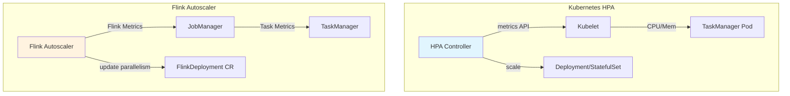
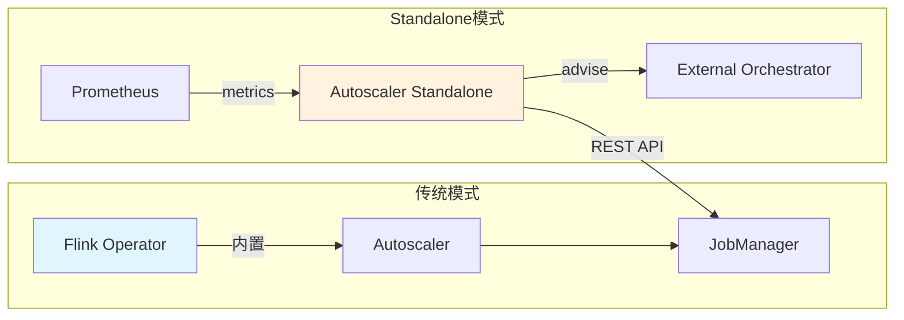
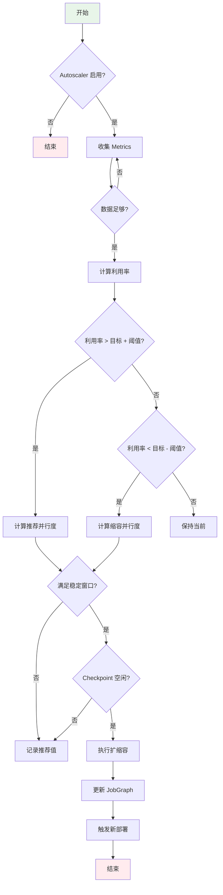
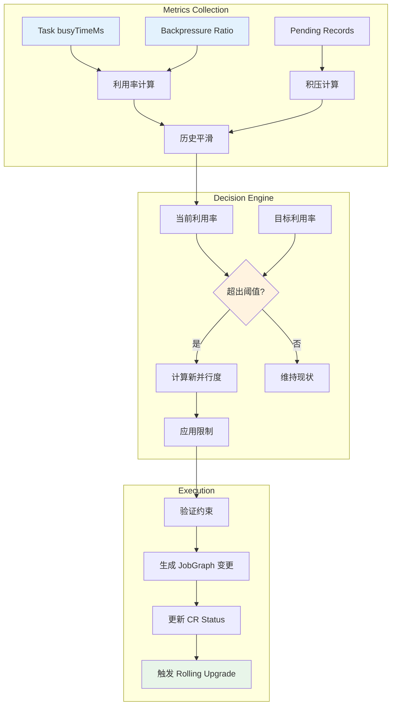
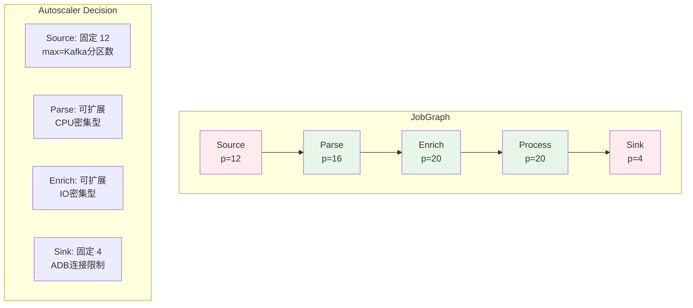
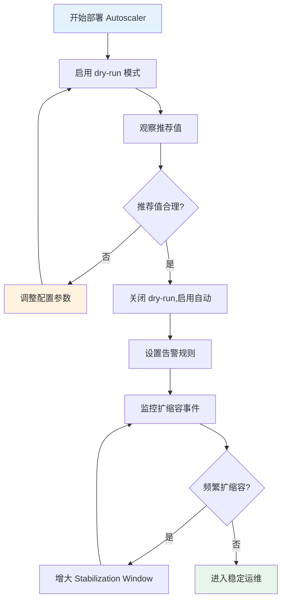

# Flink Kubernetes Operator 自动扩缩容深度指南

> 所属阶段: Flink | 前置依赖: [Flink Kubernetes Operator深度指南](./flink-kubernetes-operator-deep-dive.md) | 形式化等级: L4

---

## 1. 概念定义 (Definitions)

### Def-F-10-30: Autoscaler 架构定义

Flink Kubernetes Operator Autoscaler 是一个**声明式自动扩缩容系统**，其形式化定义为：

```
Autoscaler = ⟨Controller, Evaluator, Executor, MetricsBackend⟩

其中:
- Controller: 监听 FlinkDeployment CRD 变更,协调扩缩容决策
- Evaluator: 基于历史指标计算目标并行度
- Executor: 执行扩缩容操作,更新 JobGraph
- MetricsBackend: 存储时序指标(默认使用 JobManager 内存存储)
```

Autoscaler 在 Kubernetes 层面的集成点：

```
┌─────────────────────────────────────────────────────────────┐
│                    Kubernetes Cluster                       │
│  ┌─────────────────┐         ┌──────────────────────────┐   │
│  │  Flink Operator │◄────────│ FlinkDeployment CRD      │   │
│  │  - Controller   │  watch  │ - spec.autoscaler.enabled│   │
│  │  - Evaluator    │         │ - status.recommendedPar  │   │
│  └────────┬────────┘         └──────────────────────────┘   │
│           │                                                 │
│           ▼                                                 │
│  ┌─────────────────┐         ┌──────────────────────────┐   │
│  │  Flink Job      │◄────────│  JobManager REST API     │   │
│  │  - TaskManagers │  metrics│  - /jobs/:id/metrics     │   │
│  │  - JobGraph     │         │  - /taskmanagers/metrics │   │
│  └─────────────────┘         └──────────────────────────┘   │
└─────────────────────────────────────────────────────────────┘
```

### Def-F-10-31: 背压 (Backpressure) 形式化定义

**Def-F-10-31**: 背压是数据生产者速率超过消费者处理能力时产生的**流控反馈机制**，形式化定义为：

```
给定算子链 C = {op₁, op₂, ..., opₙ},背压状态 BP(opᵢ) ∈ {NONE, LOW, HIGH}

背压传播条件:
BP(opᵢ) = HIGH  ⇒  ∀j < i, BP(opⱼ) ∈ {LOW, HIGH}

背压比率计算:
BackpressureRatio = (blockedTime / totalTime) × 100%

其中 blockedTime 为线程被阻塞等待网络缓冲区的累计时间
```

背压检测层级：

| 层级 | 检测机制 | 粒度 | 延迟 |
|------|----------|------|------|
| 线程级 | Thread.getState() 采样 | 单个线程 | ~1s |
| 任务级 | Task backPressureRatio 指标 | Task 实例 | ~10s |
| 算子级 | Web UI Backpressure Tab | Operator | ~5s |

### Def-F-10-32: 目标利用率 (Target Utilization) 定义

**Def-F-10-32**: 目标利用率是 Autoscaler 追求的**最优资源使用比例**，定义为：

```
TargetUtilization = (实际处理时间 / 可用时间) × 100%

理想状态:
TargetUtilization ≈ 80%  // 预留 20% 缓冲应对突发流量

实际利用率计算:
Utilization = busyTimeMsPerSecond / 1000ms

其中 busyTimeMsPerSecond 通过 Task 的 idleTimeMsPerSecond 反推:
busyTimeMsPerSecond = 1000 - idleTimeMsPerSecond
```

### Def-F-10-33: 顶点级别扩缩容 (Vertex-Level Scaling) 定义

**Def-F-10-33**: 顶点级别扩缩容允许**独立调整 JobGraph 中每个顶点的并行度**，形式化为：

```
JobGraph J = (V, E)  // V: 顶点集合, E: 边集合

ScalingPolicy: V → ℕ⁺  // 每个顶点映射到目标并行度

约束条件:
∀v ∈ V: parallelism(v) ≤ maxParallelism(v)
∀(u,v) ∈ E: 数据分区策略兼容 (FORWARD, HASH, REBALANCE)
```

顶点分类与扩缩容策略：

| 顶点类型 | 扩缩容特性 | 限制条件 |
|----------|------------|----------|
| Source | 受限于分区数 | parallelism ≤ sourcePartitions |
| Sink | 通常固定或有限 | 受外部系统吞吐限制 |
| Processing | 完全可扩展 | 受 state 大小和恢复时间影响 |

### Def-F-10-34: 追赶容量 (Catch-up Capacity) 定义

**Def-F-10-34**: 追赶容量是系统处理**积压数据**所需的额外资源配额，定义为：

```
给定:
- 当前积压量: B (records)
- 目标处理延迟: T (seconds)
- 单并行度吞吐: R (records/s)

所需并行度:
P_required = B / (T × R) + P_base

其中 P_base 为处理实时流量的基础并行度
```

### Def-F-10-35: 稳定窗口 (Stabilization Window) 定义

**Def-F-10-35**: 稳定窗口是防止**抖动扩缩容**的时间缓冲机制：

```
StabilizationWindow = [t₀, t₀ + Δt]

约束:
- 窗口期内只记录推荐并行度,不执行变更
- 新并行度 P_new 必须维持 Δt 时间才触发执行
- 窗口内取 P_recommended = max(P₁, P₂, ..., Pₙ)  // 保守策略

默认参数:
Δt_scaleUp = 5 minutes
Δt_scaleDown = 15 minutes  // 缩容更保守
```

---

## 2. 属性推导 (Properties)

### Prop-F-10-15: 背压与并行度的单调关系

**Prop-F-10-15**: 在资源充足的前提下，增加瓶颈算子的并行度会**单调递减**背压比率。

**证明概要**:

```
设算子 op 当前并行度为 p,输入速率为 λ,单并行度处理能力为 μ

当 λ > p × μ 时,产生背压

增加并行度至 p' = p + Δp:
- 新处理能力: p' × μ > p × μ
- 若 p' × μ ≥ λ,背压消除
- 若 p' × μ < λ,背压减轻

因此:∂(BackpressureRatio)/∂p < 0
```

### Prop-F-10-16: 目标利用率的最优性

**Prop-F-10-16**: 在存在流量波动的场景下，TargetUtilization = 80% 是**成本-延迟权衡的帕累托最优**。

**论证**:

| 利用率 | 延迟特性 | 成本效率 | 适用场景 |
|--------|----------|----------|----------|
| 60% | 低延迟，高冗余 | 差 | 关键路径 SLA 严格 |
| 80% | 平衡 | 优 | 通用生产环境 |
| 95% | 高延迟风险 | 最优但危险 | 批处理、离线 |

```
设流量波动为 N(μ, σ²),利用率 U 的崩溃概率:

P(overload) = P(arrivalRate > U × capacity)
             = 1 - Φ((U × capacity - μ) / σ)

当 U = 0.8 时,通常可容忍 1.25× 突发流量 (2σ)
```

### Prop-F-10-17: 顶点独立扩缩容的兼容性

**Prop-F-10-17**: 对于使用 `FORWARD` 分区策略的边，上下游顶点的并行度必须**相等**；使用 `HASH` 或 `REBALANCE` 策略则无此限制。

**约束矩阵**:

| 分区策略 | 并行度约束 | 是否需要重分区 |
|----------|------------|----------------|
| FORWARD | p_src == p_dst | 否 |
| HASH | 无 | 是（HashCode 重算） |
| REBALANCE | 无 | 是（轮询分配） |
| RESCALE | p_src % p_dst == 0 | 可能 |

---

## 3. 关系建立 (Relations)

### Flink Autoscaler vs Kubernetes HPA



| 维度 | Flink Autoscaler | Kubernetes HPA |
|------|------------------|----------------|
| 度量指标 | Task 级别 backlog、busyness | Pod 级别 CPU/Memory |
| 决策粒度 | Vertex (算子) 级别 | Pod (容器) 级别 |
| 扩缩容对象 | JobGraph parallelism | TaskManager 副本数 |
| 状态感知 | 是，考虑 checkpoint 状态 | 否 |
| 数据局部性 | 保持，通过 MaxParallelism | 可能破坏 |
| 适用场景 | 流处理作业 | 无状态服务 |

### Autoscaler 与 Checkpoint 机制的关系

```
扩缩容触发时机与 Checkpoint 的协调:

1. 正在执行 Checkpoint 时禁止扩缩容
   - 避免状态不一致
   - 配置: kubernetes.operator.job.autoscaler.scale-up.cooldown = 5min

2. Checkpoint 大小影响扩缩容决策
   - 大状态作业需要更保守的扩缩容策略
   - 考虑 state.backend.incremental 配置

3. 扩缩容后自动触发 Savepoint
   - 保存新的作业拓扑状态
   - 用于故障恢复
```

### Autoscaler Standalone 架构关系



---

## 4. 论证过程 (Argumentation)

### 4.1 为什么需要顶点级别扩缩容？

**异构流水线场景分析**:

```
典型 ETL 流水线:
Source(Kafka) → Parse(JSON) → Enrich(Join) → Sink(ADB)
     │              │              │            │
   高吞吐        CPU密集        IO密集       外部限制
   12分区       可扩展         可扩展        固定4并发

全局扩缩容问题:
- Source 只能到 12(受分区限制)
- Sink 固定 4(外部系统限制)
- 中间算子可能需要 20+

顶点级别方案:
Source:12 → Parse:16 → Enrich:20 → Sink:4
```

### 4.2 背压检测的准确性边界

**检测误差来源**:

| 来源 | 误差范围 | 缓解措施 |
|------|----------|----------|
| 采样频率 | ±10% (1s采样) | 增加采样窗口至 10s |
| GC 暂停 | 瞬时误报 | 排除 GC 时间，使用 wall-clock |
| 网络抖动 | 偶发误报 | 多次采样确认 |

### 4.3 缩容的风险与保守策略

**缩容风险分析**:

```
风险1: 状态迁移成本
- 缩容触发 KeyGroup 重分配
- 需要重新计算 Hash 路由
- 可能导致短暂处理延迟

风险2: 热点倾斜
- 缩容后某些 KeyGroup 负载过高
- 需要观察 KeyGroup 分布均匀度

风险3: 流量突发
- 缩容后预留缓冲减少
- 应对突发能力下降

保守策略:
- scaleDown.cooldown > scaleUp.cooldown
- scaleDown.utilizationThreshold < scaleUp.utilizationThreshold
```

---

## 5. 形式证明 / 工程论证 (Proof / Engineering Argument)

### Thm-F-10-30: 自动扩缩容的稳定性定理

**Thm-F-10-30**: 在流量平稳且配置合理的前提下，Flink Autoscaler 保证系统最终会收敛到**稳定状态**，即并行度不再频繁变更。

**证明**:

```
定义:
- λ(t): 时刻 t 的输入流量
- P(t): 时刻 t 的并行度
- U_target: 目标利用率
- ε: 稳定容忍阈值

稳定条件:
| Utilization(P(t), λ(t)) - U_target | < ε

收敛性证明:

1. 单调性:
   若 Utilization < U_target - ε,Autoscaler 增加 P
   若 Utilization > U_target + ε,Autoscaler 减少 P

2. 有界性:
   P_min ≤ P(t) ≤ P_max (受 maxParallelism 限制)

3. 稳定窗口:
   StabilizationWindow 确保每个 P 值至少维持 Δt

4. 由单调有界收敛定理,P(t) 必然收敛

Q.E.D.
```

### Thm-F-10-31: 顶点级别最优性定理

**Thm-F-10-31**: 对于异构流水线，顶点级别扩缩容的资源效率**不低于**全局扩缩容。

**证明**:

```
设流水线有 n 个顶点 V = {v₁, v₂, ..., vₙ}
每个顶点 vᵢ 的负载为 Lᵢ,处理能力为 Cᵢ

全局扩缩容方案:
- 所有顶点使用相同并行度 P_global
- 需要满足:P_global × Cᵢ ≥ Lᵢ for all i
- 因此 P_global ≥ maxᵢ(Lᵢ / Cᵢ)
- 总资源:R_global = P_global × Σᵢ(Cᵢ)

顶点级别扩缩容方案:
- 每个顶点独立选择 Pᵢ ≥ Lᵢ / Cᵢ
- 总资源:R_vertex = Σᵢ(Pᵢ × Cᵢ) = Σᵢ(Lᵢ)

比较:
R_global = maxᵢ(Lᵢ/Cᵢ) × Σᵢ(Cᵢ)
         ≥ Σᵢ(Lᵢ/Cᵢ × Cᵢ)  // 因为 max ≥ 每个元素
         = Σᵢ(Lᵢ) = R_vertex

因此 R_global ≥ R_vertex,顶点级别方案更优或相等。
Q.E.D.
```

### Thm-F-10-32: 追赶容量计算的完备性

**Thm-F-10-32**: 追赶容量公式能确保在目标时间 T 内处理完积压数据。

**证明**:

```
给定:
- 积压量 B
- 目标时间 T
- 单并行度吞吐 R
- 基础并行度 P_base

追赶期间总处理能力:
Capacity = P_required × R × T

需要满足:
Capacity ≥ B + (实时到达量 during T)

假设实时到达速率为 λ,则:
P_required × R × T ≥ B + λ × T

由于 P_base 是处理实时流量的最小并行度:
P_base × R ≥ λ

因此:
P_required ≥ B/(R×T) + λ/R
          ≥ B/(R×T) + P_base

公式给出的 P_required = B/(T×R) + P_base 满足上述条件。
Q.E.D.
```

---

## 6. 实例验证 (Examples)

### 6.1 基础配置示例

```yaml
apiVersion: flink.apache.org/v1beta1
kind: FlinkDeployment
metadata:
  name: autoscaler-demo
spec:
  image: flink:1.18
  jobManager:
    resource:
      memory: "2Gi"
      cpu: 1
  taskManager:
    resource:
      memory: "4Gi"
      cpu: 2
  job:
    jarURI: local:///opt/flink/examples/streaming/StateMachineExample.jar
    parallelism: 4
    upgradeMode: stateful
    state: running
  # Autoscaler 核心配置
  flinkConfiguration:
    # 启用 Autoscaler
    kubernetes.operator.job.autoscaler.enabled: "true"

    # 目标利用率 80%
    kubernetes.operator.job.autoscaler.target.utilization: "0.8"

    # 扩容阈值(当前利用率超过目标 10% 触发)
    kubernetes.operator.job.autoscaler.scale-up.grace-period: "5m"
    kubernetes.operator.job.autoscaler.scale-up.cooldown: "5m"

    # 缩容阈值(更保守)
    kubernetes.operator.job.autoscaler.scale-down.grace-period: "15m"
    kubernetes.operator.job.autoscaler.scale-down.cooldown: "15m"

    # 并行度限制
    kubernetes.operator.job.autoscaler.limits.min-parallelism: "2"
    kubernetes.operator.job.autoscaler.limits.max-parallelism: "32"
```

### 6.2 顶点级别配置示例

```yaml
apiVersion: flink.apache.org/v1beta1
kind: FlinkDeployment
metadata:
  name: vertex-level-autoscaler
spec:
  flinkConfiguration:
    # 启用顶点级别扩缩容 (Flink 1.18+)
    kubernetes.operator.job.autoscaler.vertex-parallelism.enabled: "true"

    # 为特定顶点设置独立的 maxParallelism
    # 格式: kubernetes.operator.job.autoscaler.vertex.<vertex-id>.max-parallelism
    kubernetes.operator.job.autoscaler.vertex."Source: Kafka".max-parallelism: "12"
    kubernetes.operator.job.autoscaler.vertex."Sink: ADB".max-parallelism: "4"

    # 顶点级别目标利用率覆盖
    kubernetes.operator.job.autoscaler.vertex."Enrich".target.utilization: "0.7"
```

### 6.3 进阶调优配置

```yaml
flinkConfiguration:
  # 历史指标窗口(影响决策平滑度)
  kubernetes.operator.job.autoscaler.metrics.window: "10m"

  # 稳定窗口(防止抖动)
  kubernetes.operator.job.autoscaler.stabilization.window: "5m"

  # 最小收集数据时间(首次扩缩容前等待)
  kubernetes.operator.job.autoscaler.metrics.collection.interval: "1m"
  kubernetes.operator.job.autoscaler.metrics.collection.min-data-points: "5"

  # 背压检测阈值
  kubernetes.operator.job.autoscaler.back-pressure.threshold: "0.2"

  # 追赶容量配置
  kubernetes.operator.job.autoscaler.catch-up.duration: "10m"
  kubernetes.operator.job.autoscaler.catch-up.utilization: "0.5"
```

### 6.4 监控指标示例

```yaml
# Prometheus ServiceMonitor 配置
apiVersion: monitoring.coreos.com/v1
kind: ServiceMonitor
metadata:
  name: flink-autoscaler-metrics
spec:
  selector:
    matchLabels:
      app.kubernetes.io/name: flink-kubernetes-operator
  endpoints:
    - port: metrics
      path: /metrics
      interval: 30s

  # 关键 Autoscaler 指标
  # - flink_autoscaler_recommended_parallelism
  # - flink_autoscaler_current_utilization
  # - flink_autoscaler_back_pressure_ratio
  # - flink_autoscaler_scaling_events_total
```

---

## 7. 可视化 (Visualizations)

### Autoscaler 决策流程图



### 核心算法流程



### 顶点级别扩缩容架构



### 生产部署决策树



---

## 8. 引用参考 (References)


---

## 附录: 完整配置参数表

### 核心参数

| 参数名 | 默认值 | 说明 |
|--------|--------|------|
| `kubernetes.operator.job.autoscaler.enabled` | `false` | 是否启用 Autoscaler |
| `kubernetes.operator.job.autoscaler.target.utilization` | `0.8` | 目标利用率 |

### 时间窗口参数

| 参数名 | 默认值 | 说明 |
|--------|--------|------|
| `kubernetes.operator.job.autoscaler.stabilization.window` | `5m` | 稳定窗口 |
| `kubernetes.operator.job.autoscaler.metrics.window` | `10m` | 指标窗口 |
| `kubernetes.operator.job.autoscaler.scale-up.grace-period` | `5m` | 扩容等待期 |
| `kubernetes.operator.job.autoscaler.scale-down.grace-period` | `15m` | 缩容等待期 |

### 限制参数

| 参数名 | 默认值 | 说明 |
|--------|--------|------|
| `kubernetes.operator.job.autoscaler.limits.min-parallelism` | `1` | 最小并行度 |
| `kubernetes.operator.job.autoscaler.limits.max-parallelism` | `128` | 最大并行度 |
| `kubernetes.operator.job.autoscaler.limits.scaling.effectiveness.threshold` | `0.1` | 最小有效变化 |

### 高级参数

| 参数名 | 默认值 | 说明 |
|--------|--------|------|
| `kubernetes.operator.job.autoscaler.vertex-parallelism.enabled` | `false` | 顶点级别扩缩容 |
| `kubernetes.operator.job.autoscaler.back-pressure.threshold` | `0.2` | 背压阈值 |
| `kubernetes.operator.job.autoscaler.catch-up.duration` | `10m` | 追赶时间目标 |
