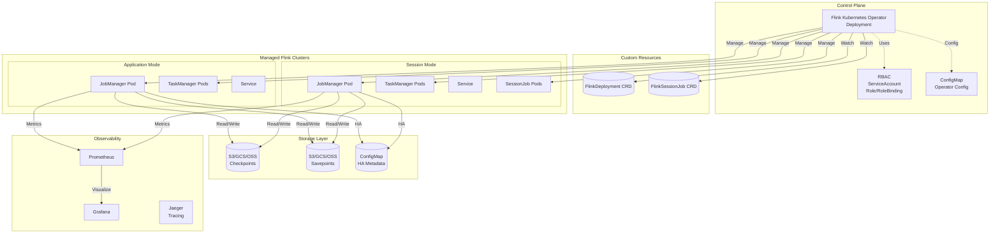
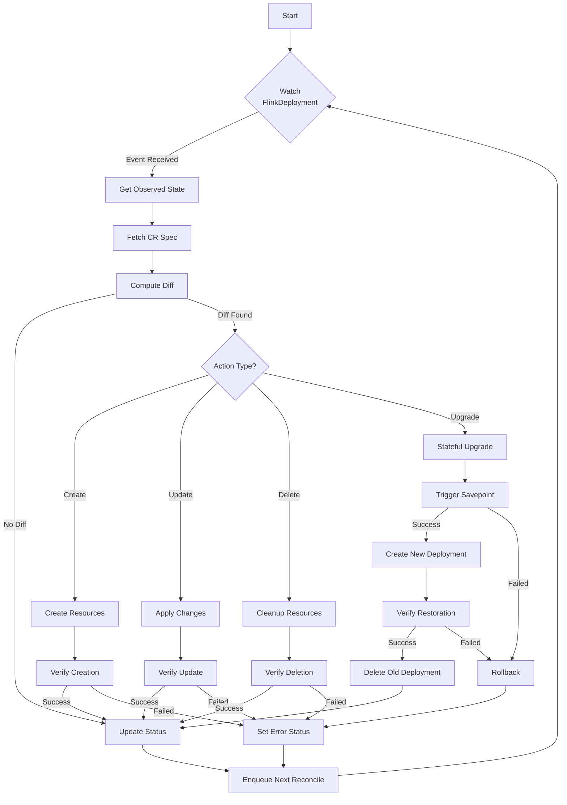
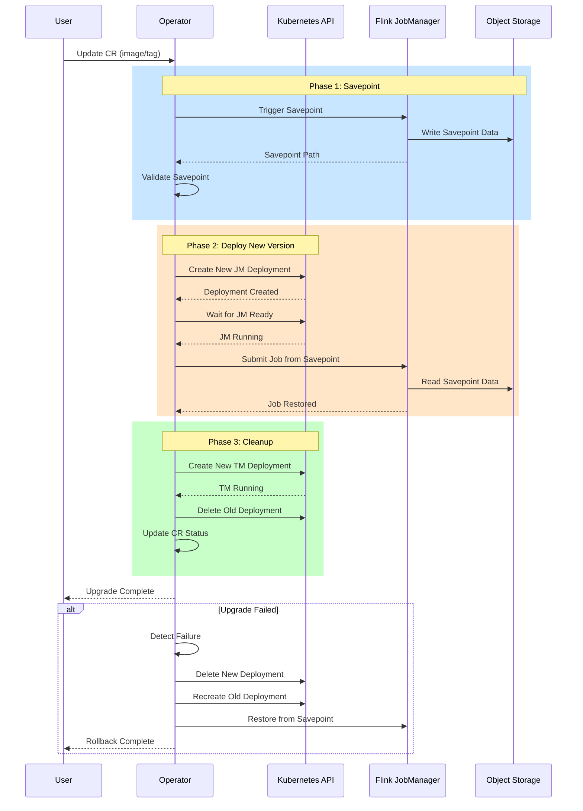
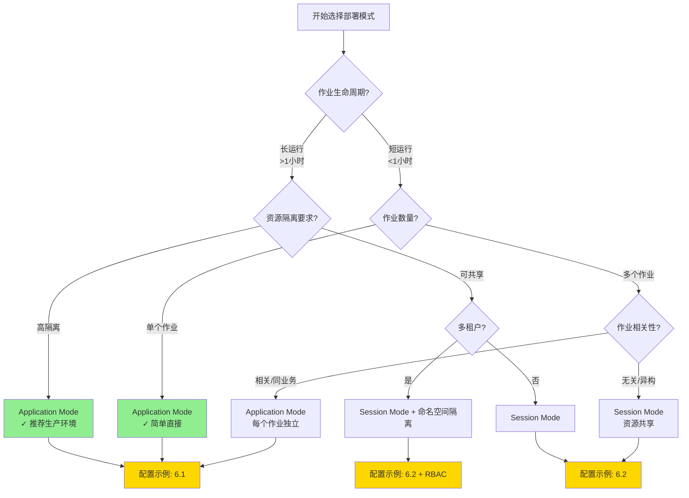
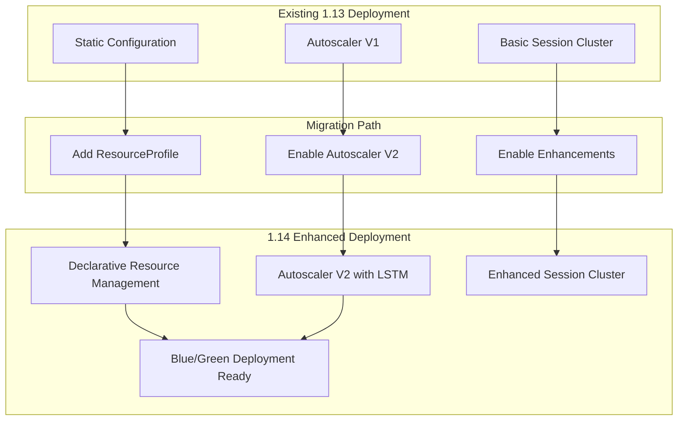

# Flink Kubernetes Operator 深度指南

> **所属阶段**: Flink Deployment | **前置依赖**: [kubernetes-deployment-production-guide.md](./kubernetes-deployment-production-guide.md) | **形式化等级**: L5 (工程严格)
>
> **适用版本**: Flink Kubernetes Operator 1.10+ | **状态**: 2026年生产环境首选方案

---

## 目录

- [Flink Kubernetes Operator 深度指南](#flink-kubernetes-operator-深度指南)
  - [目录](#目录)
  - [1. 概念定义 (Definitions)](#1-概念定义-definitions)
    - [Def-F-10-20: Flink Kubernetes Operator](#def-f-10-20-flink-kubernetes-operator)
    - [Def-F-10-21: CRD (Custom Resource Definition)](#def-f-10-21-crd-custom-resource-definition)
    - [Def-F-10-22: 控制循环 (Control Loop)](#def-f-10-22-控制循环-control-loop)
    - [Def-F-10-23: 有状态升级 (Stateful Upgrade)](#def-f-10-23-有状态升级-stateful-upgrade)
    - [Def-F-10-24: Application Mode on K8s](#def-f-10-24-application-mode-on-k8s)
    - [Def-F-10-25: Session Mode on K8s](#def-f-10-25-session-mode-on-k8s)
  - [2. 属性推导 (Properties)](#2-属性推导-properties)
    - [Lemma-F-10-20: 状态一致性保证](#lemma-f-10-20-状态一致性保证)
    - [Lemma-F-10-21: 升级原子性](#lemma-f-10-21-升级原子性)
    - [Lemma-F-10-22: 扩缩容无中断性](#lemma-f-10-22-扩缩容无中断性)
  - [3. 关系建立 (Relations)](#3-关系建立-relations)
    - [3.1 Operator vs Helm 部署对比](#31-operator-vs-helm-部署对比)
    - [3.2 Operator vs 原生 K8s 部署对比](#32-operator-vs-原生-k8s-部署对比)
    - [3.3 CRD 继承层次](#33-crd-继承层次)
  - [4. 论证过程 (Argumentation)](#4-论证过程-argumentation)
    - [4.1 为什么选择 Operator 模式](#41-为什么选择-operator-模式)
    - [4.2 部署模式决策矩阵](#42-部署模式决策矩阵)
    - [4.3 反例分析：无 Operator 场景的问题](#43-反例分析无-operator-场景的问题)
  - [5. 形式证明 / 工程论证 (Proof / Engineering Argument)](#5-形式证明-工程论证-proof-engineering-argument)
    - [Thm-F-10-20: 有状态升级正确性](#thm-f-10-20-有状态升级正确性)
    - [Thm-F-10-21: 故障恢复完备性](#thm-f-10-21-故障恢复完备性)
  - [6. 实例验证 (Examples)](#6-实例验证-examples)
    - [6.1 Application Mode 完整配置](#61-application-mode-完整配置)
    - [6.2 Session Mode 配置](#62-session-mode-配置)
    - [6.3 自动扩缩容配置](#63-自动扩缩容配置)
    - [6.4 GitOps 集成 (Flux CD)](#64-gitops-集成-flux-cd)
  - [7. 可视化 (Visualizations)](#7-可视化-visualizations)
    - [7.1 Operator 架构图](#71-operator-架构图)
    - [7.2 控制循环流程](#72-控制循环流程)
    - [7.3 有状态升级流程](#73-有状态升级流程)
    - [7.4 部署模式决策树](#74-部署模式决策树)
  - [8. 引用参考 (References)](#8-引用参考-references)
  - [9. Flink Kubernetes Operator 1.14 新特性集成 (New in 1.14)](#9-flink-kubernetes-operator-114-新特性集成-new-in-114)
    - [9.1 1.14 核心新特性概述](#91-114-核心新特性概述)
    - [9.2 Def-F-10-26: Declarative Resource Management](#92-def-f-10-26-declarative-resource-management)
    - [9.3 Def-F-10-27: Autoscaling V2 集成](#93-def-f-10-27-autoscaling-v2-集成)
    - [9.4 Thm-F-10-22: 1.14 特性兼容性定理](#94-thm-f-10-22-114-特性兼容性定理)
    - [9.5 Session Cluster 增强集成](#95-session-cluster-增强集成)
    - [9.6 可视化：1.14 特性集成架构](#96-可视化114-特性集成架构)
    - [9.7 1.14 升级检查清单](#97-114-升级检查清单)
  - [10. 引用参考 (References)](#10-引用参考-references)

---

## 1. 概念定义 (Definitions)

### Def-F-10-20: Flink Kubernetes Operator

**形式化定义**：

Flink Kubernetes Operator 是一个基于 Kubernetes Operator 模式的控制器，定义为四元组：

```
Operator = ⟨ R, C, L, A ⟩
```

其中：

- **R**: 管理的资源集合 { FlinkDeployment, FlinkSessionJob }
- **C**: 控制器集合，每个 CRD 对应一个控制器
- **L**: 控制循环函数 L: Observed State × Desired State → Actions
- **A**: 执行器集合，负责实际的 K8s API 调用

**直观解释**：

Operator 是运行在 Kubernetes 集群中的智能控制器，它将 Flink 集群的生命周期管理知识编码为软件。与手动管理相比，Operator 提供了声明式 API、自动化运维和高级功能（如自动扩缩容、有状态升级）。

```yaml
# Operator 核心组件示意 apiVersion: apps/v1
kind: Deployment
metadata:
  name: flink-kubernetes-operator
spec:
  replicas: 1
  selector:
    matchLabels:
      app: flink-operator
  template:
    spec:
      containers:
      - name: operator
        image: flink-kubernetes-operator:1.10.0
        env:
        - name: K8S_NAMESPACE
          value: "flink-operator"
```

---

### Def-F-10-21: CRD (Custom Resource Definition)

**形式化定义**：

CRD 是 Kubernetes 扩展资源的模式定义，Flink Operator 定义的主要 CRD 包括：

```
CRD = ⟨ Group, Version, Kind, Schema ⟩
```

**FlinkDeployment CRD** (`flink.apache.org/v1beta1`):

| 字段 | 类型 | 说明 |
|------|------|------|
| `spec.image` | string | Flink 镜像 |
| `spec.flinkVersion` | string | Flink 版本 (v1.18, v1.19, v1.20) |
| `spec.deploymentMode` | enum | Application / Session |
| `spec.job` | object | 作业配置（仅 Application Mode）|
| `spec.jobManager` | object | JM 资源配置 |
| `spec.taskManager` | object | TM 资源配置 |
| `spec.podTemplate` | object | Pod 模板自定义 |

**FlinkSessionJob CRD** (`flink.apache.org/v1beta1`):

| 字段 | 类型 | 说明 |
|------|------|------|
| `spec.sessionClusterReference` | string | 引用的 Session 集群名称 |
| `spec.job` | object | 作业配置 |
| `spec.restartNonce` | int | 强制重启标记 |

---

### Def-F-10-22: 控制循环 (Control Loop)

**形式化定义**：

控制循环是 Operator 的核心机制，定义为状态转换系统：

```
L = ⟨ S, s₀, T, δ ⟩
```

其中：

- **S** = { CREATED, DEPLOYED, RUNNING, UPGRADING, FAILED, SUSPENDED }: 状态集合
- **s₀** = CREATED: 初始状态
- **T** = S × Events: 触发事件
- **δ**: S × T → S × Actions: 状态转换函数

**状态机转换**：

```
CREATED → DEPLOYED → RUNNING → UPGRADING → RUNNING
   ↓          ↓          ↓           ↓
FAILED ←── FAILED ←── FAILED ←── FAILED
   ↑          ↑          ↑
SUSPENDED ←──────── SUSPENDED
```

**控制循环周期**：

```java
// 伪代码表示
while (running) {
    // 1. 观察当前状态
    observedState = observe(cluster);

    // 2. 读取期望状态
    desiredState = getSpec(cluster);

    // 3. 计算差异
    diff = computeDiff(observedState, desiredState);

    // 4. 执行调和动作
    if (diff.requiresAction()) {
        execute(diff.getActions());
    }

    // 5. 更新状态
    updateStatus(cluster, observedState);

    sleep(reconcileInterval);  // 默认 60s
}
```

---

### Def-F-10-23: 有状态升级 (Stateful Upgrade)

**形式化定义**：

有状态升级是一种保持作业状态的升级策略：

```
StatefulUpgrade(J, S, V_old, V_new) ⇒ ⟨ J', S ⟩
```

其中：

- **J**: 作业配置
- **S**: 作业状态（Checkpoint/Savepoint）
- **V_old, V_new**: 旧版本和新版本
- 约束：compatible(V_old, V_new) = true

**兼容性规则**：

| 升级类型 | 兼容性 | 行为 |
|----------|--------|------|
| 代码更新 | 需检查 | 从最新 Savepoint 恢复 |
| 并行度调整 | 兼容 | 重新分区状态 |
| 配置变更 | 通常兼容 | 滚动重启 |
| Flink 版本升级 | 需验证 | 状态迁移 |

---

### Def-F-10-24: Application Mode on K8s

**形式化定义**：

Application Mode 是每个作业独立运行的部署模式：

```
AppMode = ⟨ J, C, D ⟩ where |J| = 1 ∧ C ⊆ K8s
```

其中：

- **J**: 单个作业
- **C**: 专用集群资源
- **D**: 部署配置

**特性**：

- JobManager 与作业生命周期绑定
- 资源隔离级别：作业级别
- 启动开销：中（需创建 JM + TM）
- 适用场景：长运行生产作业

---

### Def-F-10-25: Session Mode on K8s

**形式化定义**：

Session Mode 是多作业共享集群的部署模式：

```
SessionMode = ⟨ {J₁, J₂, ..., Jₙ}, C, D ⟩ where n ≥ 1
```

**特性**：

- JobManager 预先存在
- 资源隔离级别：集群级别
- 启动开销：低（复用现有 JM）
- 适用场景：短时作业、批处理、开发测试

---

## 2. 属性推导 (Properties)

### Lemma-F-10-20: 状态一致性保证

**陈述**：

在 Operator 管理下，Flink 作业的 Checkpoint 状态与 Kubernetes 资源状态保持一致：

```
∀t: checkpoint_state(t) ≡ k8s_resource_state(t) (mod Δt)
```

其中 Δt 为调和间隔（默认 60s）。

**证明概要**：

1. Operator 通过 Flink REST API 获取作业状态
2. 将状态同步到 `FlinkDeployment.status` 子资源
3. 由于 K8s 的乐观并发控制，状态更新是原子性的
4. 在调和间隔内，可能存在短暂不一致（最多 Δt）

---

### Lemma-F-10-21: 升级原子性

**陈述**：

有状态升级操作满足原子性：要么完全成功，要么完全回滚。

```
Upgrade(J, S) → { ⟨J_new, S⟩ if recovery(S) = success
                { ⟨J_old, S⟩ if recovery(S) = failure
```

**证明概要**：

1. 升级前触发 Savepoint（保证状态点）
2. 创建新 Deployment 之前验证 Savepoint 成功
3. 新 Deployment 失败时，根据 `spec.job.upgradeMode` 回滚
4. 回滚机制确保旧版本 JobManager 重新启动

---

### Lemma-F-10-22: 扩缩容无中断性

**陈述**：

TaskManager 扩缩容操作不会中断 JobManager 或作业执行。

```
Scale(TM, n_old, n_new) ⇒ JobManager_state ≡ RUNNING
```

**证明概要**：

1. TaskManager 是 Stateless 组件
2. 扩缩容仅调整 `spec.taskManager.replicas`
3. K8s Deployment 控制器负责 Pod 的平滑替换
4. JobManager 检测 TM 变化并重新分配任务槽位

---

## 3. 关系建立 (Relations)

### 3.1 Operator vs Helm 部署对比

| 维度 | Flink Kubernetes Operator | Helm Chart |
|------|---------------------------|------------|
| **范式** | 声明式 (CRD) | 模板化 (YAML) |
| **生命周期管理** | 全自动化 | 需手动触发 upgrade |
| **状态管理** | 内置 Savepoint/Checkpoint 管理 | 需外部脚本 |
| **升级策略** | 原生支持有状态升级 | 需自定义实现 |
| **自动扩缩容** | 内置 HPA 集成 | 需单独配置 |
| **故障恢复** | 自动重启/回滚 | 依赖 K8s 原生机制 |
| **多租户** | 命名空间级别隔离 | 需额外配置 |
| **GitOps 友好度** | ⭐⭐⭐⭐⭐ | ⭐⭐⭐ |
| **学习曲线** | 中等 | 较低 |
| **生产推荐度** | ⭐⭐⭐⭐⭐ (2026首选) | ⭐⭐⭐ (适合简单场景) |

---

### 3.2 Operator vs 原生 K8s 部署对比

| 维度 | Operator 模式 | 原生 K8s Deployment |
|------|---------------|---------------------|
| **配置复杂度** | 低（CRD 抽象）| 高（需手动配置所有资源）|
| **Flink 版本升级** | 一行配置变更 | 需重建所有资源 |
| **状态迁移** | 自动触发 Savepoint | 手动操作 |
| **监控集成** | 内置 Prometheus 指标 | 需自行配置 |
| **资源优化** | 自动调整 TM 资源 | 固定配置 |
| **开发效率** | 高 | 中 |
| **调试能力** | 通过 Operator 日志 | 直接访问 Pod |
| **定制化** | 受限于 CRD Schema | 完全可控 |

---

### 3.3 CRD 继承层次

```
FlinkDeployment (Root)
├── spec
│   ├── flinkVersion          # Flink 版本
│   ├── deploymentMode        # application | session
│   ├── image                 # 自定义镜像
│   ├── serviceAccount        # K8s RBAC
│   ├── podTemplate           # Pod 级自定义
│   ├── jobManager            # JM 配置
│   │   ├── resource          # 资源请求/限制
│   │   ├── replicas          # 副本数
│   │   └── podTemplate       # JM 专属 Pod 模板
│   ├── taskManager           # TM 配置
│   │   ├── resource
│   │   └── podTemplate
│   └── job (仅 Application Mode)
│       ├── jarURI            # JAR 包位置
│       ├── parallelism       # 并行度
│       ├── upgradeMode       # 升级策略
│       └── state             # 初始状态
└── status
    ├── state                 # 当前状态
    ├── jobStatus             # 作业状态详情
    └── error                 # 错误信息
```

---

## 4. 论证过程 (Argumentation)

### 4.1 为什么选择 Operator 模式

**核心论点**：

1. **复杂性封装**：将 Flink 与 K8s 的集成复杂性封装在 Operator 中，用户只需关注业务逻辑

2. **领域知识编码**：Operator 内置了 Flink 专家的最佳实践：
   - 升级时自动触发 Savepoint
   - 根据 Checkpoint 配置自动设置资源
   - 正确的服务发现和负载均衡

3. **声明式 API 优势**：

```yaml
# 用户只需声明期望状态 spec:
  taskManager:
    resource:
      memory: "4g"
      cpu: 2
  job:
    parallelism: 8

# Operator 自动处理:
# - 计算所需 TM 数量
# - 配置 slot 数量
# - 设置内存参数
```

1. **生态系统集成**：
   - ArgoCD / Flux CD 原生支持
   - Prometheus 指标自动暴露
   - HPA/VPA 自动扩缩容

---

### 4.2 部署模式决策矩阵

```
                    作业数量
                 少量      大量
              ┌─────────┬─────────┐
    长运行    │         │         │
   (小时-天)  │  App    │  App    │
              │  Mode   │  Mode   │
作业          │         │ (多个)  │
生命周期      ├─────────┼─────────┤
              │         │         │
    短运行    │  App    │ Session │
   (分钟-时)  │  Mode   │  Mode   │
              │         │         │
              └─────────┴─────────┘
```

**决策规则**：

| 场景 | 推荐模式 | 理由 |
|------|----------|------|
| 生产环境核心作业 | Application | 资源隔离、独立升级 |
| 开发/测试环境 | Session | 资源复用、快速提交 |
| 定时批处理 | Application + CronJob | 按需启动 |
| 多租户共享集群 | Session + 命名空间隔离 | 成本优化 |

---

### 4.3 反例分析：无 Operator 场景的问题

**场景 1：手动升级失败**

```bash
# 传统方式:手动升级
# 1. 手动触发 Savepoint $ flink savepoint <job-id> <savepoint-path>
# 风险:用户可能忘记触发 Savepoint

# 2. 删除旧 Deployment $ kubectl delete deployment flink-job
# 风险:状态可能丢失

# 3. 创建新 Deployment $ kubectl apply -f new-deployment.yaml
# 风险:配置错误导致无法启动

# 4. 从 Savepoint 恢复 $ flink run -s <savepoint-path> new-job.jar
# 风险:版本不兼容导致恢复失败
```

**Operator 方式**：

```yaml
# 只需修改 image 字段 spec:
  image: flink:1.20.0-scala_2.12-java11
# Operator 自动处理:
# 1. 触发 Savepoint
# 2. 等待 Savepoint 完成
# 3. 创建新 Deployment
# 4. 从 Savepoint 恢复
```

**场景 2：资源泄漏**

手动部署时，删除 JobManager 后可能遗留：

- ConfigMap（配置信息）
- Service（服务发现）
- PVC（持久化存储）

Operator 通过 OwnerReference 确保级联删除。

---

## 5. 形式证明 / 工程论证 (Proof / Engineering Argument)

### Thm-F-10-20: 有状态升级正确性

**定理**：Flink Kubernetes Operator 的有状态升级算法保证作业状态在升级过程中不丢失。

**前提条件**：

1. `spec.job.upgradeMode ∈ {stateful, savepoint}`
2. Savepoint 存储路径可访问且空间充足
3. 新旧版本状态兼容

**证明**：

```
算法: StatefulUpgrade
─────────────────────────
输入: FlinkDeployment cr
输出: 升级后的 FlinkDeployment

1. 触发 Savepoint
   savepointPath = triggerSavepoint(cr)
   if savepointPath == null:
      return ERROR("Savepoint failed")

2. 验证 Savepoint
   if !validateSavepoint(savepointPath):
      return ERROR("Invalid savepoint")

3. 创建新 JobManager Deployment
   newJM = createJobManager(cr, savepointPath)

4. 等待新 JobManager 就绪
   if !waitForReady(newJM, timeout=300s):
      rollback(cr)  // 回滚到旧版本
      return ERROR("New JM not ready")

5. 创建新 TaskManager Deployment
   newTM = createTaskManager(cr)

6. 验证作业恢复
   if !verifyJobRestored(cr, savepointPath):
      rollback(cr)
      return ERROR("Job restore failed")

7. 删除旧 Deployment
   deleteOldDeployment(cr)

8. 更新状态
   updateStatus(cr, UPGRADED)
   return SUCCESS
```

**正确性保证**：

- **原子性**：步骤 1-6 任一失败触发回滚
- **持久性**：Savepoint 在分布式存储中持久化
- **一致性**：通过 Savepoint 路径确保恢复正确状态

---

### Thm-F-10-21: 故障恢复完备性

**定理**：Operator 能够在以下故障场景下自动恢复作业运行。

**故障场景覆盖**：

| 故障类型 | 检测机制 | 恢复策略 | 恢复时间 |
|----------|----------|----------|----------|
| JobManager Pod 崩溃 | Pod 状态监控 | 自动重建 + 从 Checkpoint 恢复 | < 2min |
| TaskManager Pod 崩溃 | Pod 状态监控 | 自动重建 | < 30s |
| 作业失败 (Job Failed) | Flink REST API | 根据 restartStrategy 重启 | 配置决定 |
| Checkpoint 失败 | Checkpoint 指标 | 告警 + 自动重试 | 配置决定 |
| 节点故障 | Node 状态监控 | Pod 重新调度 | < 5min |

**证明概要**：

1. **JobManager 故障恢复**：
   - K8s Deployment 控制器自动重建 Pod
   - Operator 配置 `high-availability: kubernetes`
   - 新 JM 从 ConfigMap 获取最新 Checkpoint 路径
   - 自动触发恢复流程

2. **作业失败恢复**：
   - Operator 监听 `jobStatus.state`
   - 状态为 `FAILED` 时触发恢复逻辑
   - 根据 `spec.job.restartNonce` 强制重启
   - 支持指数退避重试策略

3. **脑裂防护**：
   - 使用 K8s Lease 机制选举 Leader
   - 确保单点控制，避免冲突操作

---

## 6. 实例验证 (Examples)

### 6.1 Application Mode 完整配置

```yaml
# flink-production-application.yaml apiVersion: flink.apache.org/v1beta1
kind: FlinkDeployment
metadata:
  name: realtime-etl-pipeline
  namespace: flink-production
  labels:
    app: etl-pipeline
    team: data-platform
    cost-center: analytics
spec:
  # Flink 版本和镜像
  flinkVersion: v1.20
  image: my-registry/flink-custom:1.20.0-v2.1

  # 部署模式
  deploymentMode: application

  # 服务账户和 RBAC
  serviceAccount: flink-job-sa

  # JobManager 配置
  jobManager:
    resource:
      memory: "4g"
      cpu: 2
    replicas: 2  # HA 配置
    podTemplate:
      spec:
        containers:
        - name: flink-job-manager
          env:
          - name: FLINK_ENVIRONMENT
            value: "production"
          - name: ENABLE_JMX_EXPORTER
            value: "true"
          resources:
            requests:
              ephemeral-storage: "10Gi"
            limits:
              ephemeral-storage: "20Gi"
        affinity:
          podAntiAffinity:
            preferredDuringSchedulingIgnoredDuringExecution:
            - weight: 100
              podAffinityTerm:
                labelSelector:
                  matchLabels:
                    app: flink-job-manager
                topologyKey: kubernetes.io/hostname

  # TaskManager 配置
  taskManager:
    resource:
      memory: "8g"
      cpu: 4
    replicas: 8
    podTemplate:
      spec:
        containers:
        - name: flink-task-manager
          env:
          - name: TASKMANAGER_MEMORY_NETWORK_MIN
            value: "512m"
          - name: TASKMANAGER_MEMORY_NETWORK_MAX
            value: "1g"
          resources:
            requests:
              ephemeral-storage: "50Gi"
            limits:
              ephemeral-storage: "100Gi"
        tolerations:
        - key: "dedicated"
          operator: "Equal"
          value: "flink"
          effect: "NoSchedule"
        nodeSelector:
          workload-type: flink-compute

  # 全局 Flink 配置
  flinkConfiguration:
    # 高可用配置
    high-availability: kubernetes
    high-availability.storageDir: s3p://flink-ha/checkpoints
    high-availability.cluster-id: realtime-etl-pipeline

    # Checkpoint 配置
    execution.checkpointing.interval: 60s
    execution.checkpointing.min-pause: 30s
    execution.checkpointing.max-concurrent-checkpoints: 1
    execution.checkpointing.externalized-checkpoint-retention: RETAIN_ON_CANCELLATION
    execution.checkpointing.unaligned: false
    execution.checkpointing.max-aligned-checkpoint-size: 1MB

    # 状态后端配置
    state.backend: rocksdb
    state.backend.incremental: true
    state.backend.rocksdb.memory.managed: true
    state.backend.rocksdb.predefined-options: FLASH_SSD_OPTIMIZED
    state.checkpoints.dir: s3p://flink-checkpoints/realtime-etl
    state.savepoints.dir: s3p://flink-savepoints/realtime-etl

    # 网络配置
    taskmanager.memory.network.min: 512m
    taskmanager.memory.network.max: 1g
    taskmanager.memory.network.fraction: 0.15

    # 重启策略
    restart-strategy: exponential-delay
    restart-strategy.exponential-delay.initial-backoff: 10s
    restart-strategy.exponential-delay.max-backoff: 5min
    restart-strategy.exponential-delay.backoff-multiplier: 2.0

    # 指标配置
    metrics.reporters: prom
    metrics.reporter.prom.class: org.apache.flink.metrics.prometheus.PrometheusReporter
    metrics.reporter.prom.port: 9249

  # 作业配置
  job:
    jarURI: local:///opt/flink/usrlib/realtime-etl.jar
    parallelism: 32
    upgradeMode: stateful
    state: running
    args:
    - --kafka.bootstrap.servers
    - kafka-cluster:9092
    - --sink.parallelism
    - "8"

  # 全局 Pod 模板
  podTemplate:
    spec:
      serviceAccountName: flink-job-sa
      securityContext:
        runAsUser: 9999
        runAsGroup: 9999
        fsGroup: 9999
      volumes:
      - name: flink-config-volume
        configMap:
          name: flink-config
      - name: aws-credentials
        secret:
          secretName: aws-s3-credentials
      containers:
      - name: flink-main-container
        volumeMounts:
        - name: flink-config-volume
          mountPath: /opt/flink/conf
        - name: aws-credentials
          mountPath: /var/secrets/aws
          readOnly: true
        env:
        - name: AWS_ACCESS_KEY_ID
          valueFrom:
            secretKeyRef:
              name: aws-s3-credentials
              key: access-key
        - name: AWS_SECRET_ACCESS_KEY
          valueFrom:
            secretKeyRef:
              name: aws-s3-credentials
              key: secret-key
      imagePullSecrets:
      - name: registry-secret
```

---

### 6.2 Session Mode 配置

```yaml
# flink-session-cluster.yaml apiVersion: flink.apache.org/v1beta1
kind: FlinkDeployment
metadata:
  name: shared-flink-session
  namespace: flink-shared
spec:
  flinkVersion: v1.20
  deploymentMode: session

  jobManager:
    resource:
      memory: "8g"
      cpu: 4
    replicas: 3

  taskManager:
    resource:
      memory: "16g"
      cpu: 8
    replicas: 4

  flinkConfiguration:
    high-availability: kubernetes
    state.backend: rocksdb
    execution.checkpointing.interval: 120s

---
# 提交作业到 Session 集群 apiVersion: flink.apache.org/v1beta1
kind: FlinkSessionJob
metadata:
  name: ad-hoc-analytics-job
  namespace: flink-shared
spec:
  sessionClusterReference: shared-flink-session
  job:
    jarURI: https://storage.example.com/jobs/analytics.jar
    parallelism: 16
    upgradeMode: stateful
    state: running
```

---

### 6.3 自动扩缩容配置

```yaml
# 启用 Operator 自动扩缩容 apiVersion: flink.apache.org/v1beta1
kind: FlinkDeployment
metadata:
  name: auto-scaling-pipeline
  namespace: flink-production
spec:
  flinkVersion: v1.20
  deploymentMode: application

  # 启用自适应调度器 (Adaptive Scheduler)
  flinkConfiguration:
    scheduler-mode: REACTIVE

  jobManager:
    resource:
      memory: "4g"
      cpu: 2

  taskManager:
    resource:
      memory: "8g"
      cpu: 4
    # 不指定 replicas,由调度器动态调整

  # 配合 HPA 实现水平扩缩容
  podTemplate:
    spec:
      containers:
      - name: flink-task-manager
        resources:
          requests:
            cpu: "4"
            memory: "8Gi"
          limits:
            cpu: "8"
            memory: "16Gi"

---
# HPA 配置 (需要 Metrics Server)
apiVersion: autoscaling/v2
kind: HorizontalPodAutoscaler
metadata:
  name: flink-tm-hpa
  namespace: flink-production
spec:
  scaleTargetRef:
    apiVersion: apps/v1
    kind: Deployment
    name: auto-scaling-pipeline-taskmanager
  minReplicas: 2
  maxReplicas: 20
  metrics:
  - type: Pods
    pods:
      metric:
        name: flink_taskmanager_job_task_backPressuredTimeMsPerSecond
      target:
        type: AverageValue
        averageValue: "100"
  - type: Resource
    resource:
      name: cpu
      target:
        type: Utilization
        averageUtilization: 70
  behavior:
    scaleUp:
      stabilizationWindowSeconds: 60
      policies:
      - type: Percent
        value: 100
        periodSeconds: 60
    scaleDown:
      stabilizationWindowSeconds: 300
      policies:
      - type: Percent
        value: 10
        periodSeconds: 60
```

---

### 6.4 GitOps 集成 (Flux CD)

```yaml
# GitRepository 配置 apiVersion: source.toolkit.fluxcd.io/v1
kind: GitRepository
metadata:
  name: flink-jobs-repo
  namespace: flux-system
spec:
  interval: 1m
  url: https://github.com/company/flink-jobs.git
  ref:
    branch: main
  secretRef:
    name: github-token

---
# Kustomization 配置 apiVersion: kustomize.toolkit.fluxcd.io/v1
kind: Kustomization
metadata:
  name: flink-production-apps
  namespace: flux-system
spec:
  interval: 5m
  path: ./k8s/overlays/production
  prune: true
  sourceRef:
    kind: GitRepository
    name: flink-jobs-repo
  targetNamespace: flink-production
  healthChecks:
  - apiVersion: flink.apache.org/v1beta1
    kind: FlinkDeployment
    name: realtime-etl-pipeline
    namespace: flink-production

---
# 金丝雀发布策略 (使用 Flagger)
apiVersion: flagger.app/v1beta1
kind: Canary
metadata:
  name: flink-etl-canary
  namespace: flink-production
spec:
  targetRef:
    apiVersion: flink.apache.org/v1beta1
    kind: FlinkDeployment
    name: realtime-etl-pipeline
  service:
    port: 8081
  analysis:
    interval: 30s
    threshold: 5
    maxWeight: 50
    stepWeight: 10
    metrics:
    - name: request-success-rate
      thresholdRange:
        min: 99
      interval: 1m
    - name: request-duration
      thresholdRange:
        max: 500
      interval: 1m
    webhooks:
    - name: load-test
      url: http://flagger-loadtester.test/
      timeout: 5s
      metadata:
        cmd: "hey -z 1m -q 10 -c 2 http://realtime-etl-pipeline:8081/"
```

---

## 7. 可视化 (Visualizations)

### 7.1 Operator 架构图



---

### 7.2 控制循环流程



---

### 7.3 有状态升级流程



---

### 7.4 部署模式决策树



---

## 8. 引用参考 (References)


---

## 9. Flink Kubernetes Operator 1.14 新特性集成 (New in 1.14)

> **适用版本**: Flink Kubernetes Operator 1.14.0+ | **新增日期**: 2026-02-15

### 9.1 1.14 核心新特性概述

Flink Kubernetes Operator 1.14 引入了多项重大改进，本节介绍如何将新特性集成到现有部署中。

| 新特性 | 描述 | 集成难度 | 生产就绪 |
|--------|------|----------|----------|
| Declarative Resource Management | 声明式资源管理 | 低 | GA |
| Autoscaling Algorithm V2 | 基于 ML 的自动扩缩容 V2 | 中 | GA |
| Session Cluster Enhancements | Session 集群增强功能 | 低 | GA |
| Blue/Green Deployment | 零停机部署 | 中 | GA |
| Helm Chart Schema Validation | Helm Schema 验证 | 低 | GA |

### 9.2 Def-F-10-26: Declarative Resource Management

**形式化定义**：

```
DRM-Integration = (ExistingDeployment, ResourceProfileRef, MigrationPath)

迁移路径:
  1. 现有配置保持不变
  2. 添加 resourceProfile 声明
  3. Operator 自动优化资源分配
```

**集成示例**：

```yaml
# 原有 1.13 配置 apiVersion: flink.apache.org/v1beta1
kind: FlinkDeployment
metadata:
  name: existing-job
spec:
  flinkVersion: v1_20
  deploymentMode: application
  taskManager:
    resource:
      memory: "8g"
      cpu: 4
    replicas: 8  # 静态配置

---
# 迁移到 1.14 声明式配置 apiVersion: flink.apache.org/v1beta1
kind: FlinkDeployment
metadata:
  name: existing-job
spec:
  flinkVersion: v1_20
  deploymentMode: application

  # 新增:声明式资源配置
  resourceProfile:
    tier: large
    autoScaling:
      enabled: true
      minTaskManagers: 4
      maxTaskManagers: 20
      targetUtilization: 0.7

  taskManager:
    resource:
      memory: "8g"
      cpu: 4
    # replicas 由 Autoscaler 控制
```

### 9.3 Def-F-10-27: Autoscaling V2 集成

**形式化定义**：

```
AutoscalerV2-Integration = (MetricsBackend, PredictionModel, OptimizationConfig)

集成约束:
  - Flink Version >= 1.17
  - pipeline.max-parallelism 必须设置
  - Metrics Reporter 必须配置
```

**集成配置**：

```yaml
apiVersion: flink.apache.org/v1beta1
kind: FlinkDeployment
metadata:
  name: autoscaler-v2-job
spec:
  flinkVersion: v1_20
  deploymentMode: application

  flinkConfiguration:
    # 启用 Autoscaling V2
    job.autoscaler.enabled: "true"
    job.autoscaler.algorithm.version: "v2"

    # 核心参数
    job.autoscaler.target.utilization: "0.7"
    job.autoscaler.target.utilization.boundary: "0.15"
    job.autoscaler.metrics.window: "5m"

    # V2 预测模型
    job.autoscaler.prediction.enabled: "true"
    job.autoscaler.prediction.model: "lstm"
    job.autoscaler.prediction.window: "30m"

    # 多目标优化
    job.autoscaler.optimization.weights.latency: "0.4"
    job.autoscaler.optimization.weights.cost: "0.35"
    job.autoscaler.optimization.weights.stability: "0.25"

    # 关键:必须设置 max-parallelism
    pipeline.max-parallelism: "720"

  job:
    jarURI: local:///opt/flink/usrlib/job.jar
    parallelism: 8
    upgradeMode: stateful
```

### 9.4 Thm-F-10-22: 1.14 特性兼容性定理

**定理陈述**：

1.14 新特性与现有部署向后兼容：

```
Forall Deployment d in 1.13:
    Compatible(d, 1.14) = true

其中:
    - 现有配置无需修改即可运行
    - 新特性默认关闭,需显式启用
    - 升级后可逐步迁移到新特性
```

**兼容性矩阵**：

| 配置项 | 1.13 | 1.14 | 迁移方式 |
|--------|------|------|----------|
| spec.image | 兼容 | 兼容 | 直接继承 |
| spec.flinkVersion | 兼容 | 兼容 | 直接继承 |
| spec.jobManager | 兼容 | 兼容 | 直接继承 |
| spec.taskManager.replicas | 静态 | 可由 Autoscaler 控制 | 可选迁移 |
| spec.autoscaler | 旧格式 | 新格式 (flinkConfiguration) | 建议迁移 |

### 9.5 Session Cluster 增强集成

**增强功能集成**：

```yaml
apiVersion: flink.apache.org/v1beta1
kind: FlinkDeployment
metadata:
  name: enhanced-session-cluster
spec:
  flinkVersion: v1_20
  deploymentMode: session

  spec:
    sessionClusterConfig:
      # 动态 Slot 分配
      dynamicSlotAllocation:
        enabled: true
        minSlots: 8
        maxSlots: 128
        scaleUpThreshold: 0.8
        scaleDownThreshold: 0.3

      # 预热池
      warmPool:
        enabled: true
        preWarmTaskManagers: 2
        idleTimeout: "10m"

      # 作业队列
      jobQueue:
        enabled: true
        maxConcurrentJobs: 10
        queues:
          - name: "critical"
            priority: 10
            maxSlots: 64
          - name: "batch"
            priority: 1
            maxSlots: 32
```

### 9.6 可视化：1.14 特性集成架构



### 9.7 1.14 升级检查清单

**前置检查**：

```bash
# 1. 验证当前版本 helm list -n flink-operator

# 2. 备份配置 kubectl get flinkdeployments -A -o yaml > backup/flinkdeployments.yaml

# 3. 检查作业健康状态 kubectl get flinkdeployments -A -o json | jq '.items[] | {name: .metadata.name, state: .status.jobStatus.state}'

# 4. 验证 Checkpoint 配置 kubectl get flinkdeployments -A -o yaml | grep "execution.checkpointing.interval"
```

**升级后验证**：

```bash
# 1. 验证 Operator 版本 kubectl get deployment flink-kubernetes-operator -n flink-operator -o jsonpath='{.spec.template.spec.containers[0].image}'

# 2. 验证新特性可用 kubectl get crd flinkdeployments.flink.apache.org -o yaml | grep "v1beta2"

# 3. 验证 DRM 启用 kubectl logs -n flink-operator -l app.kubernetes.io/name=flink-kubernetes-operator | grep "declarative.resource.management"

# 4. 验证 Autoscaler V2 kubectl logs -n flink-operator -l app.kubernetes.io/name=flink-kubernetes-operator | grep "autoscaler.algorithm.version.*v2"
```

---

## 10. 引用参考 (References)


---

*文档版本: 1.1 | 最后更新: 2026-04-14 | 状态: 生产就绪 | 新增 1.14 特性章节*
