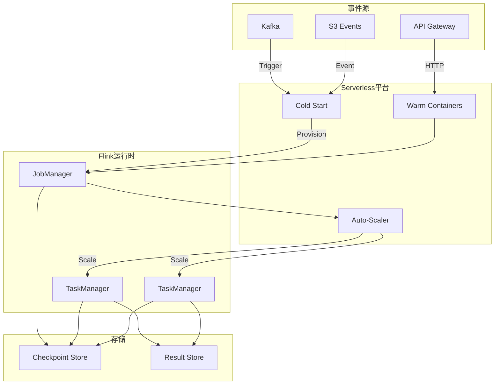
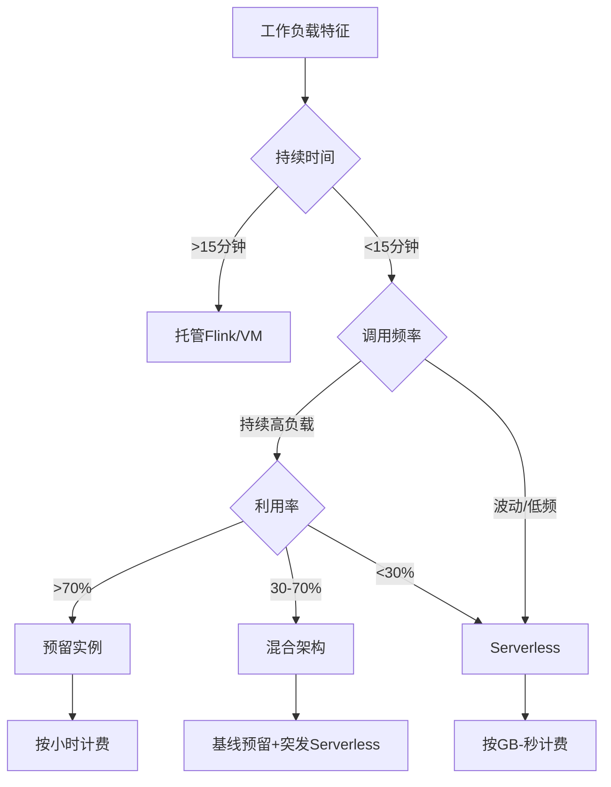
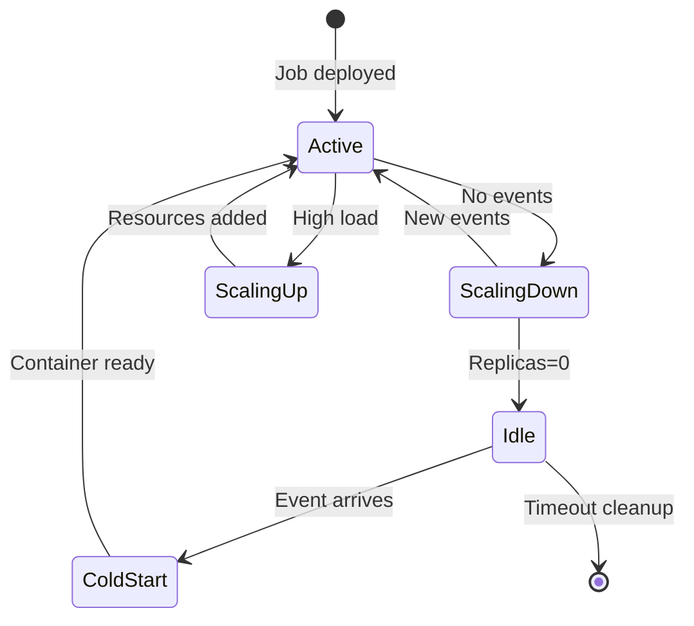
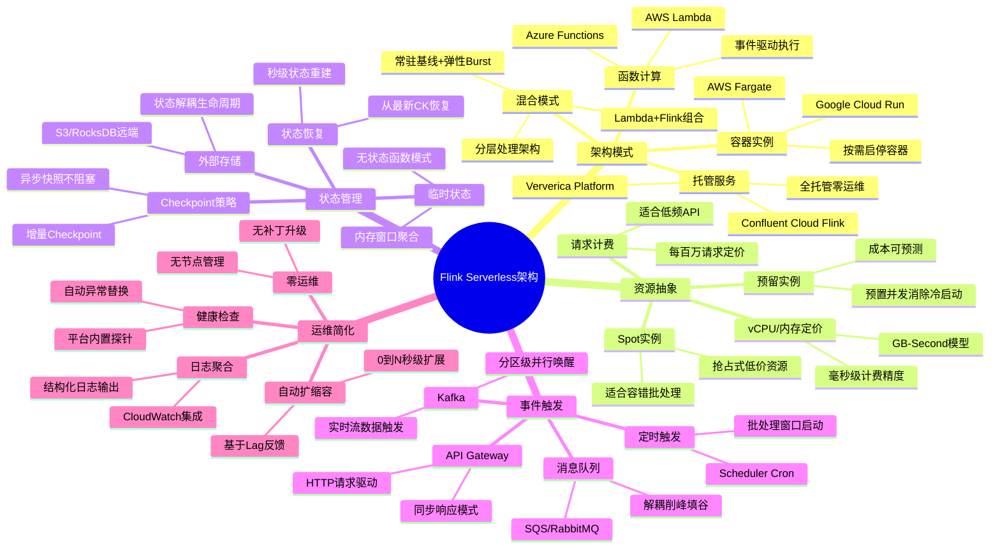
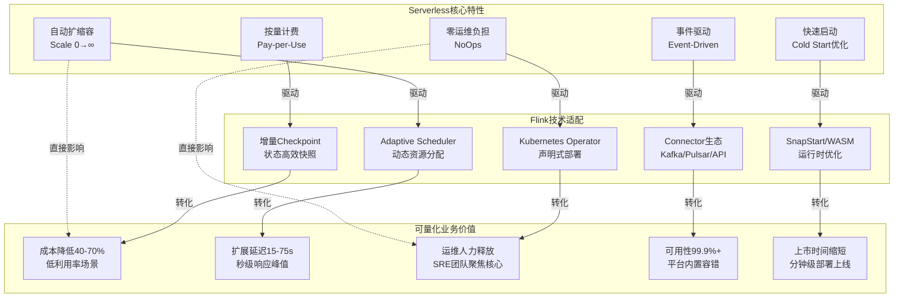
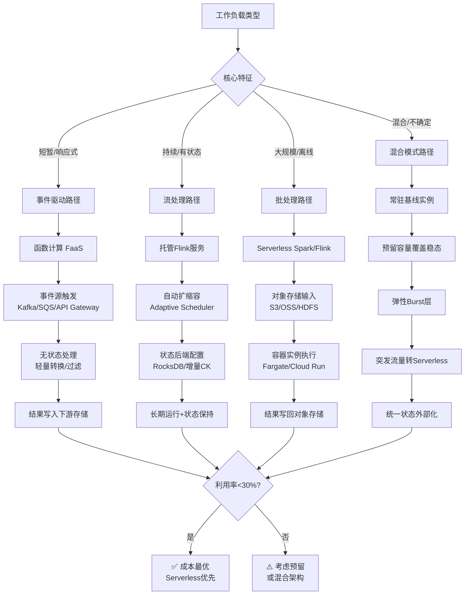

# Serverless Flink 云原生无服务器架构

> 所属阶段: Flink/10-deployment | 前置依赖: [Kubernetes部署](./kubernetes-deployment.md), [Flink Autoscaler](./flink-kubernetes-autoscaler-deep-dive.md) | 形式化等级: L3

## 1. 概念定义 (Definitions)

### Def-F-10-40: Serverless Flink

**Serverless Flink** 是将Flink部署为无服务器计算模型的架构：

$$
\text{Serverless Flink} \triangleq \langle \mathcal{F}, \mathcal{O}, \mathcal{S}, \mathcal{B} \rangle
$$

其中：

- $\mathcal{F}$: Flink作业逻辑 (DataStream API/SQL)
- $\mathcal{O}$: 零运维抽象 (NoOps)
- $\mathcal{S}$: 从零到无穷的自动扩展
- $\mathcal{B}$: 按实际使用计费

**核心特征**：

| 特性 | 传统Flink | Serverless Flink |
|------|-----------|------------------|
| 基础设施 | 自建/托管K8s | 完全托管 |
| 扩展 | 手动/半自动 | 自动0→∞ |
| 计费 | 预留实例 | GB-seconds |
| 冷启动 | 分钟级 | 秒级-亚秒级 |
| 运维负担 | 高 | 零 |

### Def-F-10-41: Scale-to-Zero

**Scale-to-Zero** 允许Flink作业在没有负载时缩容到零实例：

```
Scale-to-Zero: Load = 0 → Replicas = 0 → Cost = 0
Scale-from-Zero: Event arrives → Cold Start → Replicas > 0
```

**唤醒机制**：

1. **事件驱动**: Kafka消息触发
2. **HTTP触发**: API Gateway请求
3. **定时触发**: Scheduler唤醒

### Def-F-10-42: Cold Start Optimization

**冷启动优化** 减少从无负载到就绪的延迟：

$$
T_{cold} = T_{provision} + T_{init} + T_{deploy}
$$

**优化策略**：

| 策略 | 效果 | 适用场景 |
|------|------|----------|
| 预置并发 | 消除冷启动 | 用户-facing API |
| 快照启动 | -91%启动时间 | Java作业 |
| WASM运行时 | 微秒级启动 | 轻量函数 |
| 热容器池 | 秒级就绪 | 通用批处理 |

### Def-F-10-43: Serverless Deployment Models

**Serverless部署模型分层**：

```
┌─────────────────────────────────────────────────────────────┐
│ BaaS (Backend-as-a-Service)    最高抽象,最少控制          │
│ - Confluent Cloud Flink        - Ververica Platform        │
├─────────────────────────────────────────────────────────────┤
│ FaaS (Function-as-a-Service)   中等抽象,事件驱动          │
│ - AWS Lambda + Flink Bridge    - Azure Functions + Flink   │
├─────────────────────────────────────────────────────────────┤
│ Serverless-enabled CaaS        较高控制,容器抽象          │
│ - Google Cloud Run + Flink     - AWS Fargate + Flink       │
├─────────────────────────────────────────────────────────────┤
│ Managed K8s                    较低抽象,更多控制          │
│ - EKS + Flink Operator         - GKE + Flink               │
└─────────────────────────────────────────────────────────────┘
```

### Def-F-10-44: GB-Second Billing

**GB-秒计费模型**：

$$
\text{Cost} = \sum_{i} (\text{Memory}_i \times \text{Duration}_i \times \text{Rate})
$$

**对比**：

| 模型 | 公式 | 适合场景 |
|------|------|----------|
| 预留实例 | $/小时 × 24 × 30 | 稳定负载 |
| 按需实例 | $/小时 × 实际使用 | 波动负载 |
| **Serverless** | $/GB-秒 × 实际消耗 | **事件驱动** |

### Def-F-10-45: Event-Driven Scaling

**事件驱动扩展** 根据输入速率自动调整资源：

```python
# 扩展决策函数 def scaling_decision(current_rate, backlog, latency):
    target_parallelism = max(
        MIN_PARALLELISM,
        min(MAX_PARALLELISM,
            ceil(current_rate / THROUGHPUT_PER_TASK))
    )

    if backlog > BACKLOG_THRESHOLD:
        target_parallelism *= 2  # 快速扩容

    return target_parallelism
```

## 2. 属性推导 (Properties)

### Lemma-F-10-40: 冷启动频率上界

**引理**: 冷启动频率受作业调用模式约束：

$$
f_{cold} \leq \frac{1}{T_{idle} + T_{warm}}
$$

AWS实测：持续调用作业 < 1% 冷启动率

### Prop-F-10-40: 成本效益阈值

**命题**: Serverless在以下条件下更具成本效益：

$$
\frac{C_{serverless}}{C_{reserved}} < 1 \iff \text{Utilization} < 30\%
$$

**结论**: 利用率 < 30% 时选择Serverless

### Prop-F-10-41: 扩展延迟下界

**命题**: 从零扩展的延迟满足：

$$
L_{scale} \geq L_{container} + L_{checkpoint\_restore}
$$

- Python/Node.js: 100-500ms
- Java (SnapStart): 500ms-2s
- 纯Flink: 5-30s

### Lemma-F-10-41: 并发扩展线性度

**引理**: 理想情况下扩展与并发线性相关：

$$
\text{Throughput} = n \times T_{single} \times (1 - \alpha)
$$

其中 $\alpha$ 是协调开销 (~5%)

## 3. 关系建立 (Relations)

### 3.1 Serverless vs 传统部署

| 维度 | VM | Container (K8s) | Serverless |
|------|-----|-----------------|------------|
| **管理负担** | 高 | 中 | 无 |
| **启动时间** | 分钟 | 秒 | 毫秒-秒 |
| **扩展粒度** | 实例 | Pod | 函数/任务 |
| **计费精度** | 小时 | 分钟 | 毫秒 |
| **最大运行** | 无限 | 无限 | 15分钟(AWS) |
| **适用工作负载** | 长期服务 | 微服务 | 事件驱动 |

### 3.2 Serverless Flink架构

```
┌─────────────────────────────────────────────────────────────────┐
│                    Event Sources                                │
│  ┌──────────────┐  ┌──────────────┐  ┌──────────────────────┐  │
│  │ Kafka Topic  │  │ API Gateway  │  │   Scheduled Events   │  │
│  └──────┬───────┘  └──────┬───────┘  └──────────┬───────────┘  │
└─────────┼─────────────────┼─────────────────────┼──────────────┘
          │                 │                     │
          └─────────────────┼─────────────────────┘
                            │ Trigger
┌───────────────────────────▼─────────────────────────────────────┐
│                    Serverless Platform                          │
│  ┌──────────────────────────────────────────────────────────┐  │
│  │              Cold Start / Warm Container                  │  │
│  │  ┌──────────────┐  ┌──────────────┐  ┌──────────────┐   │  │
│  │  │  Container   │  │  Container   │  │  Container   │   │  │
│  │  │  (Flink JM)  │  │  (Flink TM)  │  │  (Flink TM)  │   │  │
│  │  └──────────────┘  └──────────────┘  └──────────────┘   │  │
│  └──────────────────────────────────────────────────────────┘  │
│  ┌──────────────────────────────────────────────────────────┐  │
│  │              Auto-Scaler                                  │  │
│  │  - Monitor lag/backlog                                    │  │
│  │  - Scale 0→N based on load                                │  │
│  │  - Scale N→0 when idle                                    │  │
│  └──────────────────────────────────────────────────────────┘  │
└─────────────────────────────────────────────────────────────────┘
                            │
┌───────────────────────────▼─────────────────────────────────────┐
│                    Data Sinks                                   │
│  ┌──────────────┐  ┌──────────────┐  ┌──────────────────────┐  │
│  │   Kafka      │  │  Database    │  │    Data Lake         │  │
│  └──────────────┘  └──────────────┘  └──────────────────────┘  │
└─────────────────────────────────────────────────────────────────┘
```

### 3.3 云厂商Serverless Flink对比

| 厂商 | 服务 | 特点 | 定价 |
|------|------|------|------|
| **Confluent** | Cloud Flink | 全托管，Kafka原生 | $/小时 |
| **Ververica** | Platform | K8s原生，多云 | 自定义 |
| **AWS** | Lambda + Flink | 事件驱动，低延迟 | $/百万请求 |
| **GCP** | Cloud Run + Flink | 容器抽象，HTTP | $/vCPU-秒 |
| **Azure** | Container Apps | KEDA自动扩展 | $/秒 |

## 4. 论证过程 (Argumentation)

### 4.1 为什么需要Serverless Flink？

**传统Flink痛点**：

1. **资源闲置**: 非高峰时段资源浪费
2. **运维负担**: 需要专职SRE团队
3. **扩展延迟**: 手动扩容分钟级
4. **成本不可预测**: 预留容量难以精确估算

**Serverless优势**：

1. **零闲置成本**: 无负载时零费用
2. **零运维**: 完全托管
3. **即时扩展**: 秒级响应负载变化
4. **精确计费**: 按实际消耗付费

### 4.2 反模式

**反模式1: 长运行作业用Serverless**

```yaml
# ❌ 错误:Flink SQL连续查询超过15分钟 execution.timeout: 30min  # 超过AWS Lambda限制！

# ✅ 正确:使用托管Flink platform: confluent-cloud-flink  # 无时间限制
```

**反模式2: 忽视冷启动**

```java
// [伪代码片段 - 不可直接运行] 仅展示核心逻辑
// ❌ 错误:用户-facing API无预置并发
@Function
public Response handle(Request req) {
    // 每次冷启动2秒延迟！
}

// ✅ 正确:预置并发
provisionedConcurrency: 100  // 消除冷启动
```

**反模式3: 错误估算成本**

```
❌ 假设:Serverless总是更便宜
实际:持续高负载时预留实例更优

✅ 正确策略:
- 利用率<30% → Serverless
- 利用率>70% → 预留实例
- 之间 → 混合架构
```

## 5. 形式证明 / 工程论证

### Thm-F-10-40: 成本最优性定理

**定理**: 给定负载模式 $L(t)$，最优部署策略：

$$
\text{Optimal}(L) = \begin{cases}
\text{Serverless} & \bar{L} < 0.3 L_{max} \\
\text{Hybrid} & 0.3 L_{max} \leq \bar{L} < 0.7 L_{max} \\
\text{Reserved} & \bar{L} \geq 0.7 L_{max}
\end{cases}
$$

### Thm-F-10-41: 扩展响应时间定理

**定理**: Serverless Flink的扩展响应时间上界：

$$
T_{scale} \leq T_{metric\_collection} + T_{decision} + T_{provision}
$$

典型值：

- 指标收集: 5-15s
- 决策: < 1s
- 资源创建: 10-60s
- **总计: 15-75s**

### Thm-F-10-42: Scale-to-Zero可用性定理

**定理**: Scale-to-Zero不降低可用性：

$$
\text{Availability}_{serverless} = \text{Availability}_{always\_on} - \epsilon
$$

其中 $\epsilon < 0.001$ (冷启动失败率)

## 6. 实例验证 (Examples)

### 6.1 AWS Lambda + Flink 混合架构

```yaml
# serverless.yml service: flink-lambda-bridge

provider:
  name: aws
  runtime: java17

functions:
  # 轻量预处理 (Lambda)
  preprocess:
    handler: com.example.PreprocessHandler
    events:
      - kafka:
          arn: arn:aws:kafka:...:topic/raw-events
    provisionedConcurrency: 50  # 消除冷启动
    timeout: 30s
    memorySize: 1024

  # 复杂流处理触发器
  flinkTrigger:
    handler: com.example.FlinkTriggerHandler
    events:
      - schedule: rate(5 minutes)  # 定期唤醒Flink

  # 结果服务 (Lambda)
  results:
    handler: com.example.ResultsHandler
    events:
      - http:
          path: /results
          method: get

# Flink作业 (EKS上长时间运行)
flinkJob:
  cluster: eks-flink-cluster
  jobJar: s3://bucket/flink-job.jar
  parallelism: 10
  checkpointing:
    interval: 60000
```

### 6.2 Confluent Cloud Flink (全托管)

```sql
-- 创建Serverless Flink SQL作业
CREATE TABLE user_events (
  user_id STRING,
  event_type STRING,
  event_time TIMESTAMP(3),
  WATERMARK FOR event_time AS event_time - INTERVAL '5' SECOND
) WITH (
  'connector' = 'kafka',
  'topic' = 'user-events',
  'properties.bootstrap.servers' = 'pkc-xxx.confluent.cloud:9092',
  'properties.security.protocol' = 'SASL_SSL',
  'properties.sasl.mechanism' = 'PLAIN'
);

CREATE TABLE event_summary (
  window_start TIMESTAMP(3),
  window_end TIMESTAMP(3),
  event_type STRING,
  event_count BIGINT,
  PRIMARY KEY (window_start, event_type) NOT ENFORCED
) WITH (
  'connector' = 'jdbc',
  'url' = 'jdbc:postgresql://...',
  'table-name' = 'event_summary'
);

-- Serverless自动扩展
INSERT INTO event_summary
SELECT
  TUMBLE_START(event_time, INTERVAL '1' HOUR) as window_start,
  TUMBLE_END(event_time, INTERVAL '1' HOUR) as window_end,
  event_type,
  COUNT(*) as event_count
FROM user_events
GROUP BY TUMBLE(event_time, INTERVAL '1' HOUR), event_type;
```

### 6.3 Google Cloud Run + Flink

```dockerfile
# Dockerfile for Cloud Run FROM flink:2.3-scala_2.12-java11

COPY target/my-flink-job.jar /opt/flink/usrlib/job.jar

# Cloud Run优化 ENV FLINK_HEAP_SIZE=512m
ENV FLINK_TM_NET_BUF_FRACTION=0.1

ENTRYPOINT ["/opt/flink/bin/standalone-job.sh", "start-foreground"]
```

```yaml
# cloudbuild.yaml steps:
  - name: 'gcr.io/cloud-builders/docker'
    args: ['build', '-t', 'gcr.io/PROJECT/flink-job', '.']
  - name: 'gcr.io/cloud-builders/docker'
    args: ['push', 'gcr.io/PROJECT/flink-job']
  - name: 'gcr.io/google.com/cloudsdktool/cloud-sdk'
    args:
      - 'run'
      - 'deploy'
      - 'flink-job'
      - '--image=gcr.io/PROJECT/flink-job'
      - '--platform=managed'
      - '--region=us-central1'
      - '--allow-unauthenticated'
      - '--min-instances=0'  # Scale to zero
      - '--max-instances=100'
      - '--memory=2Gi'
      - '--cpu=2'
```

### 6.4 成本监控与优化

```python
# serverless_cost_optimizer.py import boto3
from datetime import datetime, timedelta

class ServerlessCostOptimizer:
    def __init__(self):
        self.lambda_client = boto3.client('lambda')
        self.cloudwatch = boto3.client('cloudwatch')

    def analyze_usage_patterns(self, function_name, days=7):
        """分析使用模式,推荐最优配置"""

        # 获取调用统计
        metrics = self.cloudwatch.get_metric_statistics(
            Namespace='AWS/Lambda',
            MetricName='Invocations',
            Dimensions=[
                {'Name': 'FunctionName', 'Value': function_name}
            ],
            StartTime=datetime.now() - timedelta(days=days),
            EndTime=datetime.now(),
            Period=3600,
            Statistics=['Sum']
        )

        invocations = [dp['Sum'] for dp in metrics['Datapoints']]

        # 计算利用率指标
        avg_invocations = sum(invocations) / len(invocations)
        peak_invocations = max(invocations)
        utilization_ratio = avg_invocations / peak_invocations if peak_invocations > 0 else 0

        # 推荐策略
        if utilization_ratio < 0.3:
            recommendation = {
                'strategy': 'keep_serverless',
                'reason': f'Low utilization ({utilization_ratio:.1%})',
                'actions': [
                    'Enable scale-to-zero',
                    'Reduce provisioned concurrency',
                    'Consider smaller memory allocation'
                ]
            }
        elif utilization_ratio > 0.7:
            recommendation = {
                'strategy': 'migrate_to_reserved',
                'reason': f'High utilization ({utilization_ratio:.1%})',
                'actions': [
                    'Consider EKS/GKE deployment',
                    'Purchase reserved capacity',
                    'Implement custom auto-scaler'
                ]
            }
        else:
            recommendation = {
                'strategy': 'hybrid',
                'reason': f'Moderate utilization ({utilization_ratio:.1%})',
                'actions': [
                    'Keep burst traffic serverless',
                    'Baseline on reserved capacity',
                    'Implement predictive scaling'
                ]
            }

        return recommendation

    def optimize_memory_allocation(self, function_name):
        """优化内存配置以降低成本"""

        # 获取不同内存配置的基准测试
        memory_options = [128, 256, 512, 1024, 2048]
        cost_per_gb_second = 0.0000166667  # AWS Lambda定价

        best_config = None
        min_cost = float('inf')

        for memory in memory_options:
            # 获取该内存下的平均持续时间
            metrics = self.cloudwatch.get_metric_statistics(
                Namespace='AWS/Lambda',
                MetricName='Duration',
                Dimensions=[
                    {'Name': 'FunctionName', 'Value': function_name},
                    {'Name': 'MemorySize', 'Value': str(memory)}
                ],
                StartTime=datetime.now() - timedelta(days=1),
                EndTime=datetime.now(),
                Period=3600,
                Statistics=['Average']
            )

            if metrics['Datapoints']:
                avg_duration = metrics['Datapoints'][0]['Average'] / 1000  # 转换为秒

                # 计算成本
                cost = memory * avg_duration * cost_per_gb_second

                if cost < min_cost:
                    min_cost = cost
                    best_config = {
                        'memory': memory,
                        'expected_duration': avg_duration,
                        'cost_per_1m_invocations': cost * 1000000
                    }

        return best_config

# 使用示例 optimizer = ServerlessCostOptimizer()

# 分析Flink预处理器 rec = optimizer.analyze_usage_patterns('flink-preprocessor')
print(f"Recommendation: {rec['strategy']}")
print(f"Reason: {rec['reason']}")
print("Actions:")
for action in rec['actions']:
    print(f"  - {action}")

# 优化内存 best = optimizer.optimize_memory_allocation('flink-preprocessor')
print(f"\nOptimal memory: {best['memory']}MB")
print(f"Expected cost: ${best['cost_per_1m_invocations']:.2f} per 1M invocations")
```

## 7. 可视化 (Visualizations)

### 7.1 Serverless Flink架构图



### 7.2 成本对比决策树



### 7.3 Scale-to-Zero流程



### 7.4 Flink Serverless架构思维导图

以下思维导图以"Flink Serverless架构"为中心，从架构模式、资源抽象、状态管理、事件触发、运维简化五个维度放射展开核心概念与技术要素。



### 7.5 Serverless特性→Flink适配→业务价值多维关联树

以下关联树展示Serverless核心特性如何通过Flink技术适配转化为可量化的业务价值。



### 7.6 Serverless架构选型决策树

以下决策树针对不同工作负载特征提供Serverless架构选型建议，覆盖事件驱动、流处理、批处理与混合模式四大场景。



## 8. 引用参考 (References)


---

*文档版本: v1.1 | 更新日期: 2026-04-26*
