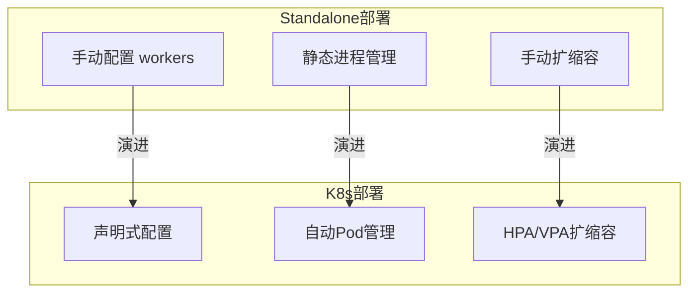
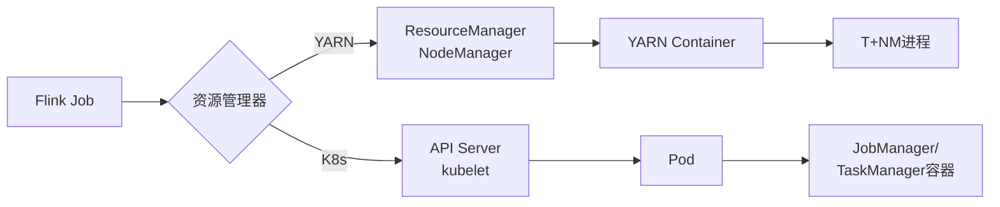
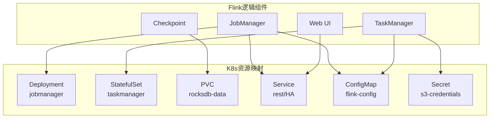
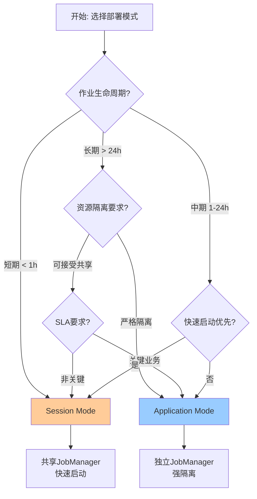
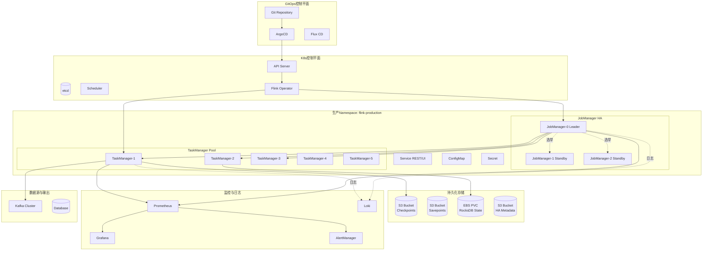
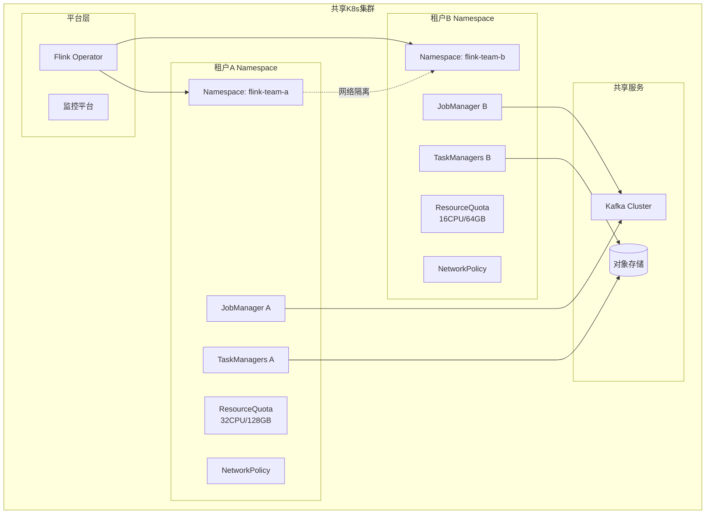
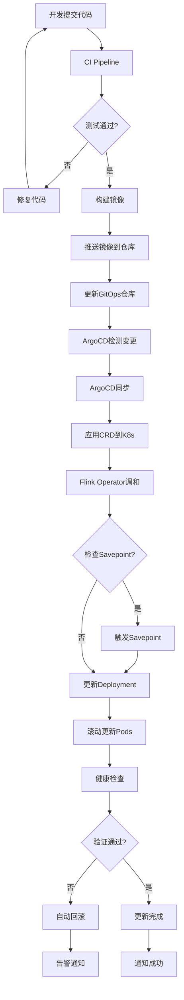
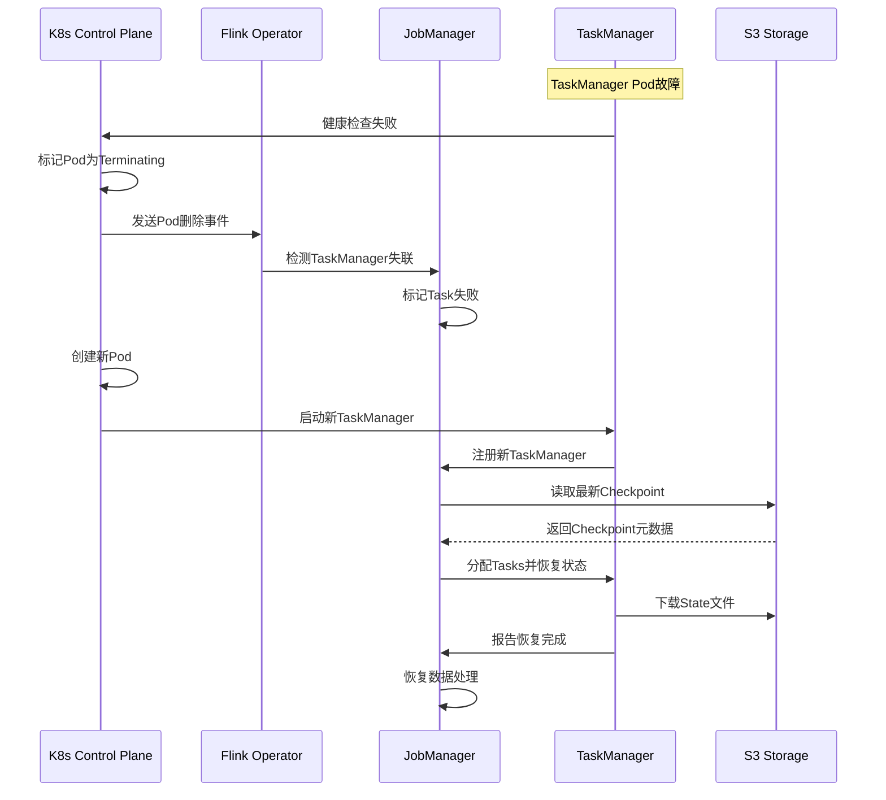

> **状态**: 稳定内容 | **风险等级**: 低 | **最后更新**: 2026-04-20
>
> 本文档基于 Apache Flink 已发布版本进行整理。内容反映当前稳定版本的实现。
>
# Flink on Kubernetes 生产级部署深度指南

> **所属阶段**: Flink/ | **前置依赖**: [Flink on Kubernetes 云原生部署完整指南](./kubernetes-deployment.md), [Flink 部署架构模式分析](../../01-concepts/deployment-architectures.md) | **形式化等级**: L3-L4

---

## 目录

- [Flink on Kubernetes 生产级部署深度指南](#flink-on-kubernetes-生产级部署深度指南)
  - [目录](#目录)
  - [1. 概念定义 (Definitions)](#1-概念定义-definitions)
    - [Def-F-10-10: K8s部署模式形式化](#def-f-10-10-k8s部署模式形式化)
    - [Def-F-10-11: Native K8s集成](#def-f-10-11-native-k8s集成)
    - [Def-F-10-12: Flink K8s Operator架构](#def-f-10-12-flink-k8s-operator架构)
    - [Def-F-10-13: 多租户隔离模型](#def-f-10-13-多租户隔离模型)
  - [2. 属性推导 (Properties)](#2-属性推导-properties)
    - [Prop-F-10-10: Application vs Session模式边界](#prop-f-10-10-application-vs-session模式边界)
    - [Prop-F-10-11: 资源配额约束](#prop-f-10-11-资源配额约束)
    - [Prop-F-10-12: 存储性能边界](#prop-f-10-12-存储性能边界)
  - [3. 关系建立 (Relations)](#3-关系建立-relations)
    - [与Standalone部署的关系](#与standalone部署的关系)
    - [与YARN部署的关系](#与yarn部署的关系)
    - [K8s原生资源映射](#k8s原生资源映射)
  - [4. 论证过程 (Argumentation)](#4-论证过程-argumentation)
    - [部署模式选择决策树](#部署模式选择决策树)
    - [资源规划方法论](#资源规划方法论)
    - [存储方案对比论证](#存储方案对比论证)
  - [5. 形式证明 / 工程论证]()
    - [Thm-F-10-10: K8s部署高可用性证明](#thm-f-10-10-k8s部署高可用性证明)
    - [Thm-F-10-11: 故障恢复正确性](#thm-f-10-11-故障恢复正确性)
    - [Thm-F-10-12: 扩缩容一致性保证](#thm-f-10-12-扩缩容一致性保证)
  - [6. 实例验证 (Examples)](#6-实例验证-examples)
    - [完整生产YAML配置](#完整生产yaml配置)
      - [6.1 Application Mode 完整生产配置](#61-application-mode-完整生产配置)
      - [6.2 Session Mode 生产配置](#62-session-mode-生产配置)
    - [多租户配置实例](#多租户配置实例)
    - [GitOps配置实例](#gitops配置实例)
      - [ArgoCD配置](#argocd配置)
      - [目录结构](#目录结构)
      - [Kustomize配置](#kustomize配置)
      - [CI/CD Pipeline (GitHub Actions)](#cicd-pipeline-github-actions)
  - [7. 可视化 (Visualizations)](#7-可视化-visualizations)
    - [7.1 Flink on K8s生产架构全景图](#71-flink-on-k8s生产架构全景图)
    - [7.2 多租户隔离架构](#72-多租户隔离架构)
    - [7.3 部署流程图](#73-部署流程图)
    - [7.4 故障恢复流程](#74-故障恢复流程)
  - [8. 引用参考 (References)](#8-引用参考-references)

---

## 1. 概念定义 (Definitions)

### Def-F-10-10: K8s部署模式形式化

**定义**: Flink on Kubernetes 的部署模式可以用一个四元组形式化描述：

```
K8sDeployment := ⟨Mode, Integration, Lifecycle, Isolation⟩

其中:
- Mode ∈ {Session, Application, Per-Job}
- Integration ∈ {Native, Standalone-on-K8s, Operator-managed}
- Lifecycle ∈ {Ephemeral, Long-running}
- Isolation ∈ {Namespace, Pod, Process}
```

**模式对比矩阵**:

| 维度 | Session Mode | Application Mode | Per-Job Mode |
|------|--------------|------------------|--------------|
| **Cluster生命周期** | 独立长期运行 | 与作业绑定 | 与作业绑定 |
| **JobManager** | 多作业共享 | 单作业独占 | 单作业独占 |
| **资源申请时机** | 作业提交前 | 作业提交时 | 作业提交时 |
| **启动延迟** | 低 (~秒级) | 中 (~分钟级) | 高 (~分钟级) |
| **K8s Native支持** | ✅ Deployment | ✅ Deployment | ❌ 已废弃 |
| **推荐度** | ⭐⭐⭐ | ⭐⭐⭐⭐⭐ | ⭐ (废弃) |

---

### Def-F-10-11: Native K8s集成

**定义**: Native Kubernetes 集成指 Flink 直接使用 Kubernetes API Server 进行资源管理，而非依赖外部资源调度器。

**形式化描述**:

```
NativeK8sIntegration : ResourceRequest → PodSpec → Pod

ResourceRequest := ⟨cpu, memory, disk, gpu⟩
PodSpec := ⟨container, volumes, affinity, tolerations⟩
```

**架构层次**:

```
┌─────────────────────────────────────────────────────────────┐
│  User Application Layer                                     │
│  ├── DataStream API / Table API / SQL                       │
│  └── User Code JAR                                          │
├─────────────────────────────────────────────────────────────┤
│  Flink Runtime Layer                                        │
│  ├── JobManager (Dispatcher + ResourceManager)              │
│  └── TaskManager (TaskExecutor)                             │
├─────────────────────────────────────────────────────────────┤
│  K8s Integration Layer                                      │
│  ├── Fabric8 Kubernetes Client                              │
│  ├── K8sResourceManager (implements ResourceManagerDriver)  │
│  └── K8sHaServices (implements HighAvailabilityServices)    │
├─────────────────────────────────────────────────────────────┤
│  Kubernetes Control Plane                                   │
│  ├── API Server                                             │
│  ├── etcd (Cluster State)                                   │
│  └── Scheduler                                              │
├─────────────────────────────────────────────────────────────┤
│  Infrastructure Layer                                       │
│  ├── Container Runtime (containerd/CRI-O)                   │
│  └── Node Resources (CPU/Memory/Storage)                    │
└─────────────────────────────────────────────────────────────┘
```

---

### Def-F-10-12: Flink K8s Operator架构

**定义**: Flink Kubernetes Operator 是一个基于 Kubernetes Operator 模式的控制平面，通过声明式 API 管理 Flink 应用的全生命周期。

**核心组件**:

```
┌──────────────────────────────────────────────────────────────┐
│                 Flink Kubernetes Operator                    │
├─────────────┬─────────────┬─────────────┬────────────────────┤
│   CRD       │  Controller │   Watcher   │   Reconciler       │
│  Manager    │   Manager   │   Service   │   Loop             │
├─────────────┴─────────────┴─────────────┴────────────────────┤
│                         K8s Client                           │
└──────────────────────────────────────────────────────────────┘
                              │
                              ▼
┌──────────────────────────────────────────────────────────────┐
│                      Kubernetes API Server                   │
└──────────────────────────────────────────────────────────────┘
```

**CRD 类型定义**:

| CRD | API Version | 用途 | 状态字段 |
|-----|-------------|------|----------|
| `FlinkDeployment` | flink.apache.org/v1beta1 | 部署Flink集群 | lifecycleState, jobStatus |
| `FlinkSessionJob` | flink.apache.org/v1beta1 | 向Session集群提交作业 | state, error |

---

### Def-F-10-13: 多租户隔离模型

**定义**: 多租户隔离模型定义了在共享K8s集群中隔离不同Flink应用的策略集合。

**隔离层次**:

```
IsolationLevel := {Cluster, Namespace, Node, Pod, Network, Storage}

ClusterIsolation   : 独立K8s集群
NamespaceIsolation : 共享集群,独立Namespace
NodeIsolation      : 专用Node Pool/Node Group
PodIsolation       : 独立Pod资源配额
NetworkIsolation   : NetworkPolicy隔离
StorageIsolation   : 独立StorageClass/PVC
```

**隔离强度矩阵**:

| 隔离层次 | 资源隔离 | 网络隔离 | 安全隔离 | 成本 |
|----------|----------|----------|----------|------|
| 独立集群 | ✅ 完全 | ✅ 完全 | ✅ 完全 | 高 |
| 命名空间 | ✅ 逻辑 | ⚠️ 策略 | ⚠️ RBAC | 中 |
| 节点池 | ✅ 物理 | ⚠️ CNI | ⚠️ 共享API | 中高 |
| 仅Pod | ❌ 共享 | ❌ 无 | ❌ 无 | 低 |

---

## 2. 属性推导 (Properties)

### Prop-F-10-10: Application vs Session模式边界

**命题**: Application Mode 在以下条件下优于 Session Mode：

```
Choose(Application) ⟺
  (JobLifetime > 24h) ∨
  (SLA_Critical = true) ∨
  (ResourceIsolation = required) ∨
  (UpgradeFrequency > 1/week)
```

**推导依据**:

1. **故障域隔离**: Application Mode 的 JobManager 故障仅影响单个作业
2. **升级灵活性**: 独立 JobManager 允许滚动升级而不影响其他作业
3. **资源确定性**: 避免多作业共享导致的资源争抢
4. **配置独立性**: 每个应用可独立配置 Checkpoint、重启策略等

---

### Prop-F-10-11: 资源配额约束

**命题**: Flink on K8s 的资源配置必须满足以下约束：

```
∀ Pod ∈ FlinkDeployment:
  Pod.memory.request ≥ FlinkMemory.process.size × 1.2
  Pod.cpu.request ≥ FlinkCPU.parallelism / TM_SlotNum

  Pod.memory.limit ≥ Pod.memory.request × 1.5
  Pod.cpu.limit ≥ Pod.cpu.request × 2.0
```

**资源计算模型**:

| 组件 | 内存计算 | CPU计算 |
|------|----------|---------|
| JobManager | 2GB + (并行度 × 100MB) | 0.5 + (并行度 × 0.1) |
| TaskManager | JVM Heap + Off-Heap + Network + Managed | slots × 1.0 |

**关键参数**:

```yaml
# TaskManager 内存配置 taskmanager.memory.process.size: 8192m
taskmanager.memory.flink.size: 6144m
taskmanager.memory.network.min: 256m
taskmanager.memory.network.max: 512m
taskmanager.memory.managed.size: 2048m  # RocksDB使用
```

---

### Prop-F-10-12: 存储性能边界

**命题**: 不同存储方案的性能边界满足：

```
Throughput(LocalSSD) > Throughput(EBS/GCPDisk) > Throughput(NFS/S3FS)
Latency(LocalSSD) < Latency(EBS/GCPDisk) < Latency(NFS/S3FS)

RocksDB性能瓶颈 ⟹ StorageIOPS < 3000 (云盘默认)
```

**存储方案对比**:

| 存储类型 | IOPS | 延迟 | 适用场景 | 成本 |
|----------|------|------|----------|------|
| 本地NVMe SSD | 100K+ | <100μs | 高频状态访问 | 中 |
| EBS io2 | 64K | ~1ms | 生产环境推荐 | 高 |
| EBS gp3 | 16K | ~5ms | 标准工作负载 | 中 |
| NFS/EFS | 3K+ | ~10ms | 共享存储 | 低 |

---

## 3. 关系建立 (Relations)

### 与Standalone部署的关系



**差异对比**:

| 维度 | Standalone | K8s Native |
|------|------------|------------|
| 部署方式 | 脚本/SSH | 声明式YAML |
| 扩缩容 | 手动修改配置 | HPA自动/手动调整replicas |
| 故障恢复 | 依赖外部监控 | K8s自动重启 |
| 资源隔离 | 进程级 | Pod级+Namespace级 |
| 服务发现 | 配置文件 | K8s Service/DNS |

---

### 与YARN部署的关系



**迁移考量**:

| 方面 | YARN | K8s | 迁移影响 |
|------|------|-----|----------|
| 资源调度 | 队列/容量 | Namespace/Quota | 需重新规划 |
| 存储集成 | HDFS原生 | 需CSI插件 | 配置变更 |
| 安全 | Kerberos | RBAC/OIDC | 认证方式变更 |
| 监控 | YARN UI | K8s Dashboard | 监控体系重构 |

---

### K8s原生资源映射



---

## 4. 论证过程 (Argumentation)

### 部署模式选择决策树



**决策规则**:

```
IF job_duration < 1h AND isolation != critical:
    SELECT Session Mode
ELSE IF job_duration > 24h OR isolation == critical:
    SELECT Application Mode
ELSE IF startup_latency < 30s:
    SELECT Session Mode
ELSE:
    SELECT Application Mode
```

---

### 资源规划方法论

**容量规划流程**:

```
1. 流量评估
   └── 峰值QPS × 平均消息大小 × 处理复杂度因子

2. 并行度计算
   └── Parallelism = max(⌈吞吐量/slot处理能力⌉, 最小并行度)

3. TaskManager数量
   └── TM_Count = ⌈Parallelism / Slots_Per_TM⌉

4. 内存配置
   └── TM_Memory = Heap + OffHeap + Network + Managed + JVM Overhead

5. CPU配置
   └── TM_CPU = Slots_Per_TM × (1.0 ~ 1.5)
```

**示例计算**:

| 指标 | 输入 | 计算 | 结果 |
|------|------|------|------|
| 峰值吞吐量 | 100,000 events/s | - | - |
| 单Slot处理能力 | 5,000 events/s | - | - |
| 理论并行度 | - | 100,000/5,000 | 20 |
| Slots/TM | 4 | - | - |
| TM数量 | - | ⌈20/4⌉ | 5 |
| 单TM内存 | 2GB Heap + 2GB Managed + 1GB Network | - | 5GB |
| 总TM内存 | - | 5 × 5GB | 25GB |

---

### 存储方案对比论证

**方案对比矩阵**:

| 方案 | 优点 | 缺点 | 适用场景 |
|------|------|------|----------|
| **RocksDB on PVC (云盘)** | 持久化、弹性扩容 | IOPS受限、延迟较高 | 标准生产环境 |
| **RocksDB on Local SSD** | 最高性能 | 数据易失、调度复杂 | 高性能计算 |
| **RocksDB on hostPath** | 性能接近本地 | 安全风险、不跨节点 | 单节点测试 |
| **HashMap + S3 Checkpoint** | 简单、无状态 | 大状态恢复慢 | 小状态作业 |

**推荐架构**:

```
生产环境推荐:
├── State Backend: RocksDB
├── Local State: 云盘 PVC (io2/io1)
├── Checkpoint: S3/OSS/GCS
├── Savepoint: S3/OSS/GCS
└── HA Metadata: K8s ConfigMap/ZK
```

---

## 5. 形式证明 / 工程论证

### Thm-F-10-10: K8s部署高可用性证明

**定理**: 在正确配置的 Flink on K8s 部署中，当任意单个节点故障时，作业可在T时间内恢复且状态不丢失。

**证明**:

```
假设条件:
1. Checkpoint间隔: c (默认30s)
2. Checkpoint超时: t_c (默认10min)
3. K8s Pod重启时间: t_r (通常<2min)
4. State Backend: RocksDB with incremental checkpoint
5. HA Mode: Enabled with K8s HA Services

证明步骤:

Step 1: 故障检测
  K8s Control Plane 通过 kubelet 健康检查检测节点故障
  检测时间 ≤ node-monitor-grace-period (默认40s)

Step 2: Pod重新调度
  K8s Scheduler 将 Pod 调度到健康节点
  调度 + 启动时间 ≤ t_r

Step 3: 状态恢复
  JobManager 从最新成功 Checkpoint 恢复
  恢复时间 ∝ StateSize / DownloadBandwidth

Step 4: 作业重启
  Flink Restart Strategy 重新调度 Tasks
  恢复消费从 Checkpoint 位点

结论:
总恢复时间 T ≤ 40s + t_r + (StateSize/BW) + TaskRestartTime
状态丢失风险 ≤ 最近一次Checkpoint之后的数据 (≤ c + t_c)
```

**高可用配置**:

```yaml
spec:
  flinkConfiguration:
    # HA配置
    high-availability: kubernetes
    high-availability.storageDir: s3://flink-ha/ha-metadata

    # JobManager多副本 (Flink 2.0+)
    jobmanager.high-availability.mode: kubernetes
    kubernetes.jobmanager.replicas: 3

    # Checkpoint配置
    execution.checkpointing.interval: 30s
    execution.checkpointing.min-pause-between-checkpoints: 30s
    execution.checkpointing.timeout: 10m
    execution.checkpointing.max-concurrent-checkpoints: 1
    execution.checkpointing.tolerable-failed-checkpoints: 3
    execution.checkpointing.unaligned.enabled: false

    # 重启策略
    restart-strategy: exponential-delay
    restart-strategy.exponential-delay.initial-backoff: 1s
    restart-strategy.exponential-delay.max-backoff: 60s
    restart-strategy.exponential-delay.backoff-multiplier: 2.0
    restart-strategy.exponential-delay.reset-backoff-threshold: 300s
```

---

### Thm-F-10-11: 故障恢复正确性

**定理**: 在启用 Checkpoint 和 Exactly-Once Sink 的情况下，Flink on K8s 保证端到端 Exactly-Once 语义。

**证明概要**:

```
前提条件:
1. Checkpoint barrier 对齐或非对齐模式配置正确
2. Sink 实现 Two-Phase Commit 协议
3. State Backend 配置为 RocksDB with incremental checkpoint
4. Checkpoint 存储使用持久化存储 (S3/OSS)

正确性论证:

1. Source 可重放:
   KafkaSource 使用 consumer group + offset 保证可重放

2. 算子状态一致性:
   Checkpoint barrier 确保所有算子在一致状态点快照

3. Sink 两阶段提交:
   Pre-commit: 写入数据到外部系统事务
   Commit: Checkpoint 成功后提交事务
   Abort: Checkpoint 失败时回滚事务

4. K8s 故障恢复:
   Pod 重启后从最新 Checkpoint 恢复
   未提交的事务不会对外部系统可见

∴ 任意故障场景下,Exactly-Once 语义得到保证
```

---

### Thm-F-10-12: 扩缩容一致性保证

**定理**: 使用 Reactive Mode 或 HPA 进行扩缩容时，Flink 作业的状态一致性得到保持。

**证明**:

```
扩缩容场景:

1. 扩容 (增加 TaskManager):
   - 新 TM 向 JM 注册
   - JM 触发重新平衡 (Rebalance)
   - 状态从 Checkpoint/Savepoint 重新分配到新 Slots
   - 无需停止作业

2. 缩容 (减少 TaskManager):
   - JM 触发 Checkpoint
   - 停止受影响 Tasks
   - 将状态迁移到剩余 Slots
   - 从 Checkpoint 恢复

一致性保证:
- 重新平衡过程中,Source 暂停消费直到完成
- 状态迁移基于一致的 Checkpoint 快照
- Keyed State 根据 Key Group 重新分配

因此扩缩容操作保持状态一致性
```

**扩缩容配置**:

```yaml
spec:
  flinkConfiguration:
    # Reactive Mode (自动扩缩容)
    scheduler-mode: REACTIVE
    cluster.declarative-resource-management.enabled: "true"

    # 自适应调度器
    scheduler: Adaptive
    jobmanager.scheduler: Adaptive

    # 资源上下限
    kubernetes.taskmanager.annotations: |
      autoscaling.k8s.io/minReplicas: "2"
      autoscaling.k8s.io/maxReplicas: "20"
```

---

## 6. 实例验证 (Examples)

### 完整生产YAML配置

#### 6.1 Application Mode 完整生产配置

```yaml
# ============================================================================
# Flink Application Mode 生产级部署配置
# 版本: Flink 2.0
# 场景: 实时ETL管道,高吞吐,强一致性要求
# ============================================================================

apiVersion: flink.apache.org/v1beta1
kind: FlinkDeployment
metadata:
  name: production-realtime-etl
  namespace: flink-production
  labels:
    app: realtime-etl
    environment: production
    team: data-platform
spec:
  # -------------------------------------------------------------------------
  # 镜像配置
  # -------------------------------------------------------------------------
  image: flink:2.0.0-scala_2.12-java17
  flinkVersion: v2.0
  mode: native

  # -------------------------------------------------------------------------
  # ServiceAccount (RBAC)
  # -------------------------------------------------------------------------
  serviceAccount: flink-production-sa

  # -------------------------------------------------------------------------
  # Flink全局配置
  # -------------------------------------------------------------------------
  flinkConfiguration:
    # 集群标识
    kubernetes.cluster-id: production-realtime-etl
    kubernetes.namespace: flink-production

    # =======================================================================
    # 1. 高可用配置 (HA)
    # =======================================================================
    high-availability: kubernetes
    high-availability.storageDir: s3://flink-production-ha/ha-metadata
    kubernetes.jobmanager.replicas: 3

    # =======================================================================
    # 2. Checkpoint与状态配置
    # =======================================================================
    # State Backend
    state.backend: rocksdb
    state.backend.incremental: "true"
    state.backend.rocksdb.memory.managed: "true"
    state.backend.rocksdb.predefined-options: FLASH_SSD_OPTIMIZED

    # Checkpoint存储
    state.checkpoint-storage: filesystem
    state.checkpoints.dir: s3://flink-production-checkpoints/realtime-etl
    state.savepoints.dir: s3://flink-production-savepoints/realtime-etl

    # Checkpoint参数
    execution.checkpointing.interval: 30s
    execution.checkpointing.min-pause-between-checkpoints: 30s
    execution.checkpointing.timeout: 10m
    execution.checkpointing.max-concurrent-checkpoints: 1
    execution.checkpointing.tolerable-failed-checkpoints: 3
    execution.checkpointing.unaligned.enabled: "false"
    execution.checkpointing.externalized-checkpoint-retention: RETAIN_ON_CANCELLATION

    # =======================================================================
    # 3. 网络与缓冲配置
    # =======================================================================
    taskmanager.memory.network.min: 512m
    taskmanager.memory.network.max: 1g
    taskmanager.memory.network.fraction: 0.15

    # 网络缓冲区
    taskmanager.memory.framework.off-heap.batch-allocations: "true"

    # =======================================================================
    # 4. 重启策略
    # =======================================================================
    restart-strategy: exponential-delay
    restart-strategy.exponential-delay.initial-backoff: 1s
    restart-strategy.exponential-delay.max-backoff: 60s
    restart-strategy.exponential-delay.backoff-multiplier: 2.0
    restart-strategy.exponential-delay.reset-backoff-threshold: 300s
    restart-strategy.exponential-delay.jitter-factor: 0.1

    # =======================================================================
    # 5. 自适应调度配置 (Flink 2.0)
    # =======================================================================
    scheduler-mode: REACTIVE
    scheduler: Adaptive
    cluster.declarative-resource-management.enabled: "true"
    jobmanager.scheduler: Adaptive

    # =======================================================================
    # 6. Web UI与安全配置
    # =======================================================================
    rest.flamegraph.enabled: "true"
    web.submit.enable: "false"
    web.cancel.enable: "false"

    # =======================================================================
    # 7. 类加载配置
    # =======================================================================
    classloader.resolve-order: parent-first
    classloader.check-leaked-classloader: "true"

    # =======================================================================
    # 8. 指标与监控配置
    # =======================================================================
    metrics.reporters: prom
    metrics.reporter.prom.class: org.apache.flink.metrics.prometheus.PrometheusReporter
    metrics.reporter.prom.port: 9249
    metrics.reporter.prom.filter.includes: "*"

    metrics.latency.interval: 1000
    metrics.latency.granularity: operator

    # =======================================================================
    # 9. JVM配置
    # =======================================================================
    env.java.opts: "-XX:+UseG1GC -XX:MaxGCPauseMillis=100 -XX:+UnlockExperimentalVMOptions"
    env.java.opts.jobmanager: "-Xmx2048m -Xms2048m"
    env.java.opts.taskmanager: "-Xmx4096m -Xms4096m"

  # -------------------------------------------------------------------------
  # JobManager配置
  # -------------------------------------------------------------------------
  jobManager:
    resource:
      memory: "4Gi"
      cpu: 2.0
    replicas: 1
    podTemplate:
      spec:
        # 安全上下文
        securityContext:
          runAsUser: 9999
          runAsGroup: 9999
          fsGroup: 9999

        # 亲和性配置
        affinity:
          podAntiAffinity:
            preferredDuringSchedulingIgnoredDuringExecution:
              - weight: 100
                podAffinityTerm:
                  labelSelector:
                    matchLabels:
                      app.kubernetes.io/component: jobmanager
                  topologyKey: kubernetes.io/hostname
          nodeAffinity:
            requiredDuringSchedulingIgnoredDuringExecution:
              nodeSelectorTerms:
                - matchExpressions:
                    - key: node-type
                      operator: In
                      values:
                        - flink-jobmanager

        # 容忍度
        tolerations:
          - key: "dedicated"
            operator: "Equal"
            value: "flink-jobmanager"
            effect: "NoSchedule"

        containers:
          - name: flink-main-container
            image: flink:2.0.0-scala_2.12-java17

            # 资源限制
            resources:
              limits:
                memory: "5Gi"
                cpu: "2500m"
              requests:
                memory: "4Gi"
                cpu: "2000m"

            # 环境变量
            env:
              - name: ENABLE_BUILT_IN_PLUGINS
                value: "flink-metrics-prometheus,flink-gs-fs-hadoop"
              - name: AWS_REGION
                valueFrom:
                  configMapKeyRef:
                    name: aws-config
                    key: region

            # 安全配置
            securityContext:
              allowPrivilegeEscalation: false
              readOnlyRootFilesystem: true
              capabilities:
                drop:
                  - ALL

            # 健康检查
            livenessProbe:
              httpGet:
                path: /overview
                port: 8081
              initialDelaySeconds: 30
              periodSeconds: 30
              timeoutSeconds: 10
              failureThreshold: 3

            readinessProbe:
              httpGet:
                path: /overview
                port: 8081
              initialDelaySeconds: 10
              periodSeconds: 10
              timeoutSeconds: 5
              failureThreshold: 3

            # 卷挂载
            volumeMounts:
              - name: flink-config
                mountPath: /opt/flink/conf
                readOnly: true
              - name: tmp-volume
                mountPath: /tmp
              - name: flink-usrlib
                mountPath: /opt/flink/usrlib

        # 卷定义
        volumes:
          - name: flink-config
            configMap:
              name: flink-production-config
          - name: tmp-volume
            emptyDir: {}
          - name: flink-usrlib
            persistentVolumeClaim:
              claimName: flink-usrlib-pvc

        # 初始化容器
        initContainers:
          - name: download-jar
            image: amazon/aws-cli:latest
            command:
              - sh
              - -c
              - |
                aws s3 cp s3://flink-artifacts/realtime-etl-1.0.0.jar /usrlib/
            volumeMounts:
              - name: flink-usrlib
                mountPath: /usrlib

  # -------------------------------------------------------------------------
  # TaskManager配置
  # -------------------------------------------------------------------------
  taskManager:
    resource:
      memory: "8Gi"
      cpu: 4.0
    replicas: 5
    podTemplate:
      spec:
        securityContext:
          runAsUser: 9999
          runAsGroup: 9999
          fsGroup: 9999

        affinity:
          podAntiAffinity:
            requiredDuringSchedulingIgnoredDuringExecution:
              - labelSelector:
                  matchLabels:
                    app.kubernetes.io/component: taskmanager
                topologyKey: kubernetes.io/hostname
          nodeAffinity:
            preferredDuringSchedulingIgnoredDuringExecution:
              - weight: 100
                preference:
                  matchExpressions:
                    - key: node-type
                      operator: In
                      values:
                        - flink-taskmanager

        tolerations:
          - key: "dedicated"
            operator: "Equal"
            value: "flink-taskmanager"
            effect: "NoSchedule"

        containers:
          - name: flink-main-container
            image: flink:2.0.0-scala_2.12-java17

            resources:
              limits:
                memory: "10Gi"
                cpu: "5000m"
              requests:
                memory: "8Gi"
                cpu: "4000m"

            env:
              - name: ENABLE_BUILT_IN_PLUGINS
                value: "flink-metrics-prometheus,flink-gs-fs-hadoop"

            securityContext:
              allowPrivilegeEscalation: false
              readOnlyRootFilesystem: true
              capabilities:
                drop:
                  - ALL

            volumeMounts:
              - name: flink-config
                mountPath: /opt/flink/conf
                readOnly: true
              - name: rocksdb-storage
                mountPath: /opt/flink/rocksdb
              - name: tmp-volume
                mountPath: /tmp

        volumes:
          - name: flink-config
            configMap:
              name: flink-production-config
          - name: rocksdb-storage
            persistentVolumeClaim:
              claimName: rocksdb-pvc-template
          - name: tmp-volume
            emptyDir: {}

  # -------------------------------------------------------------------------
  # 作业配置
  # -------------------------------------------------------------------------
  job:
    jarURI: local:///opt/flink/usrlib/realtime-etl-1.0.0.jar
    parallelism: 20
    upgradeMode: stateful
    state: running
    args:
      - "--kafka.bootstrap.servers"
      - "kafka-cluster.kafka:9092"
      - "--kafka.security.protocol"
      - "SASL_SSL"
      - "--output.s3.bucket"
      - "processed-data"
      - "--checkpoint.interval"
      - "30s"

---
# ============================================================================
# 依赖配置
# ============================================================================

# ServiceAccount与RBAC apiVersion: v1
kind: ServiceAccount
metadata:
  name: flink-production-sa
  namespace: flink-production
  annotations:
    # 如果使用IRSA (EKS)
    eks.amazonaws.com/role-arn: arn:aws:iam::123456789012:role/flink-production-role

---
apiVersion: rbac.authorization.k8s.io/v1
kind: Role
metadata:
  name: flink-production-role
  namespace: flink-production
rules:
  - apiGroups: [""]
    resources: ["pods", "services", "configmaps", "persistentvolumeclaims"]
    verbs: ["create", "get", "list", "update", "delete", "watch", "patch"]
  - apiGroups: ["apps"]
    resources: ["deployments", "statefulsets"]
    verbs: ["create", "get", "list", "update", "delete", "watch", "patch"]
  - apiGroups: ["networking.k8s.io"]
    resources: ["networkpolicies"]
    verbs: ["get", "list", "watch"]

---
apiVersion: rbac.authorization.k8s.io/v1
kind: RoleBinding
metadata:
  name: flink-production-binding
  namespace: flink-production
subjects:
  - kind: ServiceAccount
    name: flink-production-sa
    namespace: flink-production
roleRef:
  kind: Role
  name: flink-production-role
  apiGroup: rbac.authorization.k8s.io

---
# RocksDB PVC模板 apiVersion: v1
kind: PersistentVolumeClaim
metadata:
  name: rocksdb-pvc-template
  namespace: flink-production
spec:
  accessModes:
    - ReadWriteOnce
  storageClassName: fast-ssd  # 高性能SSD存储类
  resources:
    requests:
      storage: 100Gi

---
# 应用库PVC apiVersion: v1
kind: PersistentVolumeClaim
metadata:
  name: flink-usrlib-pvc
  namespace: flink-production
spec:
  accessModes:
    - ReadWriteMany  # 多Pod只读挂载
  storageClassName: efs-sc  # EFS或类似共享存储
  resources:
    requests:
      storage: 10Gi

---
# ConfigMap apiVersion: v1
kind: ConfigMap
metadata:
  name: flink-production-config
  namespace: flink-production
data:
  log4j-console.properties: |
    rootLogger.level=INFO
    rootLogger.appenderRef.console.ref=ConsoleAppender
    appender.console.name=ConsoleAppender
    appender.console.type=CONSOLE
    appender.console.layout.type=PatternLayout
    appender.console.layout.pattern=%d{yyyy-MM-dd HH:mm:ss,SSS} %-5p %-60c %x - %m%n

    # 降低某些包的日志级别
    logger.netty.name=org.apache.flink.shaded.akka.org.jboss.netty
    logger.netty.level=OFF

---
# NetworkPolicy apiVersion: networking.k8s.io/v1
kind: NetworkPolicy
metadata:
  name: flink-production-network-policy
  namespace: flink-production
spec:
  podSelector:
    matchLabels:
      app: realtime-etl
  policyTypes:
    - Ingress
    - Egress
  ingress:
    # JobManager接收TaskManager连接
    - from:
        - podSelector:
            matchLabels:
              app.kubernetes.io/component: taskmanager
      ports:
        - protocol: TCP
          port: 6123
        - protocol: TCP
          port: 6124
        - protocol: TCP
          port: 6125
    # 外部访问REST API和Web UI
    - from:
        - namespaceSelector: {}
      ports:
        - protocol: TCP
          port: 8081
    # Prometheus拉取指标
    - from:
        - namespaceSelector:
            matchLabels:
              name: monitoring
      ports:
        - protocol: TCP
          port: 9249
  egress:
    # 访问Kafka
    - to:
        - namespaceSelector:
            matchLabels:
              name: kafka
      ports:
        - protocol: TCP
          port: 9092
        - protocol: TCP
          port: 9093
    # 访问S3/OSS
    - to:
        - ipBlock:
            cidr: 0.0.0.0/0
      ports:
        - protocol: TCP
          port: 443
    # DNS
    - to:
        - namespaceSelector: {}
      ports:
        - protocol: UDP
          port: 53

---
# ServiceMonitor for Prometheus apiVersion: monitoring.coreos.com/v1
kind: ServiceMonitor
metadata:
  name: flink-production-metrics
  namespace: monitoring
  labels:
    release: prometheus
spec:
  namespaceSelector:
    matchNames:
      - flink-production
  selector:
    matchLabels:
      app: realtime-etl
  endpoints:
    - port: prom
      interval: 15s
      path: /metrics
      scheme: http
```

---

#### 6.2 Session Mode 生产配置

```yaml
# ============================================================================
# Flink Session Mode 生产级部署配置
# 适用场景: 多租户SQL网关、Ad-hoc查询、开发测试
# ============================================================================

apiVersion: flink.apache.org/v1beta1
kind: FlinkDeployment
metadata:
  name: flink-session-cluster
  namespace: flink-shared
  labels:
    app: flink-session
    environment: production
spec:
  image: flink:2.0.0-scala_2.12-java17
  flinkVersion: v2.0
  mode: native
  serviceAccount: flink-session-sa

  flinkConfiguration:
    kubernetes.cluster-id: flink-session-cluster
    kubernetes.namespace: flink-shared

    # Session模式配置
    high-availability: kubernetes
    high-availability.storageDir: s3://flink-ha/session-cluster

    # Web UI和SQL Gateway
    sql-gateway.enabled: "true"
    sql-gateway.endpoint.type: REST
    sql-gateway.endpoint.rest.bind-address: 0.0.0.0
    sql-gateway.endpoint.rest.bind-port: 8083

    # 多租户资源配置
    kubernetes.taskmanager.annotations: |
      cluster-autoscaler.kubernetes.io/safe-to-evict: "false"

    # 默认Checkpoint配置 (可被作业覆盖)
    state.backend: rocksdb
    state.checkpoint-storage: filesystem
    state.checkpoints.dir: s3://flink-checkpoints/session-default
    execution.checkpointing.interval: 60s

    # 指标配置
    metrics.reporters: prom
    metrics.reporter.prom.class: org.apache.flink.metrics.prometheus.PrometheusReporter
    metrics.reporter.prom.port: 9249

  jobManager:
    resource:
      memory: "8Gi"
      cpu: 4.0
    replicas: 1
    podTemplate:
      spec:
        containers:
          - name: flink-main-container
            resources:
              limits:
                memory: "10Gi"
                cpu: "5000m"
              requests:
                memory: "8Gi"
                cpu: "4000m"
            ports:
              - containerPort: 8081
                name: rest
              - containerPort: 8083
                name: sql-gateway
              - containerPort: 9249
                name: prom

  taskManager:
    resource:
      memory: "16Gi"
      cpu: 8.0
    replicas: 3

---
# Session Job提交示例 apiVersion: flink.apache.org/v1beta1
kind: FlinkSessionJob
metadata:
  name: ad-hoc-sql-query
  namespace: flink-shared
spec:
  deploymentName: flink-session-cluster
  job:
    jarURI: local:///opt/flink/opt/flink-sql-client-2.0.0.jar
    parallelism: 4
    upgradeMode: stateless
    args:
      - "-f"
      - "/opt/flink/queries/analytics.sql"
```

---

### 多租户配置实例

```yaml
# ============================================================================
# 多租户隔离配置
# ============================================================================

# 1. 命名空间配置
---
apiVersion: v1
kind: Namespace
metadata:
  name: flink-team-a
  labels:
    team: team-a
    environment: production
---
apiVersion: v1
kind: Namespace
metadata:
  name: flink-team-b
  labels:
    team: team-b
    environment: production

# 2. 资源配额配置
---
apiVersion: v1
kind: ResourceQuota
metadata:
  name: flink-team-a-quota
  namespace: flink-team-a
spec:
  hard:
    requests.cpu: "32"
    requests.memory: 128Gi
    limits.cpu: "64"
    limits.memory: 256Gi
    persistentvolumeclaims: "10"
    pods: "20"
---
apiVersion: v1
kind: ResourceQuota
metadata:
  name: flink-team-b-quota
  namespace: flink-team-b
spec:
  hard:
    requests.cpu: "16"
    requests.memory: 64Gi
    limits.cpu: "32"
    limits.memory: 128Gi
    persistentvolumeclaims: "5"
    pods: "10"

# 3. 限制范围配置
---
apiVersion: v1
kind: LimitRange
metadata:
  name: flink-default-limits
  namespace: flink-team-a
spec:
  limits:
    - default:
        cpu: "2"
        memory: 4Gi
      defaultRequest:
        cpu: "1"
        memory: 2Gi
      max:
        cpu: "8"
        memory: 16Gi
      min:
        cpu: "100m"
        memory: 256Mi
      type: Container

# 4. 网络隔离 - NetworkPolicy
---
apiVersion: networking.k8s.io/v1
kind: NetworkPolicy
metadata:
  name: deny-cross-namespace
  namespace: flink-team-a
spec:
  podSelector: {}
  policyTypes:
    - Ingress
    - Egress
  ingress:
    - from:
        - podSelector: {}
    - from:
        - namespaceSelector:
            matchLabels:
              name: kube-system
    - from:
        - namespaceSelector:
            matchLabels:
              name: monitoring
  egress:
    - to:
        - podSelector: {}
    - to:
        - namespaceSelector:
            matchLabels:
              name: kube-system
    - to:
        - namespaceSelector:
            matchLabels:
              name: kafka
    - to:
        - ipBlock:
            cidr: 0.0.0.0/0
            except:
              - 10.0.0.0/8  # 阻止访问其他内网

# 5. 节点亲和性 - 专用节点池
---
apiVersion: flink.apache.org/v1beta1
kind: FlinkDeployment
metadata:
  name: team-a-flink-job
  namespace: flink-team-a
spec:
  # ...其他配置
  jobManager:
    podTemplate:
      spec:
        nodeSelector:
          team: team-a
          node-type: flink
        tolerations:
          - key: "team"
            operator: "Equal"
            value: "team-a"
            effect: "NoSchedule"
  taskManager:
    podTemplate:
      spec:
        nodeSelector:
          team: team-a
          node-type: flink
        tolerations:
          - key: "team"
            operator: "Equal"
            value: "team-a"
            effect: "NoSchedule"
```

---

### GitOps配置实例

#### ArgoCD配置

```yaml
# ============================================================================
# ArgoCD GitOps配置
# ============================================================================

# ArgoCD Application定义
---
apiVersion: argoproj.io/v1alpha1
kind: Application
metadata:
  name: flink-production-apps
  namespace: argocd
  finalizers:
    - resources-finalizer.argocd.argoproj.io
  annotations:
    argocd.argoproj.io/sync-wave: "1"
spec:
  project: flink-production
  source:
    repoURL: https://github.com/company/gitops-flink.git
    targetRevision: main
    path: environments/production
    directory:
      recurse: true
      jsonnet: {}
  destination:
    server: https://kubernetes.default.svc
    namespace: flink-production
  syncPolicy:
    automated:
      prune: true
      selfHeal: true
      allowEmpty: false
    syncOptions:
      - CreateNamespace=true
      - PrunePropagationPolicy=foreground
      - PruneLast=true
    retry:
      limit: 5
      backoff:
        duration: 5s
        factor: 2
        maxDuration: 3m
  revisionHistoryLimit: 10

---
# AppProject定义 apiVersion: argoproj.io/v1alpha1
kind: AppProject
metadata:
  name: flink-production
  namespace: argocd
spec:
  description: Flink Production Workloads
  sourceRepos:
    - https://github.com/company/gitops-flink.git
  destinations:
    - namespace: flink-production
      server: https://kubernetes.default.svc
    - namespace: flink-shared
      server: https://kubernetes.default.svc
  clusterResourceWhitelist:
    - group: rbac.authorization.k8s.io
      kind: ClusterRole
    - group: rbac.authorization.k8s.io
      kind: ClusterRoleBinding
  namespaceResourceWhitelist:
    - group: flink.apache.org
      kind: FlinkDeployment
    - group: flink.apache.org
      kind: FlinkSessionJob
    - group: ""
      kind: ConfigMap
    - group: ""
      kind: Secret
    - group: ""
      kind: ServiceAccount
  orphanedResources:
    warn: true
```

#### 目录结构

```
gitops-flink/
├── environments/
│   ├── production/
│   │   ├── kustomization.yaml
│   │   ├── realtime-etl/
│   │   │   ├── flinkdeployment.yaml
│   │   │   ├── rbac.yaml
│   │   │   └── kustomization.yaml
│   │   ├── fraud-detection/
│   │   │   ├── flinkdeployment.yaml
│   │   │   └── kustomization.yaml
│   │   └── shared-resources/
│   │       ├── namespace.yaml
│   │       ├── resourcequota.yaml
│   │       └── networkpolicy.yaml
│   └── staging/
│       └── ...
├── base/
│   ├── flink-operator/
│   │   └── helm-release.yaml
│   └── monitoring/
│       ├── servicemonitor.yaml
│       └── dashboards/
└── README.md
```

#### Kustomize配置

```yaml
# environments/production/kustomization.yaml apiVersion: kustomize.config.k8s.io/v1beta1
kind: Kustomization

namespace: flink-production

resources:
  - shared-resources/namespace.yaml
  - shared-resources/resourcequota.yaml
  - shared-resources/networkpolicy.yaml
  - realtime-etl/
  - fraud-detection/

commonLabels:
  environment: production
  managed-by: argocd

images:
  - name: flink
    newTag: "2.0.0-scala_2.12-java17"

configMapGenerator:
  - name: flink-shared-config
    literals:
      - AWS_REGION=us-west-2
      - S3_CHECKPOINT_BUCKET=s3://flink-production-checkpoints
```

#### CI/CD Pipeline (GitHub Actions)

```yaml
# .github/workflows/deploy-flink.yaml name: Deploy Flink Applications

on:
  push:
    branches:
      - main
    paths:
      - 'environments/**'
  pull_request:
    branches:
      - main
    paths:
      - 'environments/**'

jobs:
  validate:
    runs-on: ubuntu-latest
    steps:
      - uses: actions/checkout@v4

      - name: Setup Kubectl
        uses: azure/setup-kubectl@v3

      - name: Setup Kustomize
        run: |
          curl -s "https://raw.githubusercontent.com/kubernetes-sigs/kustomize/master/hack/install_kustomize.sh" | bash
          sudo mv kustomize /usr/local/bin/

      - name: Validate YAML
        run: |
          find environments -name '*.yaml' -exec kubectl apply --dry-run=client -f {} \;

      - name: Kustomize Build
        run: |
          kustomize build environments/production > /tmp/production-manifests.yaml

      - name: Validate FlinkDeployment Schema
        run: |
          # 使用 kubeval 或类似工具验证CRD
          docker run --rm -v /tmp:/tmp garethr/kubeval /tmp/production-manifests.yaml

  security-scan:
    runs-on: ubuntu-latest
    needs: validate
    steps:
      - uses: actions/checkout@v4

      - name: Trivy Scan
        uses: aquasecurity/trivy-action@master
        with:
          scan-type: 'config'
          scan-ref: './environments'
          severity: 'CRITICAL,HIGH'
          exit-code: '1'

  deploy-staging:
    runs-on: ubuntu-latest
    needs: [validate, security-scan]
    if: github.ref == 'refs/heads/main'
    environment: staging
    steps:
      - uses: actions/checkout@v4

      - name: Configure AWS Credentials
        uses: aws-actions/configure-aws-credentials@v4
        with:
          role-to-assume: arn:aws:iam::123456789012:role/GitHubActionsRole
          aws-region: us-west-2

      - name: Update kubeconfig
        run: aws eks update-kubeconfig --name staging-cluster

      - name: Deploy to Staging
        run: |
          kustomize build environments/staging | kubectl apply -f -

      - name: Wait for Rollout
        run: |
          kubectl wait --for=condition=ready flinkdeployment -l environment=staging --timeout=600s

  deploy-production:
    runs-on: ubuntu-latest
    needs: deploy-staging
    if: github.ref == 'refs/heads/main'
    environment: production  # 需要手动审批
    steps:
      - uses: actions/checkout@v4

      - name: Configure AWS Credentials
        uses: aws-actions/configure-aws-credentials@v4
        with:
          role-to-assume: arn:aws:iam::123456789012:role/GitHubActionsRole
          aws-region: us-west-2

      - name: Update kubeconfig
        run: aws eks update-kubeconfig --name production-cluster

      - name: Deploy to Production
        run: |
          kustomize build environments/production | kubectl apply -f -

      - name: Wait for Rollout
        run: |
          kubectl wait --for=condition=ready flinkdeployment -l environment=production --timeout=600s

      - name: Verify Deployment
        run: |
          kubectl get flinkdeployment -n flink-production
```

---

## 7. 可视化 (Visualizations)

### 7.1 Flink on K8s生产架构全景图



### 7.2 多租户隔离架构



### 7.3 部署流程图



### 7.4 故障恢复流程



---

## 8. 引用参考 (References)


---

*文档版本: v1.0 | 创建日期: 2026-04-02 | 形式化等级: L4*
