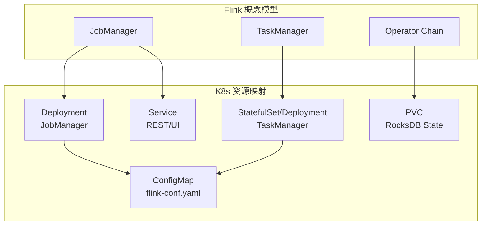
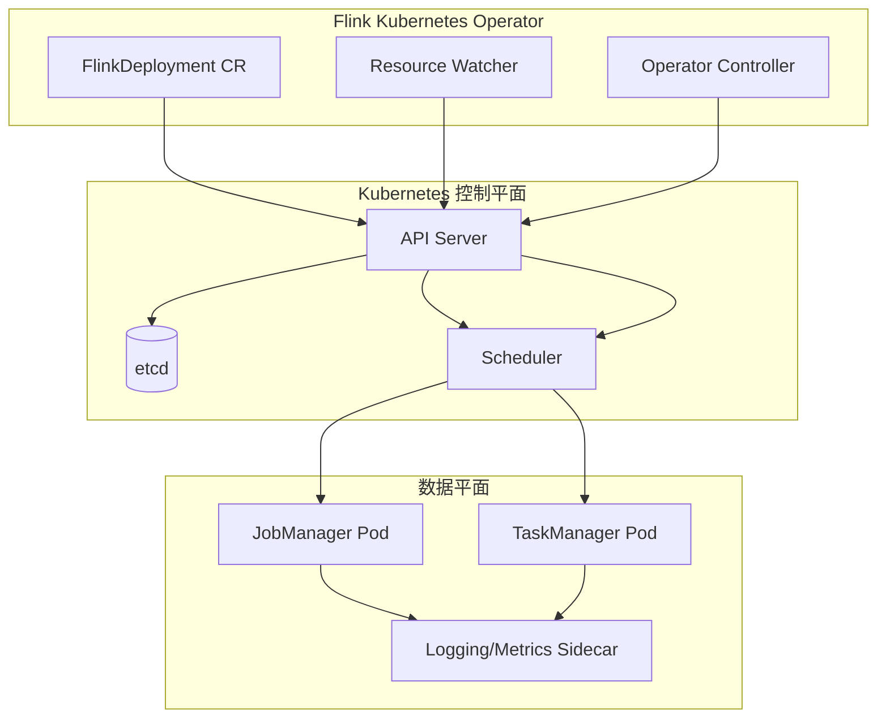
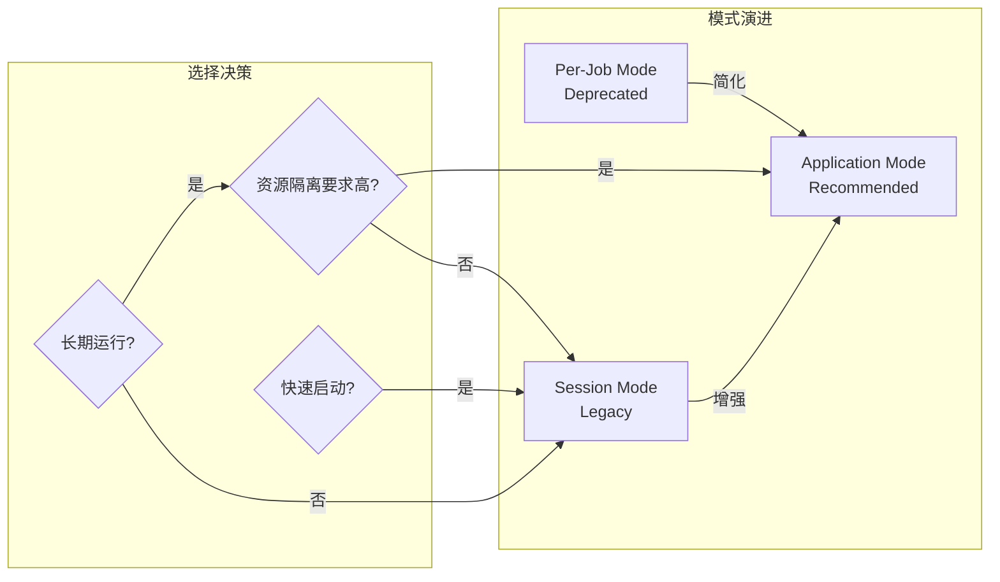
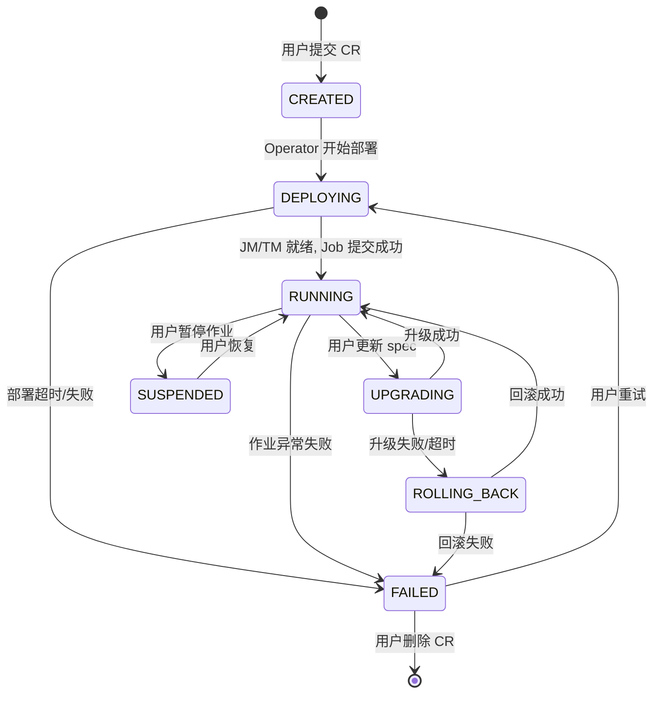
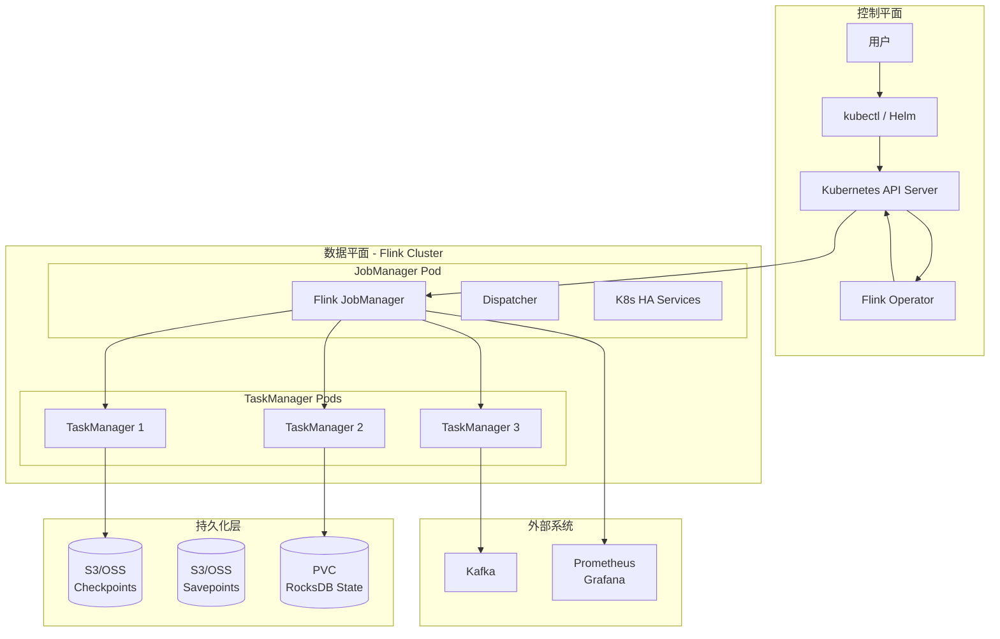
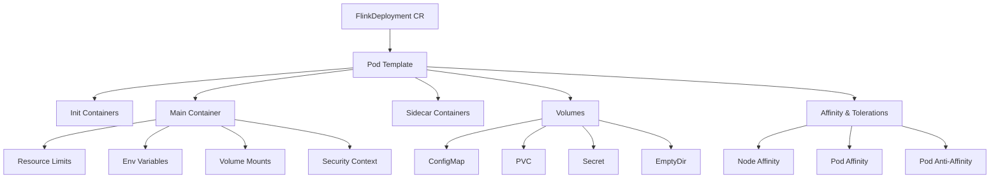
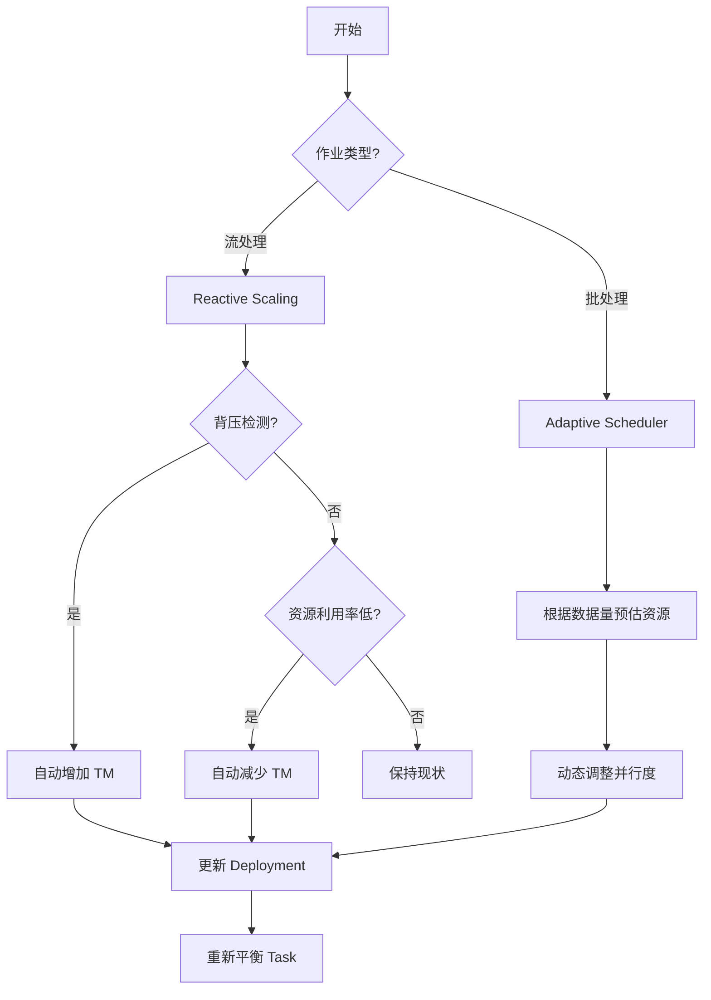
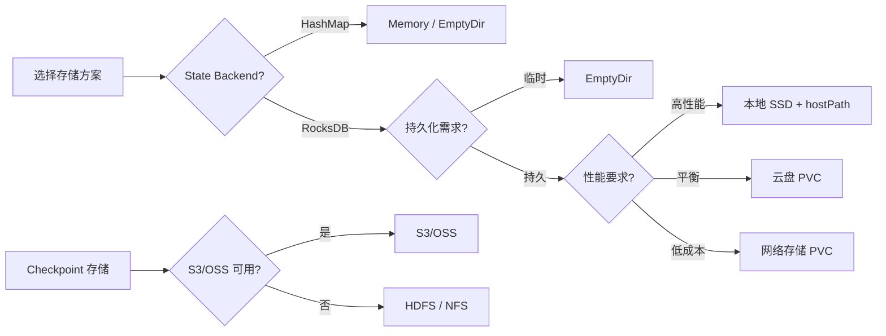

# Flink on Kubernetes - 云原生部署完整指南

> 所属阶段: Flink/ | 前置依赖: [Flink 部署架构分析](../../01-concepts/deployment-architectures.md), [Flink 性能调优指南](../../09-practices/09.03-performance-tuning/performance-tuning-guide.md) | 形式化等级: L3

---

## 1. 概念定义 (Definitions)

### Def-F-10-01: Flink Kubernetes Operator

**定义**: Flink Kubernetes Operator 是一个基于 Kubernetes Operator 模式的控制平面组件，它通过监听自定义资源 (CRD) 的状态变化，自动化地管理 Flink 应用的生命周期。

**形式化描述**:

```
Operator : (DesiredState, ObservedState) → (Actions, NewState)

其中:
- DesiredState: FlinkDeployment/FlinkSessionJob CR 的 spec 字段
- ObservedState: K8s API Server 返回的实际资源状态
- Actions: {Create, Update, Delete, Upgrade, Rollback, Savepoint}
```

**核心职责**:

| 职责 | 说明 |
|------|------|
| 部署管理 | 将 Flink 应用转换为 K8s 原生资源 (Deployment, Service, ConfigMap) |
| 状态协调 | 持续调和期望状态与实际状态 |
| 升级编排 | 支持蓝绿、金丝雀等升级策略 |
| 故障恢复 | 自动检测并恢复失败的应用实例 |

### Def-F-10-02: 原生K8s集成模式

**定义**: 原生 K8s 集成模式指 Flink 直接使用 Kubernetes API 与集群交互，而非通过 YARN/Mesos 等传统资源管理器。

**架构层次**:

```
┌─────────────────────────────────────────────────────────┐
│  User Application (DataStream API / Table API / SQL)    │
├─────────────────────────────────────────────────────────┤
│  Flink Runtime (JobManager + TaskManager)               │
├─────────────────────────────────────────────────────────┤
│  Kubernetes Integration Layer                           │
│  ┌─────────────┐  ┌─────────────┐  ┌─────────────────┐ │
│  │ Fabric8 K8s │  │ K8s HA      │  │ K8s ConfigMap   │ │
│  │ Client      │  │ Services    │  │ Discovery       │ │
│  └─────────────┘  └─────────────┘  └─────────────────┘ │
├─────────────────────────────────────────────────────────┤
│  Kubernetes API Server                                  │
└─────────────────────────────────────────────────────────┘
```

### Def-F-10-03: 自定义资源 (CRD)

**定义**: Flink Kubernetes Operator 引入的 Custom Resource Definitions，用于声明式地描述 Flink 部署配置。

**核心 CRD 类型**:

| CRD | 用途 | 稳定版本 |
|-----|------|----------|
| `FlinkDeployment` | 部署独立 Flink 应用 (Application/Session Mode) | v1beta1 |
| `FlinkSessionJob` | 向 Session 集群提交作业 | v1beta1 |

**FlinkDeployment 核心字段**:

```yaml
apiVersion: flink.apache.org/v1beta1
kind: FlinkDeployment
metadata:
  name: example-flink-job
spec:
  image: flink:2.0.0-scala_2.12
  flinkVersion: v2.0
  mode: native  # native | standalone
  serviceAccount: flink
  jobManager:
    resource:
      memory: "4Gi"
      cpu: 2
    replicas: 1
  taskManager:
    resource:
      memory: "8Gi"
      cpu: 4
    replicas: 3
  job:
    jarURI: local:///opt/flink/examples/streaming/StateMachineExample.jar
    parallelism: 6
    upgradeMode: stateful  # stateful | stateless | last-state
    state: running
```

---

## 2. 属性推导 (Properties)

### Prop-F-10-01: Application Mode 的资源隔离性

**命题**: 在 Application Mode 下，每个 Flink 应用拥有独立的 JobManager 进程，天然实现多租户资源隔离。

**论证**:

- JobManager 是资源调度的单点，独立的 JobManager 意味着独立的调度域
- K8s Namespace 级别的资源配额可直接作用于每个 Flink 应用
- 故障域仅限于单个应用，不影响其他应用

**对比矩阵**:

| 特性 | Application Mode | Session Mode | Per-Job Mode (废弃) |
|------|------------------|--------------|---------------------|
| 资源隔离 | 强 (独立 JM) | 弱 (共享 JM) | 强 (独立 JM) |
| 启动延迟 | 中 (需启动 JM) | 低 (JM 已就绪) | 高 (需启动 JM) |
| 资源利用率 | 中 | 高 | 低 |
| 多租户支持 | 优秀 | 一般 | 良好 |
| 故障影响范围 | 单应用 | 全集群 | 单应用 |
| 推荐场景 | 生产环境长期运行 | 开发测试/短作业 | - |

### Prop-F-10-02: Operator 幂等性保证

**命题**: Flink Kubernetes Operator 的调和循环 (Reconciliation Loop) 具有幂等性 —— 对同一期望状态的多次应用不会产生副作用。

**推导依据**:

1. **声明式语义**: CRD 描述的是期望状态，而非操作序列
2. **状态机转换**: 每个资源状态有明确定义的转换规则
3. **乐观并发控制**: 使用 resourceVersion 避免冲突更新

```
StateMachine:
  CREATED → DEPLOYED → RUNNING → UPGRADING → (DEPLOYED|ROLLED_BACK)
     ↓         ↓          ↓           ↓
  FAILED ←── ERROR ←─────┴───────────┘
```

### Prop-F-10-03: 存储配置的持久性约束

**命题**: RocksDB State Backend 在 K8s 环境中的持久性依赖于 PVC 的正确配置，EmptyDir 在 Pod 重启后会导致状态丢失。

**关键条件**:

```
持久性(Persistence) ⟺
  (StateBackend == RocksDB) ∧
  (CheckpointDir ∈ {S3, OSS, GCS, PVC}) ∧
  (PV.reclaimPolicy == Retain)
```

**推荐配置**:

| 场景 | State Backend | 存储方案 | 持久性 |
|------|--------------|----------|--------|
| 生产环境 | RocksDB | S3/OSS + PVC | 完全持久 |
| 开发测试 | HashMap | S3 (临时) | 依赖 Checkpoint |
| 无状态作业 | HashMap | EmptyDir | 不保证 |

---

## 3. 关系建立 (Relations)

### 与 Flink 部署架构的映射



### 与原生 K8s 生态的集成



### 部署模式演进关系



---

## 4. 论证过程 (Argumentation)

### 4.1 部署模式选择的工程论证

**场景分析**:

| 场景 | 推荐模式 | 理由 |
|------|----------|------|
| 24x7 实时 ETL | Application Mode | 独立 JM 保证稳定性，支持独立升级 |
| 定时批处理 | Application Mode | 每次启动干净环境，避免历史残留 |
| 交互式查询 | Session Mode | 毫秒级查询响应，共享 JM 降低延迟 |
| 开发调试 | Session Mode | 快速迭代，减少启动时间 |
| ML 推理服务 | Application Mode | 资源隔离防止相互影响 |

**反例分析**:

- **错误选择**: 在 Session Mode 中运行关键生产作业
  - 风险: JM 故障导致全集群作业失败
  - 教训: 2022年某电商大促期间，共享 JM 的 OOM 导致 20+ 作业同时重启

### 4.2 Operator 与手动部署的对比

**手动部署的缺点**:

1. **配置漂移**: 脚本化部署难以保证多环境一致性
2. **升级复杂**: 需要人工协调 Savepoint、停止、部署、恢复
3. **故障恢复慢**: 依赖监控告警后人工介入

**Operator 的优势**:

```
升级流程对比:

手动部署:
  触发升级 → 创建 Savepoint → 停止作业 → 更新镜像 →
  启动新 Pod → 从 Savepoint 恢复 → 验证状态 (人工)

Operator 管理:
  更新 CR.spec.image → [Operator 自动执行上述全部步骤] → 状态自动验证
```

### 4.3 存储方案的性能边界

**RocksDB on PVC 的性能考量**:

- **块存储 (EBS/云盘)**: IOPS 受限，高并发时可能成为瓶颈
- **本地 SSD**: 性能最优，但受限于 K8s 调度约束
- **网络存储 (S3/OSS)**: 适合 Checkpoint，不适合 State Backend 直接存储

**推荐架构**:

```
Stateful Backend: 本地 SSD (hostPath) + PVC 备份
Checkpoint/Savepoint: 对象存储 (S3/OSS)
```

---

## 5. 形式证明 / 工程论证 (Proof / Engineering Argument)

### 5.1 Application Mode 资源隔离的正确性论证

**定理**: Application Mode 下，Flink 应用 A 的故障不会导致应用 B 的故障。

**证明概要**:

```
设:
- App_A = (JM_A, {TM_A1, TM_A2, ...})
- App_B = (JM_B, {TM_B1, TM_B2, ...})

已知条件:
1. K8s Pod 是故障隔离单元 (K8s 设计保证)
2. Application Mode 下, JM_A ≠ JM_B (模式定义)
3. TM_Ai 和 TM_Bj 运行在不同 Pod 中 (Operator 部署保证)

证明:
假设 App_A 发生故障导致 JM_A OOM
- JM_A OOM ⟹ K8s 重启 JM_A Pod (K8s 保证)
- JM_A 故障 ⟹ TM_Ai 心跳超时, Task 失败
- 由于 JM_B 独立运行, 不受影响
- 由于 TM_Bj 资源配额独立, 不受 TM_Ai 资源争抢影响

∴ App_A 故障 ⟹̸ App_B 故障
```

### 5.2 Operator 状态机的一致性

**状态转换的完备性**:



### 5.3 Checkpoint 持久性的形式保证

**命题**: 配置正确的 Checkpoint 机制可以保证在任意 K8s Pod 故障后恢复状态。

**证明**:

```
设 Checkpoint 配置为:
- state.backend: rocksdb
- state.checkpoint-storage: filesystem
- state.checkpoints.dir: s3://bucket/checkpoints

恢复过程:
1. Pod 故障被 K8s 检测到
2. Operator 根据 restartPolicy 重建 Pod
3. JobManager 从最新 Checkpoint 元数据恢复
4. TaskManager 从 S3 下载 State 文件到本地 RocksDB
5. 流处理从 Checkpoint 位点继续

持久性保证:
- S3 的 11 个 9 的持久性保证 Checkpoint 数据不丢失
- Checkpoint 的 barrier 语义保证状态一致性
- 两次 Checkpoint 之间的事务性 Sink 保证端到端 Exactly-Once
```

---

## 6. 实例验证 (Examples)

### 6.1 Application Mode 完整部署 YAML

```yaml
# flink-deployment-application.yaml
apiVersion: flink.apache.org/v1beta1
kind: FlinkDeployment
metadata:
  name: realtime-etl-pipeline
  namespace: flink-jobs
spec:
  image: flink:2.0.0-scala_2.12-java17
  flinkVersion: v2.0
  mode: native
  serviceAccount: flink-service-account

  # Flink 配置 (Flink 2.0: flink-conf.yaml → config.yaml)
  flinkConfiguration:
    # 高可用配置
    "kubernetes.cluster-id": "realtime-etl-pipeline"
    "high-availability": "kubernetes"
    "high-availability.storageDir": "s3://flink-ha/realtime-etl"

    # Checkpoint 配置
    "execution.checkpointing.interval": "30s"
    "execution.checkpointing.min-pause": "30s"
    "execution.checkpointing.max-concurrent-checkpoints": "1"
    "state.backend": "rocksdb"
    "state.checkpoint-storage": "filesystem"
    "state.checkpoints.dir": "s3://flink-checkpoints/realtime-etl"

    # Web UI 配置
    "rest.flamegraph.enabled": "true"
    "web.submit.enable": "false"

    # 自适应调度器 (Flink 2.0)
    "scheduler-mode": "REACTIVE"
    "cluster.declarative-resource-management.enabled": "true"

  # JobManager 配置
  jobManager:
    resource:
      memory: "4Gi"
      cpu: 2
    replicas: 1
    podTemplate:
      spec:
        containers:
          - name: flink-main-container
            env:
              - name: ENABLE_BUILT_IN_PLUGINS
                value: flink-metrics-prometheus,flink-gs-fs-hadoop
            volumeMounts:
              - name: flink-config
                mountPath: /opt/flink/conf
        volumes:
          - name: flink-config
            configMap:
              name: flink-config

  # TaskManager 配置
  taskManager:
    resource:
      memory: "8Gi"
      cpu: 4
    replicas: 3
    podTemplate:
      spec:
        containers:
          - name: flink-main-container
            volumeMounts:
              - name: rocksdb-storage
                mountPath: /opt/flink/rocksdb
        volumes:
          - name: rocksdb-storage
            persistentVolumeClaim:
              claimName: rocksdb-pvc-template

  # 作业配置
  job:
    jarURI: local:///opt/flink/usrlib/realtime-etl.jar
    parallelism: 12
    upgradeMode: stateful
    state: running
    args:
      - "--kafka.bootstrap.servers"
      - "kafka-cluster:9092"
      - "--output.s3.bucket"
      - "processed-data"
---
# PVC 模板 (动态供给)
apiVersion: v1
kind: PersistentVolumeClaim
metadata:
  name: rocksdb-pvc-template
  namespace: flink-jobs
spec:
  accessModes:
    - ReadWriteOnce
  storageClassName: fast-ssd
  resources:
    requests:
      storage: 100Gi
```

### 6.2 Session Mode 部署配置

```yaml
# flink-deployment-session.yaml
apiVersion: flink.apache.org/v1beta1
kind: FlinkDeployment
metadata:
  name: flink-session-cluster
  namespace: flink-shared
spec:
  image: flink:2.0.0-scala_2.12
  flinkVersion: v2.0
  mode: native
  serviceAccount: flink

  jobManager:
    resource:
      memory: "8Gi"
      cpu: 4
    replicas: 1

  taskManager:
    resource:
      memory: "16Gi"
      cpu: 8
    replicas: 5

  # Session Mode: 不配置 job 字段
---
# 向 Session 集群提交作业
apiVersion: flink.apache.org/v1beta1
kind: FlinkSessionJob
metadata:
  name: ad-hoc-query-job
  namespace: flink-shared
spec:
  deploymentName: flink-session-cluster
  job:
    jarURI: https://example.com/jobs/ad-hoc-query.jar
    parallelism: 4
    upgradeMode: stateless
    args:
      - "--query"
      - "SELECT * FROM events WHERE ts > NOW() - INTERVAL '1' HOUR"
```

### 6.3 Helm Chart 部署示例

```yaml
# values.yaml - Helm 部署配置
replicaCount: 3

image:
  repository: flink
  tag: "2.0.0-scala_2.12-java17"
  pullPolicy: IfNotPresent

flink:
  mode: application
  version: "2.0"

  configuration:
    |-
      # 合并后的 config.yaml 内容
      execution:
        checkpointing:
          interval: 30s
          min-pause-between-checkpoints: 30s
      state:
        backend: rocksdb
        checkpoint-storage: filesystem
        checkpoints:
          dir: s3://flink-checkpoints/{{ .Release.Name }}
      kubernetes:
        cluster-id: {{ .Release.Name }}
      high-availability: kubernetes
      high-availability.storageDir: s3://flink-ha/{{ .Release.Name }}

  jobManager:
    resources:
      memory: "4Gi"
      cpu: 2
    podLabels:
      app.kubernetes.io/component: jobmanager

  taskManager:
    resources:
      memory: "8Gi"
      cpu: 4
    podLabels:
      app.kubernetes.io/component: taskmanager

  job:
    jarURI: "{{ .Values.job.jarPath }}"
    parallelism: 12
    upgradeMode: stateful

# 亲和性配置
affinity:
  podAntiAffinity:
    preferredDuringSchedulingIgnoredDuringExecution:
      - weight: 100
        podAffinityTerm:
          labelSelector:
            matchExpressions:
              - key: app.kubernetes.io/name
                operator: In
                values:
                  - flink
          topologyKey: kubernetes.io/hostname

# 资源限制
resources:
  taskManager:
    limits:
      memory: "10Gi"
      cpu: 6
    requests:
      memory: "8Gi"
      cpu: 4

# 监控集成
metrics:
  enabled: true
  reporter: prometheus
  port: 9249
```

安装命令:

```bash
# 添加 Helm 仓库
helm repo add flink-operator-repo https://downloads.apache.org/flink/flink-kubernetes-operator-
helm repo update

# 安装 Operator
helm install flink-kubernetes-operator flink-operator-repo/flink-kubernetes-operator

# 部署 Flink 应用
helm install realtime-etl ./flink-chart -f values.yaml \
  --set job.jarPath=s3://my-bucket/jobs/app.jar
```

---

## 7. 可视化 (Visualizations)

### 7.1 Flink on K8s 架构全景图



### 7.2 Pod 模板定制层次图



### 7.3 自动扩缩容决策树



### 7.4 存储配置决策矩阵



---

## 8. 监控与日志配置详解

### 8.1 Prometheus 集成配置

```yaml
# Flink 配置 (config.yaml)
metrics.reporters: prom
metrics.reporter.prom.class: org.apache.flink.metrics.prometheus.PrometheusReporter
metrics.reporter.prom.port: 9249

# ServiceMonitor 配置 (Prometheus Operator)
apiVersion: monitoring.coreos.com/v1
kind: ServiceMonitor
metadata:
  name: flink-metrics
  namespace: monitoring
spec:
  selector:
    matchLabels:
      app.kubernetes.io/name: flink
  endpoints:
    - port: prom
      interval: 15s
      path: /metrics
```

### 8.2 Grafana 仪表盘关键指标

| 指标类别 | 关键指标 | 告警阈值 |
|----------|----------|----------|
| **作业健康** | Number of Failed Checkpoints | > 3 (5min) |
| | Restart Time | > 60s |
| | Job Uptime | < 300s (频繁重启) |
| **资源使用** | TaskManager Memory Used | > 85% |
| | TaskManager CPU Load | > 80% |
| | Network Buffer Usage | > 70% |
| **数据流** | Records In/Out per Second | 突降 50% |
| | Backpressure Ratio | > 0.5 |
| | Watermark Lag | > 5min |

### 8.3 日志聚合配置

```yaml
# 使用 Fluent Bit 采集日志
apiVersion: v1
kind: ConfigMap
metadata:
  name: fluent-bit-config
data:
  flink-logs.conf: |
    [INPUT]
        Name tail
        Path /var/log/flink/*.log
        Tag flink.*
        Parser json

    [FILTER]
        Name kubernetes
        Match flink.*
        Merge_Log On
        Labels On

    [OUTPUT]
        Name es
        Match flink.*
        Host elasticsearch
        Index flink-logs
```

---

## 9. 自动扩缩容配置

### 9.1 Reactive Scaling (Flink 2.0)

```yaml
spec:
  flinkConfiguration:
    # 启用 Reactive Mode
    "scheduler-mode": "REACTIVE"
    "cluster.declarative-resource-management.enabled": "true"

    # 扩缩容阈值
    "kubernetes.taskmanager.cpu": "2"
    "taskmanager.memory.process.size": "4g"

    # 最小/最大 TaskManager 数
    "kubernetes.taskmanager.annotations": |
      autoscaling.k8s.io/minReplicas: "2"
      autoscaling.k8s.io/maxReplicas: "20"
```

### 9.2 Horizontal Pod Autoscaler 集成

```yaml
apiVersion: autoscaling/v2
kind: HorizontalPodAutoscaler
metadata:
  name: flink-taskmanager-hpa
spec:
  scaleTargetRef:
    apiVersion: apps/v1
    kind: StatefulSet
    name: flink-taskmanager
  minReplicas: 3
  maxReplicas: 20
  metrics:
    - type: Pods
      pods:
        metric:
          name: flink_taskmanager_job_task_operator_numRecordsInPerSecond
        target:
          type: AverageValue
          averageValue: "1000"
  behavior:
    scaleUp:
      stabilizationWindowSeconds: 60
      policies:
        - type: Percent
          value: 100
          periodSeconds: 60
    scaleDown:
      stabilizationWindowSeconds: 300
      policies:
        - type: Percent
          value: 10
          periodSeconds: 60
```

---

## 10. 最佳实践与安全配置

### 10.1 高可用配置清单

```yaml
# 高可用配置
spec:
  flinkConfiguration:
    # HA 模式
    "high-availability": "kubernetes"
    "high-availability.storageDir": "s3://flink-ha/"

    # 多 JM 副本 (Flink 2.0)
    "jobmanager.high-availability.mode": "zookeeper"  # 或 kubernetes

    # Checkpoint 配置
    "execution.checkpointing.interval": "30s"
    "execution.checkpointing.timeout": "10m"
    "execution.checkpointing.tolerable-failed-checkpoints": "3"

    # 重启策略
    "restart-strategy": "fixed-delay"
    "restart-strategy.fixed-delay.attempts": "10"
    "restart-strategy.fixed-delay.delay": "10s"
```

### 10.2 安全上下文配置

```yaml
spec:
  jobManager:
    podTemplate:
      spec:
        securityContext:
          runAsUser: 9999
          runAsGroup: 9999
          fsGroup: 9999
        containers:
          - name: flink-main-container
            securityContext:
              allowPrivilegeEscalation: false
              readOnlyRootFilesystem: true
              capabilities:
                drop:
                  - ALL
            resources:
              limits:
                memory: "4Gi"
                cpu: "2000m"
              requests:
                memory: "4Gi"
                cpu: "2000m"
```

### 10.3 网络策略

```yaml
apiVersion: networking.k8s.io/v1
kind: NetworkPolicy
metadata:
  name: flink-network-policy
spec:
  podSelector:
    matchLabels:
      app.kubernetes.io/name: flink
  policyTypes:
    - Ingress
    - Egress
  ingress:
    # 允许 JobManager 接收 TaskManager 连接
    - from:
        - podSelector:
            matchLabels:
              app.kubernetes.io/component: taskmanager
      ports:
        - protocol: TCP
          port: 6123
    # 允许外部访问 REST API
    - from:
        - namespaceSelector: {}
      ports:
        - protocol: TCP
          port: 8081
  egress:
    # 允许连接到 Kafka
    - to:
        - podSelector:
            matchLabels:
              app: kafka
      ports:
        - protocol: TCP
          port: 9092
    # 允许访问 S3
    - to:
        - ipBlock:
            cidr: 0.0.0.0/0
      ports:
        - protocol: TCP
          port: 443
```

---

## 11. 升级与回滚策略

### 11.1 零停机升级流程

```yaml
spec:
  job:
    upgradeMode: stateful  # 支持状态恢复
    state: running

  # 升级策略
  podTemplate:
    spec:
      strategy:
        type: RollingUpdate
        rollingUpdate:
          maxSurge: 1
          maxUnavailable: 0
```

### 11.2 金丝雀发布配置

```yaml
# 金丝雀版本
apiVersion: flink.apache.org/v1beta1
kind: FlinkDeployment
metadata:
  name: realtime-etl-canary
spec:
  image: flink:2.0.1-scala_2.12  # 新版本
  job:
    jarURI: local:///opt/flink/usrlib/realtime-etl-v2.jar
    parallelism: 2  # 较低并行度用于验证
    upgradeMode: stateful
```

---

## 12. 故障排查指南

### 12.1 常见问题速查表

| 症状 | 可能原因 | 解决方案 |
|------|----------|----------|
| Pod 启动后立即退出 | 资源限制过低 | 增加 memory/cpu 限制 |
| Checkpoint 持续失败 | S3 权限不足 | 检查 IAM Role/ServiceAccount |
| TaskManager OOM | RocksDB 内存未限制 | 配置 state.backend.rocksdb.memory.managed: true |
| 背压严重 | 并行度不足 | 增加 TaskManager 数量或提高并行度 |
| JM 无法连接 TM | 网络策略限制 | 检查 NetworkPolicy 和 Service 配置 |

### 12.2 诊断命令

```bash
# 查看 Operator 日志
kubectl logs -n flink-operator deployment/flink-kubernetes-operator

# 查看 Flink 作业状态
kubectl get flinkdeployment -n flink-jobs

# 进入 TaskManager 调试
kubectl exec -it taskmanager-pod -- /bin/bash

# 获取 Checkpoint 信息
kubectl exec jobmanager-pod -- flink list -r
kubectl exec jobmanager-pod -- flink checkpoint -job <job-id>
```

---

## 13. 引用参考 (References)


---

*文档版本: v1.0 | 创建日期: 2026-04-02 | 形式化等级: L3*
