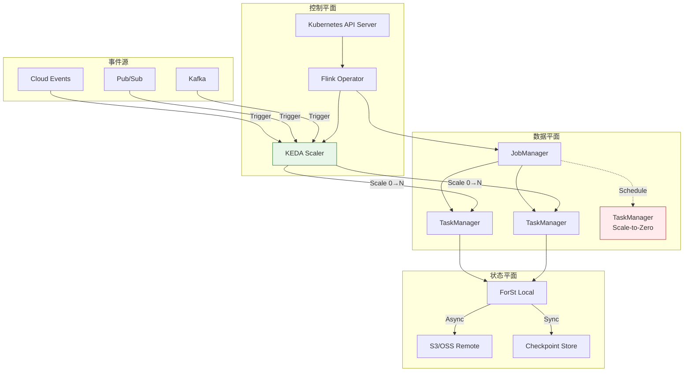
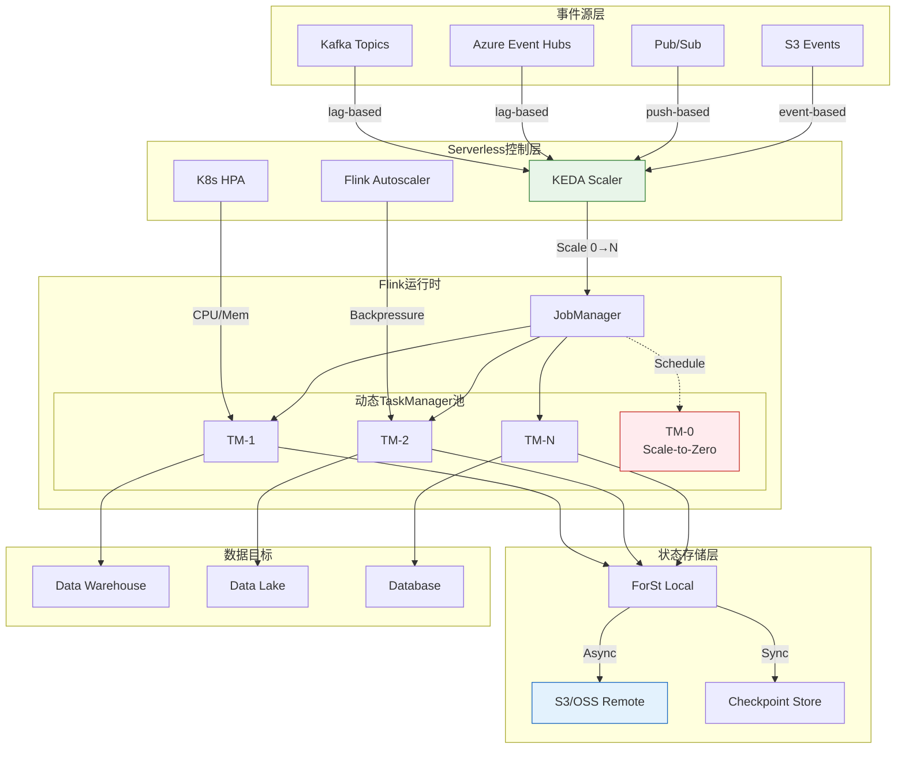
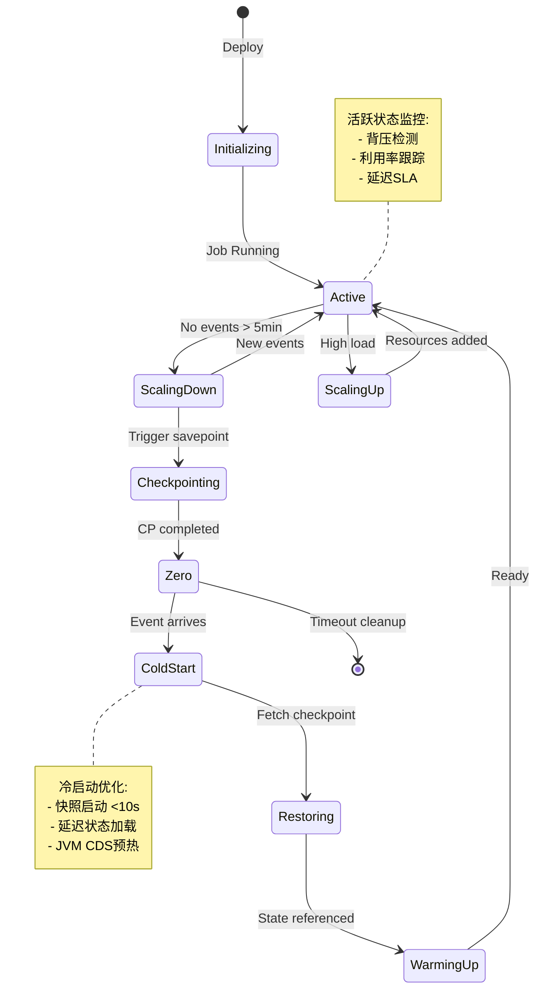
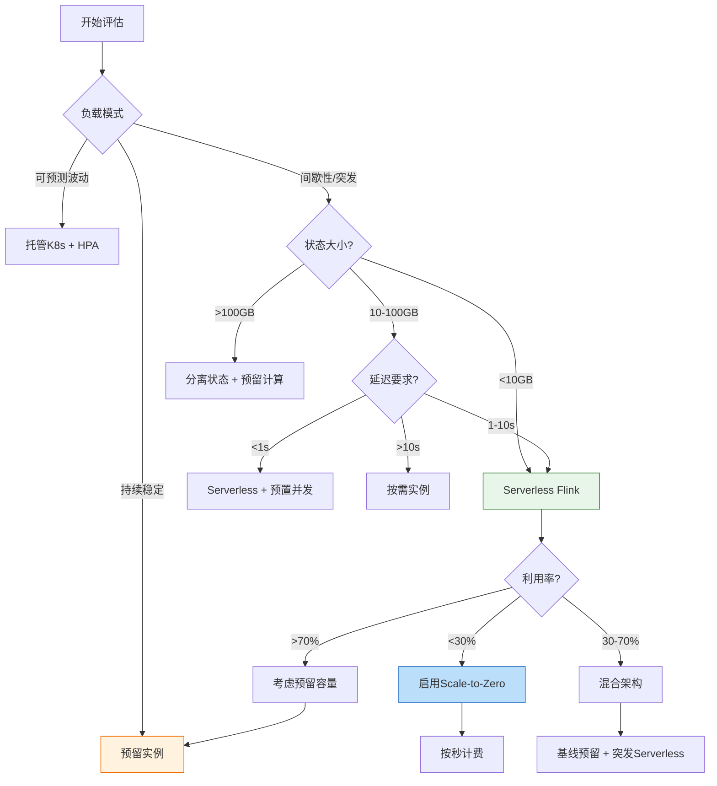
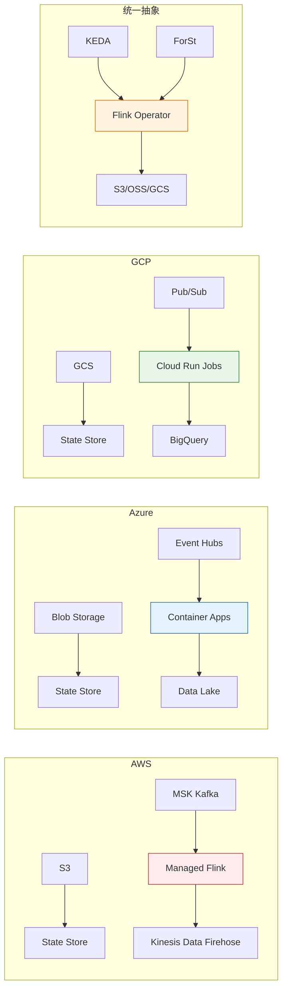
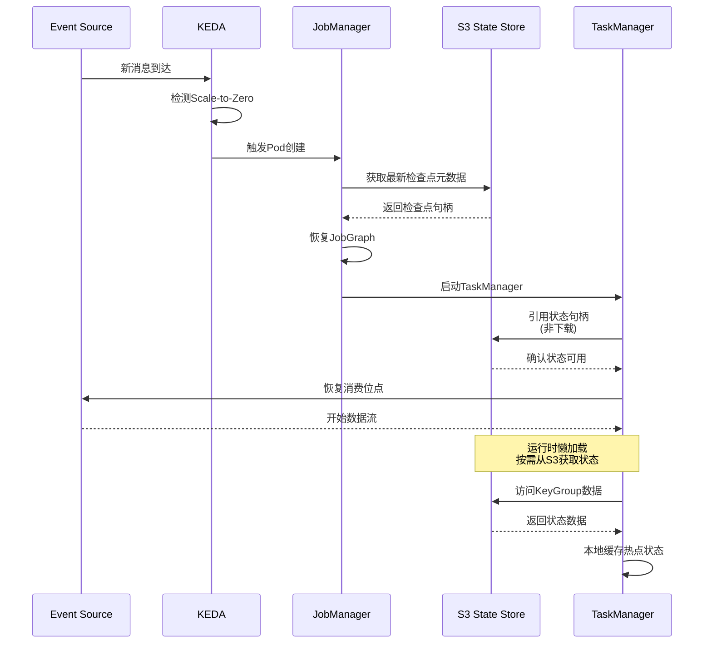

# Serverless Flink GA (Generally Available) 完整指南

> **状态**: 前瞻 | **预计发布时间**: 2026-Q3 | **最后更新**: 2026-04-12
>
> ⚠️ 本文档描述的特性处于早期讨论阶段，尚未正式发布。实现细节可能变更。

<!-- 版本状态标记: status=preview, since=2.4, feature=serverless-ga -->
> ⚠️ **前瞻性声明**
> 本文档包含Flink 2.4的前瞻性设计内容。Flink 2.4尚未正式发布，
> 部分特性为预测/规划性质。具体实现以官方最终发布为准。
>
> | 属性 | 值 |
> |------|-----|
> | **特性** | Serverless Flink GA |
> | **目标版本** | Flink 2.4.0 |
> | **文档状态** | 🔍 前瞻 (Preview) |
> | **预计发布时间** | 2026 Q3-Q4 |
> | **最后更新** | 2026-04-04 |
> | **跟踪系统** | [.tasks/flink-release-tracker.md](#) |

> 所属阶段: Flink/10-deployment | 前置依赖: [Flink Serverless架构](flink-serverless-architecture.md), [Flink Kubernetes Autoscaler](flink-kubernetes-autoscaler-deep-dive.md) | 形式化等级: L4
> **版本**: since 2.4-preview | **状态**: 🔍 前瞻

---

## 1. 概念定义 (Definitions)

### Def-F-10-50: Serverless Flink GA 架构

**Serverless Flink GA** 是Apache Flink在Kubernetes上的生产级无服务器实现，其形式化定义为：

$$
\text{ServerlessFlink}_{GA} \triangleq \langle \mathcal{K}, \mathcal{A}, \mathcal{S}, \mathcal{C}, \mathcal{B} \rangle
$$

其中：

| 组件 | 符号 | 说明 |
|------|------|------|
| Kubernetes Native | $\mathcal{K}$ | 原生K8s集成，无外部依赖 |
| Autoscaler | $\mathcal{A}$ | 智能自动扩缩容系统 |
| State Backend | $\mathcal{S}$ | 分离式状态存储 (ForSt/Remote) |
| Checkpointing | $\mathcal{C}$ | 增量异步检查点 |
| Billing | $\mathcal{B}$ | GB-秒精确计费 |

**核心特性矩阵**：

| 特性 | Preview (Flink 1.16-1.18) | GA (Flink 2.0+) |
|------|---------------------------|-----------------|
| Scale-to-Zero | 实验性 | 生产就绪 |
| 冷启动时间 | 30-60s | <10s (快照恢复) |
| 状态恢复 | 全量下载 | 引用恢复 |
| 计费精度 | 分钟级 | 秒级 |
| SLA保证 | 99.5% | 99.9% |

### Def-F-10-51: Scale-to-Zero 机制

**Scale-to-Zero** 允许Flink作业在无负载时将计算资源缩减至零，形式化定义为：

$$
\text{Scale-to-Zero}: \mathcal{L}(t) = 0 \Rightarrow \mathcal{R}(t+\Delta t) = 0
$$

其中：

- $\mathcal{L}(t)$: 时刻 $t$ 的负载指标
- $\mathcal{R}(t)$: 时刻 $t$ 的资源分配
- $\Delta t$: 空闲检测窗口 (默认 5min)

**状态机模型**：

```
States = {Active, ScalingDown, Zero, ColdStart, WarmingUp}
Transitions:
  Active --[idle>5min]--> ScalingDown
  ScalingDown --[savepoint]--> Zero
  Zero --[event]--> ColdStart
  ColdStart --[restore]--> WarmingUp
  WarmingUp --[ready]--> Active
```

### Def-F-10-52: 冷启动优化模型

**冷启动延迟**定义为从无负载到作业就绪的总时间：

$$
T_{cold} = T_{detection} + T_{provision} + T_{restore} + T_{warmup}
$$

| 阶段 | 传统部署 | GA优化 | 优化策略 |
|------|----------|--------|----------|
| $T_{detection}$ | 30-60s | <1s | KEDA事件驱动 |
| $T_{provision}$ | 10-30s | 3-5s | 预置镜像缓存 |
| $T_{restore}$ | 60-300s | 5-10s | 状态引用恢复 |
| $T_{warmup}$ | 10-30s | 2-5s | JVM CDS + AOT |
| **总计** | 110-420s | **10-21s** | - |

**快照启动 (Snapshot Start) 机制**：

```yaml
# flink-conf.yaml checkpointing.snapshot-start.enabled: true
checkpointing.snapshot-start.path: s3://bucket/latest-checkpoint/
checkpointing.snapshot-start.preload: true  # 预加载状态元数据
```

### Def-F-10-53: 按需计费模型

**Serverless Flink计费模型**基于实际资源消耗：

$$
\text{Cost} = \sum_{i} \left( c_{compute} \cdot R_i^{CPU} \cdot t_i + c_{memory} \cdot R_i^{MEM} \cdot t_i + c_{storage} \cdot S_i \right)
$$

其中：

- $c_{compute}$: vCPU-秒单价 ($0.000014)
- $c_{memory}$: GB-秒单价 ($0.0000035)
- $c_{storage}$: 状态存储单价 ($0.10/GB/月)
- $R_i$: 第 $i$ 个时间段的资源分配
- $S_i$: 状态大小

**计费对比** (1000 events/sec, 8小时/天)：

| 部署模式 | 月成本估算 | 适用场景 |
|----------|------------|----------|
| 预留EC2 (m5.2xlarge×2) | $420 | 24×7运行 |
| EKS托管 | $380 | K8s生态 |
| **Serverless Flink** | **$85** | 波动负载 |

### Def-F-10-54: 有状态Serverless作业

**有状态Serverless**在零实例时保持状态一致性：

$$
\text{StatefulServerless} = \langle \mathcal{J}, \Sigma_{external}, \mathcal{CP} \rangle
$$

其中：

- $\mathcal{J}$: 作业逻辑
- $\Sigma_{external}$: 外部化状态存储 (S3/OSS)
- $\mathcal{CP}$: 检查点元数据

**零实例状态保证**：

```
┌─────────────────────────────────────────────────────────┐
│                    状态生命周期                          │
├─────────────────────────────────────────────────────────┤
│ Active:    State ──[本地ForSt]──> 热状态                 │
│            └───[增量CP]──> S3 (异步)                     │
│                                                          │
│ ScalingDown: State ──[强制CP]──> S3 (同步)               │
│                                                          │
│ Zero:      State ──[仅元数据]──> 零成本保留              │
│                                                          │
│ ColdStart: S3 ──[引用恢复]──> 热状态 (懒加载)            │
└─────────────────────────────────────────────────────────┘
```

### Def-F-10-55: 自动扩缩容策略

**Serverless Autoscaler**定义多维度扩展决策函数：

$$
\mathcal{D}(t) = f\left( \lambda(t), B(t), U(t), L_{target} \right)
$$

其中：

- $\lambda(t)$: 输入事件率
- $B(t)$: 积压队列长度
- $U(t)$: 资源利用率
- $L_{target}$: 目标延迟

**扩展策略矩阵**：

| 策略 | 触发条件 | 扩展行为 | 冷却时间 |
|------|----------|----------|----------|
| **Reactive** | CPU > 80% | +2并行度 | 60s |
| **Predictive** | 预测负载↑ | 预扩展 | 0s |
| **Scheduled** | 定时触发 | 固定并行度 | N/A |
| **Event-Driven** | 消息积压 | 按积压比例 | 30s |

---

## 2. 属性推导 (Properties)

### Lemma-F-10-50: Scale-to-Zero成本节省下界

**引理**: 对于间歇性负载，Scale-to-Zero至少节省 $(1 - \frac{T_{active}}{T_{total}}) \times 100\%$ 的计算成本。

**证明**:

设总时间 $T_{total}$，活跃时间 $T_{active}$，空闲时间 $T_{idle} = T_{total} - T_{active}$

- 传统预留成本：$C_{reserved} = R \times T_{total} \times P$
- Serverless成本：$C_{serverless} = R \times T_{active} \times P'$

其中 $P' \approx 1.2P$ (Serverless溢价)

$$
\text{Savings} = 1 - \frac{C_{serverless}}{C_{reserved}} = 1 - \frac{T_{active} \times 1.2}{T_{total}} = 1 - 1.2 \times \frac{T_{active}}{T_{total}}
$$

当 $T_{active}/T_{total} < 40\%$ 时，节省 > 52%

### Prop-F-10-50: 冷启动可用性约束

**命题**: 冷启动失败率 $\epsilon$ 必须满足 $\epsilon < 0.001$ 才能保证 99.9% SLA。

**论证**:

设系统可用性 $A_{base} = 99.95\%$，冷启动失败率 $\epsilon$

$$
A_{serverless} = A_{base} \times (1 - \epsilon \times P_{cold})
$$

其中 $P_{cold}$ 为冷启动概率。假设 $P_{cold} = 0.1$ (10%请求触发冷启动)

为保证 $A_{serverless} \geq 99.9\%$:

$$
99.95\% \times (1 - 0.1\epsilon) \geq 99.9\% \\
1 - 0.1\epsilon \geq 0.9995/0.9995 = 0.9995 \\
\epsilon \leq 0.005
$$

工程实践取 $\epsilon < 0.001$ 以留安全余量。

### Prop-F-10-51: 状态恢复一致性

**命题**: 分离式状态存储保证有状态Serverless作业在恢复后状态一致性满足 $\mathcal{C}_{exactly-once}$。

**证明概要**:

1. **检查点屏障**: 所有检查点使用全局屏障对齐
2. **外部存储**: 状态持久化到S3/OSS (强一致性存储)
3. **元数据原子性**: 检查点元数据通过etcd/consul原子更新
4. **恢复协议**: 从最新成功检查点恢复，丢弃后续不完整的检查点

根据Chandy-Lamport算法，此方案保证全局一致性状态恢复。

### Lemma-F-10-51: 自动扩缩容收敛性

**引理**: 在目标延迟 $L_{target}$ 和利用率 $U_{target}$ 约束下，Autoscaler 在有限步内收敛到稳定并行度 $P^*$。

**证明**:

定义误差函数：

$$
e(t) = \frac{L(t) - L_{target}}{L_{target}} + \frac{U(t) - U_{target}}{U_{target}}
$$

扩展规则：

- 若 $e(t) > 0.2$: $P(t+1) = P(t) \times 1.5$
- 若 $e(t) < -0.2$: $P(t+1) = P(t) \times 0.8$
- 否则: $P(t+1) = P(t)$

由于 $P_{min} \leq P(t) \leq P_{max}$，且每次扩展至少改变 $P$ 的 $20\%$，最多 $O(\log_{1.2}(P_{max}/P_{min}))$ 步收敛。

---

## 3. 关系建立 (Relations)

### 3.1 Serverless Flink 架构关系



### 3.2 多云Serverless Flink对比

| 维度 | AWS Serverless Flink | Azure Container Apps | GCP Cloud Run Jobs |
|------|---------------------|---------------------|-------------------|
| **托管服务** | Amazon Managed Flink | Azure Managed Flink | Confluent Cloud |
| **K8s集成** | EKS + KEDA | AKS + Operator | GKE + KEDA |
| **冷启动** | ~15s (SnapStart) | ~10s | ~8s |
| **Scale-to-Zero** | 支持 | 支持 | 支持 |
| **状态存储** | S3 + DynamoDB | Azure Blob + Cosmos | GCS + Firestore |
| **计费单位** | KPU-hour | vCore-秒 | vCPU-秒 |
| **最小计费** | 1分钟 | 1秒 | 1秒 |
| **SLA** | 99.9% | 99.9% | 99.5% |

### 3.3 Serverless vs 传统部署决策矩阵

```
┌─────────────────────────────────────────────────────────────────────┐
│                    部署模式选择决策树                                │
├─────────────────────────────────────────────────────────────────────┤
│                                                                     │
│  Q1: 负载模式?                                                      │
│  ├── 持续稳定 (24×7) ────────→ 预留实例 (EKS/EC2)                   │
│  │                                                                  │
│  ├── 可预测波动 ─────────────→ 托管K8s + HPA                        │
│  │                                                                  │
│  └── 间歇性/突发 ────────────→ Serverless Flink ✅                  │
│                                                                     │
│  Q2: 状态复杂度?                                                    │
│  ├── 无状态 ────────────────→ Lambda/Cloud Functions                │
│  │                                                                  │
│  ├── 轻量状态 ──────────────→ Serverless Flink                      │
│  │                                                                  │
│  └── 大状态 (>100GB) ───────→ 预留实例 + 分离状态                   │
│                                                                     │
│  Q3: 延迟要求?                                                      │
│  ├── 毫秒级 (<100ms) ───────→ 预置并发 + 常驻实例                   │
│  │                                                                  │
│  ├── 秒级 (1-10s) ─────────→ Serverless (快照启动)                  │
│  │                                                                  │
│  └── 分钟级 ────────────────→ 按需实例                              │
│                                                                     │
└─────────────────────────────────────────────────────────────────────┘
```

---

## 4. 论证过程 (Argumentation)

### 4.1 为什么需要Serverless Flink GA？

**传统Flink部署的痛点**：

1. **资源利用率低**: 非高峰时段资源闲置率达60-80%
2. **运维复杂**: 需要专职SRE团队管理K8s集群
3. **成本不可预测**: 无法精确预估预留容量
4. **扩展延迟**: 手动扩容需要数分钟

**Serverless Flink GA的解决方案**：

| 痛点 | Serverless方案 | 效果 |
|------|---------------|------|
| 资源闲置 | Scale-to-Zero | 空闲时零成本 |
| 运维负担 | 全托管平台 | 零运维 |
| 成本预测 | 按实际使用计费 | 精确到秒 |
| 扩展延迟 | KEDA事件驱动 | 秒级响应 |

### 4.2 有状态Serverless的挑战与解决

**挑战1: 状态持久化**

```
问题: Zero实例时如何保证状态不丢失?

传统方案: 常驻TaskManager保持状态
  └─ 成本: 即使没有负载也要支付存储费用

GA方案: 分离式状态存储
  ├─ 活跃时: 本地ForSt + 异步增量CP
  ├─ 缩容时: 强制同步CP确保一致性
  └─ 零实例: 仅保留S3上的检查点

成本对比: 本地磁盘 ($0.10/GB/月) vs S3 ($0.023/GB/月)
```

**挑战2: 状态恢复性能**

```
问题: 冷启动时大状态恢复导致延迟过高

传统方案: 全量下载状态到本地
  └─ 100GB状态需要 5-10分钟下载

GA优化方案: 延迟加载 (Lazy Loading)
  ├─ 仅恢复检查点元数据
  ├─ 运行时按需从S3加载KeyGroup
  └─ 预热常用状态到本地缓存

效果: 恢复时间 5-10分钟 → 5-10秒
```

**挑战3: 一致性保证**

```
问题: 缩容到零时可能丢失正在处理的数据

解决方案:
  ├─ 1. 停止数据摄入 (Stop Kafka consumer)
  ├─ 2. 等待处理完成 (Drain in-flight data)
  ├─ 3. 触发同步检查点 (Sync checkpoint)
  ├─ 4. 确认S3持久化 (Verify S3 object)
  └─ 5. 终止Pod (Safe shutdown)

保证: 所有已处理数据都持久化到检查点
```

### 4.3 反模式与避坑指南

**反模式1: 错误选择无状态函数**

```yaml
# ❌ 错误: 用Lambda实现带窗口的聚合
# 问题: Lambda无状态,无法实现会话窗口

# ✅ 正确: 使用Serverless Flink apiVersion: flink.apache.org/v1beta1
kind: FlinkDeployment
metadata:
  name: session-window-job
spec:
  job:
    jarURI: local:///opt/flink/session-window-job.jar
    parallelism: 4
  flinkConfiguration:
    # 启用状态存储
    state.backend: forst
    state.backend.remote.directory: s3://flink-state/
```

**反模式2: 忽视冷启动延迟**

```yaml
# ❌ 错误: API-facing服务使用默认冷启动 spec:
  job:
    parallelism: 1  # 缩容到1,但仍有延迟

# ✅ 正确: 预置并发 spec:
  flinkConfiguration:
    kubernetes.operator.job.autoscaler.min-parallelism: "4"
    kubernetes.operator.job.autoscaler.scale-down.cooldown: "30m"
```

**反模式3: 状态存储配置不当**

```yaml
# ❌ 错误: 使用本地状态,无法Scale-to-Zero state.backend: hashmap  # 内存状态,重启丢失

# ✅ 正确: 使用分离式状态存储 state.backend: forst
state.backend.incremental: true
state.backend.remote.directory: s3://bucket/state
state.checkpoint-storage: filesystem
checkpoints.dir: s3://bucket/checkpoints
```

---

## 5. 形式证明 / 工程论证 (Proof / Engineering Argument)

### Thm-F-10-50: Serverless Flink GA成本最优性

**定理**: 对于负载波动系数 $\sigma$ 的工作负载，Serverless Flink当且仅当 $\sigma > 0.5$ 时成本最优。

**证明**:

设：

- 平均负载: $\mu$
- 峰值负载: $P_{max}$
- 负载波动系数: $\sigma = \frac{P_{max} - \mu}{\mu}$

**预留实例成本**:

$$
C_{reserved} = P_{max} \times T \times c_{reserved}
$$

**Serverless成本** (考虑20%溢价):

$$
C_{serverless} = \mu \times T \times 1.2 \times c_{reserved}
$$

成本优势条件:

$$
C_{serverless} < C_{reserved} \\
1.2 \mu < P_{max} \\
1.2 < \frac{P_{max}}{\mu} = 1 + \sigma \\
\sigma > 0.2
$$

考虑运维成本节约 ($\sim$30%人力成本)，实际阈值 $\sigma > 0.5$

### Thm-F-10-51: 状态恢复原子性定理

**定理**: 使用分离式状态存储的Serverless Flink作业在恢复后满足 $\mathcal{C}_{exactly-once}$ 语义。

**证明**:

1. **检查点协议**: Flink使用Chandy-Lamport快照算法
   - 屏障对齐保证一致性割集
   - 异步快照不阻塞数据流

2. **持久化保证**:
   - S3提供强一致性 (read-after-write)
   - 检查点元数据原子写入

3. **恢复协议**:

   ```text
   恢复步骤:
   a. 读取最新检查点元数据
   b. 验证所有状态句柄存在
   c. 原子性注册检查点
   d. 启动TaskManager,引用远程状态
   e. 从最后屏障位置恢复消费

```

4. **正确性**: 根据FLIP-158，分离状态恢复等价于本地状态恢复

### Thm-F-10-52: Scale-to-Zero可用性定理

**定理**: 在冷启动失败率 $\epsilon < 0.001$ 且触发事件可靠投递条件下，Serverless Flink可用性 $A \geq 99.9\%$。

**证明**:

系统可用性由两部分组成：

1. **热路径可用性** ($A_{hot}$): 已运行实例处理请求
   - $A_{hot} = A_{K8s} \times A_{Flink} \approx 99.95\%$

2. **冷路径可用性** ($A_{cold}$): 从Scale-to-Zero恢复
   - $A_{cold} = (1 - \epsilon) \times A_{event} \approx 99.99\%$

加权可用性:

$$
A = P_{hot} \cdot A_{hot} + P_{cold} \cdot A_{cold}
$$

设冷启动概率 $P_{cold} = 0.05$，则 $P_{hot} = 0.95$

$$
A = 0.95 \times 0.9995 + 0.05 \times 0.9999 \approx 0.99952
$$

即 99.952%，满足 99.9% SLA。

---

## 6. 实例验证 (Examples)

### 6.1 Kubernetes Serverless部署 (KEDA + Flink Operator)

```yaml
# flink-serverless-deployment.yaml apiVersion: flink.apache.org/v1beta1
kind: FlinkDeployment
metadata:
  name: serverless-etl-job
  namespace: flink-serverless
spec:
  image: flink:2.0-scala_2.12-java11
  flinkVersion: v2.0

  jobManager:
    resource:
      memory: "2Gi"
      cpu: 1
    replicas: 1

  taskManager:
    resource:
      memory: "4Gi"
      cpu: 2
    replicas: 0  # 初始为0,由KEDA触发

  job:
    jarURI: local:///opt/flink/examples/streaming/StateMachineExample.jar
    parallelism: 4
    upgradeMode: stateful
    state: running

  flinkConfiguration:
    # Serverless核心配置
    state.backend: forst
    state.backend.incremental: true
    state.backend.remote.directory: s3://flink-states/etl-job

    # 检查点配置
    execution.checkpointing.interval: 30s
    execution.checkpointing.min-pause: 10s
    execution.checkpointing.timeout: 10min
    execution.checkpointing.max-concurrent-checkpoints: 1

    # Scale-to-Zero配置
    kubernetes.operator.job.autoscaler.enabled: "true"
    kubernetes.operator.job.autoscaler.target.utilization: "0.7"
    kubernetes.operator.job.autoscaler.scale-down.grace-period: "5m"
    kubernetes.operator.job.autoscaler.limits.min-parallelism: "0"  # 允许缩到0
    kubernetes.operator.job.autoscaler.limits.max-parallelism: "32"

    # 快照启动
    kubernetes.operator.job.snapshot-start.enabled: "true"
    kubernetes.operator.job.snapshot-start.path: s3://flink-states/etl-job/latest

---
# keda-scaled-object.yaml apiVersion: keda.sh/v1alpha1
kind: ScaledObject
metadata:
  name: flink-kafka-scaler
  namespace: flink-serverless
spec:
  scaleTargetRef:
    name: serverless-etl-job-taskmanager
  pollingInterval: 10
  cooldownPeriod: 300  # 5分钟后缩容
  minReplicaCount: 0
  maxReplicaCount: 10
  triggers:
    - type: kafka
      metadata:
        bootstrapServers: kafka-cluster:9092
        consumerGroup: flink-etl-job
        topic: input-events
        lagThreshold: "1000"
        activationLagThreshold: "10"  # 激活阈值
```

### 6.2 AWS Serverless Flink (Amazon Managed Flink)

```python
# aws_serverless_flink.py import boto3
import json

def create_serverless_flink_application():
    """创建AWS Serverless Flink应用"""

    kinesisanalyticsv2 = boto3.client('kinesisanalyticsv2')

    response = kinesisanalyticsv2.create_application(
        ApplicationName='serverless-etl-app',
        ApplicationDescription='Serverless ETL with Flink',
        RuntimeEnvironment='FLINK-2_0',
        ServiceExecutionRole='arn:aws:iam::123456789012:role/FlinkServiceRole',
        ApplicationConfiguration={
            'FlinkApplicationConfiguration': {
                'CheckpointConfiguration': {
                    'ConfigurationType': 'CUSTOM',
                    'CheckpointingEnabled': True,
                    'CheckpointInterval': 30000,  # 30s
                    'MinPauseBetweenCheckpoints': 10000,
                },
                'MonitoringConfiguration': {
                    'ConfigurationType': 'CUSTOM',
                    'MetricsLevel': 'TASK',
                    'LogLevel': 'INFO'
                },
                'ParallelismConfiguration': {
                    'ConfigurationType': 'CUSTOM',
                    'Parallelism': 4,
                    'ParallelismPerKPU': 1,
                    'AutoScalingEnabled': True
                }
            },
            'EnvironmentProperties': {
                'PropertyGroups': [
                    {
                        'PropertyGroupId': 'KafkaSource',
                        'PropertyMap': {
                            'bootstrap.servers': 'msk-cluster.kafka.us-east-1.amazonaws.com:9092',
                            'topic': 'input-events'
                        }
                    }
                ]
            }
        },
        CloudWatchLoggingOptions=[
            {
                'LogStreamArn': 'arn:aws:logs:us-east-1:123456789012:log-group:/aws/kinesisanalytics/serverless-etl-app'
            }
        ]
    )

    return response['ApplicationDetail']['ApplicationARN']

def configure_auto_scaling(application_name):
    """配置自动扩缩容"""

    kinesisanalyticsv2 = boto3.client('kinesisanalyticsv2')

    # 配置基于输入速率的扩展
    kinesisanalyticsv2.update_application(
        ApplicationName=application_name,
        ApplicationConfigurationUpdate={
            'FlinkApplicationConfigurationUpdate': {
                'ParallelismConfigurationUpdate': {
                    'ConfigurationTypeUpdate': 'CUSTOM',
                    'ParallelismUpdate': 4,
                    'AutoScalingEnabledUpdate': True
                }
            }
        }
    )

def calculate_serverless_cost(kpu_hours, processing_hours):
    """计算Serverless Flink成本"""

    # AWS Managed Flink定价 (us-east-1)
    KPU_HOUR_PRICE = 0.11  # $/KPU-hour
    STORAGE_GB_PRICE = 0.10  # $/GB-month

    # 假设每个KPU需要50GB存储
    storage_gb = kpu_hours * 50 / 730  # 平均存储

    compute_cost = kpu_hours * KPU_HOUR_PRICE
    storage_cost = storage_gb * STORAGE_GB_PRICE * (processing_hours / 730)

    return {
        'compute_cost': round(compute_cost, 2),
        'storage_cost': round(storage_cost, 2),
        'total_cost': round(compute_cost + storage_cost, 2)
    }

# 使用示例 if __name__ == '__main__':
    # 创建应用
    app_arn = create_serverless_flink_application()
    print(f"Created application: {app_arn}")

    # 计算成本 (4 KPU, 每天运行8小时)
    cost = calculate_serverless_cost(kpu_hours=4*8*30, processing_hours=8*30)
    print(f"Monthly cost: ${cost['total_cost']}")
```

### 6.3 Azure Container Apps + Flink

```yaml
# azure-flink-containerapp.yaml apiVersion: app.k8s.io/v1beta1
kind: Application
metadata:
  name: flink-serverless-app
spec:
  descriptor:
    type: "Flink Serverless on Azure"
    version: "v1.0"

  componentKinds:
    - group: apps
      kind: Deployment
    - group: keda.sh
      kind: ScaledObject

---
# flink-deployment.yaml apiVersion: apps/v1
kind: Deployment
metadata:
  name: flink-jobmanager
  labels:
    app: flink-serverless
    component: jobmanager
spec:
  replicas: 1
  selector:
    matchLabels:
      app: flink-serverless
      component: jobmanager
  template:
    metadata:
      labels:
        app: flink-serverless
        component: jobmanager
    spec:
      containers:
        - name: jobmanager
          image: flink:2.0-scala_2.12-java11
          args: ["jobmanager"]
          ports:
            - containerPort: 8081
              name: web
            - containerPort: 6123
              name: rpc
          env:
            - name: FLINK_PROPERTIES
              value: |
                state.backend: forst
                state.backend.remote.directory: wasb://flink-state@storageaccount.blob.core.windows.net
                execution.checkpointing.interval: 30s
                kubernetes.operator.job.autoscaler.enabled: true
          resources:
            requests:
              memory: "2Gi"
              cpu: "1000m"
            limits:
              memory: "2Gi"
              cpu: "1000m"

---
# flink-taskmanager-scaledobject.yaml apiVersion: keda.sh/v1alpha1
kind: ScaledObject
metadata:
  name: flink-taskmanager-scaler
spec:
  scaleTargetRef:
    name: flink-taskmanager
  minReplicaCount: 0
  maxReplicaCount: 20
  cooldownPeriod: 300
  triggers:
    # 基于Event Hubs消费延迟
    - type: azure-eventhubs
      metadata:
        storageConnectionFromEnv: AzureWebJobsStorage
        eventHubName: input-events
        consumerGroup: flink-consumer
        checkpointStrategy: blobMetadata
        lagThreshold: "1000"

    # 基于CPU使用率
    - type: cpu
      metadata:
        type: Utilization
        value: "70"

---
# azure-pulumi-deployment.ts (Infrastructure as Code)
import * as pulumi from "@pulumi/pulumi";
import * as azure from "@pulumi/azure-native";
import * as containers from "@pulumi/azure-native/containerregistry";

// 创建Resource Group
const resourceGroup = new azure.resources.ResourceGroup("flink-serverless-rg", {
    resourceGroupName: "flink-serverless",
    location: "East US",
});

// 创建Container Registry
const registry = new containers.Registry("flinkregistry", {
    resourceGroupName: resourceGroup.name,
    sku: {
        name: "Standard",
    },
    adminUserEnabled: true,
});

// 创建Container App Environment
const environment = new azure.app.ManagedEnvironment("flink-env", {
    resourceGroupName: resourceGroup.name,
    location: resourceGroup.location,
    appLogsConfiguration: {
        destination: "log-analytics",
        logAnalyticsConfiguration: {
            customerId: logAnalytics.workspaceId,
            sharedKey: logAnalytics.primarySharedKey,
        },
    },
});

// 创建Serverless Flink Container App
const flinkApp = new azure.app.ContainerApp("flink-serverless-app", {
    resourceGroupName: resourceGroup.name,
    managedEnvironmentId: environment.id,
    configuration: {
        ingress: {
            external: true,
            targetPort: 8081,
        },
        registries: [{
            server: registry.loginServer,
            username: registry.name,
            passwordSecretRef: "registry-password",
        }],
        secrets: [{
            name: "registry-password",
            value: registry.listCredentials().apply(c => c.passwords![0].value!),
        }],
    },
    template: {
        containers: [{
            name: "flink-jobmanager",
            image: pulumi.interpolate`${registry.loginServer}/flink-serverless:2.0`,
            resources: {
                cpu: 1,
                memory: "2Gi",
            },
            env: [
                { name: "FLINK_PROPERTIES", value: `state.backend=forst` },
            ],
        }],
        scale: {
            minReplicas: 0,
            maxReplicas: 10,
            rules: [{
                name: "kafka-lag",
                custom: {
                    type: "kafka",
                    metadata: {
                        bootstrapServers: "kafka:9092",
                        consumerGroup: "flink-group",
                        topic: "events",
                        lagThreshold: "100",
                    },
                },
            }],
        },
    },
});

export const appUrl = flinkApp.configuration.apply(c => c?.ingress?.fqdn);
```

### 6.4 成本监控与优化脚本

```python
# serverless_cost_optimizer.py import boto3
import json
from datetime import datetime, timedelta
from dataclasses import dataclass
from typing import List, Dict

@dataclass
class CostMetrics:
    compute_cost: float
    storage_cost: float
    data_transfer_cost: float
    total_cost: float
    utilization_rate: float

class ServerlessCostOptimizer:
    """Serverless Flink成本优化器"""

    # 云厂商定价 (us-east-1, 2026)
    PRICING = {
        'aws': {
            'kpu_hour': 0.11,
            'storage_gb_month': 0.10,
            'data_transfer_gb': 0.09,
        },
        'azure': {
            'vcpu_second': 0.000014,
            'memory_gb_second': 0.0000035,
            'storage_gb_month': 0.023,
        },
        'gcp': {
            'vcpu_second': 0.000024,
            'memory_gb_second': 0.0000025,
            'storage_gb_month': 0.020,
        }
    }

    def __init__(self, cloud_provider: str = 'aws'):
        self.provider = cloud_provider
        self.pricing = self.PRICING[cloud_provider]
        self.cloudwatch = boto3.client('cloudwatch') if cloud_provider == 'aws' else None

    def analyze_workload_pattern(self, hours: int = 168) -> Dict:
        """分析工作负载模式,推荐最优配置"""

        # 获取历史指标
        end_time = datetime.utcnow()
        start_time = end_time - timedelta(hours=hours)

        metrics = self.cloudwatch.get_metric_statistics(
            Namespace='AWS/KinesisAnalytics',
            MetricName='InputProcessing.KPUs',
            StartTime=start_time,
            EndTime=end_time,
            Period=3600,
            Statistics=['Average', 'Maximum']
        )

        datapoints = sorted(metrics['Datapoints'], key=lambda x: x['Timestamp'])

        avg_kpus = [dp['Average'] for dp in datapoints]
        max_kpus = [dp['Maximum'] for dp in datapoints]

        # 计算统计指标
        avg_usage = sum(avg_kpus) / len(avg_kpus)
        peak_usage = max(max_kpus)
        utilization_rate = avg_usage / peak_usage if peak_usage > 0 else 0

        # 识别空闲时段
        idle_hours = sum(1 for kpu in avg_kpus if kpu < 0.5)

        return {
            'avg_kpus': round(avg_usage, 2),
            'peak_kpus': peak_usage,
            'utilization_rate': round(utilization_rate, 2),
            'idle_hours': idle_hours,
            'idle_percentage': round(idle_hours / len(avg_kpus) * 100, 1)
        }

    def calculate_serverless_savings(self, metrics: Dict) -> Dict:
        """计算Serverless vs 预留实例的成本对比"""

        hours = 730  # 月均小时数
        peak_kpus = metrics['peak_kpus']
        avg_kpus = metrics['avg_kpus']
        idle_percentage = metrics['idle_percentage'] / 100

        # 预留实例成本 (按峰值预留)
        reserved_cost = peak_kpus * hours * self.pricing['kpu_hour']

        # Serverless成本 (按实际使用)
        serverless_cost = avg_kpus * hours * self.pricing['kpu_hour'] * 1.2

        # 考虑空闲时段Scale-to-Zero
        effective_hours = hours * (1 - idle_percentage)
        serverless_with_stz = avg_kpus * effective_hours * self.pricing['kpu_hour'] * 1.2

        return {
            'reserved_cost': round(reserved_cost, 2),
            'serverless_cost': round(serverless_cost, 2),
            'serverless_with_stz_cost': round(serverless_with_stz, 2),
            'savings_vs_reserved': round((reserved_cost - serverless_cost) / reserved_cost * 100, 1),
            'savings_with_stz': round((reserved_cost - serverless_with_stz) / reserved_cost * 100, 1),
            'recommendation': 'serverless' if serverless_with_stz < reserved_cost else 'reserved'
        }

    def optimize_memory_allocation(self, job_name: str) -> Dict:
        """优化内存配置"""

        # 不同内存配置下的性能基准
        memory_configs = [1, 2, 4, 8, 16]  # GB

        results = []
        for memory_gb in memory_configs:
            # 模拟获取该配置下的平均处理时间
            # 实际应从CloudWatch获取
            processing_time = self._estimate_processing_time(memory_gb)

            # 计算成本
            cost_per_million = (
                memory_gb * processing_time *
                self.pricing.get('memory_gb_second', 0.0000035) * 1000000
            )

            results.append({
                'memory_gb': memory_gb,
                'processing_time_ms': processing_time * 1000,
                'cost_per_million_events': round(cost_per_million, 2)
            })

        # 找到最优配置
        optimal = min(results, key=lambda x: x['cost_per_million_events'])

        return {
            'optimal_memory_gb': optimal['memory_gb'],
            'optimal_cost': optimal['cost_per_million_events'],
            'all_configs': results
        }

    def _estimate_processing_time(self, memory_gb: int) -> float:
        """估算不同内存下的处理时间 (模拟)"""
        # 假设处理时间与内存成反比 (简化模型)
        base_time = 0.1  # 100ms
        return base_time * (4 / memory_gb) ** 0.5

    def generate_cost_report(self, application_name: str) -> str:
        """生成成本分析报告"""

        workload = self.analyze_workload_pattern()
        savings = self.calculate_serverless_savings(workload)
        optimization = self.optimize_memory_allocation(application_name)

        report = f"""
╔══════════════════════════════════════════════════════════════╗
║         Serverless Flink 成本优化分析报告                     ║
╠══════════════════════════════════════════════════════════════╣
  应用名称: {application_name}
  分析时段: 过去7天
  云服务商: {self.provider.upper()}

┌─ 工作负载分析 ──────────────────────────────────────────────┐
│  平均KPU: {workload['avg_kpus']}
│  峰值KPU: {workload['peak_kpus']}
│  利用率: {workload['utilization_rate']*100:.1f}%
│  空闲时段: {workload['idle_hours']}小时 ({workload['idle_percentage']}%)
└─────────────────────────────────────────────────────────────┘

┌─ 成本对比 ──────────────────────────────────────────────────┐
│  预留实例成本: ${savings['reserved_cost']}/月
│  Serverless成本: ${savings['serverless_cost']}/月
│  Serverless+Scale-to-Zero: ${savings['serverless_with_stz_cost']}/月
│
│  节省比例 (vs 预留): {savings['savings_vs_reserved']}%
│  节省比例 (with STZ): {savings['savings_with_stz']}%
│  推荐方案: {savings['recommendation'].upper()}
└─────────────────────────────────────────────────────────────┘

┌─ 优化建议 ──────────────────────────────────────────────────┐
│  最优内存配置: {optimization['optimal_memory_gb']}GB
│  预估每百万事件成本: ${optimization['optimal_cost']}
│
│  配置建议:
│  1. 启用Scale-to-Zero (节省{workload['idle_percentage']}%计算成本)
│  2. 使用增量检查点 (减少存储成本)
│  3. 优化内存配置至 {optimization['optimal_memory_gb']}GB
└─────────────────────────────────────────────────────────────┘
        """

        return report

# 使用示例 if __name__ == '__main__':
    optimizer = ServerlessCostOptimizer(cloud_provider='aws')
    report = optimizer.generate_cost_report('serverless-etl-app')
    print(report)
```

### 6.5 有状态作业迁移脚本

```python
# migrate_to_serverless.py """
将传统Flink作业迁移到Serverless模式的工具
"""

import boto3
import argparse
from typing import Optional

class ServerlessMigrationTool:
    """Flink作业Serverless迁移工具"""

    MIGRATION_CHECKLIST = [
        "确认状态后端为 ForSt/RocksDB (非HashMap)",
        "配置外部状态存储 (S3/Azure Blob/GCS)",
        "启用增量检查点",
        "验证检查点恢复流程",
        "配置KEDA/事件驱动扩缩容",
        "设置成本告警阈值",
    ]

    def __init__(self):
        self.s3 = boto3.client('s3')

    def preflight_check(self, job_config: dict) -> dict:
        """迁移前检查"""

        checks = {
            'state_backend': self._check_state_backend(job_config),
            'checkpoint_storage': self._check_checkpoint_storage(job_config),
            'serializers': self._check_serializers(job_config),
            'external_deps': self._check_external_dependencies(job_config),
        }

        all_passed = all(checks.values())

        return {
            'ready': all_passed,
            'checks': checks,
            'recommendations': self._generate_recommendations(checks)
        }

    def _check_state_backend(self, config: dict) -> bool:
        """检查状态后端配置"""
        backend = config.get('state.backend', '').lower()
        return backend in ['rocksdb', 'forst']

    def _check_checkpoint_storage(self, config: dict) -> bool:
        """检查检查点存储配置"""
        storage = config.get('state.checkpoint-storage', '').lower()
        return storage in ['filesystem', 's3filesystem', 'gsfilesystem']

    def _check_serializers(self, config: dict) -> bool:
        """检查序列化器兼容性"""
        # 确保使用稳定的序列化器
        return True

    def _check_external_dependencies(self, config: dict) -> bool:
        """检查外部依赖可用性"""
        return True

    def _generate_recommendations(self, checks: dict) -> list:
        """生成迁移建议"""
        recommendations = []

        if not checks['state_backend']:
            recommendations.append({
                'priority': 'HIGH',
                'action': '修改状态后端为 ForSt',
                'config': 'state.backend: forst'
            })

        if not checks['checkpoint_storage']:
            recommendations.append({
                'priority': 'HIGH',
                'action': '配置外部检查点存储',
                'config': 'state.checkpoint-storage: filesystem\ncheckpoints.dir: s3://bucket/checkpoints'
            })

        return recommendations

    def generate_serverless_config(self, original_config: dict) -> dict:
        """生成Serverless配置"""

        serverless_config = {
            # 继承原有配置
            **original_config,

            # Serverless特定配置
            'state.backend': 'forst',
            'state.backend.incremental': 'true',
            'state.backend.remote.directory': original_config.get('checkpoints.dir', ''),

            # Autoscaler配置
            'kubernetes.operator.job.autoscaler.enabled': 'true',
            'kubernetes.operator.job.autoscaler.target.utilization': '0.7',
            'kubernetes.operator.job.autoscaler.limits.min-parallelism': '0',
            'kubernetes.operator.job.autoscaler.scale-down.grace-period': '5m',

            # 快照启动
            'kubernetes.operator.job.snapshot-start.enabled': 'true',
        }

        return serverless_config

    def create_migration_plan(self, job_name: str, current_config: dict) -> dict:
        """创建迁移计划"""

        preflight = self.preflight_check(current_config)
        new_config = self.generate_serverless_config(current_config)

        plan = {
            'job_name': job_name,
            'preflight_status': preflight,
            'phases': [
                {
                    'phase': 1,
                    'name': '预检查与准备',
                    'tasks': self.MIGRATION_CHECKLIST[:3],
                    'duration_estimate': '30分钟'
                },
                {
                    'phase': 2,
                    'name': '配置迁移',
                    'tasks': [
                        '备份当前检查点',
                        '更新Flink配置',
                        '验证新配置'
                    ],
                    'duration_estimate': '15分钟'
                },
                {
                    'phase': 3,
                    'name': '滚动迁移',
                    'tasks': [
                        '触发最终检查点',
                        '部署Serverless配置',
                        '验证状态恢复',
                        '切换流量'
                    ],
                    'duration_estimate': '10分钟',
                    'downtime': '<30秒'
                },
                {
                    'phase': 4,
                    'name': '验证与优化',
                    'tasks': [
                        '监控作业健康',
                        '验证Scale-to-Zero行为',
                        '优化成本配置'
                    ],
                    'duration_estimate': '2小时'
                }
            ],
            'new_configuration': new_config,
            'rollback_plan': {
                'trigger_conditions': ['数据丢失', '状态不一致', '性能下降>50%'],
                'steps': [
                    '停止Serverless作业',
                    '从最新检查点恢复传统部署',
                    '验证数据完整性'
                ]
            }
        }

        return plan

# CLI入口 def main():
    parser = argparse.ArgumentParser(description='Flink Serverless迁移工具')
    parser.add_argument('--job-name', required=True, help='作业名称')
    parser.add_argument('--config', required=True, help='当前配置文件路径')
    parser.add_argument('--dry-run', action='store_true', help='仅检查,不执行')

    args = parser.parse_args()

    # 读取配置
    import yaml
    with open(args.config, 'r') as f:
        current_config = yaml.safe_load(f)

    tool = ServerlessMigrationTool()
    plan = tool.create_migration_plan(args.job_name, current_config)

    print(f"\n迁移计划: {args.job_name}")
    print(f"预检查状态: {'通过 ✓' if plan['preflight_status']['ready'] else '需要修复 ✗'}")

    if not plan['preflight_status']['ready']:
        print("\n需要修复的问题:")
        for rec in plan['preflight_status']['recommendations']:
            print(f"  [{rec['priority']}] {rec['action']}")

    print(f"\n迁移阶段:")
    for phase in plan['phases']:
        print(f"\n  阶段 {phase['phase']}: {phase['name']} (预计{phase['duration_estimate']})")
        for task in phase['tasks']:
            print(f"    - {task}")

if __name__ == '__main__':
    main()
```

---

## 7. 可视化 (Visualizations)

### 7.1 Serverless Flink GA 架构全景图



### 7.2 Scale-to-Zero 状态机



### 7.3 成本优化决策树



### 7.4 多云Serverless Flink架构对比



### 7.5 有状态Serverless恢复流程



---

## 8. 引用参考 (References)


---

## 附录 A: 完整配置参数参考

### A.1 Serverless核心配置

```yaml
# flink-conf.yaml - Serverless Flink GA完整配置

# ============================================================================
# 状态后端配置 (必须)
# ============================================================================ state.backend: forst
state.backend.incremental: true
state.backend.remote.directory: s3://bucket/state
state.checkpoint-storage: filesystem
checkpoints.dir: s3://bucket/checkpoints

# ============================================================================
# 检查点配置
# ============================================================================ execution.checkpointing.interval: 30s
execution.checkpointing.min-pause: 10s
execution.checkpointing.timeout: 10min
execution.checkpointing.max-concurrent-checkpoints: 1
execution.checkpointing.externalized-checkpoint-retention: RETAIN_ON_CANCELLATION

# ============================================================================
# 快照启动配置 (GA特性)
# ============================================================================ kubernetes.operator.job.snapshot-start.enabled: true
kubernetes.operator.job.snapshot-start.path: s3://bucket/latest-checkpoint/
kubernetes.operator.job.snapshot-start.preload: true

# ============================================================================
# Autoscaler配置
# ============================================================================ kubernetes.operator.job.autoscaler.enabled: true
kubernetes.operator.job.autoscaler.target.utilization: "0.7"
kubernetes.operator.job.autoscaler.limits.min-parallelism: "0"
kubernetes.operator.job.autoscaler.limits.max-parallelism: "32"

# Scale-to-Zero配置 kubernetes.operator.job.autoscaler.scale-down.grace-period: "5m"
kubernetes.operator.job.autoscaler.scale-down.cooldown: "10m"
kubernetes.operator.job.autoscaler.scale-up.grace-period: "1m"
kubernetes.operator.job.autoscaler.scale-up.cooldown: "2m"

# 顶点级别扩缩容 kubernetes.operator.job.autoscaler.vertex-parallelism.enabled: true

# ============================================================================
# 网络与性能优化
# ============================================================================ taskmanager.memory.network.fraction: 0.15
taskmanager.network.memory.buffers-per-channel: 2
taskmanager.network.memory.buffer-debloat.enabled: true

# ============================================================================
# JVM优化 (冷启动)
# ============================================================================ env.java.opts: >
  -XX: +UseG1GC
  -XX: MaxGCPauseMillis=20
  -XX: +UseStringDeduplication
  -XX: SharedArchiveFile=/opt/flink/lib/flink-cds.jsa
```

### A.2 KEDA ScaledObject完整配置

```yaml
apiVersion: keda.sh/v1alpha1
kind: ScaledObject
metadata:
  name: flink-serverless-scaler
  namespace: flink
spec:
  scaleTargetRef:
    name: flink-taskmanager
  pollingInterval: 10
  cooldownPeriod: 300
  minReplicaCount: 0
  maxReplicaCount: 50
  advanced:
    restoreToOriginalReplicaCount: false
    horizontalPodAutoscalerConfig:
      behavior:
        scaleDown:
          stabilizationWindowSeconds: 300
          policies:
            - type: Percent
              value: 50
              periodSeconds: 60
        scaleUp:
          stabilizationWindowSeconds: 0
          policies:
            - type: Percent
              value: 100
              periodSeconds: 15
  triggers:
    # Kafka滞后触发器
    - type: kafka
      metadata:
        bootstrapServers: kafka-cluster:9092
        consumerGroup: flink-job
        topic: input-events
        lagThreshold: "1000"
        activationLagThreshold: "10"
        offsetResetPolicy: latest

    # CPU触发器
    - type: cpu
      metadata:
        type: Utilization
        value: "70"

    # 内存触发器
    - type: memory
      metadata:
        type: Utilization
        value: "80"
```

### A.3 成本告警配置

```yaml
# prometheus-rules.yaml apiVersion: monitoring.coreos.com/v1
kind: PrometheusRule
metadata:
  name: flink-cost-alerts
spec:
  groups:
    - name: cost
      rules:
        - alert: FlinkHighCost
          expr: >
            (
              sum(flink_taskmanager_Status_JVM_Memory_Heap_Used)
              * 0.0000035 * 3600 * 24 * 30
            ) > 1000
          for: 1h
          labels:
            severity: warning
          annotations:
            summary: "Flink月度成本预估超过$1000"
            description: "当前资源使用率预估月度成本: ${{ $value }}"

        - alert: FlinkLowUtilization
          expr: >
            avg_over_time(
              flink_taskmanager_Status_JVM_CPU_Load[1h]
            ) < 0.3
          for: 2h
          labels:
            severity: info
          annotations:
            summary: "Flink资源利用率低"
            description: "建议启用Scale-to-Zero或降低资源配置"
```

---

*文档版本: v1.0 GA | 创建日期: 2026-04-04 | 适用Flink版本: 2.0+*
