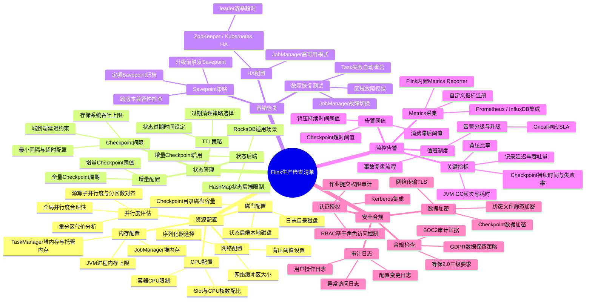
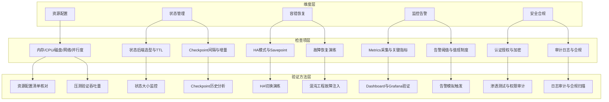
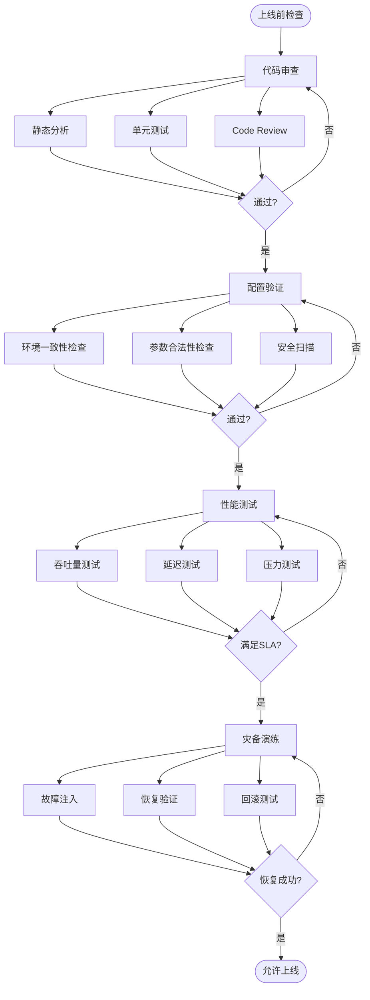

> **状态**: 📦 已归档 | **归档日期**: 2026-04-20
>
> 本文档内容已整合至主文档，此处保留为重定向入口。
> **主文档**: [Knowledge\07-best-practices\07.01-flink-production-checklist.md](../../../Knowledge/07-best-practices/07.01-flink-production-checklist.md)
> **归档位置**: [../../../archive/content-deduplication/2026-04/Flink/04-runtime/04.02-operations/production-checklist.md](../../../archive/content-deduplication/2026-04/Flink/04-runtime/04.02-operations/production-checklist.md)

---

> 以下内容为 **v7.0 思维表征补全**（2026-04-26），保留此文件作为独立导航节点。

## 思维表征

### Flink生产检查清单思维导图

以下思维导图以"Flink生产检查清单"为中心，放射展开五大检查维度。

### 检查维度→检查项→验证方法映射

以下层次图展示五大检查维度向下展开到具体检查项，并映射到对应的验证方法。

### 上线前检查流程决策树

以下决策树展示Flink作业上线前必须经历的四大检查阶段及其子项。

## 引用参考
