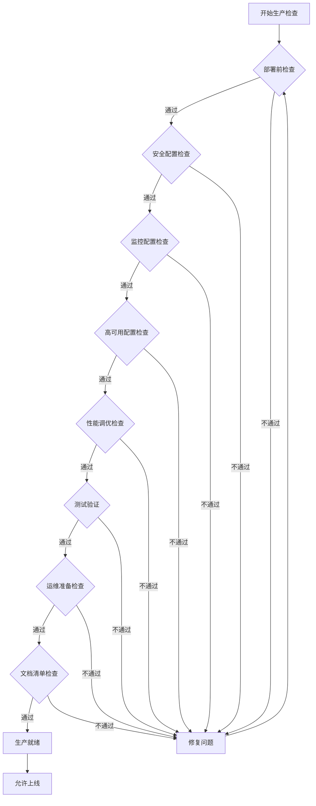
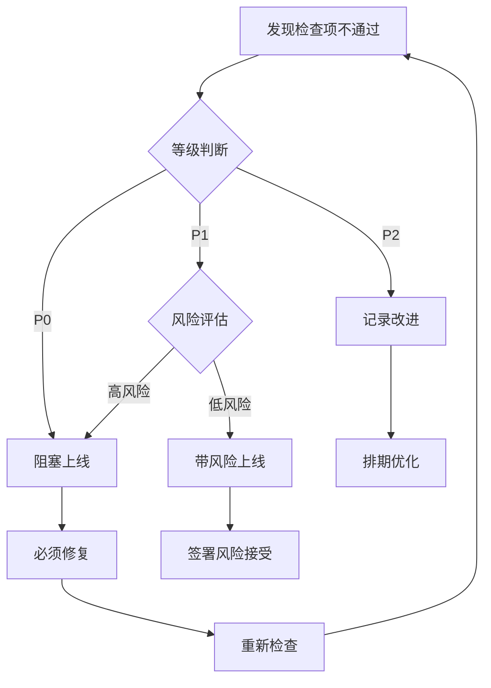

# Flink 生产环境检查清单

> **所属阶段**: Flink/05-operations | **前置依赖**: [Flink部署指南](Flink/04-runtime/04.01-deployment/kubernetes-deployment.md), [监控配置指南](Flink/04-runtime/04.03-observability/flink-opentelemetry-observability.md) | **形式化等级**: L3

## 1. 概念定义 (Definitions)

本检查清单提供Flink生产环境上线前的全面验证标准，确保系统在功能、性能、安全、运维等方面达到生产就绪状态。

**Def-F-05-01**: **生产就绪(Production Ready)** — 系统具备在真实业务环境中稳定运行、可监控、可运维、可恢复的能力。

**Def-F-05-02**: **检查项(Check Item)** — 包含检查内容、检查方法、预期结果、不通过处理四个要素的验证单元。

**Def-F-05-03**: **P0/P1/P2分级** — 按重要性划分的检查项等级：

- P0: 阻塞性问题，不通过则禁止上线
- P1: 重要问题，不通过需经风险评估后决策
- P2: 优化建议，不通过应记录并规划改进

---

## 2. 部署前检查 (Pre-Deployment Check)

### 2.1 资源配置检查

| 检查项 | 等级 | 检查内容 | 检查方法 | 预期结果 | 不通过处理 |
|--------|------|----------|----------|----------|------------|
| CPU资源 | P0 | TaskManager/JobManager CPU核数配置 | `kubectl describe node` 或 YARN RM UI | CPU ≥ 作业需求 × 1.2 缓冲 | 扩容节点或调整slot数 |
| 内存资源 | P0 | 堆内存、直接内存、网络内存分配 | 检查 `flink-conf.yaml` 内存参数 | 各内存分区 ≥ 峰值使用 × 1.5 | 调整 `taskmanager.memory.*` 配置 |
| 磁盘空间 | P0 | Checkpoint/Savepoint存储目录空间 | `df -h` 检查挂载点 | 可用空间 ≥ 历史Checkpoint总大小 × 3 | 扩容存储或调整保留策略 |
| 网络带宽 | P1 | 节点间网络吞吐能力 | `iperf3` 测试 | 带宽 ≥ 数据峰值吞吐 × 2 | 升级网络或优化序列化 |
| 资源隔离 | P1 | 与其他服务的资源隔离情况 | 检查 cgroup/namespace 配置 | 关键作业有独立资源池 | 配置 YARN Queue 或 K8s Namespace |

### 2.2 Checkpoint配置验证

| 检查项 | 等级 | 检查内容 | 检查方法 | 预期结果 | 不通过处理 |
|--------|------|----------|----------|----------|------------|
| 间隔设置 | P0 | Checkpoint触发间隔 | 检查 `execution.checkpointing.interval` | 间隔 ≥ 处理延迟 SLI × 0.5 | 调整间隔至合理范围 |
| 超时配置 | P0 | Checkpoint超时时间 | 检查 `execution.checkpointing.timeout` | 超时 > 历史最大完成时间 × 1.5 | 增加超时或排查慢节点 |
| 存储后端 | P0 | 状态后端类型与配置 | 检查 `state.backend` | 根据状态大小选择 RocksDB/Heap | 大状态必须切换至RocksDB |
| 增量Checkpoint | P1 | 是否启用增量Checkpoint | 检查 `execution.checkpointing.incremental` | 大状态作业启用增量 | 启用增量减少存储压力 |
| 对齐超时 | P1 | 非对齐Checkpoint对齐超时 | 检查 `execution.checkpointing.alignment-timeout` | 存在反压时启用非对齐模式 | 调整超时或启用非对齐模式 |

### 2.3 状态后端配置

| 检查项 | 等级 | 检查内容 | 检查方法 | 预期结果 | 不通过处理 |
|--------|------|----------|----------|----------|------------|
| 后端类型 | P0 | RocksDB/Heap状态后端选择 | 检查 `state.backend` | 状态 > 10GB 必须使用RocksDB | 切换至RocksDB并调优 |
| 内存限制 | P0 | RocksDB内存限制配置 | 检查 `state.backend.rocksdb.memory.*` | 限制 ≤ TM内存的 40% | 调整内存配额防止OOM |
| 线程数 | P1 | RocksDB后台线程数 | 检查 `state.backend.rocksdb.threads.number` | 线程数 = CPU核数 × 2 | 根据实际CPU调整 |
| 写缓冲 | P1 | RocksDB写缓冲区管理 | 检查 `state.backend.rocksdb.memory.write-buffer-ratio` | 比例在 0.3-0.5 之间 | 根据写入模式调整 |
| 文件句柄 | P1 | RocksDB文件句柄限制 | `ulimit -n` | 句柄数 ≥ 65535 | 修改系统limit配置 |

### 2.4 并行度设置

| 检查项 | 等级 | 检查内容 | 检查方法 | 预期结果 | 不通过处理 |
|--------|------|----------|----------|----------|------------|
| 全局并行度 | P0 | 作业整体并行度配置 | 检查 `execution.default-parallelism` 或代码设置 | 并行度 ≤ 可用slot总数 × 0.8 | 调整并行度或扩容集群 |
| 算子并行度 | P1 | 关键算子并行度合理性 | Flink Web UI 查看算子背压 | 无单点高负载算子 | 对热点算子增加并行度 |
| Slot共享 | P1 | Slot共享组配置 | 检查 `slotSharingGroup` 设置 | 资源密集型算子独立分组 | 调整共享组隔离资源 |
| 最大并行度 | P1 | 最大并行度预留 | 检查 `maxParallelism` | 设置 ≥ 预期扩展后的并行度 | 预留足够扩展空间 |

### 2.5 内存配置检查

| 检查项 | 等级 | 检查内容 | 检查方法 | 预期结果 | 不通过处理 |
|--------|------|----------|----------|----------|------------|
| JVM堆内存 | P0 | TaskManager堆内存大小 | 检查 `taskmanager.memory.heap.size` | 堆内存 ≥ 用户代码对象需求 | 根据GC日志调整 |
| 托管内存 | P0 | RocksDB托管内存比例 | 检查 `taskmanager.memory.managed.fraction` | 托管内存 ≥ RocksDB需求 | 调整托管内存比例 |
| 网络内存 | P0 | 网络缓冲区内存 | 检查 `taskmanager.memory.network.*` | 网络内存 ≥ 缓冲区数量 × 大小 | 根据并行度调整 |
| JVM元空间 | P1 | 元空间大小限制 | 检查 `taskmanager.memory.jvm-metaspace.size` | 元空间 ≥ 类加载需求 × 1.5 | 调整防止Full GC |
| 垃圾回收 | P1 | GC算法与参数配置 | 检查 `env.java.opts` | 使用G1GC且参数优化 | 切换GC算法或调参 |

---

## 3. 安全配置 (Security Configuration)

### 3.1 认证配置

| 检查项 | 等级 | 检查内容 | 检查方法 | 预期结果 | 不通过处理 |
|--------|------|----------|----------|----------|------------|
| Kerberos认证 | P0 | Kerberos认证启用状态 | 检查 `security.kerberos.login.*` | 生产环境启用Kerberos | 配置Kerberos认证 |
| 服务主体 | P0 | 各服务Kerberos主体配置 | 检查 `security.kerberos.login.principal` | 每个服务有独立主体 | 创建独立服务主体 |
| Keytab安全 | P0 | Keytab文件权限与存储 | `ls -l` 检查Keytab文件 | 权限 600，仅运行用户可读 | 修正权限并使用Vault管理 |
| 票据续期 | P1 | Kerberos票据自动续期 | 检查续期任务或参数 | 自动续期防止过期 | 配置定时续期任务 |
| Web UI认证 | P1 | Flink Web UI访问认证 | 访问Web UI验证登录 | 启用基于LDAP/OAuth认证 | 配置安全Realm |

### 3.2 网络加密

| 检查项 | 等级 | 检查内容 | 检查方法 | 预期结果 | 不通过处理 |
|--------|------|----------|----------|----------|------------|
| SSL/TLS启用 | P0 | 内部通信加密 | 检查 `security.ssl.internal.enabled` | 生产环境启用内部SSL | 配置SSL证书与参数 |
| 外部通信加密 | P0 | REST API与Web UI加密 | 检查 `security.ssl.rest.enabled` | REST端点使用HTTPS | 配置REST SSL |
| 证书有效性 | P0 | SSL证书有效期与CA | `openssl x509 -in cert.pem -text` | 证书未过期且受信任 | 更新证书 |
| 算法套件 | P1 | SSL加密算法套件 | 检查 `security.ssl.algorithms` | 禁用弱算法(RC4, DES) | 配置强算法套件 |
| 密钥长度 | P1 | RSA/EC密钥长度 | `openssl rsa -in key.pem -text` | RSA ≥ 2048, EC ≥ 256 | 更换强密钥 |

### 3.3 访问控制

| 检查项 | 等级 | 检查内容 | 检查方法 | 预期结果 | 不通过处理 |
|--------|------|----------|----------|----------|------------|
| 网络隔离 | P0 | 集群网络边界安全 | 检查安全组/防火墙规则 | 非必要端口不对外开放 | 收紧安全组规则 |
| 白名单配置 | P1 | Flink服务白名单 | 检查 `security.ssl.rest.cert-fingerprint` | 仅允许授权客户端连接 | 配置白名单规则 |
| 命名空间隔离 | P1 | K8s命名空间RBAC | `kubectl get rolebinding` | 服务账号最小权限 | 配置RBAC策略 |
| 敏感信息 | P0 | 密码密钥不硬编码 | 代码扫描与配置审查 | 使用Vault/K8s Secret | 迁移至密钥管理服务 |
| 配置加密 | P1 | 配置文件敏感字段加密 | 检查 `flink-conf.yaml` | 密码等字段加密存储 | 启用配置加密 |

### 3.4 审计日志

| 检查项 | 等级 | 检查内容 | 检查方法 | 预期结果 | 不通过处理 |
|--------|------|----------|----------|----------|------------|
| 访问日志 | P1 | REST API访问日志记录 | 检查日志配置 | 记录所有API调用 | 启用访问日志记录 |
| 作业变更 | P1 | 作业提交/修改/停止记录 | 检查HistoryServer配置 | 记录作业生命周期事件 | 配置审计事件记录 |
| 权限变更 | P1 | 权限配置变更记录 | 检查配置管理日志 | 记录ACL变更历史 | 启用配置变更审计 |
| 日志留存 | P2 | 审计日志保留策略 | 检查日志轮转配置 | 保留 ≥ 合规要求期限 | 调整日志保留策略 |
| 日志保护 | P1 | 审计日志防篡改 | 检查日志存储权限 | 仅审计员可修改 | 配置WORM存储 |

---

## 4. 监控配置 (Monitoring Configuration)

### 4.1 Metrics配置

| 检查项 | 等级 | 检查内容 | 检查方法 | 预期结果 | 不通过处理 |
|--------|------|----------|----------|----------|------------|
| Reporter启用 | P0 | Metrics Reporter配置 | 检查 `metrics.reporters` | 至少配置1个Reporter | 配置Prometheus/InfluxDB Reporter |
| 关键指标 | P0 | 核心指标采集完整性 | 检查Reporter配置指标列表 | 包含延迟/吞吐/背压/Checkpoint | 补充缺失指标配置 |
| 采集频率 | P1 | Metrics上报间隔 | 检查 `metrics.reporter.*.interval` | 间隔 10-30秒 | 根据存储能力调整 |
| 标签维度 | P1 | 指标标签丰富度 | 查看Metrics端点输出 | 包含作业/算子/Task维度 | 配置额外标签 |
| 自定义指标 | P2 | 业务自定义指标注册 | 代码审查 | 关键业务指标已注册 | 补充业务指标埋点 |

### 4.2 Alert规则

| 检查项 | 等级 | 检查内容 | 检查方法 | 预期结果 | 不通过处理 |
|--------|------|----------|----------|----------|------------|
| 延迟告警 | P0 | 数据延迟超过阈值告警 | 检查AlertManager规则 | 延迟 > SLI × 2 时触发 | 配置延迟告警规则 |
| Checkpoint失败 | P0 | Checkpoint连续失败告警 | 检查告警规则 | 连续2次失败触发告警 | 配置Checkpoint告警 |
| 作业失败 | P0 | 作业异常终止告警 | 检查告警规则 | 作业FAIL/CANCEL状态触发 | 配置作业状态告警 |
| 资源告警 | P1 | CPU/内存使用率告警 | 检查容器资源告警 | 使用率 > 80% 触发 | 配置资源阈值告警 |
| 背压告警 | P1 | 算子背压持续告警 | 检查背压检测规则 | 背压持续 > 5分钟触发 | 配置背压告警规则 |
| 告警分级 | P1 | P0/P1/P2告警分级 | 检查告警路由配置 | 不同等级路由至不同渠道 | 配置告警分级路由 |

### 4.3 Dashboard配置

| 检查项 | 等级 | 检查内容 | 检查方法 | 预期结果 | 不通过处理 |
|--------|------|----------|----------|----------|------------|
| Grafana仪表板 | P1 | 核心监控仪表板 | 访问Grafana查看 | 包含Overview/Job/Task层级 | 导入或创建标准仪表板 |
| 业务仪表板 | P1 | 业务指标展示 | 访问Grafana查看 | 包含延迟/吞吐/质量指标 | 创建业务定制仪表板 |
| 变量筛选 | P2 | 动态变量筛选器 | 检查Dashboard配置 | 支持作业/时间范围筛选 | 添加Template变量 |
| 下钻链接 | P2 | 层级下钻链接 | 点击Panel测试 | 支持Job→Task→Subtask下钻 | 配置Drilldown链接 |
| 移动端适配 | P2 | 移动端查看体验 | 手机访问测试 | 关键指标移动端可查看 | 调整布局或创建移动版 |

### 4.4 日志收集

| 检查项 | 等级 | 检查内容 | 检查方法 | 预期结果 | 不通过处理 |
|--------|------|----------|----------|----------|------------|
| 日志采集 | P0 | 日志采集Agent配置 | 检查Filebeat/Fluentd配置 | 所有TM/JM日志被采集 | 配置DaemonSet采集 |
| 结构化日志 | P1 | JSON格式日志输出 | 检查 `log4j2.properties` | 日志输出为JSON格式 | 配置JSON Layout |
| 日志级别 | P1 | 生产环境日志级别 | 检查Root Logger Level | 生产环境为WARN/INFO | 调整日志级别 |
| 日志关联 | P1 | Trace ID日志注入 | 检查MDC配置 | 日志包含Request/Trace ID | 配置MDC上下文传递 |
| 日志存储 | P0 | 日志存储后端配置 | 检查ELK/Loki配置 | 日志可检索且保留7天+ | 配置日志存储与保留 |

---

## 5. 高可用配置 (High Availability Configuration)

### 5.1 HA模式启用

| 检查项 | 等级 | 检查内容 | 检查方法 | 预期结果 | 不通过处理 |
|--------|------|----------|----------|----------|------------|
| HA模式 | P0 | 高可用模式启用 | 检查 `high-availability` | 配置为ZooKeeper/K8s HA | 启用HA模式 |
| 存储后端 | P0 | HA存储后端可用性 | 检查ZK/K8s连接状态 | 存储后端集群健康 | 修复或扩容存储后端 |
| 会话超时 | P1 | HA会话超时配置 | 检查 `high-availability.zookeeper.client.session-timeout` | 超时 > 网络抖动最大延迟 | 根据网络调整超时 |
|  leader选举 | P0 | JM leader选举功能 | 停止主JM观察切换 | 备JM自动接管 | 排查ZK连接或网络问题 |
| 元数据持久化 | P0 | 作业元数据持久化 | 检查CompletedJobs存储 | 作业历史持久化保存 | 配置HistoryServer存储 |

### 5.2 多JM配置

| 检查项 | 等级 | 检查内容 | 检查方法 | 预期结果 | 不通过处理 |
|--------|------|----------|----------|----------|------------|
| JM数量 | P0 | JobManager实例数 | 检查Deployment副本数 | 生产环境 ≥ 2 | 增加JM副本数 |
| 资源分配 | P1 | JM CPU/内存配置 | 检查资源请求 | 资源 ≥ 作业管理开销 × 2 | 增加JM资源配额 |
| 反亲和性 | P1 | JM Pod反亲和性配置 | 检查 `podAntiAffinity` | JM分布在不同节点 | 配置反亲和性规则 |
| 优雅退出 | P1 | JM优雅退出时间 | 检查 `terminationGracePeriodSeconds` | 退出时间 ≥ Checkpoint间隔 | 调整优雅退出时间 |
| 健康检查 | P1 | JM健康探针配置 | 检查Liveness/Readiness Probe | 探针检测JM健康状态 | 配置HTTP探针端点 |

### 5.3 故障转移测试

| 检查项 | 等级 | 检查内容 | 检查方法 | 预期结果 | 不通过处理 |
|--------|------|----------|----------|----------|------------|
| TM故障转移 | P0 | TaskManager故障恢复 | 手动删除TM Pod | 作业从Checkpoint恢复 | 排查资源或配置问题 |
| JM故障转移 | P0 | JobManager故障恢复 | 手动删除主JM Pod | 备JM接管作业继续 | 排查HA配置问题 |
| 网络分区 | P1 | 网络分区场景恢复 | 模拟网络隔离 | 分区恢复后作业继续 | 调整超时参数 |
| 状态恢复 | P0 | 从Checkpoint恢复 | 手动触发Savepoint恢复 | 状态一致且数据不丢 | 排查状态兼容性问题 |
| 重启策略 | P1 | 作业重启策略验证 | 检查 `restart-strategy` | 配置为fixed-delay或exponential-delay | 配置适当重启策略 |

### 5.4 灾难恢复计划

| 检查项 | 等级 | 检查内容 | 检查方法 | 预期结果 | 不通过处理 |
|--------|------|----------|----------|----------|------------|
| 备份策略 | P0 | Savepoint定期备份 | 检查定时备份任务 | 定时触发Savepoint备份 | 配置CronJob定时备份 |
| 跨区复制 | P1 | Checkpoint跨区域复制 | 检查存储复制策略 | Checkpoint异步复制至异地 | 配置存储跨区域复制 |
| RTO目标 | P1 | 恢复时间目标定义 | 检查DR文档 | RTO ≤ 业务可接受时间 | 优化恢复流程 |
| RPO目标 | P1 | 恢复点目标定义 | 检查Checkpoint间隔 | RPO = Checkpoint间隔 | 调整Checkpoint频率 |
| 恢复演练 | P2 | 灾难恢复演练记录 | 检查演练文档 | 每季度执行DR演练 | 制定演练计划 |

---

## 6. 性能调优 (Performance Tuning)

### 6.1 反压检测

| 检查项 | 等级 | 检查内容 | 检查方法 | 预期结果 | 不通过处理 |
|--------|------|----------|----------|----------|------------|
| 反压指标 | P0 | 反压指标监控 | Flink Web UI背压标签 | 无明显红色HIGH背压 | 定位并优化瓶颈算子 |
| 输入队列 | P1 | 输入缓冲区队列长度 | 检查 `backPressuredTime` 指标 | 反压时间占比 < 10% | 增加并行度或优化处理 |
| 输出队列 | P1 | 输出缓冲区队列长度 | 检查输出buffer指标 | 输出不阻塞上游 | 优化下游消费速度 |
| 网络缓冲区 | P1 | 网络缓冲区耗尽情况 | 检查 `Network.BuffersUsage` | 使用率 < 80% | 增加网络缓冲区数量 |
| 反压源头 | P1 | 反压源头定位能力 | 检查火焰图工具配置 | 可定位具体代码位置 | 配置Async Profiler |

### 6.2 数据倾斜检查

| 检查项 | 等级 | 检查内容 | 检查方法 | 预期结果 | 不通过处理 |
|--------|------|----------|----------|----------|------------|
| Key分布 | P0 | 数据Key分布均匀性 | 自定义指标统计Key频次 | 各Key频次标准差 < 均值×0.5 | 实施两阶段聚合或加盐 |
| 子任务负载 | P0 | 子任务处理量均衡 | Web UI Subtask对比 | 各Subtask记录数差异 < 20% | 调整并行度或重分区 |
| 热点Key | P1 | 热点Key识别 | 检查Key分布指标 | 无单个Key占比 > 5% | 对热点Key特殊处理 |
| 窗口倾斜 | P1 | 窗口计算数据倾斜 | 检查窗口结束时的背压 | 窗口触发无显著延迟 | 使用增量窗口聚合 |
| 状态倾斜 | P1 | 状态大小分布 | 检查各Subtask状态大小 | 状态大小差异 < 50% | 优化Key设计或分桶 |

### 6.3 GC优化

| 检查项 | 等级 | 检查内容 | 检查方法 | 预期结果 | 不通过处理 |
|--------|------|----------|----------|----------|------------|
| GC算法 | P1 | 垃圾回收器选择 | 检查 `env.java.opts` | 大内存使用G1GC，超大内存使用ZGC | 切换GC算法 |
| GC暂停 | P0 | GC暂停时间监控 | 检查GC日志或JMX指标 | 最大暂停 < 200ms | 调整GC参数或扩容 |
| 堆使用率 | P1 | 堆内存使用率 | 监控 `HeapMemoryUsed` | 使用率峰值 < 70% | 增加堆内存或优化对象 |
| GC频率 | P1 | 垃圾回收频率 | 检查GC间隔指标 | Young GC间隔 > 10秒 | 调整新生代大小 |
| GC日志 | P2 | GC日志详细度 | 检查 `-Xlog:gc*` 参数 | GC日志开启且可分析 | 配置详细GC日志 |

### 6.4 网络缓冲区

| 检查项 | 等级 | 检查内容 | 检查方法 | 预期结果 | 不通过处理 |
|--------|------|----------|----------|----------|------------|
| 缓冲区数量 | P1 | 网络缓冲区总数 | 计算 `slot总数 × 并行度 × 系数` | 满足高吞吐需求 | 调整 `network.memory.*` |
| 缓冲区大小 | P1 | 单个缓冲区大小 | 检查 `network.memory.segment-size` | 默认32KB，大记录适当增大 | 调整segment大小 |
| 信用机制 | P1 | 信用值流动机制 | 检查 `network.memory.floating-buffers-per-gate` | 动态缓冲区充足 | 增加浮动缓冲区 |
| 超时配置 | P1 | 网络请求超时 | 检查 `taskmanager.network.request-backoff.*` | 超时 > 正常处理延迟 | 调整超时避免误判 |
| Netty内存 | P1 | Netty堆外内存使用 | 监控直接内存使用 | 使用稳定无溢出 | 限制Netty内存使用 |

---

## 7. 测试验证 (Testing Validation)

### 7.1 功能测试

| 检查项 | 等级 | 检查内容 | 检查方法 | 预期结果 | 不通过处理 |
|--------|------|----------|----------|----------|------------|
| 核心功能 | P0 | 核心业务逻辑验证 | 执行功能测试用例 | 100%核心场景通过 | 修复业务逻辑缺陷 |
| 边界条件 | P1 | 边界值与异常输入 | 构造边界测试数据 | 边界条件正确处理 | 补充边界处理逻辑 |
| Exactly-Once | P0 | 端到端精确一次语义 | 故障注入后数据对账 | 数据无丢失无重复 | 检查Sink幂等性或事务性 |
| 状态一致性 | P0 | 状态计算正确性 | 对比预期与计算结果 | 状态计算结果正确 | 修复状态计算逻辑 |
| 时间语义 | P1 | Event Time/Processing Time | 验证窗口触发时机 | 窗口按预期触发 | 调整Watermark生成策略 |

### 7.2 性能测试

| 检查项 | 等级 | 检查内容 | 检查方法 | 预期结果 | 不通过处理 |
|--------|------|----------|----------|----------|------------|
| 吞吐量测试 | P0 | 峰值吞吐能力 | 压测至系统饱和 | 峰值 ≥ 业务峰值 × 1.5 | 优化性能或扩容 |
| 延迟测试 | P0 | 端到端处理延迟 | 测量消息处理耗时 | P99延迟 ≤ SLI | 优化处理链或调参 |
| 稳定性测试 | P0 | 长时间运行稳定性 | 7×24小时持续运行 | 无OOM/无频繁重启 | 排查内存泄漏 |
| 恢复测试 | P1 | 故障恢复时间 | 测量Checkpoint恢复耗时 | 恢复时间 < RTO | 优化状态大小或并行度 |
| 资源利用率 | P1 | 资源使用效率 | 监控CPU/内存使用 | 利用率在合理区间 | 调整资源配置 |

### 7.3 故障注入测试

| 检查项 | 等级 | 检查内容 | 检查方法 | 预期结果 | 不通过处理 |
|--------|------|----------|----------|----------|------------|
| 节点故障 | P0 | TaskManager节点故障 | K8s Chaos Mesh注入 | 作业自动恢复 | 检查并修复HA配置 |
| 网络延迟 | P1 | 网络延迟抖动 | tc模拟网络延迟 | 延迟容忍范围内恢复 | 调整超时参数 |
| 磁盘故障 | P1 | Checkpoint存储故障 | 模拟存储不可用 | 降级或报警不丢数据 | 配置存储高可用 |
| 服务依赖 | P1 | 外部服务故障 | 停止依赖服务 | 按预期降级或重试 | 完善容错逻辑 |
| CPU抢占 | P2 | CPU资源被抢占 | 模拟CPU竞争 | 处理延迟增加但不崩溃 | 配置资源保障 |

### 7.4 回滚测试

| 检查项 | 等级 | 检查内容 | 检查方法 | 预期结果 | 不通过处理 |
|--------|------|----------|----------|----------|------------|
| Savepoint回滚 | P0 | 从Savepoint回滚 | 触发Savepoint后恢复 | 状态恢复至Savepoint点 | 修复状态兼容性问题 |
| 配置回滚 | P1 | 配置变更回滚 | 修改配置后回滚 | 配置恢复且作业正常 | 配置版本化管理 |
| 版本兼容 | P1 | Flink版本回滚 | 升级后回滚至旧版本 | 状态可跨版本恢复 | 确保版本兼容 |
| 数据回滚 | P1 | 输出数据回滚补偿 | 模拟错误输出后补偿 | 下游数据可修正 | 设计补偿机制 |
| 自动回滚 | P2 | 失败自动回滚 | 配置自动回滚规则 | 失败自动触发回滚 | 配置回滚策略 |

---

## 8. 运维准备 (Operations Readiness)

### 8.1 运维手册

| 检查项 | 等级 | 检查内容 | 检查方法 | 预期结果 | 不通过处理 |
|--------|------|----------|----------|----------|------------|
| 部署手册 | P0 | 标准部署流程文档 | 文档审查 | 包含完整部署步骤 | 补充部署文档 |
| 扩缩容指南 | P1 | 扩缩容操作手册 | 文档审查 | 包含扩缩容步骤与影响 | 编写扩缩容SOP |
| 配置变更 | P1 | 配置变更流程 | 文档审查 | 包含变更审批与验证 | 建立配置管理流程 |
| 例行维护 | P1 | 例行维护检查清单 | 文档审查 | 包含日常巡检项目 | 制定例行维护清单 |
| 操作权限 | P1 | 运维人员权限矩阵 | 权限审查 | 最小权限原则分配 | 调整权限配置 |

### 8.2 应急手册

| 检查项 | 等级 | 检查内容 | 检查方法 | 预期结果 | 不通过处理 |
|--------|------|----------|----------|----------|------------|
| 故障分级 | P0 | 故障分级与响应时间 | 文档审查 | P0故障5分钟响应 | 定义故障分级标准 |
| 应急响应 | P0 | 应急响应流程 | 文档审查 | 包含升级路径 | 建立On-call机制 |
| 故障处理 | P0 | 常见故障处理手册 | 文档审查 | Top 10故障有处理指南 | 编写故障处理Runbook |
| 联系人 | P1 | 应急联系人列表 | 文档审查 | 包含各系统负责人 | 维护联系人列表 |
| 外部依赖 | P1 | 外部依赖故障预案 | 文档审查 | 依赖服务故障有降级方案 | 制定依赖故障预案 |

### 8.3 升级计划

| 检查项 | 等级 | 检查内容 | 检查方法 | 预期结果 | 不通过处理 |
|--------|------|----------|----------|----------|------------|
| 升级窗口 | P1 | 升级时间窗口定义 | 文档审查 | 业务低峰期升级 | 协调升级窗口 |
| 升级步骤 | P0 | 详细升级步骤 | 文档审查 | 包含升级前中后步骤 | 编写升级操作手册 |
| 回滚方案 | P0 | 升级失败回滚方案 | 文档审查 | 包含回滚步骤与验证 | 制定回滚方案 |
| 兼容性验证 | P0 | 版本兼容性测试 | 测试环境验证 | API/状态兼容性通过 | 解决兼容性问题 |
| 验证清单 | P1 | 升级后验证清单 | 文档审查 | 包含功能与性能验证 | 制定验证检查表 |

### 8.4 备份策略

| 检查项 | 等级 | 检查内容 | 检查方法 | 预期结果 | 不通过处理 |
|--------|------|----------|----------|----------|------------|
| Savepoint备份 | P0 | 作业Savepoint备份 | 检查备份策略 | 定期触发Savepoint | 配置自动备份 |
| 配置备份 | P0 | 配置文件版本管理 | 检查Git仓库 | 配置纳入版本控制 | 迁移配置至Git |
| 状态备份 | P1 | 状态后端数据备份 | 检查存储备份策略 | Checkpoint异地备份 | 配置跨区域复制 |
| 备份验证 | P1 | 备份可恢复性验证 | 定期恢复演练 | 备份可成功恢复 | 定期执行恢复演练 |
| 保留策略 | P1 | 备份数据保留策略 | 检查存储生命周期 | 符合合规保留要求 | 配置生命周期策略 |

---

## 9. 文档清单 (Documentation Checklist)

### 9.1 架构文档

| 检查项 | 等级 | 检查内容 | 检查方法 | 预期结果 | 不通过处理 |
|--------|------|----------|----------|----------|------------|
| 系统架构 | P1 | 整体架构设计文档 | 文档审查 | 包含组件与交互图 | 补充架构文档 |
| 数据流图 | P1 | 数据流向与处理流程 | 文档审查 | 包含Source到Sink全链路 | 绘制数据流图 |
| 部署架构 | P1 | 部署拓扑图 | 文档审查 | 包含节点与网络拓扑 | 绘制部署架构图 |
| 依赖关系 | P1 | 外部依赖清单 | 文档审查 | 包含所有外部依赖 | 整理依赖清单 |
| 容量规划 | P1 | 容量规划文档 | 文档审查 | 包含资源需求计算 | 补充容量规划 |

### 9.2 配置文档

| 检查项 | 等级 | 检查内容 | 检查方法 | 预期结果 | 不通过处理 |
|--------|------|----------|----------|----------|------------|
| 配置说明 | P1 | 配置项详细说明 | 文档审查 | 关键配置项有说明 | 编写配置手册 |
| 配置模板 | P1 | 配置文件模板 | 文档审查 | 提供标准配置模板 | 创建配置模板 |
| 环境差异 | P1 | 各环境配置差异 | 文档审查 | 说明各环境差异点 | 整理环境差异表 |
| 敏感配置 | P0 | 敏感配置管理 | 文档审查 | 敏感信息脱敏处理 | 配置加密或Vault管理 |
| 变更记录 | P1 | 配置变更历史 | 检查版本控制 | 配置变更可追溯 | 维护变更日志 |

### 9.3 操作手册

| 检查项 | 等级 | 检查内容 | 检查方法 | 预期结果 | 不通过处理 |
|--------|------|----------|----------|----------|------------|
| 启停操作 | P1 | 作业启动与停止操作 | 文档审查 | 包含标准启停命令 | 编写启停操作手册 |
| 监控查看 | P1 | 监控指标查看指南 | 文档审查 | 说明关键指标含义 | 编写监控查看指南 |
| 日志查看 | P1 | 日志查询与分析 | 文档审查 | 说明日志路径与查询 | 编写日志分析指南 |
| 常见问题 | P1 | 常见问题FAQ | 文档审查 | Top 10问题有解答 | 整理FAQ文档 |
| 工具使用 | P2 | 运维工具使用说明 | 文档审查 | 常用工具使用说明 | 编写工具使用手册 |

### 9.4 回滚方案

| 检查项 | 等级 | 检查内容 | 检查方法 | 预期结果 | 不通过处理 |
|--------|------|----------|----------|----------|------------|
| 回滚触发 | P0 | 回滚触发条件 | 文档审查 | 明确定义回滚条件 | 定义回滚触发标准 |
| 回滚步骤 | P0 | 详细回滚操作步骤 | 文档审查 | 包含具体回滚命令 | 编写回滚操作手册 |
| 回滚验证 | P0 | 回滚后验证清单 | 文档审查 | 包含验证检查项 | 制定验证清单 |
| 影响评估 | P1 | 回滚影响范围评估 | 文档审查 | 说明回滚影响 | 评估并记录影响 |
| 通知机制 | P1 | 回滚通知流程 | 文档审查 | 包含通知对象与方式 | 建立通知机制 |

---

## 10. 可视化 (Visualizations)

### 10.1 生产检查流程图



### 10.2 检查项分级决策树



### 10.3 生产就绪状态雷达图


---

## 11. 形式证明 / 工程论证 (Engineering Argument)

**Prop-F-05-01**: 生产环境检查清单的完备性

**论证**: 本检查清单覆盖Flink生产环境上线所需的8个关键维度：

1. **部署前检查** — 确保资源配置、Checkpoint、状态后端等基础配置正确
2. **安全配置** — 确保认证、加密、访问控制、审计等安全机制到位
3. **监控配置** — 确保指标采集、告警、仪表板、日志等可观测性完备
4. **高可用配置** — 确保HA模式、故障转移、灾难恢复等高可用机制就绪
5. **性能调优** — 确保反压、数据倾斜、GC、网络等性能指标达标
6. **测试验证** — 确保功能、性能、故障、回滚等测试场景通过
7. **运维准备** — 确保运维、应急、升级、备份等运维机制健全
8. **文档清单** — 确保架构、配置、操作、回滚等文档完整

每个检查项包含检查内容、检查方法、预期结果、不通过处理四要素，形成完整的验证闭环。

---

## 12. 实例验证 (Examples)

### 12.1 资源配置检查实例

**场景**: 检查TaskManager内存配置是否合理

```yaml
# flink-conf.yaml
taskmanager.memory.process.size: 8192m
taskmanager.memory.flink.size: 6656m
taskmanager.memory.managed.fraction: 0.4
state.backend.rocksdb.memory.managed: true
```

**检查方法**:

```bash
# 1. 查看Flink配置
cat flink-conf.yaml | grep taskmanager.memory

# 2. 查看实际内存使用
kubectl top pod -l app=flink-taskmanager

# 3. 查看GC日志
tail -f gc.log | grep "Pause"
```

**预期结果**:

- 托管内存 = 8192m × 0.4 ≈ 3277m
- GC暂停时间 < 200ms
- 内存使用率峰值 < 80%

**不通过处理**:

- 如果GC频繁，增加堆内存或减少RocksDB缓存
- 如果内存不足，扩容TM或调整并行度

### 12.2 Checkpoint配置验证实例

**场景**: 验证Checkpoint配置是否合理

```yaml
execution.checkpointing.interval: 60000
execution.checkpointing.timeout: 600000
execution.checkpointing.min-pause: 30000
state.backend: rocksdb
state.checkpoints.dir: s3p://flink-checkpoints/prod/
```

**检查方法**:

```bash
# 1. 查看Checkpoint历史
curl http://flink-jm:8081/jobs/<job-id>/checkpoints

# 2. 验证S3存储访问
aws s3 ls s3://flink-checkpoints/prod/

# 3. 检查Checkpoint指标
# 在Flink Web UI查看Checkpoint Duration、Size
```

**预期结果**:

- Checkpoint完成时间 < 60秒（间隔的50%）
- Checkpoint大小增长趋势稳定
- 连续失败次数 = 0

---

## 13. 引用参考 (References)
