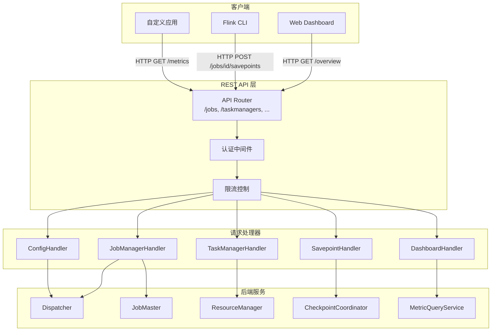
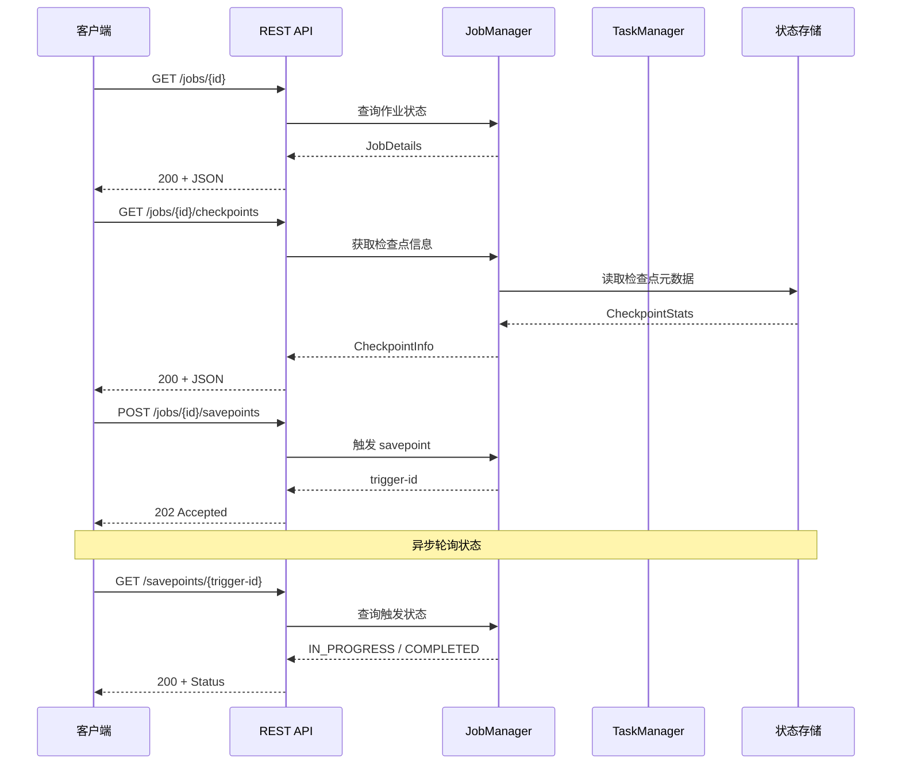
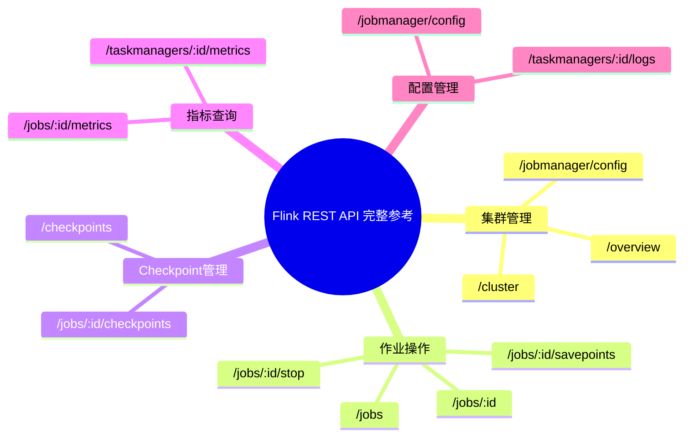
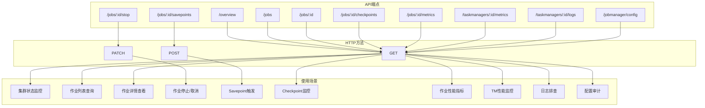
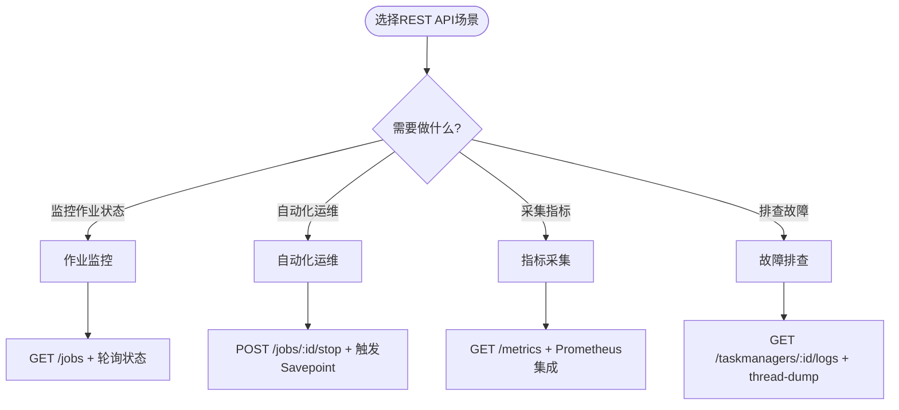

# Flink REST API 完整参考

> **所属阶段**: Flink/ | **前置依赖**: [Flink部署架构](../../01-concepts/deployment-architectures.md), [Checkpoint机制深度解析](../../02-core/checkpoint-mechanism-deep-dive.md) | **形式化等级**: L3

---

## 1. 概念定义 (Definitions)

### Def-F-07-01: REST API 端点

Flink REST API 是一组基于 HTTP 协议的接口，用于与 Flink 集群进行交互，包括作业管理、监控、配置查询和控制操作。

**端点分类**:

| 类别 | 前缀 | 功能描述 |
|------|------|----------|
| JobManager API | `/jobs`, `/joboverview` | 作业生命周期管理 |
| TaskManager API | `/taskmanagers` | TaskManager 管理 |
| Dashboard API | `/overview` | 集群状态监控 |
| Savepoint API | `/jobs/{jobid}/savepoints` | Savepoint 操作 |
| Configuration API | `/config` | 配置查询 |

### Def-F-07-02: API 响应格式

```
APIResponse := {
  "errors": [ErrorMessage],
  "data": Any
}

ErrorMessage := {
  "code": Integer,
  "message": String
}
```

---

## 2. 属性推导 (Properties)

### Prop-F-07-01: API 幂等性分类

| HTTP 方法 | 幂等性 | 适用场景 |
|-----------|--------|----------|
| GET | 幂等 | 查询操作 |
| POST | 非幂等 | 创建/触发操作 |
| PATCH | 非幂等 | 部分更新 |
| DELETE | 幂等 | 删除操作 |

### Prop-F-07-02: 响应状态码规范

```
2xx: 成功
  200 OK - 请求成功
  202 Accepted - 异步操作已接受

4xx: 客户端错误
  400 Bad Request - 参数错误
  404 Not Found - 资源不存在
  409 Conflict - 状态冲突

5xx: 服务端错误
  500 Internal Server Error - 内部错误
  503 Service Unavailable - 服务不可用
```

---

## 3. 关系建立 (Relations)

### API 与 Flink 组件映射

```
REST API Layer
      │
      ├──→ JobManager RPC
      │      ├──→ JobMaster (作业调度)
      │      ├──→ CheckpointCoordinator (检查点协调)
      │      └──→ ResourceManager (资源管理)
      │
      ├──→ TaskManager RPC
      │      ├──→ TaskExecutor (任务执行)
      │      └──→ MemoryManager (内存管理)
      │
      └──→ WebMonitor Endpoint
             └──→ MetricQueryService (指标查询)
```

---

## 4. 论证过程 (Argumentation)

### 4.1 API 版本演进

Flink REST API 版本历史：

| 版本 | Flink 版本 | 主要变化 |
|------|------------|----------|
| v1 | 1.4+ | 初始版本 |
| v2 | 1.12+ | 支持异步操作 |
| v3 | 1.17+ | 新增 savepoint 格式选项 |

### 4.2 安全考虑

- 生产环境应启用 HTTPS
- 使用防火墙限制 API 访问
- 敏感操作（如取消作业）需认证

---

## 5. 工程论证 (Engineering Argument)

### 5.1 API 设计原则

**统一性**: 所有端点遵循 RESTful 设计，使用名词表示资源

**一致性**: 响应格式统一，错误码语义一致

**可扩展性**: 通过查询参数支持过滤和分页

---

## 6. API 完整参考

### 6.1 JobManager API

#### 6.1.1 获取所有作业列表

**请求信息**

| 属性 | 值 |
|------|-----|
| HTTP 方法 | GET |
| URL | `/jobs` |
| 认证 | 可选 |

**请求参数**: 无

**响应示例 (200 OK)**

```json
{
  "jobs": [
    {
      "id": "f98dc763e00a6dc0e1e6e92b8e2f9c8a",
      "status": "RUNNING",
      "name": "WordCount",
      "start-time": 1712217600000,
      "end-time": -1,
      "duration": 3600000,
      "state": "RUNNING",
      "tasks": {
        "total": 5,
        "created": 0,
        "scheduled": 0,
        "deploying": 0,
        "running": 5,
        "finished": 0,
        "canceling": 0,
        "canceled": 0,
        "failed": 0,
        "reconciling": 0
      }
    }
  ]
}
```

**错误码**

| 状态码 | 描述 |
|--------|------|
| 500 | JobManager 内部错误 |

---

#### 6.1.2 获取作业概览

**请求信息**

| 属性 | 值 |
|------|-----|
| HTTP 方法 | GET |
| URL | `/joboverview` |
| 认证 | 可选 |

**响应示例 (200 OK)**

```json
{
  "running": [
    {
      "jid": "f98dc763e00a6dc0e1e6e92b8e2f9c8a",
      "name": "WordCount",
      "state": "RUNNING",
      "start-time": 1712217600000,
      "end-time": -1,
      "duration": 3600000,
      "last-modification": 1712217601000,
      "tasks": {
        "total": 5,
        "created": 0,
        "scheduled": 0,
        "deploying": 0,
        "running": 5,
        "finished": 0,
        "canceling": 0,
        "canceled": 0,
        "failed": 0,
        "reconciling": 0
      }
    }
  ],
  "finished": [],
  "cancelled": [],
  "failed": []
}
```

---

#### 6.1.3 获取作业详情

**请求信息**

| 属性 | 值 |
|------|-----|
| HTTP 方法 | GET |
| URL | `/jobs/{jobid}` |
| 认证 | 可选 |

**路径参数**

| 参数 | 类型 | 必填 | 描述 |
|------|------|------|------|
| jobid | String | 是 | 作业 ID |

**响应示例 (200 OK)**

```json
{
  "jid": "f98dc763e00a6dc0e1e6e92b8e2f9c8a",
  "name": "WordCount",
  "isStoppable": false,
  "state": "RUNNING",
  "start-time": 1712217600000,
  "end-time": -1,
  "duration": 3600000,
  "now": 1712221200000,
  "timestamps": {
    "CREATED": 1712217600000,
    "RUNNING": 1712217601000
  },
  "vertices": [
    {
      "id": "cbc357ccb763df2852fee8c4fc7d55f2",
      "name": "Source: Socket Stream",
      "parallelism": 1,
      "status": "RUNNING",
      "start-time": 1712217601000,
      "end-time": -1,
      "duration": 3599000,
      "tasks": {
        "CREATED": 0,
        "SCHEDULED": 0,
        "DEPLOYING": 0,
        "RUNNING": 1,
        "FINISHED": 0,
        "CANCELING": 0,
        "CANCELED": 0,
        "FAILED": 0,
        "RECONCILING": 0
      },
      "metrics": {
        "read-records": 10000,
        "write-records": 10000
      }
    }
  ],
  "status-counts": {
    "CREATED": 0,
    "RUNNING": 3,
    "FINISHED": 0,
    "CANCELED": 0,
    "FAILED": 0
  },
  "plan": {
    "jid": "f98dc763e00a6dc0e1e6e92b8e2f9c8a",
    "name": "WordCount",
    "nodes": [
      {
        "id": "cbc357ccb763df2852fee8c4fc7d55f2",
        "parallelism": 1,
        "operator": "",
        "operator_strategy": ""
      }
    ]
  }
}
```

**错误码**

| 状态码 | 描述 |
|--------|------|
| 404 | 作业不存在 |
| 500 | 查询失败 |

---

#### 6.1.4 获取作业配置

**请求信息**

| 属性 | 值 |
|------|-----|
| HTTP 方法 | GET |
| URL | `/jobs/{jobid}/config` |
| 认证 | 可选 |

**路径参数**

| 参数 | 类型 | 必填 | 描述 |
|------|------|------|------|
| jobid | String | 是 | 作业 ID |

**响应示例 (200 OK)**

```json
{
  "jid": "f98dc763e00a6dc0e1e6e92b8e2f9c8a",
  "name": "WordCount",
  "execution-config": {
    "execution-mode": "PIPELINED",
    "restart-strategy": "fixed-delay",
    "restart-strategy-config": {
      "restartAttempts": 10,
      "delayBetweenAttempts": 1000
    },
    "job-parallelism": -1,
    "object-reuse-mode": false,
    "user-config": {
      "pipeline.name": "WordCount"
    }
  }
}
```

---

#### 6.1.5 获取作业异常

**请求信息**

| 属性 | 值 |
|------|-----|
| HTTP 方法 | GET |
| URL | `/jobs/{jobid}/exceptions` |
| 认证 | 可选 |

**查询参数**

| 参数 | 类型 | 必填 | 描述 |
|------|------|------|------|
| maxExceptions | Integer | 否 | 最大返回异常数，默认 20 |

**响应示例 (200 OK)**

```json
{
  "root-exception": "java.io.IOException: Connection reset by peer",
  "timestamp": 1712218500000,
  "all-exceptions": [
    {
      "exception": "java.io.IOException: Connection reset by peer",
      "task": "FlatMap -> Filter (1/2)",
      "location": "taskmanager-1:6122",
      "timestamp": 1712218500000,
      "taskManagerId": "tm-001"
    }
  ],
  "truncated": false
}
```

---

#### 6.1.6 获取作业检查点信息

**请求信息**

| 属性 | 值 |
|------|-----|
| HTTP 方法 | GET |
| URL | `/jobs/{jobid}/checkpoints` |
| 认证 | 可选 |

**响应示例 (200 OK)**

```json
{
  "counts": {
    "restored": 1,
    "total": 10,
    "in_progress": 0,
    "completed": 9,
    "failed": 0
  },
  "summary": {
    "state_size": {
      "min": 1024,
      "max": 2048,
      "avg": 1536
    },
    "end_to_end_duration": {
      "min": 100,
      "max": 500,
      "avg": 300
    },
    "checkpoint_duration": {
      "min": 50,
      "max": 200,
      "avg": 125
    }
  },
  "latest": {
    "completed": {
      "id": 9,
      "trigger_timestamp": 1712221000000,
      "duration": 150,
      "state_size": 1800,
      "external_path": "hdfs:///checkpoints/f98dc763/job-9"
    },
    "failed": null,
    "restored": {
      "id": 5,
      "trigger_timestamp": 1712219000000,
      "restore_timestamp": 1712219500000
    }
  },
  "history": [
    {
      "id": 9,
      "trigger_timestamp": 1712221000000,
      "duration": 150,
      "state_size": 1800,
      "status": "COMPLETED"
    }
  ]
}
```

---

#### 6.1.7 获取作业指标

**请求信息**

| 属性 | 值 |
|------|-----|
| HTTP 方法 | GET |
| URL | `/jobs/{jobid}/metrics` |
| 认证 | 可选 |

**查询参数**

| 参数 | 类型 | 必填 | 描述 |
|------|------|------|------|
| get | String | 否 | 指定指标名称，逗号分隔 |

**响应示例 (200 OK)**

```json
[
  {
    "id": "read-records",
    "value": "100000"
  },
  {
    "id": "write-records",
    "value": "95000"
  },
  {
    "id": "numRecordsInPerSecond",
    "value": "1500.5"
  }
]
```

---

#### 6.1.8 取消作业

**请求信息**

| 属性 | 值 |
|------|-----|
| HTTP 方法 | PATCH |
| URL | `/jobs/{jobid}` |
| 认证 | 建议启用 |

**请求体**

```json
{
  "cancel-job": true
}
```

**响应**

| 状态码 | 描述 |
|--------|------|
| 202 | 取消请求已接受 |
| 404 | 作业不存在 |
| 409 | 作业已完成或已取消 |

---

### 6.2 TaskManager API

#### 6.2.1 获取 TaskManager 列表

**请求信息**

| 属性 | 值 |
|------|-----|
| HTTP 方法 | GET |
| URL | `/taskmanagers` |
| 认证 | 可选 |

**响应示例 (200 OK)**

```json
{
  "taskmanagers": [
    {
      "id": "tm-001-192.168.1.10-6122",
      "path": "akka.tcp://flink@192.168.1.10:6122/user/rpc/taskmanager_0",
      "dataPort": 6121,
      "timeSinceLastHeartbeat": 1500,
      "slotsNumber": 4,
      "freeSlots": 2,
      "hardware": {
        "cpuCores": 8,
        "physicalMemory": 17179869184,
        "freeMemory": 8589934592,
        "managedMemory": 4294967296
      },
      "memoryConfiguration": {
        "totalFlinkMemory": 4294967296,
        "totalProcessMemory": 8589934592,
        "networkMemory": 134217728,
        "managedMemory": 536870912
      }
    }
  ]
}
```

---

#### 6.2.2 获取 TaskManager 日志列表

**请求信息**

| 属性 | 值 |
|------|-----|
| HTTP 方法 | GET |
| URL | `/taskmanagers/{taskmanagerid}/logs` |
| 认证 | 可选 |

**路径参数**

| 参数 | 类型 | 必填 | 描述 |
|------|------|------|------|
| taskmanagerid | String | 是 | TaskManager ID |

**响应示例 (200 OK)**

```json
{
  "logs": [
    {
      "name": "flink-taskmanager.log",
      "size": 1048576
    },
    {
      "name": "flink-taskmanager.out",
      "size": 512000
    },
    {
      "name": "flink-taskmanager-gc.log",
      "size": 204800
    }
  ]
}
```

---

#### 6.2.3 获取 TaskManager 日志内容

**请求信息**

| 属性 | 值 |
|------|-----|
| HTTP 方法 | GET |
| URL | `/taskmanagers/{taskmanagerid}/logs/{logfilename}` |
| 认证 | 可选 |

**路径参数**

| 参数 | 类型 | 必填 | 描述 |
|------|------|------|------|
| taskmanagerid | String | 是 | TaskManager ID |
| logfilename | String | 是 | 日志文件名 |

**查询参数**

| 参数 | 类型 | 必填 | 描述 |
|------|------|------|------|
| offset | Integer | 否 | 起始偏移量，默认 0 |
| limit | Integer | 否 | 最大返回字节数，默认 102400 |

**响应**: 纯文本日志内容

---

#### 6.2.4 获取 TaskManager 指标

**请求信息**

| 属性 | 值 |
|------|-----|
| HTTP 方法 | GET |
| URL | `/taskmanagers/{taskmanagerid}/metrics` |
| 认证 | 可选 |

**查询参数**

| 参数 | 类型 | 必填 | 描述 |
|------|------|------|------|
| get | String | 否 | 指定指标名称，逗号分隔 |

**响应示例 (200 OK)**

```json
[
  {
    "id": "Status.JVM.Memory.Heap.Used",
    "value": "2147483648"
  },
  {
    "id": "Status.JVM.Memory.Heap.Committed",
    "value": "4294967296"
  },
  {
    "id": "Status.JVM.CPU.Load",
    "value": "0.35"
  },
  {
    "id": "Status.JVM.Threads.Count",
    "value": "45"
  },
  {
    "id": "Status.Network.AvailableMemorySegments",
    "value": "1024"
  }
]
```

---

### 6.3 Dashboard API

#### 6.3.1 获取集群概览

**请求信息**

| 属性 | 值 |
|------|-----|
| HTTP 方法 | GET |
| URL | `/overview` |
| 认证 | 可选 |

**响应示例 (200 OK)**

```json
{
  "version": "1.18.0",
  "commitId": "a1b2c3d4e5f6",
  "taskmanagers": 3,
  "slots-total": 12,
  "slots-available": 4,
  "jobs-running": 2,
  "jobs-finished": 10,
  "jobs-cancelled": 1,
  "jobs-failed": 0,
  "flink-version": "1.18.0",
  "flink-commit": "a1b2c3d4"
}
```

---

#### 6.3.2 获取作业执行计划

**请求信息**

| 属性 | 值 |
|------|-----|
| HTTP 方法 | GET |
| URL | `/jobs/{jobid}/plan` |
| 认证 | 可选 |

**响应示例 (200 OK)**

```json
{
  "plan": {
    "jid": "f98dc763e00a6dc0e1e6e92b8e2f9c8a",
    "name": "WordCount",
    "nodes": [
      {
        "id": "cbc357ccb763df2852fee8c4fc7d55f2",
        "parallelism": 1,
        "operator": "",
        "operator_strategy": "",
        "description": "Source: Socket Stream",
        "inputs": [],
        "optimizer_properties": {}
      },
      {
        "id": "a5b3c8d7e9f0123456789abcdef01234",
        "parallelism": 2,
        "operator": "FlatMap",
        "operator_strategy": "",
        "description": "FlatMap -> Filter",
        "inputs": [
          {
            "num": 0,
            "id": "cbc357ccb763df2852fee8c4fc7d55f2",
            "ship_strategy": "FORWARD",
            "exchange": "pipelined_bounded"
          }
        ],
        "optimizer_properties": {}
      }
    ]
  }
}
```

---

### 6.4 Savepoint API

#### 6.4.1 触发 Savepoint

**请求信息**

| 属性 | 值 |
|------|-----|
| HTTP 方法 | POST |
| URL | `/jobs/{jobid}/savepoints` |
| 认证 | 建议启用 |

**请求体**

```json
{
  "cancel-job": false,
  "target-directory": "hdfs:///savepoints",
  "formatType": "CANONICAL",
  "triggerId": "custom-trigger-id-001"
}
```

**参数说明**

| 字段 | 类型 | 必填 | 描述 |
|------|------|------|------|
| cancel-job | Boolean | 否 | 是否在 savepoint 后取消作业，默认 false |
| target-directory | String | 否 | Savepoint 保存路径 |
| formatType | String | 否 | 格式类型：CANONICAL 或 NATIVE，默认 CANONICAL |
| triggerId | String | 否 | 自定义触发 ID |

**响应示例 (202 Accepted)**

```json
{
  "request-id": "d7a8f7b3e9c245d1a6b8c9d0e1f2a3b4"
}
```

---

#### 6.4.2 查询 Savepoint 触发状态

**请求信息**

| 属性 | 值 |
|------|-----|
| HTTP 方法 | GET |
| URL | `/jobs/{jobid}/savepoints/{triggerid}` |
| 认证 | 可选 |

**响应示例 - 进行中 (200 OK)**

```json
{
  "status": {
    "id": "IN_PROGRESS"
  },
  "operation": {
    "location": "hdfs:///savepoints/savepoint-f98dc7-d7a8f7b3e9c2"
  }
}
```

**响应示例 - 完成 (200 OK)**

```json
{
  "status": {
    "id": "COMPLETED"
  },
  "operation": {
    "location": "hdfs:///savepoints/savepoint-f98dc7-d7a8f7b3e9c2"
  }
}
```

**响应示例 - 失败 (200 OK)**

```json
{
  "status": {
    "id": "FAILED"
  },
  "operation": {
    "failure-cause": {
      "class": "java.io.IOException",
      "stack-trace": "..."
    }
  }
}
```

**状态枚举**

| 状态 | 描述 |
|------|------|
| IN_PROGRESS | 进行中 |
| COMPLETED | 已完成 |
| FAILED | 失败 |

---

#### 6.4.3 从 Savepoint 恢复作业

**请求信息**

| 属性 | 值 |
|------|-----|
| HTTP 方法 | POST |
| URL | `/jars/{jarid}/run` |
| 认证 | 建议启用 |

**请求体**

```json
{
  "savepointPath": "hdfs:///savepoints/savepoint-f98dc7-d7a8f7b3e9c2",
  "allowNonRestoredState": false,
  "programArgs": "--input hdfs:///data/input"
}
```

---

### 6.5 Configuration API

#### 6.5.1 获取集群配置

**请求信息**

| 属性 | 值 |
|------|-----|
| HTTP 方法 | GET |
| URL | `/config` |
| 认证 | 可选 |

**响应示例 (200 OK)**

```json
{
  "refresh-interval": 3000,
  "timezone-name": "Asia/Shanghai",
  "timezone-offset": 28800000,
  "flink-version": "1.18.0",
  "flink-revision": "a1b2c3d4e5f6",
  "features": {
    "web-submit": true,
    "web-cancel": true
  }
}
```

---

#### 6.5.2 获取所有配置项

**请求信息**

| 属性 | 值 |
|------|-----|
| HTTP 方法 | GET |
| URL | `/jobmanager/config` |
| 认证 | 可选 |

**响应示例 (200 OK)**

```json
[
  {
    "key": "jobmanager.memory.process.size",
    "value": "2048m"
  },
  {
    "key": "taskmanager.memory.process.size",
    "value": "4096m"
  },
  {
    "key": "parallelism.default",
    "value": "1"
  },
  {
    "key": "state.backend",
    "value": "hashmap"
  },
  {
    "key": "checkpointing.interval",
    "value": "60000"
  }
]
```

---

## 7. 错误码汇总

### 7.1 通用错误码

| HTTP 状态码 | 错误码 | 描述 | 解决方案 |
|-------------|--------|------|----------|
| 400 | MalformedRequest | 请求格式错误 | 检查请求体 JSON 格式 |
| 401 | Unauthorized | 未授权 | 提供有效的认证凭据 |
| 403 | Forbidden | 禁止访问 | 检查权限配置 |
| 404 | NotFound | 资源不存在 | 确认 jobid 或 taskmanagerid 正确 |
| 409 | Conflict | 状态冲突 | 资源当前状态不允许该操作 |
| 500 | InternalError | 内部错误 | 查看 JobManager 日志 |
| 503 | ServiceUnavailable | 服务不可用 | 检查集群状态 |

### 7.2 作业相关错误码

| HTTP 状态码 | 错误码 | 描述 |
|-------------|--------|------|
| 404 | JobNotFound | 作业不存在 |
| 409 | JobAlreadyFinished | 作业已完成 |
| 409 | JobAlreadyCancelling | 作业正在取消中 |
| 500 | CheckpointTriggerFailed | 检查点触发失败 |

### 7.3 Savepoint 相关错误码

| HTTP 状态码 | 错误码 | 描述 |
|-------------|--------|------|
| 400 | InvalidSavepointPath | 无效的 savepoint 路径 |
| 500 | SavepointTriggerFailed | Savepoint 触发失败 |
| 500 | SavepointRestoreFailed | Savepoint 恢复失败 |

---

## 8. 实例验证 (Examples)

### 8.1 完整操作示例：作业监控流程

```bash
# 1. 获取集群概览 curl http://localhost:8081/overview

# 2. 获取运行中作业列表 curl http://localhost:8081/jobs

# 3. 获取特定作业详情 JOB_ID="f98dc763e00a6dc0e1e6e92b8e2f9c8a"
curl http://localhost:8081/jobs/${JOB_ID}

# 4. 获取作业检查点信息 curl http://localhost:8081/jobs/${JOB_ID}/checkpoints

# 5. 获取作业指标 curl "http://localhost:8081/jobs/${JOB_ID}/metrics?get=read-records,write-records"

# 6. 触发 savepoint curl -X POST \
  -H "Content-Type: application/json" \
  -d '{"cancel-job":false,"target-directory":"hdfs:///savepoints"}' \
  http://localhost:8081/jobs/${JOB_ID}/savepoints

# 7. 查询 savepoint 状态 TRIGGER_ID="d7a8f7b3e9c245d1a6b8c9d0e1f2a3b4"
curl http://localhost:8081/jobs/${JOB_ID}/savepoints/${TRIGGER_ID}
```

### 8.2 完整操作示例：TaskManager 监控

```bash
# 1. 获取所有 TaskManager curl http://localhost:8081/taskmanagers

# 2. 获取 TaskManager 指标 TM_ID="tm-001-192.168.1.10-6122"
curl "http://localhost:8081/taskmanagers/${TM_ID}/metrics?get=Status.JVM.Memory.Heap.Used,Status.JVM.CPU.Load"

# 3. 获取日志列表 curl http://localhost:8081/taskmanagers/${TM_ID}/logs

# 4. 获取日志内容 curl http://localhost:8081/taskmanagers/${TM_ID}/logs/flink-taskmanager.log
```

### 8.3 Python 客户端示例

```python
import requests
import json

class FlinkRestClient:
    def __init__(self, base_url="http://localhost:8081"):
        self.base_url = base_url

    def get_overview(self):
        """获取集群概览"""
        resp = requests.get(f"{self.base_url}/overview")
        return resp.json()

    def list_jobs(self):
        """获取作业列表"""
        resp = requests.get(f"{self.base_url}/jobs")
        return resp.json()

    def get_job(self, job_id):
        """获取作业详情"""
        resp = requests.get(f"{self.base_url}/jobs/{job_id}")
        return resp.json()

    def get_job_metrics(self, job_id, metrics=None):
        """获取作业指标"""
        params = {}
        if metrics:
            params['get'] = ','.join(metrics)
        resp = requests.get(
            f"{self.base_url}/jobs/{job_id}/metrics",
            params=params
        )
        return resp.json()

    def trigger_savepoint(self, job_id, target_dir=None, cancel_job=False):
        """触发 savepoint"""
        payload = {
            "cancel-job": cancel_job,
            "target-directory": target_dir
        }
        resp = requests.post(
            f"{self.base_url}/jobs/{job_id}/savepoints",
            json=payload
        )
        return resp.json()

    def get_savepoint_status(self, job_id, trigger_id):
        """获取 savepoint 状态"""
        resp = requests.get(
            f"{self.base_url}/jobs/{job_id}/savepoints/{trigger_id}"
        )
        return resp.json()

# 使用示例 client = FlinkRestClient()

# 获取集群状态 overview = client.get_overview()
print(f"运行中作业数: {overview['jobs-running']}")
print(f"可用 slots: {overview['slots-available']}/{overview['slots-total']}")

# 监控特定作业 jobs = client.list_jobs()
for job in jobs.get('jobs', []):
    if job['status'] == 'RUNNING':
        job_id = job['id']
        metrics = client.get_job_metrics(
            job_id,
            ['read-records', 'write-records']
        )
        print(f"作业 {job['name']} 指标: {metrics}")
```

---

## 9. 可视化 (Visualizations)

### Flink REST API 架构图



### API 调用流程图



### API 分类矩阵

```mermaid
graph LR
    subgraph JobManager["JobManager API"]
        J1[/jobs\n列表查询\]
        J2[/joboverview\n概览统计\]
        J3[/{id}/config\n配置查看\]
        J4[/{id}/exceptions\n异常追踪\]
        J5[/{id}/checkpoints\n检查点信息\]
        J6[/{id}/metrics\n指标查询\]
    end

    subgraph TaskManager["TaskManager API"]
        T1[/taskmanagers\n节点列表\]
        T2[/{id}/logs\n日志查看\]
        T3[/{id}/metrics\n性能指标\]
    end

    subgraph Dashboard["Dashboard API"]
        D1[/overview\n集群概览\]
        D2[/jobs/plan\n执行计划\]
    end

    subgraph Savepoint["Savepoint API"]
        S1[POST /savepoints\n触发保存\]
        S2[GET /savepoints/{id}\n状态查询\]
    end

    subgraph Config["Configuration API"]
        C1[/config\n配置信息\]
        C2[/jobmanager/config\n详细配置\]
    end
```

### Flink REST API 思维导图

Flink REST API 各端点的放射式分类视图，从中心向外展开五大管理域。



### API 端点-方法-场景多维关联树

展示核心 API 端点、HTTP 方法与典型使用场景之间的映射关系。



### REST API 使用场景决策树

根据运维目标快速选择对应的 REST API 调用路径与配套操作。



---

## 10. 引用参考 (References)


---

## 附录：API 速查表

| 操作 | 方法 | URL | 版本 |
|------|------|-----|------|
| 集群概览 | GET | `/overview` | v1+ |
| 作业列表 | GET | `/jobs` | v1+ |
| 作业概览 | GET | `/joboverview` | v1+ |
| 作业详情 | GET | `/jobs/{id}` | v1+ |
| 作业配置 | GET | `/jobs/{id}/config` | v1+ |
| 作业异常 | GET | `/jobs/{id}/exceptions` | v1+ |
| 作业检查点 | GET | `/jobs/{id}/checkpoints` | v1+ |
| 作业指标 | GET | `/jobs/{id}/metrics` | v1+ |
| 取消作业 | PATCH | `/jobs/{id}` | v1+ |
| TM 列表 | GET | `/taskmanagers` | v1+ |
| TM 日志 | GET | `/taskmanagers/{id}/logs` | v1+ |
| TM 指标 | GET | `/taskmanagers/{id}/metrics` | v1+ |
| 触发 Savepoint | POST | `/jobs/{id}/savepoints` | v1+ |
| Savepoint 状态 | GET | `/jobs/{id}/savepoints/{tid}` | v1+ |
| 集群配置 | GET | `/config` | v1+ |
| JM 配置 | GET | `/jobmanager/config` | v1+ |

---

*文档版本: v1.0 | 创建日期: 2026-04-18*
