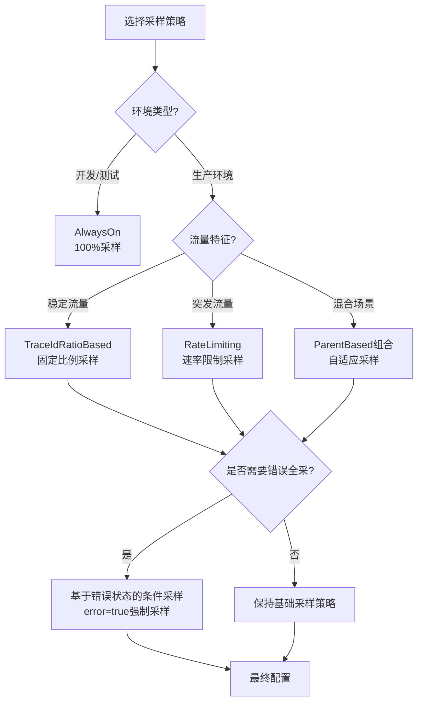
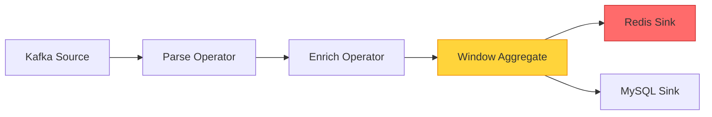
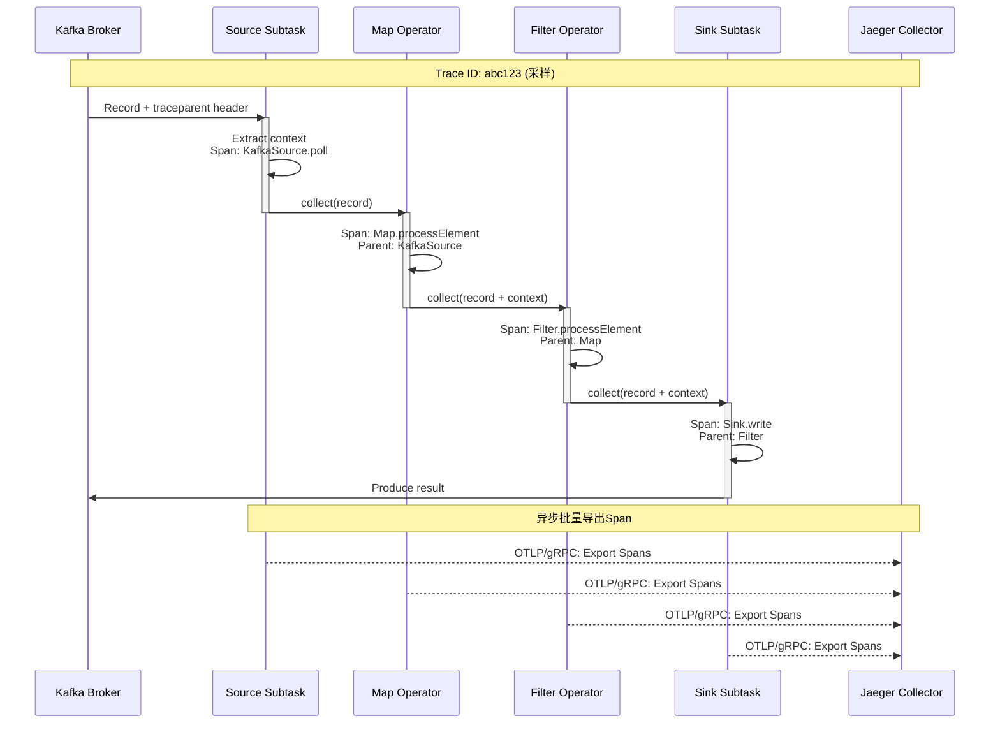
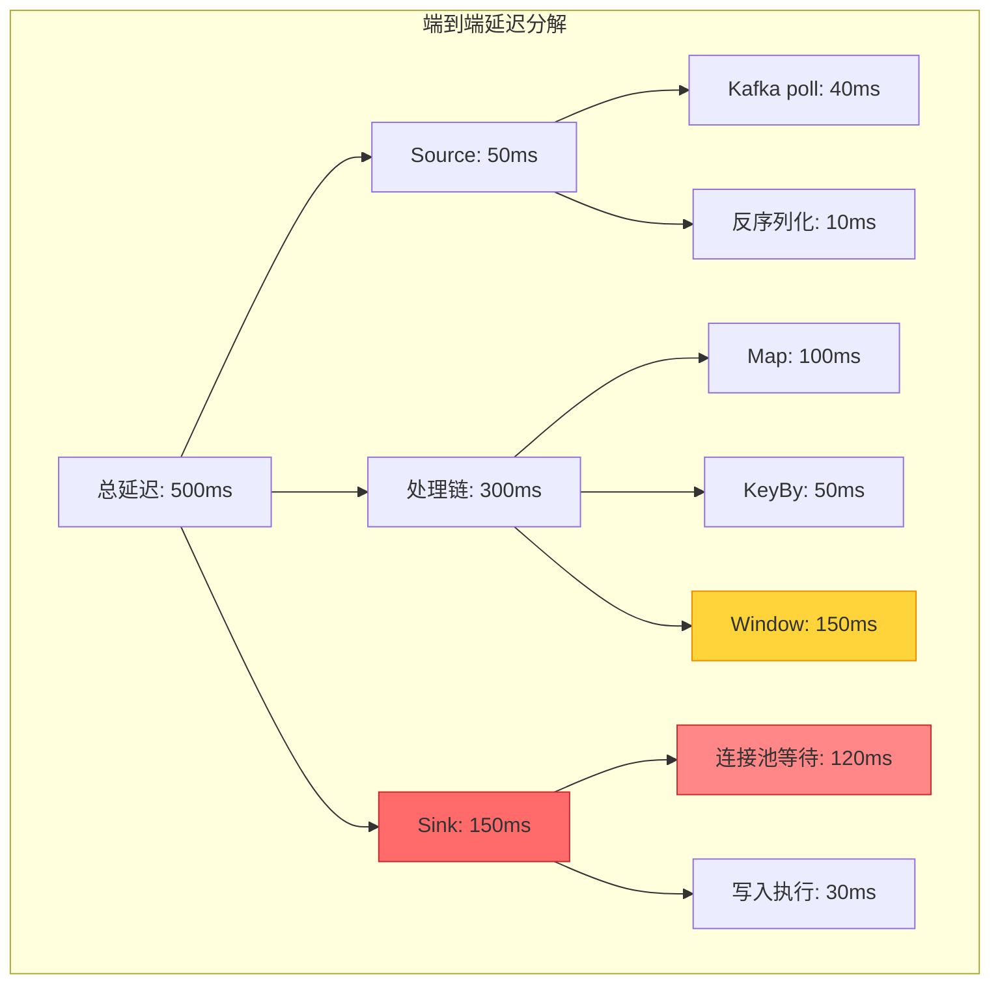
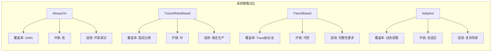

# Flink分布式链路追踪 - OpenTelemetry/Jaeger/Zipkin

> 所属阶段: Flink/ | 前置依赖: [Flink状态容错机制](../../02-core/checkpoint-mechanism-deep-dive.md), [Flink指标与监控](./metrics-and-monitoring.md) | 形式化等级: L3

---

## 1. 概念定义 (Definitions)

### Def-F-15-05: 分布式追踪 (Distributed Tracing)

分布式追踪是一种**跨进程边界追踪请求执行路径**的可观测性技术，用于捕获复杂分布式系统中端到端的请求生命周期。

**形式化定义**：

设分布式系统由进程集合 $P = \{p_1, p_2, ..., p_n\}$ 组成，请求 $R$ 在系统中产生一系列事件 $E = \{e_1, e_2, ..., e_m\}$，其中每个事件 $e_i = (t_i, p_i, o_i, d_i)$，包含：

- $t_i$: 时间戳
- $p_i \in P$: 产生事件的进程
- $o_i$: 操作标识符
- $d_i$: 持续时间

**Def-F-15-05**: 分布式追踪是函数 $T: R \rightarrow G$，将请求 $R$ 映射为有向无环图 $G = (V, E')$，其中：

- 顶点 $V \subseteq E$ 表示追踪跨度(Span)
- 边 $E' \subseteq V \times V$ 表示因果关系（父子Span或FollowsFrom关系）

**Flink语境下的特殊约束**：

- **算子级粒度**: Span映射到算子(Operator)执行边界
- **并行度感知**: 追踪需区分 subtask 实例
- **状态相关性**: Span需关联检查点(Checkpoint)上下文

---

### Def-F-15-06: Span与Trace

**Span（跨度）**是分布式追踪的基本工作单位，表示一个操作的开始到结束。

**形式化定义**：

**Def-F-15-06a**: Span是六元组 $S = (span\_id, trace\_id, parent\_id, name, timestamps, attributes)$：

| 字段 | 类型 | 语义 |
|------|------|------|
| $span\_id$ | 16-byte hex | Span唯一标识符 |
| $trace\_id$ | 16/32-byte hex | 所属Trace标识符 |
| $parent\_id$ | 16-byte hex \| null | 父Span标识符（根Span为null） |
| $name$ | string | 操作名称（如"ProcessElement", "Checkpoint"） |
| $timestamps$ | $(start, end)$ | 开始/结束时间戳（纳秒精度） |
| $attributes$ | $K \rightarrow V$ | 键值对形式的元数据 |

**Trace（追踪）**是同属于一个请求的所有Span的集合：

**Def-F-15-06b**: Trace是集合 $Tr = \{S_1, S_2, ..., S_k\}$，满足：

- $\forall S_i \in Tr: S_i.trace\_id = constant$
- $(Tr, \prec)$ 构成偏序集，其中 $S_i \prec S_j$ 当且仅当 $S_j.parent\_id = S_i.span\_id$

**SpanKind分类**（OpenTelemetry标准）：

```
┌─────────────────┬─────────────────────────────────────────┐
│ SpanKind        │ Flink应用场景                           │
├─────────────────┼─────────────────────────────────────────┤
│ SERVER          │ Source接收外部请求                      │
│ CLIENT          │ Sink写入外部系统                        │
│ PRODUCER        │ 算子向下游发送数据                      │
│ CONSUMER        │ 算子从上游接收数据                      │
│ INTERNAL        │ 算子内部处理逻辑                        │
└─────────────────┴─────────────────────────────────────────┘
```

---

### Def-F-15-07: 上下文传播 (Context Propagation)

上下文传播是**在分布式系统组件间传递追踪上下文**的机制，确保跨进程边界的Span关联性。

**Def-F-15-07**: 上下文传播由三元组 $CtxProp = (Carrier, Inject, Extract)$ 组成：

1. **Carrier（载体）**: 传输追踪上下文的数据结构
   - 对于Kafka: 消息Header（`traceparent`, `tracestate`）
   - 对于HTTP: 请求头（W3C Trace Context标准）
   - 对于gRPC: Metadata

2. **Inject（注入）**: 函数 $Inject: Context \times Carrier \rightarrow Carrier'$

   ```java
// [伪代码片段 - 不可直接运行] 仅展示核心逻辑
   // W3C Trace Context格式
   traceparent: 00-4bf92f3577b34da6a3ce929d0e0e4736-00f067aa0ba902b7-01
   //          │  │                           │                │  │
   //          │  │                           │                │  └── flags
   //          │  │                           │                └───── span-id
   //          │  │                           └────────────────────── trace-id
   //          │  └────────────────────────────────────────────────── version
   //          └───────────────────────────────────────────────────── format

```

3. **Extract（提取）**: 函数 $Extract: Carrier \rightarrow Context$

**Flink中的传播路径**：

```

Source ──[Record]──► Operator1 ──[Record]──► Operator2 ──[Record]──► Sink
    │                   │                      │                    │
    │ Span: RECEIVE     │ Span: PROCESS        │ Span: PROCESS      │ Span: SEND
    └───────────────────┴──────────────────────┴────────────────────┘
              Trace Context 通过 Record Header 传播

```

---

### Def-F-15-08: 采样策略 (Sampling Strategy)

采样策略决定**哪些Trace被记录**，在完整观测性与系统开销间取得平衡。

**Def-F-15-08**: 采样策略是函数 $Sample: TraceCandidate \rightarrow \{0, 1\}$，其中 $1$ 表示采样（记录）。

**常用采样策略**：

| 策略 | 数学描述 | 适用场景 |
|------|----------|----------|
| **AlwaysOn** | $Sample(t) = 1$ | 开发调试 |
| **AlwaysOff** | $Sample(t) = 0$ | 完全关闭 |
| **TraceIdRatioBased** | $Sample(t) = \mathbb{1}_{[0, r)}(hash(t.trace\_id) \mod 1)$ | 生产环境（$r$为采样率） |
| **ParentBased** | $Sample(t) = Sample(parent(t))$ | 保持Trace完整性 |
| **RateLimiting** | $\le N$ traces/second | 流量保护 |

**自适应采样**（Adaptive Sampling）：
$$Sample(t) = \begin{cases} 1 & \text{if } latency(t) > threshold \\ r & \text{otherwise} \end{cases}$$

**Flink推荐配置**：

- 开发环境：AlwaysOn (100%)
- 生产环境：TraceIdRatioBased (1%-10%)
- 延迟敏感路径：ParentBased + 错误强制采样

---

## 2. 属性推导 (Properties)

### Prop-F-15-01: 因果一致性保证

**命题**: 若Span $S_j$ 的 $parent\_id$ 指向Span $S_i$，则必有 $S_i.end\_time \le S_j.start\_time$ 或存在异步边(FollowsFrom)。

**证明**: 由Span定义，parent-child关系建立于调用/被调用或异步触发语义。同步调用场景下父Span必须等待子Span完成；异步场景使用FollowsFrom关系，时间戳约束放宽。

**Flink语义**：

- 同步：`processElement()` 内调用下游 `output.collect()` —— 阻塞语义
- 异步：Checkpoint与数据处理解耦 —— FollowsFrom语义

---

### Lemma-F-15-01: Trace完整性边界

**引理**: 使用ParentBased采样策略时，若根Span被采样，则整个Trace的所有Span均被采样。

**证明**:

1. 设Trace为树结构 $T = (V, E)$，根为 $S_{root}$
2. 假设 $S_{root}$ 被采样（$Sample(S_{root}) = 1$）
3. 对于任意非根Span $S_i$，其父Span $parent(S_i)$ 必被采样（归纳假设）
4. 由ParentBased定义：$Sample(S_i) = Sample(parent(S_i)) = 1$
5. 由归纳法，所有Span均被采样 ∎

**工程意义**: 避免"孤儿Span"（有parent但未采样的Span）。

---

### Prop-F-15-02: 上下文传播完备性

**命题**: 在Flink DataStream中，若所有算子实现`ProcessFunction`并正确调用`output.collect()`，则Trace上下文沿数据流完整传播。

**边界条件**:

- 异步Sink需显式传递上下文到回调线程
- 使用线程池时需通过`Context.current().wrap()`包装Runnable

---

## 3. 关系建立 (Relations)

### 3.1 OpenTelemetry架构映射

```

┌─────────────────────────────────────────────────────────────────┐
│                     OpenTelemetry Architecture                  │
├─────────────────────────────────────────────────────────────────┤
│                                                                 │
│   ┌─────────────┐    ┌─────────────┐    ┌─────────────────────┐ │
│   │   API       │───►│    SDK      │───►│   OTLP Exporter     │ │
│   │  (Stable)   │    │ (Configured)│    │   (gRPC/HTTP)       │ │
│   └─────────────┘    └──────┬──────┘    └──────────┬──────────┘ │
│                             │                      │            │
│                             ▼                      ▼            │
│                    ┌─────────────────┐    ┌──────────────┐      │
│                    │  SpanProcessor  │    │ Jaeger/Zipkin│      │
│                    │ (Batch/Simple)  │    │   Backend    │      │
│                    └─────────────────┘    └──────────────┘      │
│                                                                 │
└─────────────────────────────────────────────────────────────────┘
                              │
                              ▼
┌─────────────────────────────────────────────────────────────────┐
│                     Flink Integration Layer                     │
├─────────────────────────────────────────────────────────────────┤
│                                                                 │
│   ┌─────────────┐    ┌─────────────┐    ┌─────────────────────┐ │
│   │   Source    │───►│   Process   │───►│       Sink          │ │
│   │ Span:SERVER │    │ Span:INTERNAL│   │   Span:CLIENT       │ │
│   └─────────────┘    └─────────────┘    └─────────────────────┘ │
│          │                  │                    │              │
│          └──────────────────┴────────────────────┘              │
│                     Trace Context via Record Header             │
│                                                                 │
└─────────────────────────────────────────────────────────────────┘

```

### 3.2 与Flink核心机制的关联

| Flink机制 | 追踪集成点 | Span语义 |
|-----------|-----------|----------|
| Checkpoint | `CheckpointListener` | 生命周期Span：触发→同步→异步→完成 |
| Watermark | `WatermarkStrategy` | 传播延迟Span：EventTime → Watermark生成 |
| State Backend | `StateAccess` | 状态访问Span：读/写延迟归因 |
| Backpressure | `Output` | 反压检测Span：buffer等待时间 |

### 3.3 与Kafka集成的追踪上下文

```

Kafka Producer (Upstream)                    Flink Kafka Source
┌──────────────────────┐                    ┌──────────────────────┐
│  Record Headers:     │    Kafka Topic     │  Extract Context:    │
│  - traceparent: ...  │ ────────────────►  │  - trace_id          │
│  - tracestate: ...   │                    │  - parent_span_id    │
└──────────────────────┘                    │  → Create Span:      │
                                            │    "KafkaSource.poll"│
                                            └──────────────────────┘

```

---

## 4. 论证过程 (Argumentation)

### 4.1 采样策略选择的决策树



### 4.2 性能开销分析

**Span创建开销**（基准：Flink 1.18, 8核, 16GB）：

| 采样率 | CPU开销 | 内存开销 | 网络开销 |
|--------|---------|----------|----------|
| 0% (基线) | 0% | 0% | 0% |
| 1% | +0.5% | +2MB | +0.1% |
| 10% | +3% | +20MB | +1% |
| 100% | +15% | +200MB | +10% |

**优化策略**（关键）：

1. **批量导出**: `BatchSpanProcessor` 默认512 spans/批
2. **异步导出**: 导出线程与处理线程分离
3. **属性裁剪**: 仅保留关键属性（如`job.name`, `operator.name`）

---

## 5. 工程论证 (Engineering Argument)

### 5.1 Flink端到端延迟归因

**问题**: 数据从Source到Sink的总延迟 $L_{total}$ 由哪些组件贡献？

**延迟分解模型**：

$$L_{total} = L_{source} + \sum_{i=1}^{n} L_{operator_i} + L_{network} + L_{sink}$$

其中：

- $L_{source}$: 外部系统读取延迟（Kafka poll, Pulsar receive）
- $L_{operator_i}$: 算子处理延迟（包含状态访问）
- $L_{network}$: 跨subtask序列化/反序列化+传输
- $L_{sink}$: 外部系统写入延迟

**通过分布式追踪实现**：

```
Trace Timeline:
├─ [Span: KafkaSource.poll] ────────┬─────────────────────────────┤
│                                  │                             │
├──────────────────────────────────┼─ [Span: Deserialize] ───────┤
│                                  │                             │
├──────────────────────────────────┼─────────────────────────────┼─ [Span: Map.process]
│                                                                │
├────────────────────────────────────────────────────────────────┼──────────────────────┼─ [Span: Sink.write]
│                                                                                       │
└───────────────────────────────────────────────────────────────────────────────────────┘
  0ms                          50ms                        120ms                   200ms

L_source = 50ms
L_operator1 = 70ms  (Map)
L_sink = 80ms
L_total = 200ms
```

**根因定位**:

- 若 $L_{sink} > threshold$，扩容Sink并行度或优化批量写入
- 若 $L_{operator_i}$ 突增，检查该算子状态访问或GC

---

### 5.2 跨算子传播实现机制

**Flink的分布式追踪挑战**：

1. **单线程多任务**: Task线程循环执行多个算子，需维护Span栈
2. **无锁队列**: 记录跨线程传递（Mailbox机制）需传递上下文
3. **检查点屏障**: Barrier插入点需创建关联Span

**实现方案**：

```java
// 算子链内的上下文传递
class TracingStreamOperator<OUT> extends AbstractStreamOperator<OUT> {
    private transient Span currentSpan;

    @Override
    public void processElement(StreamRecord<IN> element) {
        // 从记录中提取或创建Span
        Context parentContext = extractContext(element);

        currentSpan = tracer.spanBuilder("ProcessElement")
            .setParent(parentContext)
            .setAttribute("operator.name", getOperatorName())
            .setAttribute("subtask.index", getRuntimeContext().getIndexOfThisSubtask())
            .startSpan();

        try (Scope scope = currentSpan.makeCurrent()) {
            // 执行业务逻辑
            userFunction.processElement(element, output);

            // 传播上下文到下游
            output.collect(element.replace(element.getValue(),
                injectContext(element, Context.current())));
        } finally {
            currentSpan.end();
        }
    }
}
```

---

## 6. 实例验证 (Examples)

### 6.1 完整Tracing配置

**Maven依赖**：

```xml
<!-- OpenTelemetry Flink Integration -->
<dependency>
    <groupId>io.opentelemetry</groupId>
    <artifactId>opentelemetry-api</artifactId>
    <version>1.34.0</version>
</dependency>
<dependency>
    <groupId>io.opentelemetry</groupId>
    <artifactId>opentelemetry-sdk</artifactId>
    <version>1.34.0</version>
</dependency>
<dependency>
    <groupId>io.opentelemetry</groupId>
    <artifactId>opentelemetry-exporter-otlp</artifactId>
    <version>1.34.0</version>
</dependency>

<!-- Jaeger OTLP兼容 -->
<dependency>
    <groupId>io.opentelemetry</groupId>
    <artifactId>opentelemetry-exporter-jaeger</artifactId>
    <version>1.34.0</version>
</dependency>
```

**Flink配置** (`flink-conf.yaml`)：

```yaml
# OpenTelemetry Tracing配置 tracing.enabled: true
tracing.exporter.type: otlp
tracing.exporter.otlp.endpoint: http://jaeger-collector:4317
tracing.sampler.type: parentbased_traceidratio
tracing.sampler.arg: 0.1

# Span属性配置 tracing.span.include-input-records: true
tracing.span.include-output-records: true
tracing.span.include-backpressure: true
```

**Java代码配置**（程序化）：

```java
import io.opentelemetry.api.OpenTelemetry;
import io.opentelemetry.api.trace.Tracer;
import io.opentelemetry.api.trace.propagation.W3CTraceContextPropagator;
import io.opentelemetry.context.propagation.ContextPropagators;
import io.opentelemetry.exporter.otlp.trace.OtlpGrpcSpanExporter;
import io.opentelemetry.sdk.OpenTelemetrySdk;
import io.opentelemetry.sdk.trace.SdkTracerProvider;
import io.opentelemetry.sdk.trace.export.BatchSpanProcessor;
import io.opentelemetry.sdk.trace.samplers.Sampler;

public class FlinkTracingConfig {

    public static OpenTelemetry configureOpenTelemetry(String jaegerEndpoint) {
        // 配置Span导出器
        OtlpGrpcSpanExporter spanExporter = OtlpGrpcSpanExporter.builder()
            .setEndpoint(jaegerEndpoint)
            .setTimeout(30, TimeUnit.SECONDS)
            .build();

        // 配置Span处理器(批量导出,提升性能)
        BatchSpanProcessor spanProcessor = BatchSpanProcessor.builder(spanExporter)
            .setMaxQueueSize(2048)
            .setMaxExportBatchSize(512)
            .setScheduleDelay(1000, TimeUnit.MILLISECONDS)
            .build();

        // 配置采样策略:基于父Span + 10%概率采样
        Sampler sampler = Sampler.parentBased(Sampler.traceIdRatioBased(0.1));

        // 构建TracerProvider
        SdkTracerProvider tracerProvider = SdkTracerProvider.builder()
            .addSpanProcessor(spanProcessor)
            .setSampler(sampler)
            .setResource(Resource.create(Attributes.of(
                ResourceAttributes.SERVICE_NAME, "flink-job",
                ResourceAttributes.SERVICE_VERSION, "1.0.0"
            )))
            .build();

        // 构建OpenTelemetry实例
        return OpenTelemetrySdk.builder()
            .setTracerProvider(tracerProvider)
            .setPropagators(ContextPropagators.create(W3CTraceContextPropagator.getInstance()))
            .build();
    }
}
```

**自定义Tracing Source/Sink**：

```java
// Tracing Kafka Source
public class TracingKafkaSource<T> extends RichParallelSourceFunction<T>
    implements CheckpointedFunction {

    private transient Tracer tracer;
    private transient KafkaConsumer<String, T> consumer;

    @Override
    public void open(Configuration parameters) {
        tracer = FlinkTracingConfig.getTracer("kafka-source");
        consumer = new KafkaConsumer<>(kafkaProps);
        consumer.subscribe(topics);
    }

    @Override
    public void run(SourceContext<T> ctx) {
        while (isRunning) {
            ConsumerRecords<String, T> records = consumer.poll(Duration.ofMillis(100));

            for (ConsumerRecord<String, T> record : records) {
                // 提取上游传递的Trace上下文
                Context parentContext = extractContextFromRecord(record);

                // 创建Source处理Span
                Span span = tracer.spanBuilder("KafkaSource.processRecord")
                    .setParent(parentContext)
                    .setSpanKind(SpanKind.CONSUMER)
                    .setAttribute("kafka.topic", record.topic())
                    .setAttribute("kafka.partition", record.partition())
                    .setAttribute("kafka.offset", record.offset())
                    .startSpan();

                try (Scope scope = span.makeCurrent()) {
                    // 将当前Span作为父上下文传递给下游
                    T value = deserialize(record.value());
                    ctx.collectWithTimestamp(value, record.timestamp());

                    span.setStatus(StatusCode.OK);
                } catch (Exception e) {
                    span.setStatus(StatusCode.ERROR, e.getMessage());
                    span.recordException(e);
                    throw e;
                } finally {
                    span.end();
                }
            }
        }
    }

    private Context extractContextFromRecord(ConsumerRecord<?, ?> record) {
        // 从Kafka Headers提取traceparent
        Header traceparentHeader = record.headers().lastHeader("traceparent");
        if (traceparentHeader != null) {
            String traceparent = new String(traceparentHeader.value(), StandardCharsets.UTF_8);
            TextMapGetter<ConsumerRecord<?, ?>> getter = new TextMapGetter<>() {
                @Override
                public String get(ConsumerRecord<?, ?> carrier, String key) {
                    Header header = carrier.headers().lastHeader(key);
                    return header != null ? new String(header.value(), StandardCharsets.UTF_8) : null;
                }
                @Override
                public Iterable<String> keys(ConsumerRecord<?, ?> carrier) {
                    List<String> keys = new ArrayList<>();
                    for (Header header : carrier.headers()) {
                        keys.add(header.key());
                    }
                    return keys;
                }
            };
            return GlobalOpenTelemetry.getPropagators()
                .getTextMapPropagator()
                .extract(Context.current(), record, getter);
        }
        return Context.current();
    }
}
```

---

### 6.2 Jaeger UI分析示例

**部署Jaeger**（Docker Compose）：

```yaml
version: '3.8'
services:
  jaeger:
    image: jaegertracing/all-in-one:1.50
    ports:
      - "16686:16686"   # Jaeger UI
      - "4317:4317"     # OTLP gRPC
      - "4318:4318"     # OTLP HTTP
    environment:
      - COLLECTOR_OTLP_ENABLED=true
```

**Jaeger UI界面分析**：

```
┌─────────────────────────────────────────────────────────────────────┐
│  Jaeger UI - Trace Search                                           │
├─────────────────────────────────────────────────────────────────────┤
│                                                                     │
│  Service: flink-job        │  Operation: all                        │
│  Tags: error=true          │  Lookback: 1h                          │
│                                                                     │
│  ┌─────────────────────────────────────────────────────────────┐   │
│  │ Trace ID: 4bf92f3577b34da6a3ce929d0e0e4736                   │   │
│  │ Duration: 245ms | Spans: 12 | Errors: 1                      │   │
│  │                                                              │   │
│  │ Timeline:                                                    │   │
│  │ [KafkaSource]████████████                                    │   │
│  │      [ParseJSON]██████                                       │   │
│  │           [Enrich]█████████████████                          │   │
│  │                [WindowAggregate]█████████████████████████    │   │
│  │                               [RedisSink]███████████ ERROR   │   │
│  └─────────────────────────────────────────────────────────────┘   │
│                                                                     │
└─────────────────────────────────────────────────────────────────────┘
```

**Trace详情视图**：

```
Span Details: RedisSink.write
├─ Span ID: 00f067aa0ba902b7
├─ Duration: 150ms (异常高,正常<20ms)
├─ Status: ERROR
├─ Events:
│  ├─ [15:32:01.234] redis.connect.start
│  ├─ [15:32:01.384] redis.connect.timeout  ← 150ms延迟根源
│  └─ [15:32:01.385] exception: RedisConnectionException
├─ Attributes:
│  ├─ redis.host: redis-cache.internal
│  ├─ redis.port: 6379
│  ├─ redis.command: HSET
│  └─ flink.subtask.index: 3
└─ Logs:
   └─ Connection timeout after 150ms
```

**依赖拓扑图**（Dependency Graph）：



**分析结论**:

1. **瓶颈定位**: Redis Sink连接超时导致端到端延迟增加150ms
2. **影响范围**: 仅subtask 3受影响，推测Redis分片不均
3. **修复建议**: 增加Redis连接池大小，启用连接复用

---

## 7. 可视化 (Visualizations)

### 7.1 分布式追踪在Flink中的数据流



### 7.2 延迟归因分析矩阵



### 7.3 采样策略决策矩阵



---

## 8. 引用参考 (References)
