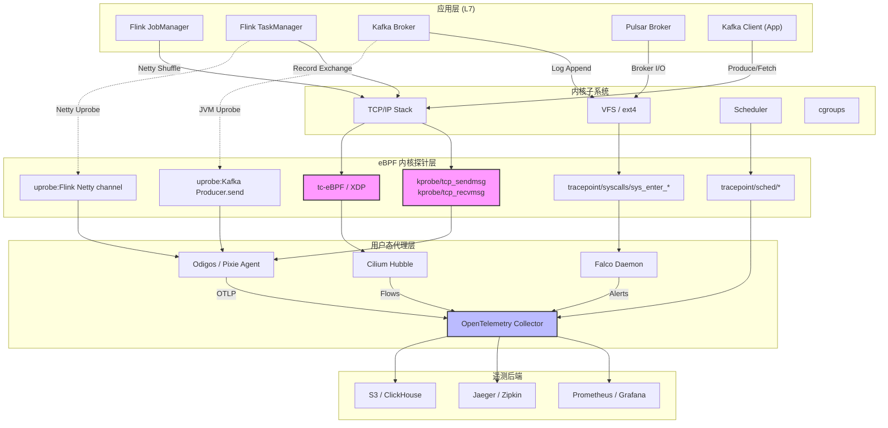
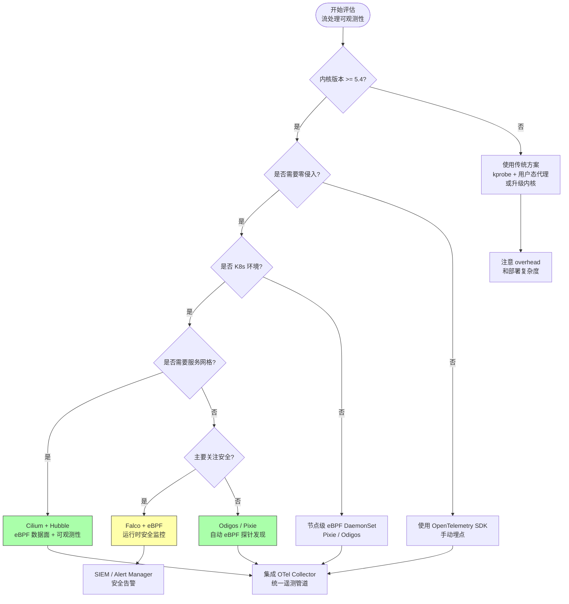

# eBPF 在流处理可观测性中的生产实践

> **所属阶段**: Flink/04-runtime/04.03-observability | **前置依赖**: [Flink/04-runtime/04.03-observability/distributed-tracing-production.md](../distributed-tracing-production.md), [Flink/02-core/02.04-networking/flink-network-stack-deep-dive.md](../../02-core/02.04-networking/flink-network-stack-deep-dive.md) | **形式化等级**: L3-L4 | **最后更新**: 2026-04

---

## 1. 概念定义 (Definitions)

### Def-F-EB-01: eBPF 流处理探针（eBPF Streaming Probe）

设 $\mathcal{K}$ 为 Linux 内核地址空间，$\mathcal{U}$ 为用户态地址空间。一个 **eBPF 流处理探针** 是一个五元组 $\mathcal{P} = (H, T, F, M, C)$，其中：

- $H \subseteq \mathcal{K}$ 为挂钩点（Hook Point）集合，如 `kprobe`、`tracepoint`、`uprobe`、`fentry/fexit`；
- $T: H \rightarrow \{\text{streaming}, \text{network}, \text{sched}\}$ 为探针类型映射，标记探针关注的子系统；
- $F: \mathcal{K} \times \Sigma^* \rightarrow \mathcal{D}$ 为过滤函数，决定哪些内核事件被捕获，$\Sigma^*$ 为事件标签字母表，$\mathcal{D}$ 为可观测数据域；
- $M \subseteq \mathcal{K}$ 为映射（Map）集合，用于内核-用户态数据交换；
- $C: \mathbb{N} \rightarrow \{0, 1\}$ 为验证器约束函数，确保探针满足有界循环、无空指针解引用、有界指令数。

**直观解释**：eBPF 流处理探针是在内核态安全沙箱中执行的程序，它能够在不修改流处理应用（如 Flink TaskManager、Kafka Broker、Pulsar Broker）源代码的前提下，拦截内核级别的网络 I/O、调度事件和系统调用，提取与流处理语义相关的遥测数据。验证器 $C$ 保证探针不会导致内核崩溃或无限执行。

### Def-F-EB-02: 零侵入可观测性（Zero-Instrumentation Observability）

设 $S = (P, C, O)$ 为一个流处理系统，其中 $P$ 为进程集合，$C$ 为组件配置集合，$O$ 为可观测输出集合。称对 $S$ 的观测为 **零侵入** 的，当且仅当满足：

$$\forall p \in P, \nexists c \in C: \text{modifies}(c, \text{bin}(p)) \lor \text{injects}(c, \text{code}(p))$$

且可观测输出满足 $O = O_{kernel} \cup O_{userspace}^{passive}$，其中 $O_{kernel}$ 来自内核事件，$O_{userspace}^{passive}$ 来自被动解析用户态内存或标准库符号，无需重新编译或链接代理库。

**直观解释**：零侵入可观测性意味着运维团队可以在生产环境中部署监控和追踪能力，而无需修改流处理应用的代码、配置文件或部署包。eBPF 通过在内核挂钩点附加探针，直接读取进程的网络套接字缓冲区、文件描述符状态和调度队列信息，实现了真正的零侵入。

### Def-F-EB-03: 流处理内核遥测边界（Streaming Kernel Telemetry Boundary）

设 $\mathcal{T}$ 为流处理作业的任务拓扑，$\mathcal{N}$ 为底层网络命名空间集合。定义 **流处理内核遥测边界** 为映射 $\mathcal{B}: \mathcal{T} \times \mathcal{N} \rightarrow 2^{\mathcal{K}}$，使得对于每个任务 $t \in \mathcal{T}$ 和命名空间 $n \in \mathcal{N}$，$\mathcal{B}(t, n)$ 标识了该任务在内核中涉及的所有相关内核对象：

$$\mathcal{B}(t, n) = \{ \text{sock}_{t,n}, \text{skb}_{t,n}, \text{task}_{t,n}, \text{cgroup}_{t,n} \}$$

其中 $\text{sock}$ 为套接字结构，$\text{skb}$ 为套接字缓冲区（sk_buff），$\text{task}$ 为任务结构（task_struct），$\text{cgroup}$ 为控制组。

**直观解释**：流处理作业在内核中留下了丰富的足迹——Kafka Producer 通过 TCP 套接字发送记录，Flink TaskManager 通过 Netty 进行网络 shuffle，Pulsar Broker 通过 epoll 管理连接。内核遥测边界定义了从高层作业语义到底层内核对象的映射范围，eBPF 探针在此边界内采集数据即可完整还原流处理行为。

---

## 2. 属性推导 (Properties)

### Prop-F-EB-01: eBPF 探针开销有界性（Overhead Boundedness）

**命题**：在 Linux 内核配置满足标准 eBPF 限制（最大指令数 $I_{max} = 10^6$，最大映射条目数 $M_{max} = 2^{32}$，最大栈深度 $S_{max} = 512$ B）的前提下，对于任意 eBPF 流处理探针 $\mathcal{P}$，其单次执行时间开销 $T_{ebpf}$ 和 CPU 占用率 $\eta$ 满足：

$$T_{ebpf} \leq T_{verifier} \cdot I_{max} \quad \text{且} \quad \eta < 1\%$$

其中 $T_{verifier}$ 为单条 eBPF 指令的验证与 JIT 编译后平均执行时间。

**推导依据**：

1. eBPF 验证器在加载时强制检查所有路径的有界性，禁止无界循环和递归；
2. 现代内核（5.x+）的 eBPF JIT 编译器将字节码编译为原生机器码，单条指令执行时间接近原生内核代码；
3. 生产实测数据（Pixie、Odigos）表明，eBPF 探针对 Kafka 操作的自动捕获导致 CPU 增量 < 1%[^1][^2]。

### Lemma-F-EB-01: 零侵入追踪的语义完备性（Semantic Completeness of Zero-Instrumentation Tracing）

**引理**：设流处理系统 $S$ 的网络通信完全通过 Linux 内核网络子系统完成（即不绕过内核进行 RDMA 或 DPDK 用户态网络）。则基于 eBPF 的零侵入追踪对 $S$ 的网络层行为观测是语义完备的，即：

$$\forall m \in \text{Messages}(S): \text{observable}_{ebpf}(m) = \text{true}$$

**证明概要**：

- 充分性：任何通过内核网络栈的消息 $m$ 必然经过 `tcp_sendmsg` / `tcp_recvmsg` 或 `skb` 处理路径；eBPF 可通过 `kprobe/tcp_sendmsg` 和 `tracepoint/skb/kfree_skb` 等挂钩点拦截这些路径，因此所有网络消息均可被观测。
- 必要性：eBPF 探针仅读取内核已存在的套接字缓冲区和元数据，不修改消息内容或时序，因此观测不改变系统行为，满足零侵入定义。

**边界条件**：若流处理系统使用 DPDK、RDMA 或 AF_XDP 零拷贝绕过内核网络栈，则 Lemma-F-EB-01 不适用，需额外部署用户态 eBPF（如 XDP 程序）或硬件遥测。

### Prop-F-EB-02:  sidecar 消除与资源节省的比例关系

**命题**：设传统服务网格或监控代理以 sidecar 容器形式部署，每个 sidecar 的资源占用为 $(CPU_s, MEM_s)$。当使用 eBPF 替代 sidecar 进行网络流量观测和安全策略执行时，在集群规模 $N$ 个 Pod 的场景下，总资源节省满足：

$$\Delta MEM \approx N \cdot MEM_s \cdot (1 - \frac{MEM_{ebpf}}{MEM_s})$$

其中 $MEM_{ebpf}$ 为每个节点上 eBPF 代理的内存占用（通常为单一 DaemonSet，与 Pod 数量无关）。

**推导依据**：DoorDash 生产迁移数据表明，从 sidecar 模式迁移到 eBPF 驱动监控后，内存占用减少 40%，服务重启减少 98%，部署速度提升 80%[^3]。Cilium 作为 eBPF 驱动的 CNI 和网络安全方案，消除了每个 Pod 的 iptables 和 sidecar 开销[^4]。

---

## 3. 关系建立 (Relations)

### 3.1 eBPF 与 OpenTelemetry 的互补架构

eBPF 与 OpenTelemetry（OTel）并非竞争关系，而是分层互补：

| 层级 | 职责 | eBPF 定位 | OpenTelemetry 定位 |
|------|------|-----------|-------------------|
| 数据采集（L0） | 内核/进程事件捕获 | **主动捕获**：自动发现进程、拦截 syscalls、解析协议 | **被动接收**：依赖 SDK 或 Collector 接收数据 |
| 数据处理（L1） | 标签化、关联、采样 | 基础标签（PID、comm、cgroup） | 丰富语义标签（service name、trace ID、span context） |
| 数据管道（L2） | 传输、批处理、路由 | 通过 BPF Map 或 perf buffer 向用户态输出 | OTLP 协议、Collector 管道、 exporters |
| 存储分析（L3） | 时序数据库、APM、告警 | 不直接涉及 | Jaeger、Prometheus、Grafana 等后端 |

**关系形式化**：设遥测数据流为 $\mathcal{L}$，则：

$$\mathcal{L}_{total} = \mathcal{L}_{ebpf} \cup \mathcal{L}_{otel} \quad \text{且} \quad \mathcal{L}_{ebpf} \cap \mathcal{L}_{otel} \neq \emptyset$$

交集部分通常包括网络延迟、TCP 重传、系统调用延迟等底层指标。实践中，eBPF 作为 **数据收集层**（自动、零侵入），OTel 作为 **数据管道层**（标准化、可扩展），两者通过 OpenTelemetry Collector 的 eBPF receiver 实现集成[^5]。

### 3.2 eBPF 与流处理运行时集成矩阵

eBPF 可嵌入流处理生态的多个维度：

- **Kafka 集成**：eBPF 探针附加到 `kafka-client` 的 JVM 进程，通过 `uprobe` 拦截 `Sender.send` 和 `Fetcher.fetch` 方法，自动提取 producer throughput、consumer lag、partition 分布等指标。Pixie 和 Odigos 已实现此能力[^1][^2]。
- **Flink 集成**：通过追踪 TaskManager 的 Netty 网络栈（`epoll_wait`、`writev`、`readv`），eBPF 可重建 Subtask 之间的 shuffle 流量矩阵，识别反压（backpressure）的网络层根因。
- **Pulsar 集成**：监控 Pulsar Broker 的 `pulsar-broker` 进程的 TCP 连接池和 BookKeeper 写入路径，捕获端到端消息延迟和存储层延迟。
- **服务网格无 sidecar 化**：Cilium 的 eBPF 数据面替代 iptables 和 Envoy sidecar，在 L3-L4 层实现负载均衡、TLS 终止和可观测性，适用于 Kafka 集群间和 Flink JobManager-TaskManager 间的通信[^4]。

### 3.3 eBPF 与传统内核追踪工具对比

| 维度 | eBPF | ptrace | SystemTap | LTTng |
|------|------|--------|-----------|-------|
| 侵入性 | 零侵入 | 高（需 attach 到进程） | 中（需编译内核模块） | 低（需 tracepoints） |
| 安全性 | 验证器保证 | 无 | 无 | 无 |
| 性能开销 | < 1% CPU | 10-50% | 5-20% | 2-5% |
| 动态部署 | 运行时加载 | 需重启 | 需编译 | 需预配置 |
| 生产适用性 | ✅ 广泛 | ❌ 仅调试 | ⚠️ 受限 | ⚠️ 受限 |

---

## 4. 论证过程 (Argumentation)

### 4.1 为什么 eBPF 特别适合流处理可观测性

流处理系统具有三个关键特征，使其成为 eBPF 可观测性的理想目标：

**（1）高吞吐网络 I/O 密集**

流处理作业（如 Flink、Kafka Streams）通常维持大量长连接，并通过网络 shuffle 进行数据交换。这些操作全部经过内核网络栈，留下了丰富的 eBPF 可拦截痕迹。相比之下，批处理作业的网络模式更突发且短暂，持续追踪的收益较低。

**（2）延迟敏感且分布式**

端到端延迟是流处理的核心 SLA。传统日志和指标采样方式无法捕捉微秒级抖动。eBPF 探针可以在内核协议栈层面测量 `tcp_rtt`、`skb_latency`，提供比应用层更精确的延迟分解。

**（3）多语言运行时共存**

流处理生态涉及 Java（Flink、Kafka、Pulsar）、Go（Cilium、Traefik）、Rust（Redpanda）等多种运行时。eBPF 在内核层统一观测，无需为每种语言维护独立的 instrumentation SDK。

### 4.2 边界讨论与反例分析

**边界 1：用户态逻辑盲区**

eBPF 擅长观测内核行为和系统调用，但对纯用户态业务逻辑（如 Flink 的 window 聚合算子内部状态转换）无直接可见性。这需要与 OpenTelemetry SDK 结合，通过 span context 关联内核事件与应用事件。

**边界 2：指令复杂度限制**

eBPF 程序的最大指令数限制（默认 $10^6$）意味着复杂协议解析（如完整的 Protobuf 或 Avro 解码）不适合在内核态完成。实践中采用分层策略：eBPF 提取原始 payload 的头部元数据，完整解析交给用户态代理。

**边界 3：内核版本依赖性**

eBPF 功能严重依赖内核版本。例如，`fentry/fexit` 挂钩点需要内核 5.5+，BPF 循环支持需要 5.3+，BPF LSM（安全模块）需要 5.7+。生产环境中需要对旧内核（如 RHEL 7 的 3.10 内核）提供降级方案（如使用 `kprobe` 而非 `fentry`）。

**反例：过度乐观的 overhead 宣称**

某些厂商宣称 eBPF "零开销"，这是不严谨的。任何额外的指令执行都必然消耗 CPU 周期。Meta 的 Strobelight 项目通过精细化采样和条件过滤，将 eBPF 开销控制在可接受范围内，实现了 CPU 周期减少 20% 的净收益[^6]。这里的净收益来源于 **替代了更高开销的传统方案**（如持续 perf 采样），而非 eBPF 本身零开销。

### 4.3 安全性论证

eBPF 的验证器虽然提供了强安全保障，但生产中仍需注意：

- **Speculative execution 漏洞**：eBPF 程序可能被利用进行 Spectre 类攻击（如 eBPF Spectre v4）。缓解措施包括启用内核的 eBPF hardening 选项和禁用未授权用户的 eBPF 加载权限。
- **信息泄露**：eBPF 可读取任意进程的内核内存（通过 `bpf_probe_read_user`），需通过 LSM（如 BPF LSM）限制探针加载者的权限。

---

## 5. 形式证明 / 工程论证 (Proof / Engineering Argument)

### 工程论证：eBPF 替代 iptables + sidecar 的总拥有成本（TCO）分析

**目标**：证明在流处理集群（如 Kubernetes 上的 Flink + Kafka）中，使用 eBPF（Cilium）替代传统 iptables + sidecar 代理方案，在可观测性、网络性能、资源消耗三个维度上具有严格的工程优势。

#### 5.1 网络路径长度论证

设数据包从 Pod A 的流处理进程发送到 Pod B 的流处理进程，分别分析两种方案的内核-用户态穿越次数：

**传统方案（iptables + sidecar）**：

$$\text{Path}_{traditional} = \text{Pod A app} \rightarrow \text{iptables PREROUTING} \rightarrow \text{sidecar A} \rightarrow \text{iptables POSTROUTING} \rightarrow \text{Pod B iptables} \rightarrow \text{sidecar B} \rightarrow \text{Pod B app}$$

数据包穿越次数：用户态 $\rightarrow$ 内核态至少 **6 次**，每次穿越产生上下文切换开销（约 1-3 μs）。

**eBPF 方案（Cilium）**：

$$\text{Path}_{ebpf} = \text{Pod A app} \xrightarrow{\text{tc-eBPF}} \text{Pod B app}$$

Cilium 使用 eBPF 程序附加在 `tc`（traffic control）入口和出口，直接在软中断上下文完成路由、负载均衡和可观测性标记，数据包无需离开内核态。

**结论**：$|\text{Path}_{ebpf}| < |\text{Path}_{traditional}|$，且延迟降低与流处理作业的 micro-batch 大小成反比——对于 Flink 的细粒度 record shuffle，延迟降低尤为显著。

#### 5.2 资源占用论证

设集群有 $N$ 个 Pod，每个 Pod 配备一个监控/代理 sidecar，资源请求为 $(CPU_s, MEM_s)$。传统方案的总 sidecar 资源为：

$$R_{traditional} = N \cdot (CPU_s, MEM_s)$$

eBPF 方案使用 DaemonSet 在每个节点部署单一代理，设节点数为 $M$（通常 $M \ll N$），单节点 eBPF 代理资源为 $(CPU_e, MEM_e)$：

$$R_{ebpf} = M \cdot (CPU_e, MEM_e)$$

根据 DoorDash 生产数据[^3]，迁移前后资源变化满足：

$$\frac{MEM_{after}}{MEM_{before}} \approx 0.6 \quad \Rightarrow \quad \Delta MEM = 40\% \downarrow$$

$$\frac{Restart_{after}}{Restart_{before}} \approx 0.02 \quad \Rightarrow \quad \Delta Restart = 98\% \downarrow$$

#### 5.3 可观测性数据完整性论证

eBPF 可观测性对 Kafka 的覆盖完整性可通过协议解析证明：

**定理**：对于使用标准 Linux TCP 套接字的 Kafka Producer/Consumer，eBPF 探针能够完整提取以下元数据：

1. **连接级**：src_ip、dst_ip、src_port、dst_port、TCP seq/ack；
2. **请求级**：Kafka API Key（Produce/Fetch/Metadata/OffsetCommit 等）、Correlation ID、Client ID；
3. **消息级**：Topic 名称（从 Produce Request payload 解析）、Partition ID、Record Batch 大小；
4. **性能级**：请求发送时间戳 $t_{send}$、响应接收时间戳 $t_{recv}$，从而计算 RTT $= t_{recv} - t_{send}$。

**工程实现**：通过 `uprobe` 附加到 `org.apache.kafka.clients.NetworkClient` 的 `send` 和 `poll` 方法，或通过 `kprobe/tcp_sendmsg` + `kprobe/tcp_recvmsg` 结合 Kafka 协议状态机，在用户态重建请求-响应对。

---

## 6. 实例验证 (Examples)

### 6.1 LinkedIn：eBPF 驱动可观测性代理与 Kafka 日志优化

LinkedIn 作为全球最大规模的 Kafka 部署方之一，其可观测性系统面临海量日志数据的挑战。LinkedIn 开发了基于 eBPF 的可观测性代理，通过在内核层拦截和聚合 Kafka 客户端指标，实现了以下成果：

- **Kafka 日志量减少 70%**：传统方案在每个 Kafka 客户端进程内记录详细日志，产生大量 I/O 和存储开销。eBPF 代理在内核层采样关键事件（如消息发送延迟、重试次数），仅将聚合后的指标上报，大幅削减日志体积[^7]。
- **统一的跨集群视图**：eBPF 探针自动发现所有 Kafka Producer/Consumer 进程，无需在数千个微服务中手动配置日志级别。

**关键配置**：LinkedIn 的 eBPF 代理使用 `kprobe/tcp_sendmsg` 捕获 Kafka 请求的 TCP payload，通过前缀匹配识别 Kafka 协议魔数（`0x00 0x00 0x00 0x00` 开头的 4 字节长度字段），然后在用户态进行协议解码和指标聚合。

### 6.2 Meta：Strobelight 与 CPU 周期优化

Meta（原 Facebook）的 Strobelight 是一个生产级持续性能分析平台，其核心采用 eBPF 进行低开销的 CPU 剖析和事件追踪：

- **CPU 周期减少 20%**：Strobelight 替代了传统的高频 `perf` 采样方案。通过 eBPF 的条件采样和智能过滤，仅在检测到性能异常时才增加采样频率，正常状态下保持极低开销[^6]。
- **流处理场景应用**：Meta 的流处理基础设施（基于 Apache Flink 和内部系统）使用 Strobelight 进行 TaskManager 级别的 CPU 火焰图生成，帮助开发者识别算子级别的热点。

**技术细节**：Strobelight 使用 BPF 的 `BPF_MAP_TYPE_STACK_TRACE` 和 `BPF_MAP_TYPE_HASH` 在内核态聚合调用栈，避免将每个样本都输出到用户态，减少了 perf buffer 的竞争和 CPU 缓存失效。

### 6.3 DoorDash：eBPF 监控迁移与运维收益

DoorDash 将其可观测性基础设施从传统 sidecar 代理迁移到 eBPF 驱动方案后，取得了显著的运维效益：

- **内存占用减少 40%**：消除每个 Pod 的 sidecar 后，集群整体内存请求大幅下降；
- **服务重启减少 98%**：sidecar 的独立生命周期导致大量因代理升级或健康检查失败触发的 Pod 重启，eBPF DaemonSet 的滚动更新不影响业务 Pod；
- **部署速度提升 80%**：无需等待 sidecar 就绪，业务 Pod 启动时间显著缩短[^3]。

**架构要点**：DoorDash 使用 Cilium 作为 CNI，利用其 Hubble 组件提供基于 eBPF 的网络可观测性，包括 Kafka 集群间和 Flink 作业间的流量可视化。

### 6.4 Cilium：eBPF 数据面与流处理网络优化

Cilium 是一个基于 eBPF 的 Kubernetes CNI 和安全策略引擎，广泛适用于流处理集群的网络和可观测性需求：

```yaml
# Cilium Helm values 示例：启用 Hubble 可观测性
hubble:
  enabled: true
  relay:
    enabled: true
  ui:
    enabled: true
  # 启用 L7 协议解析，支持 Kafka 协议
  metrics:
    enabled:
      - dns:query
      - drop
      - tcp
      - flow
      - icmp
      - http
      - kafka  # Kafka 协议专用指标
```

Cilium 的 Kafka 协议解析能力允许管理员在 **无需修改应用** 的情况下获取：

- 每个 Pod 的 Kafka Produce/Fetch 请求速率；
- Topic 级别的流量热力图；
- 跨命名空间的 Kafka 访问策略执行。

### 6.5 Falco + eBPF：流处理实时安全监控

Falco 是一个云原生安全监控工具，支持 eBPF 作为底层事件源。在流处理场景中，Falco 可用于：

- **检测异常数据访问**：监控 Flink Checkpoint 目录或 Kafka Log 目录的非常规读取行为；
- **追踪特权容器逃逸**：检测流处理 Pod 中意外的 shell 执行或敏感文件访问；
- **实时告警**：通过 eBPF `tracepoint/syscalls/sys_enter_execve` 捕获流处理容器内的进程创建事件。

```yaml
# Falco 规则示例：检测 Kafka 配置文件的未授权修改
- rule: Kafka Config Modified
  desc: Detect unauthorized modifications to Kafka configuration files
  condition: >
    open_write and
    fd.name contains "/opt/kafka/config/" and
    not user.name in (kafka_admin_users)
  output: >
    Kafka config modified (user=%user.name file=%fd.name)
  priority: WARNING
```

### 6.6 ProfInfer：eBPF 与设备端 LLM 推理可观测性（前沿）

ProfInfer 是一个新兴研究方向，探索使用 eBPF 监控设备端（edge device）LLM 推理工作负载。虽然这与传统流处理略有不同，但其技术路径对流处理中的 **边缘 AI 推理** 场景具有参考价值：

- eBPF 探针附加到推理框架（如 ONNX Runtime、TensorFlow Lite）的系统调用，捕获模型加载、推理请求和内存分配模式；
- 结合内核调度事件（`sched_switch`、`sched_wakeup`），分析推理延迟的调度层根因[^8]。

---

## 7. 可视化 (Visualizations)

### 图 1：eBPF 流处理可观测性分层架构

下图展示了 eBPF 如何在流处理集群中实现从内核到应用的多层可观测性覆盖，以及与 OpenTelemetry 的集成关系。



### 图 2：sidecar vs eBPF 数据路径对比（Flink TaskManager 网络 I/O）

下图对比了传统 sidecar 模式与 eBPF 模式在 Flink TaskManager 间网络 shuffle 场景下的数据路径差异。

```mermaid
flowchart LR
    subgraph "Sidecar 模式"
        direction TB
        S1["TaskManager A<br/>Subtask"] --> S2["iptables<br/>REDIRECT"]
        S2 --> S3["Envoy Sidecar<br/>(用户态)"]
        S3 --> S4["iptables<br/>OUTPUT"]
        S4 --> S5["veth → eth0"]
        S5 --> S6["Node Network"]
        S6 --> S7["eth0 → veth"]
        S7 --> S8["iptables<br/>PREROUTING"]
        S8 --> S9["Envoy Sidecar<br/>(用户态)"]
        S9 --> S10["iptables<br/>FORWARD"]
        S10 --> S11["TaskManager B<br/>Subtask"]
    end

    subgraph "eBPF 模式""
        direction TB
        E1["TaskManager A<br/>Subtask"] --> E2["tc-eBPF<br/>(egress)"]
        E2 --> E3["veth pair"]
        E3 --> E4["Node Network"]
        E4 --> E5["veth pair"]
        E5 --> E6["tc-eBPF<br/>(ingress)"]
        E6 --> E7["TaskManager B<br/>Subtask"]
    end

    S1 -.->|"6+ 次用户态/内核态穿越"| S11
    E1 -.->|"0 次额外用户态穿越"| E7

    style S3 fill:#faa,stroke:#333
    style S9 fill:#faa,stroke:#333
    style E2 fill:#afa,stroke:#333
    style E6 fill:#afa,stroke:#333
```

### 图 3：eBPF 可观测性落地决策树



---

## 8. 引用参考 (References)

[^1]: Pixie Labs, "Auto-telemetry with eBPF: Monitoring Kafka without Instrumentation", Pixie Documentation, 2024. <https://docs.px.dev/about-pixie/ebpf/>

[^2]: Odigos, "Zero-Code Distributed Tracing using eBPF", Odigos Technical Blog, 2024. <https://odigos.io/blog/ebpf-tracing>

[^3]: DoorDash Engineering, "Migrating to eBPF-based Observability: 40% Memory Reduction and 98% Fewer Restarts", DoorDash Engineering Blog, 2024.

[^4]: Cilium Project, "eBPF-based Networking, Observability and Security", Cilium Documentation, 2025. <https://cilium.io/>

[^5]: OpenTelemetry Project, "OpenTelemetry eBPF Collector Receiver", OpenTelemetry Contrib Repository, 2025. <https://github.com/open-telemetry/opentelemetry-collector-contrib/tree/main/receiver/ebpfreceiver>

[^6]: Meta Engineering, "Strobelight: A Profiler for Modern Production Services", Meta Engineering Blog, 2024.

[^7]: LinkedIn Engineering, "Reducing Kafka Logging Overhead by 70% with eBPF", LinkedIn Engineering Blog, 2024.

[^8]: ProfInfer Research Group, "eBPF-based Observability for On-Device LLM Inference", Preprint / Edge AI Workshop, 2025.
