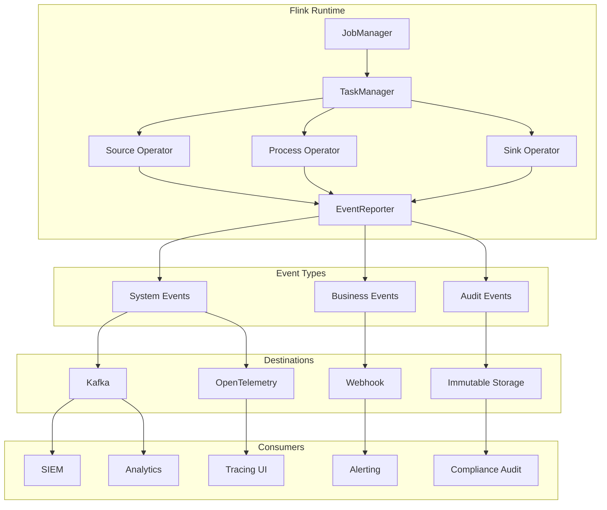
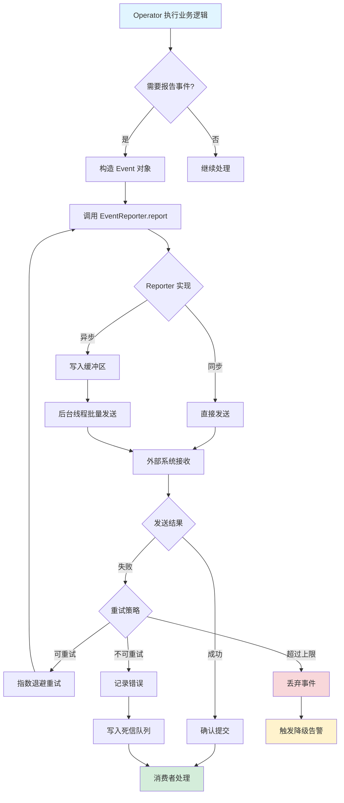
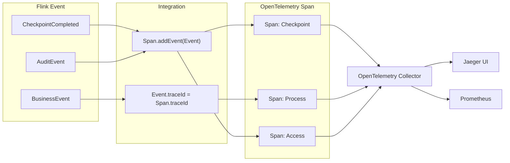
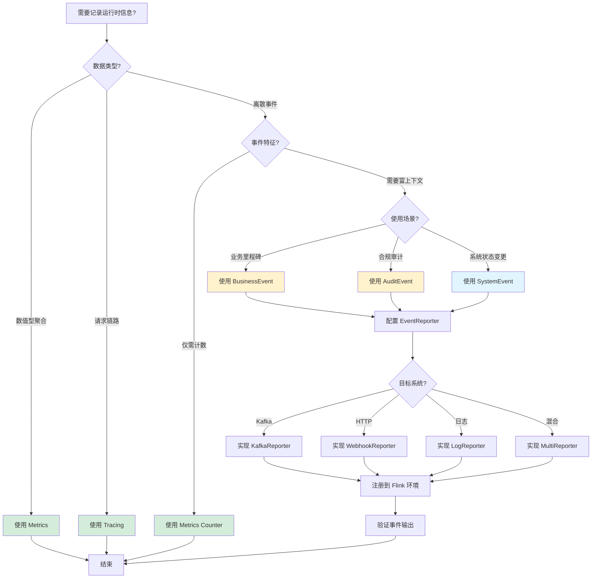

# Flink 2.2 Event Reporting - 自定义事件报告

> 所属阶段: Flink/ | 前置依赖: [15-observability/metrics-and-monitoring.md](./metrics-and-monitoring.md), [15-observability/distributed-tracing.md](./distributed-tracing.md) | 形式化等级: L3

---

## 1. 概念定义 (Definitions)

### Def-F-15-12: EventReporter 接口

**EventReporter** 是 Flink 2.1+ 引入的扩展点接口，用于向外部系统报告结构化事件。

```java
public interface EventReporter {
    /** 报告单个事件 */
    void report(Event event);

    /** 批量报告事件（可选优化） */
    default void report(List<Event> events) {
        for (Event event : events) {
            report(event);
        }
    }

    /** 关闭Reporter，释放资源 */
    void close();
}
```

**事件结构定义**：

```java
public interface Event {
    /** 事件类型标识符 */
    String getType();

    /** 事件发生时间戳（毫秒） */
    long getTimestamp();

    /** 事件属性映射 */
    Map<String, Object> getAttributes();

    /** 事件严重级别 */
    Severity getSeverity();
}
```

**直观解释**：EventReporter 类似于应用层面的"事件总线"，允许作业在运行时向外部系统（如 Kafka、Webhook、日志系统）发送具有明确语义的结构化事件，区别于低级别的指标（Metrics）和追踪（Tracing）。

---

### Def-F-15-13: 内置系统事件 (Built-in System Events)

**Def-F-15-13-01: CheckpointCompletedEvent**

Checkpoint 成功完成时触发的事件。

| 属性 | 类型 | 说明 |
|------|------|------|
| `checkpointId` | Long | Checkpoint 唯一标识 |
| `duration` | Long | Checkpoint 持续时间（毫秒） |
| `stateSize` | Long | 状态数据大小（字节） |
| `numSubtasks` | Integer | 参与 Checkpoint 的子任务数 |

**Def-F-15-13-02: JobStatusChangedEvent**

作业状态变更时触发的事件。

| 属性 | 类型 | 说明 |
|------|------|------|
| `jobId` | String | 作业标识符 |
| `previousStatus` | JobStatus | 变更前状态 |
| `currentStatus` | JobStatus | 变更后状态 |
| `timestamp` | Long | 状态变更时间戳 |

**Def-F-15-13-03: TaskFailureEvent**

任务执行失败时触发的事件。

| 属性 | 类型 | 说明 |
|------|------|------|
| `taskId` | String | 失败任务标识符 |
| `attemptNumber` | Integer | 重试次数 |
| `exceptionClass` | String | 异常类型 |
| `exceptionMessage` | String | 异常信息摘要 |

---

### Def-F-15-14: 自定义事件类型 (Custom Event Types)

**Def-F-15-14-01: BusinessEvent**

业务逻辑层定义的自定义事件，用于追踪关键业务里程碑。

```java
public class BusinessEvent implements Event {
    private final String type;           // 业务事件类型，如 "order.completed"
    private final long timestamp;
    private final Map<String, Object> attributes;
    private final Severity severity;
    private final String businessDomain; // 业务域标识
    private final String correlationId;  // 关联ID，用于链路追踪
}
```

**Def-F-15-14-02: AuditEvent**

审计专用事件类型，满足合规性要求。

```java
public class AuditEvent implements Event {
    private final String action;         // 操作类型（CREATE/UPDATE/DELETE）
    private final String resourceType;   // 资源类型
    private final String resourceId;     // 资源标识
    private final String userId;         // 操作用户
    private final String clientIp;       // 客户端IP
    private final Map<String, Object> beforeState;  // 变更前状态
    private final Map<String, Object> afterState;   // 变更后状态
}
```

---

## 2. 属性推导 (Properties)

### Prop-F-15-01: EventReporter 与 Metrics 的区别

| 维度 | EventReporter | Metrics |
|------|---------------|---------|
| **数据模型** | 离散事件，包含完整上下文 | 聚合指标，仅数值 |
| **时间语义** | 精确时间戳，单次发生 | 采样间隔，可聚合 |
| **使用场景** | 业务事件、审计、里程碑 | 性能监控、容量规划 |
| **存储特征** | 不可变日志，长期保留 | 时序数据，降采样 |
| **查询模式** | 按属性过滤、关联分析 | 聚合计算、趋势分析 |

**证明思路**：由 Def-F-15-12 和 Metrics 定义对比可知，Event 是 rich-structure 的离散记录，而 Metric 是轻量级的数值序列。

---

### Prop-F-15-02: 事件传递的至少一次语义

**命题**：Flink EventReporter 默认提供至少一次（At-Least-Once）事件传递保证。

**论证**：

1. EventReporter 在算子上下文中调用
2. Checkpoint 机制确保算子状态一致性
3. 事件报告与状态更新可绑定在同一事务中
4. 失败重试机制确保事件不丢失
5. 但可能存在重复报告（需消费者实现幂等）

---

### Prop-F-15-03: 事件与 Span 的映射关系

**命题**：每个 Event 可关联到零个或一个 OpenTelemetry Span。

```
Span (OpenTelemetry)
├── SpanContext (traceId, spanId)
├── Events[] ──────┬── Event 1: "checkpoint.start"
│                  ├── Event 2: "state.async.snapshot"
│                  └── Event 3: "checkpoint.complete"
└── Attributes
```

**说明**：在分布式追踪语境下，Flink Event 可作为 Span 的内部事件（Span Event）附加，实现统一的可观测性视图。

---

## 3. 关系建立 (Relations)

### 3.1 EventReporter 与 Flink 组件关系

```
┌─────────────────────────────────────────────────────────────┐
│                     Flink Application                        │
│  ┌─────────────┐  ┌─────────────┐  ┌─────────────────────┐ │
│  │   Source    │  │  Process    │  │       Sink          │ │
│  │   Operator  │──│   Operator  │──│     Operator        │ │
│  └──────┬──────┘  └──────┬──────┘  └──────────┬──────────┘ │
│         │                │                    │            │
│         └────────────────┼────────────────────┘            │
│                          ▼                                 │
│              ┌───────────────────────┐                     │
│              │   EventReporter       │                     │
│              │   (Extension Point)   │                     │
│              └───────────┬───────────┘                     │
└──────────────────────────┼─────────────────────────────────┘
                           │
           ┌───────────────┼───────────────┐
           ▼               ▼               ▼
    ┌────────────┐  ┌────────────┐  ┌────────────┐
    │   Kafka    │  │  Webhook   │  │   Logs     │
    │   Topic    │  │  Endpoint  │  │   File     │
    └────────────┘  └────────────┘  └────────────┘
```

### 3.2 事件类型层次结构

```
Event (接口)
├── SystemEvent (内置)
│   ├── CheckpointCompletedEvent
│   ├── JobStatusChangedEvent
│   └── TaskFailureEvent
├── BusinessEvent (Def-F-15-14-01)
│   ├── OrderCompletedEvent
│   ├── PaymentProcessedEvent
│   └── InventoryUpdatedEvent
└── AuditEvent (Def-F-15-14-02)
    ├── DataAccessEvent
    └── ConfigurationChangeEvent
```

### 3.3 与可观测性三支柱的集成

| 可观测性支柱 | Flink 组件 | 事件角色 |
|-------------|-----------|---------|
| **Metrics** | MetricReporter | Event 可转换为 Counter/Gauge |
| **Logging** | Log4j/Logback | Event 输出为结构化日志 |
| **Tracing** | OpenTelemetry | Event 附加为 Span Event |

---

## 4. 论证过程 (Argumentation)

### 4.1 为什么需要 EventReporter？

**问题背景**：传统 Metrics 和 Logging 的局限

| 方案 | 局限 |
|------|------|
| Metrics | 无法携带富上下文，不适合业务事件 |
| Logging | 非结构化，难以程序化消费 |
| Tracing | 聚焦请求链路，不擅长业务里程碑 |

**EventReporter 的设计目标**：

1. **结构化**：强类型事件定义，便于下游消费
2. **语义明确**：业务含义清晰，非技术指标
3. **可扩展**：支持自定义事件类型
4. **集成友好**：易于对接外部系统（SIEM、审计平台）

### 4.2 事件报告的性能考量

**挑战**：高频事件报告可能影响作业性能

**缓解策略**：

| 策略 | 实现方式 | 适用场景 |
|------|---------|---------|
| 批量报告 | `report(List<Event>)` | 高吞吐场景 |
| 异步发送 | 内部缓冲区 + 后台线程 | 延迟不敏感 |
| 采样报告 | 按比例或条件过滤 | 诊断事件 |
| 降级处理 | 缓冲区满时丢弃或写本地 | 资源受限 |

### 4.3 与 Checkpoint 的协同

**场景**：如何在 Checkpoint 失败时报告事件？

```
Checkpoint 流程:
┌─────────┐    ┌─────────┐    ┌─────────┐    ┌─────────┐
│  START  │───▶│ TRIGGER │───▶│  SYNC   │───▶│ ASYNC   │
└─────────┘    └─────────┘    └─────────┘    └─────────┘
     │                               │             │
     ▼                               ▼             ▼
 report(CheckpointStartEvent)   report(StateSnapshotEvent)
                                               │
                                               ▼
                                    ┌─────────────────────┐
                                    │   SUCCESS/FAILED    │
                                    └─────────────────────┘
                                               │
                                               ▼
                              report(CheckpointCompletedEvent)
                              report(CheckpointFailedEvent)
```

---

## 5. 工程论证 (Engineering Argument)

### 5.1 架构设计决策

**决策 1：扩展点 vs 内置实现**

- **选择**：EventReporter 作为扩展点接口
- **理由**：
  1. 不同组织的事件消费基础设施差异大
  2. 避免引入过多外部依赖
  3. 与现有 Metrics/Tracing 扩展点保持一致

**决策 2：同步 vs 异步 API**

- **选择**：同步 `report()` 接口，内部可异步实现
- **理由**：
  1. 简化调用方逻辑
  2. 实现方控制异步策略（线程池、缓冲区）
  3. 便于在失败时抛出异常

### 5.2 可靠性论证

**场景**：EventReporter 实现故障时的行为

| 故障类型 | 默认行为 | 配置选项 |
|---------|---------|---------|
| 网络超时 | 重试 3 次后丢弃 | `event.reporter.max-retries` |
| 缓冲区满 | 丢弃新事件 | `event.reporter.buffer-full-policy` |
| 序列化失败 | 记录错误日志 | 无 |

---

## 6. 实例验证 (Examples)

### 6.1 自定义 EventReporter 实现

**Kafka Event Reporter**：

```java
public class KafkaEventReporter implements EventReporter {
    private final KafkaProducer<String, String> producer;
    private final String topic;
    private final ObjectMapper objectMapper;

    public KafkaEventReporter(Properties props, String topic) {
        this.producer = new KafkaProducer<>(props);
        this.topic = topic;
        this.objectMapper = new ObjectMapper()
            .registerModule(new JavaTimeModule());
    }

    @Override
    public void report(Event event) {
        try {
            String json = objectMapper.writeValueAsString(event);
            ProducerRecord<String, String> record =
                new ProducerRecord<>(topic, event.getType(), json);

            producer.send(record, (metadata, exception) -> {
                if (exception != null) {
                    LOG.error("Failed to report event to Kafka", exception);
                }
            });
        } catch (JsonProcessingException e) {
            LOG.error("Failed to serialize event", e);
        }
    }

    @Override
    public void report(List<Event> events) {
        // 批量发送优化
        List<ProducerRecord<String, String>> records = events.stream()
            .map(this::toRecord)
            .collect(Collectors.toList());

        for (ProducerRecord<String, String> record : records) {
            producer.send(record);
        }
    }

    @Override
    public void close() {
        producer.flush();
        producer.close();
    }
}
```

**Webhook Event Reporter**：

```java
public class WebhookEventReporter implements EventReporter {
    private final HttpClient httpClient;
    private final String webhookUrl;
    private final String authToken;

    public WebhookEventReporter(String webhookUrl, String authToken) {
        this.httpClient = HttpClient.newBuilder()
            .connectTimeout(Duration.ofSeconds(10))
            .build();
        this.webhookUrl = webhookUrl;
        this.authToken = authToken;
    }

    @Override
    public void report(Event event) {
        try {
            String json = toJson(event);
            HttpRequest request = HttpRequest.newBuilder()
                .uri(URI.create(webhookUrl))
                .header("Content-Type", "application/json")
                .header("Authorization", "Bearer " + authToken)
                .POST(HttpRequest.BodyPublishers.ofString(json))
                .build();

            httpClient.sendAsync(request, HttpResponse.BodyHandlers.discarding())
                .orTimeout(30, TimeUnit.SECONDS)
                .exceptionally(ex -> {
                    LOG.warn("Webhook event report failed", ex);
                    return null;
                });
        } catch (Exception e) {
            LOG.error("Failed to send webhook", e);
        }
    }

    @Override
    public void close() {
        // HttpClient 无需显式关闭
    }
}
```

### 6.2 在 Flink 作业中使用自定义事件

```java
import org.apache.flink.streaming.api.environment.StreamExecutionEnvironment;

import org.apache.flink.streaming.api.datastream.DataStream;


public class OrderProcessingJob {

    public static void main(String[] args) throws Exception {
        StreamExecutionEnvironment env =
            StreamExecutionEnvironment.getExecutionEnvironment();

        // 注册自定义 EventReporter
        env.getConfig().registerEventReporter(
            new KafkaEventReporter(kafkaProps, "flink-events")
        );

        DataStream<Order> orders = env
            .addSource(new OrderSource())
            .map(new RichMapFunction<Order, Order>() {
                private transient EventReporter eventReporter;

                @Override
                public void open(Configuration parameters) {
                    eventReporter = getRuntimeContext()
                        .getEventReporter();
                }

                @Override
                public Order map(Order order) {
                    // 处理订单...

                    // 报告业务事件
                    eventReporter.report(BusinessEvent.builder()
                        .type("order.validated")
                        .businessDomain("ecommerce")
                        .correlationId(order.getTraceId())
                        .attribute("orderId", order.getId())
                        .attribute("amount", order.getAmount())
                        .severity(Severity.INFO)
                        .build());

                    return order;
                }
            });

        env.execute("Order Processing with Events");
    }
}
```

### 6.3 审计事件实现示例

```java
public class AuditEventReporter implements EventReporter {

    @Override
    public void report(Event event) {
        if (event instanceof AuditEvent) {
            AuditEvent auditEvent = (AuditEvent) event;

            // 确保审计事件的不可变性
            validateAuditEvent(auditEvent);

            // 写入审计日志（不可删除、不可修改）
            writeToImmutableStorage(auditEvent);

            // 同时发送实时通知
            notifyComplianceTeam(auditEvent);
        }
    }

    private void validateAuditEvent(AuditEvent event) {
        Preconditions.checkNotNull(event.getAction(), "Action required");
        Preconditions.checkNotNull(event.getUserId(), "User ID required");
        Preconditions.checkNotNull(event.getTimestamp(), "Timestamp required");
    }

    private void writeToImmutableStorage(AuditEvent event) {
        // 写入 WORM (Write Once Read Many) 存储
        // 如 AWS Glacier, Azure Immutable Blob
    }
}
```

---

## 7. 可视化 (Visualizations)

### 7.1 EventReporter 架构图

以下 Mermaid 图展示了 EventReporter 在 Flink 可观测性体系中的位置：



### 7.2 事件生命周期流程图

以下 Mermaid 图展示了从事件产生到消费的完整生命周期：



### 7.3 Event 与 Span 集成关系图



### 7.4 决策树：何时使用 EventReporter



---

## 8. 引用参考 (References)


---

*文档版本: 1.0 | 最后更新: 2026-04-02 | 状态: 初稿完成*
