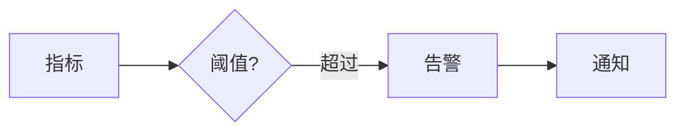
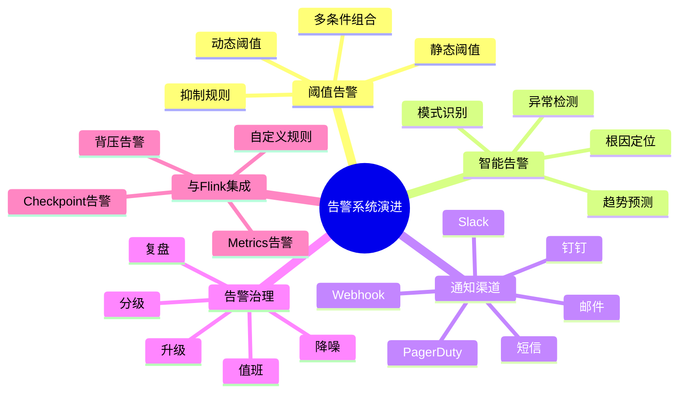
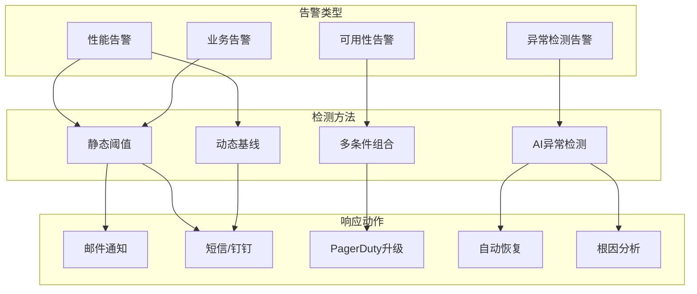
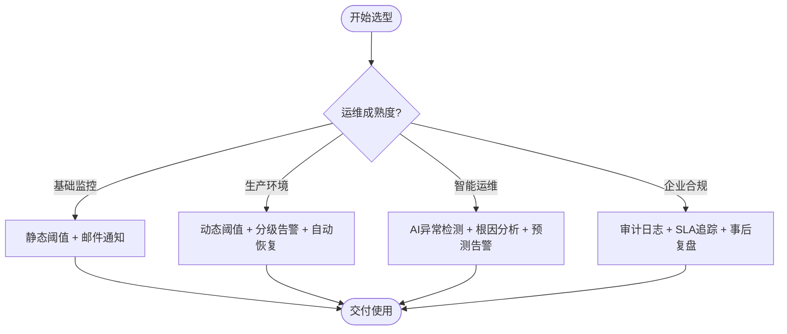

# 告警系统演进 特性跟踪

> 所属阶段: Flink/observability/evolution | 前置依赖: [Alerting][^1] | 形式化等级: L3

## 1. 概念定义 (Definitions)

### Def-F-Alert-01: Alert Rule

告警规则：
$$
\text{Rule} : \text{Condition} \to \text{Notification}
$$

### Def-F-Alert-02: Alert Severity

告警级别：
$$
\text{Severity} \in \{\text{INFO}, \text{WARNING}, \text{CRITICAL}\}
$$

## 2. 属性推导 (Properties)

### Prop-F-Alert-01: Alert Latency

告警延迟：
$$
T_{\text{alert}} < 30s
$$

## 3. 关系建立 (Relations)

### 告警演进

| 版本 | 特性 | 状态 |
|------|------|------|
| 2.4 | 基础告警 | GA |
| 2.5 | AI告警 | GA |
| 3.0 | 智能告警 | 设计中 |

## 4. 论证过程 (Argumentation)

### 4.1 告警渠道

| 渠道 | 类型 |
|------|------|
| 邮件 | 异步 |
| Slack | 实时 |
| PagerDuty | 紧急 |

## 5. 形式证明 / 工程论证

### 5.1 告警规则

```yaml
alerts:
  - name: high_latency
    condition: latency_p99 > 1000
    severity: warning
```

## 6. 实例验证 (Examples)

### 6.1 自定义告警

```java
// [伪代码片段 - 不可直接运行] 仅展示核心逻辑
AlertManager.register(new AlertRule()
    .when(metrics -> metrics.getLatency() > 1000)
    .then(alert -> notifySlack(alert)));
```

## 7. 可视化 (Visualizations)



### 7.1 思维导图：告警系统演进全景



### 7.2 多维关联树：告警类型→检测方法→响应动作



### 7.3 决策树：告警策略选型



## 8. 引用参考 (References)

[^1]: Flink Alerting Documentation

---

## 跟踪信息

| 属性 | 值 |
|------|-----|
| 版本 | 2.4-3.0 |
| 当前状态 | 演进中 |

---

*文档版本: v1.0 | 创建日期: 2026-04-19*
