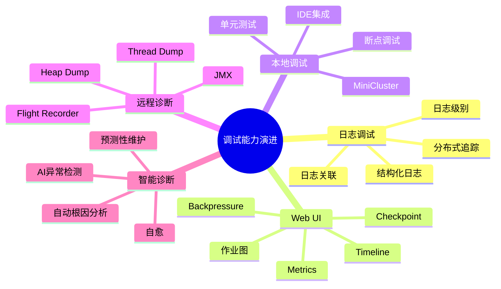
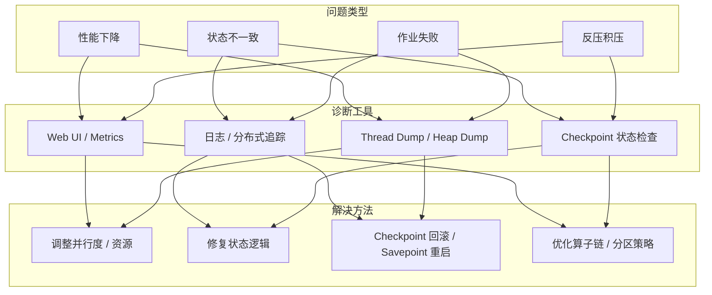
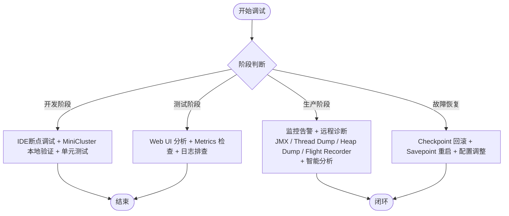

# 调试工具演进 特性跟踪

> 所属阶段: Flink/observability/evolution | 前置依赖: [Debugging][^1] | 形式化等级: L3

## 1. 概念定义 (Definitions)

### Def-F-Debug-01: Local Debugging

本地调试：
$$
\text{Local} : \text{IDE} \leftrightarrow \text{Flink MiniCluster}
$$

### Def-F-Debug-02: Remote Debugging

远程调试：
$$
\text{Remote} : \text{IDE} \leftrightarrow \text{Remote Cluster}
$$

## 2. 属性推导 (Properties)

### Prop-F-Debug-01: Debug Overhead

调试开销：
$$
\text{Overhead}_{\text{debug}} < 10\%
$$

## 3. 关系建立 (Relations)

### 调试演进

| 版本 | 特性 | 状态 |
|------|------|------|
| 2.4 | 本地调试 | GA |
| 2.5 | 远程调试 | GA |
| 3.0 | 分布式调试 | 设计中 |

## 4. 论证过程 (Argumentation)

### 4.1 调试工具

| 工具 | 用途 |
|------|------|
| IDE | 断点调试 |
| JPDA | 远程连接 |
| Flink UI | 状态检查 |

## 5. 形式证明 / 工程论证

### 5.1 调试配置

```bash
-env.java.opts.jobmanager: "-agentlib:jdwp=transport=dt_socket,server=y,suspend=n,address=5005"
```

## 6. 实例验证 (Examples)

### 6.1 IDEA配置

```xml
<configuration>
  <option name="HOST" value="localhost"/>
  <option name="PORT" value="5005"/>
</configuration>
```

## 7. 可视化 (Visualizations)

### 调试连接链路


### 调试能力演进思维导图



### 问题类型-诊断工具-解决方法映射



### 调试策略选型决策树



## 8. 引用参考 (References)

[^1]: Apache Flink Documentation, "Debugging Flink", 2025. https://nightlies.apache.org/flink/flink-docs-stable/docs/ops/debugging/
[^2]: Apache Flink Documentation, "Metrics System", 2025. https://nightlies.apache.org/flink/flink-docs-stable/docs/ops/metrics/
[^3]: Apache Flink Documentation, "Monitoring Checkpointing", 2025. https://nightlies.apache.org/flink/flink-docs-stable/docs/ops/monitoring/checkpoint_monitoring/
[^4]: Apache Flink Documentation, "Local Setup & Debugging", 2025. https://nightlies.apache.org/flink/flink-docs-stable/docs/try-flink/local_installation/

---

## 跟踪信息

| 属性 | 值 |
|------|-----|
| 版本 | 2.4-3.0 |
| 当前状态 | 演进中 |

---

*文档版本: v1.0 | 创建日期: 2026-04-13*
