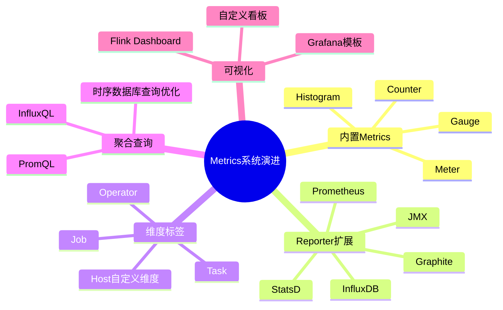
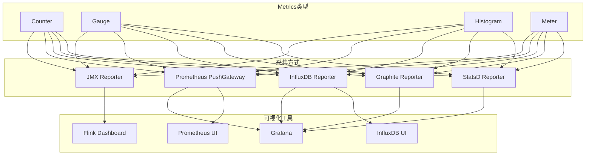
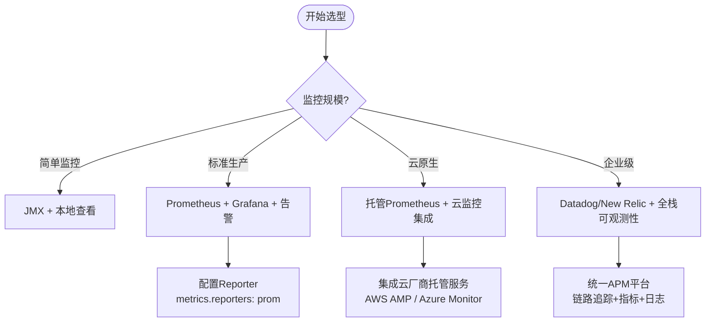

# 指标系统演进 特性跟踪

> 所属阶段: Flink/observability/evolution | 前置依赖: [Metrics][^1] | 形式化等级: L3

## 1. 概念定义 (Definitions)

### Def-F-Metrics-01: Metric Types

指标类型：
$$
\text{Metrics} = \{\text{Counter}, \text{Gauge}, \text{Histogram}, \text{Meter}\}
$$

## 2. 属性推导 (Properties)

### Prop-F-Metrics-01: Cardinality Bound

基数限制：
$$
|\text{TimeSeries}| < 10000
$$

## 3. 关系建立 (Relations)

### 指标演进

| 版本 | 特性 | 状态 |
|------|------|------|
| 2.4 | 新Reporter | GA |
| 2.5 | OpenTelemetry | GA |
| 3.0 | 统一指标 | 设计中 |

## 4. 论证过程 (Argumentation)

### 4.1 指标分类

| 类别 | 示例 |
|------|------|
| 系统 | CPU/内存/IO |
| 作业 | 吞吐量/延迟 |
| 算子 | 水位/积压 |

## 5. 形式证明 / 工程论证

### 5.1 Prometheus导出

```yaml
metrics.reporters: prom
metrics.reporter.prom.port: 9249
```

## 6. 实例验证 (Examples)

### 6.1 自定义指标

```java
// [伪代码片段 - 不可直接运行] 仅展示核心逻辑
getRuntimeContext()
    .getMetricGroup()
    .counter("events_processed")
    .inc();
```

## 7. 可视化 (Visualizations)

以下展示了 Flink Metrics 从采集到可视化的完整链路：


### Metrics 系统演进思维导图



### Metrics 类型→采集方式→可视化工具映射



### Metrics 方案选型决策树



## 8. 引用参考 (References)

[^1]: Flink Metrics Documentation

---

## 跟踪信息

| 属性 | 值 |
|------|-----|
| 版本 | 2.4-3.0 |
| 当前状态 | 演进中 |

---

*文档版本: v1.0 | 创建日期: 2026-04-19*
