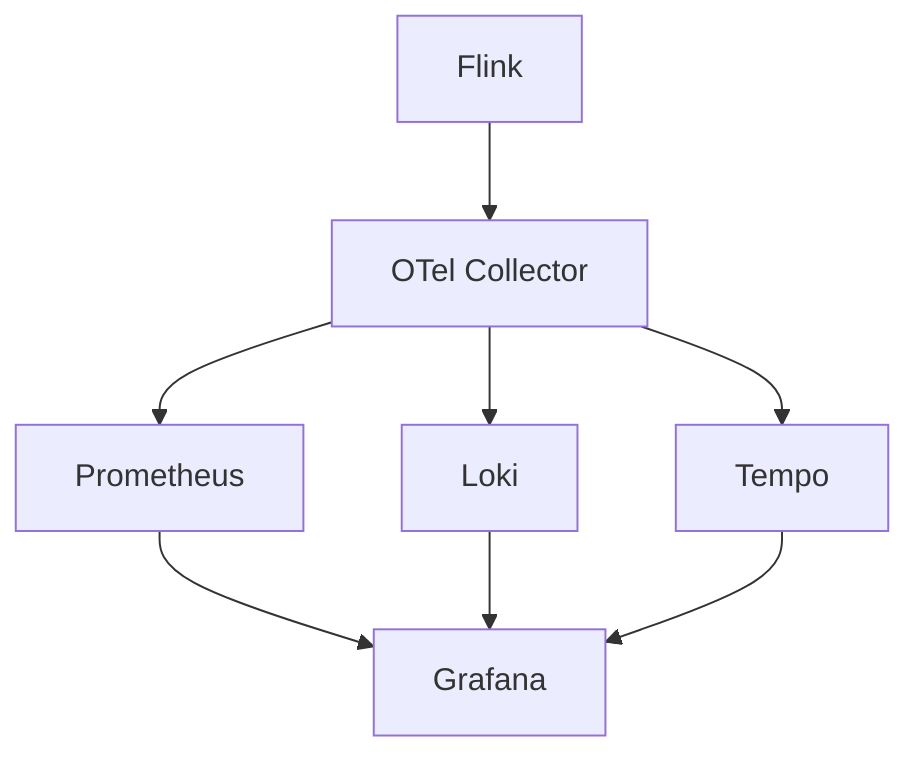

# 可观测性集成演进 特性跟踪

> 所属阶段: Flink/observability/evolution | 前置依赖: [Obs Integration][^1] | 形式化等级: L3

## 1. 概念定义 (Definitions)

### Def-F-Obs-Int-01: Unified Observability

统一可观测性：
$$
\text{Unified} = \text{Metrics} \times \text{Logs} \times \text{Traces}
$$

### Def-F-Obs-Int-02: Correlation

关联：
$$
\text{Correlation} : \text{TraceID} \to \{\text{Metrics}, \text{Logs}\}
$$

## 2. 属性推导 (Properties)

### Prop-F-Obs-Int-01: Data Completeness

数据完整性：
$$
\text{Completeness} > 0.99
$$

## 3. 关系建立 (Relations)

### 集成演进

| 版本 | 特性 | 状态 |
|------|------|------|
| 2.4 | 分离系统 | GA |
| 2.5 | 部分关联 | GA |
| 3.0 | 完全统一 | 设计中 |

## 4. 论证过程 (Argumentation)

### 4.1 集成架构

```
Flink → OTel Collector → Backend (Prometheus/Loki/Tempo)
```

## 5. 形式证明 / 工程论证

### 5.1 OTel Collector配置

```yaml
receivers:
  otlp:
    protocols:
      grpc:
exporters:
  prometheus:
  loki:
```

## 6. 实例验证 (Examples)

### 6.1 关联查询

```sql
-- 通过TraceID关联
SELECT * FROM logs WHERE trace_id = 'xxx'
UNION
SELECT * FROM metrics WHERE trace_id = 'xxx'
```

## 7. 可视化 (Visualizations)



## 8. 引用参考 (References)

[^1]: OpenTelemetry Documentation

---

## 跟踪信息

| 属性 | 值 |
|------|-----|
| 版本 | 2.4-3.0 |
| 当前状态 | 演进中 |

---

*文档版本: v1.0 | 创建日期: 2026-04-13*
