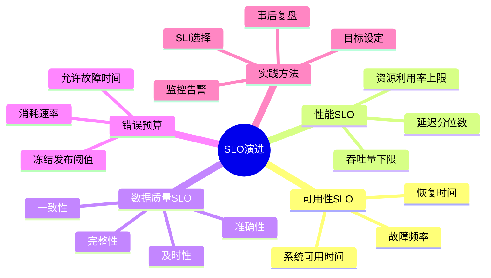
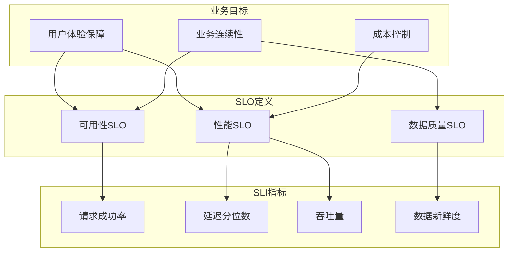
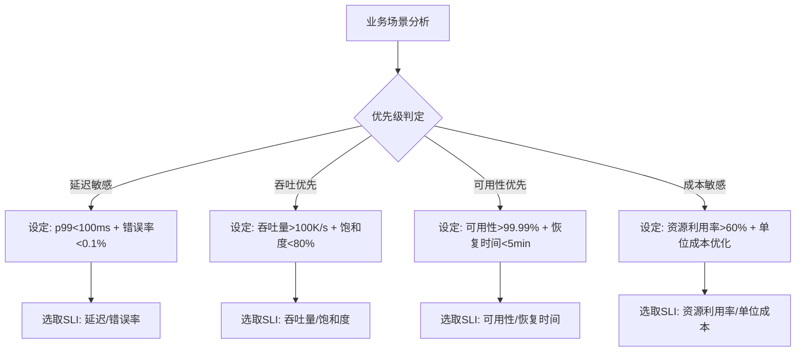

# SLO管理演进 特性跟踪

> 所属阶段: Flink/observability/evolution | 前置依赖: [SLO][^1] | 形式化等级: L3

## 1. 概念定义 (Definitions)

### Def-F-SLO-01: Service Level Objective

服务等级目标：
$$
\text{SLO} = \langle \text{Metric}, \text{Target}, \text{Window} \rangle
$$

### Def-F-SLO-02: Error Budget

错误预算：
$$
\text{Budget} = 1 - \text{SLO}
$$

## 2. 属性推导 (Properties)

### Prop-F-SLO-01: Compliance

合规性：
$$
P(\text{Metric} \leq \text{Target}) \geq \text{SLO}
$$

## 3. 关系建立 (Relations)

### SLO演进

| 版本 | 特性 | 状态 |
|------|------|------|
| 2.4 | 基础SLO | GA |
| 2.5 | 预算管理 | GA |
| 3.0 | 自动SLO | 设计中 |

## 4. 论证过程 (Argumentation)

### 4.1 SLO类型

| SLO | 目标 |
|-----|------|
| 可用性 | 99.9% |
| 延迟 | P99 < 100ms |
| 吞吐量 | > 10K/s |

## 5. 形式证明 / 工程论证

### 5.1 SLO配置

```yaml
slos:
  - name: availability
    target: 0.999
    window: 30d
```

## 6. 实例验证 (Examples)

### 6.1 错误预算

```java
// [伪代码片段 - 不可直接运行] 仅展示核心逻辑
double errorBudget = 1 - slo.getTarget();
boolean burnRate = currentErrors / errorBudget;
```

## 7. 可视化 (Visualizations)


### SLO演进思维导图

SLO演进各维度的放射式思维导图：



### 业务目标-SLO-SLI映射树

从业务目标到SLO定义再到SLI指标的多维映射关系：



### SLO设定策略决策树

根据业务场景优先级选择SLO设定策略的决策流程：



## 8. 引用参考 (References)

[^1]: Google SRE Documentation

---

## 跟踪信息

| 属性 | 值 |
|------|-----|
| 版本 | 2.4-3.0 |
| 当前状态 | 演进中 |

---

*文档版本: v1.0 | 创建日期: 2026-04-19*
