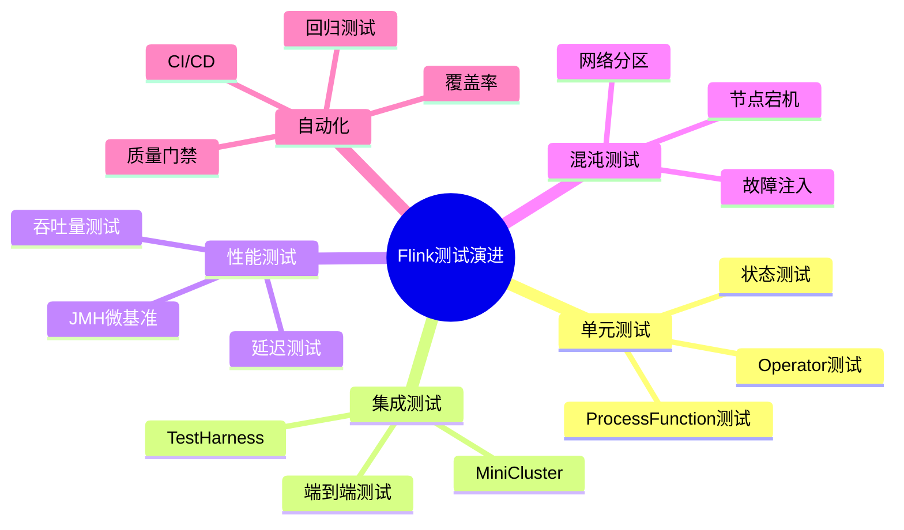
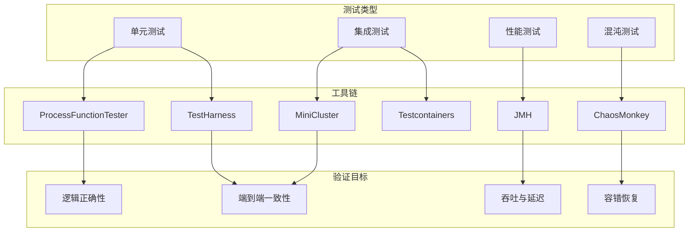
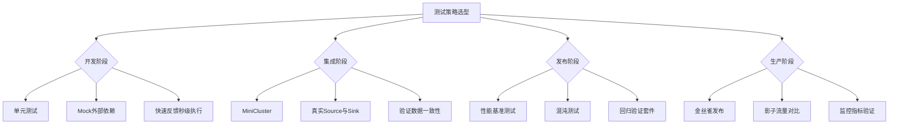

# 测试工具演进 特性跟踪

> 所属阶段: Flink/observability/evolution | 前置依赖: [Testing][^1] | 形式化等级: L3

## 1. 概念定义 (Definitions)

### Def-F-Test-01: Unit Testing

单元测试：
$$
\text{UnitTest} : \text{Operator} \to \text{Assert}
$$

### Def-F-Test-02: Integration Testing

集成测试：
$$
\text{Integration} : \text{Pipeline} \to \text{EndToEnd}
$$

## 2. 属性推导 (Properties)

### Prop-F-Test-01: Determinism

确定性：
$$
\forall \text{run} : \text{Result}_1 = \text{Result}_2
$$

## 3. 关系建立 (Relations)

### 测试演进

| 版本 | 特性 | 状态 |
|------|------|------|
| 2.4 | 测试 harness | GA |
| 2.5 | DataStream测试 | GA |
| 3.0 | 混沌测试 | 设计中 |

## 4. 论证过程 (Argumentation)

### 4.1 测试框架

| 框架 | 用途 |
|------|------|
| JUnit | 单元测试 |
| Testcontainers | 集成测试 |
| Flink Test | 流测试 |

## 5. 形式证明 / 工程论证

### 5.1 DataStream测试

```java
import org.apache.flink.streaming.api.datastream.DataStream;
import org.apache.flink.streaming.api.environment.StreamExecutionEnvironment;

public class Example {
    public static void main(String[] args) throws Exception {

        @Test
        public void testPipeline() throws Exception {
            StreamExecutionEnvironment env =
                StreamExecutionEnvironment.getExecutionEnvironment();
            env.setParallelism(1);

            DataStream<String> stream = env.fromElements("a", "b", "c");
            // 测试逻辑
        }

    }
}
```

## 6. 实例验证 (Examples)

### 6.1 MiniCluster测试

```java
// [伪代码片段 - 不可直接运行] 仅展示核心逻辑
MiniCluster cluster = new MiniCluster(
    new MiniClusterConfiguration.Builder()
        .setNumTaskManagers(1)
        .build());
cluster.start();
```

## 7. 可视化 (Visualizations)

### 7.1 测试执行流程


### 7.2 思维导图：Flink测试演进全景

以下思维导图以"Flink测试演进"为中心，放射展开五大测试维度及其子领域。



### 7.3 多维关联树：测试类型→工具链→验证目标

以下层次图展示测试类型到工具链再到验证目标的完整映射关系。



### 7.4 决策树：测试策略选型

以下决策树按软件生命周期阶段给出测试策略建议，覆盖开发、集成、发布与生产四个关键节点。



## 8. 引用参考 (References)

[^1]: Apache Flink Documentation, "Testing", 2025. <https://nightlies.apache.org/flink/flink-docs-stable/docs/dev/datastream/testing/>

---

## 跟踪信息

| 属性 | 值 |
|------|-----|
| 版本 | 2.4-3.0 |
| 当前状态 | 演进中 |

---

*文档版本: v1.0 | 创建日期: 2026-04-19*
