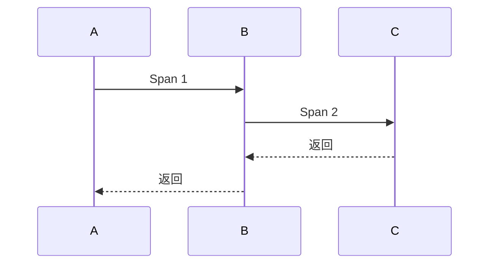
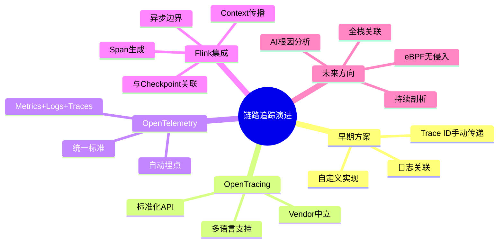
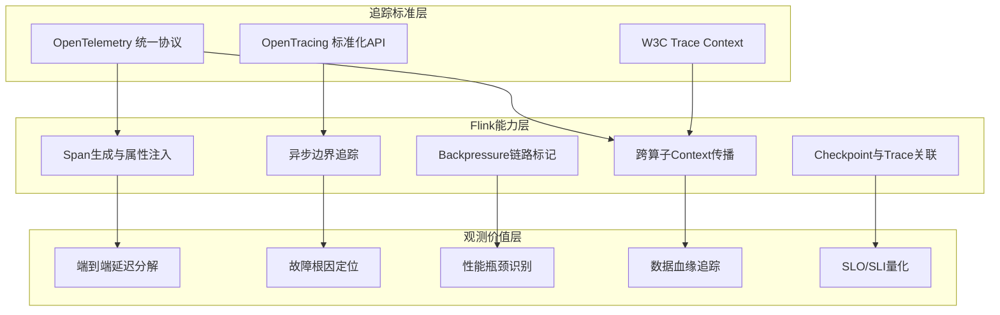
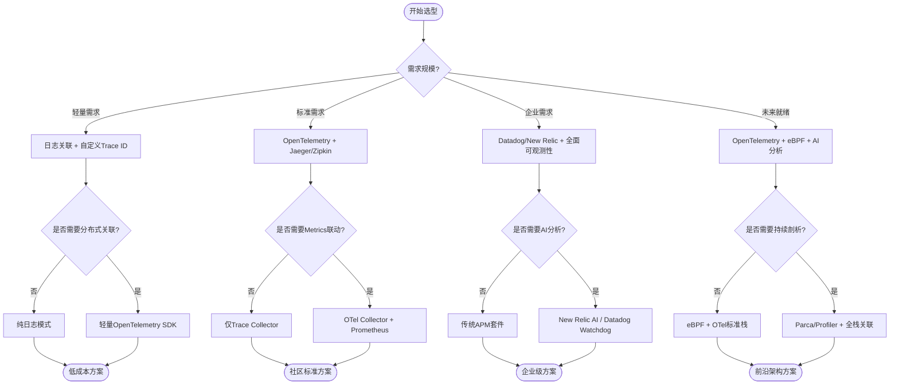

# 追踪系统演进 特性跟踪

> 所属阶段: Flink/observability/evolution | 前置依赖: [Tracing][^1] | 形式化等级: L3

## 1. 概念定义 (Definitions)

### Def-F-Tracing-01: Distributed Tracing

分布式追踪：
$$
\text{Trace} = \{ \text{Span}_1, \text{Span}_2, ... \}
$$

### Def-F-Tracing-02: OpenTelemetry

OpenTelemetry标准：
$$
\text{OTel} = \text{Trace} + \text{Metrics} + \text{Logs}
$$

## 2. 属性推导 (Properties)

### Prop-F-Tracing-01: Sampling Rate

采样率：
$$
P(\text{sample}) = r
$$

## 3. 关系建立 (Relations)

### 追踪演进

| 版本 | 特性 | 状态 |
|------|------|------|
| 2.4 | OpenTracing | GA |
| 2.5 | OpenTelemetry | GA |
| 3.0 | 原生追踪 | 设计中 |

## 4. 论证过程 (Argumentation)

### 4.1 追踪系统

| 系统 | 协议 |
|------|------|
| Jaeger | OpenTelemetry |
| Zipkin | OpenTelemetry |
| Tempo | OpenTelemetry |

## 5. 形式证明 / 工程论证

### 5.1 OTel配置

```yaml
tracing.exporter: otlp
tracing.otlp.endpoint: http://otel-collector:4317
```

## 6. 实例验证 (Examples)

### 6.1 自定义Span

```java
// [伪代码片段 - 不可直接运行] 仅展示核心逻辑
Span span = tracer.spanBuilder("process").startSpan();
try (Scope scope = span.makeCurrent()) {
    // 处理逻辑
} finally {
    span.end();
}
```

## 7. 可视化 (Visualizations)

### 7.1 Span 调用序列



### 7.2 链路追踪演进思维导图

以下思维导图以"链路追踪演进"为中心，放射展示从早期方案到未来方向的完整脉络。



### 7.3 追踪标准→Flink能力→观测价值映射

以下关联树展示追踪标准如何映射为 Flink 具体能力，并转化为实际观测价值。



### 7.4 追踪方案选型决策树

以下决策树指导不同需求场景下的追踪方案选型，从轻量需求到未来就绪架构。



## 8. 引用参考 (References)

[^1]: OpenTelemetry Documentation, "What is OpenTelemetry?", 2025. <https://opentelemetry.io/docs/>

---

## 跟踪信息

| 属性 | 值 |
|------|-----|
| 版本 | 2.4-3.0 |
| 当前状态 | 演进中 |

---

*文档版本: v1.0 | 创建日期: 2026-04-19*
