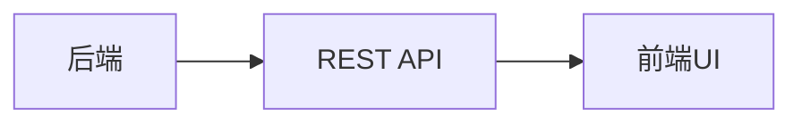
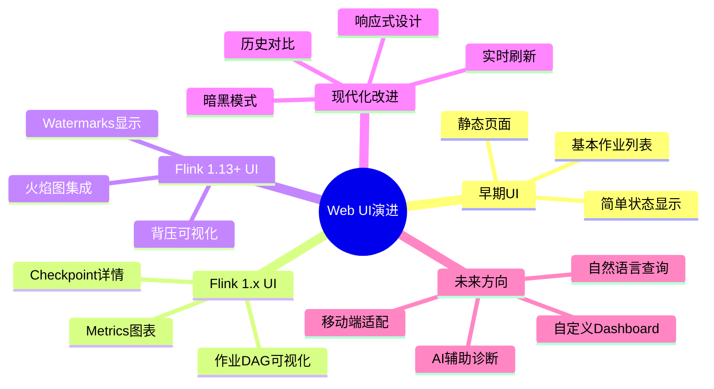
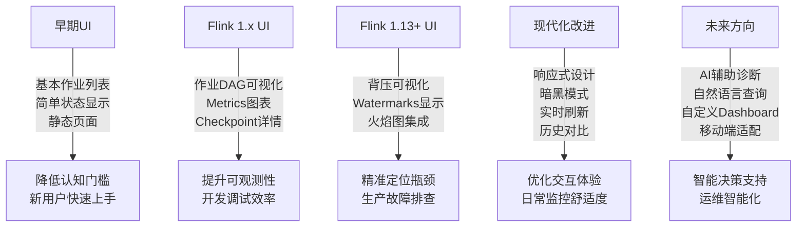
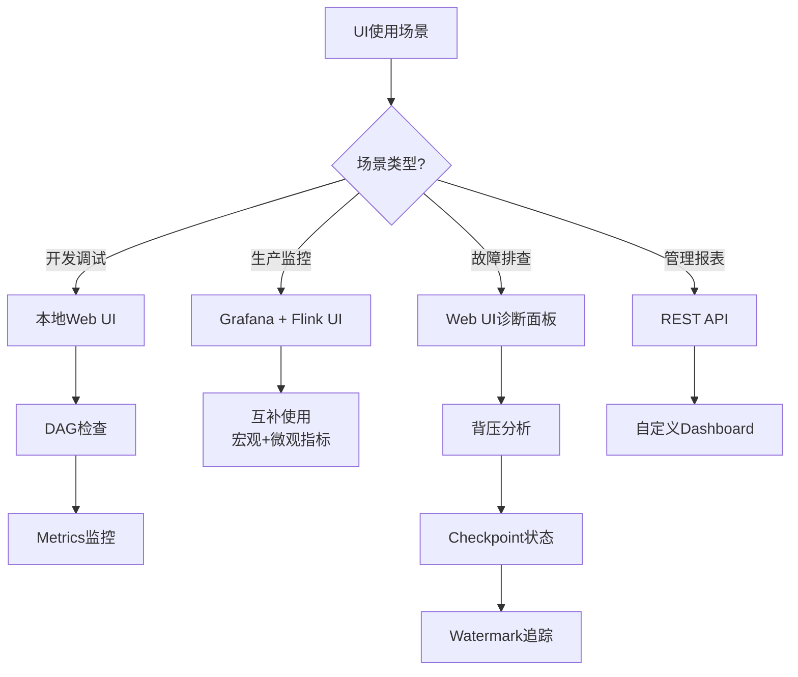

# Web UI 演进 特性跟踪

> 所属阶段: Flink/observability/evolution | 前置依赖: [Web UI][^1] | 形式化等级: L3

## 1. 概念定义 (Definitions)

### Def-F-UI-01: Real-time Dashboard

实时仪表板：
$$
\text{Dashboard} : \text{Metrics} \xrightarrow{\text{real-time}} \text{Visualization}
$$

## 2. 属性推导 (Properties)

### Prop-F-UI-01: Refresh Rate

刷新率：
$$
T_{\text{refresh}} < 5s
$$

## 3. 关系建立 (Relations)

### UI演进

| 版本 | 特性 | 状态 |
|------|------|------|
| 2.4 | 新UI框架 | GA |
| 2.5 | 实时流图 | GA |
| 3.0 | 统一控制台 | 设计中 |

## 4. 论证过程 (Argumentation)

### 4.1 UI功能

| 功能 | 描述 |
|------|------|
| 作业概览 | 整体状态 |
| 算子详情 | 单个算子 |
| Checkpoint | 进度追踪 |
| 背压分析 | 热力图 |

## 5. 形式证明 / 工程论证

### 5.1 REST API

```java
// [伪代码片段 - 不可直接运行] 仅展示核心逻辑
GET /jobs/{jobid}/vertices
GET /jobs/{jobid}/metrics
```

## 6. 实例验证 (Examples)

### 6.1 自定义视图

```javascript
// Web UI扩展
const customView = {
  metrics: ['latency', 'throughput'],
  refresh: 5000
};
```

## 7. 可视化 (Visualizations)



### Web UI 演进思维导图

以下思维导图以"Web UI演进"为中心，放射展开各阶段关键特性。



### UI版本到用户价值映射

以下关联树展示不同UI版本的核心特性及其为用户带来的价值。



### UI使用场景决策树

以下决策树展示不同使用场景下的UI选择与操作路径。



## 8. 引用参考 (References)

[^1]: Flink Web UI Documentation

---

## 跟踪信息

| 属性 | 值 |
|------|-----|
| 版本 | 2.4-3.0 |
| 当前状态 | 演进中 |

---

*文档版本: v1.0 | 创建日期: 2026-04-19*
