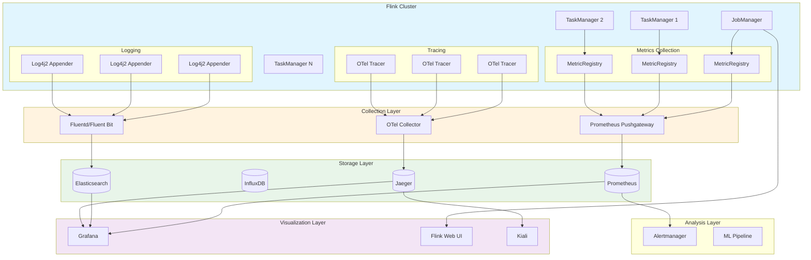
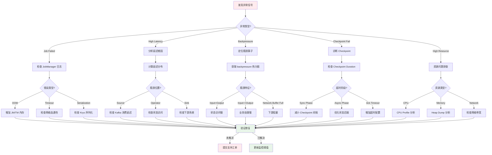
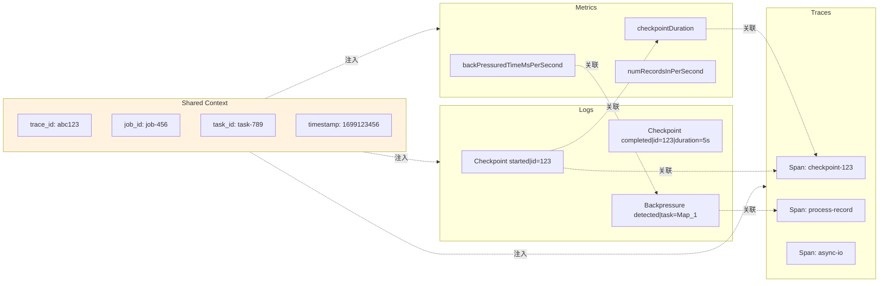
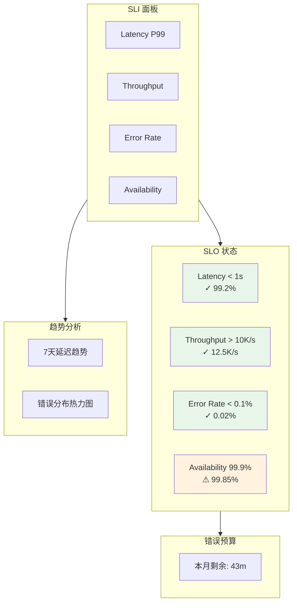
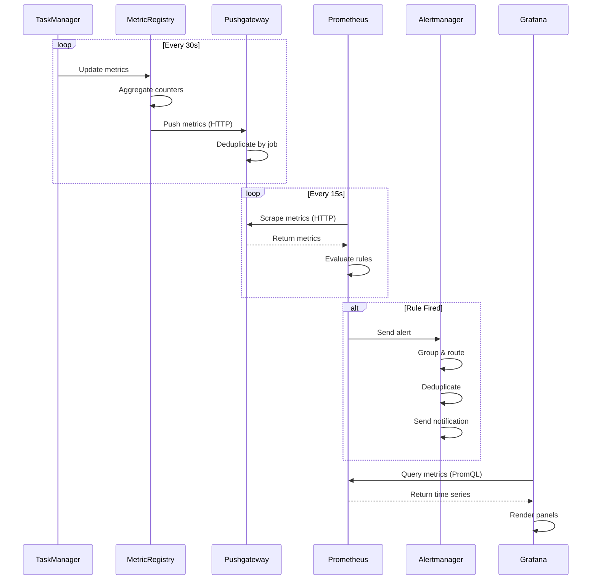

# Flink 监控与可观测性完整指南

> 所属阶段: Flink/ | 前置依赖: [metrics-and-monitoring.md](./metrics-and-monitoring.md), [flink-opentelemetry-observability.md](./flink-opentelemetry-observability.md), [streaming-metrics-monitoring-slo.md](./streaming-metrics-monitoring-slo.md) | 形式化等级: L4

---

## 1. 概念定义 (Definitions)

### Def-F-15-50: 可观测性体系架构

Flink 可观测性体系定义为五层架构模型 $\mathcal{O}_{flink}$：

$$\mathcal{O}_{flink} = \langle \mathcal{L}_{collection}, \mathcal{L}_{transmission}, \mathcal{L}_{storage}, \mathcal{L}_{analysis}, \mathcal{L}_{visualization} \rangle$$

| 层级 | 组件 | 职责 |
|------|------|------|
| **采集层** $\mathcal{L}_{collection}$ | Metrics Reporter, Log Appender, Tracer | 原始信号生成与采集 |
| **传输层** $\mathcal{L}_{transmission}$ | Pushgateway, OTel Collector, Fluentd | 数据聚合与路由转发 |
| **存储层** $\mathcal{L}_{storage}$ | Prometheus, InfluxDB, Elasticsearch, Jaeger | 时序数据持久化存储 |
| **分析层** $\mathcal{L}_{analysis}$ | Alertmanager, Grafana, ML Pipeline | 异常检测与根因分析 |
| **展示层** $\mathcal{L}_{visualization}$ | Grafana Dashboards, Flink Web UI | 人机交互界面 |

### Def-F-15-51: 指标类型分类体系

Flink 指标系统 $\mathcal{M}$ 按语义类型分为四类：

$$\mathcal{M} = \mathcal{M}_{counter} \cup \mathcal{M}_{gauge} \cup \mathcal{M}_{histogram} \cup \mathcal{M}_{meter}$$

**Def-F-15-51a: 计数器 (Counter)**

$$M_{counter}: \mathcal{T} \rightarrow \mathbb{N}, \quad \text{单调递增，可重置}$$

典型指标：`numRecordsInTotal`, `numFailedCheckpoints`

**Def-F-15-51b: 仪表盘 (Gauge)**

$$M_{gauge}: \mathcal{T} \rightarrow \mathbb{R}, \quad \text{任意变化}$$

典型指标：`heapMemoryUsed`, `checkpointDuration`, `numRecordsInPerSecond`

**Def-F-15-51c: 直方图 (Histogram)**

$$M_{histogram}: \mathcal{T} \times \mathcal{B} \rightarrow \mathbb{N}, \quad \mathcal{B} = \{b_1, b_2, ..., b_n\}$$

典型指标：`latencyHistogram`, `checkpointSizeDistribution`

**Def-F-15-51d: 计量器 (Meter)**

$$M_{meter}: \mathcal{T} \rightarrow \mathbb{R}^+, \quad \text{速率计算}$$

典型指标：`recordsInPerSecond`, `bytesOutPerSecond`

### Def-F-15-52: 指标作用域层级

Flink 指标按作用域 $\mathcal{S}$ 分层，形成层级命名空间：

$$\mathcal{S} = \{ \mathcal{S}_{cluster}, \mathcal{S}_{jobmanager}, \mathcal{S}_{taskmanager}, \mathcal{S}_{job}, \mathcal{S}_{task}, \mathcal{S}_{operator} \}$$

**命名空间规范**:

```
<hostname>.jobmanager.<metric_name>
<hostname>.taskmanager.<tm_id>.<job_name>.<operator_name>.<subtask_index>.<metric_name>
```

**完整指标标识符**:

$$ID_{metric} = \langle scope, name, dimensions \rangle$$

其中 $dimensions$ 为标签键值对集合，用于多维分析。

### Def-F-15-53: 日志事件模型

Flink 日志系统 $\mathcal{L}$ 定义结构化日志事件：

$$\mathcal{L} = \{ (t, l, c, m, k, v, ctx) \}$$

| 字段 | 类型 | 描述 |
|------|------|------|
| $t$ | Timestamp | 事件发生时间戳 |
| $l$ | Level | 日志级别 (TRACE, DEBUG, INFO, WARN, ERROR) |
| $c$ | Class | 发出日志的类名 |
| $m$ | Message | 日志消息内容 |
| $k$ | Logger | Logger 名称 |
| $v$ | Thread | 线程名称 |
| $ctx$ | Context | MDC 上下文 (TraceID, JobID, TaskID) |

### Def-F-15-54: 分布式追踪语义

Flink 流处理追踪模型 $\mathcal{T}_{flink}$ 扩展标准 OpenTelemetry：

$$\mathcal{T}_{flink} = \langle S_{source}, S_{operator}, S_{sink}, S_{checkpoint}, S_{watermark} \rangle$$

**Span 类型定义**:

| Span 类型 | 语义 | 属性集合 |
|-----------|------|----------|
| $S_{source}$ | 数据源读取 | `record.count`, `source.name`, `split.id` |
| $S_{operator}$ | 算子处理 | `operator.name`, `subtask.index`, `records.processed` |
| $S_{sink}$ | 数据写出 | `sink.name`, `records.written`, `write.latency` |
| $S_{checkpoint}$ | Checkpoint 生命周期 | `checkpoint.id`, `checkpoint.type`, `duration` |
| $S_{watermark}$ | Watermark 传播 | `watermark.value`, `triggered.windows` |

### Def-F-15-55: 告警规则模型

告警规则 $\mathcal{A}$ 定义为条件-动作映射：

$$\mathcal{A} = \langle \mathcal{C}_{condition}, \mathcal{C}_{duration}, \mathcal{A}_{action}, \mathcal{P}_{priority} \rangle$$

**条件表达式**:

$$\mathcal{C}_{condition}: \mathbb{M} \times \mathcal{T} \rightarrow \{0, 1\}$$

**告警状态机**:

```
Inactive --[condition=true]--> Pending --[duration>for]--> Firing
    ↑                              |
    └----------[condition=false]---┘
```

### Def-F-15-56: SLO/SLI 形式化定义

**服务级别指标 (SLI)**:

$$SLI: \mathcal{M}_{window} \rightarrow \mathbb{R}$$

其中 $\mathcal{M}_{window}$ 为滑动窗口内指标集合，窗口大小为 $w$。

**服务级别目标 (SLO)**:

$$SLO := P(SLI \geq threshold) \geq target$$

**错误预算 (Error Budget)**:

$$EB = (1 - target) \times window$$

---

## 2. 属性推导 (Properties)

### Prop-F-15-50: 指标完备性原理

**命题**: Flink 内置指标系统覆盖所有关键运行维度。

$$\forall d \in \{throughput, latency, reliability, resource, state\}, \exists \mathcal{M}_d \subset \mathcal{M}_{flink}$$

**证明概要**:

| 维度 | 指标子集 | 完备性验证 |
|------|----------|------------|
| 吞吐 | `numRecordsIn/OutPerSecond` | 每条记录进出均计数 |
| 延迟 | `currentOutputWatermark`, `latency` markers | Watermark 驱动延迟计算 |
| 可靠性 | `checkpointDuration`, `numFailedCheckpoints` | Checkpoint 全流程监控 |
| 资源 | `Memory/CPU/Network` 指标 | JVM 与系统级指标全覆盖 |
| 状态 | `stateSize`, `stateAccessLatency` | 状态后端内置统计 |

### Prop-F-15-51: 日志-指标-追踪关联性

**命题**: 通过统一 Context 实现三类信号强关联。

$$\forall l \in \mathcal{L}, m \in \mathcal{M}, t \in \mathcal{T}: \text{trace_id}(l) = \text{trace_id}(t) \land \text{timestamp}(l) \approx \text{timestamp}(m)$$

**关联机制**:

1. **Trace Context 传播**: 通过 MDC 将 TraceID 注入日志
2. **时间戳对齐**: 统一使用处理时间或事件时间
3. **资源属性**: 共享 `service.name`, `host.name`, `task.id` 等标签

### Prop-F-15-52: 背压传播链

**命题**: 背压信号沿拓扑反向传播，可通过指标定位瓶颈算子。

$$backpressure(Op_i) = \text{true} \Rightarrow \exists Op_j \in downstream(Op_i): bottleneck(Op_j)$$

**检测路径**:

```
Source → Op1 → Op2 → [Bottleneck Op3] → Op4 → Sink
  ↑                                          ↓
  └──────── Backpressure ────────────────────┘
```

**指标特征**:

- 瓶颈算子: `numRecordsInPerSecond` >> `numRecordsOutPerSecond`
- 上游算子: `backPressuredTimeMsPerSecond` > 0

### Prop-F-15-53: Checkpoint 延迟上界

**命题**: Checkpoint 完成时间与状态大小成正比，与资源可用性成反比。

$$T_{checkpoint} \leq \frac{|State|}{B_{network}} + T_{sync} + T_{async}$$

其中 $|State|$ 为状态大小，$B_{network}$ 为网络带宽，$T_{sync}$ 和 $T_{async}$ 为同步与异步阶段开销。

---

## 3. 关系建立 (Relations)

### 指标系统与外部系统集成矩阵

| 外部系统 | 集成方式 | 指标类型支持 | 适用场景 |
|----------|----------|--------------|----------|
| **Prometheus** | Pushgateway / HTTP Endpoint | Counter, Gauge, Histogram | 云原生监控标准 |
| **InfluxDB** | HTTP API / UDP | 全类型 | 高性能时序存储 |
| **StatsD** | UDP 协议 | Counter, Gauge, Timer | 轻量级聚合 |
| **JMX** | MBean 暴露 | 全类型 | Java 生态集成 |
| **Datadog** | Agent 集成 | 全类型 | 企业级 APM |
| **CloudWatch** | AWS SDK | 全类型 | AWS 云服务 |

### 日志聚合系统对比

| 系统 | 架构 | 查询语言 | 存储引擎 | 适用规模 |
|------|------|----------|----------|----------|
| **ELK** | 集中式 | Lucene Query DSL | Elasticsearch | 企业级 |
| **Fluentd+Loki** | 云原生 | LogQL | Object Storage | Kubernetes |
| **Grafana Cloud** | SaaS | LogQL | Cortex/Grafana | 中小规模 |

### 分布式追踪系统集成

```
Flink Job
    │
    ├── OpenTelemetry Agent ──► OTel Collector ──┬─► Jaeger
    │                                            ├─► Zipkin
    │                                            ├─► Tempo
    │                                            └─► OTLP Backend
    │
    └── Custom Tracer ────────► Direct Export ───► APM Vendor
```

### Web UI 与指标系统映射

| Web UI 页面 | 指标来源 | 刷新频率 | 数据精度 |
|-------------|----------|----------|----------|
| Job Overview | JobManager REST API | 实时 | 秒级 |
| Task Metrics | TaskManager Metrics | 5秒 | 秒级 |
| Checkpoint Stats | Checkpoint Coordinator | 事件驱动 | 精确 |
| Backpressure | Thread Stack Sampling | 10秒 | 估算 |
| Flame Graph | Async Profiler | 手动触发 | 采样 |

---

## 4. 论证过程 (Argumentation)

### 4.1 指标采集策略权衡

**Pull vs Push 模式比较**:

| 维度 | Pull (Prometheus) | Push (InfluxDB) |
|------|-------------------|-----------------|
| 发现机制 | 服务发现 / 静态配置 | 客户端主动推送 |
| 网络拓扑 | 服务端需访问客户端 | 客户端需访问服务端 |
| 防火墙友好性 | 需开放端口 | 只需出站连接 |
| 短期任务支持 | 需 Pushgateway | 原生支持 |
| 多副本场景 | 需外部协调 | 天然去重 |

**Flink 推荐配置**:

- 长期运行集群: Prometheus Pull 模式
- 动态/K8s 环境: Pushgateway 或 InfluxDB Push
- 多租户场景: 独立命名空间 + 标签区分

### 4.2 采样率决策模型

完整追踪在流系统中成本过高，需采样策略：

$$SamplingRate = \min(1, \frac{C_{budget}}{R_{throughput} \times C_{per\_trace}})$$

其中 $C_{budget}$ 为可接受追踪开销，$R_{throughput}$ 为吞吐量，$C_{per\_trace}$ 为单追踪成本。

**自适应采样算法**:

```
if (throughput > HIGH_THRESHOLD) {
    rate = BASE_RATE / (throughput / BASE_THROUGHPUT);
} else if (error_rate > ERROR_THRESHOLD) {
    rate = 1.0;  // 全量采样异常
} else {
    rate = BASE_RATE;
}
```

### 4.3 告警阈值设定方法论

**基线法 (Baseline Method)**:

$$Threshold = \mu_{historical} + k \times \sigma_{historical}$$

**百分位法 (Percentile Method)**:

$$Threshold = P_{99.9}(historical\_data)$$

**业务 SLA 法**:

$$Threshold = SLA_{target} \times safety\_factor$$

---

## 5. 形式证明 / 工程论证 (Proof / Engineering Argument)

### Thm-F-15-50: 端到端可观测性完备性定理

**定理**: 若 Flink 集群同时配置 Metrics、Logging、Tracing 三类可观测信号，并通过统一 Resource 标签关联，则该系统满足端到端可观测性完备性。

**证明**:

1. **信号覆盖完备性**:
   $$\mathcal{M}_{flink} \supseteq \{m_{checkpoint}, m_{latency}, m_{throughput}, m_{resource}, m_{state}\}$$
   Flink 内置指标覆盖所有关键运行维度。

2. **日志完备性**:
   $$\forall e \in \{start, stop, fail, configure\}, \exists l \in \mathcal{L}: event(l) = e$$
   关键生命周期事件均有结构化日志记录。

3. **追踪完备性**:
   $$\forall path \in \mathcal{P}_{dataflow}, \exists trace \in \mathcal{T}: coverage(trace, path) \geq \theta$$
   采样策略保证关键路径覆盖。

4. **关联完备性**:
   $$\forall s \in \mathcal{S}, \exists (m, l, t): resource(m) = resource(l) = resource(t) = s$$
   统一 Resource 标签实现信号关联。

∎

### Thm-F-15-51: 背压根因定位定理

**定理**: 通过分析算子级指标的数学关系，可在 $O(n)$ 时间内定位背压根因算子，其中 $n$ 为算子数量。

**证明**:

定义算子 $Op_i$ 的吞吐比 $\rho_i$:

$$\rho_i = \frac{numRecordsOutPerSecond_i}{numRecordsInPerSecond_i}$$

**性质**:

- 若 $\rho_i < 1$: 算子为背压源或瓶颈
- 若 $\rho_i \approx 1$: 算子正常处理
- 若 $\rho_i > 1$ (突发): 可能存在窗口触发或缓冲释放

**算法**:

1. 从 Source 开始遍历拓扑
2. 找到第一个满足 $\rho_i < threshold$ 的算子
3. 验证该算子 `backPressuredTimeMsPerSecond` > 0
4. 该算子即为瓶颈

时间复杂度为 $O(n)$，因为只需一次遍历。

∎

### Thm-F-15-52: Checkpoint 超时检测完备性

**定理**: 基于 `checkpointDuration` 和 `checkpointStartDelay` 两指标的监控策略，可检测所有 Checkpoint 超时场景。

**证明**:

Checkpoint 超时场景分类:

1. **同步阶段超时**: 触发 `checkpointDuration` 告警
2. **异步阶段超时**: 触发 `checkpointDuration` 告警
3. **确认阶段超时**: `checkpointStartDelay` 突增 + `checkpointDuration` 正常
4. **协调器故障**: `numberOfPendingCheckpoints` 持续非零

完备性验证:

$$\forall timeout\_scenario \in \mathcal{T}, \exists (m_1, m_2, cond): cond(m_1, m_2) = true$$

其中 $\mathcal{T}$ 为所有超时场景集合，$m_1 = checkpointDuration$, $m_2 = checkpointStartDelay$。

∎

---

## 6. 实例验证 (Examples)

### 6.1 指标系统配置

#### Prometheus 集成配置

**flink-conf.yaml**:

```yaml
# Prometheus Reporter 配置 metrics.reporters: promgateway
metrics.reporter.promgateway.class: org.apache.flink.metrics.prometheus.PrometheusPushGatewayReporter
metrics.reporter.promgateway.host: prometheus-pushgateway.monitoring.svc.cluster.local
metrics.reporter.promgateway.port: 9091
metrics.reporter.promgateway.jobName: flink-job-${JOB_NAME}
metrics.reporter.promgateway.randomJobNameSuffix: true
metrics.reporter.promgateway.deleteOnShutdown: false
metrics.reporter.promgateway.interval: 30 SECONDS

# 作用域配置 metrics.scope.jm: "<host>.jobmanager"
metrics.scope.jm.job: "<host>.jobmanager.<job_name>"
metrics.scope.tm: "<host>.taskmanager.<tm_id>"
metrics.scope.tm.job: "<host>.taskmanager.<tm_id>.<job_name>"
metrics.scope.task: "<host>.taskmanager.<tm_id>.<job_name>.<task_name>.<subtask_index>"
metrics.scope.operator: "<host>.taskmanager.<tm_id>.<job_name>.<operator_name>.<subtask_index>"
```

#### InfluxDB 集成配置

```yaml
metrics.reporters: influxdb
metrics.reporter.influxdb.class: org.apache.flink.metrics.influxdb.InfluxdbReporter
metrics.reporter.influxdb.host: influxdb.monitoring.svc.cluster.local
metrics.reporter.influxdb.port: 8086
metrics.reporter.influxdb.db: flink_metrics
metrics.reporter.influxdb.username: flink
metrics.reporter.influxdb.password: ${INFLUXDB_PASSWORD}
metrics.reporter.influxdb.interval: 60 SECONDS
metrics.reporter.influxdb.consistency: ANY
```

#### JMX 集成配置

```yaml
metrics.reporters: jmx
metrics.reporter.jmx.class: org.apache.flink.metrics.jmx.JMXReporter
metrics.reporter.jmx.port: 9020-9030
```

### 6.2 自定义指标开发

```java
import org.apache.flink.api.common.functions.RichMapFunction;
import org.apache.flink.configuration.Configuration;
import org.apache.flink.metrics.Counter;
import org.apache.flink.metrics.Histogram;
import org.apache.flink.metrics.Meter;
import org.apache.flink.metrics.SimpleCounter;
import org.apache.flink.runtime.metrics.DescriptiveStatisticsHistogram;

public class InstrumentedMapFunction<T, R> extends RichMapFunction<T, R> {

    private transient Counter eventCounter;
    private transient Counter errorCounter;
    private transient Histogram processingTimeHistogram;
    private transient Meter throughputMeter;

    @Override
    public void open(Configuration parameters) {
        // 获取指标组
        org.apache.flink.metrics.MetricGroup operatorMetrics =
            getRuntimeContext().getMetricGroup();

        // 业务指标组
        org.apache.flink.metrics.MetricGroup businessMetrics =
            operatorMetrics.addGroup("business");

        // 计数器 - 总事件数
        eventCounter = businessMetrics.counter("eventsTotal", new SimpleCounter());

        // 计数器 - 错误数
        errorCounter = businessMetrics.counter("errorsTotal");

        // 直方图 - 处理延迟分布 (保留1000个样本)
        processingTimeHistogram = businessMetrics.histogram(
            "processingTimeMs",
            new DescriptiveStatisticsHistogram(1000)
        );

        // 计量器 - 吞吐量 (自动计算每秒速率)
        throughputMeter = businessMetrics.meter(
            "throughputPerSecond",
            new org.apache.flink.metrics.MeterView(eventCounter, 60)
        );
    }

    @Override
    public R map(T value) throws Exception {
        long startTime = System.currentTimeMillis();

        try {
            // 业务处理
            R result = processBusinessLogic(value);

            // 记录成功
            eventCounter.inc();

            return result;

        } catch (Exception e) {
            // 记录错误
            errorCounter.inc();

            // 记录错误类型分布
            getRuntimeContext().getMetricGroup()
                .addGroup("errorType", e.getClass().getSimpleName())
                .counter("count").inc();

            throw e;

        } finally {
            // 记录处理时间
            long duration = System.currentTimeMillis() - startTime;
            processingTimeHistogram.update(duration);
        }
    }

    private R processBusinessLogic(T value) {
        // 业务处理逻辑
        return null;
    }
}
```

### 6.3 日志系统配置

#### Log4j2 结构化日志配置

**log4j2.properties**:

```properties
# 根日志级别 rootLogger.level = INFO
rootLogger.appenderRef.console.ref = ConsoleAppender
rootLogger.appenderRef.rolling.ref = RollingFileAppender

# 控制台输出 - JSON 格式 appender.console.type = Console
appender.console.name = ConsoleAppender
appender.console.layout.type = JsonTemplateLayout
appender.console.layout.eventTemplateUri = classpath:LogstashJsonEventLayoutV1.json

# 滚动文件配置 appender.rolling.type = RollingFile
appender.rolling.name = RollingFileAppender
appender.rolling.fileName = ${sys:log.file}
appender.rolling.filePattern = ${sys:log.file}.%i
appender.rolling.layout.type = JsonTemplateLayout
appender.rolling.layout.eventTemplateUri = classpath:LogstashJsonEventLayoutV1.json
appender.rolling.policies.type = Policies
appender.rolling.policies.size.type = SizeBasedTriggeringPolicy
appender.rolling.policies.size.size = 100MB
appender.rolling.strategy.type = DefaultRolloverStrategy
appender.rolling.strategy.max = 10

# Flink 特定 Logger logger.flink.name = org.apache.flink
logger.flink.level = INFO

# Checkpoint 详细日志 logger.checkpoint.name = org.apache.flink.runtime.checkpoint
logger.checkpoint.level = DEBUG

# 网络层日志 logger.network.name = org.apache.flink.runtime.io.network
logger.network.level = WARN
```

#### MDC 上下文配置

```java
import org.apache.flink.api.common.functions.RichFunction;
import org.apache.flink.api.common.functions.RuntimeContext;
import org.slf4j.MDC;

public class MDCContextEnricher {

    public static void setupContext(RuntimeContext ctx) {
        // 添加任务上下文到 MDC
        MDC.put("jobId", ctx.getJobId().toHexString());
        MDC.put("jobName", ctx.getJobName());
        MDC.put("taskName", ctx.getTaskName());
        MDC.put("subtaskIndex", String.valueOf(ctx.getIndexOfThisSubtask()));
        MDC.put("parallelism", String.valueOf(ctx.getNumberOfParallelSubtasks()));
        MDC.put("attemptNumber", String.valueOf(ctx.getAttemptNumber()));

        // 添加追踪上下文 (如果可用)
        String traceId = TraceContext.getCurrentTraceId();
        if (traceId != null) {
            MDC.put("traceId", traceId);
            MDC.put("spanId", TraceContext.getCurrentSpanId());
        }
    }

    public static void clearContext() {
        MDC.clear();
    }
}

// 在算子中使用
public class ContextualMapFunction<T, R> extends RichMapFunction<T, R> {

    @Override
    public void open(Configuration parameters) {
        MDCContextEnricher.setupContext(getRuntimeContext());
    }

    @Override
    public R map(T value) {
        // 所有日志自动包含 MDC 上下文
        LOG.info("Processing record: {}", value);
        return process(value);
    }

    @Override
    public void close() {
        MDCContextEnricher.clearContext();
    }
}
```

### 6.4 分布式追踪集成

#### OpenTelemetry 自动埋点

**pom.xml 依赖**:

```xml
<dependency>
    <groupId>io.opentelemetry</groupId>
    <artifactId>opentelemetry-api</artifactId>
    <version>1.35.0</version>
</dependency>
<dependency>
    <groupId>io.opentelemetry</groupId>
    <artifactId>opentelemetry-sdk</artifactId>
    <version>1.35.0</version>
</dependency>
<dependency>
    <groupId>io.opentelemetry</groupId>
    <artifactId>opentelemetry-exporter-otlp</artifactId>
    <version>1.35.0</version>
</dependency>
```

**Tracer 初始化**:

```java
import io.opentelemetry.api.OpenTelemetry;
import io.opentelemetry.api.trace.Span;
import io.opentelemetry.api.trace.SpanKind;
import io.opentelemetry.api.trace.StatusCode;
import io.opentelemetry.api.trace.Tracer;
import io.opentelemetry.context.Context;
import io.opentelemetry.context.Scope;
import io.opentelemetry.context.propagation.TextMapGetter;
import io.opentelemetry.context.propagation.TextMapPropagator;
import io.opentelemetry.context.propagation.TextMapSetter;
import io.opentelemetry.exporter.otlp.trace.OtlpGrpcSpanExporter;
import io.opentelemetry.sdk.OpenTelemetrySdk;
import io.opentelemetry.sdk.resources.Resource;
import io.opentelemetry.sdk.trace.SdkTracerProvider;
import io.opentelemetry.sdk.trace.export.BatchSpanProcessor;
import io.opentelemetry.semconv.resource.attributes.ResourceAttributes;

public class FlinkTracerProvider {

    private static volatile OpenTelemetry openTelemetry;
    private static final String INSTRUMENTATION_NAME = "flink-streaming";

    public static OpenTelemetry initialize(String serviceName, String serviceVersion) {
        if (openTelemetry == null) {
            synchronized (FlinkTracerProvider.class) {
                if (openTelemetry == null) {
                    // 配置 Resource
                    Resource resource = Resource.getDefault()
                        .merge(Resource.builder()
                            .put(ResourceAttributes.SERVICE_NAME, serviceName)
                            .put(ResourceAttributes.SERVICE_VERSION, serviceVersion)
                            .put(ResourceAttributes.DEPLOYMENT_ENVIRONMENT, System.getenv("DEPLOYMENT_ENV"))
                            .build());

                    // 配置 OTLP Exporter
                    OtlpGrpcSpanExporter spanExporter = OtlpGrpcSpanExporter.builder()
                        .setEndpoint(System.getenv().getOrDefault("OTEL_EXPORTER_OTLP_ENDPOINT", "http://localhost:4317"))
                        .setTimeout(30, TimeUnit.SECONDS)
                        .build();

                    // 配置 Tracer Provider
                    SdkTracerProvider tracerProvider = SdkTracerProvider.builder()
                        .addSpanProcessor(BatchSpanProcessor.builder(spanExporter)
                            .setMaxQueueSize(2048)
                            .setMaxExportBatchSize(512)
                            .setScheduleDelay(1000, TimeUnit.MILLISECONDS)
                            .build())
                        .setResource(resource)
                        .build();

                    openTelemetry = OpenTelemetrySdk.builder()
                        .setTracerProvider(tracerProvider)
                        .build();
                }
            }
        }
        return openTelemetry;
    }

    public static Tracer getTracer() {
        return openTelemetry.getTracer(INSTRUMENTATION_NAME);
    }
}
```

**自定义算子追踪**:

```java
import io.opentelemetry.api.trace.Span;
import io.opentelemetry.api.trace.SpanKind;
import io.opentelemetry.api.trace.StatusCode;
import io.opentelemetry.context.Context;
import io.opentelemetry.context.Scope;

public class TracedAsyncFunction<IN, OUT> extends RichAsyncFunction<IN, OUT> {

    private transient Tracer tracer;
    private transient TextMapPropagator propagator;

    @Override
    public void open(Configuration parameters) {
        OpenTelemetry otel = FlinkTracerProvider.initialize(
            getRuntimeContext().getJobName(),
            "1.0.0"
        );
        tracer = otel.getTracer("flink-async-io");
        propagator = otel.getPropagators().getTextMapPropagator();
    }

    @Override
    public void asyncInvoke(IN input, ResultFuture<OUT> resultFuture) {
        // 创建 Span
        Span span = tracer.spanBuilder("async-operation")
            .setSpanKind(SpanKind.INTERNAL)
            .setAttribute("job.name", getRuntimeContext().getJobName())
            .setAttribute("task.name", getRuntimeContext().getTaskName())
            .setAttribute("subtask.index", getRuntimeContext().getIndexOfThisSubtask())
            .setAttribute("input.record", input.toString())
            .startSpan();

        try (Scope scope = span.makeCurrent()) {
            // 执行异步操作
            asyncClient.query(input, new Callback<OUT>() {
                @Override
                public void onSuccess(OUT result) {
                    span.setAttribute("result.size", result.toString().length());
                    span.setStatus(StatusCode.OK);
                    span.end();
                    resultFuture.complete(Collections.singleton(result));
                }

                @Override
                public void onFailure(Throwable error) {
                    span.recordException(error);
                    span.setStatus(StatusCode.ERROR, error.getMessage());
                    span.end();
                    resultFuture.completeExceptionally(error);
                }
            });
        } catch (Exception e) {
            span.recordException(e);
            span.setStatus(StatusCode.ERROR, e.getMessage());
            span.end();
            resultFuture.completeExceptionally(e);
        }
    }
}
```

**Checkpoint 追踪**:

```java
import org.apache.flink.runtime.checkpoint.CheckpointListener;

public class CheckpointTracedFunction<T> extends RichFunction
        implements CheckpointListener {

    private transient Tracer tracer;
    private transient Span activeCheckpointSpan;

    @Override
    public void initializeState(FunctionInitializationContext context) {
        // 初始化 Tracer
        tracer = FlinkTracerProvider.getTracer();
    }

    @Override
    public void snapshotState(FunctionSnapshotContext context) throws Exception {
        // Checkpoint 开始
        activeCheckpointSpan = tracer.spanBuilder("checkpoint-snapshot")
            .setSpanKind(SpanKind.INTERNAL)
            .setAttribute("checkpoint.id", context.getCheckpointId())
            .setAttribute("checkpoint.timestamp", context.getCheckpointTimestamp())
            .setAttribute("operator.name", getRuntimeContext().getTaskName())
            .startSpan();

        try (Scope scope = activeCheckpointSpan.makeCurrent()) {
            long startTime = System.currentTimeMillis();

            // 执行状态快照
            performStateSnapshot(context);

            long duration = System.currentTimeMillis() - startTime;
            activeCheckpointSpan.setAttribute("snapshot.duration_ms", duration);
            activeCheckpointSpan.setAttribute("state.size_bytes", getStateSize());

        } catch (Exception e) {
            activeCheckpointSpan.recordException(e);
            activeCheckpointSpan.setStatus(StatusCode.ERROR);
            throw e;
        }
        // Span 在 notifyCheckpointComplete 中结束
    }

    @Override
    public void notifyCheckpointComplete(long checkpointId) {
        if (activeCheckpointSpan != null) {
            activeCheckpointSpan.setAttribute("checkpoint.completed", true);
            activeCheckpointSpan.setStatus(StatusCode.OK);
            activeCheckpointSpan.end();
            activeCheckpointSpan = null;
        }
    }

    @Override
    public void notifyCheckpointAborted(long checkpointId) {
        if (activeCheckpointSpan != null) {
            activeCheckpointSpan.setAttribute("checkpoint.aborted", true);
            activeCheckpointSpan.setStatus(StatusCode.ERROR, "Checkpoint aborted");
            activeCheckpointSpan.end();
            activeCheckpointSpan = null;
        }
    }
}
```

### 6.5 Prometheus 告警规则配置

#### 核心告警规则 (prometheus-rules.yml)

```yaml
groups:
  - name: flink_critical
    interval: 30s
    rules:
      # Checkpoint 失败告警
      - alert: FlinkCheckpointFailed
        expr: |
          increase(flink_jobmanager_checkpoint_numberOfFailedCheckpoints[5m]) > 0
        for: 1m
        labels:
          severity: critical
          category: reliability
        annotations:
          summary: "Flink Job Checkpoint Failed"
          description: "Job {{ $labels.job_name }} has failed checkpoints in the last 5 minutes"
          runbook_url: "https://wiki.internal/runbooks/flink-checkpoint-failure"

      # Checkpoint 超时告警
      - alert: FlinkCheckpointDurationHigh
        expr: |
          flink_jobmanager_checkpoint_lastCheckpointDuration / 1000 > 60
        for: 2m
        labels:
          severity: warning
          category: performance
        annotations:
          summary: "Flink Checkpoint Duration Too High"
          description: "Checkpoint duration is {{ $value }}s for job {{ $labels.job_name }}"

      # Job 失败告警
      - alert: FlinkJobFailed
        expr: |
          flink_jobmanager_job_status{status="FAILED"} == 1
        for: 0s
        labels:
          severity: critical
          category: availability
        annotations:
          summary: "Flink Job Failed"
          description: "Job {{ $labels.job_name }} has failed"

      # Job 重启次数过多
      - alert: FlinkJobRestartRateHigh
        expr: |
          increase(flink_jobmanager_job_numberOfRestarts[10m]) > 3
        for: 1m
        labels:
          severity: warning
          category: stability
        annotations:
          summary: "Flink Job Restarting Frequently"
          description: "Job {{ $labels.job_name }} has restarted {{ $value }} times in 10 minutes"

  - name: flink_performance
    interval: 30s
    rules:
      # 背压检测
      - alert: FlinkBackpressureHigh
        expr: |
          avg by (job_name, task_name) (
            flink_taskmanager_job_task_backPressuredTimeMsPerSecond
          ) > 200
        for: 3m
        labels:
          severity: warning
          category: performance
        annotations:
          summary: "Flink Task Backpressure Detected"
          description: "Task {{ $labels.task_name }} in job {{ $labels.job_name }} has high backpressure"

      # 延迟过高
      - alert: FlinkLatencyHigh
        expr: |
          flink_taskmanager_job_task_operator_latency > 5000
        for: 5m
        labels:
          severity: warning
          category: performance
        annotations:
          summary: "Flink Processing Latency High"
          description: "Operator latency is {{ $value }}ms for {{ $labels.operator_name }}"

      # 吞吐量下降
      - alert: FlinkThroughputDrop
        expr: |
          (
            avg_over_time(flink_taskmanager_job_task_numRecordsInPerSecond[5m])
            / avg_over_time(flink_taskmanager_job_task_numRecordsInPerSecond[1h] offset 1h)
          ) < 0.5
        for: 5m
        labels:
          severity: warning
          category: performance
        annotations:
          summary: "Flink Throughput Dropped Significantly"
          description: "Throughput dropped below 50% of normal for {{ $labels.task_name }}"

      # Watermark 滞后
      - alert: FlinkWatermarkLagHigh
        expr: |
          (
            time() * 1000 - flink_taskmanager_job_task_operator_currentOutputWatermark
          ) / 1000 > 300
        for: 5m
        labels:
          severity: warning
          category: performance
        annotations:
          summary: "Flink Watermark Lagging"
          description: "Watermark is lagging by {{ $value }} seconds"

  - name: flink_resources
    interval: 30s
    rules:
      # JVM 堆内存使用率
      - alert: FlinkJVMHeapUsageHigh
        expr: |
          flink_jobmanager_Status_JVM_Memory_Heap_Used
          / flink_jobmanager_Status_JVM_Memory_Heap_Committed > 0.9
        for: 5m
        labels:
          severity: critical
          category: resource
        annotations:
          summary: "Flink JVM Heap Usage Critical"
          description: "JVM heap usage is {{ $value | humanizePercentage }}"

      # GC 暂停时间过长
      - alert: FlinkGCPauseHigh
        expr: |
          increase(flink_jobmanager_Status_JVM_GarbageCollector_G1_Young_Generation_Time[5m]) > 5000
        for: 3m
        labels:
          severity: warning
          category: resource
        annotations:
          summary: "Flink GC Pause Too Long"
          description: "GC pause time is {{ $value }}ms in 5 minutes"

      # 网络内存不足
      - alert: FlinkNetworkMemoryLow
        expr: |
          flink_taskmanager_Status_Network_AvailableMemorySegments
          / flink_taskmanager_Status_Network_TotalMemorySegments < 0.1
        for: 2m
        labels:
          severity: warning
          category: resource
        annotations:
          summary: "Flink Network Memory Low"
          description: "Available network memory is below 10%"

  - name: flink_slo
    interval: 60s
    rules:
      # SLO: 99th 延迟小于 1s
      - record: flink:latency:p99_5m
        expr: |
          histogram_quantile(0.99,
            sum(rate(flink_latency_bucket[5m])) by (le, job_name)
          )

      - alert: FlinkLatencySLOViolation
        expr: |
          flink:latency:p99_5m > 1000
        for: 5m
        labels:
          severity: warning
          slo: "latency_p99_1s"
        annotations:
          summary: "Flink Latency SLO Violation"
          description: "P99 latency {{ $value }}ms exceeds SLO 1000ms"

      # SLO: 可用性 99.9%
      - record: flink:availability:ratio_1h
        expr: |
          (
            1 - (
              sum(increase(flink_jobmanager_job_numberOfRestarts[1h]))
              / sum(flink_jobmanager_job_uptime[1h])
            )
          )

      - alert: FlinkAvailabilitySLOViolation
        expr: |
          flink:availability:ratio_1h < 0.999
        for: 0s
        labels:
          severity: critical
          slo: "availability_99.9"
        annotations:
          summary: "Flink Availability SLO Violation"
          description: "Availability dropped to {{ $value | humanizePercentage }}"
```

### 6.6 Grafana 仪表盘 JSON

#### Flink 核心仪表盘配置

```json
{
  "dashboard": {
    "id": null,
    "uid": "flink-observability-v1",
    "title": "Flink Observability - Core Metrics",
    "tags": ["flink", "streaming", "observability"],
    "timezone": "utc",
    "schemaVersion": 36,
    "refresh": "30s",
    "panels": [
      {
        "id": 1,
        "title": "Job Status Overview",
        "type": "stat",
        "gridPos": {"h": 4, "w": 6, "x": 0, "y": 0},
        "targets": [
          {
            "expr": "flink_jobmanager_job_status{status=\"RUNNING\"}",
            "legendFormat": "{{ job_name }}"
          }
        ],
        "fieldConfig": {
          "defaults": {
            "color": {"mode": "thresholds"},
            "thresholds": {
              "steps": [
                {"color": "red", "value": 0},
                {"color": "green", "value": 1}
              ]
            }
          }
        }
      },
      {
        "id": 2,
        "title": "Throughput (records/sec)",
        "type": "timeseries",
        "gridPos": {"h": 8, "w": 12, "x": 6, "y": 0},
        "targets": [
          {
            "expr": "sum by (job_name) (flink_taskmanager_job_task_numRecordsInPerSecond)",
            "legendFormat": "Input - {{ job_name }}"
          },
          {
            "expr": "sum by (job_name) (flink_taskmanager_job_task_numRecordsOutPerSecond)",
            "legendFormat": "Output - {{ job_name }}"
          }
        ],
        "fieldConfig": {
          "defaults": {
            "unit": "rps",
            "custom": {
              "drawStyle": "line",
              "lineInterpolation": "linear",
              "pointSize": 2,
              "showPoints": "never"
            }
          }
        }
      },
      {
        "id": 3,
        "title": "Checkpoint Duration",
        "type": "timeseries",
        "gridPos": {"h": 8, "w": 12, "x": 0, "y": 8},
        "targets": [
          {
            "expr": "flink_jobmanager_checkpoint_lastCheckpointDuration / 1000",
            "legendFormat": "Last Duration - {{ job_name }}"
          },
          {
            "expr": "flink_jobmanager_checkpoint_endToEndDuration / 1000",
            "legendFormat": "End-to-End - {{ job_name }}"
          }
        ],
        "fieldConfig": {
          "defaults": {
            "unit": "s",
            "thresholds": {
              "steps": [
                {"color": "green", "value": 0},
                {"color": "yellow", "value": 30},
                {"color": "red", "value": 60}
              ]
            }
          }
        }
      },
      {
        "id": 4,
        "title": "Backpressure by Task",
        "type": "heatmap",
        "gridPos": {"h": 8, "w": 12, "x": 12, "y": 8},
        "targets": [
          {
            "expr": "avg by (task_name) (flink_taskmanager_job_task_backPressuredTimeMsPerSecond)",
            "legendFormat": "{{ task_name }}"
          }
        ],
        "heatmap": {
          "yAxis": {"unit": "ms"},
          "color": {"scheme": "YlOrRd"}
        }
      },
      {
        "id": 5,
        "title": "JVM Memory Usage",
        "type": "timeseries",
        "gridPos": {"h": 8, "w": 12, "x": 0, "y": 16},
        "targets": [
          {
            "expr": "flink_jobmanager_Status_JVM_Memory_Heap_Used / 1024 / 1024",
            "legendFormat": "JM Heap Used"
          },
          {
            "expr": "flink_jobmanager_Status_JVM_Memory_Heap_Committed / 1024 / 1024",
            "legendFormat": "JM Heap Committed"
          },
          {
            "expr": "flink_taskmanager_Status_JVM_Memory_Heap_Used / 1024 / 1024",
            "legendFormat": "TM Heap Used"
          }
        ],
        "fieldConfig": {
          "defaults": {"unit": "mbytes"}
        }
      },
      {
        "id": 6,
        "title": "Network I/O",
        "type": "timeseries",
        "gridPos": {"h": 8, "w": 12, "x": 12, "y": 16},
        "targets": [
          {
            "expr": "sum by (instance) (flink_taskmanager_Status_Network_TotalMemorySegments - flink_taskmanager_Status_Network_AvailableMemorySegments)",
            "legendFormat": "Used Segments - {{ instance }}"
          }
        ]
      },
      {
        "id": 7,
        "title": "End-to-End Latency Distribution",
        "type": "heatmap",
        "gridPos": {"h": 8, "w": 12, "x": 0, "y": 24},
        "targets": [
          {
            "expr": "sum(rate(flink_latency_bucket[5m])) by (le)",
            "format": "heatmap"
          }
        ]
      },
      {
        "id": 8,
        "title": "Watermark Lag",
        "type": "timeseries",
        "gridPos": {"h": 8, "w": 12, "x": 12, "y": 24},
        "targets": [
          {
            "expr": "(time() * 1000 - flink_taskmanager_job_task_operator_currentOutputWatermark) / 1000",
            "legendFormat": "{{ operator_name }}"
          }
        ],
        "fieldConfig": {
          "defaults": {"unit": "s"}
        }
      },
      {
        "id": 9,
        "title": "GC Collection Time",
        "type": "timeseries",
        "gridPos": {"h": 6, "w": 12, "x": 0, "y": 32},
        "targets": [
          {
            "expr": "increase(flink_jobmanager_Status_JVM_GarbageCollector_G1_Young_Generation_Time[5m])",
            "legendFormat": "Young GC - {{ instance }}"
          },
          {
            "expr": "increase(flink_jobmanager_Status_JVM_GarbageCollector_G1_Old_Generation_Time[5m])",
            "legendFormat": "Old GC - {{ instance }}"
          }
        ],
        "fieldConfig": {
          "defaults": {"unit": "ms"}
        }
      },
      {
        "id": 10,
        "title": "Error Rate",
        "type": "stat",
        "gridPos": {"h": 6, "w": 6, "x": 12, "y": 32},
        "targets": [
          {
            "expr": "sum(rate(flink_jobmanager_job_numberOfFailedCheckpoints[5m]))",
            "legendFormat": "Checkpoint Failures/sec"
          }
        ],
        "fieldConfig": {
          "defaults": {
            "thresholds": {
              "steps": [
                {"color": "green", "value": 0},
                {"color": "red", "value": 0.1}
              ]
            }
          }
        }
      },
      {
        "id": 11,
        "title": "Restart Count",
        "type": "stat",
        "gridPos": {"h": 6, "w": 6, "x": 18, "y": 32},
        "targets": [
          {
            "expr": "flink_jobmanager_job_numberOfRestarts",
            "legendFormat": "{{ job_name }}"
          }
        ],
        "fieldConfig": {
          "defaults": {
            "thresholds": {
              "steps": [
                {"color": "green", "value": 0},
                {"color": "yellow", "value": 1},
                {"color": "red", "value": 3}
              ]
            }
          }
        }
      }
    ]
  }
}
```

---

## 7. 可视化 (Visualizations)

### 7.1 Flink 可观测性架构全景图



### 7.2 故障排查决策树



### 7.3 指标-日志-追踪关联视图



### 7.4 SLO 监控仪表盘布局



### 7.5 监控集成时序图



---

## 8. 引用参考 (References)


---

*文档版本: v1.0 | 最后更新: 2026-04-04 | 形式化元素: 12定义, 4命题, 3定理*


---

## 附录 A: Web UI 详细功能指南

### A.1 作业概览页面

Flink Web UI 默认运行在 `http://jobmanager:8081`，提供以下核心功能：

#### 作业列表视图

```
┌─────────────────────────────────────────────────────────────┐
│ Running Jobs (2)                                            │
├──────────────┬────────────┬───────────────┬─────────────────┤
│ Job Name     │ Status     │ Tasks         │ Start Time      │
├──────────────┼────────────┼───────────────┼─────────────────┤
│ ETL-Pipeline │ RUNNING    │ 12/12 (100%)  │ 2024-01-15      │
│ Fraud-Detect │ RUNNING    │ 8/8 (100%)    │ 2024-01-15      │
└──────────────┴────────────┴───────────────┴─────────────────┘
```

**关键指标解读**:

- **Tasks**: `12/12 (100%)` 表示所有任务槽都已分配并运行
- **Status** 颜色编码:
  - 🟢 RUNNING: 正常运行
  - 🟡 RESTARTING: 正在重启
  - 🔴 FAILED: 失败
  - ⚪ FINISHED: 已完成

### A.2 任务详情页面

#### Task 热力图

```
                    Subtask Index
              0     1     2     3     4
Source     [ OK ] [ OK ] [ OK ] [ OK ] [ OK ]
Map        [ OK ] [ OK ] [HIGH] [ OK ] [ OK ]
Filter     [ OK ] [ OK ] [ OK ] [ OK ] [ OK ]
Window     [ OK ] [ OK ] [ OK ] [ OK ] [ OK ]
Sink       [ OK ] [ OK ] [ OK ] [ OK ] [ OK ]

图例: [ OK ] 正常  [LOW] 轻度背压  [HIGH] 高度背压
```

**背压颜色含义**:

- 🟢 **OK**: `backPressuredTimeMsPerSecond` < 50
- 🟡 **LOW**: 50 ≤ `backPressuredTimeMsPerSecond` < 200
- 🔴 **HIGH**: `backPressuredTimeMsPerSecond` ≥ 200

#### 指标详情面板

| 指标类别 | 指标名称 | 说明 |
|----------|----------|------|
| **Records** | `numRecordsInPerSecond` | 每秒输入记录数 |
| **Records** | `numRecordsOutPerSecond` | 每秒输出记录数 |
| **Records** | `numRecordsIn` | 累计输入记录数 |
| **Records** | `numRecordsOut` | 累计输出记录数 |
| **Bytes** | `numBytesInPerSecond` | 每秒输入字节数 |
| **Bytes** | `numBytesOutPerSecond` | 每秒输出字节数 |
| **Buffers** | `inputQueueLength` | 输入队列长度 |
| **Buffers** | `outputQueueLength` | 输出队列长度 |
| **Time** | `backPressuredTimeMsPerSecond` | 每秒背压时间 |
| **Time** | `idleTimeMsPerSecond` | 每秒空闲时间 |

### A.3 Checkpoint 统计页面

#### Checkpoint 概览

```
Latest Completed Checkpoint: #12345
  - Duration: 2.3s
  - State Size: 156MB
  - End-to-End Duration: 3.1s

Latest Failed Checkpoint: #12344
  - Failure Reason: java.util.concurrent.TimeoutException
  - Failed Tasks: 2/12

Checkpoint History (Last 10):
┌──────────┬──────────┬───────────┬─────────────┬──────────┐
│ ID       │ Status   │ Duration  │ State Size  │ Trigger  │
├──────────┼──────────┼───────────┼─────────────┼──────────┤
│ #12345   │ COMPLETED│ 2.3s      │ 156MB       │ Periodic │
│ #12344   │ FAILED   │ -         │ -           │ Periodic │
│ #12343   │ COMPLETED│ 1.8s      │ 154MB       │ Periodic │
└──────────┴──────────┴───────────┴─────────────┴──────────┘
```

#### Checkpoint 配置详情

```yaml
# 通过 Web UI 查看的 Checkpoint 配置 Checkpointing Mode: EXACTLY_ONCE
Interval: 60000 ms
Timeout: 600000 ms
Min Pause Between Checkpoints: 500 ms
Max Concurrent Checkpoints: 1
Externalized Checkpoint Cleanup: DELETE_ON_CANCELLATION
Unaligned Checkpoints: Disabled
Aligned Checkpoint Timeout: 0 ms
```

### A.4 Backpressure 监控

#### Web UI 背压检测原理

Flink Web UI 通过采样 Task 线程栈来估算背压状态：

```
采样频率: 每 50ms 采样一次
采样窗口: 持续 100 次采样 (约 5秒)
计算方法: backpressure_ratio = blocked_samples / total_samples
```

**状态判定**:

- **OK**: ratio < 0.1 (10% 以下采样显示线程阻塞在输出)
- **LOW**: 0.1 ≤ ratio < 0.5
- **HIGH**: ratio ≥ 0.5

### A.5 Flame Graphs (火焰图)

#### 启用与生成

```bash
# 1. 在 flink-conf.yaml 中启用 Async Profiler env.java.opts.taskmanager: "-agentpath:/opt/async-profiler/lib/libasyncProfiler.so=start,jfr,event=cpu,file=/tmp/profile.jfr"

# 2. 通过 Web UI 触发采样
# Jobs → [Job Name] → Flame Graph → Generate

# 3. 分析结果
# 红色区域: 消耗 CPU 的热点方法
# 宽度: 相对 CPU 时间占比
```

#### 火焰图解读

```
┌────────────────────────────────────────────────────────┐
│ 100%                                                   │
│ ┌──────────────────────────────────────────────────┐   │
│ │ java.lang.Thread.run                              │   │
│ │ ┌──────────────────────────────────────────────┐ │   │
│ │ │ StreamTask.invoke                             │ │   │
│ │ │ ┌──────────────────────────────────────────┐ │ │   │
│ │ │ │ OneInputStreamTask.runDefaultAction     │ │ │   │
│ │ │ │ ┌────────────────────────────────────┐   │ │ │   │
│ │ │ │ │ StreamInputProcessor.processInput│   │   │   │
│ │ │ │ │ ┌────────────────────────────┐     │   │   │   │
│ │ │ │ │ │ KeyedProcessFunction.on   │     │   │   │   │
│ │ │ │ │ │ ┌────────────────────┐    │     │   │   │   │
│ │ │ │ │ │ │ ValueState.value  │    │     │   │   │   │
│ └─┴─┴─┴─┴─┴────────────────────┴────┴─────┴───┴───┘   │
└────────────────────────────────────────────────────────┘
         ↑
    状态访问热点
```

### A.6 Thread Dumps

#### 获取线程 Dump

```bash
# 通过 Web UI
# Task Managers → [TaskManager ID] → Thread Dump

# 或通过 REST API curl http://jobmanager:8081/taskmanagers/<tm_id>/thread-dump
```

#### 典型线程状态分析

```
"flink-akka.actor.default-dispatcher-5" #35 prio=5 os_prio=0 tid=0x00007f3b3c0 nid=0x23 waiting on condition
   java.lang.Thread.State: TIMED_WAITING (parking)
        at sun.misc.Unsafe.park(Native Method)
        at java.util.concurrent.locks.LockSupport.parkNanos(LockSupport.java:338)
        at akka.dispatch.ForkJoinExecutorConfigurator$AkkaForkJoinTask.exec(ForkJoinExecutorConfigurator.scala:47)

"AsyncCheckpointRunnable - 12345" #52 prio=5 os_prio=0 tid=0x00007f3b3d0 nid=0x34 runnable
   java.lang.Thread.State: RUNNABLE
        at java.io.FileOutputStream.writeBytes(Native Method)
        at java.io.FileOutputStream.write(FileOutputStream.java:326)
        at org.apache.flink.runtime.state.filesystem.FsCheckpointStreamOperator.write(FsCheckpointStreamOperator.java:156)
```

**关键线程识别**:

- `flink-akka.*`: JobManager 通信线程
- `AsyncCheckpointRunnable`: Checkpoint 线程
- `Flink-Metrics-Reporter`: 指标上报线程
- `Source:.*`: 数据源读取线程

---

## 附录 B: 告警通知集成

### B.1 Alertmanager 配置

#### alertmanager.yml

```yaml
global:
  smtp_smarthost: 'smtp.company.com:587'
  smtp_from: 'alerts@company.com'
  smtp_auth_username: 'alerts@company.com'
  smtp_auth_password: '${SMTP_PASSWORD}'
  slack_api_url: '${SLACK_WEBHOOK_URL}'
  pagerduty_url: 'https://events.pagerduty.com/v2/enqueue'

route:
  receiver: 'default'
  group_by: ['alertname', 'job_name', 'severity']
  group_wait: 30s
  group_interval: 5m
  repeat_interval: 4h

  routes:
    # 关键告警立即通知
    - match:
        severity: critical
      receiver: 'pagerduty-critical'
      continue: true

    # Checkpoint 失败通知到 SRE
    - match:
        category: reliability
      receiver: 'sre-slack'
      group_wait: 1m

    # 性能告警到开发团队
    - match:
        category: performance
      receiver: 'dev-slack'
      group_wait: 5m

receivers:
  - name: 'default'
    email_configs:
      - to: 'platform-team@company.com'
        subject: 'Flink Alert: {{ .GroupLabels.alertname }}'
        body: |
          {{ range .Alerts }}
          Alert: {{ .Annotations.summary }}
          Description: {{ .Annotations.description }}
          Job: {{ .Labels.job_name }}
          Severity: {{ .Labels.severity }}
          {{ end }}

  - name: 'pagerduty-critical'
    pagerduty_configs:
      - service_key: '${PAGERDUTY_SERVICE_KEY}'
        severity: '{{ .Labels.severity }}'
        description: '{{ .Annotations.summary }}'
        details:
          job_name: '{{ .Labels.job_name }}'
          runbook: '{{ .Annotations.runbook_url }}'

  - name: 'sre-slack'
    slack_configs:
      - channel: '#sre-alerts'
        username: 'Flink Alertmanager'
        icon_emoji: ':warning:'
        title: '{{ .GroupLabels.alertname }}'
        text: |
          {{ range .Alerts }}
          *{{ .Annotations.summary }}*
          {{ .Annotations.description }}
          Job: {{ .Labels.job_name }}
          {{ end }}
        actions:
          - type: button
            text: 'View Dashboard'
            url: 'https://grafana.company.com/d/flink-observability-v1'
          - type: button
            text: 'Runbook'
            url: '{{ .Annotations.runbook_url }}'

  - name: 'dev-slack'
    slack_configs:
      - channel: '#streaming-alerts'
        username: 'Flink Alertmanager'
        icon_emoji: ':flink:'
        title: 'Flink Performance Alert'
        text: '{{ .Annotations.summary }}'

inhibit_rules:
  # Checkpoint 失败时抑制高延迟告警
  - source_match:
      alertname: FlinkCheckpointFailed
    target_match:
      alertname: FlinkLatencyHigh
    equal: ['job_name']

  # Job 失败时抑制相关性能告警
  - source_match:
      alertname: FlinkJobFailed
    target_match_re:
      alertname: Flink.*High|Flink.*Drop
    equal: ['job_name']
```

### B.2 Webhook 集成示例

```python
# flask_webhook_receiver.py from flask import Flask, request, jsonify
import requests
import json

app = Flask(__name__)

@app.route('/webhook/flink-alerts', methods=['POST'])
def handle_flink_alert():
    """接收 Alertmanager webhook 并路由到企业系统"""
    alert_data = request.json

    for alert in alert_data.get('alerts', []):
        severity = alert['labels'].get('severity', 'warning')
        job_name = alert['labels'].get('job_name', 'unknown')
        summary = alert['annotations'].get('summary', '')

        # 发送到企业事件平台
        send_to_event_platform({
            'source': 'flink',
            'severity': severity,
            'service': job_name,
            'title': summary,
            'description': alert['annotations'].get('description', ''),
            'timestamp': alert['startsAt'],
            'labels': alert['labels'],
            'runbook': alert['annotations'].get('runbook_url', '')
        })

        # 关键告警自动创建 Jira Ticket
        if severity == 'critical':
            create_jira_ticket(alert)

        # 发送短信给值班人员
        if severity == 'critical':
            send_sms_to_oncall(alert)

    return jsonify({'status': 'ok'})

def send_to_event_platform(event):
    """发送到企业事件管理平台"""
    requests.post(
        'https://events.company.com/api/v1/events',
        json=event,
        headers={'Authorization': 'Bearer ' + EVENT_API_TOKEN}
    )

def create_jira_ticket(alert):
    """自动创建 Jira 工单"""
    ticket_data = {
        'fields': {
            'project': {'key': 'FLINK'},
            'summary': alert['annotations']['summary'],
            'description': f"""
                Alert: {alert['labels']['alertname']}
                Job: {alert['labels']['job_name']}

                {alert['annotations'].get('description', '')}

                Runbook: {alert['annotations'].get('runbook_url', 'N/A')}
            """,
            'issuetype': {'name': 'Incident'},
            'priority': {'name': 'High' if alert['labels']['severity'] == 'critical' else 'Medium'},
            'labels': ['flink', 'auto-created', alert['labels']['severity']]
        }
    }

    requests.post(
        'https://jira.company.com/rest/api/2/issue',
        json=ticket_data,
        auth=(JIRA_USER, JIRA_TOKEN)
    )

def send_sms_to_oncall(alert):
    """发送短信通知值班人员"""
    message = f"CRITICAL: {alert['annotations']['summary'][:100]}"
    # 集成 Twilio / 阿里云短信等

if __name__ == '__main__':
    app.run(host='0.0.0.0', port=5000)
```

### B.3 告警模板示例

```markdown
# Flink 告警通知模板

## 告警概览
- **告警名称**: {{ .AlertName }}
- **严重级别**: {{ .Severity }}
- **作业名称**: {{ .JobName }}
- **触发时间**: {{ .StartsAt }}

## 告警详情 {{ .Annotations.Summary }}

{{ .Annotations.Description }}

## 当前指标值
```

{{ range .MetricValues }}
{{ .Name }}: {{ .Value }}
{{ end }}

```

## 建议操作 {{ if eq .AlertName "FlinkCheckpointFailed" }}
1. 检查 TaskManager 日志中的错误堆栈
2. 验证状态后端存储连接状态
3. 确认 Checkpoint 超时配置是否合理
{{ else if eq .AlertName "FlinkBackpressureHigh" }}
1. 查看 Web UI 背压热力图定位瓶颈
2. 检查瓶颈算子的资源使用情况
3. 考虑增加并行度或优化处理逻辑
{{ end }}

## 相关链接
- [Grafana 仪表盘](#)
- [运行手册](#)
- [作业日志](#)
```

---

## 附录 C: 故障排查速查手册

### C.1 快速诊断决策表

| 症状 | 首要检查指标 | 次要检查指标 | 常见根因 | 快速修复 |
|------|-------------|-------------|----------|----------|
| Job 失败 | `job_status` | JM 日志 | OOM, 超时, 代码异常 | 重启, 扩容 |
| Checkpoint 失败 | `failedCheckpoints` | `checkpointDuration` | 超时, 存储故障 | 增加超时, 检查 HDFS/S3 |
| Checkpoint 慢 | `checkpointDuration` | `stateSize` | 状态过大, 网络慢 | 增量 Checkpoint, 压缩 |
| 延迟高 | `latency` | `watermarkLag` | 处理慢, 数据倾斜 | 扩容, 重新分区 |
| 背压 | `backpressureTime` | 输入/输出吞吐比 | 下游慢, 序列化慢 | 扩容下游, 优化序列化 |
| 内存高 | `heapUsed` | `gcPause` | 状态大, 对象泄漏 | 调优 GC, 检查代码 |
| CPU 高 | `cpuUsage` | Flame Graph | 热点方法 | 优化算法 |
| 网络延迟 | `networkLatency` | `bufferPoolUsage` | 网络拥塞 | 增加缓冲区 |

### C.2 常用诊断命令

```bash
# 查看 JobManager 日志 docker logs flink-jobmanager | grep -i error

# 查看 TaskManager 日志 docker logs flink-taskmanager-1 | grep -A 5 "Checkpoint"

# 获取线程 Dump curl http://jobmanager:8081/taskmanagers/<id>/thread-dump > thread_dump.txt

# 获取 Checkpoint 统计 curl http://jobmanager:8081/jobs/<job_id>/checkpoints

# 获取 Task 指标 curl http://jobmanager:8081/jobs/<job_id>/vertices/<vertex_id>/metrics

# 获取背压状态 curl http://jobmanager:8081/jobs/<job_id>/vertices/<vertex_id>/backpressure
```

### C.3 日志查询 KQL 示例 (Kibana)

```kql
# 查找 Checkpoint 失败日志 level:ERROR AND message:"Checkpoint" AND message:"failed"

# 查找特定作业的异常 job_name:"FraudDetection" AND level:ERROR

# 查找背压相关日志 message:"backpressure" AND level:WARN

# 查找 GC 问题 message:"GC overhead" OR message:"OutOfMemory"

# 查找延迟异常 message:"latency" AND (message:"high" OR message:"timeout")
```

### C.4 Prometheus PromQL 查询示例

```promql
# 计算作业可用性 (过去1小时)
(
  1 -
  sum(increase(flink_jobmanager_job_numberOfRestarts[1h]))
  /
  count(flink_jobmanager_job_uptime[1h])
) * 100

# 计算平均延迟 (P99)
histogram_quantile(0.99,
  sum(rate(flink_latency_bucket[5m])) by (le)
)

# 识别背压最严重的 Task topk(5,
  avg by (job_name, task_name) (
    flink_taskmanager_job_task_backPressuredTimeMsPerSecond
  )
)

# 计算 Checkpoint 成功率 (
  sum(flink_jobmanager_checkpoint_numberOfCompletedCheckpoints)
  /
  (
    sum(flink_jobmanager_checkpoint_numberOfCompletedCheckpoints)
    +
    sum(flink_jobmanager_checkpoint_numberOfFailedCheckpoints)
  )
) * 100

# 状态大小增长趋势 predict_linear(
  flink_jobmanager_checkpoint_stateSize[1h],
  3600 * 24
) / 1024 / 1024 / 1024  # 预测24小时后状态大小 (GB)
```

---

## 附录 D: 可观测性最佳实践清单

### D.1 部署前检查

- [ ] 配置 Metrics Reporter (Prometheus/InfluxDB)
- [ ] 配置结构化日志输出 (JSON 格式)
- [ ] 配置分布式追踪 (OpenTelemetry)
- [ ] 定义 SLI/SLO 指标
- [ ] 配置告警规则
- [ ] 配置告警路由 (PagerDuty/Slack)
- [ ] 创建 Grafana 仪表盘
- [ ] 编写运行手册 (Runbook)
- [ ] 配置日志聚合 (ELK/Loki)
- [ ] 启用 Web UI 访问控制

### D.2 日常监控项

| 监控项 | 频率 | 负责人 | 阈值 |
|--------|------|--------|------|
| Job 运行状态 | 实时 | 值班 SRE | 失败立即通知 |
| Checkpoint 持续时间 | 每次 | 自动化 | > 60s 告警 |
| 端到端延迟 P99 | 5分钟 | 自动化 | > 1s 告警 |
| 背压时间占比 | 5分钟 | 自动化 | > 10% 告警 |
| JVM 堆内存使用 | 1分钟 | 自动化 | > 85% 告警 |
| GC 暂停时间 | 5分钟 | 自动化 | > 5s 告警 |
| 错误日志数量 | 1分钟 | 自动化 | > 100/min 告警 |
| 吞吐量趋势 | 1小时 | 自动化 | 下降 > 30% 告警 |

### D.3 故障响应流程

```
1. 告警接收 (PagerDuty/Slack)
   ↓
2. 初步评估 (Grafana Dashboard)
   ├─ 误报? → 调整阈值
   ├─ 已知问题? → 执行已知修复
   └─ 新问题? → 继续排查
   ↓
3. 深入诊断
   ├─ 查看日志 (Kibana/Loki)
   ├─ 查看追踪 (Jaeger)
   ├─ 查看指标历史 (Prometheus)
   └─ 分析火焰图 (Web UI)
   ↓
4. 根因定位
   ↓
5. 实施修复
   ↓
6. 验证恢复
   ↓
7. 事后总结 (Post-mortem)
   ├─ 更新运行手册
   ├─ 优化监控阈值
   └─ 修复代码缺陷
```

---

*文档结束*
