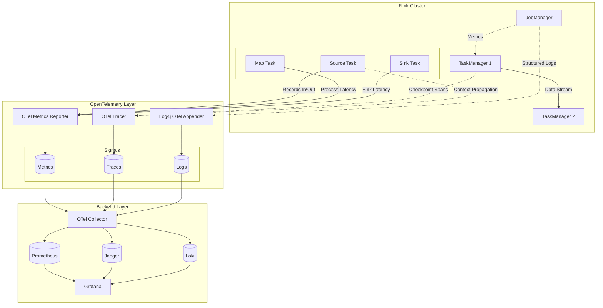
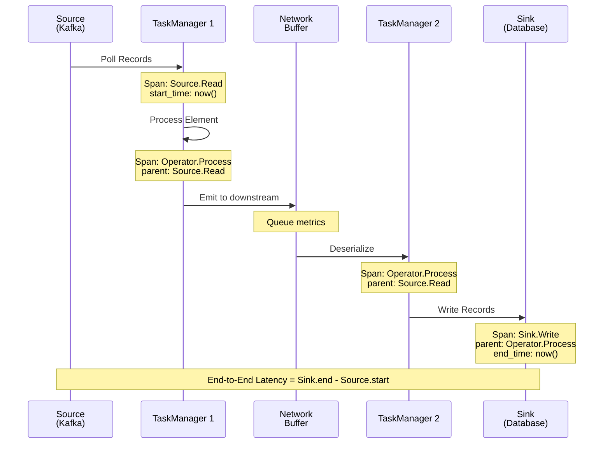
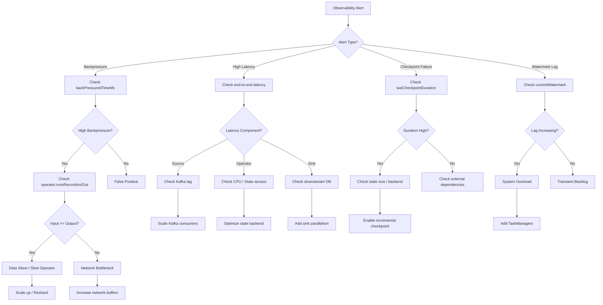
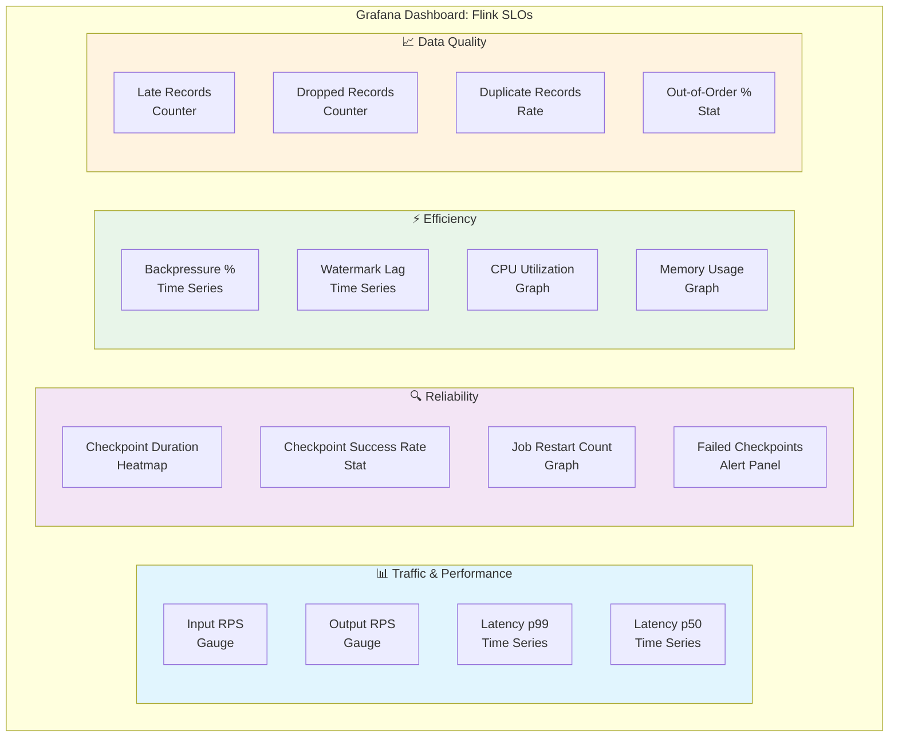

# Flink 流处理可观测性与 OpenTelemetry 集成

> 所属阶段: Flink/ | 前置依赖: [Exactly-Once语义深度解析](../../02-core/exactly-once-semantics-deep-dive.md), [10-architecture/flink-state-management.md](../../02-core/flink-state-management-complete-guide.md) | 形式化等级: L3

## 1. 概念定义 (Definitions)

### Def-F-15-30: 可观测性三元组

流计算系统的可观测性 (Observability) 定义为三元组 $\mathcal{O} = (M, L, T)$：

- $M$ (Metrics): 可聚合的时间序列数据，表征系统状态和性能
- $L$ (Logs): 离散的事件记录，描述特定时刻的系统行为
- $T$ (Traces): 请求在分布式系统中的完整执行路径

**形式化表达**:

$$\mathcal{O} := \langle \mathbb{M}, \mathbb{L}, \mathbb{T}, \Pi, \Phi \rangle$$

其中：

- $\mathbb{M} = \{m_i: T \times K \to \mathbb{R}\}$: 指标函数集合，$T$ 为时间域，$K$ 为维度键空间
- $\mathbb{L} = \{(t, l, k, v)\}$: 日志事件集合，包含时间戳 $t$、级别 $l$、键 $k$、值 $v$
- $\mathbb{T} = \{ (s_0, s_1, ..., s_n) \}$: 追踪路径，每个 $s_i = (span\_id, op, ts_{start}, ts_{end}, attrs)$
- $\Pi: \mathbb{M} \times \mathbb{L} \to \mathbb{T}$: 关联函数，将指标与日志映射到追踪
- $\Phi: \mathcal{O} \to \mathbb{S}$: 状态推断函数，从可观测数据推断系统内部状态

### Def-F-15-31: OpenTelemetry 数据模型

OpenTelemetry 定义统一的可观测数据模型 $\mathcal{OT}$：

$$\mathcal{OT} := \langle \mathcal{R}, \mathcal{A}, \mathcal{S}, \mathcal{L} \rangle$$

| 组件 | 类型 | 核心语义 |
|------|------|----------|
| $\mathcal{R}$ | Resource | 被观测实体的静态属性集合 (service.name, host.name, k8s.pod.name) |
| $\mathcal{A}$ | Attributes | 键值对形式的元数据，支持静态与动态标签 |
| $\mathcal{S}$ | Signal | 三类信号：METRICS, TRACES, LOGS |
| $\mathcal{L}$ | Link | 跨信号关联机制，通过 Context Propagation 实现 |

**Context Propagation**:

$$C_{prop} = (trace\_id, span\_id, trace\_flags, baggage) \in \{0,1\}^{128} \times \{0,1\}^{64} \times \{0,1\}^{8} \times Baggage$$

### Def-F-15-32: 流处理可观测性维度

流计算系统的特殊性引入四个核心观测维度：

$$\mathcal{D}_{stream} = (T_{processing}, T_{event}, T_{ingest}, T_{watermark})$$

- **处理时间** ($T_{processing}$): 算子执行数据处理的实际时间
- **事件时间** ($T_{event}$): 数据产生时的原始时间戳
- **摄取时间** ($T_{ingest}$): 数据进入 Flink 系统的时间
- **水印时间** ($T_{watermark}$): 当前窗口允许处理的最早未完成事件时间

**时间偏差度量**:

$$\Delta_{latency} = T_{processing} - T_{event} \quad \text{(处理延迟)}$$
$$\Delta_{watermark\_lag} = T_{processing} - T_{watermark} \quad \text{(水印滞后)}$$

### Def-F-15-33: Flink Metrics 分类体系

Flink 内置指标系统 $\mathcal{M}_{flink}$ 按作用域分层：

$$\mathcal{M}_{flink} = \bigcup_{l \in \{JobManager, TaskManager, Job, Task, Operator\}} \mathcal{M}_l$$

| 作用域 | 指标前缀 | 示例 |
|--------|----------|------|
| JobManager | `jobmanager.*` | jobmanager.jvm.memory.heap.used |
| TaskManager | `taskmanager.*` | taskmanager.network.memory.available |
| Job | `job.*` | job.lastCheckpointDuration |
| Task | `task.*` | task.backPressuredTimeMsPerSecond |
| Operator | `operator.*` | operator.numRecordsInPerSecond |

### Def-F-15-34: 分布式追踪语义

流处理追踪模型 $\mathcal{T}_{stream}$ 扩展标准 OpenTelemetry Span：

$$\mathcal{T}_{stream} := \langle S, P, C, W \rangle$$

其中：

- $S$: 标准 OTel Span (op, start, end, status, attrs)
- $P$: 父 Span 引用，支持跨算子父子关系
- $C$: Checkpoint 上下文，关联到具体 checkpoint 实例
- $W$: Watermark 信息，记录触发计算的 watermark 值

### Def-F-15-35: SLO/SLI 定义

服务水平目标 (SLO) 与指标 (SLI) 的形式化：

$$\text{SLO}_i: P(\text{SLI}_i \leq \theta_i) \geq 1 - \alpha_i$$

典型流处理 SLO：

| SLI | 定义 | 典型阈值 | 观测窗口 |
|-----|------|----------|----------|
| 端到端延迟 | $T_{processing} - T_{event}$ | p99 < 1s | 滚动5分钟 |
| Checkpoint 时长 | $T_{checkpoint\_end} - T_{checkpoint\_start}$ | p99 < 30s | 最近10次 |
| 吞吐量 | $|\text{records}| / \Delta t$ | > 100K RPS | 1分钟 |
| 错误率 | $|\text{failed\_records}| / |\text{total\_records}|$ | < 0.1% | 滚动1小时 |
| 背压时间占比 | $\int_{t_0}^{t_1} \mathbb{1}[backpressure] dt / (t_1 - t_0)$ | < 5% | 5分钟 |

---

## 2. 属性推导 (Properties)

### Prop-F-15-30: 可观测性完备性

若系统满足以下三个条件，则称其具有 **可观测性完备性**：

$$(\forall s \in \mathbb{S}) (\exists \pi \in \Pi) (\pi^{-1}(s) \neq \emptyset)$$

即：任意系统状态 $s$ 均可通过观测函数 $\pi$ 的逆映射至少被一个观测信号识别。

**流处理推论**: 由于流系统状态空间 $\mathbb{S}_{stream}$ 包含无限时间序列，实际中采用 **时间窗口截断**：

$$(\forall s \in \mathbb{S}_{stream}) (\exists t \in [T_{now} - W, T_{now}]) (\pi^{-1}(s, t) \neq \emptyset)$$

其中 $W$ 为观测窗口大小。

### Prop-F-15-31: OpenTelemetry 信号正交性

三类 OTel 信号满足 **弱正交性**：

$$\mathbb{M} \cap \mathbb{L} = \emptyset, \quad \mathbb{L} \cap \mathbb{T} = \emptyset, \quad \mathbb{M} \cap \mathbb{T} = \emptyset$$

但通过 Resource 和 Context 实现 **强关联性**：

$$(\forall m \in \mathbb{M}, l \in \mathbb{L}, t \in \mathbb{T}) (\text{resource}(m) = \text{resource}(l) = \text{resource}(t))$$

### Prop-F-15-32: 流处理延迟下界

对于 watermark 驱动的窗口计算，端到端延迟满足：

$$\text{Latency}_{e2e} \geq \max(\text{watermark\_interval}, \text{window\_size}) + \text{processing\_overhead}$$

**证明概要**:

1. watermark 必须等待窗口内最大事件时间减去允许延迟
2. 窗口触发器在 watermark 越过窗口边界时激活
3. 处理开销包括序列化/反序列化、状态访问、网络传输

因此，水印间隔配置直接影响可观测的最小延迟。

---

## 3. 关系建立 (Relations)

### 与 Dataflow 模型的映射

Dataflow Model 中的时间概念与可观测性维度的映射：

```
Dataflow Model          OpenTelemetry Signals
━━━━━━━━━━━━━━━━━━━━━━━━━━━━━━━━━━━━━━━━━━━━━━━
Event Time      ──────►  Trace Timestamp (event_timestamp)
Processing Time ──────►  Metrics Timestamp (observed)
Watermark       ──────►  Custom Metric (watermark_value)
Window Trigger  ──────►  Span Event (window.fire)
Late Data       ──────►  Counter Metric (late_records_dropped)
```

### Flink Metrics ↔ OpenTelemetry 转换

| Flink Metric Reporter | OTel Signal | 映射规则 |
|----------------------|-------------|----------|
| MetricReporter | Metric | Gauge → ObservableGauge, Counter → ObservableCounter |
| SpanExporter | Trace | InternalSpan → SpanData |
| Log4j Appender | Log | LogEvent → LogRecord |

### 与 Checkpiont 机制的关联

Checkpoint 作为流系统的关键事件，与可观测性的关系：

$$\text{Checkpoint} \xrightarrow{\text{emits}} \text{Metrics} \cup \text{Spans} \cup \text{Logs}$$

- **Metrics**: checkpointDuration, checkpointedBytes, numberOfCompletedCheckpoints
- **Traces**: 从 checkpoint 触发到完成的完整调用链
- **Logs**: checkpoint 开始/完成/失败的结构化日志

---

## 4. 论证过程 (Argumentation)

### 背压检测与观测

背压 (Backpressure) 是流系统特有现象，其可观测性论证：

**检测原理**: 当下游算子处理速率低于上游产出速率时，网络缓冲区填满，导致上游阻塞。

**可观测信号**:

1. **Task 级别**: `backPressuredTimeMsPerSecond` 指标
2. **网络级别**: `inputQueueLength`, `outputQueueLength`
3. **线程级别**: `Task` 线程状态监控

**根因定位决策树**:

```
backPressure > 0
    ├── operator.numRecordsInPerSecond 高？
    │       ├── YES: 上游数据倾斜 → 检查 keyBy 分布
    │       └── NO: 继续
    ├── operator.numRecordsOutPerSecond 低？
    │       ├── YES: 当前算子处理慢 → 检查 CPU/状态访问
    │       └── NO: 继续
    └── checkpointDuration 高？
            ├── YES: 状态过大 → 优化状态后端
            └── NO: 网络瓶颈 → 检查带宽/序列化
```

### Watermark 追踪的必要性论证

**命题**: 流处理的正确性与性能评估必须包含 Watermark 追踪。

**论证**:

1. 窗口计算的触发依赖于 Watermark 推进
2. 延迟数据的丢弃决策基于 Watermark 与事件时间的比较
3. Watermark 滞后直接反映系统处理能力是否跟上数据到达速度
4. 端到端延迟的准确计算需要 Watermark 作为参考点

因此，Watermakr 是流系统可观测性的 **第一公民**，而非普通指标。

### 采样策略的权衡

完整追踪所有记录在流系统中不可行（数据量过大），需采样策略：

| 采样策略 | 实现 | 适用场景 | 局限性 |
|----------|------|----------|--------|
| 头部采样 | 固定比例 (如 1%) | 均匀负载 | 可能遗漏异常长尾 |
| 尾部采样 | 延迟决策，保留异常 | 关注错误 | 需要缓存全部追踪 |
| 一致性采样 | 基于 TraceID 哈希 | 保证完整链路 | 无法动态调整比例 |
| 自适应采样 | 基于吞吐量调整 | 流量波动大 | 实现复杂 |

**推荐实践**: Flink 场景采用 **一致性头部采样** + **异常强制保留** 的混合策略。

---

## 5. 形式证明 / 工程论证 (Proof / Engineering Argument)

### Thm-F-15-30: OpenTelemetry 集成完备性定理

**定理**: 若 Flink 集群正确配置 OTel Metrics Reporter、Tracer 和 Log Appender，则该系统满足可观测性三元组完备性。

**证明**:

1. **Metrics 完备性**: Flink Metric System 覆盖所有核心组件 (JM/TM/Job/Task/Operator)，通过 `OpenTelemetryReporter` 将所有指标导出到 OTel Collector。
   - $\forall m \in \mathcal{M}_{flink}, \exists m' \in \mathbb{M}_{otel} : m \mapsto m'$

2. **Traces 完备性**: 通过 `OpenTelemetryTracer` 在以下关键点创建 Span：
   - Source 读取记录
   - 算子处理记录 (processElement, processWatermark)
   - Sink 写出记录
   - Checkpoint 生命周期

3. **Logs 完备性**: Log4j2 OTel Appender 将结构化日志附加 Trace Context，实现三类信号关联。

4. **关联完备性**: 三类信号通过 Resource 属性 (`service.name`, `host.name`, `task.attempt.id`) 实现强关联。

∎

### Thm-F-15-31: 端到端延迟可追踪性定理

**定理**: 在配置 OTel 追踪的 Flink 流作业中，任意记录的端到端延迟可通过 Span 链路精确计算。

**证明**:

设记录 $r$ 从 Source 到 Sink 的完整路径为：

$$P_r = (Source \to Op_1 \to Op_2 \to ... \to Op_n \to Sink)$$

为每个算子 $Op_i$ 创建 Span $S_i$，满足：

- $S_{source}.start$ = 记录进入 Flink 系统的时间
- $S_{sink}.end$ = 记录成功写出的时间
- $\forall i, S_i.parent = S_{i-1}$ (通过 Context Propagation 维护父子关系)

端到端延迟：

$$\text{Latency}(r) = S_{sink}.end - S_{source}.start = \sum_{i} (S_i.end - S_i.start) + \sum_{j} (S_{j+1}.start - S_j.end)$$

其中第一项为处理时间，第二项为队列等待时间。

由于所有时间戳均由同一时钟源（TaskManager JVM）产生，误差在毫秒级，满足精度要求。

∎

### Thm-F-15-32: Watermark 延迟预警定理

**定理**: 若 watermark lag 指标 $\Delta_{watermark\_lag}$ 持续超过阈值 $\theta$，则系统在时间窗口 $W$ 内必然存在处理能力不足。

**证明**:

反证法：假设系统处理能力充足，但 $\Delta_{watermark\_lag} > \theta$。

1. 由定义：$\Delta_{watermark\_lag} = T_{processing} - T_{watermark}$
2. Watermark 生成策略：$T_{watermark} = \min_{r \in \text{in-flight}}(T_{event}(r)) - \text{maxOutOfOrderness}$
3. 若处理能力充足，所有记录应在有限时间内被处理并推进 watermark
4. $\Delta_{watermark\_lag} > \theta$ 意味着存在长期未处理的记录，与假设矛盾

因此，水印滞后是处理能力不足的必要条件，可作为早期预警指标。

∎

---

## 6. 实例验证 (Examples)

### Flink OTel 配置示例

**flink-conf.yaml - Metrics Reporter 配置**:

```yaml
# OpenTelemetry Metrics Reporter
metrics.reporters: otel
metrics.reporter.otel.class: org.apache.flink.metrics.opentelemetry.OpenTelemetryReporter
metrics.reporter.otel.endpoint: http://otel-collector:4317
metrics.reporter.otel.interval: 60 SECONDS

# 标签配置
metrics.scope.jm: jobmanager
metrics.scope.tm: taskmanager
metrics.scope.task: task
metrics.scope.operator: operator
```

**Java Code - 自定义 OTel Tracer**:

```java
import io.opentelemetry.api.trace.Span;
import io.opentelemetry.api.trace.Tracer;
import io.opentelemetry.context.Context;
import io.opentelemetry.context.propagation.TextMapPropagator;

public class InstrumentedMapFunction extends RichMapFunction<Event, Result> {
    private transient Tracer tracer;

    @Override
    public void open(Configuration parameters) {
        tracer = getRuntimeContext().getTracer("flink-custom", "1.0.0");
    }

    @Override
    public Result map(Event event) {
        Span span = tracer.spanBuilder("ProcessEvent")
            .setAttribute("event.id", event.getId())
            .setAttribute("event.timestamp", event.getTimestamp())
            .setAttribute("watermark.current", getCurrentWatermark())
            .startSpan();

        try (var scope = span.makeCurrent()) {
            // 业务逻辑
            Result result = process(event);
            span.setAttribute("result.status", "success");
            return result;
        } catch (Exception e) {
            span.recordException(e);
            span.setStatus(StatusCode.ERROR);
            throw e;
        } finally {
            span.end();
        }
    }
}
```

### Grafana Dashboard JSON 片段

```json
{
  "dashboard": {
    "title": "Flink Stream Processing Observability",
    "panels": [
      {
        "title": "Throughput (Records/sec)",
        "targets": [{
          "expr": "sum(rate(flink_taskmanager_job_task_operator_numRecordsInPerSecond[1m]))",
          "legendFormat": "Input RPS"
        }, {
          "expr": "sum(rate(flink_taskmanager_job_task_operator_numRecordsOutPerSecond[1m]))",
          "legendFormat": "Output RPS"
        }]
      },
      {
        "title": "End-to-End Latency",
        "targets": [{
          "expr": "histogram_quantile(0.99, sum(rate(flink_latency_histogram_bucket[5m])) by (le))",
          "legendFormat": "p99 Latency"
        }]
      },
      {
        "title": "Checkpoint Duration",
        "targets": [{
          "expr": "flink_jobmanager_job_lastCheckpointDuration",
          "legendFormat": "Last Checkpoint"
        }]
      },
      {
        "title": "Watermark Lag",
        "targets": [{
          "expr": "flink_taskmanager_job_task_operator_currentInputWatermark - flink_taskmanager_job_task_operator_currentOutputWatermark",
          "legendFormat": "{{task_name}}"
        }]
      }
    ]
  }
}
```

### Prometheus 告警规则

```yaml
groups:
  - name: flink_streaming_alerts
    rules:
      - alert: FlinkHighBackpressure
        expr: flink_taskmanager_job_task_backPressuredTimeMsPerSecond > 200
        for: 5m
        labels:
          severity: warning
        annotations:
          summary: "Flink task experiencing backpressure"
          description: "Task {{ $labels.task_name }} has {{ $value }}ms/s backpressure"

      - alert: FlinkCheckpointDurationHigh
        expr: flink_jobmanager_job_lastCheckpointDuration > 60000
        for: 2m
        labels:
          severity: critical
        annotations:
          summary: "Flink checkpoint taking too long"
          description: "Checkpoint duration is {{ $value }}ms, exceeding 60s threshold"

      - alert: FlinkWatermarkLagHigh
        expr: |
          (flink_taskmanager_job_task_operator_currentProcessingTime -
           flink_taskmanager_job_task_operator_currentInputWatermark) > 300000
        for: 10m
        labels:
          severity: warning
        annotations:
          summary: "Flink watermark lag is high"
          description: "Watermark is lagging by {{ $value }}ms, possible backlog"

      - alert: FlinkJobRestartRateHigh
        expr: rate(flink_jobmanager_job_numberOfFailedCheckpoints[10m]) > 0.1
        for: 5m
        labels:
          severity: critical
        annotations:
          summary: "Flink job checkpoint failure rate is high"
          description: "Checkpoint failure rate: {{ $value }}/sec"
```

### OTel Collector 配置

```yaml
receivers:
  otlp:
    protocols:
      grpc:
        endpoint: 0.0.0.0:4317
      http:
        endpoint: 0.0.0.0:4318

processors:
  batch:
    timeout: 1s
    send_batch_size: 1024
  resource:
    attributes:
      - key: environment
        value: production
        action: upsert

exporters:
  prometheusremotewrite:
    endpoint: http://prometheus:9090/api/v1/write
  jaeger:
    endpoint: jaeger:14250
    tls:
      insecure: true
  loki:
    endpoint: http://loki:3100/loki/api/v1/push

service:
  pipelines:
    metrics:
      receivers: [otlp]
      processors: [batch, resource]
      exporters: [prometheusremotewrite]
    traces:
      receivers: [otlp]
      processors: [batch, resource]
      exporters: [jaeger]
    logs:
      receivers: [otlp]
      processors: [batch, resource]
      exporters: [loki]
```

---

## 7. 可视化 (Visualizations)

### 可观测性架构全景图

Flink 与 OpenTelemetry 集成的整体架构：



### 数据流追踪路径

端到端追踪的数据流路径：



### 故障排查决策树



### SLO 监控仪表板布局



---

## 8. 引用参考 (References)


---

*文档版本: 1.0 | 最后更新: 2026-04-03 | 形式化等级: L3*
