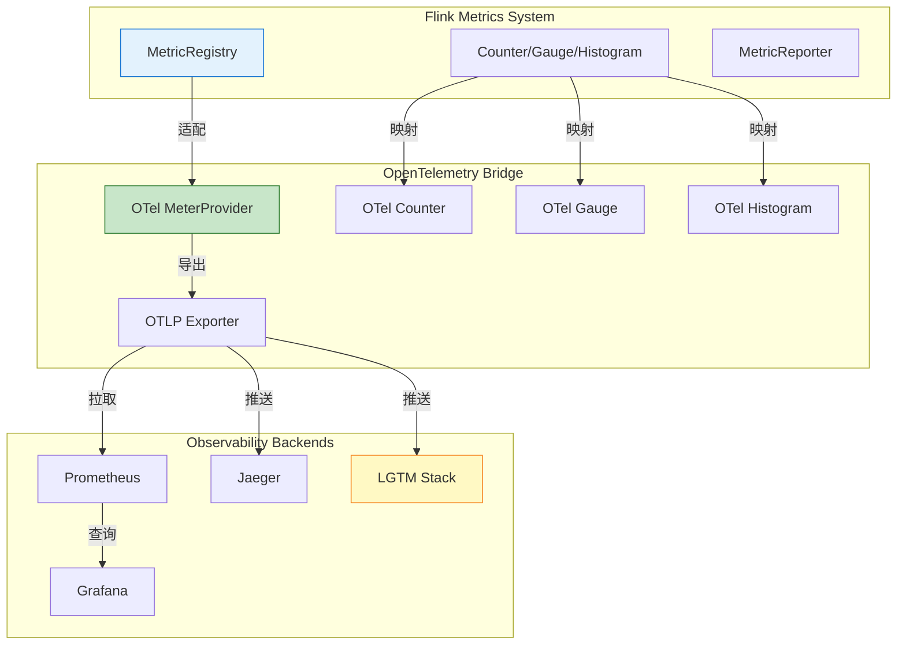
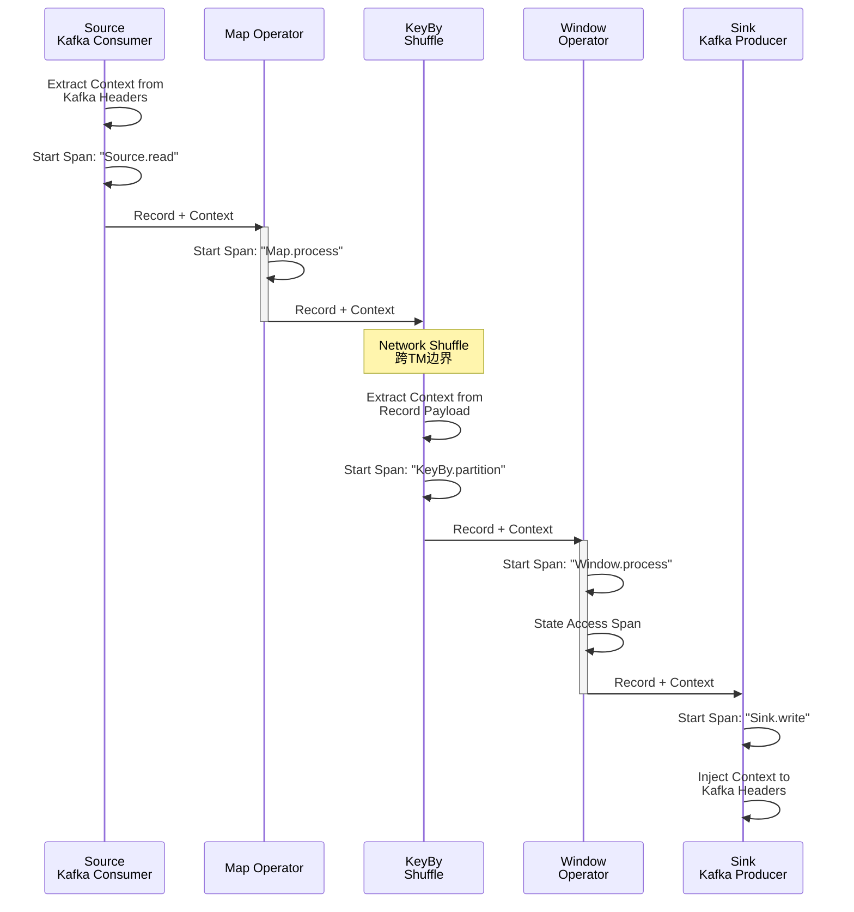
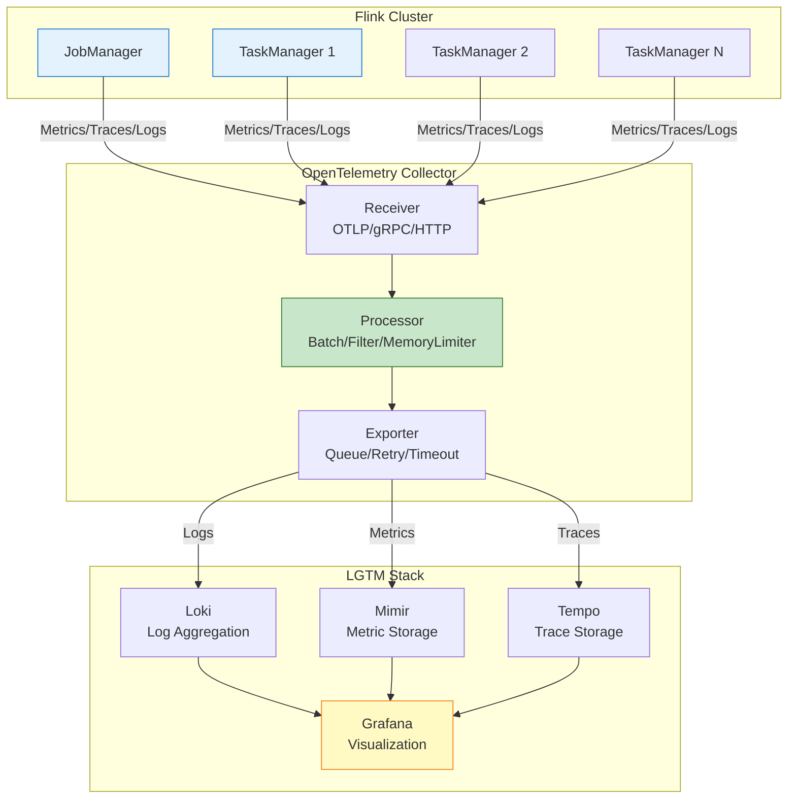
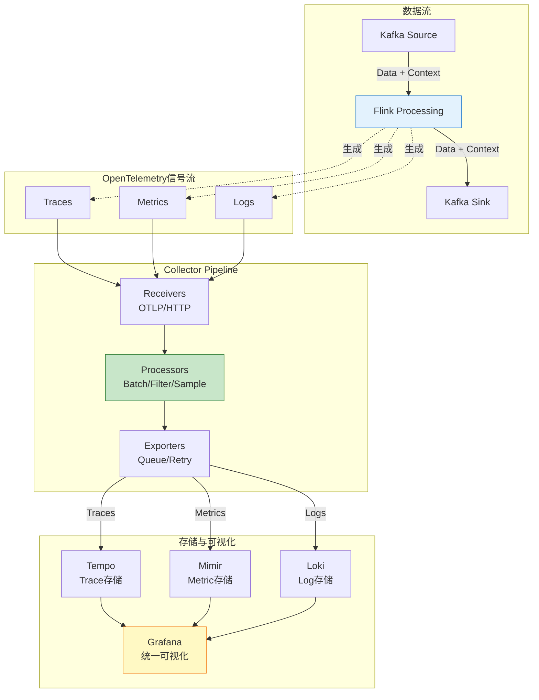
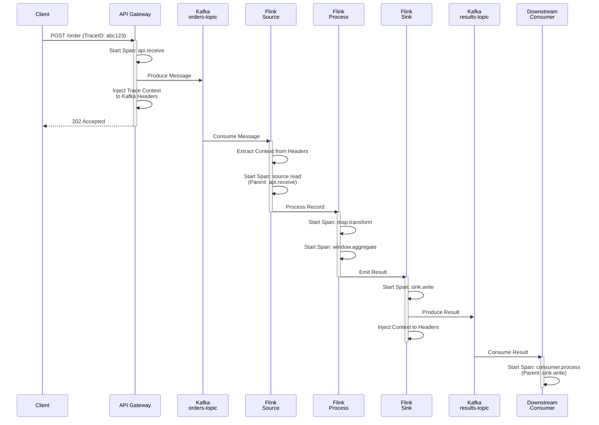

# OpenTelemetry与流处理可观测性 - 2026前沿实践

> 所属阶段: Flink/ | 前置依赖: [分布式追踪](./distributed-tracing.md), [Flink监控指标体系](./metrics-and-monitoring.md) | 形式化等级: L4

---

## 1. 概念定义 (Definitions)

### Def-F-15-10: OpenTelemetry统一可观测性模型

**OpenTelemetry (OTel)** 是CNCF主导的开放式可观测性框架，提供跨语言、跨平台的Telemetry数据统一采集、处理和导出标准。

**形式化定义**:

**Def-F-15-10a**: OpenTelemetry可观测性空间是一个四元组 $\mathcal{O} = (S, M, L, C)$，其中：

| 组件 | 符号 | 定义 | 数据模型 |
|------|------|------|----------|
| **信号(Signals)** | $S$ | 可观测性数据类型集合 | $S = \{Traces, Metrics, Logs, Profiles\}$ |
| **元数据(Metadata)** | $M$ | 描述Telemetry的上下文信息 | $M = \{Resource, Scope, Attributes\}$ |
| **链路(Linkages)** | $L$ | 跨信号关联机制 | $L: S_i \times S_j \rightarrow ContextID$ |
| **导出器(Exporters)** | $E$ | 数据输出协议集合 | $E = \{OTLP, Prometheus, Jaeger, Zipkin\}$ |

**Def-F-15-10b**: Telemetry信号是带时间戳的结构化数据流，满足：

$$
\forall sig \in S, \quad sig = (timestamp, attributes, body, context)
$$

其中 $context$ 包含用于跨边界关联的 `TraceID`、`SpanID` 和 `Baggage`。

---

### Def-F-15-11: 可观测性三支柱统一模型

OpenTelemetry 2026实现了传统APM三大支柱的深度统一：

**Def-F-15-11**: 统一可观测性模型 $\mathcal{U}$ 定义为：

```
┌─────────────────────────────────────────────────────────────────────┐
│                    OpenTelemetry 统一信号层                          │
├─────────────┬─────────────────┬──────────────────┬──────────────────┤
│   TRACES    │    METRICS      │      LOGS        │    PROFILES      │
│  分布式追踪  │    指标数据      │     日志记录      │    性能剖析       │
├─────────────┼─────────────────┼──────────────────┼──────────────────┤
│ • Spans     │ • Counters      │ • LogRecords     │ • Stack Samples  │
│ • SpanEvents│ • Gauges        │ • SeverityText   │ • CPU/Mem Flame  │
│ • Links     │ • Histograms    │ • Body           │ • Allocation     │
│ • Status    │ • Summaries     │ • TraceContext   │ • Contention     │
└─────────────┴─────────────────┴──────────────────┴──────────────────┘
│                         OTLP 统一传输协议                           │
│           (gRPC/HTTP, Protobuf, 支持压缩与批量)                      │
└─────────────────────────────────────────────────────────────────────┘
```

**关键统一特性 (2026状态)**:

| 特性 | 2024状态 | 2026状态 | 影响 |
|------|----------|----------|------|
| **Logs支持** | 实验性 | **稳定版** | 生产级日志关联 |
| **Profiles** | 无 | **预览版** | 持续性能剖析 |
| **Samplers** | 基础 | **智能采样** | 成本优化50%+ |
| **Collector** | v0.x | **v1.0+** | 企业级稳定性 |

---

### Def-F-15-12: 流处理特定可观测性维度

流处理系统相比传统服务存在独特的可观测性挑战：

**Def-F-15-12**: 流可观测性维度 $\mathcal{D}_{streaming}$ 是六元组：

$$
\mathcal{D}_{streaming} = (D_{temporal}, D_{state}, D_{parallel}, D_{watermark}, D_{backpressure}, D_{checkpoint})
$$

| 维度 | 符号 | 定义 | 关键指标 |
|------|------|------|----------|
| **时间维度** | $D_{temporal}$ | 事件时间与处理时间的关系 | `eventTimeLag`, `processingTimeSkew` |
| **状态维度** | $D_{state}$ | 状态后端的健康与大小 | `stateSize`, `stateAccessLatency` |
| **并行维度** | $D_{parallel}$ | 子任务间的负载分布 | `subtaskBackpressureRatio`, `recordsPerSubtask` |
| **Watermark维度** | $D_{watermark}$ | 时间进度推进状态 | `watermarkLag`, `watermarkDrift` |
| **背压维度** | $D_{backpressure}$ | 流控健康度 | `backpressureRatio`, `outQueueUsage` |
| **Checkpoint维度** | $D_{checkpoint}$ | 容错机制健康度 | `checkpointDuration`, `alignmentTime` |

---

### Def-F-15-13: 异步边界追踪 (Async Boundary Tracing)

流处理中最复杂的可观测性问题是跨越异步数据流边界的因果追踪。

**Def-F-15-13**: 异步边界追踪是函数 $ABT: Event \rightarrow TraceContext$，满足：

$$
\forall e \in Event, \quad ABT(e) = \begin{cases}
C_{inherited} & \text{if } \exists e': e' \prec e \land Context(e') = C \\
C_{new} & \text{if } e \text{ is root event}
\end{cases}
$$

**Flink中的异步边界类型**：

```
┌────────────────────────────────────────────────────────────────────┐
│                    Flink 异步边界分类                               │
├──────────────────┬─────────────────────────────────────────────────┤
│ 边界类型          │ 追踪挑战                                         │
├──────────────────┼─────────────────────────────────────────────────┤
│ Network Shuffle   │ TM间数据传递，需通过Record携带Context              │
│ Checkpoint Barrier│ 控制消息与数据流交织，需保证因果一致性              │
│ Timer Callback    │ 异步定时触发，需关联注册时的Context                │
│ Async I/O         │ 外部调用回调，需保持回调与请求的Span关联           │
│ KeyBy Redistribution│ 数据重分区，需保持Trace连续性                    │
└──────────────────┴─────────────────────────────────────────────────┘
```

---

### Def-F-15-14: 采样策略形式化定义

生产环境中采样是控制可观测性成本的核心机制。

**Def-F-15-14**: 采样器 $Sampler$ 是函数 $S: Trace \rightarrow \{0, 1\}$，其中：

- $S(Tr) = 1$：追踪被采集
- $S(Tr) = 0$：追踪被丢弃

**采样策略分类**：

| 策略 | 定义 | 适用场景 | 复杂度 |
|------|------|----------|--------|
| **Head-Based** | $S(Tr) = f(trace_id, ratio)$，在根Span决定 | 均匀负载 | $O(1)$ |
| **Tail-Based** | $S(Tr) = g(\{span_i\}_{i=1}^n)$，基于完整Trace特征决定 | 异常检测 | $O(n)$ |
| **Rate-Limiting** | $S(Tr) = \mathbb{1}_{[rate < limit]}$，令牌桶控制 | 流量突发 | $O(1)$ |
| **Probabilistic** | $S(Tr) \sim Bernoulli(p)$，独立概率采样 | 简单部署 | $O(1)$ |

---

## 2. 属性推导 (Properties)

### Lemma-F-15-01: 采样覆盖率与成本权衡

**引理**: 设总请求量为 $N$，采样率为 $p$，存储成本函数为 $C(p) = \alpha \cdot Np + \beta$，则存在最优采样率 $p^*$ 使得信息损失与成本达到帕累托最优。

**证明**:

定义信息价值函数 $V(p) = 1 - e^{-\lambda p}$，其中 $\lambda$ 是问题发现率参数。

优化目标为：

$$
\max_p U(p) = V(p) - \gamma C(p) = (1 - e^{-\lambda p}) - \gamma(\alpha Np + \beta)
$$

求导并令导数为零：

$$
\frac{dU}{dp} = \lambda e^{-\lambda p} - \gamma\alpha N = 0
$$

解得最优采样率：

$$
p^* = \frac{1}{\lambda} \ln\left(\frac{\lambda}{\gamma\alpha N}\right)
$$

**工程意义**：当流量 $N$ 增大时，$p^*$ 减小，即高流量场景应使用更低采样率。

---

### Lemma-F-15-02: Trace-Metric-Log 关联完备性

**引理**: OpenTelemetry的三信号关联机制保证：给定任意信号实例，可在 $O(\log n)$ 时间内定位相关联的其他信号。

**证明概要**:

关联基于以下键值索引结构：

```
TraceID (128-bit) ─┬─→ SpanID list (Traces)
                   ├─→ Metric TimeSeries (Exemplars)
                   └─→ LogRecord indices (Log Correlation)
```

索引结构为B+树，查询复杂度为 $O(\log n)$。

**关键关联机制**：

| 源信号 | 目标信号 | 关联键 | 查询方式 |
|--------|----------|--------|----------|
| Trace | Metrics | `trace_id` in Exemplar | 时间窗口扫描 |
| Trace | Logs | `trace_id` in LogRecord | 倒排索引 |
| Metrics | Logs | `timestamp` + `resource` | 时间范围查询 |

---

### Thm-F-15-01: 流处理可观测性完备性定理

**定理**: 对于任意Flink作业 $J$，若满足以下条件，则其执行行为可完全重构：

1. 所有算子的Input/Output Span覆盖率为100%
2. Checkpoint Barrier传播被完整追踪
3. State访问操作带有读写Span
4. Watermark推进事件被记录

**形式化表述**:

$$
\forall J, \quad (C_{in}=1 \land C_{barrier}=1 \land C_{state}=1 \land C_{wm}=1) \Rightarrow \exists R: Traces(J) \xrightarrow{R} Execution(J)
$$

其中 $R$ 是行为重构函数，$Execution(J)$ 是作业实际执行序列。

**证明概要**:

1. **数据流重构**：Input/Output Span构成算子间数据依赖图 $G_{data}$
2. **控制流重构**：Barrier Span构成Checkpoint因果图 $G_{control}$
3. **状态流重构**：State Span与Barrier Span的交点确定一致割集
4. **时间流重构**：Watermark Span确定事件时间推进

由于Flink执行模型是确定性的（给定输入和状态），上述四图的并集唯一确定执行序列。

---

## 3. 关系建立 (Relations)

### 3.1 OpenTelemetry与Flink原生指标系统关系



**映射关系表**：

| Flink Metric Type | OpenTelemetry Type | 转换规则 |
|-------------------|-------------------|----------|
| `Counter` | `LongCounter` | 单调递增，Delta聚合 |
| `Gauge` | `ObservableGauge` | 即时值，LastValue聚合 |
| `Histogram` | `ExplicitBucketHistogram` | 桶边界对齐 |
| `Meter` | `DoubleCounter` | 速率计算后上报 |

---

### 3.2 自动埋点 vs 手动埋点决策矩阵

```mermaid
flowchart TD
    START([埋点决策]) --> Q1{需要业务上下文?}

    Q1 -->|否| AUTO[自动埋点
    <br/>Auto-Instrumentation]
    Q1 -->|是| Q2{性能敏感?}

    Q2 -->|是| SEMI[半自动埋点
    <br/>Annotation-based]
    Q2 -->|否| MANUAL[手动埋点
    <br/>OpenTelemetry API]

    AUTO --> A1[Java Agent
    <br/>ByteBuddy插桩]
    SEMI --> A2[@WithSpan
    <br/>@SpanAttribute]
    MANUAL --> A3[SpanBuilder
    <br/>Context手动传递]

    A1 --> B1[覆盖: Source/Sink
    <br/>Checkpoint RPC]
    A2 --> B2[覆盖: 业务方法
    <br/>复杂计算逻辑]
    A3 --> B3[覆盖: 异步边界
    <br/>自定义语义]

    style START fill:#e3f2fd,stroke:#1976d2
    style AUTO fill:#c8e6c9,stroke:#2e7d32
    style SEMI fill:#fff9c4,stroke:#f57f17
    style MANUAL fill:#ffccbc,stroke:#d84315
```

---

## 4. 论证过程 (Argumentation)

### 4.1 OpenTelemetry成为事实标准的必要性论证

**问题背景**：2026年，48.5%的组织在生产环境使用OpenTelemetry，81%认为其生产就绪[^1]。这一普及率背后有哪些技术必然性？

**论证链条**：

```
1. 多云/混合云成为常态
   ↓
2. 各云厂商提供不同的可观测性工具
   ↓
3. 厂商锁定风险 + 数据孤岛问题
   ↓
4. 需要开源、中立的统一标准
   ↓
5. OpenTelemetry (CNCF项目) 成为最优解
```

**技术必然性分析**：

| 驱动因素 | 具体表现 | OpenTelemetry价值 |
|----------|----------|-------------------|
| **标准化需求** | Prometheus、Jaeger、Zipkin各自为政 | 统一协议OTLP |
| **成本压力** | 商业APM按量计费昂贵 | 开源 + 灵活采样 |
| **可移植性** | 跨云迁移困难 | 与基础设施解耦 |
| **生态整合** | K8s原生可观测性 | 与K8s深度集成 |

---

### 4.2 流处理可观测性挑战分析

**挑战1：异步边界追踪**



**挑战2：长时间运行作业监控**

| 挑战 | 传统方法缺陷 | OpenTelemetry解决方案 |
|------|-------------|----------------------|
| Span数量爆炸 | 内存溢出、导出延迟 | 尾部采样 + 批量压缩 |
| 历史数据查询 | 全量扫描效率低 | 基于TraceID的分片索引 |
| 趋势分析困难 | 原始Span难以聚合 | Metrics Derived from Spans |

---

## 5. 工程论证 (Proof / Engineering Argument)

### 5.1 生产部署架构

**推荐的LGTM栈部署架构**：



**Collector Pipeline配置**：

```yaml
# otel-collector-config.yaml
receivers:
  otlp:
    protocols:
      grpc:
        endpoint: 0.0.0.0:4317
        max_recv_msg_size_mib: 64
      http:
        endpoint: 0.0.0.0:4318
        cors:
          allowed_origins: ["*"]
  prometheus:
    config:
      scrape_configs:
        - job_name: 'flink-metrics'
          static_configs:
            - targets: ['flink-jobmanager:9249', 'flink-taskmanager:9249']

processors:
  batch:
    timeout: 1s
    send_batch_size: 1024
    send_batch_max_size: 2048

  memory_limiter:
    check_interval: 1s
    limit_mib: 512
    spike_limit_mib: 128

  resource:
    attributes:
      - key: service.namespace
        value: flink-production
        action: upsert
      - key: deployment.environment
        value: production
        action: upsert

  tail_sampling:
    decision_wait: 10s
    num_traces: 100000
    expected_new_traces_per_sec: 1000
    policies:
      - name: errors
        type: status_code
        status_code: {status_codes: [ERROR]}
      - name: latency
        type: latency
        latency: {threshold_ms: 1000}
      - name: probabilistic
        type: probabilistic
        probabilistic: {sampling_percentage: 10}

exporters:
  otlp/jaeger:
    endpoint: jaeger-collector:4317
    tls:
      insecure: true

  prometheusremotewrite:
    endpoint: http://mimir:9090/api/v1/push
    headers:
      X-Scope-OrgID: flink-team

  loki:
    endpoint: http://loki:3100/loki/api/v1/push
    labels:
      attributes:
        service.name: service_name
        service.instance.id: service_instance_id

  logging:
    verbosity: detailed

service:
  pipelines:
    traces:
      receivers: [otlp]
      processors: [memory_limiter, tail_sampling, batch, resource]
      exporters: [otlp/jaeger, logging]

    metrics:
      receivers: [otlp, prometheus]
      processors: [memory_limiter, batch, resource]
      exporters: [prometheusremotewrite, logging]

    logs:
      receivers: [otlp]
      processors: [memory_limiter, batch, resource]
      exporters: [loki, logging]
```

---

### 5.2 Flink + OpenTelemetry集成实现

**Trace埋点实现（Source→Transform→Sink）**：

```java
/**
 * Def-F-15-15: Flink OTel Trace Instrumentation
 *
 * 自动埋点覆盖：
 * - Source: 从外部系统读取时创建Span
 * - Transform: 算子处理逻辑包装
 * - Sink: 写入外部系统时创建Span
 */

import io.opentelemetry.api.OpenTelemetry;
import io.opentelemetry.api.trace.Span;
import io.opentelemetry.api.trace.SpanKind;
import io.opentelemetry.api.trace.StatusCode;
import io.opentelemetry.api.trace.Tracer;
import io.opentelemetry.context.Context;
import io.opentelemetry.context.Scope;
import io.opentelemetry.context.propagation.TextMapGetter;
import io.opentelemetry.context.propagation.TextMapSetter;

public class OpenTelemetryFlinkWrapper {

    private final Tracer tracer;

    public OpenTelemetryFlinkWrapper(OpenTelemetry openTelemetry) {
        this.tracer = openTelemetry.getTracer("flink-streaming", "1.0.0");
    }

    /**
     * Source埋点 - 从Kafka等外部系统读取
     * SpanKind: CONSUMER
     */
    public <T> T traceSourceRead(String sourceName,
                                  ConsumerRecord<?, T> record,
                                  Supplier<T> readLogic) {
        // 从Kafka Headers提取上游Context
        Context parentContext = extractContextFromHeaders(record.headers());

        Span span = tracer.spanBuilder(sourceName + ".read")
            .setParent(parentContext)
            .setSpanKind(SpanKind.CONSUMER)
            .setAttribute("messaging.system", "kafka")
            .setAttribute("messaging.destination", record.topic())
            .setAttribute("messaging.kafka.partition", record.partition())
            .setAttribute("messaging.kafka.offset", record.offset())
            .startSpan();

        try (Scope scope = span.makeCurrent()) {
            T result = readLogic.get();
            span.setAttribute("record.count", 1);
            return result;
        } catch (Exception e) {
            span.setStatus(StatusCode.ERROR, e.getMessage());
            span.recordException(e);
            throw e;
        } finally {
            span.end();
        }
    }

    /**
     * Transform埋点 - 算子处理逻辑
     * SpanKind: INTERNAL
     */
    public <T, R> R traceTransform(String operatorName,
                                   T input,
                                   Function<T, R> transformLogic) {
        Span span = tracer.spanBuilder(operatorName + ".process")
            .setSpanKind(SpanKind.INTERNAL)
            .setAttribute("flink.operator.name", operatorName)
            .setAttribute("flink.operator.type", "transform")
            .startSpan();

        long startTime = System.nanoTime();
        try (Scope scope = span.makeCurrent()) {
            R result = transformLogic.apply(input);
            long duration = System.nanoTime() - startTime;
            span.setAttribute("processing.duration_ns", duration);
            return result;
        } catch (Exception e) {
            span.setStatus(StatusCode.ERROR, e.getMessage());
            span.recordException(e);
            throw e;
        } finally {
            span.end();
        }
    }

    /**
     * Sink埋点 - 写入外部系统
     * SpanKind: PRODUCER
     */
    public <T> void traceSinkWrite(String sinkName,
                                   T record,
                                   String destination,
                                   Consumer<T> writeLogic) {
        Span span = tracer.spanBuilder(sinkName + ".write")
            .setSpanKind(SpanKind.PRODUCER)
            .setAttribute("messaging.system", sinkName)
            .setAttribute("messaging.destination", destination)
            .startSpan();

        try (Scope scope = span.makeCurrent()) {
            // 将当前Context注入到下游消息
            Headers headers = new RecordHeaders();
            injectContextToHeaders(Context.current(), headers);

            writeLogic.accept(record);
            span.setAttribute("record.count", 1);
        } catch (Exception e) {
            span.setStatus(StatusCode.ERROR, e.getMessage());
            span.recordException(e);
            throw e;
        } finally {
            span.end();
        }
    }

    /**
     * Checkpoint埋点 - 容错机制追踪
     * SpanKind: INTERNAL
     */
    public void traceCheckpoint(long checkpointId,
                                 long checkpointTimestamp,
                                 Runnable checkpointLogic) {
        Span span = tracer.spanBuilder("checkpoint.execute")
            .setSpanKind(SpanKind.INTERNAL)
            .setAttribute("flink.checkpoint.id", checkpointId)
            .setAttribute("flink.checkpoint.trigger_timestamp", checkpointTimestamp)
            .startSpan();

        try (Scope scope = span.makeCurrent()) {
            checkpointLogic.run();
            span.setStatus(StatusCode.OK);
        } catch (Exception e) {
            span.setStatus(StatusCode.ERROR, e.getMessage());
            span.recordException(e);
            throw e;
        } finally {
            span.end();
        }
    }

    // Context传播辅助方法
    private <T> Context extractContextFromHeaders(Headers headers) {
        return GlobalOpenTelemetry.getPropagators()
            .getTextMapPropagator()
            .extract(Context.current(), headers, KafkaHeaderGetter.INSTANCE);
    }

    private void injectContextToHeaders(Context context, Headers headers) {
        GlobalOpenTelemetry.getPropagators()
            .getTextMapPropagator()
            .inject(context, headers, KafkaHeaderSetter.INSTANCE);
    }
}
```

---

### 5.3 Metrics暴露配置

```java
/**
 * Def-F-15-16: Flink Metrics to OpenTelemetry Bridge
 *
 * 将Flink原生指标桥接到OTel Metrics
 */

import io.opentelemetry.api.metrics.DoubleHistogram;
import io.opentelemetry.api.metrics.LongCounter;
import io.opentelemetry.api.metrics.LongUpDownCounter;
import io.opentelemetry.api.metrics.Meter;

public class FlinkMetricsBridge implements MetricReporter {

    private Meter meter;
    private Map<String, LongCounter> counters = new ConcurrentHashMap<>();
    private Map<String, DoubleHistogram> histograms = new ConcurrentHashMap<>();
    private Map<String, LongUpDownCounter> gauges = new ConcurrentHashMap<>();

    @Override
    public void open(MetricConfig config) {
        OpenTelemetry otel = GlobalOpenTelemetry.get();
        this.meter = otel.getMeter("flink-metrics-bridge");
    }

    /**
     * Counter映射: Flink Counter → OTel LongCounter
     */
    @Override
    public void notifyOfAddedCounter(Counter counter, String metricName, MetricGroup group) {
        String fullName = buildMetricName(group, metricName);
        LongCounter otelCounter = meter.counterBuilder(fullName)
            .setDescription(counter.getDescription())
            .build();
        counters.put(fullName, otelCounter);

        // 包装原始counter以捕获增量
        counter.addListener((oldValue, newValue) -> {
            long delta = newValue - oldValue;
            otelCounter.add(delta, buildAttributes(group));
        });
    }

    /**
     * Histogram映射: Flink Histogram → OTel ExplicitBucketHistogram
     */
    @Override
    public void notifyOfAddedHistogram(Histogram histogram, String metricName, MetricGroup group) {
        String fullName = buildMetricName(group, metricName);
        DoubleHistogram otelHistogram = meter.histogramBuilder(fullName)
            .setDescription(histogram.getDescription())
            .setExplicitBucketBoundariesAdvice(Arrays.asList(
                1.0, 5.0, 10.0, 25.0, 50.0, 100.0, 250.0, 500.0, 1000.0, 2500.0, 5000.0
            ))
            .build();
        histograms.put(fullName, otelHistogram);
    }

    /**
     * Gauge映射: Flink Gauge → OTel ObservableGauge
     */
    @Override
    public void notifyOfAddedGauge(Gauge<?> gauge, String metricName, MetricGroup group) {
        String fullName = buildMetricName(group, metricName);
        meter.gaugeBuilder(fullName)
            .setDescription(gauge.getDescription())
            .buildWithCallback(result -> {
                Object value = gauge.getValue();
                if (value instanceof Number) {
                    result.record(((Number) value).doubleValue(), buildAttributes(group));
                }
            });
    }

    private Attributes buildAttributes(MetricGroup group) {
        AttributesBuilder builder = Attributes.builder();
        Map<String, String> variables = group.getAllVariables();

        // 标准Flink维度
        if (variables.containsKey("<job_name>")) {
            builder.put("flink.job.name", variables.get("<job_name>"));
        }
        if (variables.containsKey("<task_name>")) {
            builder.put("flink.task.name", variables.get("<task_name>"));
        }
        if (variables.containsKey("<subtask_index>")) {
            builder.put("flink.subtask.index", variables.get("<subtask_index>"));
        }
        if (variables.containsKey("<operator_name>")) {
            builder.put("flink.operator.name", variables.get("<operator_name>"));
        }

        return builder.build();
    }

    private String buildMetricName(MetricGroup group, String metricName) {
        String scope = group.getScopeComponents().stream()
            .filter(s -> !s.isEmpty())
            .collect(Collectors.joining("."));
        return scope.isEmpty() ? metricName : scope + "." + metricName;
    }
}
```

---

### 5.4 Log关联（TraceID注入）

```java
/**
 * Def-F-15-17: Flink Log Correlation with Traces
 *
 * 将TraceID/SpanID注入Flink日志，实现Logs→Traces关联
 */

import io.opentelemetry.api.trace.Span;
import io.opentelemetry.api.trace.SpanContext;
import io.opentelemetry.context.Context;
import org.apache.flink.util.MDCUtil;

public class TracingLogAppender extends AppenderBase<ILoggingEvent> {

    @Override
    protected void append(ILoggingEvent event) {
        // 获取当前Span上下文
        Span currentSpan = Span.current();
        SpanContext spanContext = currentSpan.getSpanContext();

        if (spanContext.isValid()) {
            // 将Trace信息写入MDC
            MDCUtil.put("trace_id", spanContext.getTraceId());
            MDCUtil.put("span_id", spanContext.getSpanId());
            MDCUtil.put("trace_flags", spanContext.getTraceFlags().toString());
        }

        // 继续处理日志...
        super.append(event);
    }
}

// Log4j2配置示例
/*
<?xml version="1.0" encoding="UTF-8"?>
<Configuration status="WARN">
    <Appenders>
        <Console name="Console" target="SYSTEM_OUT">
            <PatternLayout pattern="%d{ISO8601} [%t] %-5p %c - trace_id=%X{trace_id} span_id=%X{span_id} - %m%n"/>
        </Console>
        <OpenTelemetryAppender name="OTel">
            <PatternLayout pattern="%m"/>
        </OpenTelemetryAppender>
    </Appenders>
    <Loggers>
        <Root level="info">
            <AppenderRef ref="Console"/>
            <AppenderRef ref="OTel"/>
        </Root>
    </Loggers>
</Configuration>
*/
```

---

## 6. 实例验证 (Examples)

### 6.1 完整Flink OTel配置

**flink-conf.yaml 配置**：

```yaml
# =============================================================================
# OpenTelemetry Integration Configuration
# =============================================================================

# --- Metrics Reporter Configuration ---
metrics.reporters: otel
metrics.reporter.otel.class: org.apache.flink.metrics.opentelemetry.OpenTelemetryReporter
metrics.reporter.otel.endpoint: http://otel-collector:4317
metrics.reporter.otel.interval: 30 SECONDS
metrics.reporter.otel.service.name: flink-streaming-job

# --- OpenTelemetry Tracing Configuration ---
env.java.opts.taskmanager: >
  -javaagent:/opt/flink/plugins/opentelemetry-javaagent.jar
  -Dotel.service.name=flink-taskmanager
  -Dotel.exporter.otlp.endpoint=http://otel-collector:4317
  -Dotel.traces.sampler=parentbased_traceidratio
  -Dotel.traces.sampler.arg=0.1
  -Dotel.resource.attributes=deployment.environment=production,service.namespace=flink

env.java.opts.jobmanager: >
  -javaagent:/opt/flink/plugins/opentelemetry-javaagent.jar
  -Dotel.service.name=flink-jobmanager
  -Dotel.exporter.otlp.endpoint=http://otel-collector:4317

# --- Flink Specific OTel Settings ---
flink.otel.trace.source.enabled: true
flink.otel.trace.sink.enabled: true
flink.otel.trace.checkpoint.enabled: true
flink.otel.trace.state-access.enabled: false  # 高吞吐场景建议关闭
flink.otel.trace.watermark.enabled: true
flink.otel.trace.latency-markers.enabled: true

# --- Log Correlation ---
logging.pattern.console: "%d{yyyy-MM-dd HH:mm:ss} [%t] %-5level %logger{36} - trace_id=%X{trace_id} span_id=%X{span_id} - %msg%n"
```

**作业代码示例**：

```java
import org.apache.flink.streaming.api.environment.StreamExecutionEnvironment;
import org.apache.flink.connector.kafka.source.KafkaSource;
import org.apache.flink.connector.kafka.sink.KafkaSink;
import io.opentelemetry.api.GlobalOpenTelemetry;

public class ObservableStreamingJob {

    public static void main(String[] args) throws Exception {
        StreamExecutionEnvironment env = StreamExecutionEnvironment.getExecutionEnvironment();

        // 启用OpenTelemetry自动埋点
        env.getConfig().setAutoWatermarkInterval(200);
        env.enableCheckpointing(60000);
        env.getCheckpointConfig().setCheckpointTimeout(300000);

        // 配置Source with OTel Context传播
        KafkaSource<OrderEvent> source = KafkaSource.<OrderEvent>builder()
            .setBootstrapServers("kafka:9092")
            .setTopics("orders")
            .setGroupId("order-processor")
            .setStartingOffsets(OffsetsInitializer.earliest())
            .setDeserializer(new OrderEventDeserializationSchema())
            // 启用Header中的Context提取
            .setProperty("otel.context.propagation.enabled", "true")
            .build();

        // 配置Sink with OTel Context注入
        KafkaSink<ProcessedOrder> sink = KafkaSink.<ProcessedOrder>builder()
            .setBootstrapServers("kafka:9092")
            .setRecordSerializer(new ProcessedOrderSerializer())
            // 在输出消息中注入Trace Context
            .setProperty("otel.context.propagation.enabled", "true")
            .build();

        // 构建处理Pipeline
        env.fromSource(source, WatermarkStrategy.forBoundedOutOfOrderness(Duration.ofSeconds(5)), "Orders Source")
            .name("kafka-source")
            .uid("kafka-source-uid")

            // 自定义处理函数，带手动埋点
            .map(new RichMapFunction<OrderEvent, EnrichedOrder>() {
                private transient OpenTelemetryFlinkWrapper tracer;

                @Override
                public void open(Configuration parameters) {
                    tracer = new OpenTelemetryFlinkWrapper(GlobalOpenTelemetry.get());
                }

                @Override
                public EnrichedOrder map(OrderEvent event) {
                    return tracer.traceTransform("OrderEnrichment", event, e -> {
                        // 业务逻辑
                        return new EnrichedOrder(e, enrich(e));
                    });
                }
            })
            .name("order-enrichment")
            .uid("enrichment-uid")

            // KeyBy用于窗口聚合
            .keyBy(EnrichedOrder::getUserId)
            .window(TumblingEventTimeWindows.of(Time.minutes(5)))
            .aggregate(new OrderAggregator())
            .name("window-aggregation")
            .uid("window-agg-uid")

            // 输出到Sink
            .sinkTo(sink)
            .name("kafka-sink")
            .uid("kafka-sink-uid");

        env.execute("Observable Order Processing Job");
    }
}
```

---

### 6.2 生产采样策略配置

```yaml
# tail-sampling-config.yaml
# 尾部采样配置 - 保留异常和慢请求，丢弃正常请求

processors:
  tail_sampling:
    # 等待Trace完整收集的时间
    decision_wait: 30s

    # 内存中保留的Trace数量上限
    num_traces: 100000

    # 预期每秒新增Trace数
    expected_new_traces_per_sec: 10000

    # 采样策略（按优先级排序）
    policies:
      # 策略1: 保留所有错误Trace
      - name: error-traces
        type: status_code
        status_code:
          status_codes: [ERROR, UNSET]

      # 策略2: 保留慢请求 (P99延迟>1s)
      - name: slow-requests
        type: latency
        latency:
          threshold_ms: 1000

      # 策略3: 按属性采样（特定用户或订单）
      - name: vip-users
        type: string_attribute
        string_attribute:
          key: user.tier
          values: ["platinum", "enterprise"]
          enabled_regex_matching: false

      # 策略4: 按比例采样（兜底）
      - name: probabilistic-sample
        type: probabilistic
        probabilistic:
          sampling_percentage: 5

      # 策略5: 组合策略（高并发场景）
      - name: composite-rule
        type: and
        and:
          and_sub_policy:
            - name: high-latency
              type: latency
              latency: {threshold_ms: 500}
            - name: specific-service
              type: string_attribute
              string_attribute:
                key: service.name
                values: ["payment-service"]
```

---

### 6.3 告警规则配置

**Prometheus Alertmanager 规则**：

```yaml
# flink-otel-alerts.yaml
groups:
  - name: flink-streaming-alerts
    interval: 30s
    rules:
      # 告警1: Checkpoint超时
      - alert: FlinkCheckpointTimeout
        expr: |
          flink_jobmanager_checkpoint_duration_time > 300000
        for: 2m
        labels:
          severity: critical
          team: streaming-platform
        annotations:
          summary: "Flink Checkpoint超时"
          description: "作业 {{ $labels.job_name }} 的Checkpoint持续时间超过5分钟"

      # 告警2: 背压严重
      - alert: FlinkBackpressureCritical
        expr: |
          flink_taskmanager_job_task_backPressuredTimeMsPerSecond / 1000 > 0.8
        for: 5m
        labels:
          severity: warning
          team: streaming-platform
        annotations:
          summary: "Flink背压严重"
          description: "Task {{ $labels.task_name }} 背压时间占比超过80%"

      # 告警3: Trace错误率突增
      - alert: FlinkTraceErrorRateSpike
        expr: |
          sum(rate(traces_span_metrics_calls_total{status_code="STATUS_CODE_ERROR"}[5m]))
          / sum(rate(traces_span_metrics_calls_total[5m])) > 0.05
        for: 3m
        labels:
          severity: critical
          team: streaming-platform
        annotations:
          summary: "Flink处理错误率突增"
          description: "错误率超过5%，可能存在问题"

      # 告警4: Watermark延迟
      - alert: FlinkWatermarkLag
        expr: |
          (time() - flink_taskmanager_job_task_operator_currentOutputWatermark) > 300
        for: 5m
        labels:
          severity: warning
          team: streaming-platform
        annotations:
          summary: "Watermark延迟严重"
          description: "Watermark落后当前时间超过5分钟，可能存在数据延迟"

      # 告警5: 端到端延迟P99超限
      - alert: FlinkLatencyP99High
        expr: |
          histogram_quantile(0.99,
            sum(rate(flink_latency_histogram_bucket[5m])) by (le, job_name)
          ) > 10000
        for: 5m
        labels:
          severity: warning
          team: streaming-platform
        annotations:
          summary: "端到端延迟P99过高"
          description: "作业 {{ $labels.job_name }} P99延迟超过10秒"
```

---

## 7. 可视化 (Visualizations)

### 7.1 完整架构图



### 7.2 Trace示例：端到端请求追踪



### 7.3 Grafana Dashboard 设计

```mermaid
graph TB
    subgraph "Grafana Dashboard - Flink Streaming Overview"
        direction TB

        ROW1[Row: Service Health]
        ROW2[Row: Performance Metrics]
        ROW3[Row: Trace Analysis]
        ROW4[Row: Log Correlation]

        subgraph "Service Health"
            P1[Panel: Error Rate<br/>Time Series]
            P2[Panel: Request Rate<br/>Heatmap]
            P3[Panel: Service Graph<br/>Node Graph]
        end

        subgraph "Performance Metrics"
            P4[Panel: Latency P50/P99<br/>Histogram]
            P5[Panel: Throughput<br/>Gauge]
            P6[Panel: Backpressure<br/>Status Map]
        end

        subgraph "Trace Analysis"
            P7[Panel: Trace List<br/>Table with Links]
            P8[Panel: Flame Graph<br/>Flame Graph]
            P9[Panel: TraceQL Query<br/>Search]
        end

        subgraph "Log Correlation"
            P10[Panel: Logs Volume<br/>Time Series]
            P11[Panel: Log Details<br/>Logs Panel]
            P12[Panel: Error Logs<br/>Filtered Table]
        end

        ROW1 --> P1 & P2 & P3
        ROW2 --> P4 & P5 & P6
        ROW3 --> P7 & P8 & P9
        ROW4 --> P10 & P11 & P12
    end

    style ROW1 fill:#e3f2fd,stroke:#1976d2
    style ROW2 fill:#e8f5e9,stroke:#2e7d32
    style ROW3 fill:#fff9c4,stroke:#f57f17
    style ROW4 fill:#f3e5f5,stroke:#7b1fa2
```



---

## 8. 引用参考 (References)

[^1]: CNCF, "OpenTelemetry Annual Survey 2026", 2026. <https://opentelemetry.io/blog/2026/annual-survey-results/>


---

*文档版本: 2026.04 | 定理编号: Def-F-15-10 ~ Def-F-15-17, Thm-F-15-01 | 形式化等级: L4*
