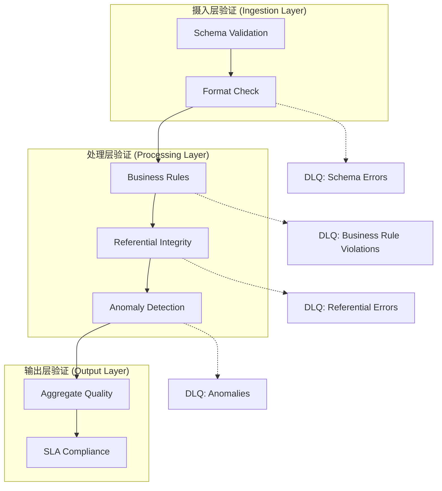
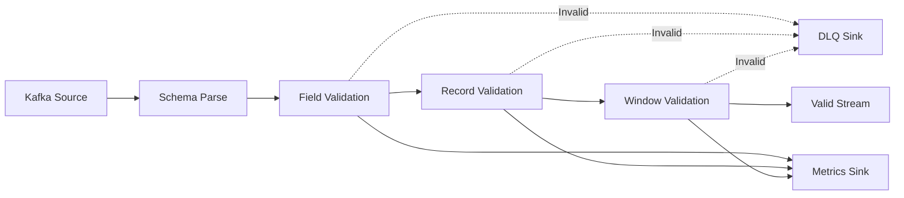
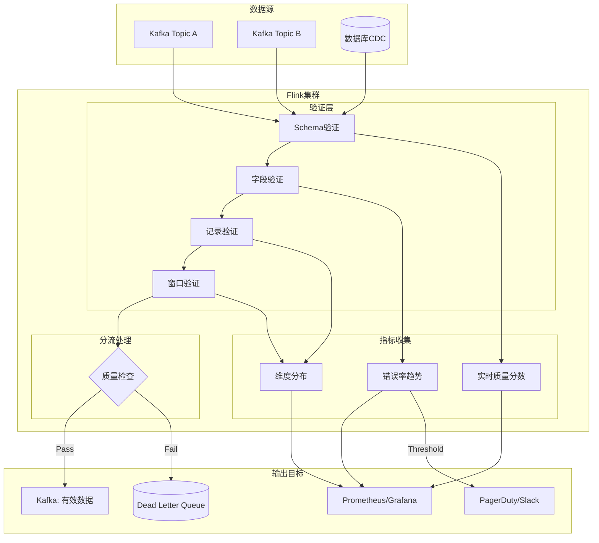
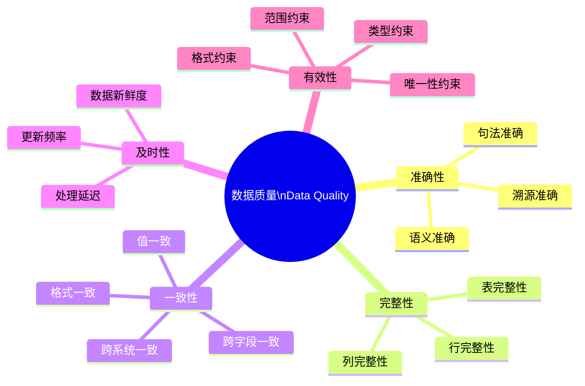
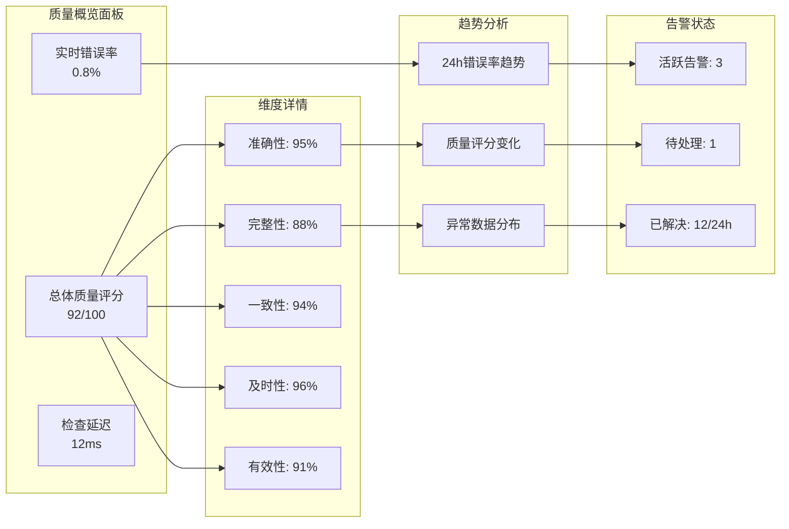
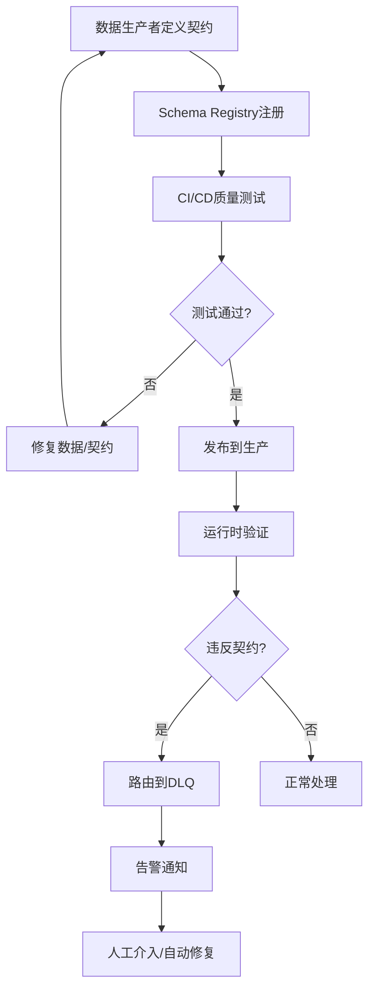

# 实时数据质量监控与验证

> 所属阶段: Flink | 前置依赖: [metrics-and-monitoring.md](./metrics-and-monitoring.md), [14-security/streaming-data-governance.md](Knowledge/08-standards/streaming-data-governance.md) | 形式化等级: L4

## 目录

- [实时数据质量监控与验证](#实时数据质量监控与验证)
  - [目录](#目录)
  - [1. 概念定义 (Definitions)](#1-概念定义-definitions)
    - [Def-F-15-20: 数据质量 (Data Quality)](#def-f-15-20-数据质量-data-quality)
    - [Def-F-15-21: 准确性 (Accuracy)](#def-f-15-21-准确性-accuracy)
    - [Def-F-15-22: 完整性 (Completeness)](#def-f-15-22-完整性-completeness)
    - [Def-F-15-23: 一致性 (Consistency)](#def-f-15-23-一致性-consistency)
    - [Def-F-15-24: 及时性 (Timeliness)](#def-f-15-24-及时性-timeliness)
    - [Def-F-15-25: 有效性 (Validity)](#def-f-15-25-有效性-validity)
    - [Def-F-15-26: 数据剖析 (Data Profiling)](#def-f-15-26-数据剖析-data-profiling)
    - [Def-F-15-27: 质量检查算子 (Quality Check Operator)](#def-f-15-27-质量检查算子-quality-check-operator)
    - [Def-F-15-28: 死信队列 (Dead Letter Queue, DLQ)](#def-f-15-28-死信队列-dead-letter-queue-dlq)
  - [2. 属性推导 (Properties)](#2-属性推导-properties)
    - [Prop-F-15-20: 质量维度独立性](#prop-f-15-20-质量维度独立性)
    - [Prop-F-15-21: 质量检查延迟边界](#prop-f-15-21-质量检查延迟边界)
    - [Prop-F-15-22: 误报率与检测覆盖率权衡](#prop-f-15-22-误报率与检测覆盖率权衡)
    - [Prop-F-15-23: 质量指标聚合的单调性](#prop-f-15-23-质量指标聚合的单调性)
  - [3. 关系建立 (Relations)](#3-关系建立-relations)
    - [3.1 与Schema Registry的关系](#31-与schema-registry的关系)
    - [3.2 与数据治理的关系](#32-与数据治理的关系)
    - [3.3 与Flink生态的集成](#33-与flink生态的集成)
  - [4. 论证过程 (Argumentation)](#4-论证过程-argumentation)
    - [4.1 实时验证必要性论证](#41-实时验证必要性论证)
    - [4.2 质量检查对吞吐的影响分析](#42-质量检查对吞吐的影响分析)
    - [4.3 异常数据隔离策略比较](#43-异常数据隔离策略比较)
  - [5. 形式证明 / 工程论证 (Proof / Engineering Argument)](#5-形式证明--工程论证-proof--engineering-argument)
    - [Thm-F-15-10: 实时质量检查的完备性定理](#thm-f-15-10-实时质量检查的完备性定理)
    - [Thm-F-15-11: 质量指标聚合的一致性定理](#thm-f-15-11-质量指标聚合的一致性定理)
    - [5.1 工具选型论证](#51-工具选型论证)
      - [工具对比矩阵](#工具对比矩阵)
      - [选型决策树](#选型决策树)
    - [5.2 实时验证架构设计](#52-实时验证架构设计)
      - [分层验证架构](#分层验证架构)
      - [质量检查流水线](#质量检查流水线)
  - [6. 实例验证 (Examples)](#6-实例验证-examples)
    - [6.1 Flink + Great Expectations 集成实现](#61-flink--great-expectations-集成实现)
      - [核心质量检查算子](#核心质量检查算子)
      - [质量检查流水线组装](#质量检查流水线组装)
      - [Great Expectations 期望配置](#great-expectations-期望配置)
    - [6.2 Soda Core 与 Flink 集成](#62-soda-core-与-flink-集成)
    - [6.3 质量指标聚合实现](#63-质量指标聚合实现)
    - [6.4 告警触发机制](#64-告警触发机制)
  - [7. 可视化 (Visualizations)](#7-可视化-visualizations)
    - [7.1 实时数据质量架构图](#71-实时数据质量架构图)
    - [7.2 质量维度关系图](#72-质量维度关系图)
    - [7.3 监控Dashboard设计](#73-监控dashboard设计)
    - [7.4 数据契约验证流程](#74-数据契约验证流程)
  - [8. 引用参考 (References)](#8-引用参考-references)

## 1. 概念定义 (Definitions)

### Def-F-15-20: 数据质量 (Data Quality)

数据质量是数据满足特定使用要求的程度，形式化定义为五元组：

$$
\text{DQ} = (D, R, V, C, T)
$$

其中：

- $D$: 数据集（Data Set）
- $R$: 参考标准集（Reference Standards）
- $V$: 有效性约束（Validity Constraints）
- $C$: 一致性规则（Consistency Rules）
- $T$: 时效性要求（Timeliness Requirements）

数据质量评分函数：

$$
\text{QualityScore}(D) = \sum_{i=1}^{5} w_i \cdot q_i(D), \quad \sum_{i=1}^{5} w_i = 1
$$

其中 $q_i$ 分别对应五个质量维度的评分。

### Def-F-15-21: 准确性 (Accuracy)

准确性衡量数据与真实世界实体或参考数据源的一致程度：

$$
\text{Accuracy}(D) = \frac{|\{d \in D : \text{Verify}(d, R) = \text{true}\}|}{|D|}
$$

其中 $\text{Verify}(d, R)$ 表示记录 $d$ 与参考标准 $R$ 的验证函数。

**子维度**：

- **语义准确性**: 数据值与真实值的一致程度
- **句法准确性**: 数据格式符合规范的程度
- **溯源准确性**: 数据来源可信且可追溯

### Def-F-15-22: 完整性 (Completeness)

完整性衡量数据集中必需字段的填充程度：

$$
\text{Completeness}(D) = 1 - \frac{\sum_{d \in D} |\{f \in F_{req} : \text{IsNull}(d.f)\}|}{|D| \cdot |F_{req}|}
$$

其中 $F_{req}$ 为必需字段集合，$d.f$ 表示记录 $d$ 的字段 $f$ 值。

**完整性类型**：

- **列完整性**: 单列非空记录占比
- **行完整性**: 单条记录必需字段填充率
- **表完整性**: 预期记录数与实际记录数的比值

### Def-F-15-23: 一致性 (Consistency)

一致性衡量数据内部及跨系统的逻辑一致程度：

$$
\text{Consistency}(D) = \frac{|\{d \in D : \forall c \in C, c(d) = \text{true}\}|}{|D|}
$$

其中 $C$ 为一致性规则集合，$c(d)$ 表示记录 $d$ 满足规则 $c$。

**一致性类别**：

- **格式一致性**: 同一字段格式统一（如日期格式）
- **值一致性**: 枚举值在有效范围内
- **跨字段一致性**: 字段间逻辑关系成立（如开始时间 < 结束时间）
- **跨系统一致性**: 不同系统间同一实体数据一致

### Def-F-15-24: 及时性 (Timeliness)

及时性衡量数据从产生到可用的延迟是否在可接受范围内：

$$
\text{Timeliness}(D) = \frac{|\{d \in D : \text{Latency}(d) \leq T_{max}\}|}{|D|}
$$

其中 $\text{Latency}(d) = T_{available}(d) - T_{produced}(d)$，$T_{max}$ 为最大允许延迟。

**时效性指标**：

- **数据新鲜度**: 当前时间与最新数据时间戳的差值
- **处理延迟**: 数据从摄入到处理的端到端延迟
- **更新频率**: 数据更新的时间间隔稳定性

### Def-F-15-25: 有效性 (Validity)

有效性衡量数据是否符合预定义的格式、类型和范围约束：

$$
\text{Validity}(D) = \frac{|\{d \in D : \forall v \in V, v(d) = \text{true}\}|}{|D|}
$$

其中 $V$ 为有效性约束集合，包括：

- **类型约束**: 数据类型匹配（整数、字符串、布尔值等）
- **范围约束**: 数值在最小/最大值范围内
- **格式约束**: 字符串匹配正则表达式模式
- **唯一性约束**: 字段值在数据集中唯一

### Def-F-15-26: 数据剖析 (Data Profiling)

数据剖析是对数据集进行统计分析以发现质量特征的过程：

$$
\text{Profile}(D) = \{\text{stats}(f) : f \in \text{Schema}(D)\}
$$

其中 $\text{stats}(f)$ 包含字段 $f$ 的：

- 基数（Cardinality）和唯一值数量
- 空值比例和分布
- 数值统计（均值、方差、分位数）
- 模式频率和异常值检测

### Def-F-15-27: 质量检查算子 (Quality Check Operator)

质量检查算子是Flink中用于实时验证数据质量的自定义算子：

$$
\text{QCO}: \text{Stream}\langle T \rangle \times \text{QC} \rightarrow \text{Stream}\langle T_{valid} \rangle \times \text{Stream}\langle T_{invalid} \rangle
$$

其中 $\text{QC}$ 为质量检查规则集合，输出分流为有效数据和异常数据。

### Def-F-15-28: 死信队列 (Dead Letter Queue, DLQ)

死信队列是用于隔离异常数据的容错机制：

$$
\text{DLQ}: \text{Stream}\langle T_{invalid} \rangle \rightarrow \text{Sink}\langle T_{invalid}, \text{Metadata} \rangle
$$

DLQ存储结构包含：

- 原始异常记录
- 失败原因（规则ID、错误类型）
- 时间戳和处理上下文
- 重试计数和状态

---

## 2. 属性推导 (Properties)

### Prop-F-15-20: 质量维度独立性

**命题**: 五个质量维度相互独立，单一维度改进不保证其他维度改善。

**形式化表述**:
$$
\forall i, j \in \{1,2,3,4,5\}, i \neq j: \frac{\partial q_j}{\partial q_i} = 0
$$

**证明概要**:

- 高准确性不保证完整性（数据可能准确但不完整）
- 高完整性不保证一致性（数据存在但逻辑矛盾）
- 高及时性可能牺牲准确性（快速但粗略的数据）

### Prop-F-15-21: 质量检查延迟边界

**命题**: 实时质量检查引入的延迟存在理论下界。

**定理**: 对于流式数据质量检查，最小处理延迟为：

$$
L_{min} = L_{parse} + L_{validate} + L_{route}
$$

其中：

- $L_{parse}$: Schema解析和反序列化时间
- $L_{validate}$: 规则评估时间，$L_{validate} = O(|QC| \cdot |d|)$
- $L_{route}$: 数据路由决策时间

**推论**: 复杂业务规则检查（如跨记录聚合）引入的延迟与窗口大小成正比。

### Prop-F-15-22: 误报率与检测覆盖率权衡

**命题**: 质量规则的严格程度与误报率存在非线性权衡关系。

设规则严格度为 $s \in [0,1]$，则：

$$
\text{FalsePositiveRate}(s) = 1 - \Phi(s; \mu, \sigma^2)
$$
$$
\text{Coverage}(s) = \Phi(s; \mu_{anomaly}, \sigma_{anomaly}^2)
$$

其中 $\Phi$ 为标准正态CDF。

**工程推论**: 存在最优严格度 $s^*$ 使得综合成本最小：

$$
s^* = \arg\min_s [\alpha \cdot \text{FPR}(s) + \beta \cdot (1 - \text{Coverage}(s))]
$$

### Prop-F-15-23: 质量指标聚合的单调性

**命题**: 在固定时间窗口内，质量指标的增量聚合具有单调收敛性。

设 $Q_t$ 为时刻 $t$ 的质量评分，$\Delta_t$ 为新到达数据的质量偏差，则：

$$
Q_{t+1} = \frac{t \cdot Q_t + \Delta_t}{t+1}
$$

**性质**:

- 当 $t \rightarrow \infty$ 时，$|Q_{t+1} - Q_t| \rightarrow 0$（稳定性）
- 若数据质量分布稳定，$Q_t$ 依概率收敛于真实质量期望值

---

## 3. 关系建立 (Relations)

### 3.1 与Schema Registry的关系

```
数据质量验证层
├─ Schema Registry (结构验证)
│  ├─ Avro Schema  → Def-F-15-25 (类型有效性)
│  ├─ JSON Schema  → Def-F-15-25 (格式有效性)
│  └─ Protobuf     → Def-F-15-25 (编码有效性)
│
└─ 业务规则层 (语义验证)
   ├─ 字段级规则   → Def-F-15-21 (准确性)
   ├─ 记录级规则   → Def-F-15-23 (一致性)
   └─ 跨记录规则   → Def-F-15-22 (完整性)
```

**映射关系**: Schema Registry提供静态结构验证，数据质量层提供动态语义验证。

### 3.2 与数据治理的关系

数据质量是数据治理的核心支柱：

| 治理维度 | 质量映射 | 控制机制 |
|---------|---------|---------|
| 数据目录 | 质量元数据 | 质量评分标签 |
| 数据血缘 | 质量溯源 | 问题根因分析 |
| 数据安全 | 敏感数据质量 | 脱敏验证 |
| 数据生命周期 | 时效性管理 | TTL质量检查 |

### 3.3 与Flink生态的集成

```
数据流: Source → Deserialize → Quality Check → Transform → Sink
                          ↓
                     DLQ (异常隔离)
                          ↓
                     Metrics (指标上报)
                          ↓
                     Alerting (告警触发)
```

---

## 4. 论证过程 (Argumentation)

### 4.1 实时验证必要性论证

**问题背景**: 批处理数据质量检查在流式场景面临挑战：

1. **延迟不可接受**: 批处理T+1延迟无法满足实时业务决策
2. **错误放大效应**: 质量问题延迟发现导致下游级联污染
3. **修复成本指数增长**: 问题发现越晚，修复成本越高

**定量分析**:

假设数据质量问题发现时间为 $t_d$，修复成本模型：

$$
\text{Cost}(t_d) = C_{fix} \cdot (1 + r)^{t_d} + C_{reputation} \cdot \mathbb{I}(t_d > T_{SLA})
$$

其中：

- $C_{fix}$: 即时修复成本
- $r$: 问题传播增长率
- $C_{reputation}$: 声誉损失成本

**结论**: 实时验证 ($t_d \approx 0$) 可将修复成本降低 $(1+r)^{T_{batch}}$ 倍。

### 4.2 质量检查对吞吐的影响分析

设无质量检查的吞吐为 $T_0$，引入质量检查后的吞吐为：

$$
T_{qc} = \frac{T_0}{1 + \alpha \cdot |QC| + \beta \cdot \text{Complexity}(QC)}
$$

其中：

- $\alpha$: 单规则处理开销系数
- $\beta$: 复杂规则计算系数
- $|QC|$: 规则数量

**优化策略**:

- 预编译规则表达式降低 $\alpha$
- 异步规则检查降低 $\beta$
- 规则分组并行执行

### 4.3 异常数据隔离策略比较

| 策略 | 延迟影响 | 数据丢失风险 | 实现复杂度 | 适用场景 |
|-----|---------|-------------|-----------|---------|
| 直接丢弃 | 最低 | 高 | 低 | 非关键数据 |
| 死信队列 | 低 | 低 | 中 | 可重试异常 |
| 旁路输出 | 中 | 极低 | 中 | 审计要求 |
| 暂停处理 | 高 | 无 | 高 | 关键质量问题 |

---

## 5. 形式证明 / 工程论证 (Proof / Engineering Argument)

### Thm-F-15-10: 实时质量检查的完备性定理

**定理**: 对于任意数据流 $S$ 和质量规则集 $QC$，若规则集覆盖所有质量维度，则实时质量检查系统能够检测所有可定义的质量缺陷。

**形式化表述**:
$$
\forall d \in S, \exists q \in QC : \text{QualityDefect}(d, q) \Rightarrow \text{Detected}(d, q)
$$

**证明**:

1. **完备性假设**: 设 $QC$ 覆盖五维度：
   - $QC_{accuracy} \subseteq QC$ 覆盖准确性规则
   - $QC_{completeness} \subseteq QC$ 覆盖完整性规则
   - $QC_{consistency} \subseteq QC$ 覆盖一致性规则
   - $QC_{timeliness} \subseteq QC$ 覆盖及时性规则
   - $QC_{validity} \subseteq QC$ 覆盖有效性规则

2. **检测覆盖**: 对于任意质量缺陷 $\delta$ 作用于记录 $d$：
   - 若 $\delta$ 为准确性缺陷，$\exists q \in QC_{accuracy}: q(d) = \text{false}$
   - 若 $\delta$ 为完整性缺陷，$\exists q \in QC_{completeness}: q(d) = \text{false}$
   - 其他维度同理

3. **检测机制**: 质量检查算子 (Def-F-15-27) 对每个输入记录顺序评估所有规则：
   $$
   \text{Detect}(d) = \bigvee_{q \in QC} \neg q(d)
   $$

4. **结论**: 由逻辑或的性质，任一规则失败即触发检测，证毕。

### Thm-F-15-11: 质量指标聚合的一致性定理

**定理**: 在Flink的Checkpoint机制下，质量指标的增量聚合满足最终一致性。

**证明**:

1. 设质量聚合状态为 $S_t = (\sum Q, \sum N, T_{window})$，其中：
   - $\sum Q$: 质量评分总和
   - $\sum N$: 记录计数
   - $T_{window}$: 窗口边界

2. Flink的Checkpoint机制保证：
   - 状态快照的原子性: $\text{Snapshot}(S_t)$ 在时刻 $t$ 捕获完整状态
   - 故障恢复的一致性: 从Checkpoint $C$ 恢复后，$S_{recovered} = S_C$

3. 聚合计算的确定性：
   $$
   \text{AvgQuality} = \frac{\sum Q}{\sum N}
   $$
   该计算为纯函数，无外部依赖

4. 由Flink的Exactly-Once语义，每条记录的质量评分恰好贡献一次，最终聚合值收敛于真实值。

### 5.1 工具选型论证

#### 工具对比矩阵

| 特性 | Great Expectations | Soda Core | Deequ | DQX | Confluent |
|-----|-------------------|-----------|-------|-----|-----------|
| 开源许可 | Apache 2.0 | Apache 2.0 | Apache 2.0 | 商业 | 商业 |
| 流式支持 | 实验性 | 原生支持 | 有限 | 原生 | 原生 |
| Flink集成 | 自定义 | 原生 | 无 | 无 | 原生 |
| 规则表达 | Python/DSL | YAML/SQL | Scala DSL | UI/DSL | UI/DSL |
| 生态系统 | 广泛 | 增长中 | AWS原生 | Databricks | Kafka生态 |
| 学习曲线 | 中等 | 低 | 高 | 低 | 低 |

#### 选型决策树

```
选择数据质量工具
├─ 是否Kafka原生?
│  ├─ 是 → Confluent Data Quality
│  └─ 否 → 继续
├─ 是否AWS环境?
│  ├─ 是 → Deequ
│  └─ 否 → 继续
├─ 是否Databricks?
│  ├─ 是 → DQX
│  └─ 否 → 继续
├─ 是否需要Flink原生?
│  ├─ 是 → Soda Core
│  └─ 否 → Great Expectations
```

### 5.2 实时验证架构设计

#### 分层验证架构



#### 质量检查流水线



---

## 6. 实例验证 (Examples)

### 6.1 Flink + Great Expectations 集成实现

#### 核心质量检查算子

```java
import org.apache.flink.streaming.api.functions.ProcessFunction;
import org.apache.flink.util.Collector;
import org.apache.flink.util.OutputTag;
import great_expectations.core.ExpectationSuite;
import great_expectations.core.ExpectationValidationResult;

/**
 * Flink质量检查算子 - 集成Great Expectations
 */
public class QualityCheckOperator<T> extends ProcessFunction<T, T> {

    private final OutputTag<QualityViolation> dlqTag;
    private final ExpectationSuite expectationSuite;
    private transient QualityMetrics metrics;

    public QualityCheckOperator(
            ExpectationSuite suite,
            OutputTag<QualityViolation> dlqTag) {
        this.expectationSuite = suite;
        this.dlqTag = dlqTag;
    }

    @Override
    public void open(Configuration parameters) {
        this.metrics = new QualityMetrics(
            getRuntimeContext().getMetricGroup()
        );
    }

    @Override
    public void processElement(
            T element,
            Context ctx,
            Collector<T> out) {

        long startTime = System.currentTimeMillis();

        // 执行Great Expectations验证
        ExpectationValidationResult result =
            expectationSuite.validate(element);

        long validationTime = System.currentTimeMillis() - startTime;
        metrics.recordValidationLatency(validationTime);

        if (result.isSuccessful()) {
            // 质量检查通过
            out.collect(element);
            metrics.recordValidRecord();
        } else {
            // 路由到DLQ
            QualityViolation violation = new QualityViolation(
                element,
                result.getFailedExpectations(),
                ctx.timestamp()
            );
            ctx.output(dlqTag, violation);
            metrics.recordInvalidRecord(
                result.getFailedExpectations().size()
            );
        }
    }
}
```

#### 质量检查流水线组装

```java
import org.apache.flink.streaming.api.datastream.DataStream;
import org.apache.flink.streaming.api.datastream.SingleOutputStreamOperator;
import org.apache.flink.util.OutputTag;

public class QualityPipeline {

    public static void buildPipeline(
            StreamExecutionEnvironment env,
            KafkaSource<OrderEvent> source) {

        // 定义DLQ输出标签
        final OutputTag<QualityViolation> dlqTag =
            new OutputTag<QualityViolation>("dlq"){};

        // 主数据流
        DataStream<OrderEvent> inputStream = env.fromSource(
            source, WatermarkStrategy.forBoundedOutOfOrderness(
                Duration.ofSeconds(5)), "Kafka Source"
        );

        // 1. Schema验证层
        SingleOutputStreamOperator<OrderEvent> schemaValidated =
            inputStream
                .process(new SchemaValidationOperator())
                .name("Schema Validation")
                .uid("schema-validation");

        // 2. 字段级验证
        SingleOutputStreamOperator<OrderEvent> fieldValidated =
            schemaValidated
                .process(new QualityCheckOperator<>(
                    buildFieldExpectations(),
                    dlqTag
                ))
                .name("Field Validation")
                .uid("field-validation");

        // 3. 记录级验证（跨字段规则）
        SingleOutputStreamOperator<OrderEvent> recordValidated =
            fieldValidated
                .process(new QualityCheckOperator<>(
                    buildRecordExpectations(),
                    dlqTag
                ))
                .name("Record Validation")
                .uid("record-validation");

        // 4. 窗口级验证（聚合规则）
        SingleOutputStreamOperator<OrderEvent> windowValidated =
            recordValidated
                .keyBy(OrderEvent::getMerchantId)
                .window(TumblingEventTimeWindows.of(Time.minutes(1)))
                .process(new WindowQualityCheckFunction())
                .name("Window Validation")
                .uid("window-validation");

        // 有效数据输出
        windowValidated
            .addSink(buildKafkaSink("validated-orders"))
            .name("Valid Records Sink");

        // DLQ输出
        windowValidated
            .getSideOutput(dlqTag)
            .addSink(buildDLQSink())
            .name("DLQ Sink");

        // 质量指标输出
        windowValidated
            .getSideOutput(metricsTag)
            .addSink(buildMetricsSink())
            .name("Metrics Sink");
    }

    private static ExpectationSuite buildFieldExpectations() {
        return new ExpectationSuite()
            .addExpectation("order_id_not_null",
                ExpectColumnValuesToNotBeNull("order_id"))
            .addExpectation("amount_positive",
                ExpectColumnValuesToBeBetween("amount", 0, 1000000))
            .addExpectation("status_enum",
                ExpectColumnValuesToBeInSet("status",
                    Set.of("PENDING", "PAID", "SHIPPED", "DELIVERED")))
            .addExpectation("email_format",
                ExpectColumnValuesToMatchRegex("email",
                    "^[A-Za-z0-9+_.-]+@(.+)$"));
    }

    private static ExpectationSuite buildRecordExpectations() {
        return new ExpectationSuite()
            .addExpectation("create_before_update",
                ExpectColumnPairValuesAToBeGreaterThanB(
                    "updated_at", "created_at"))
            .addExpectation("total_calculation",
                ExpectMulticolumnSumToEqual(
                    List.of("subtotal", "tax", "shipping"), "total"));
    }
}
```

#### Great Expectations 期望配置

```yaml
# expectations/order_expectations.yaml
expectation_suite_name: order_quality_suite

expectations:
  # 完整性检查
  - expectation_type: expect_column_values_to_not_be_null
    kwargs:
      column: order_id
      mostly: 1.0
    meta:
      dimension: completeness
      severity: critical

  - expectation_type: expect_column_values_to_not_be_null
    kwargs:
      column: customer_id
      mostly: 0.99
    meta:
      dimension: completeness
      severity: warning

  # 有效性检查
  - expectation_type: expect_column_values_to_be_between
    kwargs:
      column: order_amount
      min_value: 0
      max_value: 100000
    meta:
      dimension: validity
      severity: critical

  - expectation_type: expect_column_values_to_match_regex
    kwargs:
      column: email
      regex: ^[\w\.-]+@[\w\.-]+\.\w+$
    meta:
      dimension: validity
      severity: warning

  # 一致性检查
  - expectation_type: expect_column_pair_values_a_to_be_greater_than_b
    kwargs:
      column_A: updated_at
      column_B: created_at
      or_equal: true
    meta:
      dimension: consistency
      severity: critical

  # 准确性检查
  - expectation_type: expect_column_values_to_be_in_set
    kwargs:
      column: payment_method
      value_set: [CREDIT_CARD, DEBIT_CARD, PAYPAL, BANK_TRANSFER]
    meta:
      dimension: accuracy
      severity: critical
```

### 6.2 Soda Core 与 Flink 集成

```java
/**
 * Soda Core 质量检查实现
 */
public class SodaQualityCheck implements QualityChecker {

    private final SodaContext sodaContext;
    private final String checksYaml;

    @Override
    public QualityResult check(Row record) {
        // 构建Soda扫描
        ScanBuilder scanBuilder = ScanBuilder
            .create(sodaContext)
            .withCheckYaml(checksYaml);

        // 执行检查
        ScanResult result = scanBuilder.executeOnRow(record);

        // 转换为统一结果格式
        return new QualityResult(
            result.hasFailures(),
            result.getFailedChecks(),
            result.getMetrics()
        );
    }
}
```

```yaml
# soda_checks.yaml
# 检查定义
checks for orders:
  # 完整性
  - missing_count(order_id) = 0
  - missing_percent(customer_email) < 1

  # 有效性
  - min(order_amount) >= 0
  - max(order_amount) < 1000000
  - invalid_count(email) = 0:
      valid format: email

  # 一致性
  - row_count > 0:
      name: Orders have records

  # 及时性
  - freshness(order_timestamp) < 1h:
      name: Data is fresh

  # 自定义SQL检查
  - orders_amount_consistent:
      orders_sql: |
        SELECT order_id, SUM(item_price * quantity) as calc_total
        FROM order_items
        GROUP BY order_id
      check_sql: |
        SELECT o.order_id
        FROM orders o
        JOIN ${orders_sql} c ON o.order_id = c.order_id
        WHERE ABS(o.total_amount - c.calc_total) > 0.01
```

### 6.3 质量指标聚合实现

```java
/**
 * 质量指标窗口聚合
 */
public class QualityMetricsAggregateFunction
    extends AggregateFunction<QualityEvent, QualityAccumulator, QualityMetrics> {

    @Override
    public QualityAccumulator createAccumulator() {
        return new QualityAccumulator();
    }

    @Override
    public void add(QualityEvent event, QualityAccumulator acc) {
        acc.totalRecords++;
        acc.validRecords += event.isValid() ? 1 : 0;

        // 按维度聚合
        for (String dimension : event.getFailedDimensions()) {
            acc.dimensionFailures.merge(dimension, 1, Integer::sum);
        }

        // 延迟统计
        acc.totalLatency += event.getValidationLatency();
    }

    @Override
    public QualityMetrics getResult(QualityAccumulator acc) {
        return QualityMetrics.builder()
            .totalRecords(acc.totalRecords)
            .validRecords(acc.validRecords)
            .errorRate((acc.totalRecords - acc.validRecords) / (double) acc.totalRecords)
            .avgLatency(acc.totalLatency / acc.totalRecords)
            .dimensionFailures(new HashMap<>(acc.dimensionFailures))
            .build();
    }

    @Override
    public void merge(QualityAccumulator a, QualityAccumulator b) {
        a.totalRecords += b.totalRecords;
        a.validRecords += b.validRecords;
        a.totalLatency += b.totalLatency;
        b.dimensionFailures.forEach((k, v) ->
            a.dimensionFailures.merge(k, v, Integer::sum)
        );
    }
}
```

### 6.4 告警触发机制

```java
/**
 * 质量告警处理器
 */
public class QualityAlertHandler extends ProcessFunction<QualityMetrics, Alert> {

    private final AlertConfiguration config;
    private transient ValueState<AlertState> alertState;

    @Override
    public void processElement(
            QualityMetrics metrics,
            Context ctx,
            Collector<Alert> out) {

        AlertState state = alertState.value();
        if (state == null) {
            state = new AlertState();
        }

        // 检查错误率阈值
        if (metrics.getErrorRate() > config.getErrorRateThreshold()) {
            if (state.lastErrorAlert == null ||
                ctx.timestamp() - state.lastErrorAlert > config.getAlertCooldown()) {

                out.collect(new Alert(
                    AlertSeverity.HIGH,
                    "DATA_QUALITY_ERROR_RATE",
                    String.format("Error rate %.2f%% exceeds threshold %.2f%%",
                        metrics.getErrorRate() * 100,
                        config.getErrorRateThreshold() * 100),
                    metrics
                ));
                state.lastErrorAlert = ctx.timestamp();
            }
        }

        // 检查完整性阈值
        Double completeness = metrics.getDimensionScore("completeness");
        if (completeness != null && completeness < config.getCompletenessThreshold()) {
            out.collect(new Alert(
                AlertSeverity.MEDIUM,
                "DATA_QUALITY_COMPLETENESS",
                String.format("Completeness %.2f%% below threshold %.2f%%",
                    completeness * 100,
                    config.getCompletenessThreshold() * 100),
                metrics
            ));
        }

        // 检查延迟阈值
        if (metrics.getAvgLatency() > config.getLatencyThreshold()) {
            out.collect(new Alert(
                AlertSeverity.LOW,
                "DATA_QUALITY_LATENCY",
                String.format("Avg validation latency %dms exceeds %dms",
                    metrics.getAvgLatency(),
                    config.getLatencyThreshold()),
                metrics
            ));
        }

        alertState.update(state);
    }
}
```

---

## 7. 可视化 (Visualizations)

### 7.1 实时数据质量架构图



### 7.2 质量维度关系图



### 7.3 监控Dashboard设计



### 7.4 数据契约验证流程



---

## 8. 引用参考 (References)


---

*文档版本: v1.0 | 创建日期: 2026-04-03 | 状态: Production*
