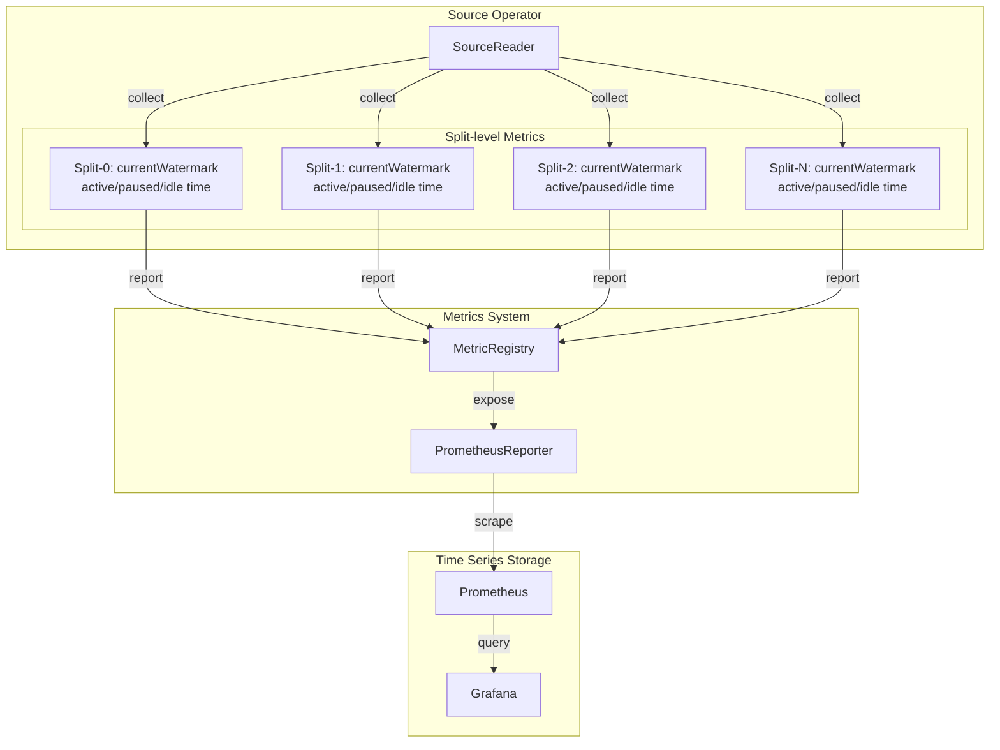
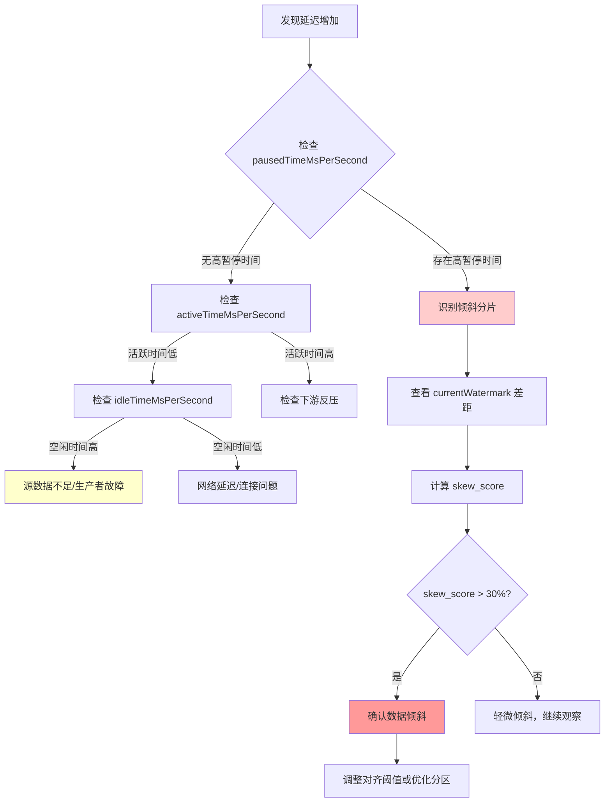
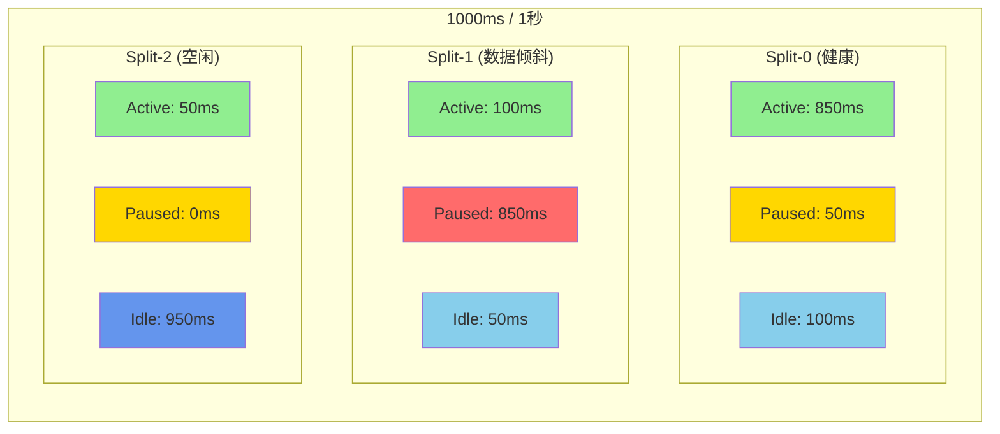

# Flink 2.1 Split-level Watermark指标 - 细粒度可观测性

> 所属阶段: Flink | 前置依赖: [metrics-and-monitoring.md](./metrics-and-monitoring.md), [time-semantics-and-watermark.md](../02-core-mechanisms/time-semantics-and-watermark.md) | 形式化等级: L3

## 1. 概念定义 (Definitions)

### Def-F-15-09: Split-level指标 (Split-level Metrics)

Split-level指标是Flink 2.1引入的细粒度源连接器(Source Connector)指标，提供**分片级别**的实时状态可见性：

**定义**: 设源$S$由$k$个分片$\{split_1, split_2, ..., split_k\}$组成，Split-level指标是针对每个$split_i$独立采集的时间序列数据：

$$
M_{split}(split_i, t) = \langle w_i(t), a_i(t), p_i(t), idle_i(t) \rangle
$$

其中：

- $w_i(t)$: 分片$split_i$在时刻$t$的当前Watermark值
- $a_i(t)$: 分片在时刻$t$的活跃时间(active time)
- $p_i(t)$: 分片在时刻$t$的暂停时间(paused time)
- $idle_i(t)$: 分片在时刻$t$的空闲时间(idle time)

与传统Operator-level指标不同，Split-level指标能够揭示**单个分片**的行为特征，而非聚合后的平均值。

### Def-F-15-10: Watermark进度度量 (Watermark Progress Metrics)

Watermark进度度量描述事件时间(Event Time)在处理管道中的推进情况：

**定义**: 对于源分片$split_i$，其Watermark进度定义为：

$$
WP(split_i, t) = \min_{e \in B_i(t)} \{ T_{event}(e) \}
$$

其中：

- $B_i(t)$: 分片$split_i$在时刻$t$的待处理记录缓冲区
- $T_{event}(e)$: 记录$e$的事件时间戳

全局Watermark由所有分片的Watermark取最小值决定：

$$
WP_{global}(t) = \min_{i=1}^{k} WP(split_i, t)
$$

**Flink 2.1新增指标**: `currentWatermark` 直接暴露每个分片的$WP(split_i, t)$值。

### Def-F-15-11: 活动时间/暂停时间/空闲时间 (Active/Paused/Idle Time)

**定义**: 分片生命周期状态的时间分布由三个互斥且完备的时间分量构成：

设$\Delta t$为采样周期（通常为1秒），则分片$split_i$在$[t, t+\Delta t]$期间的状态时间为：

$$
\Delta t = T_{active}^{(i)} + T_{paused}^{(i)} + T_{idle}^{(i)}
$$

**活动时间 (Active Time)**:
$$
T_{active}^{(i)} = \int_{t}^{t+\Delta t} \mathbb{1}_{[状态=READING]}(\tau) \, d\tau
$$
分片正在从数据源读取记录并向下游发送的时间。

**暂停时间 (Paused Time)**:
$$
T_{paused}^{(i)} = \int_{t}^{t+\Delta t} \mathbb{1}_{[状态=PAUSED]}(\tau) \, d\tau
$$
分片因Watermark对齐策略暂停读取的时间（用于处理数据倾斜）。

**空闲时间 (Idle Time)**:
$$
T_{idle}^{(i)} = \int_{t}^{t+\Delta t} \mathbb{1}_{[状态=IDLE]}(\tau) \, d\tau
$$
分片因无新数据可用而处于空闲状态的时间。

---

## 2. 属性推导 (Properties)

### Prop-F-15-05: 时间分布归一性

**命题**: 对于任意分片$split_i$和任意采样周期$\Delta t$，活动时间、暂停时间和空闲时间满足：

$$
activeTimeMsPerSecond + pausedTimeMsPerSecond + idleTimeMsPerSecond = 1000 \, (ms)
$$

**证明概要**:

由Def-F-15-11的定义，三个状态构成完备事件组：

- 分片在任意时刻只能处于 `READING`、`PAUSED`、`IDLE` 三种状态之一
- 根据状态机设计，状态转移是确定性的且互斥的
- 因此时间积分覆盖整个采样周期：

$$
\begin{aligned}
&\int_{t}^{t+\Delta t} \left[ \mathbb{1}_{[READING]}(\tau) + \mathbb{1}_{[PAUSED]}(\tau) + \mathbb{1}_{[IDLE]}(\tau) \right] d\tau \\
=& \int_{t}^{t+\Delta t} 1 \, d\tau = \Delta t = 1000ms
\end{aligned}
$$

∎

### Prop-F-15-06: Watermark对齐下的暂停时间单调性

**命题**: 当启用Watermark对齐(Alignment)时，进度领先分片的暂停时间与其Watermark领先程度正相关：

$$
split_i \text{ leads} \Rightarrow T_{paused}^{(i)} \propto \left( WP(split_i, t) - WP_{global}(t) \right)
$$

**证明概要**:

1. 设$WP_{global}(t) = \min_j WP(split_j, t)$，即最慢分片的Watermark
2. 当$WP(split_i, t) - WP_{global}(t) > threshold$时，对齐策略触发
3. 源连接器暂停向$split_i$分配读取任务，$T_{paused}^{(i)}$开始累积
4. 领先差距越大，需要等待其他分片追上的时间越长

因此，暂停时间反映了分片间的Watermark差距，是数据倾斜的量化指标。

### Prop-F-15-07: 空闲检测的Watermark推进冻结

**命题**: 当分片进入空闲状态时，其Watermark推进被冻结，不再影响全局Watermark：

$$
T_{idle}^{(i)} > 0 \Rightarrow WP(split_i, t) = WP(split_i, t_{idle\_start})
$$

**证明概要**:

1. 空闲状态由`SourceReader#reportIdle()`触发
2. 空闲分片从全局Watermark计算中排除：

$$
WP_{global}^{\prime}(t) = \min_{j: T_{idle}^{(j)} = 0} WP(split_j, t)
$$

1. 该机制防止慢速或停滞分片阻塞整个管道的Watermark推进

---

## 3. 关系建立 (Relations)

### 3.1 Split-level指标与传统指标对比

| 维度 | Operator-level指标 | Split-level指标 (Flink 2.1) |
|------|---------------------|------------------------------|
| **粒度** | 整个Source算子聚合 | 每个分片独立 |
| **Watermark可见性** | 仅全局Watermark | 每分片Watermark + 全局 |
| **时间分解** | 无 | 活跃/暂停/空闲三态 |
| **数据倾斜检测** | 间接（通过延迟推断） | 直接（通过暂停时间量化） |
| **采集开销** | 低 | 中等（与分片数成正比） |
| **适用场景** | 健康监控 | 问题诊断与优化 |

### 3.2 Split-level指标七元组定义

Flink 2.1新增的7个Split-level指标构成完整的分片状态描述：

```
┌─────────────────────────────────────────────────────────────┐
│                    Split State Snapshot                     │
├─────────────────────────────────────────────────────────────┤
│  currentWatermark          →  当前Watermark值 (epoch ms)    │
│  activeTimeMsPerSecond     →  每秒活跃时间 (0-1000ms)       │
│  pausedTimeMsPerSecond     →  每秒暂停时间 (0-1000ms)       │
│  idleTimeMsPerSecond       →  每秒空闲时间 (0-1000ms)       │
│  accumulatedActiveTimeMs   →  累计活跃时间 (ms)             │
│  accumulatedPausedTimeMs   →  累计暂停时间 (ms)             │
│  accumulatedIdleTimeMs     →  累计空闲时间 (ms)             │
└─────────────────────────────────────────────────────────────┘
```

### 3.3 指标关联矩阵

| 诊断目标 | 关键指标组合 | 关系说明 |
|----------|--------------|----------|
| 数据倾斜 | `pausedTimeMsPerSecond` + `currentWatermark` | 暂停时间长且Watermark领先表明倾斜 |
| 源读取瓶颈 | `activeTimeMsPerSecond` vs 预期吞吐量 | 活跃时间长但吞吐低表明读取瓶颈 |
| 空闲源 | `idleTimeMsPerSecond` > 阈值 | 空闲时间占比高表明数据流入不足 |
| Watermark停滞 | `currentWatermark` 不变 + `pausedTimeMsPerSecond`=0 | 无推进且无暂停表明源问题 |

---

## 4. 论证过程 (Argumentation)

### 4.1 数据倾斜检测方法论对比

#### 传统方法：基于延迟推断

**原理**: 通过观察下游算子的`records-lag-max`或输出延迟来推断数据倾斜。

**局限性**:

- 滞后性：延迟是倾斜的间接结果，检测时倾斜已影响业务
- 模糊性：无法区分是数据倾斜还是源读取能力不足
- 粒度缺失：只能定位到算子级别，无法定位具体分片

#### Flink 2.1方法：基于暂停时间量化

**原理**: 直接测量每个分片因Watermark对齐而被迫暂停的时间。

**优势**:

- 实时性：暂停时间在对齐策略触发时立即累积
- 精确性：量化了倾斜的严重程度（毫秒级精度）
- 可定位：直接指向具体分片（如Kafka的特定Partition）

**倾斜严重度评分**:

$$
SkewScore(split_i) = \frac{accumulatedPausedTimeMs}{accumulatedActiveTimeMs + accumulatedPausedTimeMs} \times 100\%
$$

| 评分区间 | 倾斜等级 | 建议动作 |
|----------|----------|----------|
| 0-10% | 正常 | 无需干预 |
| 10-30% | 轻度倾斜 | 监控观察 |
| 30-50% | 中度倾斜 | 考虑调整对齐阈值 |
| >50% | 严重倾斜 | 必须优化数据分布 |

### 4.2 Watermark对齐策略与暂停时间的关系

Flink的Watermark对齐机制（`watermarkAlignment`）通过以下逻辑控制暂停时间：

```
if (splitWatermark - globalWatermark > maxWatermarkDrift):
    pauseSplit(split)      # 暂停读取，pausedTime开始累积
    waitForGlobalAdvance() # 等待全局Watermark追上
else:
    resumeSplit(split)     # 恢复读取，activeTime累积
```

**配置参数对暂停时间的影响**:

| 参数 | 说明 | 对暂停时间的影响 |
|------|------|------------------|
| `alignment.max-watermark-drift` | 允许的最大Watermark差距 | 值越小，暂停越频繁 |
| `alignment.max-split-watermark-gap` | 分片间最大差距 | 影响触发条件 |

### 4.3 空闲源检测机制

空闲源的识别依赖于`idleTimeout`配置：

```
if (noRecordsFetchedFor(split, idleTimeout)):
    markIdle(split)        # 标记为空闲，idleTime开始累积
    excludeFromAlignment(split)  # 不参与Watermark对齐
```

**空闲与暂停的本质区别**:

- **空闲**: 数据源无数据可读取（外部因素）
- **暂停**: 有数据但故意不读取（内部控制策略）

---

## 5. 工程论证 (Engineering Argument)

### 5.1 Prometheus指标暴露配置

Flink 2.1通过`PrometheusReporter`暴露Split-level指标，配置如下：

```yaml
# flink-conf.yaml
metrics.reporters: prom
metrics.reporter.prom.class: org.apache.flink.metrics.prometheus.PrometheusReporter
metrics.reporter.prom.port: 9249

# 启用Split-level指标采集
metrics.scope.source.split: "<host>.<job_name>.<source_id>.<split_id>"
```

**暴露的指标格式**:

```
flink_taskmanager_job_task_source_split_currentWatermark{split_id="partition-0"}
flink_taskmanager_job_task_source_split_activeTimeMsPerSecond{split_id="partition-0"}
flink_taskmanager_job_task_source_split_pausedTimeMsPerSecond{split_id="partition-0"}
flink_taskmanager_job_task_source_split_idleTimeMsPerSecond{split_id="partition-0"}
flink_taskmanager_job_task_source_split_accumulatedActiveTimeMs{split_id="partition-0"}
flink_taskmanager_job_task_source_split_accumulatedPausedTimeMs{split_id="partition-0"}
flink_taskmanager_job_task_source_split_accumulatedIdleTimeMs{split_id="partition-0"}
```

**论证**:

- 使用`split_id`标签支持PromQL的分片级聚合与过滤
- 符合OpenMetrics标准，兼容Grafana等可视化工具

### 5.2 Grafana仪表盘配置

**Split-level Watermark监控面板**:

```json
{
  "title": "Split-level Watermark Progress",
  "type": "timeseries",
  "targets": [
    {
      "expr": "flink_taskmanager_job_task_source_split_currentWatermark",
      "legendFormat": "{{split_id}}",
      "refId": "A"
    }
  ],
  "fieldConfig": {
    "unit": "dateTimeAsIso",
    "min": 0,
    "custom": {
      "lineWidth": 2,
      "fillOpacity": 10
    }
  }
}
```

**时间分布堆叠图**:

```json
{
  "title": "Split Time Distribution (ms/s)",
  "type": "barchart",
  "targets": [
    {
      "expr": "flink_taskmanager_job_task_source_split_activeTimeMsPerSecond",
      "legendFormat": "Active - {{split_id}}"
    },
    {
      "expr": "flink_taskmanager_job_task_source_split_pausedTimeMsPerSecond",
      "legendFormat": "Paused - {{split_id}}"
    },
    {
      "expr": "flink_taskmanager_job_task_source_split_idleTimeMsPerSecond",
      "legendFormat": "Idle - {{split_id}}"
    }
  ],
  "fieldConfig": {
    "stacking": { "mode": "normal" },
    "unit": "ms"
  }
}
```

### 5.3 告警规则设计

**数据倾斜告警**:

```yaml
# Prometheus告警规则
groups:
  - name: flink_split_level_alerts
    rules:
      - alert: FlinkSplitHighPausedTime
        expr: |
          (
            flink_taskmanager_job_task_source_split_pausedTimeMsPerSecond
            /
            (flink_taskmanager_job_task_source_split_activeTimeMsPerSecond
             + flink_taskmanager_job_task_source_split_pausedTimeMsPerSecond)
          ) > 0.3
        for: 5m
        labels:
          severity: warning
        annotations:
          summary: "Flink Source Split experiencing data skew"
          description: "Split {{ $labels.split_id }} has {{ $value | humanizePercentage }} paused time due to watermark alignment"
```

**空闲源告警**:

```yaml
      - alert: FlinkSplitIdleTimeout
        expr: |
          flink_taskmanager_job_task_source_split_idleTimeMsPerSecond > 900
        for: 10m
        labels:
          severity: info
        annotations:
          summary: "Flink Source Split is idle"
          description: "Split {{ $labels.split_id }} has been idle for extended period"
```

**Watermark停滞告警**:

```yaml
      - alert: FlinkSplitWatermarkStalled
        expr: |
          (
            changes(flink_taskmanager_job_task_source_split_currentWatermark[5m]) == 0
            and
            flink_taskmanager_job_task_source_split_pausedTimeMsPerSecond == 0
            and
            flink_taskmanager_job_task_source_split_activeTimeMsPerSecond > 100
          )
        for: 3m
        labels:
          severity: critical
        annotations:
          summary: "Flink Source Split watermark is stalled"
          description: "Split {{ $labels.split_id }} is active but watermark not advancing"
```

---

## 6. 实例验证 (Examples)

### 6.1 Kafka分片Watermark监控

**场景**: Kafka Topic有12个Partition，Flink作业使用`FlinkKafkaConsumer`读取。

**监控目标**: 检测哪个Partition产生数据倾斜。

**PromQL查询**:

```promql
# 各Partition的当前Watermark
flink_taskmanager_job_task_source_split_currentWatermark{job="flink-job", source_id="KafkaSource"}

# 计算Watermark差距（与最小值之差）
(
  flink_taskmanager_job_task_source_split_currentWatermark
  -
  min by (source_id) (flink_taskmanager_job_task_source_split_currentWatermark)
) / 1000  # 转换为秒

# 各Partition的暂停时间占比（倾斜指标）
(
  flink_taskmanager_job_task_source_split_accumulatedPausedTimeMs
  /
  (
    flink_taskmanager_job_task_source_split_accumulatedActiveTimeMs
    + flink_taskmanager_job_task_source_split_accumulatedPausedTimeMs
  )
) * 100
```

**诊断输出示例**:

```
split_id        | currentWatermark | pausedTimeMsPerSecond | skew_score
----------------|------------------|-----------------------|------------
partition-0     | 1743580800000    | 50                    | 5%
partition-1     | 1743580800000    | 45                    | 4%
partition-2     | 1743584400000    | 850                   | 85%  <-- 严重倾斜
partition-3     | 1743580800000    | 60                    | 6%
...
```

**结论**: `partition-2`的Watermark领先其他分区1小时，暂停时间占比85%，存在严重数据倾斜。

### 6.2 数据倾斜诊断案例

**问题现象**: 用户报告窗口计算延迟持续增加，但Kafka消费者组Lag正常。

**诊断步骤**:

1. **查看全局Watermark**: 发现全局Watermark推进缓慢

```promql
min(flink_taskmanager_job_task_source_split_currentWatermark)
```

1. **查看各分片Watermark**: 发现大部分分片Watermark正常，但`partition-5`停滞不前

```promql
flink_taskmanager_job_task_source_split_currentWatermark
```

1. **分析时间分布**: 发现`partition-5`的`idleTimeMsPerSecond`接近1000ms

```promql
flink_taskmanager_job_task_source_split_idleTimeMsPerSecond{split_id="partition-5"}
```

1. **根因定位**: 该Partition的数据生产者出现故障，无新数据写入

**解决方案**:

- 检查上游数据生产者状态
- 考虑启用空闲超时自动推进该分片的Watermark
- 或调整Watermark策略，对该分片使用处理时间

### 6.3 源读取性能分析

**场景**: 评估Kafka Source的读取效率。

**分析查询**:

```promql
# 各分片的活跃时间占比（读取效率）
(
  flink_taskmanager_job_task_source_split_activeTimeMsPerSecond / 1000
) * 100

# 结合读取速率评估效率
flink_taskmanager_job_task_source_split_activeTimeMsPerSecond
and
flink_taskmanager_job_task_operator_numRecordsInPerSecond
```

**性能解读**:

| activeTime占比 | 吞吐率 | 解读 |
|----------------|--------|------|
| 高 (>80%) | 高 | 读取效率高，充分利用资源 |
| 高 (>80%) | 低 | 可能存在反压，下游处理慢 |
| 低 (<20%) | 低 | 源数据不足或网络延迟 |
| 中 (20-80%) | 中 | 正常波动范围 |

---

## 7. 可视化 (Visualizations)

### 7.1 Split-level指标架构图

Split-level指标在Flink监控体系中的位置：



### 7.2 数据倾斜诊断决策树

使用Split-level指标诊断数据倾斜的完整流程：



### 7.3 时间分布可视化示例

Split-level时间分布的堆叠面积图示意：



---

## 8. 引用参考 (References)
