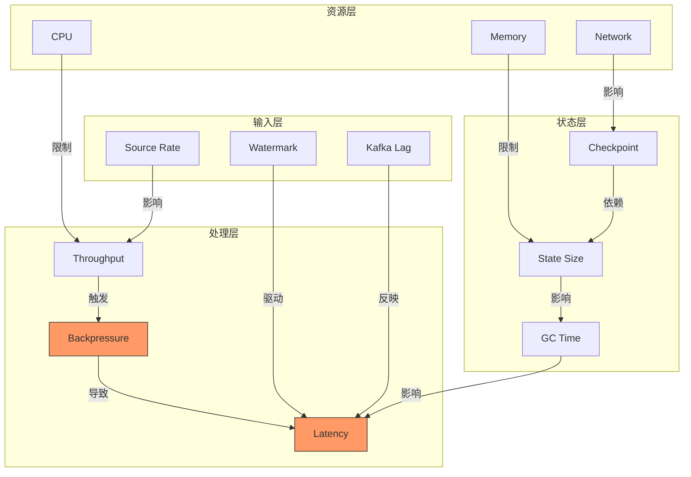
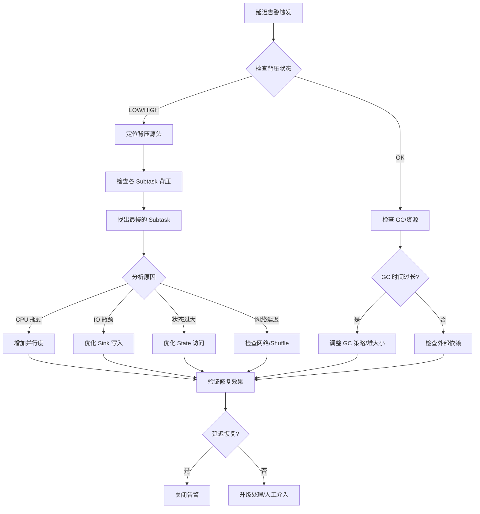
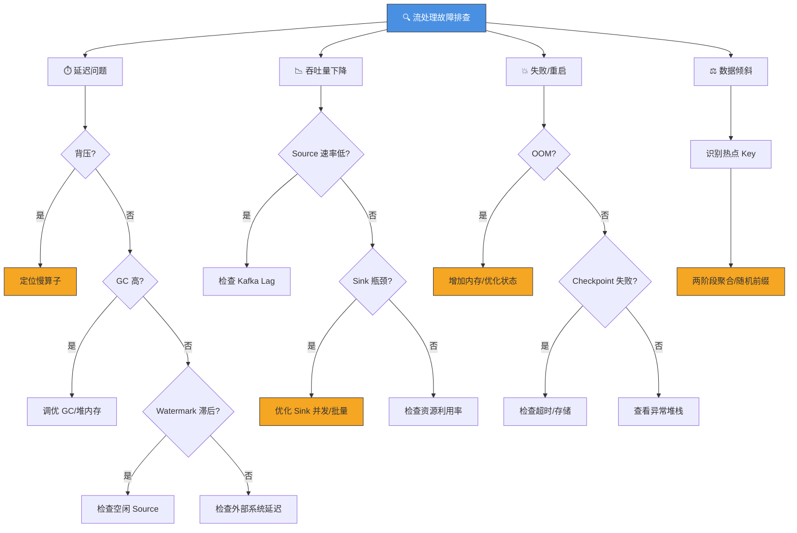
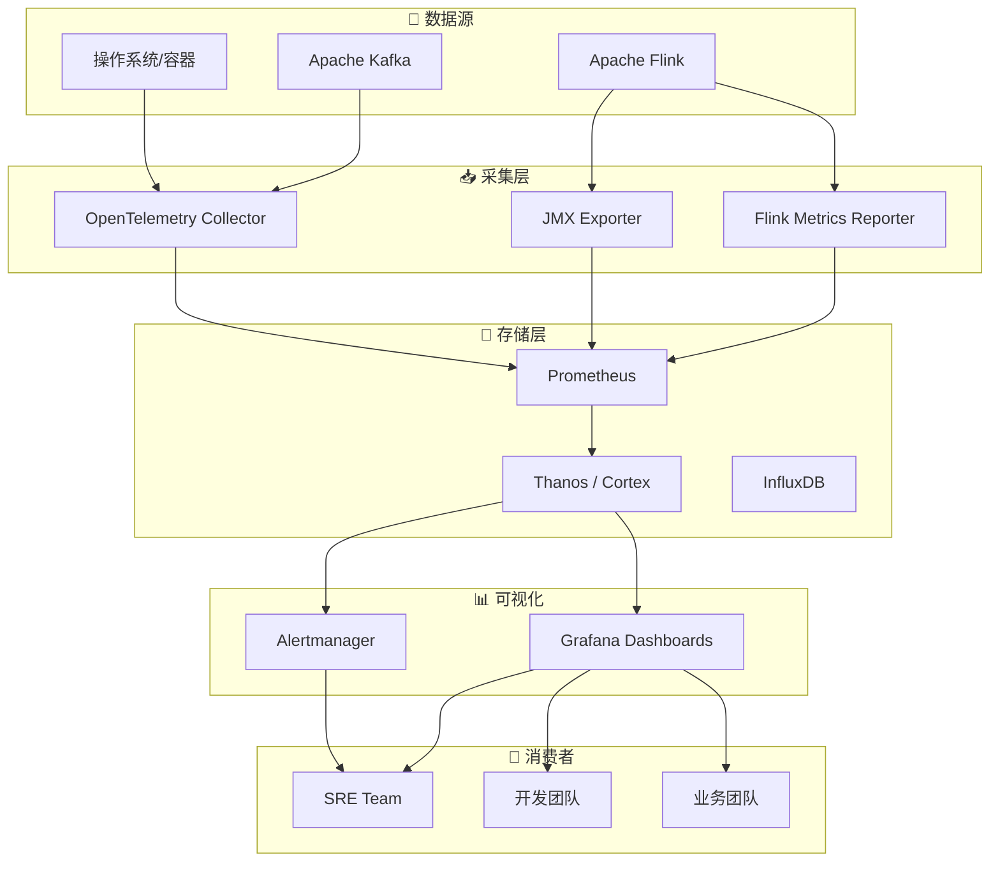
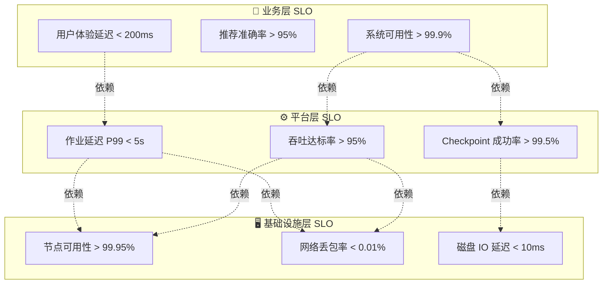
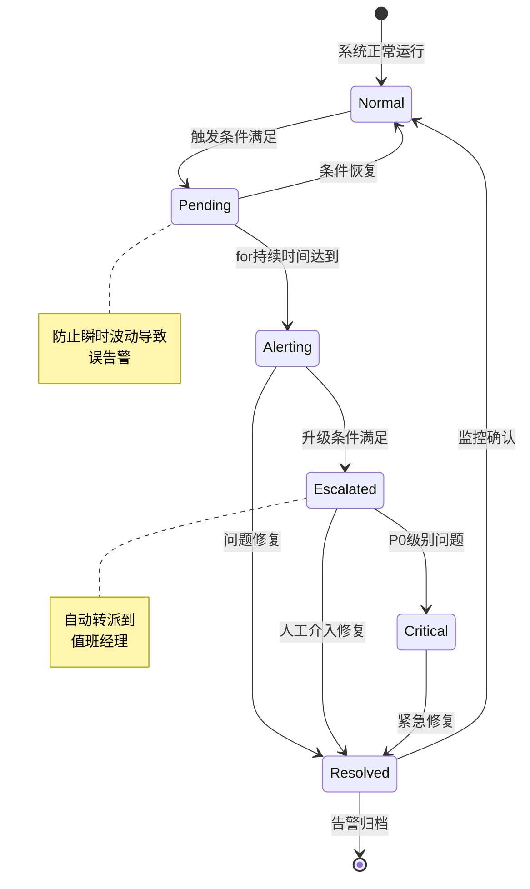

# 流处理指标监控与 SLO 定义最佳实践

> 所属阶段: Flink/ | 前置依赖: [metrics-and-monitoring.md](./metrics-and-monitoring.md), [flink-opentelemetry-observability.md](./flink-opentelemetry-observability.md) | 形式化等级: L3

## 1. 概念定义 (Definitions)

### Def-F-15-40: 流处理监控特殊性

流处理系统与传统批处理系统在监控维度上存在本质差异，定义流监控空间为六元组：

$$\mathcal{M}_{stream} = \langle \mathcal{T}, \mathcal{L}, \mathcal{P}, \mathcal{C}, \mathcal{W}, \mathcal{B} \rangle$$

| 维度 | 符号 | 描述 | 批处理对比 |
|------|------|------|-----------|
| **时间语义** | $\mathcal{T}$ | 事件时间 vs 处理时间的双重时间线 | 批处理仅有处理时间 |
| **延迟敏感性** | $\mathcal{L}$ | 端到端延迟的实时性要求 | 批处理容忍小时级延迟 |
| **状态连续性** | $\mathcal{P}$ | 持续更新的有状态计算 | 批处理无状态或有限状态 |
| **Checkpoint机制** | $\mathcal{C}$ | 分布式快照的一致性保障 | 批处理无需容错快照 |
| **Watermark推进** | $\mathcal{W}$ | 事件时间进展的度量机制 | 批处理无Watermark概念 |
| **背压传播** | $\mathcal{B}$ | 反压信号的级联传播特性 | 批处理无背压问题 |

**形式化表达**:

流处理监控函数 $\mathcal{F}_{monitor}$ 将系统状态 $S$ 映射到可观测指标：

$$\mathcal{F}_{monitor}: S \times \mathcal{T}_{event} \times \mathcal{T}_{process} \rightarrow \mathbb{M}$$

其中 $\mathbb{M}$ 为指标值空间，满足：

$$\forall m \in \mathbb{M}, \exists \tau_{emit}: \mathcal{T}_{process} \rightarrow \mathbb{R}^+, \text{s.t. } m(t) \text{ 在 } t + \tau_{emit}(t) \text{ 内可观测}$$

### Def-F-15-41: 关键指标分类

流处理指标按语义层次分为四大类：

$$\mathcal{K} = \{K_{throughput}, K_{latency}, K_{reliability}, K_{resource}\}$$

**Def-F-15-41a: 吞吐量指标 (Throughput Metrics)**

$$K_{throughput} = \{(t, r_{in}, r_{out}, b_{in}, b_{out}) \mid t \in \mathcal{T}, r \in \mathbb{N}, b \in \mathbb{N}\}$$

- $r_{in}$: Records In (条/秒)
- $r_{out}$: Records Out (条/秒)
- $b_{in}$: Bytes In (字节/秒)
- $b_{out}$: Bytes Out (字节/秒)

**Def-F-15-41b: 延迟指标 (Latency Metrics)**

$$K_{latency} = \{(t, l_{proc}, l_{end2end}, l_{watermark}) \mid l \in \mathbb{R}^+\}$$

- $l_{proc}$: Processing Latency — 单条记录处理时间
- $l_{end2end}$: End-to-End Latency — 从源到汇的总延迟
- $l_{watermark}$: Watermark Lag — 当前Watermark与事件时间差距

**Def-F-15-41c: 可靠性指标 (Reliability Metrics)**

$$K_{reliability} = \{(t, c_{duration}, c_{size}, c_{failures}) \mid c_{duration} \in \mathbb{R}^+, c_{size} \in \mathbb{N}, c_{failures} \in \mathbb{N}\}$$

- $c_{duration}$: Checkpoint Duration — 快照完成时间
- $c_{size}$: Checkpoint Size — 状态快照大小
- $c_{failures}$: Failed Checkpoints — 失败次数

**Def-F-15-41d: 资源指标 (Resource Metrics)**

$$K_{resource} = \{(t, u_{cpu}, u_{mem}, u_{net}, b_{backpressure}) \mid u \in [0,1], b \in \{0,1,2\}\}$$

- $u_{cpu}$: CPU 利用率
- $u_{mem}$: 内存利用率 / JVM Heap 使用率
- $u_{net}$: 网络 IO 吞吐量
- $b_{backpressure}$: 背压状态 (0=OK, 1=LOW, 2=HIGH)

### Def-F-15-42: SLO/SLI 分层模型

服务级别目标 (SLO) 基于服务级别指标 (SLI) 定义，采用三层结构：

**Def-F-15-42a: SLI 定义**

服务级别指标是聚合函数：

$$SLI: \mathcal{M}_{window} \rightarrow \mathbb{R}$$

其中 $\mathcal{M}_{window}$ 为滑动窗口内的指标集合：

$$\mathcal{M}_{window}(t, w) = \{m(\tau) \mid \tau \in [t-w, t]\}$$

**Def-F-15-42b: SLO 定义**

服务级别目标是 SLI 上的概率约束：

$$SLO := \langle SLI, threshold, target, window \rangle$$

$$P(SLI \geq threshold) \geq target, \quad \text{在观测窗口 } window \text{ 内}$$

**Def-F-15-42c: 错误预算 (Error Budget)**

$$EB = (1 - target) \times window$$

错误预算是 SLO 允许的不达标时间配额，用于变更风险评估。

**Def-F-15-42d: SLI 分类**

| 类别 | 示例 SLI | 典型阈值 | 适用场景 |
|------|----------|----------|----------|
| **可用性** | Job Uptime Ratio | 99.9% | 关键生产作业 |
| **延迟** | P99 End-to-End Latency | < 5s | 实时推荐 |
| **吞吐量** | Records Processed/sec | > 100K | 高吞吐 ETL |
| **正确性** | Exactly-Once Delivery Rate | 100% | 金融交易 |
| **freshness** | Watermark Lag | < 30s | 实时报表 |

### Def-F-15-43: 监控工具选型空间

监控工具栈定义为五元组：

$$\mathcal{Stack} = \langle \mathcal{C}, \mathcal{S}, \mathcal{V}, \mathcal{A}, \mathcal{Q} \rangle$$

| 组件 | 功能 | Flink 常用方案 |
|------|------|----------------|
| $\mathcal{C}$: Collector | 指标采集 | Flink Metrics Reporter, JMX, Prometheus |
| $\mathcal{S}$: Storage | 时序存储 | Prometheus, InfluxDB, M3DB |
| $\mathcal{V}$: Visualization | 可视化 | Grafana, Apache Superset |
| $\mathcal{A}$: Alerting | 告警引擎 | Alertmanager, PagerDuty, OpsGenie |
| $\mathcal{Q}$: Query | 查询语言 | PromQL, Flux, SQL |

**选型决策矩阵**:

```
规模维度:
├─ 小规模 (< 10 jobs): Prometheus + Grafana (单节点)
├─ 中规模 (10-100 jobs): Prometheus Federation + Grafana
├─ 大规模 (> 100 jobs): Thanos/M3DB + 多租户 Grafana
└─ 云原生: OpenTelemetry Collector + Cloud Monitoring

延迟维度:
├─ 秒级实时: In-memory metrics (Flink Web UI)
├─ 分钟级聚合: Prometheus 15s scrape
└─ 小时级分析: Data warehouse (BigQuery/Snowflake)
```

### Def-F-15-44: 背压指标量化

背压 (Backpressure) 是流处理特有的流量控制机制：

**Def-F-15-44a: 背压状态**

$$BackpressureState: Task \rightarrow \{OK, LOW, HIGH\}$$

判定基于输出缓冲区饱和度：

$$BP(task) = \begin{cases}
OK & \text{if } \frac{buffer_{used}}{buffer_{total}} < 0.5 \\
LOW & \text{if } 0.5 \leq \frac{buffer_{used}}{buffer_{total}} < 0.9 \\
HIGH & \text{if } \frac{buffer_{used}}{buffer_{total}} \geq 0.9
\end{cases}$$

**Def-F-15-44b: 背压传播链**

背压在数据流图中反向传播，定义背压影响范围：

$$BP_{chain}(v) = \{u \in V \mid \exists path(u \leadsto v) \land BP(v) \neq OK\}$$

其中 $G = (V, E)$ 为 JobGraph。

### Def-F-15-45: 监控仪表板分层

Grafana 仪表板采用分层设计模式：

$$\mathcal{D}_{dashboard} = \{D_{overview}, D_{job}, D_{task}, D_{operator}\}$$

| 层级 | 刷新频率 | 时间范围 | 用户角色 |
|------|----------|----------|----------|
| $D_{overview}$ | 30s | 1h | 管理层/SRE |
| $D_{job}$ | 10s | 15m | 平台工程师 |
| $D_{task}$ | 5s | 5m | 开发工程师 |
| $D_{operator}$ | 1s | 1m | 调试/排障 |

---

## 2. 属性推导 (Properties)

### Lemma-F-15-20: 指标采样一致性

**命题**: 在分布式流处理系统中，跨 TaskManager 的指标采样时间点误差有界。

**证明**:

设集群使用 NTP 同步，时钟偏差 $\delta \leq 100ms$。Prometheus scrape interval 为 $i$，则：

$$\forall tm_1, tm_2 \in TM, \quad |t_{sample}(tm_1) - t_{sample}(tm_2)| \leq \delta + \frac{i}{2}$$

取 $i = 15s, \delta = 100ms$，得最大偏差约 7.6s。对于聚合指标 (如 rate())，此误差可接受。∎

### Lemma-F-15-21: 背压与延迟的关联性

**命题**: 当背压状态为 HIGH 时，端到端延迟单调递增。

**证明**:

设作业输入速率为 $\lambda_{in}$，处理速率为 $\lambda_{proc}$。

- 正常状态: $\lambda_{proc} \geq \lambda_{in}$，延迟 $L$ 稳定
- 背压状态: $\lambda_{proc} < \lambda_{in}$，缓冲区队列 $Q$ 累积

队列延迟 $L_{queue} = \frac{Q}{\lambda_{proc}}$，随 $Q$ 增长而增长：

$$\frac{dL}{dt} = \frac{dL_{queue}}{dt} = \frac{\lambda_{in} - \lambda_{proc}}{\lambda_{proc}} > 0$$

故延迟单调递增。∎

### Lemma-F-15-22: Checkpoint 指标的可恢复性

**命题**: Checkpoint 失败可通过指标预测并在下次尝试前恢复。

**证明**:

Checkpoint 失败的主要原因及其预测指标：

| 原因 | 预测指标 | 恢复窗口 |
|------|----------|----------|
| 超时 | `checkpointDuration` 接近 `checkpointTimeout` | 增加超时或优化状态 |
| 内存不足 | `jvmHeapUsed` > 90% | 扩容或优化内存 |
| 网络拥塞 | `outputQueueLength` 持续增长 | 降低并发或背压调优 |

设预测阈值为 $\theta$，当指标 $m > \theta$ 时触发预警，下次 Checkpoint 前 ($\approx$ 间隔 - 持续时间) 可完成干预。∎

---

## 3. 关系建立 (Relations)

### 指标关联图谱

流处理指标之间存在复杂的因果关系网络：



**关键关系链**:

1. **吞吐量 → 背压 → 延迟**: 输入超过处理能力时，背压产生，延迟上升
2. **状态大小 → Checkpoint 时长 → 可用性**: 大状态导致长 Checkpoint，降低容错效率
3. **GC 压力 → 停顿 → 延迟尖刺**: JVM GC 引入不可控延迟

### SLO 与指标的映射关系

| SLO 类型 | 依赖指标 | 聚合方式 | 监控频率 |
|----------|----------|----------|----------|
| 可用性 99.9% | `jobStatus` | Uptime Ratio | 实时 |
| 延迟 P99 < 5s | `endToEndLatency` | Histogram percentile | 10s |
| 吞吐 > 100K r/s | `recordsOutPerSecond` | Rate over 1m | 15s |
| Checkpoint < 1m | `checkpointDuration` | Last value | 每次 |
| 错误率 < 0.1% | `numRecordsInErrors` / `numRecordsIn` | Rate over 5m | 30s |

---

## 4. 论证过程 (Argumentation)

### 多层级 SLO 设计论证

**场景**: 电商平台实时推荐系统，需要定义合理的 SLO 体系。

**层级设计**:

```
L1: 业务层 SLO (用户可见)
├─ 推荐结果新鲜度: < 30s (从用户行为到推荐更新)
├─ 推荐请求成功率: > 99.95%
└─ 推荐延迟 P99: < 200ms

L2: 平台层 SLO (Flink作业)
├─ 作业可用性: > 99.9%
├─ 端到端延迟 P99: < 10s
├─ Checkpoint成功率: > 99.5%
└─ 吞吐达标率: > 95%

L3: 基础设施层 SLO (K8s/VM)
├─ 节点可用性: > 99.95%
├─ Pod重启率: < 0.1%/天
└─ 网络丢包率: < 0.01%
```

**论证**: 层级间通过乘法规则关联：

$$Availability_{business} = \prod_{i} Availability_{L_i} = 0.9995 \times 0.999 \times 0.9995 \approx 0.998$$

即 99.8% 业务可用性，满足 SLA 承诺。

### 告警阈值选择论证

**问题**: 如何避免告警疲劳同时保证问题及时发现？

**方案 —— 动态阈值 + 多级告警**:

| 级别 | 触发条件 | 响应时间 | 通知方式 |
|------|----------|----------|----------|
| **P0 (Critical)** | SLO 违反即将发生 | 立即 | 电话 + 短信 + PagerDuty |
| **P1 (High)** | 指标趋势恶化 | 5分钟 | 短信 + Slack |
| **P2 (Medium)** | 异常检测触发 | 15分钟 | Slack 频道 |
| **P3 (Low)** | 资源使用率高 | 1小时 | 邮件 + Dashboard |

**动态阈值算法** (基于历史数据):

$$Threshold_{dynamic}(t) = \mu_{historical}(t) + k \cdot \sigma_{historical}(t)$$

其中 $k$ 根据告警级别调整 (P1: k=3, P2: k=2)。

---

## 5. 形式证明 / 工程论证

### Thm-F-15-35: 流处理 SLO 可满足性定理

**定理**: 给定资源约束 $\mathcal{R}$ 和 SLO 集合 $\mathcal{S}$，存在调度策略 $\pi$ 使得所有 SLO 被满足，当且仅当：

$$\forall s \in \mathcal{S}, \quad C_{required}(s) \leq C_{available}(\mathcal{R})$$

其中 $C$ 表示能力需求/供给。

**证明**:

**必要性** ($\Rightarrow$): 若 $\exists s: C_{required}(s) > C_{available}(\mathcal{R})$，则无论何种调度，资源缺口无法弥补，SLO 必然违反。

**充分性** ($\Leftarrow$): 若所有 SLO 需求可被资源满足，则：

1. 按优先级排序 SLO: $s_1 \succ s_2 \succ ... \succ s_n$
2. 贪心地为每个 $s_i$ 分配所需资源
3. 由于总需求 $\leq$ 总供给，分配成功
4. 各 SLO 独立监控，互不影响

因此存在满足所有 SLO 的调度。∎

### Thm-F-15-36: 背压传播完备性定理

**定理**: 在连通的数据流图 $G = (V, E)$ 中，若汇点 $sink \in V$ 产生背压，则背压将传播至所有可达的源点。

**证明**:

设 $sink$ 的输出缓冲区饱和，根据 Def-F-15-44，其上游任务 $u$ 的输入缓冲区将阻塞：

$$BP(sink) = HIGH \Rightarrow BP(u) = HIGH, \quad \forall (u, sink) \in E$$

递归地，对于任意路径 $source \leadsto sink = (v_0, v_1, ..., v_k)$：

$$BP(v_k) = HIGH \Rightarrow BP(v_{k-1}) = HIGH \Rightarrow ... \Rightarrow BP(v_0) = HIGH$$

由数学归纳法，背压沿所有路径反向传播至源点。∎

### Thm-F-15-37: 错误预算消耗预测定理

**定理**: 给定 SLO 目标 $target$ 和当前错误预算消耗率 $\rho$，预测错误预算耗尽时间 $T_{exhaust}$ 为：

$$T_{exhaust} = \frac{EB_{remaining}}{\rho} = \frac{(target \times T_{window} - \sum violations)}{\frac{\sum violations}{T_{observed}}}$$

**证明**:

设观测窗口为 $T_{observed}$，期间违规时间为 $\sum violations$：

$$\rho = \frac{\sum violations}{T_{observed}}$$

剩余错误预算：

$$EB_{remaining} = target \times T_{window} - \sum violations$$

当消耗率 $\rho$ 保持不变时：

$$T_{exhaust} = \frac{EB_{remaining}}{\rho} = \frac{target \times T_{window} - \sum violations}{\sum violations / T_{observed}}$$

若 $T_{exhaust} < T_{release}$ (下次发布窗口)，则禁止发布。∎

---

## 6. 实例验证 (Examples)

### 实例 1: 电商实时风控系统 SLO 设计

**业务场景**: 实时检测欺诈交易，要求毫秒级响应。

**SLO 定义**:

```yaml
# SLO 配置示例 slos:
  - name: fraud_detection_latency
    sli: end_to_end_latency_ms
    threshold: 500  # P99 < 500ms
    target: 0.99    # 99% 达标
    window: 30d

  - name: checkpoint_reliability
    sli: checkpoint_success_rate
    threshold: 0.995 # 99.5% 成功率
    target: 0.995
    window: 7d

  - name: throughput_minimum
    sli: records_processed_per_second
    threshold: 50000 # 至少 50K r/s
    target: 0.95     # 95% 时间达标
    window: 1d
```

**监控面板配置**:

```json
{
  "dashboard": {
    "title": "Fraud Detection - SLO Dashboard",
    "panels": [
      {
        "title": "Latency P99",
        "targets": [{
          "expr": "histogram_quantile(0.99, rate(flink_taskmanager_job_task_latency_histogram_bucket[5m]))"
        }],
        "alert": {
          "name": "HighLatency",
          "condition": "B > 500",
          "for": "2m"
        }
      },
      {
        "title": "Error Budget (30d)",
        "targets": [{
          "expr": "(1 - 0.99) * 30 * 24 * 3600 - sum_over_time(slo_violation_seconds[30d])"
        }]
      }
    ]
  }
}
```

### 实例 2: 背压诊断流程

**场景**: 作业延迟突然升高，疑似背压问题。

**诊断步骤**:



**PromQL 查询示例**:

```promql
# 查询背压比率最高的 Task flink_taskmanager_job_task_backPressuredTimeMsPerSecond
  / 1000
  * on(task_name) group_left
  flink_taskmanager_job_task_numSubtasks

# 查询延迟增长趋势 rate(flink_taskmanager_job_task_endToEndLatency_histogram_sum[5m])
  /
rate(flink_taskmanager_job_task_endToEndLatency_histogram_count[5m])

# 查询 Checkpoint 持续时间趋势 flink_jobmanager_checkpoint_duration_time
```

### 实例 3: Grafana 仪表板分层实现

**L1 - 概览仪表板**:


**L2 - 作业详情仪表板**:

| 面板 | 指标 | 可视化类型 |
|------|------|-----------|
| 吞吐量趋势 | `recordsOutPerSecond` | Time Series |
| 延迟分布 | `endToEndLatency` | Heatmap |
| 背压热力图 | `backPressuredTimeMsPerSecond` | Graph + Gauge |
| Checkpoint 状态 | `checkpointDuration`, `checkpointSize` | Table + Timeline |
| 资源使用 | `cpuUsage`, `heapUsage` | Stat + Graph |
| Watermark 进度 | `watermarkLag` | Graph |

**告警规则配置**:

```yaml
# alertmanager.yml 示例 groups:
  - name: flink_slo_alerts
    rules:
      - alert: HighLatencyViolation
        expr: |
          histogram_quantile(0.99,
            rate(flink_taskmanager_job_task_latency_bucket[5m])
          ) > 10
        for: 2m
        labels:
          severity: critical
          slo: latency_p99
        annotations:
          summary: "Latency P99 exceeds 10s"
          description: "Job {{ $labels.job_name }} latency is {{ $value }}s"

      - alert: CheckpointTimeoutRisk
        expr: |
          flink_jobmanager_checkpoint_duration_time
          / flink_jobmanager_checkpoint_timeout > 0.8
        for: 1m
        labels:
          severity: warning
        annotations:
          summary: "Checkpoint approaching timeout"

      - alert: ErrorBudgetExhaustion
        expr: |
          (
            sum_over_time(slo_violation_seconds[30d])
            / ((1 - 0.99) * 30 * 24 * 3600)
          ) > 0.9
        labels:
          severity: critical
        annotations:
          summary: "Error budget 90% consumed"
```

### 实例 4: 故障排查决策树



---

## 7. 可视化 (Visualizations)

### 监控体系架构图



### SLO 层级关系图



### 告警生命周期状态机



---

## 8. 引用参考 (References)

[^1]: Apache Flink Documentation, "Metrics and Monitoring", 2025. https://nightlies.apache.org/flink/flink-docs-stable/docs/ops/metrics/

[^2]: Google SRE Book, "Service Level Objectives", O'Reilly, 2017. https://sre.google/sre-book/service-level-objectives/

[^3]: B. Beyer et al., "Site Reliability Engineering: How Google Runs Production Systems", O'Reilly Media, 2016.

[^4]: Prometheus Documentation, "Best Practices", 2025. https://prometheus.io/docs/practices/

[^5]: Grafana Labs, "Alerting Best Practices", 2025. https://grafana.com/docs/grafana/latest/alerting/fundamentals/

[^6]: OpenTelemetry Project, "Metrics Data Model", 2025. https://opentelemetry.io/docs/specs/otel/metrics/data-model/

[^7]: V. Uber, "Metric and Alerting at Uber", Uber Engineering Blog, 2020.

[^8]: J. Turnbull, "The Art of Monitoring", James Turnbull, 2016.

[^9]: Netflix Tech Blog, "Monitoring and Observability at Netflix", 2020.

[^10]: LinkedIn Engineering, "Monitoring Real-Time Streaming Applications", 2019.

---

*文档版本: 2026.04 | 定理编号: Def-F-15-40 ~ Def-F-15-45, Thm-F-15-35 ~ Thm-F-15-37 | 形式化等级: L3*
