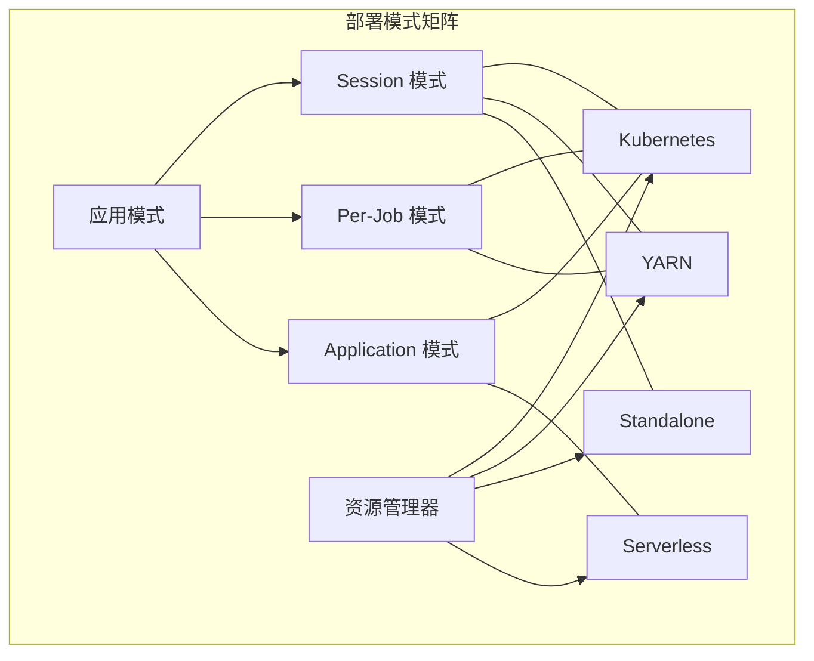
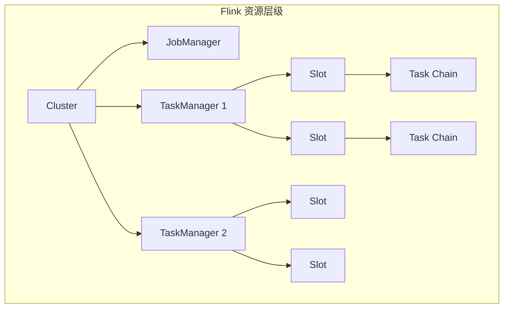
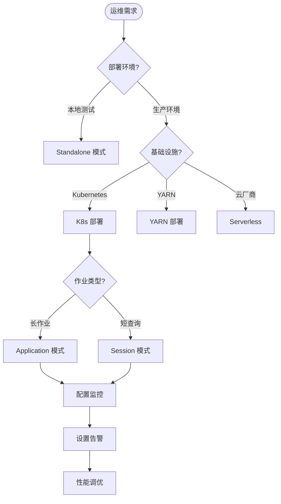
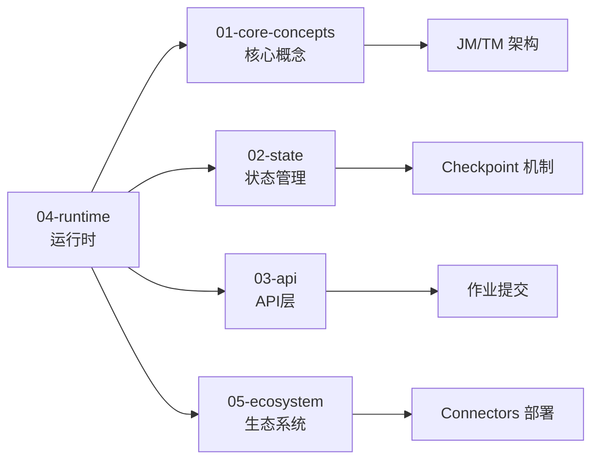
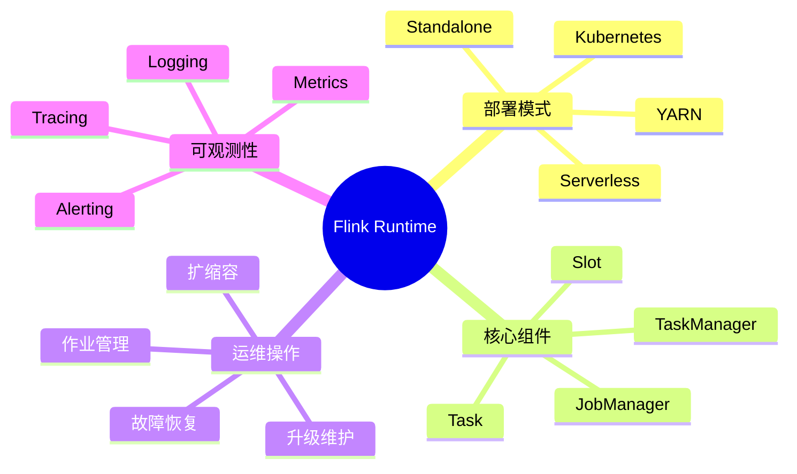

# Flink 运行时与运维概览

> 所属阶段: Flink | 前置依赖: [Flink/01-concepts/](../01-concepts/) | 形式化等级: L4

本文档是 Flink 运行时层级的权威导航中心，全面覆盖 Flink 作业的部署、运维和可观测性。从分布式执行的核心概念（JobManager、TaskManager、Slot、Task）到生产环境的部署模式、运维操作和监控体系，本目录为 Flink 平台工程师和 SRE 提供完整的技术参考。

---

## 目录结构导航

```
04-runtime/
├── README.md                          # 本文件 - 运行时概览
├── 04.01-deployment/                  # 部署模式与架构
│   ├── kubernetes-deployment.md
│   ├── flink-kubernetes-operator-deep-dive.md
│   ├── flink-serverless-architecture.md
│   └── evolution/                     # 部署演进专题
├── 04.02-operations/                  # 运维操作指南
│   ├── production-checklist.md
│   └── rest-api-complete-reference.md
└── 04.03-observability/               # 可观测性体系
    ├── flink-observability-complete-guide.md
    ├── metrics-and-monitoring.md
    ├── distributed-tracing.md
    └── evolution/                     # 可观测性演进
```

---

## 1. 概念定义 (Definitions)

### Def-F-04-01: Flink 运行时架构

Flink 运行时是一个**分布式数据流处理引擎**，采用 Master-Worker 架构模式：

```
┌─────────────────────────────────────────────────────────────┐
│                        Flink Runtime                        │
├─────────────────────────────────────────────────────────────┤
│  ┌─────────────────┐         ┌─────────────────────────┐   │
│  │   JobManager    │◄───────►│     TaskManager 1       │   │
│  │   (Master)      │         │   ┌─────┬─────┬─────┐   │   │
│  │  ┌───────────┐  │         │   │Slot │Slot │Slot │   │   │
│  │  │Dispatcher │  │         │   │ 1   │ 2   │ 3   │   │   │
│  │  │JobMaster  │  │         │   └──┬──┴──┬──┴──┬──┘   │   │
│  │  │RM         │  │         └──────┴─────┴─────┴──────┘   │
│  │  └───────────┘  │                   ▲                   │
│  └─────────────────┘                   │                   │
│           ▲                            │                   │
│           │         ┌──────────────────┴──────────────┐   │
│           └─────────┤       TaskManager 2 ... N       │   │
│                     └─────────────────────────────────┘   │
└─────────────────────────────────────────────────────────────┘
```

### Def-F-04-02: 核心运行时组件

| 组件 | 角色 | 职责 |
|------|------|------|
| **JobManager (JM)** | 控制节点 | 作业调度、协调 Checkpoint、故障恢复 |
| **TaskManager (TM)** | 工作节点 | 执行具体 Task、管理本地 Slot 资源 |
| **Slot** | 资源单元 | TM 上的最小资源分配单位，可运行一个 Task 链 |
| **Task** | 执行单元 | 算子的并行实例，实际执行计算逻辑 |

---

## 2. 部署模式详解

### 2.1 部署架构概览

Flink 支持多种部署模式，适应不同的基础设施和运维需求：



### 2.2 部署模式对比

| 特性 | Session 模式 | Per-Job 模式 | Application 模式 |
|------|--------------|--------------|------------------|
| **集群生命周期** | 长期运行 | 随作业创建销毁 | 随应用创建销毁 |
| **资源隔离** | 共享 | 独占 | 独占 |
| **启动延迟** | 低 | 高 | 中 |
| **资源利用率** | 高 | 低 | 中 |
| **适用场景** | 短查询/高频提交 | 长作业/严格隔离 | 微服务化应用 |

### 2.3 Kubernetes 部署（推荐）

**架构优势**:

- 原生云环境支持
- 声明式配置管理
- 自动扩缩容能力
- 与云生态深度集成

**核心文档**:

- 📘 [Kubernetes 部署生产指南](./04.01-deployment/kubernetes-deployment-production-guide.md) - 生产环境最佳实践
- 📘 [Flink Kubernetes Operator 深度解析](./04.01-deployment/flink-kubernetes-operator-deep-dive.md) - 声明式作业管理
- 📘 [Flink Kubernetes Autoscaler 深度解析](./04.01-deployment/flink-kubernetes-autoscaler-deep-dive.md) - 自动扩缩容机制
- 🆕 [Flink Serverless 架构](./04.01-deployment/flink-serverless-architecture.md) - 无服务器部署方案

### 2.4 部署演进专题

`04.01-deployment/evolution/` 目录包含部署技术的演进历程：

| 文档 | 主题 | 价值 |
|------|------|------|
| [standalone-deploy.md](./04.01-deployment/evolution/standalone-deploy.md) | 独立集群部署 | 传统部署模式 |
| [yarn-deploy.md](./04.01-deployment/evolution/yarn-deploy.md) | YARN 集成 | 大数据生态兼容 |
| [k8s-deploy.md](./04.01-deployment/evolution/k8s-deploy.md) | Kubernetes 演进 | 云原生转型路径 |
| [serverless-deploy.md](./04.01-deployment/evolution/serverless-deploy.md) | 无服务器架构 | 成本优化方案 |
| [autoscaling-evolution.md](./04.01-deployment/evolution/autoscaling-evolution.md) | 自动扩缩容演进 | 弹性能力提升 |
| [ha-evolution.md](./04.01-deployment/evolution/ha-evolution.md) | 高可用演进 | 可靠性保障 |

---

## 3. 运维操作指南

### 3.1 运维工作流


### 3.2 核心运维场景

| 场景 | 关键操作 | 参考文档 |
|------|----------|----------|
| **作业部署** | jar 提交、SQL 提交、镜像部署 | [Kubernetes 部署指南](./04.01-deployment/kubernetes-deployment.md) |
| **状态管理** | Savepoint、Checkpoint 操作 | [Flink/02-core/](../02-core/) |
| **扩缩容** | 并行度调整、资源配置 | [Autoscaling 深度解析](./04.01-deployment/flink-kubernetes-autoscaler-deep-dive.md) |
| **故障恢复** | 重启策略、故障排查 | [生产检查清单](./04.02-operations/production-checklist.md) |
| **版本升级** | 状态兼容性、滚动升级 | [升级策略](./04.01-deployment/evolution/upgrade-strategy.md) |

### 3.3 生产检查清单

[生产检查清单](./04.02-operations/production-checklist.md) 提供了作业上线前的完整检查项：

```markdown
□ 资源配置检查
  □ TaskManager 内存配置
  □ 网络缓冲区设置
  □ Checkpoint 参数调优

□ 可靠性检查
  □ Checkpoint 启用与间隔
  □ 重启策略配置
  □ 状态后端选择

□ 可观测性检查
  □ Metrics 上报配置
  □ 日志聚合设置
  □ 告警规则定义

□ 安全性检查
  □ 认证授权配置
  □ 网络安全策略
  □ 敏感信息脱敏
```

### 3.4 REST API 完整参考

[REST API 完整参考](./04.02-operations/rest-api-complete-reference.md) 包含所有运行时管理接口：

| API 类别 | 功能覆盖 |
|----------|----------|
| 集群管理 | 配置查看、Dashboard 信息 |
| 作业管理 | 提交、取消、触发 Savepoint |
| Checkpoint | 触发、查看状态、配置管理 |
| Jar 管理 | 上传、运行、删除作业包 |

---

## 4. 可观测性体系

### 4.1 可观测性三大支柱

```
┌─────────────────────────────────────────────────────────┐
│                 Flink 可观测性体系                       │
├─────────────────────┬───────────────────────────────────┤
│     Metrics         │          Logging                  │
│  (量化指标)          │         (结构化日志)               │
├─────────────────────┼───────────────────────────────────┤
│ • 系统指标           │ • 应用日志                         │
│ • 业务指标           │ • 审计日志                         │
│ • 延迟/吞吐量        │ • GC 日志                          │
├─────────────────────┴───────────────────────────────────┤
│                   Distributed Tracing                   │
│                   (分布式追踪)                           │
├─────────────────────────────────────────────────────────┤
│ • 端到端延迟分析                                        │
│ • 调用链可视化                                          │
│ • 性能瓶颈定位                                          │
└─────────────────────────────────────────────────────────┘
```

### 4.2 Metrics 监控体系

**核心指标分类**:

| 类别 | 关键指标 | 监控意义 |
|------|----------|----------|
| **JobManager** | 活跃作业数、任务槽占用率 | 集群负载状态 |
| **TaskManager** | CPU/内存使用率、GC 时间 | 节点健康状况 |
| **Task** | 记录处理速率、Watermark 延迟 | 作业性能表现 |
| **Checkpoint** | 持续时间、失败率、大小 | 容错机制健康度 |
| **网络** | 反压指标、缓冲区使用 | 数据流健康状况 |

**核心文档**:

- 📘 [Flink 可观测性完全指南](./04.03-observability/flink-observability-complete-guide.md)
- 📊 [Metrics 与监控指南](./04.03-observability/metrics-and-monitoring.md)
- 🔍 [分布式追踪实战](./04.03-observability/distributed-tracing.md)

### 4.3 OpenTelemetry 集成

Flink 支持现代云原生可观测性标准 OpenTelemetry：

- 📘 [OpenTelemetry 流式可观测性](./04.03-observability/opentelemetry-streaming-observability.md)
- 📘 [Flink OpenTelemetry 集成](./04.03-observability/flink-opentelemetry-observability.md)

**集成价值**:

- 统一的遥测数据格式
- 与 Prometheus、Grafana、Jaeger 生态兼容
- 减少 vendor lock-in

### 4.4 可观测性演进

`04.03-observability/evolution/` 目录包含监控技术的演进历程：

| 文档 | 主题 | 演进方向 |
|------|------|----------|
| [metrics-evolution.md](./04.03-observability/evolution/metrics-evolution.md) | 指标系统演进 | Pull→Push→自适应采样 |
| [logging-evolution.md](./04.03-observability/evolution/logging-evolution.md) | 日志系统演进 | 文本→结构化→追踪关联 |
| [tracing-evolution.md](./04.03-observability/evolution/tracing-evolution.md) | 追踪系统演进 | 可选→原生→自动埋点 |
| [alerting-evolution.md](./04.03-observability/evolution/alerting-evolution.md) | 告警系统演进 | 阈值→智能异常检测 |

---

## 5. 资源管理与调度

### 5.1 资源模型



### 5.2 Slot 与 Task 映射

**Slot 共享机制**:

- 同一作业的不同算子可以共享 Slot（如果位于同一 SlotSharingGroup）
- 减少网络传输开销
- 提高资源利用率

**配置参数**:

```yaml
taskmanager.numberOfTaskSlots: 4  # 每个 TM 的 Slot 数
parallelism.default: 2            # 默认并行度
```

### 5.3 调度策略演进

| 版本 | 调度特性 | 说明 |
|------|----------|------|
| 1.14 | 细粒度资源管理 | Slot 级别资源配置 |
| 1.17 | 自适应调度器 | 动态调整并行度 |
| 1.19 | 流批统一调度 | 统一调度语义 |
| 2.0+ | 云原生调度 | 与 K8s 调度器深度集成 |

---

## 6. 快速导航与决策

### 6.1 运维场景决策树



### 6.2 子目录核心内容速览

| 子目录 | 核心内容 | 目标读者 |
|--------|----------|----------|
| **04.01-deployment** | K8s/YARN/Standalone/Serverless 部署指南 | 平台工程师 |
| **04.02-operations** | 生产检查清单、REST API 参考 | SRE、运维工程师 |
| **04.03-observability** | Metrics、Logging、Tracing、告警 | 可观测性工程师 |

---

## 7. 生产环境最佳实践

### 7.1 部署架构建议

```yaml
# 生产级 K8s 部署配置示例
apiVersion: flink.apache.org/v1beta1
kind: FlinkDeployment
metadata:
  name: production-job
spec:
  image: flink:2.0.0-scala_2.12
  flinkVersion: v2.0
  jobManager:
    resource:
      memory: 4Gi
      cpu: 2
  taskManager:
    resource:
      memory: 8Gi
      cpu: 4
    replicas: 3
  job:
    jarURI: local:///opt/flink/examples/streaming/StateMachineExample.jar
    parallelism: 6
    upgradeMode: savepoint
    state: running
```

### 7.2 关键配置参数

| 配置项 | 推荐值 | 说明 |
|--------|--------|------|
| `state.backend` | rocksdb | 大状态场景 |
| `state.checkpoint-storage` | filesystem | 可靠存储 |
| `execution.checkpointing.interval` | 1-10min | 根据 SLA 调整 |
| `restart-strategy` | fixed-delay | 固定延迟重试 |
| `taskmanager.memory.network.fraction` | 0.15 | 网络缓冲区 |

### 7.3 故障排查清单

| 症状 | 可能原因 | 排查方向 |
|------|----------|----------|
| Checkpoint 超时 | 状态过大/网络延迟 | 检查状态大小、网络配置 |
| 反压 | 下游处理慢 | 查看 backPressureRatio 指标 |
| OOM | 内存配置不足 | 调优内存参数、检查状态增长 |
| 作业失败 | 代码异常/资源不足 | 查看异常日志、资源使用 |

---

## 8. 与其他目录的关联



---

## 9. 可视化总结



---

## 10. 相关资源

### 10.1 官方文档

- 🔗 [Flink 部署文档](https://nightlies.apache.org/flink/flink-docs-stable/docs/deployment/overview/)
- 🔗 [Flink 配置文档](https://nightlies.apache.org/flink/flink-docs-stable/docs/deployment/config/)
- 🔗 [Flink 监控文档](https://nightlies.apache.org/flink/flink-docs-stable/docs/ops/monitoring/)

### 10.2 社区资源

- 🔗 [Flink Kubernetes Operator](https://nightlies.apache.org/flink/flink-kubernetes-operator-docs-stable/)
- 🔗 [Flink 最佳实践仓库](https://github.com/apache/flink-playgrounds)

---

## 引用参考
