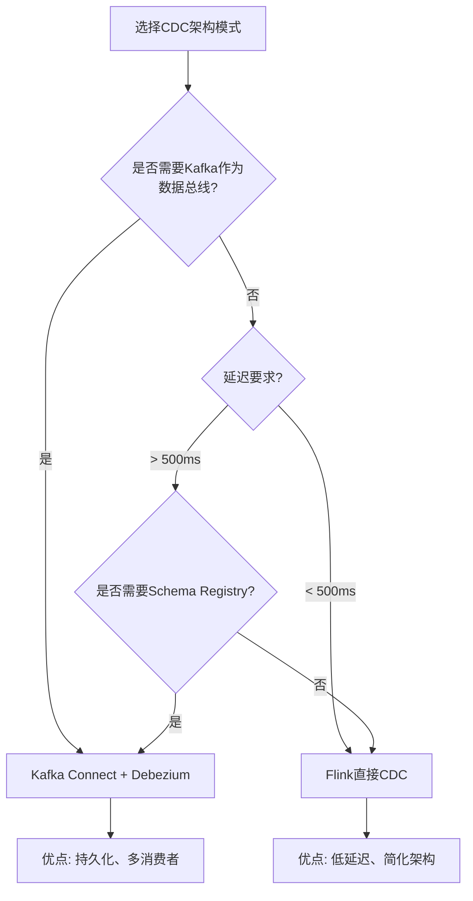
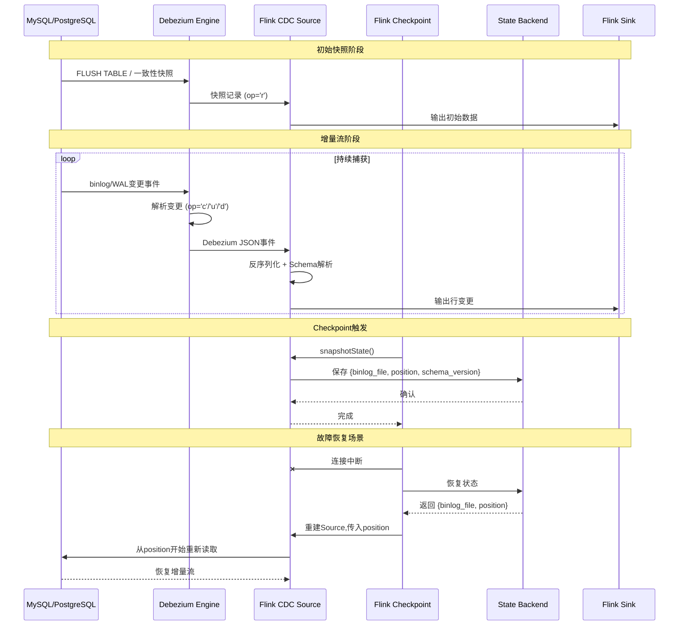
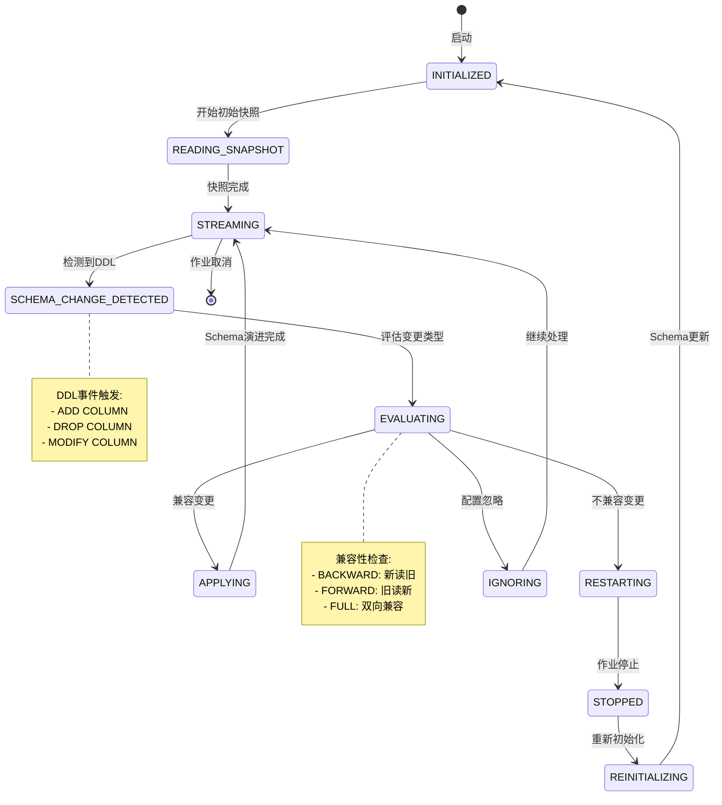
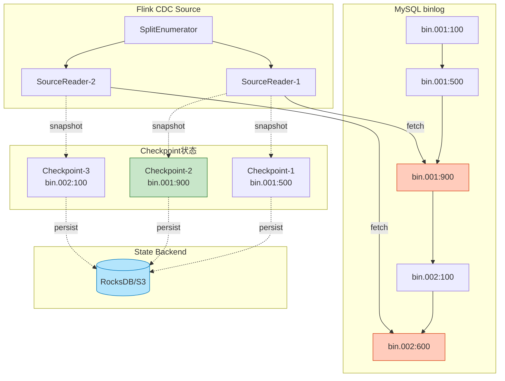

# Flink CDC与Debezium集成深度解析

> **所属阶段**: Flink/04-connectors | **前置依赖**: [kafka-integration-patterns.md](./kafka-integration-patterns.md), [../02-core-mechanisms/exactly-once-end-to-end.md](../../02-core/exactly-once-end-to-end.md) | **形式化等级**: L4

---

## 目录

- [Flink CDC与Debezium集成深度解析](#flink-cdc与debezium集成深度解析)
  - [目录](#目录)
  - [1. 概念定义 (Definitions)](#1-概念定义-definitions)
    - [Def-F-04-30 (CDC形式化定义)](#def-f-04-30-cdc形式化定义)
    - [Def-F-04-31 (日志型CDC语义)](#def-f-04-31-日志型cdc语义)
    - [Def-F-04-32 (Debezium架构形式化)](#def-f-04-32-debezium架构形式化)
    - [Def-F-04-33 (CDC事件结构)](#def-f-04-33-cdc事件结构)
    - [Def-F-04-34 (Schema变更事件)](#def-f-04-34-schema变更事件)
  - [2. 属性推导 (Properties)](#2-属性推导-properties)
    - [Lemma-F-04-20 (CDC延迟边界)](#lemma-f-04-20-cdc延迟边界)
    - [Lemma-F-04-21 (初始快照一致性)](#lemma-f-04-21-初始快照一致性)
    - [Prop-F-04-20 (端到端Exactly-Once条件)](#prop-f-04-20-端到端exactly-once条件)
  - [3. 关系建立 (Relations)](#3-关系建立-relations)
    - [关系1: CDC与Flink SQL的映射](#关系1-cdc与flink-sql的映射)
    - [关系2: Debezium与Kafka的集成模式](#关系2-debezium与kafka的集成模式)
    - [关系3: CDC Source与Checkpoint的绑定](#关系3-cdc-source与checkpoint的绑定)
  - [4. 论证过程 (Argumentation)](#4-论证过程-argumentation)
    - [4.1 CDC架构选择论证](#41-cdc架构选择论证)
    - [4.2 初始快照vs增量流边界](#42-初始快照vs增量流边界)
    - [4.3 Schema变更处理策略](#43-schema变更处理策略)
  - [5. 形式证明 / 工程论证 (Proof / Engineering Argument)](#5-形式证明-工程论证-proof-engineering-argument)
    - [Thm-F-04-20 (CDC Source Exactly-Once正确性)](#thm-f-04-20-cdc-source-exactly-once正确性)
    - [Thm-F-04-21 (事务边界保证定理)](#thm-f-04-21-事务边界保证定理)
  - [6. 实例验证 (Examples)](#6-实例验证-examples)
    - [6.1 MySQL CDC Connector配置](#61-mysql-cdc-connector配置)
    - [6.2 PostgreSQL CDC Connector配置](#62-postgresql-cdc-connector配置)
    - [6.3 Flink SQL CDC表定义](#63-flink-sql-cdc表定义)
    - [6.4 MySQL→Flink→Kafka实时同步](#64-mysqlflinkkafka实时同步)
    - [6.5 PostgreSQL→Flink→数据湖](#65-postgresqlflink数据湖)
  - [7. 可视化 (Visualizations)](#7-可视化-visualizations)
    - [7.1 CDC架构对比图](#71-cdc架构对比图)
    - [7.2 Debezium数据流序列图](#72-debezium数据流序列图)
    - [7.3 Schema变更处理状态机](#73-schema变更处理状态机)
    - [7.4 CDC Source与Checkpoint集成图](#74-cdc-source与checkpoint集成图)
  - [8. 生产实践指南](#8-生产实践指南)
    - [8.1 配置最佳实践](#81-配置最佳实践)
    - [8.2 监控指标](#82-监控指标)
    - [8.3 故障恢复策略](#83-故障恢复策略)
    - [8.4 性能调优](#84-性能调优)
  - [9. 引用参考 (References)](#9-引用参考-references)

---

## 1. 概念定义 (Definitions)

### Def-F-04-30 (CDC形式化定义)

**Change Data Capture (CDC)** 是一种捕获数据库变更事件的技术。形式化定义为：

设数据库状态为 $D_t$ 在时间 $t$ 的快照，CDC系统捕获的变更事件序列 $C = \{c_1, c_2, ..., c_n\}$ 满足：

$$\forall t_1 < t_2: D_{t_2} = D_{t_1} \circ \text{Apply}(\{c_i \mid t_1 < t(c_i) \leq t_2\})$$

其中 $\circ$ 表示状态应用操作，$t(c_i)$ 为变更事件时间戳。

**CDC捕获模式分类**：

| 模式 | 定义 | 延迟 | 性能影响 | 适用场景 |
|------|------|------|----------|----------|
| **日志型CDC** | 读取数据库事务日志(WAL/binlog) | 毫秒级 | 低（异步读取） | 生产环境首选 |
| **轮询CDC** | 定时查询表中的变更标识列 | 秒级+ | 中（周期性查询） | 遗留系统兼容 |
| **触发器CDC** | 数据库触发器写入变更表 | 毫秒级 | 高（同步写入） | 不推荐 |

### Def-F-04-31 (日志型CDC语义)

**日志型CDC** 基于数据库事务日志（MySQL binlog、PostgreSQL WAL、MongoDB oplog）实现：

$$\text{LogBasedCDC}(DB) = \{(op, ts, key, before, after) \mid op \in \{INSERT, UPDATE, DELETE\}\}$$

各数据库日志实现对比：

| 数据库 | 日志名称 | 日志格式 | 支持操作类型 |
|--------|----------|----------|--------------|
| MySQL | binlog | ROW/STATEMENT/MIXED | INSERT/UPDATE/DELETE |
| PostgreSQL | WAL (Write-Ahead Log) | Logical Decoding | INSERT/UPDATE/DELETE/TRUNCATE |
| MongoDB | oplog | Capped Collection | insert/update/delete |
| SQL Server | T-log + CT/CDC | Transaction Log | INSERT/UPDATE/DELETE |
| Oracle | LogMiner | Redo Log | INSERT/UPDATE/DELETE |

**关键性质**：

- **有序性**：同一分区内变更事件按事务提交顺序排列
- **持久性**：日志先于数据修改写入，保证不丢失
- **可重放**：基于特定位置（binlog position/LSN）可重新读取

### Def-F-04-32 (Debezium架构形式化)

**Debezium** 是一个分布式CDC平台，其架构由以下组件构成：

$$\text{Debezium} = (C, S, K, H)$$

其中：

- $C$：**Connector** - 数据库特定的捕获组件
- $S$：**Schema Registry** - Schema变更管理服务
- $K$：**Kafka Connect** - 集成框架（可选）
- $H$：**Embedded Engine** - 嵌入式引擎（直接集成）

**部署模式**：

```
┌─────────────────────────────────────────────────────────────┐
│                   模式A: Kafka Connect + Debezium           │
│  ┌─────────┐    ┌─────────────┐    ┌───────────┐           │
│  │ MySQL   │───▶│   Debezium  │───▶│   Kafka   │           │
│  │ binlog  │    │  Connector  │    │  Topics   │           │
│  └─────────┘    └─────────────┘    └─────┬─────┘           │
│                                           │                 │
│  ┌────────────────────────────────────────┘                 │
│  │ Flink Kafka Source                                       │
│  └────────────────────────────────────────▶ Processing      │
└─────────────────────────────────────────────────────────────┘

┌─────────────────────────────────────────────────────────────┐
│                   模式B: Flink直接CDC(无Kafka)            │
│  ┌─────────┐    ┌───────────────────────────────────────┐   │
│  │ MySQL   │───▶│  Flink CDC Connector (Embedded Engine)│   │
│  │ binlog  │    │  - Debezium Embedded                 │   │
│  └─────────┘    │  - 直接读取binlog                     │   │
│                 └──────────────────┬────────────────────┘   │
│                                    ▼                        │
│                         Flink Processing                    │
└─────────────────────────────────────────────────────────────┘
```

### Def-F-04-33 (CDC事件结构)

Debezium产生的变更事件遵循统一JSON Schema：

```json
{
  "schema": { /* Avro/JSON Schema定义 */ },
  "payload": {
    "before": { /* 变更前状态 (UPDATE/DELETE) */ },
    "after": { /* 变更后状态 (INSERT/UPDATE) */ },
    "source": {
      "version": "2.4.1",
      "connector": "mysql",
      "name": "db-server-1",
      "ts_ms": 1712345678901,
      "db": "inventory",
      "table": "customers",
      "pos": "mysql-bin.000003:154",
      "file": "mysql-bin.000003",
      "row": 0,
      "thread": 8
    },
    "op": "u",  /* c=create, u=update, d=delete, r=read(快照) */
    "ts_ms": 1712345678956,
    "transaction": {
      "id": "12345:67890",
      "total_order": 1,
      "data_collection_order": 1
    }
  }
}
```

**操作类型编码**：

| 操作码 | 含义 | 说明 |
|--------|------|------|
| `c` | Create/Insert | 新记录插入 |
| `u` | Update | 记录更新 |
| `d` | Delete | 记录删除 |
| `r` | Read | 初始快照读取 |
| `t` | Truncate | 表截断（部分数据库支持） |

### Def-F-04-34 (Schema变更事件)

**Schema变更事件** 捕获DDL（Data Definition Language）操作：

$$\text{SchemaChange}(t) = (ddl, table, beforeSchema, afterSchema, ts)$$

支持的DDL操作类型：

| DDL类型 | Debezium支持 | Flink CDC支持 | 处理策略 |
|----------|--------------|---------------|----------|
| CREATE TABLE | ✅ | ✅ | 自动发现新表 |
| ALTER TABLE ADD COLUMN | ✅ | ✅ | Schema演进 |
| ALTER TABLE DROP COLUMN | ✅ | ⚠️ | 默认值填充 |
| ALTER TABLE MODIFY COLUMN | ✅ | ⚠️ | 类型转换 |
| RENAME TABLE | ✅ | ❌ | 需重新配置 |
| DROP TABLE | ✅ | ✅ | 忽略或报错 |

**Schema兼容性级别**：

| 级别 | 行为 | Flink CDC处理 |
|------|------|---------------|
| `BACKWARD` | 新Schema可读旧数据 | 添加列使用默认值 |
| `FORWARD` | 旧Schema可读新数据 | 删除列忽略数据 |
| `FULL` | 双向兼容 | 完整支持 |
| `NONE` | 无兼容性保证 | 重启作业 |

---

## 2. 属性推导 (Properties)

### Lemma-F-04-20 (CDC延迟边界)

**陈述**：日志型CDC的端到端延迟 $L$ 受以下因素约束：

$$L_{CDC} = L_{log} + L_{capture} + L_{network} + L_{process}$$

其中各分量上界：

| 延迟分量 | 典型值 | 上界因素 |
|----------|--------|----------|
| $L_{log}$ (日志写入) | 0-10ms | 数据库事务提交延迟 |
| $L_{capture}$ (捕获处理) | 10-100ms | Debezium轮询间隔 |
| $L_{network}$ (网络传输) | 1-10ms | 同机房/跨机房延迟 |
| $L_{process}$ (Flink处理) | 10-1000ms | 处理复杂度 |

**总延迟上界**：在典型生产配置下，$L_{CDC} < 1s$（99th percentile）。

**证明**：

1. 日志写入延迟由数据库事务保证，通常为同步写入，延迟最小
2. Debezium通过`poll.interval.ms`控制轮询间隔，默认500ms
3. 网络延迟在数据中心内部通常<5ms
4. Flink处理延迟取决于算子复杂度，简单ETL通常<100ms

∎

### Lemma-F-04-21 (初始快照一致性)

**陈述**：Flink CDC的初始快照（Initial Snapshot）提供数据库某一时刻的一致性视图。

**形式化表述**：

设快照开始时刻为 $t_s$，完成时刻为 $t_e$，快照包含的数据集为 $S$：

$$S = \{r \mid r \in D_{t_s} \land \text{snapshot}(r) \text{ 在 } t_e \text{ 前完成}\}$$

**一致性保证**：

- **全局一致性**：快照使用数据库事务或锁机制，捕获单一时间点的完整状态
- **无重复**：快照记录标记为`op=r`，与后续增量`c/u/d`区分
- **无丢失**：所有在 $t_s$ 之前提交的数据均被包含

**MySQL实现**：`FLUSH TABLES WITH READ LOCK` + `mysqldump`/`SELECT`
**PostgreSQL实现**：`REPEATABLE READ`事务 + `pg_export_snapshot`

### Prop-F-04-20 (端到端Exactly-Once条件)

**陈述**：Flink CDC端到端Exactly-Once语义成立当且仅当：

$$\text{EO}_{CDC} \iff \text{Idempotent}(DB) \land \text{ConsistentCheckpoint}(Flink) \land \text{Idempotent}(Sink)$$

**论证**：

1. **CDC Source可重放性**：基于binlog position/LSN，故障后可精确恢复
2. **Checkpoint一致性**：Flink Checkpoint捕获CDC Source的当前position
3. **Sink幂等性**：下游系统支持幂等写入或事务性写入

**关键配置**：

| 组件 | 配置项 | 推荐值 |
|------|--------|--------|
| CDC Source | `scan.startup.mode` | `initial` 或 `latest-offset` |
| CDC Source | `debezium.snapshot.mode` | `initial` |
| Flink | Checkpoint间隔 | 30s-5min |
| Sink | 幂等键 | 主键或唯一键 |

---

## 3. 关系建立 (Relations)

### 关系1: CDC与Flink SQL的映射

Flink CDC Connector将Debezium事件映射为Flink SQL表：

| Debezium概念 | Flink SQL概念 | 映射关系 |
|--------------|---------------|----------|
| Table | CREATE TABLE | 1:1 表定义 |
| Column | Field | 1:1 字段映射 |
| Primary Key | PRIMARY KEY | 1:1 主键约束 |
| Change Event | RowData | 1:1 行变更 |
| op='c' | +I (Insert) | 插入行 |
| op='u' | -U/+U (Update) | 更新前/后行 |
| op='d' | -D (Delete) | 删除行 |

**Flink SQL CDC表示例**：

```sql
CREATE TABLE mysql_products (
    id INT PRIMARY KEY NOT ENFORCED,
    name STRING,
    description STRING,
    price DECIMAL(10, 2)
) WITH (
    'connector' = 'mysql-cdc',
    'hostname' = 'mysql-host',
    'port' = '3306',
    'username' = 'flink-cdc',
    'password' = 'secret',
    'database-name' = 'inventory',
    'table-name' = 'products'
);
```

### 关系2: Debezium与Kafka的集成模式

**架构模式对比**：

| 模式 | 架构 | 优点 | 缺点 |
|------|------|------|------|
| **模式A**<br/>Kafka Connect | MySQL → Debezium → Kafka → Flink | 解耦、持久化、可重放 | 额外Kafka集群、延迟增加 |
| **模式B**<br/>Direct CDC | MySQL → Flink CDC → Flink | 低延迟、架构简化 | 无中间缓冲、Source端压力大 |
| **模式C**<br/>Hybrid | MySQL → Debezium → Kafka<br/>↳ 直接Flink CDC | 灵活性高 | 配置复杂 |

**模式选择决策矩阵**：



### 关系3: CDC Source与Checkpoint的绑定

Flink CDC Source的Checkpoint机制：

```
┌──────────────────────────────────────────────────────────────┐
│                    Checkpoint绑定机制                        │
│                                                              │
│  ┌──────────────┐      ┌──────────────┐      ┌────────────┐ │
│  │   CDC Source │─────▶│   Barrier    │─────▶│  下游算子  │ │
│  │              │      │   对齐       │      │            │ │
│  └──────┬───────┘      └──────────────┘      └────────────┘ │
│         │                                                    │
│         ▼ 状态快照                                           │
│  ┌──────────────┐                                            │
│  │  {           │                                            │
│  │    "binlog": │                                            │
│  │    "mysql-   │                                            │
│  │    bin.001   │                                            │
│  │    234:5678",│                                            │
│  │    "schema": │                                            │
│  │    "v2"      │                                            │
│  │  }           │                                            │
│  └──────────────┘                                            │
│         │                                                    │
│         ▼                                                    │
│  State Backend (RocksDB/Heap)                                │
└──────────────────────────────────────────────────────────────┘
```

**状态内容**：

- **当前binlog position/file**：用于故障恢复定位
- **当前Schema版本**：用于Schema变更追踪
- **未完成事务缓冲**：用于事务边界保证

---

## 4. 论证过程 (Argumentation)

### 4.1 CDC架构选择论证

**论证问题**：何时选择Flink直接CDC vs Kafka Connect + Debezium？

**评估维度**：

| 维度 | 权重 | 直接CDC得分 | Kafka Connect得分 |
|------|------|-------------|-------------------|
| 延迟要求 | 高 | 9 (<100ms) | 6 (>200ms) |
| 架构复杂度 | 高 | 9 (简化) | 5 (组件多) |
| 数据持久化 | 中 | 4 (内存缓冲) | 9 (Kafka持久化) |
| 多消费者 | 中 | 3 (需额外复制) | 9 (天然支持) |
| Schema管理 | 中 | 6 (内置) | 9 (Schema Registry) |
| 运维成本 | 高 | 7 (组件少) | 5 (需运维Kafka) |

**决策结论**：

- **选择直接CDC**：延迟敏感、架构简化优先、单消费场景
- **选择Kafka Connect**：需要数据持久化、多消费者、复杂Schema演进

### 4.2 初始快照vs增量流边界

**边界处理问题**：

```
时间轴 ───────────────────────────────────────────────────────▶

    T0          T1          T2          T3          T4
    │           │           │           │           │
    ▼           ▼           ▼           ▼           ▼
┌───────┐   ┌───────┐   ┌───────┐   ┌───────┐   ┌───────┐
│快照开始│   │快照中 │   │快照完成│   │       │   │       │
│       │   │       │   │       │   │       │   │       │
│ 记录A │   │ 记录B │   │ 记录C │   │变更D  │   │变更E  │
│ 记录B │   │       │   │       │   │       │   │       │
└───────┘   └───────┘   └───────┘   └───────┘   └───────┘
    │           │           │           │           │
    │           │           │           │           │
    └───────────┴───────────┴───────────┴───────────┘
                      增量流捕获

问题:T2-T3期间的变更D是否会在快照中？
答案:取决于具体实现
  - MySQL: 可能重复(先快照后binlog)
  - PostgreSQL: 不重复(使用快照隔离)
```

**解决方案**：

| 数据库 | 方案 | 实现细节 |
|--------|------|----------|
| MySQL | GTID + 幂等Sink | 使用GTID去重 |
| PostgreSQL | 快照导出 | `pg_export_snapshot`保证一致性 |
| MongoDB | oplog position | 从特定ts开始增量 |

### 4.3 Schema变更处理策略

**Schema变更场景分析**：

```sql
-- 场景1: 添加列(兼容)
ALTER TABLE products ADD COLUMN category VARCHAR(50);

-- 场景2: 删除列(不兼容)
ALTER TABLE products DROP COLUMN description;

-- 场景3: 修改列类型(可能不兼容)
ALTER TABLE products MODIFY COLUMN price DECIMAL(12, 2);
```

**Flink CDC处理策略**：

| 变更类型 | 自动处理 | 配置选项 | 行为 |
|----------|----------|----------|------|
| 添加列 | ✅ | `schema-change.behavior` | 使用默认值填充 |
| 删除列 | ⚠️ | `schema-change.behavior` | 忽略该列或报错 |
| 重命名列 | ❌ | 手动 | 需重启作业 |
| 类型变更 | ⚠️ | `debezium.decimal.handling.mode` | 类型转换或报错 |

---

## 5. 形式证明 / 工程论证 (Proof / Engineering Argument)

### Thm-F-04-20 (CDC Source Exactly-Once正确性)

**陈述**：在以下条件下，Flink CDC Source保证Exactly-Once语义：

1. 数据库日志（binlog/WAL/oplog）是仅追加且持久的
2. Flink Checkpoint成功时将当前position持久化到状态后端
3. 故障恢复时从Checkpoint恢复的position开始读取

**证明**：

**前提条件**：

- 设 $P_t$ 为时间 $t$ 时的binlog position
- 设 $C_k$ 为第 $k$ 个成功的Checkpoint，保存状态为 $S_k = (P_{t_k}, Schema_k)$
- 设 $T$ 为数据库事务序列，每个事务对应binlog中的一组记录

**无丢失性（At-Least-Once）**：

假设作业在 $t_f$ 时刻故障，最后一个成功Checkpoint为 $C_n$（$t_n < t_f$）：

1. 恢复时从状态 $S_n$ 获取position $P_{t_n}$
2. CDC Source向数据库请求从 $P_{t_n}$ 开始的binlog
3. 由于binlog的持久性，所有 $t > t_n$ 的事务都在binlog中
4. 因此所有 $C_n$ 之后的数据都被重新处理

∴ 无数据丢失

**无重复性（At-Most-Once）**：

假设Sink端是幂等的（基于主键去重）：

1. Checkpoint $C_n$ 之后的记录可能被重复处理（故障恢复场景）
2. 但由于Sink幂等性，重复写入不会产生重复输出
3. 若Sink支持事务（如Kafka事务性生产者），则与Checkpoint原子绑定

∴ 无重复输出（在幂等Sink假设下）

**结论**：CDC Source + 幂等/事务性 Sink = Exactly-Once ∎

### Thm-F-04-21 (事务边界保证定理)

**陈述**：Flink CDC能够保证数据库事务的原子性边界——同一事务的变更要么全部输出，要么全部不输出。

**证明**：

设数据库事务 $TX$ 包含变更 $c_1, c_2, ..., c_m$，Debezium捕获为：

```json
{
  "transaction": {
    "id": "TX_ID",
    "total_order": m,
    "data_collection_order": i  // i = 1..m
  }
}
```

**Flink CDC事务处理**：

1. **事务开始标记**：当检测到新transaction.id时，开启事务缓冲
2. **事务内事件缓冲**：所有同一transaction.id的事件暂存
3. **事务结束检测**：当data_collection_order == total_order时，事务完整
4. **原子输出**：Checkpoint成功时，整个事务的事件一起输出

**边界情况处理**：

| 场景 | 处理策略 | 保证 |
|------|----------|------|
| Checkpoint时事务未完成 | 缓冲到下一个Checkpoint | 不拆分事务 |
| 作业故障时事务未完成 | 从position恢复，重新读取事务 | 不丢失 |
| 超大事务 | 配置`max.transaction.size` | 可拆分（需Sink支持） |

∴ 事务原子性边界得以保证 ∎

---

## 6. 实例验证 (Examples)

### 6.1 MySQL CDC Connector配置

**Flink SQL配置**：

```sql
-- 创建MySQL CDC表
CREATE TABLE mysql_orders (
    order_id INT PRIMARY KEY NOT ENFORCED,
    customer_id INT,
    order_date TIMESTAMP(3),
    total_amount DECIMAL(10, 2),
    status STRING
) WITH (
    'connector' = 'mysql-cdc',
    'hostname' = 'mysql-prod.internal',
    'port' = '3306',
    'username' = '${MYSQL_CDC_USER}',
    'password' = '${MYSQL_CDC_PASS}',
    'database-name' = 'ecommerce',
    'table-name' = 'orders',

    -- 扫描配置
    'scan.startup.mode' = 'initial',  -- initial: 快照+增量, latest-offset: 仅增量
    'scan.incremental.snapshot.chunk.size' = '8096',

    -- Debezium配置
    'debezium.snapshot.mode' = 'initial',
    'debezium.binlog.filter.dbs' = 'ecommerce',
    'debezium.binlog.filter.tables' = 'ecommerce.orders',

    -- 连接配置
    'connection.pool.size' = '20',
    'connect.timeout' = '30s',

    -- Schema变更处理
    'schema-change.behavior' = 'evolve'  -- evolve: 自动演进, ignore: 忽略, exception: 报错
);
```

**DataStream API配置**：

```java
// [伪代码片段 - 不可直接运行] 仅展示核心逻辑
import com.ververica.cdc.connectors.mysql.source.MySqlSource;
import com.ververica.cdc.debezium.JsonDebeziumDeserializationSchema;

MySqlSource<String> mySqlSource = MySqlSource.<String>builder()
    .hostname("mysql-prod.internal")
    .port(3306)
    .databaseList("ecommerce")
    .tableList("ecommerce.orders")
    .username("${MYSQL_CDC_USER}")
    .password("${MYSQL_CDC_PASS}")

    // 快照配置
    .startupOptions(StartupOptions.initial())  // 或 .latest()

    // 分片配置(大表优化)
    .splitSize(8096)
    .fetchSize(1024)

    // 反序列化
    .deserializer(new JsonDebeziumDeserializationSchema())

    // 连接池
    .connectionPoolSize(20)
    .build();

env.fromSource(mySqlSource, WatermarkStrategy.noWatermarks(), "MySQL CDC Source")
    .print();
```

### 6.2 PostgreSQL CDC Connector配置

**前置要求**：PostgreSQL需开启逻辑复制

```properties
# PostgreSQL配置(postgresql.conf)
wal_level = logical
max_replication_slots = 10
max_wal_senders = 10

-- 创建复制用户
CREATE USER flink_cdc WITH REPLICATION LOGIN PASSWORD 'secret';
GRANT SELECT ON ALL TABLES IN SCHEMA public TO flink_cdc;
```

**Flink SQL配置**：

```sql
CREATE TABLE pg_inventory (
    id INT PRIMARY KEY NOT ENFORCED,
    product_name STRING,
    quantity INT,
    last_updated TIMESTAMP(3)
) WITH (
    'connector' = 'postgres-cdc',
    'hostname' = 'postgres.internal',
    'port' = '5432',
    'username' = 'flink_cdc',
    'password' = 'secret',
    'database-name' = 'warehouse',
    'schema-name' = 'public',
    'table-name' = 'inventory',

    -- 逻辑解码插件
    'decoding.plugin.name' = 'pgoutput',  -- pgoutput, decoderbufs, wal2json

    -- 复制槽配置
    'slot.name' = 'flink_slot_1',
    'debezium.slot.drop.on.stop' = 'false',

    -- 心跳配置(防止空闲超时)
    'heartbeat.interval.ms' = '10000'
);
```

### 6.3 Flink SQL CDC表定义

**CDC表作为源表**：

```sql
-- 定义CDC源表
CREATE TABLE cdc_users (
    user_id BIGINT PRIMARY KEY NOT ENFORCED,
    user_name STRING,
    email STRING,
    created_at TIMESTAMP(3),
    updated_at TIMESTAMP(3),
    -- CDC元数据列
    proc_time AS PROCTIME()
) WITH (
    'connector' = 'mysql-cdc',
    'hostname' = 'mysql',
    'port' = '3306',
    'username' = 'cdc',
    'password' = 'cdc',
    'database-name' = 'app',
    'table-name' = 'users'
);

-- 定义目标表(Kafka)
CREATE TABLE kafka_user_changes (
    user_id BIGINT,
    user_name STRING,
    email STRING,
    change_type STRING,  -- INSERT/UPDATE/DELETE
    change_time TIMESTAMP(3),
    PRIMARY KEY (user_id, change_time) NOT ENFORCED
) WITH (
    'connector' = 'kafka',
    'topic' = 'user-changes',
    'bootstrap.servers' = 'kafka:9092',
    'format' = 'json',
    'sink.partitioner' = 'fixed'
);

-- 实时同步作业
INSERT INTO kafka_user_changes
SELECT
    user_id,
    user_name,
    email,
    CASE
        WHEN op = 'c' THEN 'INSERT'
        WHEN op = 'u' THEN 'UPDATE'
        WHEN op = 'd' THEN 'DELETE'
    END as change_type,
    proc_time as change_time
FROM cdc_users;
```

### 6.4 MySQL→Flink→Kafka实时同步

**完整生产级Pipeline**：

```java
import org.apache.flink.streaming.api.environment.StreamExecutionEnvironment;
import org.apache.flink.table.api.bridge.java.StreamTableEnvironment;

import org.apache.flink.table.api.TableEnvironment;


public class MySQLToKafkaSync {
    public static void main(String[] args) {
        StreamExecutionEnvironment env =
            StreamExecutionEnvironment.getExecutionEnvironment();
        StreamTableEnvironment tEnv = StreamTableEnvironment.create(env);

        // ============ Checkpoint配置 ============
        env.enableCheckpointing(60000);
        env.getCheckpointConfig().setCheckpointTimeout(600000);
        env.getCheckpointConfig().setMinPauseBetweenCheckpoints(30000);
        env.setStateBackend(new EmbeddedRocksDBStateBackend(true));
        env.getCheckpointConfig().setCheckpointStorage("s3://bucket/cdc-checkpoints");

        // ============ 创建MySQL CDC源表 ============
        tEnv.executeSql("""
            CREATE TABLE source_products (
                id INT PRIMARY KEY NOT ENFORCED,
                name STRING,
                description STRING,
                price DECIMAL(10, 2),
                category_id INT,
                updated_at TIMESTAMP(3),

                -- 元数据列
                db_name STRING METADATA FROM 'database_name',
                table_name STRING METADATA FROM 'table_name',
                op_ts TIMESTAMP(3) METADATA FROM 'op_ts'
            ) WITH (
                'connector' = 'mysql-cdc',
                'hostname' = 'mysql.internal',
                'port' = '3306',
                'username' = 'cdc_user',
                'password' = '${CDC_PASSWORD}',
                'database-name' = 'inventory',
                'table-name' = 'products',
                'scan.startup.mode' = 'initial',
                'scan.incremental.snapshot.chunk.size' = '1024'
            )
        """);

        // ============ 创建Kafka目标表(事务性) ============
        tEnv.executeSql("""
            CREATE TABLE sink_product_events (
                id INT,
                name STRING,
                price DECIMAL(10, 2),
                category_id INT,
                event_type STRING,
                event_time TIMESTAMP(3),
                db_name STRING,
                table_name STRING,
                PRIMARY KEY (id, event_time) NOT ENFORCED
            ) WITH (
                'connector' = 'kafka',
                'topic' = 'product-events',
                'bootstrap.servers' = 'kafka-1:9092,kafka-2:9092,kafka-3:9092',
                'format' = 'json',
                'sink.delivery-guarantee' = 'EXACTLY_ONCE',
                'sink.transactional-id-prefix' = 'cdc-product-sync',
                'sink.properties.isolation.level' = 'read_committed'
            )
        """);

        // ============ 业务转换逻辑 ============
        tEnv.executeSql("""
            INSERT INTO sink_product_events
            SELECT
                id,
                name,
                price,
                category_id,
                CASE
                    WHEN op = 'c' THEN 'CREATED'
                    WHEN op = 'u' THEN 'UPDATED'
                    WHEN op = 'd' THEN 'DELETED'
                    ELSE 'UNKNOWN'
                END as event_type,
                op_ts as event_time,
                db_name,
                table_name
            FROM source_products
            WHERE price > 0  -- 过滤测试数据
        """);
    }
}
```

### 6.5 PostgreSQL→Flink→数据湖

**CDC到Apache Paimon数据湖**：

```sql
-- 创建PostgreSQL CDC源表
CREATE TABLE pg_orders (
    order_id BIGINT PRIMARY KEY NOT ENFORCED,
    customer_id BIGINT,
    order_amount DECIMAL(12, 2),
    order_status STRING,
    created_at TIMESTAMP(3),
    updated_at TIMESTAMP(3)
) WITH (
    'connector' = 'postgres-cdc',
    'hostname' = 'postgres.internal',
    'port' = '5432',
    'username' = 'cdc',
    'password' = '${CDC_PASS}',
    'database-name' = 'sales',
    'schema-name' = 'public',
    'table-name' = 'orders',
    'slot.name' = 'flink_orders_slot',
    'decoding.plugin.name' = 'pgoutput'
);

-- 创建Paimon目标表(Merge-on-Read)
CREATE TABLE paimon_orders (
    order_id BIGINT PRIMARY KEY NOT ENFORCED,
    customer_id BIGINT,
    order_amount DECIMAL(12, 2),
    order_status STRING,
    created_at TIMESTAMP(3),
    updated_at TIMESTAMP(3),
    dt STRING  -- 分区列
) PARTITIONED BY (dt) WITH (
    'connector' = 'paimon',
    'path' = 's3://data-lake/paimon/orders',
    'merge-engine' = 'deduplicate',
    'changelog-producer' = 'input',
    'snapshot.num-retained.min' = '10',
    'snapshot.num-retained.max' = '100'
);

-- CDC同步到数据湖
INSERT INTO paimon_orders
SELECT
    order_id,
    customer_id,
    order_amount,
    order_status,
    created_at,
    updated_at,
    DATE_FORMAT(updated_at, 'yyyy-MM-dd') as dt
FROM pg_orders;

-- 查询数据湖(流读模式)
SET 'execution.runtime-mode' = 'streaming';
SELECT
    dt,
    order_status,
    COUNT(*) as order_count,
    SUM(order_amount) as total_amount
FROM paimon_orders
GROUP BY dt, order_status;
```

---

## 7. 可视化 (Visualizations)

### 7.1 CDC架构对比图

```mermaid
graph TB
    subgraph "模式A: Kafka Connect + Debezium"
        A1[MySQL/PostgreSQL] -->|binlog/WAL| A2[Debezium Connector]
        A2 -->|Kafka Connect| A3[Kafka Topic]
        A3 --> A4[Flink Kafka Source]
        A4 --> A5[Flink Processing]
        A5 --> A6[Kafka Sink/其他]

        A2 -.->|Schema Registry| A7[Confluent Schema Registry]
    end

    subgraph "模式B: Flink直接CDC"
        B1[MySQL/PostgreSQL] -->|binlog/WAL| B2[Flink CDC Connector]
        B2 -->|Embedded Debezium| B3[Flink Processing]
        B3 --> B4[Flink Sink]
    end

    subgraph "模式C: 混合架构"
        C1[MySQL] -->|binlog| C2[Debezium]
        C2 --> C3{路由}
        C3 -->|Kafka| C4[Kafka Topic]
        C3 -->|Direct| C5[Flink CDC]
        C4 --> C6[Flink Processing]
        C5 --> C6
    end

    style A3 fill:#ffccbc,stroke:#d84315
    style B2 fill:#c8e6c9,stroke:#2e7d32
    style C3 fill:#fff9c4,stroke:#f57f17
```



### 7.2 Debezium数据流序列图



### 7.3 Schema变更处理状态机



### 7.4 CDC Source与Checkpoint集成图



---

## 8. 生产实践指南

### 8.1 配置最佳实践

**MySQL CDC生产配置**：

```sql
-- MySQL服务器配置(my.cnf)
[mysqld]
# 必需:开启binlog server-id = 1
log-bin = mysql-bin
binlog_format = ROW
binlog_row_image = FULL  -- 记录完整行前/后像

# 推荐:GTID模式(故障恢复更可靠)
gtid_mode = ON
enforce_gtid_consistency = ON

# 保留binlog时间(根据Checkpoint间隔调整)
expire_logs_days = 7
binlog_expire_logs_seconds = 604800

# 大事务优化 binlog_cache_size = 4M
max_binlog_cache_size = 1G
```

**Flink CDC Connector配置**：

| 配置项 | 推荐值 | 说明 |
|--------|--------|------|
| `scan.startup.mode` | `initial` | 首次启动使用快照+增量 |
| `scan.incremental.snapshot.chunk.size` | `8096` | 分片大小，大表可增大 |
| `connection.pool.size` | `20` | 连接池大小 |
| `connect.timeout` | `30s` | 连接超时 |
| `scan.snapshot.fetch.size` | `1024` | 快照批次大小 |
| `debezium.snapshot.fetch.size` | `1024` | Debezium快照批次 |

**PostgreSQL配置**：

```properties
# postgresql.conf wal_level = logical
max_replication_slots = 20
max_wal_senders = 20
wal_sender_timeout = 60s

-- 创建专用CDC用户
CREATE ROLE flink_cdc WITH
    REPLICATION
    LOGIN
    PASSWORD 'secure_password';

GRANT SELECT ON ALL TABLES IN SCHEMA public TO flink_cdc;
ALTER DEFAULT PRIVILEGES IN SCHEMA public
    GRANT SELECT ON TABLES TO flink_cdc;
```

### 8.2 监控指标

**关键CDC指标**：

| 指标名称 | 类型 | 告警阈值 | 说明 |
|----------|------|----------|------|
| `currentEventTimeLag` | Gauge | > 60s | 当前事件延迟 |
| `numRecordsInPerSecond` | Counter | < 预期值50% | 每秒读取记录数 |
| `numRecordsOutPerSecond` | Counter | < 预期值50% | 每秒输出记录数 |
| `numBytesInPerSecond` | Counter | - | 每秒读取字节数 |
| `numSplitsProcessed` | Counter | - | 已处理分片数 |
| `snapshotDuration` | Gauge | > 30min | 快照持续时间 |

**Debezium延迟指标**（JMX）：

```
debezium.mysql.binlog.lag (ms)
debezium.mysql.binlog.position
```

**Grafana Dashboard查询示例**：

```promql
# CDC延迟 flink_taskmanager_job_task_operator_cdc_currentEventTimeLag
  / 1000

# 每秒变更事件数 rate(flink_taskmanager_job_task_operator_numRecordsInTotal[1m])
```

### 8.3 故障恢复策略

**常见故障场景与处理**：

| 故障场景 | 症状 | 恢复策略 |
|----------|------|----------|
| **binlog被清理** | `binlog file not found` | 增加`expire_logs_days`，或使用`latest-offset`重启 |
| **复制槽失效** | `replication slot does not exist` | 重新创建slot，或从快照重新开始 |
| **Schema不兼容** | `Schema mismatch` | 重启作业，使用新的Schema |
| **连接超时** | `Connection timeout` | 检查网络，增加超时配置 |
| **大事务** | OOM/Checkpoint超时 | 减小`scan.incremental.snapshot.chunk.size` |

**自动恢复配置**：

```java

// [伪代码片段 - 不可直接运行] 仅展示核心逻辑
import org.apache.flink.streaming.api.windowing.time.Time;

// Flink重启策略
env.setRestartStrategy(RestartStrategies.exponentialDelayRestart(
    Time.milliseconds(100),    // 初始延迟
    Time.milliseconds(1000),   // 最大延迟
    1.1,                       // 指数乘数
    Time.milliseconds(60000),  // 重置延迟基准
    Time.milliseconds(0)       // 最大重启时间(无限制)
));

// CDC Source失败容错
tEnv.executeSql("""
    CREATE TABLE cdc_table (...) WITH (
        'connector' = 'mysql-cdc',
        -- 连接失败重试
        'connect.max-retries' = '3',
        'connect.retry-delay' = '3s'
    )
""");
```

### 8.4 性能调优

**大表初始快照优化**：

```java
// [伪代码片段 - 不可直接运行] 仅展示核心逻辑
// 大表分片并行处理
MySqlSource<String> source = MySqlSource.<String>builder()
    // 增大分片大小(根据内存调整)
    .splitSize(10000)        // 默认8096
    .fetchSize(2048)         // 默认1024

    // 连接池优化
    .connectionPoolSize(50)  // 默认20

    // 服务器端游标
    .serverId("5401-5500")   // 避免冲突
    .build();
```

**增量流性能调优**：

| 优化项 | 配置 | 效果 |
|--------|------|------|
| 增大缓冲区 | `debezium.max.batch.size=2048` | 减少数据库往返 |
| 批量处理 | `scan.incremental.close-idle-reader.enabled=true` | 空闲Reader释放 |
| 并行度 | 与数据库分区数对齐 | 最大化吞吐 |
| 反序列化 | 使用Binary格式 | 减少CPU开销 |

**资源规划建议**：

```
场景:MySQL CDC,1000张表,峰值10000 TPS

Flink资源配置:
- TaskManager: 4 vCPU / 8GB × 8 实例
- JobManager: 2 vCPU / 4GB
- Checkpoint间隔: 60s
- 状态后端: RocksDB with SSD

数据库资源:
- 确保binlog磁盘IOPS > 1000
- 复制连接数: Flink并行度 + 预留
- 监控主从延迟(如适用)
```

---

## 9. 引用参考 (References)


---

*文档版本: v1.0 | 更新日期: 2026-04-02 | 状态: 已完成*
*覆盖范围: Flink CDC 3.0+ | Debezium 2.4+ | 支持数据库: MySQL 5.7/8.0, PostgreSQL 11+, MongoDB 4.0+, Oracle 11g+, SQL Server 2016+*
