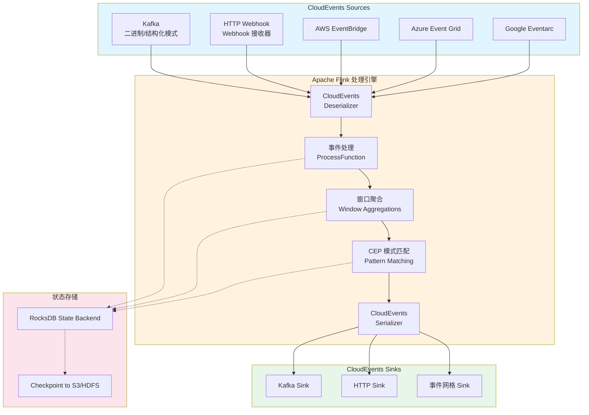
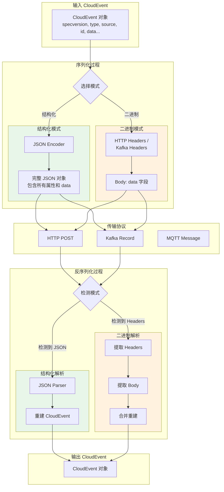
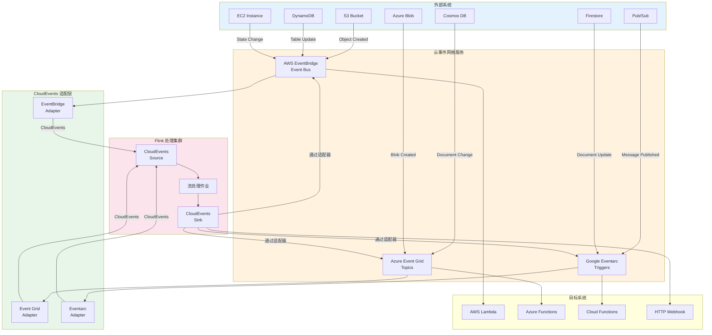
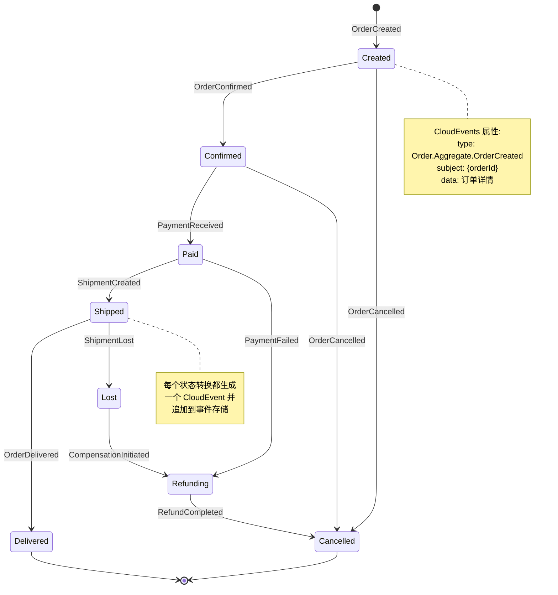

# CloudEvents 标准集成指南 (CloudEvents Integration Guide)

> **所属阶段**: Flink/04-connectors | **前置依赖**: [../../Flink/04-connectors/kafka-integration-patterns.md](kafka-integration-patterns.md) | **形式化等级**: L4

---

## 目录

- [CloudEvents 标准集成指南 (CloudEvents Integration Guide)](#cloudevents-标准集成指南-cloudevents-integration-guide)
  - [目录](#目录)
  - [1. 概念定义 (Definitions)](#1-概念定义-definitions)
    - [Def-F-04-20 (CloudEvents 规范)](#def-f-04-20-cloudevents-规范)
    - [Def-F-04-21 (CloudEvents 核心属性)](#def-f-04-21-cloudevents-核心属性)
    - [Def-F-04-22 (CloudEvents 序列化格式)](#def-f-04-22-cloudevents-序列化格式)
    - [Def-F-04-23 (事件网格适配器)](#def-f-04-23-事件网格适配器)
  - [2. 属性推导 (Properties)](#2-属性推导-properties)
    - [Lemma-F-04-20 (CloudEvents 与 Flink Schema 的兼容性)](#lemma-f-04-20-cloudevents-与-flink-schema-的兼容性)
    - [Lemma-F-04-21 (CloudEvents 传输协议的独立性)](#lemma-f-04-21-cloudevents-传输协议的独立性)
    - [Prop-F-04-20 (CloudEvents 端到端可追溯性)](#prop-f-04-20-cloudevents-端到端可追溯性)
  - [3. 关系建立 (Relations)](#3-关系建立-relations)
    - [关系 1: CloudEvents 属性与 Flink 类型系统的映射](#关系-1-cloudevents-属性与-flink-类型系统的映射)
    - [关系 2: CloudEvents 与事件溯源模式的对应](#关系-2-cloudevents-与事件溯源模式的对应)
    - [关系 3: CloudEvents 协议绑定与 Flink Connector 的集成](#关系-3-cloudevents-协议绑定与-flink-connector-的集成)
  - [4. 论证过程 (Argumentation)](#4-论证过程-argumentation)
    - [4.1 模式演进对事件互操作性的影响](#41-模式演进对事件互操作性的影响)
    - [4.2 多协议绑定的复杂性分析](#42-多协议绑定的复杂性分析)
    - [4.3 事件属性完整性与系统可观测性](#43-事件属性完整性与系统可观测性)
    - [4.4 Saga 模式中 CloudEvents 的角色分析](#44-saga-模式中-cloudevents-的角色分析)
  - [5. 形式证明 / 工程论证 (Proof / Engineering Argument)](#5-形式证明--工程论证-proof--engineering-argument)
    - [Thm-F-04-20 (CloudEvents Schema 兼容性保证)](#thm-f-04-20-cloudevents-schema-兼容性保证)
    - [Thm-F-04-21 (CloudEvents 跨系统可传递性)](#thm-f-04-21-cloudevents-跨系统可传递性)
  - [6. 实例验证 (Examples)](#6-实例验证-examples)
    - [6.1 CloudEvents 数据结构定义](#61-cloudevents-数据结构定义)
    - [6.2 从 Kafka 读取 CloudEvents](#62-从-kafka-读取-cloudevents)
    - [6.3 向 Kafka 写入 CloudEvents](#63-向-kafka-写入-cloudevents)
    - [6.4 HTTP Source 接收 CloudEvents](#64-http-source-接收-cloudevents)
    - [6.5 CloudEvents 属性提取与转换](#65-cloudevents-属性提取与转换)
    - [6.6 AWS EventBridge 集成](#66-aws-eventbridge-集成)
    - [6.7 Azure Event Grid 集成](#67-azure-event-grid-集成)
    - [6.8 Google Eventarc 集成](#68-google-eventarc-集成)
    - [6.9 事件溯源实现示例](#69-事件溯源实现示例)
    - [6.10 Saga 模式实现示例](#610-saga-模式实现示例)
  - [7. 可视化 (Visualizations)](#7-可视化-visualizations)
    - [7.1 CloudEvents 与 Flink 集成架构图](#71-cloudevents-与-flink-集成架构图)
    - [7.2 CloudEvents 序列化流程图](#72-cloudevents-序列化流程图)
    - [7.3 事件网格集成架构图](#73-事件网格集成架构图)
    - [7.4 事件溯源模式状态机](#74-事件溯源模式状态机)
  - [8. 最佳实践 (Best Practices)](#8-最佳实践-best-practices)
    - [8.1 事件溯源模式最佳实践](#81-事件溯源模式最佳实践)
    - [8.2 Saga 模式最佳实践](#82-saga-模式最佳实践)
    - [8.3 性能优化建议](#83-性能优化建议)
  - [9. 引用参考 (References)](#9-引用参考-references)

---

## 1. 概念定义 (Definitions)

### Def-F-04-20 (CloudEvents 规范)

CloudEvents 是一种用于描述事件数据的规范，旨在以通用方式简化事件声明以及跨服务、平台和系统的事件传输。设 $\mathcal{CE}$ 为 CloudEvent 实例，其形式化定义为：

$$\mathcal{CE} = (A_{core}, A_{ext}, D_{data})$$

其中：

- $A_{core} = \{specversion, type, source, id, time, datacontenttype, dataschema, subject\}$ 为核心属性集合
- $A_{ext}$ 为扩展属性集合，满足 $\forall a \in A_{ext}. \; a \notin A_{core}$
- $D_{data}$ 为事件数据载荷（可选）

**规范目标**：

| 目标 | 描述 | 实现方式 |
|------|------|----------|
| **互操作性** | 不同系统间事件的无缝传递 | 标准化的属性语义 |
| **可移植性** | 事件在不同传输协议间迁移 | 协议绑定抽象层 |
| **可扩展性** | 支持领域特定的事件属性 | 扩展属性机制 |
| **开发者友好** | 降低事件驱动架构的复杂性 | 一致的属性命名和类型 |

**直观解释**：CloudEvents 类似于邮件信封的标准格式——无论通过哪种邮政系统（协议）传递，收件人都能以一致的方式解析发件人、主题、时间等关键信息。这使得 Flink 能够以统一的方式处理来自不同事件源（Kafka、HTTP、MQTT 等）的事件数据[^1][^2]。

---

### Def-F-04-21 (CloudEvents 核心属性)

CloudEvents 规范定义了以下必需和可选的核心属性。设 $attr \in A_{core}$ 为核心属性，其语义定义如下：

**必需属性 (Required)**：

| 属性 | 类型 | 语义 | Flink 映射 |
|------|------|------|-----------|
| `specversion` | String | CloudEvents 规范版本 (如 "1.0") | 常量或元数据 |
| `type` | String | 事件类型 (如 "com.example.order.created") | STRING |
| `source` | URI | 事件来源标识符 | STRING |
| `id` | String | 事件唯一标识符 | STRING (主键候选) |

**可选但推荐的属性 (Recommended)**：

| 属性 | 类型 | 语义 | Flink 映射 |
|------|------|------|-----------|
| `time` | Timestamp | 事件产生时间 (RFC 3339) | TIMESTAMP(3) |
| `datacontenttype` | String | 数据内容类型 (如 "application/json") | STRING |
| `dataschema` | URI | 数据 Schema 引用 | STRING |
| `subject` | String | 事件主题 (在 source 上下文内的子资源) | STRING |

**形式化约束**：

$$\forall ce \in \mathcal{CE}. \; \{specversion, type, source, id\} \subseteq \text{attrs}(ce)$$

$$\forall ce \in \mathcal{CE}. \; id(ce) \neq \emptyset \land unique(id(ce))$$

**直观解释**：必需属性构成了事件的"身份标识"，类似于邮政信封上的收件人地址和邮戳。`type` 告诉系统"这是什么事件"，`source` 告诉"事件来自哪里"，`id` 确保"这是唯一的事件"，`time` 记录"何时发生"。Flink SQL 可以将这些属性映射为表的列，实现声明式的事件处理[^2]。

---

### Def-F-04-22 (CloudEvents 序列化格式)

CloudEvents 支持多种编码格式，称为**协议绑定 (Protocol Binding)**。设 $\mathcal{F}$ 为格式集合，$\mathcal{P}$ 为协议集合：

$$\mathcal{F} = \{\text{JSON}, \text{XML}, \text{Avro}, \text{Protobuf}\}$$

$$\mathcal{P} = \{\text{HTTP}, \text{Kafka}, \text{MQTT}, \text{NATS}, \text{AMQP}\}$$

**结构化内容模式 (Structured Content Mode)**：

```json
{
  "specversion": "1.0",
  "type": "com.example.order.created",
  "source": "https://order-service.example.com/orders",
  "id": "550e8400-e29b-41d4-a716-446655440000",
  "time": "2024-01-15T10:30:00Z",
  "datacontenttype": "application/json",
  "data": {
    "orderId": "ORD-12345",
    "customerId": "CUST-98765",
    "amount": 199.99
  }
}
```

**二进制内容模式 (Binary Content Mode)**：

| HTTP Header | 值 |
|-------------|-----|
| `ce-specversion` | 1.0 |
| `ce-type` | com.example.order.created |
| `ce-source` | <https://order-service.example.com/orders> |
| `ce-id` | 550e8400-e29b-41d4-a716-446655440000 |
| `ce-time` | 2024-01-15T10:30:00Z |
| `Content-Type` | application/json |

**Flink 集成策略**：

- **Table API/SQL**：使用 `ROW` 类型或自定义 `DeserializationSchema`
- **DataStream API**：实现 `DeserializationSchema<CloudEvent>`
- **Kafka Connector**：配置 `value.format` 或自定义序列化器

**直观解释**：结构化模式将所有事件信息打包在一个消息体中，便于日志记录和存储；二进制模式将元数据放在协议头部，数据放在消息体中，更适合流式传输。Flink 可以根据场景选择解析方式[^3]。

---

### Def-F-04-23 (事件网格适配器)

事件网格适配器是将 CloudEvents 与云服务商事件网格服务集成的中间层组件。设 $\mathcal{A}$ 为适配器，$\mathcal{G}$ 为事件网格服务：

$$\mathcal{A} = (T_{in}, T_{out}, M_{transform}, R_{routing})$$

其中：

- $T_{in}$：输入事件类型集合
- $T_{out}$：输出事件类型集合
- $M_{transform}$：属性映射和转换函数
- $R_{routing}$：事件路由规则

**主流事件网格服务**：

| 服务商 | 服务名称 | CloudEvents 支持 | 协议绑定 |
|--------|----------|------------------|----------|
| AWS | EventBridge | 原生支持 | HTTP, SDK |
| Azure | Event Grid | 原生支持 | HTTP, SDK |
| Google | Eventarc | 原生支持 | HTTP, gRPC |
| 阿里云 | EventBridge | 部分支持 | HTTP |

**适配器职责**：

1. **属性映射**：将服务商特定的事件格式转换为标准 CloudEvents
2. **身份验证**：处理云服务商的签名验证（如 AWS Signature V4）
3. **路由转换**：将事件网格的订阅规则映射为 Flink 的 Source/Sink 配置
4. **错误处理**：处理不可路由事件和死信队列 (DLQ)

**直观解释**：事件网格适配器就像国际旅行的"电源转换器"——不同国家的插座标准不同（云服务商的事件格式），但你的设备（Flink 作业）只需要一种接口（CloudEvents 标准）。适配器负责在两者之间进行无缝转换[^4][^5]。

---

## 2. 属性推导 (Properties)

### Lemma-F-04-20 (CloudEvents 与 Flink Schema 的兼容性)

**陈述**：CloudEvents 核心属性可以与 Flink Table Schema 建立一一对应的类型映射，且该映射保持属性的语义约束。

**证明**：

设 $\mathcal{T}_{flink}$ 为 Flink 类型系统，$\mathcal{T}_{ce}$ 为 CloudEvents 类型系统。构造映射函数 $\phi: \mathcal{T}_{ce} \to \mathcal{T}_{flink}$：

| CloudEvents 类型 | Flink SQL 类型 | 约束保持 |
|-----------------|----------------|----------|
| `String` | `STRING` | 长度无界，保持 |
| `URI` | `STRING` | RFC 3986 格式，需校验 |
| `Timestamp` | `TIMESTAMP(3)` | RFC 3339 → 毫秒精度 |
| `Binary` | `BYTES` | Base64 编解码 |
| `Map` | `MAP<STRING, STRING>` | 扩展属性映射 |
| `Any` | `STRING` 或 `BYTES` | datacontenttype 决定 |

对于任意 CloudEvents 属性 $a$，其值域 $V(a)$ 和 Flink 列值域 $V(\phi(a))$ 满足：

$$\forall v \in V(a). \; \exists v' \in V(\phi(a)). \; encode(v) = v'$$

**语义保持性**：

- `id` 的唯一性 → Flink `PRIMARY KEY` 约束
- `time` 的时序性 → Flink `WATERMARK` 定义
- `source` + `type` 的分类 → Flink `PARTITION BY` 策略

∎

**工程意义**：该引理保证了 CloudEvents 可以在 Flink SQL 中以声明式方式处理，无需编写自定义 UDF 即可实现基于时间的窗口聚合、去重和关联操作。

---

### Lemma-F-04-21 (CloudEvents 传输协议的独立性)

**陈述**：CloudEvents 规范定义了与传输协议无关的事件表示，使得同一事件可以在不同协议间无损迁移。

**证明**：

设 $ce$ 为一个 CloudEvent，$P_1, P_2 \in \mathcal{P}$ 为两个不同的传输协议。设 $serialize_P$ 和 $deserialize_P$ 分别为协议 $P$ 的序列化和反序列化函数。

需证明：

$$\forall ce. \; deserialize_{P_2}(serialize_{P_2}(deserialize_{P_1}(serialize_{P_1}(ce)))) = ce$$

**协议绑定规范保证了以下不变式**：

1. **属性名称映射**：每个协议绑定定义了 CloudEvents 属性到协议元数据字段的映射 $map_P: A_{core} \to Meta_P$
2. **值编码**：属性值使用协议兼容的编码方式（如 HTTP 使用 Header，Kafka 使用 Message Header）
3. **数据载荷**：数据部分在结构化模式中原样传递，在二进制模式中通过协议负载传递

以 Kafka 和 HTTP 为例：

| CloudEvents 属性 | HTTP Header | Kafka Header |
|-----------------|-------------|--------------|
| specversion | ce-specversion | ce_specversion |
| type | ce-type | ce_type |
| source | ce-source | ce_source |
| id | ce-id | ce_id |

由于核心属性集 $A_{core}$ 是固定的，且协议绑定规范定义了双向映射，因此协议迁移时不会丢失语义信息。

∎

**工程意义**：Flink 作业可以从 Kafka 消费 CloudEvents，处理后通过 HTTP Sink 发送到事件网格，整个过程中事件语义保持一致。

---

### Prop-F-04-20 (CloudEvents 端到端可追溯性)

**陈述**：在 CloudEvents 驱动的流处理管道中，通过 `id`、`source` 和可选的扩展属性可以实现端到端的事件血缘追踪。

**论证**：

设管道由 $n$ 个 Flink 作业组成：$J_1 \to J_2 \to \dots \to J_n$。设 $e_{in}$ 为输入事件，$E_{out}$ 为输出事件集合。

**追踪机制**：

1. **输入阶段**：$J_1$ 从 Source 读取事件 $e$，记录其 `id` 和 `source` 作为血缘起点
2. **处理阶段**：每个 $J_i$ 在处理时保留原始 `id` 或生成派生 `id`，并添加扩展属性：
   - `processtime`：处理时间戳
   - `processorid`：处理器标识
   - `parentid`：父事件 ID（用于分裂/聚合场景）
3. **输出阶段**：输出事件的 `source` 更新为当前作业标识，可选保留原始 `source` 在扩展属性中

**形式化表示**：

事件血缘图 $G = (V, E)$，其中：

- $V$ 为事件版本节点，每个节点包含完整的 CloudEvents 属性集
- $E$ 为派生关系，标记处理转换操作

**完整性保证**：

$$\forall e_{out} \in E_{out}. \; \exists \text{path}(e_{in} \leadsto e_{out})$$

**工程实现**：Flink 可以通过 `ProcessFunction` 的 Side Output 输出追踪事件，或使用 OpenTelemetry 集成实现分布式追踪。

---

## 3. 关系建立 (Relations)

### 关系 1: CloudEvents 属性与 Flink 类型系统的映射

CloudEvents 的事件结构可以自然地映射到 Flink Table API 的行（Row）类型。这种映射关系使得声明式的事件处理成为可能。

**映射关系图**：

```
CloudEvents                Flink Table Schema
─────────────────────────────────────────────────────────
┌─────────────────┐        ┌─────────────────────────┐
│ specversion     │───────>│ specversion STRING      │
│ type            │───────>│ event_type STRING       │
│ source          │───────>│ event_source STRING     │
│ id              │───────>│ event_id STRING PRIMARY │
│ time            │───────>│ event_time TIMESTAMP(3) │
│ datacontenttype │───────>│ content_type STRING     │
│ dataschema      │───────>│ schema_uri STRING       │
│ subject         │───────>│ subject STRING          │
│ data            │───────>│ event_data STRING/ROW   │
│ [extensions]    │───────>│ ext MAP<STRING,STRING>  │
└─────────────────┘        └─────────────────────────┘
```

**Flink SQL 表定义示例**：

```sql
CREATE TABLE cloudevents (
  -- CloudEvents 必需属性
  specversion STRING,
  event_type STRING,
  event_source STRING,
  event_id STRING,

  -- CloudEvents 推荐属性
  event_time TIMESTAMP(3),
  content_type STRING,
  schema_uri STRING,
  subject STRING,

  -- CloudEvents 数据载荷
  event_data STRING,

  -- 扩展属性 (JSON 格式)
  extensions STRING,

  -- 水印定义
  WATERMARK FOR event_time AS event_time - INTERVAL '5' SECOND,

  -- 主键约束 (基于 event_id)
  PRIMARY KEY (event_id) NOT ENFORCED
) WITH (
  'connector' = 'kafka',
  'topic' = 'cloudevents-in',
  'format' = 'json'
);
```

**模式演进支持**：当 CloudEvents 的 `data` 字段包含结构化数据时，可以使用 Flink 的 JSON 函数进行动态解析：

```sql
SELECT
  event_id,
  JSON_VALUE(event_data, '$.orderId') AS order_id,
  JSON_VALUE(event_data, '$.amount') AS amount
FROM cloudevents
WHERE event_type = 'com.example.order.created';
```

---

### 关系 2: CloudEvents 与事件溯源模式的对应

事件溯源 (Event Sourcing) 是一种将系统状态变更记录为不可变事件序列的架构模式。CloudEvents 的自然属性与事件溯源的要求高度契合。

**对应关系**：

| 事件溯源概念 | CloudEvents 属性 | 语义对应 |
|-------------|-----------------|----------|
| 事件 ID | `id` | 全局唯一标识 |
| 事件类型 | `type` | 聚合根 + 事件名 |
| 发生时间 | `time` | 业务时间戳 |
| 聚合根标识 | `source` + `subject` | 实体类型 + ID |
| 事件载荷 | `data` | 状态变更详情 |
| 版本控制 | `dataschema` | Schema 版本 |

**事件溯源中的 CloudEvents 结构**：

```json
{
  "specversion": "1.0",
  "type": "Order.Aggregate.OrderCreated",
  "source": "https://order-service.example.com/orders",
  "subject": "ORD-12345",
  "id": "550e8400-e29b-41d4-a716-446655440000",
  "time": "2024-01-15T10:30:00Z",
  "dataschema": "https://schemas.example.com/Order/1.0",
  "data": {
    "aggregateId": "ORD-12345",
    "version": 1,
    "customerId": "CUST-98765",
    "items": [...],
    "timestamp": "2024-01-15T10:30:00Z"
  }
}
```

**Flink 中的实现策略**：

1. **事件存储**：使用 Kafka 作为事件存储（Event Store），利用其仅追加特性
2. **投影构建**：Flink 作业读取事件流，按 `subject`（聚合根 ID）分组，重建实体状态
3. **快照优化**：定期保存投影状态，支持快速恢复

---

### 关系 3: CloudEvents 协议绑定与 Flink Connector 的集成

Flink Connector 架构可以与 CloudEvents 的协议绑定机制无缝集成，实现跨协议的事件处理。

**集成架构**：

```
┌─────────────────────────────────────────────────────────────┐
│                    Flink Runtime                             │
│  ┌──────────────┐        ┌──────────────┐                   │
│  │   Source     │        │    Sink      │                   │
│  │  (Kafka/HTTP)│        │  (Kafka/HTTP)│                   │
│  └──────┬───────┘        └──────┬───────┘                   │
│         │                       │                           │
│         ▼                       ▲                           │
│  ┌─────────────────────────────────────┐                    │
│  │   CloudEvents Deserialization       │                    │
│  │   /Serialization Layer              │                    │
│  │                                     │                    │
│  │  ┌──────────────┐  ┌──────────────┐ │                    │
│  │  │ JSON Format  │  │ Avro Format  │ │                    │
│  │  └──────────────┘  └──────────────┘ │                    │
│  └─────────────────────────────────────┘                    │
└─────────────────────────────────────────────────────────────┘
```

**Source 端集成**：

- **Kafka Source**：使用 `CloudEventsKafkaDeserializationSchema` 解析 Kafka Headers 或 Value 中的 CloudEvents 属性
- **HTTP Source**：使用 Flink 的 Async I/O 或自定义 Source Function 接收 CloudEvents Webhook

**Sink 端集成**：

- **Kafka Sink**：配置 `CloudEventsKafkaSerializationSchema` 将事件序列化为 CloudEvents 格式
- **HTTP Sink**：使用 `AsyncHttpSink` 发送 CloudEvents 到事件网格端点


---

## 4. 论证过程 (Argumentation)

### 4.1 模式演进对事件互操作性的影响

在分布式系统中，事件 Schema 演进是不可避免的。CloudEvents 提供了处理模式演进的机制，但需要仔细设计以确保向后兼容性。

**场景分析**：

设初始 Schema $S_0$ 和演进后 Schema $S_1$，考虑以下变更类型：

| 变更类型 | 向后兼容 | 向前兼容 | 处理策略 |
|----------|----------|----------|----------|
| 添加可选字段 | ✓ | ✗ | 默认值处理 |
| 添加必需字段 | ✗ | ✗ | 需要协调部署 |
| 删除字段 | ✗ | ✓ | 版本路由 |
| 字段类型变更 | ✗ | ✗ | 转换函数 |
| 字段重命名 | ✗ | ✗ | 别名映射 |

**CloudEvents 中的演进支持**：

1. **Schema 版本标识**：使用 `dataschema` 属性引用特定版本的 Schema
2. **内容类型协商**：`datacontenttype` 可以指示数据编码格式（如 Avro 的 Schema ID）
3. **扩展属性迁移**：可以将旧字段作为扩展属性保留一段时间

**Flink 中的演进处理策略**：

```java
// 使用 Schema 版本进行路由
DataStream<CloudEvent> events = env
  .fromSource(kafkaSource, WatermarkStrategy.noWatermarks(), "Kafka")
  .process(new SchemaRoutingFunction());

// 根据 dataschema 路由到不同的处理逻辑
class SchemaRoutingFunction extends ProcessFunction<CloudEvent, CloudEvent> {
  @Override
  public void processElement(CloudEvent event, Context ctx, Collector<CloudEvent> out) {
    String schemaUri = event.getExtension("dataschema");

    if ("https://schemas.example.com/Order/1.0".equals(schemaUri)) {
      // 处理 v1.0 事件
      out.collect(handleV1(event));
    } else if ("https://schemas.example.com/Order/2.0".equals(schemaUri)) {
      // 处理 v2.0 事件
      out.collect(handleV2(event));
    } else {
      // 发送到死信队列或日志
      ctx.output(dlqTag, event);
    }
  }
}
```

---

### 4.2 多协议绑定的复杂性分析

CloudEvents 支持多种协议绑定（HTTP、Kafka、MQTT 等），这为系统集成提供了灵活性，但也带来了复杂性。

**复杂性来源**：

1. **属性映射差异**：不同协议对属性名称的编码方式不同
   - HTTP：`ce-type`（带连字符的 Header 名称）
   - Kafka：`ce_type`（下划线分隔的 Header 键）
   - MQTT：主题路径中的属性编码

2. **内容模式选择**：
   - 结构化模式：所有信息在消息体中，便于日志记录
   - 二进制模式：元数据在协议头部，性能更好但依赖协议支持

3. **传输语义差异**：
   - HTTP：请求-响应模式，需要处理重试和幂等性
   - Kafka：流式消费，支持回溯和重放
   - MQTT：发布-订阅，有 QoS 等级概念

**工程权衡**：

| 因素 | 结构化模式 | 二进制模式 |
|------|-----------|-----------|
| 可读性 | 高（JSON 可直接查看） | 低（分散在 Headers） |
| 性能 | 低（需要解析 JSON） | 高（直接访问 Headers） |
| 协议独立性 | 高（不依赖协议特性） | 低（依赖 Header 支持） |
| 存储效率 | 低（JSON 冗余） | 高（紧凑编码） |

**Flink 集成建议**：

- 内部系统间通信（Kafka）：优先使用二进制模式，性能更优
- 外部系统集成（HTTP Webhook）：使用结构化模式，便于调试
- 混合场景：实现自适应解析器，自动检测内容模式

---

### 4.3 事件属性完整性与系统可观测性

CloudEvents 属性的完整性直接影响系统的可观测性和故障排查能力。

**属性重要性矩阵**：

| 属性 | 调试 | 监控 | 审计 | 关联 | 推荐级别 |
|------|------|------|------|------|----------|
| `id` | 高 | 中 | 高 | 高 | 必需 |
| `time` | 中 | 高 | 高 | 高 | 必需 |
| `source` | 高 | 高 | 中 | 高 | 必需 |
| `type` | 高 | 高 | 中 | 高 | 必需 |
| `traceparent` | 高 | 低 | 低 | 高 | 推荐 |
| `datacontenttype` | 中 | 低 | 低 | 中 | 可选 |

**可观测性增强策略**：

1. **分布式追踪**：添加 W3C Trace Context 作为扩展属性

   ```json
   {
     "traceparent": "00-0af7651916cd43dd8448eb211c80319c-b7ad6b7169203331-01"
   }
   ```

2. **结构化日志**：在 Flink 作业中记录完整的 CloudEvents 上下文

   ```java
   LOG.info("Processing event",
     keyValue("ce.id", event.getId()),
     keyValue("ce.type", event.getType()),
     keyValue("ce.source", event.getSource())
   );
   ```

3. **度量指标**：按 `type` 和 `source` 维度聚合处理指标

   ```java
   meterRegistry.counter("events.processed",
     "type", event.getType(),
     "source", event.getSource()
   ).increment();
   ```

---

### 4.4 Saga 模式中 CloudEvents 的角色分析

Saga 模式用于管理分布式事务，CloudEvents 在其中扮演事件载体和状态机触发器的双重角色。

**Saga 事件类型分类**：

| 事件类别 | CloudEvents Type 前缀 | 语义 |
|----------|----------------------|------|
| 命令事件 | `{domain}.command.{action}` | 请求执行操作 |
| 成功事件 | `{domain}.event.{action}Succeeded` | 操作成功完成 |
| 失败事件 | `{domain}.event.{action}Failed` | 操作执行失败 |
| 补偿事件 | `{domain}.compensation.{action}` | 请求回滚操作 |

**Saga 协调器中的事件路由**：

```
┌─────────────────────────────────────────────────────────────┐
│                    Saga Orchestrator                        │
│                     (Flink CEP/ProcessFunction)             │
├─────────────────────────────────────────────────────────────┤
│                                                             │
│  ┌─────────────┐    ┌─────────────┐    ┌─────────────┐     │
│  │  Start Saga │───>│  Step 1     │───>│  Step 2     │     │
│  │  (Order     │    │  (Reserve   │    │  (Charge    │     │
│  │   Created)  │    │   Stock)    │    │   Payment)  │     │
│  └─────────────┘    └──────┬──────┘    └──────┬──────┘     │
│                            │                   │            │
│                       ┌────┴────┐         ┌────┴────┐       │
│                       ▼         ▼         ▼         ▼       │
│                  ┌────────┐ ┌────────┐ ┌────────┐ ┌────────┐│
│                  │Success │ │ Failure│ │Success │ │ Failure││
│                  └────┬───┘ └────┬───┘ └────┬───┘ └────┬───┘│
│                       │          │          │          │   │
│                       ▼          ▼          ▼          ▼   │
│                   ┌────────┐ ┌────────┐ ┌────────┐ ┌────────┐
│                   │ Step 2 │ │Release │ │Complete│ │Refund  │
│                   └────────┘ │ Stock  │ │  Saga  │ │Payment │
│                              └────────┘ └────────┘ └────────┘
└─────────────────────────────────────────────────────────────┘
```

**CloudEvents 在 Saga 中的扩展属性**：

| 扩展属性 | 用途 | 示例值 |
|----------|------|--------|
| `sagaid` | Saga 实例标识 | `saga-550e8400-e29b` |
| `stepid` | 当前步骤标识 | `step-2` |
| `correlationid` | 业务关联 ID | `order-12345` |
| `retrycount` | 重试次数 | `2` |

---

## 5. 形式证明 / 工程论证 (Proof / Engineering Argument)

### Thm-F-04-20 (CloudEvents Schema 兼容性保证)

**定理陈述**：设 $S_1$ 和 $S_2$ 为 CloudEvents 的两个 Schema 版本，若 $S_2$ 仅通过添加可选字段和扩展属性演进自 $S_1$，则任何有效的 $S_1$ 事件也是有效的 $S_2$ 事件（向后兼容性）。

**证明**：

设 $V(S)$ 为符合 Schema $S$ 的事件集合。需证明 $V(S_1) \subseteq V(S_2)$。

**前提条件**：

1. $A_{core}(S_1) = A_{core}(S_2)$（核心属性集不变）
2. $\forall a \in A_{new}(S_2). \; a \notin A_{req}(S_2)$（新属性均为可选）
3. $A_{ext}(S_1) \subseteq A_{ext}(S_2)$（扩展属性超集关系）

**证明步骤**：

对于任意事件 $e \in V(S_1)$：

1. 根据 CloudEvents 规范，$e$ 满足所有 $S_1$ 的必需属性约束：
   $$\forall a \in A_{req}(S_1). \; a \in e \land valid(e.a)$$

2. 由于 $A_{req}(S_1) = A_{req}(S_2)$，$e$ 满足 $S_2$ 的必需属性约束

3. 对于 $S_2$ 的可选属性：
   - 原有可选属性：$e$ 可能包含也可能不包含，不影响有效性
   - 新增可选属性：$e$ 不包含这些属性，根据可选属性语义，这是允许的

4. 因此 $e$ 满足 $S_2$ 的所有约束，即 $e \in V(S_2)$

$$\forall e \in V(S_1). \; e \in V(S_2) \Rightarrow V(S_1) \subseteq V(S_2)$$

∎

**工程推论**：在 Flink 作业中，可以安全地将 $S_2$ 的解析器用于处理 $S_1$ 事件，只需对缺失的新属性提供默认值处理。

---

### Thm-F-04-21 (CloudEvents 跨系统可传递性)

**定理陈述**：设系统 $A$ 发送 CloudEvent $e$ 到系统 $B$，系统 $B$ 处理后发送 $e'$ 到系统 $C$。若系统 $B$ 保持 `id`、`source` 和 `type` 属性不变（或正确传递），则事件血缘 $e \leadsto e'$ 可被追踪。

**工程论证**：

**场景定义**：

- $e = (A_{core}, A_{ext}, D_{data})$ 为原始事件
- $B$ 的处理函数为 $f_B: e \mapsto e'$
- $e' = (A'_{core}, A'_{ext}, D'_{data})$ 为派生事件

**可追踪性条件**：

1. **身份保持**：$id(e') = id(e)$ 或 $id(e') = newId() \land parentid(e') = id(e)$
2. **来源记录**：$source(e') = \text{"system-b"}$ 或保留原始 $source(e)$ 在扩展属性中
3. **类型转换**：$type(e')$ 反映处理语义（如从 `Order.Created` 到 `Order.Processed`）

**Flink 中的实现保证**：

```java
public class TraceableCloudEventProcessor
    extends ProcessFunction<CloudEvent, CloudEvent> {

  @Override
  public void processElement(CloudEvent input, Context ctx,
                            Collector<CloudEvent> out) {
    // 保持或传递事件 ID
    String parentId = input.getId();
    String newId = generateNewId();

    CloudEvent output = CloudEventBuilder.v1()
      .withId(newId)
      .withSource(URI.create("https://flink-job.example.com/processor"))
      .withType("com.example.OrderProcessed")
      .withTime(OffsetDateTime.now())
      // 传递血缘信息
      .withExtension("parentid", parentId)
      .withExtension("originalsource", input.getSource().toString())
      .withExtension("originaltype", input.getType())
      .build();

    out.collect(output);
  }
}
```

**完整性验证**：

对于事件血缘链 $e_1 \to e_2 \to \dots \to e_n$，可以通过递归查询 `parentid` 属性重建完整路径：

$$path(e_n) = [e_n, parent(e_n), parent(parent(e_n)), \dots, root]$$

其中 $root$ 满足 $parent(root) = \emptyset$。

---

## 6. 实例验证 (Examples)

### 6.1 CloudEvents 数据结构定义

**Java POJO 定义**：

```java
import io.cloudevents.CloudEvent;
import io.cloudevents.core.v1.CloudEventBuilder;
import java.net.URI;
import java.time.OffsetDateTime;

/**
 * CloudEvents 数据结构包装类
 * 用于 Flink 类型系统的集成
 */
public class CloudEventWrapper {

  private String specversion;
  private String type;
  private String source;
  private String id;
  private OffsetDateTime time;
  private String datacontenttype;
  private String dataschema;
  private String subject;
  private byte[] data;
  private Map<String, String> extensions;

  // 构造器、Getter、Setter
  public CloudEventWrapper() {}

  public static CloudEventWrapper fromCloudEvent(CloudEvent event) {
    CloudEventWrapper wrapper = new CloudEventWrapper();
    wrapper.specversion = event.getSpecVersion().toString();
    wrapper.type = event.getType();
    wrapper.source = event.getSource().toString();
    wrapper.id = event.getId();
    wrapper.time = event.getTime().orElse(null);
    wrapper.datacontenttype = event.getDataContentType().orElse(null);
    wrapper.dataschema = event.getDataSchema().map(URI::toString).orElse(null);
    wrapper.subject = event.getSubject().orElse(null);
    wrapper.data = event.getData().toBytes();

    // 提取扩展属性
    wrapper.extensions = new HashMap<>();
    event.getExtensionNames().forEach(name ->
      wrapper.extensions.put(name, event.getExtension(name).toString())
    );

    return wrapper;
  }

  public CloudEvent toCloudEvent() {
    CloudEventBuilder builder = CloudEventBuilder.v1()
      .withId(id)
      .withSource(URI.create(source))
      .withType(type);

    if (time != null) builder.withTime(time);
    if (datacontenttype != null) builder.withDataContentType(datacontenttype);
    if (dataschema != null) builder.withDataSchema(URI.create(dataschema));
    if (subject != null) builder.withSubject(subject);
    if (data != null) builder.withData(data);

    // 添加扩展属性
    if (extensions != null) {
      extensions.forEach((k, v) -> builder.withExtension(k, v));
    }

    return builder.build();
  }
}
```

---

### 6.2 从 Kafka 读取 CloudEvents

**使用 Kafka Source 和自定义 Deserializer**：

```java
import org.apache.flink.connector.kafka.source.KafkaSource;
import org.apache.flink.connector.kafka.source.reader.deserializer.KafkaRecordDeserializationSchema;
import org.apache.flink.api.common.serialization.DeserializationSchema;
import org.apache.flink.api.common.typeinfo.TypeInformation;
import io.cloudevents.CloudEvent;
import io.cloudevents.core.data.PojoCloudEventData;
import io.cloudevents.kafka.CloudEventDeserializer;

public class CloudEventsKafkaSource {

  public static KafkaSource<CloudEvent> createSource() {
    Properties props = new Properties();
    props.setProperty("bootstrap.servers", "localhost:9092");
    props.setProperty("group.id", "flink-cloudevents-consumer");

    // 配置 CloudEvents Kafka Deserializer
    props.setProperty(CloudEventDeserializer.ENCODING_CONFIG,
                      Encoding.STRUCTURED.toString());

    return KafkaSource.<CloudEvent>builder()
      .setTopics("cloudevents-in")
      .setProperties(props)
      .setDeserializer(new CloudEventDeserializationSchema())
      .setStartingOffsets(OffsetsInitializer.earliest())
      .build();
  }

  /**
   * 自定义 CloudEvents 反序列化 Schema
   * 支持结构化和二进制两种模式
   */
  public static class CloudEventDeserializationSchema
      implements KafkaRecordDeserializationSchema<CloudEvent> {

    private transient CloudEventDeserializer deserializer;

    @Override
    public void open(DeserializationSchema.InitializationContext context) {
      deserializer = new CloudEventDeserializer();
    }

    @Override
    public void deserialize(ConsumerRecord<byte[], byte[]> record,
                           Collector<CloudEvent> out) {
      // 尝试二进制模式（Headers）
      Headers headers = record.headers();
      if (hasCloudEventsHeaders(headers)) {
        out.collect(deserializer.deserialize(record.topic(), headers, record.value()));
      } else {
        // 结构化模式（JSON in value）
        out.collect(deserializer.deserialize(record.topic(), record.value()));
      }
    }

    private boolean hasCloudEventsHeaders(Headers headers) {
      return StreamSupport.stream(headers.spliterator(), false)
        .anyMatch(h -> h.key().startsWith("ce_"));
    }

    @Override
    public TypeInformation<CloudEvent> getProducedType() {
      return TypeInformation.of(CloudEvent.class);
    }
  }
}
```

**使用 Flink SQL Table API**：

```java
// 注册 CloudEvents Kafka 表
TableEnvironment tableEnv = TableEnvironment.create(EnvironmentSettings.inStreamingMode());

tableEnv.executeSql("""
  CREATE TABLE cloudevents_kafka (
    specversion STRING,
    event_type STRING,
    event_source STRING,
    event_id STRING,
    event_time TIMESTAMP(3),
    content_type STRING,
    event_data STRING,
    extensions STRING,
    WATERMARK FOR event_time AS event_time - INTERVAL '5' SECOND
  ) WITH (
    'connector' = 'kafka',
    'topic' = 'cloudevents-in',
    'properties.bootstrap.servers' = 'localhost:9092',
    'properties.group.id' = 'flink-sql-consumer',
    'format' = 'json',
    'json.ignore-parse-errors' = 'true'
  )
""");

// 查询和处理
Table result = tableEnv.sqlQuery("""
  SELECT
    event_id,
    event_type,
    event_source,
    event_time,
    JSON_VALUE(event_data, '$.orderId') as order_id,
    CAST(JSON_VALUE(event_data, '$.amount') AS DECIMAL(10,2)) as amount
  FROM cloudevents_kafka
  WHERE event_type = 'com.example.order.created'
""");
```


---

### 6.3 向 Kafka 写入 CloudEvents

**使用 Kafka Sink 和自定义 Serializer**：

```java
import org.apache.flink.connector.kafka.sink.KafkaSink;
import org.apache.flink.connector.kafka.sink.KafkaRecordSerializationSchema;
import io.cloudevents.CloudEvent;
import io.cloudevents.kafka.CloudEventSerializer;
import io.cloudevents.kafka.CloudEventSerializer.Encoding;
import org.apache.kafka.clients.producer.ProducerRecord;

public class CloudEventsKafkaSink {

  public static KafkaSink<CloudEvent> createSink() {
    Properties props = new Properties();
    props.setProperty("bootstrap.servers", "localhost:9092");
    props.setProperty("acks", "all");
    props.setProperty("enable.idempotence", "true");

    // 配置 CloudEvents 编码模式
    props.setProperty(CloudEventSerializer.ENCODING_CONFIG,
                      Encoding.STRUCTURED.toString());
    props.setProperty(CloudEventSerializer.EVENT_FORMAT_CONFIG,
                      "application/cloudevents+json");

    return KafkaSink.<CloudEvent>builder()
      .setKafkaProducerConfig(props)
      .setRecordSerializer(new CloudEventSerializationSchema())
      .setDeliveryGuarantee(DeliveryGuarantee.EXACTLY_ONCE)
      .build();
  }

  /**
   * 自定义 CloudEvents 序列化 Schema
   * 根据事件类型路由到不同 Topic
   */
  public static class CloudEventSerializationSchema
      implements KafkaRecordSerializationSchema<CloudEvent> {

    private transient CloudEventSerializer serializer;
    private String defaultTopic;

    public CloudEventSerializationSchema(String defaultTopic) {
      this.defaultTopic = defaultTopic;
    }

    @Override
    public void open(SerializationSchema.InitializationContext context,
                     KafkaSinkContext sinkContext) {
      serializer = new CloudEventSerializer();
      serializer.configure(new HashMap<>(), false);
    }

    @Override
    public ProducerRecord<byte[], byte[]> serialize(CloudEvent event,
                                                    KafkaSinkContext context,
                                                    Long timestamp) {
      // 根据事件类型动态选择 Topic
      String topic = resolveTopic(event.getType());

      // 序列化 CloudEvent
      byte[] value = serializer.serialize(topic, event);

      // 构造 ProducerRecord
      return new ProducerRecord<>(
        topic,           // topic
        null,            // partition (由 Kafka 分区器决定)
        timestamp,       // timestamp
        event.getId().getBytes(StandardCharsets.UTF_8),  // key (使用 event id)
        value,           // value
        null             // headers (在结构化模式中，元数据在 value 中)
      );
    }

    private String resolveTopic(String eventType) {
      // 基于事件类型的 Topic 路由逻辑
      if (eventType.startsWith("com.example.order")) {
        return "orders-events";
      } else if (eventType.startsWith("com.example.payment")) {
        return "payments-events";
      }
      return defaultTopic;
    }
  }
}

// 完整作业示例
public class CloudEventsToKafkaJob {

  public static void main(String[] args) throws Exception {
    StreamExecutionEnvironment env =
      StreamExecutionEnvironment.getExecutionEnvironment();
    env.enableCheckpointing(60000);

    // 创建输入 Source
    KafkaSource<CloudEvent> source = CloudEventsKafkaSource.createSource();

    // 创建输出 Sink
    KafkaSink<CloudEvent> sink = CloudEventsKafkaSink.createSink();

    // 构建处理管道
    env.fromSource(source, WatermarkStrategy.noWatermarks(), "CloudEvents Input")
      .map(event -> {
        // 可以在这里进行事件转换
        return CloudEventBuilder.v1(event)
          .withExtension("processedby", "flink-job-v1")
          .withExtension("processingtime", OffsetDateTime.now().toString())
          .build();
      })
      .sinkTo(sink);

    env.execute("CloudEvents Processing Job");
  }
}
```

---

### 6.4 HTTP Source 接收 CloudEvents

**使用 Flink Async I/O 接收 Webhook**：

```java
import org.apache.flink.streaming.api.functions.async.AsyncFunction;
import org.apache.flink.streaming.api.functions.async.ResultFuture;
import io.cloudevents.CloudEvent;
import io.cloudevents.http.vertx.VertxMessageFactory;
import io.vertx.core.Vertx;
import io.vertx.ext.web.client.WebClient;

/**
 * HTTP Source 使用 Async HTTP 客户端轮询或 Webhook 接收器
 */
public class CloudEventsHttpSource {

  /**
   * 方案 1: 使用 AsyncFunction 轮询 HTTP 端点
   */
  public static class HttpPollingAsyncFunction
      implements AsyncFunction<String, CloudEvent> {

    private transient WebClient client;
    private final String endpoint;

    public HttpPollingAsyncFunction(String endpoint) {
      this.endpoint = endpoint;
    }

    @Override
    public void open(Configuration parameters) {
      Vertx vertx = Vertx.vertx();
      client = WebClient.create(vertx);
    }

    @Override
    public void asyncInvoke(String requestId, ResultFuture<CloudEvent> resultFuture) {
      client.getAbs(endpoint + "/events/" + requestId)
        .putHeader("Accept", "application/cloudevents+json")
        .send(ar -> {
          if (ar.succeeded()) {
            VertxMessageFactory.createReader(ar.result())
              .toCloudEvent()
              .onSuccess(resultFuture::complete)
              .onFailure(resultFuture::completeExceptionally);
          } else {
            resultFuture.completeExceptionally(ar.cause());
          }
        });
    }
  }

  /**
   * 方案 2: 使用自定义 SourceFunction 实现 Webhook 接收器
   */
  public static class CloudEventsWebhookSource
      extends RichParallelSourceFunction<CloudEvent> {

    private transient HttpServer server;
    private transient BlockingQueue<CloudEvent> queue;
    private volatile boolean isRunning = true;
    private final int port;

    public CloudEventsWebhookSource(int port) {
      this.port = port;
    }

    @Override
    public void open(Configuration parameters) {
      queue = new LinkedBlockingQueue<>(10000);

      server = HttpServer.create(new InetSocketAddress(port), 0);
      server.createContext("/webhook", exchange -> {
        try {
          // 读取 HTTP Headers 构建 CloudEvent
          CloudEvent event = parseCloudEventFromHttp(exchange);
          queue.offer(event, 100, TimeUnit.MILLISECONDS);

          exchange.sendResponseHeaders(200, 0);
        } catch (Exception e) {
          exchange.sendResponseHeaders(500, 0);
        } finally {
          exchange.close();
        }
      });
      server.start();
    }

    private CloudEvent parseCloudEventFromHttp(HttpExchange exchange) {
      Headers headers = exchange.getRequestHeaders();

      // 读取二进制模式下的 Headers
      String specVersion = headers.getFirst("ce-specversion");
      String type = headers.getFirst("ce-type");
      String source = headers.getFirst("ce-source");
      String id = headers.getFirst("ce-id");
      String time = headers.getFirst("ce-time");

      // 读取 Body
      byte[] body = exchange.getRequestBody().readAllBytes();

      return CloudEventBuilder.v1()
        .withId(id)
        .withSource(URI.create(source))
        .withType(type)
        .withTime(OffsetDateTime.parse(time))
        .withData(body)
        .build();
    }

    @Override
    public void run(SourceContext<CloudEvent> ctx) throws Exception {
      while (isRunning) {
        CloudEvent event = queue.poll(100, TimeUnit.MILLISECONDS);
        if (event != null) {
          synchronized (ctx.getCheckpointLock()) {
            ctx.collect(event);
          }
        }
      }
    }

    @Override
    public void cancel() {
      isRunning = false;
      if (server != null) {
        server.stop(0);
      }
    }
  }
}
```

---

### 6.5 CloudEvents 属性提取与转换

**使用 Flink ProcessFunction 进行属性处理**：

```java
import org.apache.flink.streaming.api.functions.ProcessFunction;
import org.apache.flink.util.Collector;
import com.fasterxml.jackson.databind.JsonNode;
import com.fasterxml.jackson.databind.ObjectMapper;

/**
 * CloudEvents 属性提取和转换
 */
public class CloudEventTransformations {

  /**
   * 提取 CloudEvents 数据载荷并转换为业务对象
   */
  public static class OrderEventExtractor
      extends ProcessFunction<CloudEvent, Order> {

    private transient ObjectMapper mapper;

    @Override
    public void open(Configuration parameters) {
      mapper = new ObjectMapper();
    }

    @Override
    public void processElement(CloudEvent event, Context ctx, Collector<Order> out) {
      try {
        // 读取 data 字段
        byte[] data = event.getData().toBytes();
        JsonNode jsonNode = mapper.readTree(data);

        // 提取 CloudEvents 元数据作为订单属性
        Order order = new Order();
        order.setEventId(event.getId());
        order.setEventTime(event.getTime().orElse(Instant.now()));
        order.setEventSource(event.getSource().toString());
        order.setEventType(event.getType());

        // 提取业务数据
        order.setOrderId(jsonNode.get("orderId").asText());
        order.setCustomerId(jsonNode.get("customerId").asText());
        order.setAmount(new BigDecimal(jsonNode.get("amount").asText()));
        order.setItems(mapper.convertValue(jsonNode.get("items"),
                                          new TypeReference<List<OrderItem>>() {}));

        out.collect(order);
      } catch (Exception e) {
        // 发送到侧输出流进行错误处理
        ctx.output(INVALID_EVENTS_TAG,
          new InvalidEvent(event.getId(), e.getMessage(), event));
      }
    }
  }

  /**
   * CloudEvents 富化处理器：添加扩展属性
   */
  public static class CloudEventEnricher
      extends ProcessFunction<CloudEvent, CloudEvent> {

    @Override
    public void processElement(CloudEvent event, Context ctx,
                               Collector<CloudEvent> out) {

      CloudEventBuilder builder = CloudEventBuilder.v1(event);

      // 添加处理相关的扩展属性
      builder.withExtension("processingtimestamp",
                           OffsetDateTime.now().toString());
      builder.withExtension("processorinstance",
                           getRuntimeContext().getIndexOfThisSubtask());
      builder.withExtension("watermark",
                           ctx.timerService().currentWatermark());

      // 添加追踪信息 (如果存在)
      String traceId = ctx.getCurrentKey();  // 或使用分布式追踪上下文
      if (traceId != null) {
        builder.withExtension("traceid", traceId);
      }

      out.collect(builder.build());
    }
  }

  /**
   * CloudEvents 路由处理器：根据类型路由到不同输出
   */
  public static class CloudEventRouter
      extends ProcessFunction<CloudEvent, CloudEvent> {

    private final Map<String, OutputTag<CloudEvent>> outputTags;

    public CloudEventRouter() {
      outputTags = new HashMap<>();
      outputTags.put("order.created",
        new OutputTag<CloudEvent>("order-created"){});
      outputTags.put("order.updated",
        new OutputTag<CloudEvent>("order-updated"){});
      outputTags.put("order.cancelled",
        new OutputTag<CloudEvent>("order-cancelled"){});
    }

    @Override
    public void processElement(CloudEvent event, Context ctx,
                               Collector<CloudEvent> out) {
      String eventType = event.getType();

      // 获取最后一个 segment 作为路由键
      String routingKey = eventType.substring(eventType.lastIndexOf('.') + 1);

      OutputTag<CloudEvent> tag = outputTags.get(routingKey);
      if (tag != null) {
        ctx.output(tag, event);
      } else {
        // 默认输出
        out.collect(event);
      }
    }
  }
}

// 业务对象定义
@Data
public class Order {
  private String eventId;
  private Instant eventTime;
  private String eventSource;
  private String eventType;

  private String orderId;
  private String customerId;
  private BigDecimal amount;
  private List<OrderItem> items;
}
```

---

### 6.6 AWS EventBridge 集成

**AWS EventBridge 与 Flink 集成配置**：

```java
import software.amazon.awssdk.services.eventbridge.EventBridgeClient;
import software.amazon.awssdk.services.eventbridge.model.PutEventsRequest;
import software.amazon.awssdk.services.eventbridge.model.PutEventsRequestEntry;

/**
 * AWS EventBridge CloudEvents 集成
 */
public class AWSEventBridgeIntegration {

  /**
   * Flink Sink 发送 CloudEvents 到 AWS EventBridge
   */
  public static class EventBridgeSink
      extends RichSinkFunction<CloudEvent> {

    private transient EventBridgeClient client;
    private final String eventBusName;
    private final String region;

    public EventBridgeSink(String eventBusName, String region) {
      this.eventBusName = eventBusName;
      this.region = region;
    }

    @Override
    public void open(Configuration parameters) {
      client = EventBridgeClient.builder()
        .region(Region.of(region))
        .build();
    }

    @Override
    public void invoke(CloudEvent event, Context context) {
      // 将 CloudEvent 转换为 EventBridge 格式
      PutEventsRequestEntry entry = PutEventsRequestEntry.builder()
        .eventBusName(eventBusName)
        .source(event.getSource().toString())
        .detailType(event.getType())
        .detail(new String(event.getData().toBytes()))
        .time(event.getTime().map(OffsetDateTime::toInstant).orElse(Instant.now()))
        .resources(event.getSubject().map(Collections::singletonList).orElse(null))
        .build();

      PutEventsRequest request = PutEventsRequest.builder()
        .entries(entry)
        .build();

      client.putEvents(request);
    }

    @Override
    public void close() {
      if (client != null) {
        client.close();
      }
    }
  }

  /**
   * AWS EventBridge 到 CloudEvents 的转换
   */
  public static CloudEvent fromEventBridgeEvent(JsonNode event) {
    return CloudEventBuilder.v1()
      .withId(event.get("id").asText())
      .withSource(URI.create(event.get("source").asText()))
      .withType(event.get("detail-type").asText())
      .withTime(OffsetDateTime.parse(event.get("time").asText()))
      .withData(event.get("detail").toString().getBytes())
      .withExtension("awsregion", event.get("region").asText())
      .withExtension("accountid", event.get("account").asText())
      .build();
  }
}
```

---

### 6.7 Azure Event Grid 集成

**Azure Event Grid CloudEvents 集成**：

```java
import com.azure.messaging.eventgrid.EventGridPublisherClient;
import com.azure.messaging.eventgrid.EventGridPublisherClientBuilder;
import com.azure.core.models.CloudEvent as AzureCloudEvent;

/**
 * Azure Event Grid CloudEvents 集成
 */
public class AzureEventGridIntegration {

  /**
   * Flink Sink 发送 CloudEvents 到 Azure Event Grid
   */
  public static class EventGridSink
      extends RichSinkFunction<CloudEvent> {

    private transient EventGridPublisherClient<AzureCloudEvent> client;
    private final String endpoint;
    private final String accessKey;

    public EventGridSink(String endpoint, String accessKey) {
      this.endpoint = endpoint;
      this.accessKey = accessKey;
    }

    @Override
    public void open(Configuration parameters) {
      client = new EventGridPublisherClientBuilder()
        .endpoint(endpoint)
        .credential(new AzureKeyCredential(accessKey))
        .buildCloudEventPublisherClient();
    }

    @Override
    public void invoke(CloudEvent event, Context context) {
      // CloudEvents 1.0 与 Azure CloudEvent 兼容
      AzureCloudEvent azureEvent = AzureCloudEvent
        .fromString(new String(event.getData().toBytes()))
        .setType(event.getType())
        .setSource(event.getSource().toString())
        .setId(event.getId())
        .setTime(event.getTime().orElse(OffsetDateTime.now()))
        .setSubject(event.getSubject().orElse(null))
        .setDataSchema(event.getDataSchema().map(URI::toString).orElse(null))
        .setDataContentType(event.getDataContentType().orElse("application/json"))
        .build();

      client.sendEvent(azureEvent);
    }
  }

  /**
   * Azure Event Grid Webhook 处理器
   */
  public static CloudEvent fromEventGridWebhook(String requestBody) {
    JsonNode event = new ObjectMapper().readTree(requestBody);

    return CloudEventBuilder.v1()
      .withId(event.get("id").asText())
      .withSource(URI.create(event.get("source").asText()))
      .withType(event.get("eventType").asText())
      .withTime(OffsetDateTime.parse(event.get("eventTime").asText()))
      .withSubject(event.has("subject") ? event.get("subject").asText() : null)
      .withData(event.get("data").toString().getBytes())
      .withExtension("eventgridschemaversion", "1.0")
      .build();
  }
}
```

---

### 6.8 Google Eventarc 集成

**Google Eventarc CloudEvents 集成**：

```java
import com.google.cloud.eventarc.v1.EventarcClient;
import com.google.cloud.eventarc.v1.CreateTriggerRequest;
import com.google.protobuf.util.Timestamps;

/**
 * Google Eventarc CloudEvents 集成
 */
public class GoogleEventarcIntegration {

  /**
   * 发送 CloudEvents 到 Google Eventarc (通过 Pub/Sub)
   */
  public static class EventarcPubSubSink
      extends RichSinkFunction<CloudEvent> {

    private transient Publisher publisher;
    private final String projectId;
    private final String topicId;

    public EventarcPubSubSink(String projectId, String topicId) {
      this.projectId = projectId;
      this.topicId = topicId;
    }

    @Override
    public void open(Configuration parameters) throws IOException {
      TopicName topicName = TopicName.of(projectId, topicId);
      publisher = Publisher.newBuilder(topicName).build();
    }

    @Override
    public void invoke(CloudEvent event, Context context) {
      try {
        // 构建 Pub/Sub 消息，包含 CloudEvents 属性
        Map<String, String> attributes = new HashMap<>();
        attributes.put("ce-specversion", "1.0");
        attributes.put("ce-type", event.getType());
        attributes.put("ce-source", event.getSource().toString());
        attributes.put("ce-id", event.getId());
        attributes.put("ce-time", event.getTime().map(OffsetDateTime::toString).orElse(""));

        // 添加扩展属性
        event.getExtensionNames().forEach(name ->
          attributes.put("ce-" + name, event.getExtension(name).toString())
        );

        ByteString data = ByteString.copyFrom(event.getData().toBytes());

        PubsubMessage message = PubsubMessage.newBuilder()
          .setData(data)
          .putAllAttributes(attributes)
          .build();

        publisher.publish(message);
      } catch (Exception e) {
        throw new RuntimeException("Failed to publish CloudEvent", e);
      }
    }

    @Override
    public void close() {
      if (publisher != null) {
        publisher.shutdown();
      }
    }
  }

  /**
   * 从 Pub/Sub 消息解析 CloudEvent
   */
  public static CloudEvent fromPubSubMessage(PubsubMessage message) {
    Map<String, String> attrs = message.getAttributesMap();

    CloudEventBuilder builder = CloudEventBuilder.v1()
      .withId(attrs.get("ce-id"))
      .withSource(URI.create(attrs.get("ce-source")))
      .withType(attrs.get("ce-type"));

    if (attrs.containsKey("ce-time")) {
      builder.withTime(OffsetDateTime.parse(attrs.get("ce-time")));
    }

    // 复制扩展属性
    attrs.forEach((key, value) -> {
      if (key.startsWith("ce-") && !key.matches("ce-(specversion|type|source|id|time)")) {
        String extName = key.substring(3);
        builder.withExtension(extName, value);
      }
    });

    builder.withData(message.getData().toByteArray());

    return builder.build();
  }
}
```

---

### 6.9 事件溯源实现示例

**基于 CloudEvents 的事件溯源实现**：

```java
/**
 * 事件溯源模式实现
 */
public class EventSourcingExample {

  /**
   * 聚合根状态类
   */
  @Data
  public static class OrderAggregate {
    private String aggregateId;
    private long version;
    private OrderStatus status;
    private String customerId;
    private List<OrderItem> items;
    private Instant createdAt;
    private Instant updatedAt;
  }

  /**
   * 事件存储 Source：从 Kafka 读取事件
   */
  public static class EventStoreSource {

    public static SourceFunction<CloudEvent> create() {
      Properties props = new Properties();
      props.setProperty("bootstrap.servers", "localhost:9092");
      props.setProperty("group.id", "event-sourcing-processor");
      props.setProperty(CloudEventDeserializer.ENCODING_CONFIG,
                       Encoding.STRUCTURED.toString());

      return KafkaSource.<CloudEvent>builder()
        .setTopics("event-store")
        .setProperties(props)
        .setDeserializer(new CloudEventDeserializationSchema())
        .setStartingOffsets(OffsetsInitializer.earliest())
        .build();
    }
  }

  /**
   * 聚合状态重建：使用 KeyedProcessFunction 按 aggregateId 分组
   */
  public static class AggregateRebuilder
      extends KeyedProcessFunction<String, CloudEvent, OrderAggregate> {

    private ValueState<OrderAggregate> aggregateState;

    @Override
    public void open(Configuration parameters) {
      aggregateState = getRuntimeContext().getState(
        new ValueStateDescriptor<>("aggregate", OrderAggregate.class));
    }

    @Override
    public void processElement(CloudEvent event, Context ctx,
                              Collector<OrderAggregate> out) throws Exception {

      OrderAggregate aggregate = aggregateState.value();
      if (aggregate == null) {
        aggregate = new OrderAggregate();
        aggregate.setAggregateId(ctx.getCurrentKey());
      }

      // 应用事件到聚合状态
      applyEvent(aggregate, event);

      // 更新状态
      aggregateState.update(aggregate);

      // 输出更新后的聚合
      out.collect(aggregate);

      // 可选：输出快照事件（用于优化恢复）
      if (aggregate.getVersion() % 100 == 0) {
        ctx.output(SNAPSHOT_TAG, createSnapshotEvent(aggregate));
      }
    }

    private void applyEvent(OrderAggregate aggregate, CloudEvent event) {
      String eventType = event.getType();
      JsonNode data = parseData(event);

      switch (eventType) {
        case "Order.Aggregate.OrderCreated":
          aggregate.setCustomerId(data.get("customerId").asText());
          aggregate.setItems(parseItems(data.get("items")));
          aggregate.setStatus(OrderStatus.CREATED);
          aggregate.setCreatedAt(parseTime(event.getTime()));
          break;

        case "Order.Aggregate.OrderConfirmed":
          aggregate.setStatus(OrderStatus.CONFIRMED);
          break;

        case "Order.Aggregate.OrderShipped":
          aggregate.setStatus(OrderStatus.SHIPPED);
          break;

        case "Order.Aggregate.OrderCancelled":
          aggregate.setStatus(OrderStatus.CANCELLED);
          break;
      }

      aggregate.setVersion(aggregate.getVersion() + 1);
      aggregate.setUpdatedAt(Instant.now());
    }

    private CloudEvent createSnapshotEvent(OrderAggregate aggregate) {
      return CloudEventBuilder.v1()
        .withId(UUID.randomUUID().toString())
        .withSource(URI.create("https://flink-job.example.com/snapshot"))
        .withType("Order.Aggregate.Snapshot")
        .withSubject(aggregate.getAggregateId())
        .withTime(OffsetDateTime.now())
        .withData(toJson(aggregate).getBytes())
        .withExtension("aggregateversion", aggregate.getVersion())
        .build();
    }
  }

  /**
   * 完整的事件溯源作业
   */
  public static void main(String[] args) throws Exception {
    StreamExecutionEnvironment env =
      StreamExecutionEnvironment.getExecutionEnvironment();
    env.enableCheckpointing(60000);

    // 从事件存储读取
    DataStream<CloudEvent> events = env.fromSource(
      EventStoreSource.create(),
      WatermarkStrategy.<CloudEvent>forBoundedOutOfOrderness(
        Duration.ofSeconds(5))
        .withIdleness(Duration.ofMinutes(1))
        .withTimestampAssigner((event, timestamp) ->
          event.getTime().map(OffsetDateTime::toInstant).orElse(Instant.now())),
      "Event Store"
    );

    // 按 aggregateId 分组并重建状态
    DataStream<OrderAggregate> aggregates = events
      .keyBy(event -> event.getSubject().orElse("unknown"))
      .process(new AggregateRebuilder());

    // 输出到查询存储（如 Redis、Elasticsearch）
    aggregates.addSink(new QueryStoreSink());

    env.execute("Event Sourcing Job");
  }
}
```


---

### 6.10 Saga 模式实现示例

**使用 Flink CEP 实现 Saga 协调器**：

```java
import org.apache.flink.cep.CEP;
import org.apache.flink.cep.PatternStream;
import org.apache.flink.cep.pattern.Pattern;
import org.apache.flink.cep.pattern.conditions.SimpleCondition;

/**
 * Saga 编排模式实现
 */
public class SagaOrchestrationExample {

  /**
   * Saga 定义
   */
  @Data
  public static class SagaDefinition {
    private String sagaType;
    private List<SagaStep> steps;
    private long timeoutMs;
  }

  @Data
  public static class SagaStep {
    private String stepName;
    private String commandType;
    private String successEventType;
    private String failureEventType;
    private String compensationCommandType;
  }

  /**
   * Saga 实例状态
   */
  public enum SagaStatus {
    STARTED,          // Saga 开始
    STEP_EXECUTING,   // 步骤执行中
    STEP_COMPLETED,   // 步骤完成
    STEP_FAILED,      // 步骤失败
    COMPENSATING,     // 补偿中
    COMPLETED,        // Saga 完成
    FAILED            // Saga 失败（补偿完成）
  }

  @Data
  public static class SagaInstance {
    private String sagaId;
    private String sagaType;
    private SagaStatus status;
    private int currentStep;
    private List<String> completedSteps;
    private List<String> compensatedSteps;
    private Instant startedAt;
    private Instant completedAt;
  }

  /**
   * 订单处理 Saga 定义
   */
  public static SagaDefinition createOrderProcessingSaga() {
    SagaDefinition saga = new SagaDefinition();
    saga.setSagaType("OrderProcessing");
    saga.setTimeoutMs(300000); // 5分钟超时

    List<SagaStep> steps = new ArrayList<>();

    // 步骤 1: 预留库存
    steps.add(SagaStep.builder()
      .stepName("reserveInventory")
      .commandType("Inventory.Command.ReserveStock")
      .successEventType("Inventory.Event.StockReserved")
      .failureEventType("Inventory.Event.StockReservationFailed")
      .compensationCommandType("Inventory.Command.ReleaseStock")
      .build());

    // 步骤 2: 处理支付
    steps.add(SagaStep.builder()
      .stepName("processPayment")
      .commandType("Payment.Command.Charge")
      .successEventType("Payment.Event.PaymentProcessed")
      .failureEventType("Payment.Event.PaymentFailed")
      .compensationCommandType("Payment.Command.Refund")
      .build());

    // 步骤 3: 创建发货
    steps.add(SagaStep.builder()
      .stepName("createShipment")
      .commandType("Shipping.Command.CreateShipment")
      .successEventType("Shipping.Event.ShipmentCreated")
      .failureEventType("Shipping.Event.ShipmentCreationFailed")
      .compensationCommandType("Shipping.Command.CancelShipment")
      .build());

    saga.setSteps(steps);
    return saga;
  }

  /**
   * Saga 协调器：使用 KeyedProcessFunction 实现状态机
   */
  public static class SagaOrchestrator
      extends KeyedProcessFunction<String, CloudEvent, CloudEvent> {

    private final SagaDefinition sagaDefinition;
    private ValueState<SagaInstance> sagaState;
    private MapState<String, CloudEvent> pendingCommands;

    public SagaOrchestrator(SagaDefinition sagaDefinition) {
      this.sagaDefinition = sagaDefinition;
    }

    @Override
    public void open(Configuration parameters) {
      sagaState = getRuntimeContext().getState(
        new ValueStateDescriptor<>("saga", SagaInstance.class));
      pendingCommands = getRuntimeContext().getMapState(
        new MapStateDescriptor<>("pending", String.class, CloudEvent.class));
    }

    @Override
    public void processElement(CloudEvent event, Context ctx,
                              Collector<CloudEvent> out) throws Exception {

      String eventType = event.getType();
      String sagaId = event.getExtension("sagaid").toString();

      SagaInstance saga = sagaState.value();

      // 处理 Saga 启动命令
      if (eventType.equals(sagaDefinition.getSagaType() + ".Command.Start")) {
        startSaga(sagaId, ctx, out);
        return;
      }

      if (saga == null) {
        // 未知的 Saga 实例，忽略或记录错误
        return;
      }

      // 根据当前状态处理事件
      switch (saga.getStatus()) {
        case STEP_EXECUTING:
          handleStepResponse(saga, event, ctx, out);
          break;
        case COMPENSATING:
          handleCompensationResponse(saga, event, ctx, out);
          break;
        default:
          // 忽略意外事件
      }
    }

    private void startSaga(String sagaId, Context ctx, Collector<CloudEvent> out)
        throws Exception {

      SagaInstance saga = new SagaInstance();
      saga.setSagaId(sagaId);
      saga.setSagaType(sagaDefinition.getSagaType());
      saga.setStatus(SagaStatus.STARTED);
      saga.setCurrentStep(0);
      saga.setCompletedSteps(new ArrayList<>());
      saga.setCompensatedSteps(new ArrayList<>());
      saga.setStartedAt(Instant.now());

      sagaState.update(saga);

      // 执行第一个步骤
      executeNextStep(saga, ctx, out);

      // 注册超时定时器
      ctx.timerService().registerEventTimeTimer(
        ctx.timestamp() + sagaDefinition.getTimeoutMs());
    }

    private void executeNextStep(SagaInstance saga, Context ctx,
                                 Collector<CloudEvent> out) throws Exception {

      if (saga.getCurrentStep() >= sagaDefinition.getSteps().size()) {
        // 所有步骤完成
        completeSaga(saga, ctx, out);
        return;
      }

      SagaStep step = sagaDefinition.getSteps().get(saga.getCurrentStep());
      saga.setStatus(SagaStatus.STEP_EXECUTING);

      // 发送命令事件
      CloudEvent command = CloudEventBuilder.v1()
        .withId(UUID.randomUUID().toString())
        .withSource(URI.create("https://saga-orchestrator.example.com"))
        .withType(step.getCommandType())
        .withExtension("sagaid", saga.getSagaId())
        .withExtension("stepid", step.getStepName())
        .withExtension("correlationid", saga.getSagaId())
        .withTime(OffsetDateTime.now())
        .build();

      pendingCommands.put(step.getStepName(), command);
      out.collect(command);

      sagaState.update(saga);
    }

    private void handleStepResponse(SagaInstance saga, CloudEvent event,
                                   Context ctx, Collector<CloudEvent> out)
        throws Exception {

      int currentStepIndex = saga.getCurrentStep();
      SagaStep step = sagaDefinition.getSteps().get(currentStepIndex);
      String eventType = event.getType();

      if (eventType.equals(step.getSuccessEventType())) {
        // 步骤成功
        saga.getCompletedSteps().add(step.getStepName());
        saga.setCurrentStep(currentStepIndex + 1);

        // 执行下一步
        executeNextStep(saga, ctx, out);

      } else if (eventType.equals(step.getFailureEventType())) {
        // 步骤失败，开始补偿
        saga.setStatus(SagaStatus.COMPENSATING);
        executeCompensation(saga, ctx, out);
      }
    }

    private void executeCompensation(SagaInstance saga, Context ctx,
                                    Collector<CloudEvent> out) throws Exception {

      List<String> completedSteps = saga.getCompletedSteps();

      // 逆序执行补偿
      for (int i = completedSteps.size() - 1; i >= 0; i--) {
        String stepName = completedSteps.get(i);
        SagaStep step = sagaDefinition.getSteps().stream()
          .filter(s -> s.getStepName().equals(stepName))
          .findFirst()
          .orElse(null);

        if (step != null && step.getCompensationCommandType() != null) {
          CloudEvent compensationCommand = CloudEventBuilder.v1()
            .withId(UUID.randomUUID().toString())
            .withSource(URI.create("https://saga-orchestrator.example.com"))
            .withType(step.getCompensationCommandType())
            .withExtension("sagaid", saga.getSagaId())
            .withExtension("stepid", step.getStepName())
            .withExtension("correlationid", saga.getSagaId())
            .withTime(OffsetDateTime.now())
            .build();

          out.collect(compensationCommand);
        }
      }
    }

    private void handleCompensationResponse(SagaInstance saga, CloudEvent event,
                                           Context ctx, Collector<CloudEvent> out) {

      String stepName = event.getExtension("stepid").toString();
      saga.getCompensatedSteps().add(stepName);

      // 检查是否所有补偿都完成
      if (saga.getCompensatedSteps().size() >= saga.getCompletedSteps().size()) {
        failSaga(saga, ctx, out);
      }
    }

    private void completeSaga(SagaInstance saga, Context ctx,
                             Collector<CloudEvent> out) throws Exception {

      saga.setStatus(SagaStatus.COMPLETED);
      saga.setCompletedAt(Instant.now());
      sagaState.update(saga);

      // 发送 Saga 完成事件
      CloudEvent completedEvent = CloudEventBuilder.v1()
        .withId(UUID.randomUUID().toString())
        .withSource(URI.create("https://saga-orchestrator.example.com"))
        .withType(sagaDefinition.getSagaType() + ".Event.Completed")
        .withExtension("sagaid", saga.getSagaId())
        .withTime(OffsetDateTime.now())
        .build();

      out.collect(completedEvent);
    }

    private void failSaga(SagaInstance saga, Context ctx,
                         Collector<CloudEvent> out) throws Exception {

      saga.setStatus(SagaStatus.FAILED);
      saga.setCompletedAt(Instant.now());
      sagaState.update(saga);

      // 发送 Saga 失败事件
      CloudEvent failedEvent = CloudEventBuilder.v1()
        .withId(UUID.randomUUID().toString())
        .withSource(URI.create("https://saga-orchestrator.example.com"))
        .withType(sagaDefinition.getSagaType() + ".Event.Failed")
        .withExtension("sagaid", saga.getSagaId())
        .withTime(OffsetDateTime.now())
        .build();

      out.collect(failedEvent);
    }

    @Override
    public void onTimer(long timestamp, OnTimerContext ctx,
                       Collector<CloudEvent> out) throws Exception {

      SagaInstance saga = sagaState.value();
      if (saga != null && saga.getStatus() != SagaStatus.COMPLETED
          && saga.getStatus() != SagaStatus.FAILED) {
        // Saga 超时，开始补偿
        saga.setStatus(SagaStatus.COMPENSATING);
        executeCompensation(saga, ctx, out);
      }
    }
  }

  /**
   * 完整的 Saga 编排作业
   */
  public static void main(String[] args) throws Exception {
    StreamExecutionEnvironment env =
      StreamExecutionEnvironment.getExecutionEnvironment();
    env.enableCheckpointing(60000);

    // 创建 Saga 定义
    SagaDefinition orderSaga = createOrderProcessingSaga();

    // 从 Kafka 读取事件
    DataStream<CloudEvent> events = env.fromSource(
      createKafkaSource(),
      WatermarkStrategy.forBoundedOutOfOrderness(Duration.ofSeconds(5)),
      "Saga Events"
    );

    // 按 sagaId 分组并执行协调器
    DataStream<CloudEvent> commands = events
      .keyBy(event -> event.getExtension("sagaid").toString())
      .process(new SagaOrchestrator(orderSaga));

    // 发送命令到 Kafka
    commands.sinkTo(createKafkaSink());

    env.execute("Saga Orchestrator");
  }
}
```

---

## 7. 可视化 (Visualizations)

### 7.1 CloudEvents 与 Flink 集成架构图

CloudEvents 与 Apache Flink 的集成架构展示了事件从多种 Source（Kafka、HTTP、事件网格）流入 Flink，经过处理后输出到多种 Sink 的完整数据流。



---

### 7.2 CloudEvents 序列化流程图

展示了 CloudEvents 在结构化模式和二进制模式下的序列化/反序列化流程。



---

### 7.3 事件网格集成架构图

展示了 CloudEvents 与主流云服务商事件网格（AWS EventBridge、Azure Event Grid、Google Eventarc）的集成架构。



---

### 7.4 事件溯源模式状态机

展示了使用 CloudEvents 实现事件溯源时的聚合根状态机。



---

## 8. 最佳实践 (Best Practices)

### 8.1 事件溯源模式最佳实践

**1. 事件设计原则**

| 原则 | 说明 | 示例 |
|------|------|------|
| **命名规范** | 使用过去时态的动词短语 | `OrderCreated` 而非 `CreateOrder` |
| **粒度控制** | 事件应反映业务语义，而非技术操作 | `InventoryReserved` 而非 `RowInserted` |
| **不可变性** | 事件一旦发布不可更改 | 使用 append-only 存储 |
| **版本控制** | 使用 `dataschema` 指示 Schema 版本 | `https://schemas.example.com/Order/1.0` |

**2. CloudEvents 属性使用建议**

```json
{
  "specversion": "1.0",
  "type": "Order.Aggregate.OrderCreated",
  "source": "https://order-service.example.com/orders",
  "subject": "ORD-12345",
  "id": "550e8400-e29b-41d4-a716-446655440000",
  "time": "2024-01-15T10:30:00Z",
  "dataschema": "https://schemas.example.com/Order/1.0",
  "datacontenttype": "application/json",
  "data": {
    "aggregateId": "ORD-12345",
    "version": 1,
    "customerId": "CUST-98765",
    "items": []
  }
}
```

**3. 性能优化**

- **快照策略**：每 N 个事件生成一次聚合状态快照
- **投影分离**：为不同查询场景创建独立的投影（CQRS 模式）
- **并行处理**：按 `subject`（聚合根 ID）分区实现并行处理

```java
// 快照触发逻辑
if (aggregate.getVersion() % SNAPSHOT_INTERVAL == 0) {
  ctx.output(SNAPSHOT_TAG, createSnapshotEvent(aggregate));
}
```

**4. 错误处理**

- **无效事件**：发送到死信队列 (DLQ) 进行人工审查
- **版本不兼容**：实现多版本处理器，支持并行处理
- **状态不一致**：定期运行一致性检查作业

---

### 8.2 Saga 模式最佳实践

**1. Saga 设计原则**

| 原则 | 说明 | CloudEvents 实现 |
|------|------|------------------|
| **补偿完整性** | 每个步骤必须有对应的补偿操作 | 使用扩展属性 `compensationtype` |
| **幂等性** | 命令和补偿操作都必须是幂等的 | 使用 `id` 属性进行去重 |
| **可观测性** | 记录完整的 Saga 执行轨迹 | 添加 `sagaid`、`stepid` 扩展属性 |
| **超时处理** | 设置合理的步骤和 Saga 超时 | Flink Timer + CloudEvents `time` |

**2. CloudEvents 在 Saga 中的应用**

```json
{
  "specversion": "1.0",
  "type": "Order.Saga.StepExecuted",
  "source": "https://saga-orchestrator.example.com",
  "id": "step-550e8400-e29b",
  "time": "2024-01-15T10:30:00Z",
  "subject": "order-12345",
  "data": {
    "stepName": "reserveInventory",
    "result": "SUCCESS"
  },
  "sagaid": "saga-abc123",
  "stepid": "step-2",
  "correlationid": "order-12345",
  "traceparent": "00-0af7651916cd43dd8448eb211c80319c-b7ad6b7169203331-01"
}
```

**3. Saga 协调器实现建议**

- **状态持久化**：使用 Flink 的 ValueState 持久化 Saga 状态
- **超时监控**：注册 Event Time Timer 进行超时检测
- **并发控制**：按 `sagaid` 分区确保同一 Saga 的顺序处理

```java
// 注册超时定时器
ctx.timerService().registerEventTimeTimer(
  ctx.timestamp() + sagaDefinition.getTimeoutMs()
);
```

**4. 补偿策略**

- **即时补偿**：步骤失败立即触发补偿
- **延迟补偿**：批量补偿减少系统负载
- **人工干预**：复杂失败场景支持人工介入

---

### 8.3 性能优化建议

**1. 序列化优化**

| 场景 | 推荐格式 | 原因 |
|------|----------|------|
| 内部服务通信 | Avro / Protobuf | 紧凑、高性能 |
| 外部 API | JSON | 可读性、兼容性 |
| 长期存储 | Avro + Schema Registry | Schema 演进支持 |

**2. Kafka 集成优化**

```java
// 生产者配置
props.setProperty("batch.size", "16384");
props.setProperty("linger.ms", "5");
props.setProperty("compression.type", "lz4");
props.setProperty("acks", "all");
props.setProperty("enable.idempotence", "true");

// 消费者配置
props.setProperty("max.poll.records", "500");
props.setProperty("fetch.min.bytes", "1048576"); // 1MB
```

**3. Flink 作业调优**

```java
// 检查点配置
env.enableCheckpointing(60000);
env.getCheckpointConfig().setCheckpointingMode(
  CheckpointingMode.EXACTLY_ONCE
);
env.getCheckpointConfig().setMinPauseBetweenCheckpoints(30000);

// 状态后端
env.setStateBackend(new RocksDBStateBackend("hdfs://checkpoints"));

// 并行度设置
env.setParallelism(8);
```

**4. 资源管理**

- **内存**：为 CloudEvents 缓存预留足够内存
- **网络**：监控 Kafka 消费者延迟
- **磁盘**：RocksDB 状态后端需要 SSD 存储

---

## 9. 引用参考 (References)

[^1]: CloudEvents Specification v1.0.2, Cloud Native Computing Foundation, 2023. <https://cloudevents.io/>

[^2]: CloudEvents Core Specification, "Attributes", CNCF Working Group. <https://github.com/cloudevents/spec/blob/main/cloudevents/spec.md>

[^3]: CloudEvents Kafka Protocol Binding, "CloudEvents Kafka Protocol Binding v1.0.2", CNCF. <https://github.com/cloudevents/spec/blob/main/cloudevents/bindings/kafka-protocol-binding.md>

[^4]: AWS EventBridge Documentation, "Amazon EventBridge events", AWS. <https://docs.aws.amazon.com/eventbridge/latest/userguide/eb-events.html>

[^5]: Azure Event Grid Documentation, "CloudEvents schema", Microsoft. <https://docs.microsoft.com/en-us/azure/event-grid/cloud-event-schema>


---

> **文档版本**: v1.0 | **最后更新**: 2026-04-04 | **状态**: 完成 ✅
