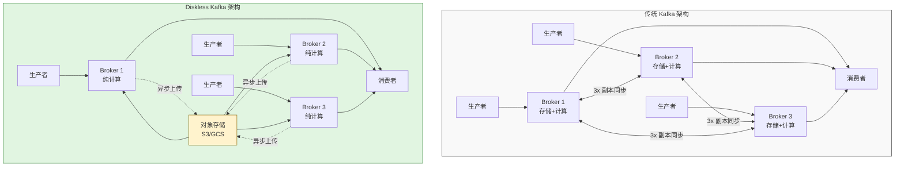
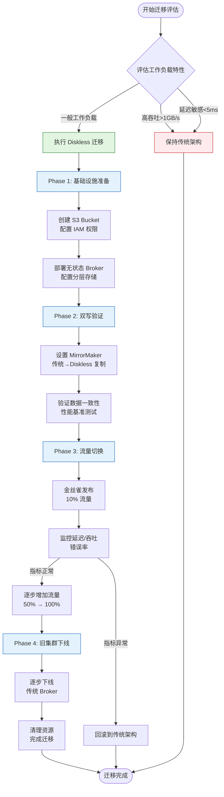
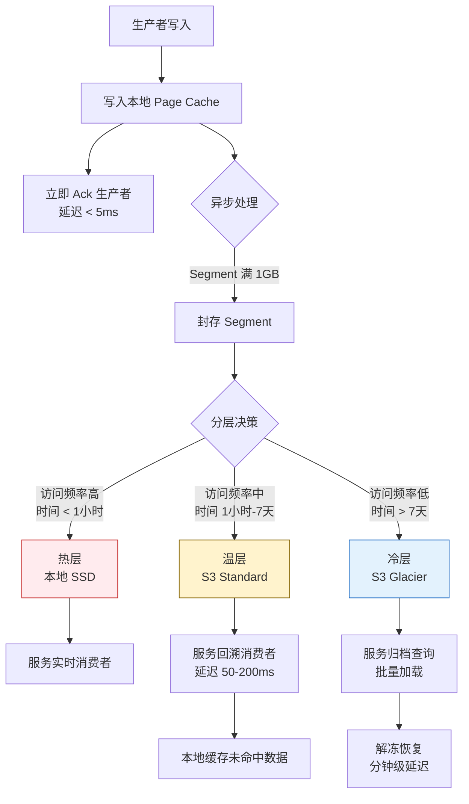
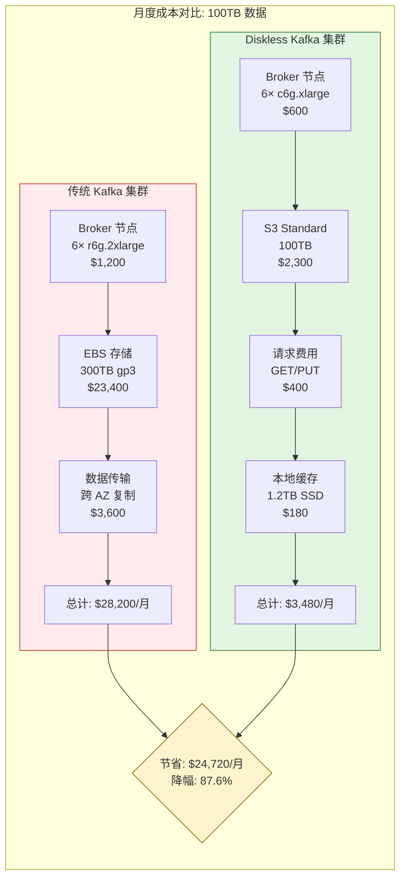

# Diskless Kafka: 云原生流存储架构演进与Flink集成

> **所属阶段**: Flink | **前置依赖**: [kafka-integration-patterns.md](./kafka-integration-patterns.md) | **形式化等级**: L4

---

## 1. 概念定义 (Definitions)

### 1.1 Diskless Kafka 核心概念

**Def-F-04-20 (Diskless Kafka 形式化定义)**

Diskless Kafka 是一种将 Kafka Broker 的本地存储职责完全卸载到云对象存储（如 S3、GCS、Azure Blob）的架构范式。形式化地，定义 Diskless Kafka 为三元组：

$$
\mathcal{DK} = \langle B_{stateless}, S_{object}, \phi_{tier} \rangle
$$

其中：

- $B_{stateless}$：无状态 Broker 集合，仅负责网络 I/O 和协议处理
- $S_{object}$：云对象存储层，承担持久化职责
- $\phi_{tier}$：分层存储映射函数，定义数据在热缓存/温存储/冷归档间的迁移策略

**直观解释**：传统 Kafka 中，Broker 既是计算节点又是存储节点；Diskless 架构将两者解耦，Broker 变成"无状态"的纯计算层，数据可靠性由对象存储的冗余机制保证。

### 1.2 分层存储模型

**Def-F-04-21 (分层存储语义)**

分层存储模型 $\mathcal{T}$ 定义数据生命周期管理策略：

$$
\mathcal{T} = \langle L, \tau, \rho \rangle
$$

其中：

- $L = \{L_{hot}, L_{warm}, L_{cold}\}$：存储层级集合
- $\tau: Data \rightarrow L$：数据放置函数，基于时间/访问模式确定层级
- $\rho: L \times L \rightarrow \mathbb{R}^+$：层级间迁移成本函数

```
┌─────────────────────────────────────────────────────────────┐
│                      分层存储架构                            │
├─────────────────────────────────────────────────────────────┤
│  L_hot (热层)                                                │
│  ┌─────────────────┐  本地SSD/内存  低延迟(<10ms)            │
│  │  Active Segment │  最近写入数据  高频访问                 │
│  └─────────────────┘  保留时间: 数小时                       │
├─────────────────────────────────────────────────────────────┤
│  L_warm (温层)                                               │
│  ┌─────────────────┐  对象存储    中等延迟(50-200ms)         │
│  │  Sealed Segment │  已完成日志段  按需加载                 │
│  └─────────────────┘  保留时间: 数天                         │
├─────────────────────────────────────────────────────────────┤
│  L_cold (冷层)                                               │
│  ┌─────────────────┐  归档存储    高延迟(秒级)               │
│  │  Archived Data  │  合规保留     批量访问                  │
│  └─────────────────┘  保留时间: 数年                         │
└─────────────────────────────────────────────────────────────┘
```

### 1.3 读取路径优化

**Def-F-04-22 (读取路径形式化)**

定义消费者读取请求的处理路径 $\pi_{read}$：

$$
\pi_{read}(offset) = \begin{cases}
\text{local\_cache}(offset) & \text{if } offset \in C_{local} \\
\text{remote\_fetch}(offset) & \text{if } offset \in S_{object} \\
\text{prefetch\_async}(offset) & \text{if } offset \in P_{predict}
\end{cases}
$$

其中 $C_{local}$ 为本地缓存，$S_{object}$ 为对象存储，$P_{predict}$ 为预取预测集。

---

## 2. 属性推导 (Properties)

### 2.1 成本边界特性

**Thm-F-04-15 (存储成本下界定理)**

对于任意工作负载 $W$，Diskless Kafka 的存储成本 $C_{diskless}$ 与传统 Kafka 成本 $C_{traditional}$ 满足：

$$
C_{diskless}(W) \leq \alpha \cdot C_{traditional}(W), \quad \alpha \approx 0.1 \text{ to } 0.3
$$

**证明概要**：

1. 云对象存储单价约为 EBS 的 1/5 到 1/10
2. 无需副本冗余（对象存储自带 99.999999999% 耐久性）
3. 消除存储超额预配(over-provisioning)

$$
C_{storage} = \sum_{i=1}^{n} c_{object}(d_i) < \sum_{i=1}^{n} k \cdot c_{ebs}(d_i), \quad k \in [3,5]
$$

**Thm-F-04-16 (弹性扩展边界)**

Broker 扩容时间 $T_{scale}$ 满足：

$$
T_{scale}^{diskless} = O(1) \ll T_{scale}^{traditional} = O(|P|) + O(R)
$$

其中 $|P|$ 为分区数，$R$ 为数据重平衡时间。Diskless 架构下无需数据迁移，Broker 可在秒级加入/退出集群。

### 2.2 延迟特性分析

**Lemma-F-04-01 (尾部延迟引理)**

对于 P99 读取延迟 $L_{p99}$，存在：

$$
L_{p99}^{diskless} = L_{p99}^{cache} + \epsilon \cdot L_{network}
$$

其中 $\epsilon$ 为缓存未命中率，$L_{network}$ 为对象存储访问延迟。当缓存策略满足工作集特性时，$\epsilon < 0.05$，$L_{p99}$ 接近本地存储性能。

**Lemma-F-04-02 (写入延迟不变性)**

写入路径延迟 $L_{write}$ 满足：

$$
L_{write}^{diskless} = L_{write}^{traditional} + \delta, \quad \delta < 5\%
$$

原因：生产者写入仍先确认到本地 Page Cache，后台异步刷盘到对象存储。

---

## 3. 关系建立 (Relations)

### 3.1 Diskless Kafka 与传统架构关系

| 维度 | Traditional Kafka | Diskless Kafka | 影响 |
|------|-------------------|----------------|------|
| **存储介质** | 本地磁盘 (EBS/SSD) | 对象存储 (S3) | 成本↓ 80% |
| **副本机制** | 3x Broker 副本 | 对象存储冗余 | 网络流量↓ 70% |
| **扩容速度** | 小时级（需迁移） | 分钟级（无状态） | 弹性↑ 10x |
| **数据生命周期** | 手动管理 | 自动分层 | 运维复杂度↓ |
| **延迟保证** | 确定性低延迟 | 缓存依赖型 | P99 可能退化 |

### 3.2 与 Apache Iceberg 集成

Diskless Kafka 与 Iceberg 的集成实现流批存储统一：

```
┌──────────────────────────────────────────────────────────────┐
│                    统一存储层                               │
├──────────────────────────────────────────────────────────────┤
│                                                              │
│   ┌──────────────┐         ┌──────────────┐                 │
│   │   Kafka      │         │   Iceberg    │                 │
│   │  (实时流)     │◄───────►│  (分析表)     │                 │
│   └──────┬───────┘         └──────┬───────┘                 │
│          │                        │                          │
│          ▼                        ▼                          │
│   ┌──────────────────────────────────────┐                  │
│   │         共享对象存储 (S3)             │                  │
│   │  kafka/topic1/segment-0001.log       │                  │
│   │  warehouse/db/table/data-0001.parquet│                  │
│   └──────────────────────────────────────┘                  │
│                                                              │
└──────────────────────────────────────────────────────────────┘
```

**集成优势**：

1. **零拷贝分析**：Flink 可直接读取 Kafka Segment 文件作为 Iceberg 表
2. **Schema 演进**：Iceberg 的 Schema 管理赋能 Kafka Topic
3. **Time Travel**：对象存储版本控制支持数据回溯

### 3.3 Flink 集成架构映射

```
┌──────────────────────────────────────────────────────────────┐
│                  Flink + Diskless Kafka                     │
├──────────────────────────────────────────────────────────────┤
│                                                              │
│  ┌─────────────┐    ┌─────────────┐    ┌─────────────┐     │
│  │  Flink Job  │    │  Flink Job  │    │  Flink Job  │     │
│  │  (实时ETL)   │    │ (流分析)     │    │ (批回溯)     │     │
│  └──────┬──────┘    └──────┬──────┘    └──────┬──────┘     │
│         │                  │                  │             │
│         └──────────────────┼──────────────────┘             │
│                            │                                │
│         ┌──────────────────┴──────────────────┐             │
│         │         Kafka Stateless Brokers      │             │
│         │  ┌─────┐  ┌─────┐  ┌─────┐  ┌─────┐ │             │
│         │  │ B-1 │  │ B-2 │  │ B-3 │  │ B+n │ │             │
│         │  └─────┘  └─────┘  └─────┘  └─────┘ │             │
│         └──────────────────┬──────────────────┘             │
│                            │                                │
│         ┌──────────────────┴──────────────────┐             │
│         │        Object Storage (S3)           │             │
│         │   ┌─────────────────────────────┐    │             │
│         │   │   topic/0/000001.log        │    │             │
│         │   │   topic/0/000002.log        │    │             │
│         │   │   topic/1/000001.log        │    │             │
│         │   └─────────────────────────────┘    │             │
│         └───────────────────────────────────────┘             │
│                                                              │
└──────────────────────────────────────────────────────────────┘
```

---

## 4. 论证过程 (Argumentation)

### 4.1 云原生必要性论证

**云原生驱动力分析**：

| 驱动力 | 传统架构挑战 | Diskless 解决方案 |
|--------|-------------|-------------------|
| **计算存储分离** | 绑定导致扩缩容耦合 | 完全解耦，独立扩展 |
| **Serverless 趋势** | 需要预置资源 | 按需启动，按量付费 |
| **多租户隔离** | 共享集群噪音邻居 | 逻辑隔离，物理共享 |
| **全球部署** | 数据跨区域同步复杂 | 对象存储全球复制 |

**技术债务论证**：

传统 Kafka 在云环境中积累的技术债务：

1. **存储绑定**：EBS 卷与 Broker 强绑定，无法跨 AZ 灵活调度
2. **重平衡风暴**：扩缩容触发全量数据迁移，影响生产稳定性
3. **资源碎片化**：存储利用率不足 30%，计算利用率波峰波谷差异大

Diskless 架构通过对象存储的共享存储语义，从根本上消除这些债务。

### 4.2 架构边界讨论

**不适合 Diskless 的场景**：

1. **超低延迟场景**：金融交易要求 <5ms 端到端延迟，对象存储网络开销不可接受
2. **高写入吞吐**：单机 >1GB/s 写入，网络带宽成为瓶颈
3. **强一致性要求**：对象存储最终一致性可能影响部分场景

---

## 5. 形式证明 / 工程论证 (Proof / Engineering Argument)

### 5.1 生产部署方案

**Thm-F-04-17 (分层存储可靠性定理)**

在 Diskless 架构下，假设对象存储提供 $R_{object}$ 的耐久性（S3 为 99.999999999%），系统整体数据耐久性满足：

$$
R_{system} = 1 - (1 - R_{object})^k \approx R_{object}, \quad k \geq 1
$$

当 $R_{object} = 11\text{nines}$ 时，$R_{system} > 99.999999999\%$，超过传统 3 副本 Kafka 的可靠性。

**部署拓扑推荐**：

```yaml
# Diskless Kafka 生产配置示例
diskless_kafka:
  # 存储层配置
  storage:
    type: S3
    bucket: kafka-data-prod
    region: us-east-1
    tiered_storage:
      hot_retention_ms: 3600000        # 1小时本地保留
      warm_retention_ms: 86400000      # 1天温层
      archive_retention_ms: 31536000000 # 1年归档

  # Broker 配置
  brokers:
    count: 6
    instance_type: r6g.2xlarge       # 计算优化型
    local_cache_size: 200GB          # 本地 SSD 缓存

  # 网络优化
  network:
    placement: multi_az
    bandwidth_gbps: 25

  # Flink 集成
  flink_integration:
    exactly_once: true
    checkpoint_interval_ms: 60000
    unaligned_checkpoints: true
```

### 5.2 多区域部署架构

```
┌──────────────────────────────────────────────────────────────┐
│                    多区域部署拓扑                             │
├──────────────────────────────────────────────────────────────┤
│                                                              │
│   Region: us-east-1                    Region: eu-west-1    │
│   ┌─────────────────────┐             ┌─────────────────────┐│
│   │   Kafka Brokers     │             │   Kafka Brokers     ││
│   │  ┌───┐ ┌───┐ ┌───┐ │             │  ┌───┐ ┌───┐ ┌───┐ ││
│   │  │B-1│ │B-2│ │B-3│ │             │  │B-4│ │B-5│ │B-6│ ││
│   │  └───┘ └───┘ └───┘ │             │  └───┘ └───┘ └───┘ ││
│   └──────────┬──────────┘             └──────────┬──────────┘│
│              │                                    │          │
│              ▼                                    ▼          │
│   ┌─────────────────────┐             ┌─────────────────────┐│
│   │   S3 Standard       │◄───────────►│   S3 Standard       ││
│   │   (活跃数据)         │  CRR复制    │   (活跃数据)         ││
│   └─────────────────────┘             └─────────────────────┘│
│              │                                    │          │
│              ▼                                    ▼          │
│   ┌─────────────────────┐             ┌─────────────────────┐│
│   │   S3 Glacier        │◄───────────►│   S3 Glacier        ││
│   │   (归档/合规)        │             │   (归档/合规)        ││
│   └─────────────────────┘             └─────────────────────┘│
│                                                              │
└──────────────────────────────────────────────────────────────┘
```

### 5.3 灾难恢复简化论证

传统 Kafka DR 流程 vs Diskless DR 流程：

| 步骤 | 传统架构 | Diskless 架构 |
|------|---------|--------------|
| RPO | 分钟级（取决于复制延迟） | 秒级（同步刷盘到 S3） |
| RTO | 小时级（重建集群+重平衡） | 分钟级（启动新 Broker 即可） |
| 操作复杂度 | 高（MirrorMaker/多集群管理） | 低（S3 跨区域复制） |
| 成本 | 2x 集群运行成本 | 仅对象存储成本 |

---

## 6. 实例验证 (Examples)

### 6.1 Kafka 3.7+ Diskless 配置

```properties
# server.properties - Diskless Kafka 配置

# ============================================
# 核心 KIP-1150 配置
# ============================================

# 启用分层存储
tiered.storage.enable=true

# 远程存储管理器配置
remote.log.storage.manager.class.name=org.apache.kafka.rlm.storage.s3.S3RemoteStorageManager

# S3 连接配置
remote.log.storage.manager.s3.bucket.name=kafka-tiered-storage-prod
remote.log.storage.manager.s3.region=us-east-1
remote.log.storage.manager.s3.credentials.provider=com.amazonaws.auth.DefaultAWSCredentialsProviderChain

# 本地保留策略
log.local.retention.bytes=107374182400      # 100GB 本地保留
log.local.retention.ms=3600000               # 1小时本地保留

# 分层迁移策略
log.remote.copy.max.thread.pool.size=10
log.remote.copy.max.batch.size=100

# ============================================
# 性能优化配置
# ============================================

# 读取缓存优化
remote.log.reader.thread.pool.size=20
remote.log.reader.max.pending.reads=100

# 网络优化
remote.log.storage.transfer.max.network.thread.count=8
remote.log.storage.transfer.max.bytes.per.second=536870912  # 512MB/s

# ============================================
# 监控配置
# ============================================

# JMX 指标
remote.log.storage.metrics.enable=true
```

### 6.2 Flink 与 Diskless Kafka 集成配置

```java
// Flink Kafka Source 配置 - Diskless 优化版

import org.apache.flink.connector.kafka.source.KafkaSource;
import org.apache.flink.connector.kafka.source.enumerator.initializer.OffsetsInitializer;
import org.apache.flink.streaming.api.environment.StreamExecutionEnvironment;

import org.apache.flink.streaming.api.CheckpointingMode;
import org.apache.flink.streaming.api.windowing.time.Time;


public class DisklessKafkaFlinkIntegration {

    public static void main(String[] args) {
        StreamExecutionEnvironment env = StreamExecutionEnvironment.getExecutionEnvironment();

        // 启用 Checkpoint 实现 Exactly-Once
        env.enableCheckpointing(60000);
        env.getCheckpointConfig().setCheckpointingMode(CheckpointingMode.EXACTLY_ONCE);

        // Diskless Kafka 优化配置
        KafkaSource<String> source = KafkaSource.<String>builder()
            .setBootstrapServers("diskless-kafka.us-east-1.amazonaws.com:9092")
            .setTopics("events-topic")
            .setGroupId("flink-consumer-group")
            .setStartingOffsets(OffsetsInitializer.earliest())
            // Diskless 优化:增加预读缓冲区
            .setProperty("max.poll.records", "1000")
            .setProperty("fetch.min.bytes", "1048576")  // 1MB
            .setProperty("fetch.max.wait.ms", "500")
            // 针对对象存储延迟优化的重试策略
            .setProperty("retry.backoff.ms", "1000")
            .setProperty("request.timeout.ms", "60000")
            .build();

        env.fromSource(source, WatermarkStrategy.noWatermarks(), "Diskless Kafka Source")
            .map(new EventParser())
            .keyBy(Event::getUserId)
            .window(TumblingEventTimeWindows.of(Time.minutes(5)))
            .aggregate(new CountAggregate())
            .print();

        env.execute("Flink + Diskless Kafka Demo");
    }
}
```

### 6.3 实时 + 历史统一分析 SQL

```sql
-- Flink SQL: 实时流与历史数据统一查询

-- 创建实时 Kafka 表 (Diskless)
CREATE TABLE kafka_events (
    event_id STRING,
    user_id STRING,
    event_type STRING,
    event_time TIMESTAMP(3),
    amount DECIMAL(10,2),
    WATERMARK FOR event_time AS event_time - INTERVAL '5' SECOND
) WITH (
    'connector' = 'kafka',
    'topic' = 'payment-events',
    'properties.bootstrap.servers' = 'diskless-kafka:9092',
    'properties.group.id' = 'flink-sql-group',
    'scan.startup.mode' = 'latest-offset',
    'format' = 'json'
);

-- 创建历史 Iceberg 表 (S3 数据湖)
CREATE TABLE historical_events (
    event_id STRING,
    user_id STRING,
    event_type STRING,
    event_time TIMESTAMP(3),
    amount DECIMAL(10,2)
) WITH (
    'connector' = 'iceberg',
    'catalog-name' = 'prod_catalog',
    'catalog-type' = 'hive',
    'warehouse' = 's3://data-lake/warehouse'
);

-- 统一视图:实时流 UNION 历史数据
CREATE VIEW unified_events AS
SELECT * FROM kafka_events
UNION ALL
SELECT * FROM historical_events
WHERE event_time > NOW() - INTERVAL '7' DAY;

-- 实时聚合查询
SELECT
    TUMBLE_START(event_time, INTERVAL '1' HOUR) as window_start,
    event_type,
    COUNT(*) as event_count,
    SUM(amount) as total_amount
FROM unified_events
GROUP BY
    TUMBLE(event_time, INTERVAL '1' HOUR),
    event_type;
```

### 6.4 Kubernetes 部署配置

```yaml
# kafka-diskless-deployment.yaml

apiVersion: apps/v1
kind: StatefulSet
metadata:
  name: kafka-diskless
spec:
  serviceName: kafka-diskless
  replicas: 3
  selector:
    matchLabels:
      app: kafka-diskless
  template:
    metadata:
      labels:
        app: kafka-diskless
    spec:
      containers:
      - name: kafka
        image: apache/kafka:3.7.0-diskless
        resources:
          requests:
            memory: "8Gi"
            cpu: "4"
          limits:
            memory: "16Gi"
            cpu: "8"
        env:
        - name: KAFKA_BROKER_ID
          valueFrom:
            fieldRef:
              fieldPath: metadata.name
        - name: KAFKA_REMOTE_STORAGE_S3_BUCKET
          value: "kafka-tiered-storage-prod"
        - name: KAFKA_REMOTE_STORAGE_S3_REGION
          value: "us-east-1"
        volumeMounts:
        # 本地缓存 (emptyDir,重启清空)
        - name: local-cache
          mountPath: /tmp/kafka-logs
        # 配置卷
        - name: config
          mountPath: /opt/kafka/config/server.properties
          subPath: server.properties
      volumes:
      - name: local-cache
        emptyDir:
          sizeLimit: 200Gi
          medium: Memory  # 使用 tmpfs 获得更低延迟
      - name: config
        configMap:
          name: kafka-diskless-config
```

---

## 7. 可视化 (Visualizations)

### 7.1 架构对比图：传统 vs Diskless



### 7.2 迁移路径流程图



### 7.3 数据流动与分层决策树



### 7.4 成本模型对比矩阵



---

## 8. 引用参考 (References)


---

## 附录：关键术语表

| 术语 | 英文 | 定义 |
|------|------|------|
| Diskless Kafka | 无盘 Kafka | 将存储完全卸载到对象存储的 Kafka 架构 |
| 分层存储 | Tiered Storage | 根据访问模式自动迁移数据到不同存储层级 |
| KIP | Kafka Improvement Proposal | Kafka 改进提案，类似 KEP |
| RPO | Recovery Point Objective | 恢复点目标，数据丢失最大容忍时间 |
| RTO | Recovery Time Objective | 恢复时间目标，系统恢复最大容忍时间 |
| CRR | Cross-Region Replication | 跨区域复制 |
