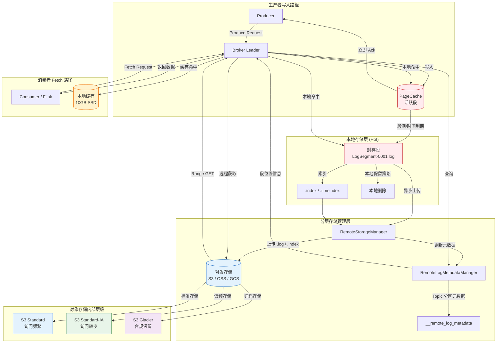
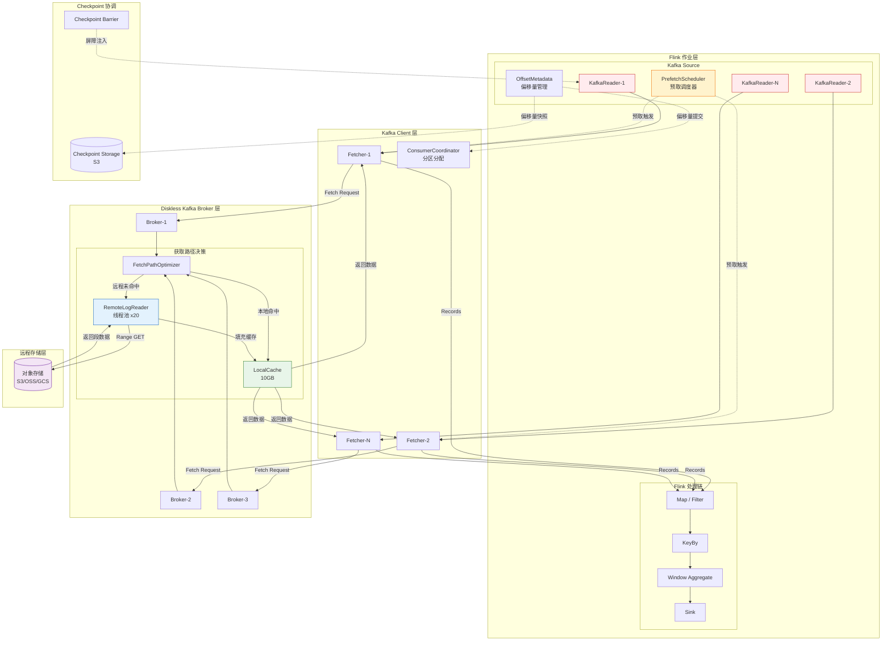
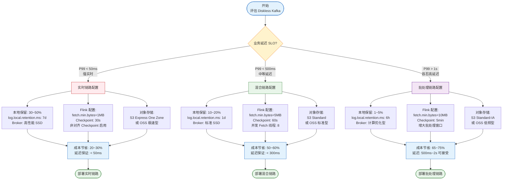

# Flink Diskless Kafka 连接器深度解析

> **所属阶段**: Flink/05-ecosystem | **前置依赖**: [diskless-kafka-cloud-native.md](./diskless-kafka-cloud-native.md) | **形式化等级**: L5

---

## 1. 概念定义 (Definitions)

### Def-F-05-60: Diskless Kafka

**定义**: Diskless Kafka 是一种将 Kafka Broker 的持久化存储职责完全或大部分卸载到远程分层存储（Tiered Storage / Object Storage）的架构范式，Broker 仅保留计算、网络 I/O 与元数据管理职能。

$$
\mathcal{DK} = \langle B_{\text{stateless}}, S_{\text{remote}}, C_{\text{local}}, \phi_{\text{tier}}, \mathcal{M}_{\text{meta}} \rangle
$$

其中：

- $B_{\text{stateless}}$: 无状态 Broker 集合，负责协议处理、副本协调与消费者请求调度
- $S_{\text{remote}}$: 远程分层存储层（S3、OSS、GCS、Azure Blob），承担主要持久化职责
- $C_{\text{local}}$: 本地缓存层（内存 PageCache / 临时 SSD），热数据加速与近期段保留
- $\phi_{\text{tier}}: \mathcal{D} \times \mathcal{T} \rightarrow \{L_{\text{hot}}, L_{\text{warm}}, L_{\text{cold}}\}$: 分层存储映射函数，定义数据在时间维度与访问模式维度上的迁移策略
- $\mathcal{M}_{\text{meta}}$: 本地元数据管理子系统（RemoteLogMetadataManager），维护远程段的索引、偏移量映射与生命周期状态

**主要实现形态**：

- **Apache Kafka 3.0+ KIP-405**: 原生分层存储，通过 `RemoteStorageManager` 接口将旧 LogSegment 卸载到对象存储
- **Apache Kafka 3.7+**: 增强型 Tiered Storage，支持更细粒度的段管理与获取路径优化
- **AutoMQ**: 开源 Diskless Kafka 实现，基于 KIP-1150 构建，主打云原生无状态架构
- **WarpStream**: 商业 Diskless Kafka 服务，完全兼容 Kafka 协议，Broker 无本地磁盘

---

### Def-F-05-61: Kafka Tiered Storage

**定义**: Kafka 分层存储模型定义了数据在本地性能层与远程成本层之间的生命周期管理策略，通过自动迁移机制实现存储成本与访问性能的平衡。

$$
\mathcal{T} = \langle L_{\text{hot}}, L_{\text{warm}}, L_{\text{cold}}, \tau_{\text{migration}}, \rho_{\text{cost}}, \theta_{\text{retention}} \rangle
$$

其中：

- $L_{\text{hot}}$: 热层（本地 SSD / 内存 PageCache），保留活跃写入段与近期历史段，延迟 $< 5\text{ms}$
- $L_{\text{warm}}$: 温层（对象存储标准存储类，如 S3 Standard / OSS 标准），保留中期历史数据，延迟 $50\text{ms} \sim 200\text{ms}$
- $L_{\text{cold}}$: 冷层（对象存储归档存储类，如 S3 Glacier / OSS 归档），长期合规保留数据，延迟 $> 1\text{s}$
- $\tau_{\text{migration}}: (t_{\text{age}}, f_{\text{access}}) \rightarrow \{0, 1\}$: 数据迁移触发谓词，基于段年龄 $t_{\text{age}}$ 与访问频率 $f_{\text{access}}$ 决定是否迁移
- $\rho_{\text{cost}}: L \rightarrow \mathbb{R}^+$: 跨层单位存储成本函数
- $\theta_{\text{retention}}: \mathbb{R}^+ \rightarrow \mathbb{R}^+$: 保留期策略函数，定义各层数据保留时长

**关键参数**（Kafka 服务端配置）：

| 参数 | 说明 | 默认值 |
|------|------|--------|
| `remote.log.storage.system.enable` | 启用分层存储 | `false` |
| `rlmm.config.remote.log.metadata.manager.listener.name` | 元数据管理器监听名 | — |
| `rsm.config.remote.log.storage.manager.class.name` | RSM 实现类 | — |
| `log.local.retention.bytes` | 本地保留字节数 | `-1`（禁用） |
| `log.local.retention.ms` | 本地保留时间 | `-1`（禁用） |
| `log.segment.bytes` | 单个日志段大小 | `1GB` |

---

### Def-F-05-62: LogSegment 本地/远程状态

**定义**: 在分层存储架构下，Kafka Topic Partition 的日志由一系列 LogSegment 组成，每个段处于三种状态之一：活跃本地段、封存本地段、远程段。

$$
\mathcal{LS} = \langle \text{seg}_i, s_i, O_{\text{start}}, O_{\text{end}}, F_{\text{log}}, F_{\text{idx}}, F_{\text{timeidx}} \rangle
$$

其中：

- $\text{seg}_i$: 第 $i$ 个日志段标识符
- $s_i \in \{\text{ACTIVE}, \text{SEALED}, \text{REMOTE}\}$: 段状态
- $O_{\text{start}}, O_{\text{end}}$: 段起始与结束偏移量
- $F_{\text{log}}$: 段数据文件（`.log`），包含实际消息记录
- $F_{\text{idx}}$: 偏移量索引文件（`.index`），加速按偏移量定位
- $F_{\text{timeidx}}$: 时间戳索引文件（`.timeindex`），加速按时间定位

**状态转移规则**：

$$
\text{ACTIVE} \xrightarrow{\text{segment满/滚动}} \text{SEALED} \xrightarrow{\tau_{\text{migration}}=1} \text{REMOTE}
$$

当段进入 `REMOTE` 状态时，$F_{\text{log}}$、$F_{\text{idx}}$、$F_{\text{timeidx}}$ 被上传至远程存储，本地仅保留元数据条目于 `RemoteLogMetadataManager` 中。消费者在请求该段范围数据时，Broker 触发远程获取（Remote Fetch）。

---

### Def-F-05-63: 获取路径优化 (Fetch Path Optimization)

**定义**: 获取路径优化是 Kafka Broker 处理消费者 Fetch 请求时的分层路由机制，根据请求偏移量范围与段分布状态选择最优数据获取路径。

$$
\mathcal{FP}(O_{\text{fetch}}, S_{\text{partition}}) = \arg\min_{p \in \mathcal{P}} \{ \lambda(p) \mid \text{Data}(O_{\text{fetch}}) \subseteq \text{Range}(p) \}
$$

其中：

- $O_{\text{fetch}}$: 消费者请求的起始偏移量
- $S_{\text{partition}}$: 分区段状态集合
- $\mathcal{P} = \{p_{\text{local}}, p_{\text{remote}}, p_{\text{cache}}\}$: 可选获取路径集合
- $\lambda(p)$: 路径延迟成本函数
- $\text{Data}(O_{\text{fetch}})$: 请求偏移量对应的数据集
- $\text{Range}(p)$: 路径 $p$ 可提供的偏移量范围

**路径优先级**（从高到低）：

1. **本地活跃段路径** $p_{\text{local-active}}$: 直接读取本地活跃日志段，延迟最低（$< 5\text{ms}$）
2. **本地封存段路径** $p_{\text{local-sealed}}$: 读取本地尚未迁移的封存段，延迟较低（$< 10\text{ms}$）
3. **本地缓存路径** $p_{\text{cache}}$: 命中本地 SSD / 内存缓存的远程段数据，延迟中等（$10\text{ms} \sim 50\text{ms}$）
4. **远程存储路径** $p_{\text{remote}}$: 从对象存储下载段数据，延迟最高（$50\text{ms} \sim 500\text{ms}$）

---

### Def-F-05-64: 成本-性能权衡函数

**定义**: Diskless Kafka 部署的成本-性能权衡函数量化了存储成本节省与读取性能退化之间的定量关系，为 Flink 作业的资源规划提供决策依据。

$$
\mathcal{C}(\vec{x}) = \alpha \cdot C_{\text{storage}}(\vec{x}) + \beta \cdot C_{\text{compute}}(\vec{x}) + \gamma \cdot L_{\text{read}}(\vec{x})
$$

其中：

- $\vec{x} = (r_{\text{local}}, r_{\text{remote}}, B_{\text{bandwidth}}, P_{\text{flink}})$: 决策变量向量
- $r_{\text{local}}$: 本地保留数据比例
- $r_{\text{remote}}$: 远程存储数据比例（$r_{\text{local}} + r_{\text{remote}} = 1$）
- $B_{\text{bandwidth}}$: 对象存储出口带宽配置
- $P_{\text{flink}}$: Flink 消费者并行度
- $C_{\text{storage}}(\vec{x})$: 总存储成本函数
- $C_{\text{compute}}(\vec{x})$: 计算资源成本函数（含 Broker 与 Flink TaskManager）
- $L_{\text{read}}(\vec{x})$: 平均读取延迟函数
- $\alpha, \beta, \gamma$: 权重系数，反映业务对成本与延迟的敏感度

**帕累托最优条件**：

$$
\nabla C_{\text{storage}} \cdot \nabla L_{\text{read}} \leq 0 \quad \text{（成本降低时延迟不降低）}
$$

---

### Def-F-05-65: 远程段并发控制策略

**定义**: 远程段并发控制策略是 Broker 与 Flink 消费者协调远程数据获取的流控机制，防止对象存储的高延迟读取拖垮消费者线程与 Broker 资源。

$$
\mathcal{CC} = \langle N_{\text{max-concurrent}}, T_{\text{timeout}}, B_{\text{prefetch}}, R_{\text{retry}} \rangle
$$

其中：

- $N_{\text{max-concurrent}}$: 单 Broker 最大并发远程获取请求数
- $T_{\text{timeout}}$: 远程获取超时阈值
- $B_{\text{prefetch}}$: 预取缓冲区大小，用于隐藏远程读取延迟
- $R_{\text{retry}}$: 远程获取重试策略（指数退避 / 固定间隔）

**Broker 侧约束**：

$$
\sum_{p \in \mathcal{P}_{\text{active}}} \mathbb{1}_{[\text{remote}(p)]} \leq N_{\text{max-concurrent}}
$$

其中 $\mathcal{P}_{\text{active}}$ 为当前活跃消费者分区分配集合，$\mathbb{1}_{[\text{remote}(p)]}$ 为分区 $p$ 是否触发远程读取的指示函数。

---

### Def-F-05-66: Flink Kafka Source 预取策略

**定义**: Flink Kafka Source 预取策略是 Flink 消费者在感知底层 Tiered Storage 时的前瞻性数据获取机制，通过预测消费者偏移量进展提前触发远程段加载，摊薄高延迟开销。

$$
\mathcal{PF} = \langle \Delta_{\text{lookahead}}, W_{\text{prefetch}}, S_{\text{trigger}}, \eta_{\text{hit}} \rangle
$$

其中：

- $\Delta_{\text{lookahead}}$: 前瞻偏移量窗口，决定提前多少个段发起预取
- $W_{\text{prefetch}}$: 预取工作线程数，控制并发预取任务
- $S_{\text{trigger}} \in \{\text{SEQUENTIAL}, \text{ADAPTIVE}, \text{HINTED}\}$: 触发模式
  - `SEQUENTIAL`: 顺序消费时固定间隔触发
  - `ADAPTIVE`: 基于历史消费速率自适应调整
  - `HINTED`: 基于 Kafka 元数据提示（段状态变化事件）触发
- $\eta_{\text{hit}}$: 预取命中率目标阈值

---

## 2. 属性推导 (Properties)

### Lemma-F-05-60: 本地段读取延迟上界

**引理**: 在 Diskless Kafka 架构下，若消费者请求的数据完全落在本地活跃段或封存段范围内，则端到端读取延迟存在确定上界。

**形式化表述**：

设 $D_{\text{local}}$ 为本地磁盘读取延迟随机变量，$D_{\text{network}}$ 为网络传输延迟随机变量，则总延迟 $L_{\text{local}}$ 满足：

$$
L_{\text{local}} = D_{\text{local}} + D_{\text{network}} \leq L_{\max}^{\text{local}} = \frac{S_{\text{fetch}}}{B_{\text{disk}}} + \frac{S_{\text{fetch}}}{B_{\text{network}}} + \delta_{\text{jitter}}
$$

其中：

- $S_{\text{fetch}}$: Fetch 请求数据量（受 `fetch.max.bytes` 限制，默认 50MB）
- $B_{\text{disk}}$: 本地磁盘顺序读取带宽
- $B_{\text{network}}$: 消费者到 Broker 网络带宽
- $\delta_{\text{jitter}}$: 系统抖动上界（调度、GC 等）

**证明概要**：

1. 本地活跃段常驻内存 PageCache，$D_{\text{local}} \approx 0$（缓存命中时）或 $\leq S_{\text{fetch}} / B_{\text{disk}}$（缓存未命中时）
2. 本地封存段位于 SSD/HDD，$D_{\text{local}} \leq S_{\text{fetch}} / B_{\text{disk}}$
3. 网络传输受 TCP 拥塞控制约束，$D_{\text{network}} \leq S_{\text{fetch}} / B_{\text{network}}$
4. 由加法不等式，$L_{\text{local}} \leq L_{\max}^{\text{local}}$

**工程意义**: 实时 Flink 作业消费活跃 Topic 时，只要消费者延迟（Consumer Lag）保持在本地保留窗口内，即可享受与传统 Kafka 等效的低延迟保证。

---

### Prop-F-05-60: 成本-性能权衡的帕累托前沿

**命题**: 在 Diskless Kafka 的存储成本与读取延迟双目标优化问题中，不存在同时严格降低存储成本与读取延迟的全局最优解，决策空间形成帕累托前沿。

**形式化表述**：

设目标函数为 $(C_{\text{storage}}(\vec{x}), L_{\text{read}}(\vec{x}))$，可行域为 $\mathcal{X}$。则帕累托前沿 $\mathcal{P}^*$ 定义为：

$$
\mathcal{P}^* = \{ \vec{x}^* \in \mathcal{X} \mid \nexists \vec{x} \in \mathcal{X}: C_{\text{storage}}(\vec{x}) \leq C_{\text{storage}}(\vec{x}^*) \land L_{\text{read}}(\vec{x}) \leq L_{\text{read}}(\vec{x}^*) \land (C_{\text{storage}}(\vec{x}) < C_{\text{storage}}(\vec{x}^*) \lor L_{\text{read}}(\vec{x}) < L_{\text{read}}(\vec{x}^*)) \}
$$

**证明概要**：

1. **单调性**: 减少本地保留比例 $r_{\text{local}}$ 会降低 $C_{\text{storage}}$（对象存储单位成本低于本地 SSD），但会增加 $L_{\text{read}}$（更多请求命中远程路径）
2. **不可改进性**: 对于前沿上的任意点 $\vec{x}^*$，任一目标的改进必然导致另一目标的退化
3. **凸性**: 在对象存储延迟服从线性带宽约束、本地存储成本服从线性容量约束的假设下，可行域为凸集，帕累托前沿为连续曲线

**推论**: Flink 作业在 Diskless Kafka 上的最优部署策略取决于业务对延迟的容忍度 $\gamma$：

- 高敏感度（$\gamma \gg \alpha$）：提高 $r_{\text{local}}$，接受更高存储成本
- 低敏感度（$\gamma \ll \alpha$）：降低 $r_{\text{local}}$，最大化成本节省
- 均衡策略（$\gamma \approx \alpha$）：选择帕累托前沿拐点，实现成本与延迟的均衡

---

### Lemma-F-05-61: 远程段并发读取的吞吐量下界

**引理**: 当 Flink 消费者触发远程段读取时，在并发控制策略约束下，单分区消费吞吐量存在理论下界。

**形式化表述**：

设 $N_{\text{concurrent}}$ 为实际并发远程请求数（$N_{\text{concurrent}} \leq N_{\text{max-concurrent}}$），$L_{\text{remote}}$ 为单次远程获取延迟，$S_{\text{segment}}$ 为段大小，则单分区远程读取吞吐量 $T_{\text{remote}}$ 满足：

$$
T_{\text{remote}} \geq \frac{N_{\text{concurrent}} \cdot S_{\text{segment}}}{L_{\text{remote}} + \frac{S_{\text{segment}}}{B_{\text{egress}}}}
$$

其中 $B_{\text{egress}}$ 为对象存储出口带宽。

**证明概要**：

1. 单次远程读取总时间 = 对象存储首字节延迟 $L_{\text{remote}}$ + 数据传输时间 $S_{\text{segment}} / B_{\text{egress}}$
2. 在 $N_{\text{concurrent}}$ 并发下，流水线化隐藏部分延迟，单位时间内完成的读取次数 $\geq N_{\text{concurrent}} / (L_{\text{remote}} + S_{\text{segment}} / B_{\text{egress}})$
3. 乘以单次读取数据量 $S_{\text{segment}}$，得下界

**工程意义**: 通过提高 $N_{\text{concurrent}}$（Broker 侧 `remote.log.reader.threads` 配置）和 $S_{\text{segment}}$（增大 `log.segment.bytes`），可以显著提升历史回溯场景下的消费吞吐量。

---

## 3. 关系建立 (Relations)

### 3.1 Diskless Kafka 与传统 Kafka 的架构映射

Diskless Kafka 并非完全摒弃 Kafka 的核心设计，而是在保留 Kafka 协议语义与复制模型的基础上，将持久化层从本地磁盘替换为远程对象存储。二者的架构映射关系如下：

| 组件 | 传统 Kafka | Diskless Kafka / Tiered Storage | 语义等价性 |
|------|-----------|--------------------------------|-----------|
| **持久化层** | 本地磁盘（3x 副本） | 对象存储（跨区域冗余） | 强等价：均保证 Durability |
| **复制协议** | ISR + Leader/Follower | ISR + Leader/Follower（活跃段） | 强等价：活跃段复制不变 |
| **消费者 Fetch** | 本地磁盘读取 | 分层路由（本地/远程） | 弱等价：延迟特性不同 |
| **偏移量管理** | `__consumer_offsets` | `__consumer_offsets`（本地） | 强等价：元数据不迁移 |
| **事务日志** | `__transaction_state` | `__transaction_state`（本地） | 强等价：事务状态本地保留 |
| **日志压缩** | 本地后台线程 | 远程触发 + 本地协调 | 弱等价：压缩延迟增加 |

**关键差异点**：

1. **复制带宽**: 传统 Kafka 的 Follower 复制通过本地网络进行；Diskless Kafka 的活跃段复制仍走本地网络，但远程段不再需要 ISR 同步（依赖对象存储的多可用区冗余）
2. **故障恢复**: 传统 Kafka 依赖本地日志进行 Leader 切换；Diskless Kafka 的 Leader 切换需要重新构建本地缓存或直接从远程读取
3. **追赶读取 (Catch-up Read)**: 慢消费者在传统 Kafka 中始终读取本地磁盘；在 Diskless Kafka 中，若滞后超过本地保留窗口，则触发远程读取

### 3.2 Flink Kafka Source 与 Tiered Storage 的集成关系

Flink Kafka Source 连接器通过 Kafka Consumer API 与 Diskless Kafka 交互，其集成关系可形式化为三层抽象：

$$
\text{Flink Kafka Source} \xrightarrow{\text{Consumer API}} \text{Kafka Client} \xrightarrow{\text{Fetch Protocol}} \text{Broker} \xrightarrow{\text{RSM}} \text{Remote Storage}
$$

**集成关键点**：

1. **透明性**: Flink Kafka Source 本身不感知数据是否来自远程存储，这一决策由 Broker 侧的获取路径优化（Def-F-05-63）完成
2. **可观测性缺口**: 标准 Kafka Consumer Metrics 不区分本地读取与远程读取，需要 Broker 侧暴露 `remote-fetch-rate`、`remote-fetch-latency-avg` 等指标
3. **配置传导**: Flink 通过 `setProperty()` 将消费者配置传导至 Kafka Client，进而影响 Broker 的 Fetch 行为（如 `fetch.min.bytes`、`max.poll.records`）
4. **Checkpoint 耦合**: Flink Checkpoint 触发时，Kafka Source 提交消费偏移量。若 Checkpoint 间隔内发生大量远程读取，延迟波动可能影响 Checkpoint 对齐时间

### 3.3 与对象存储选型的关联矩阵

Diskless Kafka 的远程存储层可对接多种对象存储服务，不同选型对 Flink 消费性能有显著影响：

| 对象存储 | 首字节延迟 (P99) | 吞吐量上限 | 与 Flink 同区域部署 | 推荐场景 |
|----------|-----------------|-----------|-------------------|---------|
| **AWS S3 Standard** | $50\text{ms} \sim 100\text{ms}$ | $100\text{Gbps}+$ | 支持 | 通用生产环境 |
| **AWS S3 Express One Zone** | $10\text{ms} \sim 20\text{ms}$ | $\text{单桶 } 200\text{Gbps}$ | 单可用区 | 低延迟回溯 |
| **阿里云 OSS 标准** | $50\text{ms} \sim 150\text{ms}$ | $\text{单流 } 10\text{Gbps}$ | 支持 | 国内部署 |
| **阿里云 OSS 极速型** | $\sim 10\text{ms}$ | $\text{单流 } 20\text{Gbps}$ | 支持 | 高频回溯 |
| **GCS Standard** | $50\text{ms} \sim 100\text{ms}$ | $\text{单项目 } 200\text{Gbps}$ | 支持 | GCP 生态 |
| **MinIO (自建)** | $5\text{ms} \sim 20\text{ms}$ | 依赖硬件 | 强约束 | 私有云/边缘 |

**选型原则**：

- 与 Flink 集群部署于同一区域（Region），避免跨区域流量费用与延迟
- 优先选择支持强一致性读的对象存储（S3 强一致性自 2020-12 起默认提供；OSS 默认最终一致，需确认版本）
- 评估出口带宽（Egress Bandwidth）限制，确保满足 Flink 消费者峰值吞吐量

---

## 4. 论证过程 (Argumentation)

### 4.1 本地优先读取策略的边界讨论

Kafka Broker 的获取路径优化（Def-F-05-63）理论上优先服务本地数据，但在以下边界条件下可能出现非最优行为：

**边界条件一：本地保留窗口过窄**

当 `log.local.retention.bytes` 或 `log.local.retention.ms` 设置过小，导致活跃消费者（Lag 较小）的消费范围恰好跨越本地/远程边界时，消费者会交替命中本地与远程路径，产生延迟抖动（Jitter）。

$$
\text{Jitter} = |L_{\text{local}} - L_{\text{remote}}| \approx 50\text{ms} \sim 500\text{ms}
$$

**缓解策略**：确保本地保留窗口至少是 Flink 作业 Checkpoint 间隔内消费数据量的 2 倍，为消费波动提供缓冲。

**边界条件二：远程段索引缺失**

Kafka Broker 在段迁移至远程存储后，本地保留 `.index` 与 `.timeindex` 文件的时间有限。若消费者使用按时间戳查找（`offsetsForTimes`）且目标时间戳落在远程段，Broker 需先下载索引文件或段头部，增加额外延迟。

**缓解策略**：在 Broker 配置中启用 `remote.log.index.file.cache.total.size.bytes`，允许本地缓存更多远程索引文件。

**边界条件三：高并发远程读取的队头阻塞**

当多个 Flink 并行实例同时触发历史回溯，Broker 的远程读取线程池可能饱和，导致后续请求排队。设线程池大小为 $N_{\text{threads}}$，请求到达率为 $\lambda$，服务率为 $\mu$，则排队概率：

$$
P_{\text{queue}} = \frac{(\lambda / \mu)^{N_{\text{threads}}}}{N_{\text{threads}}!} \cdot P_0 \quad \text{(Erlang-C 公式)}
$$

**缓解策略**：增加 `remote.log.reader.threads`（默认 10），或在 Flink 侧错峰启动消费者实例。

### 4.2 成本节省的反直觉现象

虽然 Diskless Kafka 的存储成本显著低于传统 Kafka，但在特定场景下可能出现**总成本不降反升**的现象：

**反例一：高频随机读取**

对象存储按请求计费（PUT/GET/List）。若 Flink 作业频繁执行小范围历史回溯（如每次回溯 1MB 数据），GET 请求费用可能超过存储节省：

$$
C_{\text{total}} = C_{\text{storage}} + C_{\text{requests}} + C_{\text{egress}}
$$

当 $C_{\text{requests}} > C_{\text{storage}}^{\text{traditional}} - C_{\text{storage}}^{\text{remote}}$ 时，总成本上升。

**缓解策略**：增大 `fetch.min.bytes`（如 1MB）与 `fetch.max.wait.ms`（如 1s），减少请求频次。

**反例二：跨区域读取**

若 Flink 集群与对象存储桶位于不同区域，对象存储出口费用（Egress Cost）可能极高（AWS S3 跨区域出口 $0.09/\text{GB}$）。对于高吞吐量 Flink 作业（如 $1\text{GB/s}$），月度出口费用可达 $236\text{K}$ 美元。

**缓解策略**：强制同区域部署，或使用对象存储的 "同区域读取免费" 策略。

### 4.3 与 Kafka LogSegments、Index 文件的交互

在 Tiered Storage 架构下，LogSegment 及其索引文件的生命周期发生根本性变化：

**上传阶段**（Broker 侧）：

1. 段封存后（`log.roll.ms` / `log.segment.bytes` 触发），Broker 的 `RemoteStorageManager` 异步上传段文件
2. 上传顺序：`.log` → `.index` → `.timeindex` → `.txnindex`（事务索引）
3. 上传完成后，`RemoteLogMetadataManager` 更新元数据，标记段状态为 `REMOTE`
4. 本地段文件根据保留策略删除（`log.local.retention.*`）

**读取阶段**（Broker 处理 Fetch 请求）：

1. Broker 解析 Fetch 请求偏移量，查询本地日志与 `RemoteLogMetadataManager`
2. 若目标段为 `REMOTE`：
   - 检查本地是否缓存该段（`remote.log.storage.cache.total.size.bytes`）
   - 若缓存命中，直接服务
   - 若缓存未命中，触发异步远程获取：
     - 先获取 `.index` 文件（若未缓存），定位目标消息在 `.log` 中的物理位置
     - 再获取 `.log` 的对应字节范围（Range GET，S3 支持 HTTP Range 请求）
3. 数据返回消费者

**Flink 消费者的影响**：

- **顺序消费**: 理想情况，Flink 按偏移量顺序读取，Broker 可高效使用 Range GET 读取连续数据
- **随机查找**: 若 Flink 作业频繁重启（如测试环境），每次从最新偏移量或指定偏移量启动，可能触发分散的远程读取
- **按时间戳消费**: `OffsetsInitializer.timestamp()` 需要 `.timeindex`，若索引未缓存，首次查询延迟较高

---

## 5. 形式证明 / 工程论证 (Proof / Engineering Argument)

### 5.1 成本-性能权衡的工程论证

**命题**: 对于月数据量为 $V$、本地保留比例为 $r$ 的 Diskless Kafka 集群，当 Flink 作业历史回溯频率为 $f$ 时，存在最优本地保留比例 $r^*$ 使得总成本最小。

**论证**：

**成本模型**：

$$
C_{\text{total}}(r) = \underbrace{r \cdot V \cdot c_{\text{local}}}_{\text{本地存储成本}} + \underbrace{(1-r) \cdot V \cdot c_{\text{remote}}}_{\text{远程存储成本}} + \underbrace{f \cdot (1-r) \cdot V \cdot c_{\text{egress}}}_{\text{远程读取出口成本}} + \underbrace{N_{\text{broker}}(r) \cdot c_{\text{compute}}}_{\text{Broker 计算成本}}
$$

其中：

- $c_{\text{local}}$: 本地 SSD 单位成本（$\text{GB/月}$）
- $c_{\text{remote}}$: 对象存储单位成本（$\text{GB/月}$）
- $c_{\text{egress}}$: 对象存储出口单位成本（$\text{GB}$）
- $N_{\text{broker}}(r)$: 所需 Broker 数量，随本地存储压力递减（$N_{\text{broker}}'(r) < 0$）

**性能约束**：

$$
L_{\text{avg}}(r) = (1 - p_{\text{remote}}(r)) \cdot L_{\text{local}} + p_{\text{remote}}(r) \cdot L_{\text{remote}} \leq L_{\text{SLO}}
$$

其中 $p_{\text{remote}}(r)$ 为远程读取概率，与 $r$ 负相关。

**优化问题**：

$$
\min_{r} C_{\text{total}}(r) \quad \text{s.t.} \quad L_{\text{avg}}(r) \leq L_{\text{SLO}}, \quad 0 \leq r \leq 1
$$

**求解**：

对 $C_{\text{total}}(r)$ 求导：

$$
\frac{dC_{\text{total}}}{dr} = V(c_{\text{local}} - c_{\text{remote}}) - f \cdot V \cdot c_{\text{egress}} + N_{\text{broker}}'(r) \cdot c_{\text{compute}}
$$

由于 $c_{\text{local}} \gg c_{\text{remote}}$（通常 $10\text{x} \sim 50\text{x}$），$N_{\text{broker}}'(r) < 0$，导数符号取决于 $f \cdot c_{\text{egress}}$：

- 若 $f$ 较小（低频回溯）：$\frac{dC_{\text{total}}}{dr} > 0$，$r^* = 0$（最大化远程比例）
- 若 $f$ 较大（高频回溯）：$\frac{dC_{\text{total}}}{dr}$ 可能在 $(0,1)$ 内变号，存在内点最优解
- 若 $L_{\text{SLO}}$ 约束紧致：$r^*$ 由性能约束决定，$r^* = p_{\text{remote}}^{-1}\left(\frac{L_{\text{SLO}} - L_{\text{local}}}{L_{\text{remote}} - L_{\text{local}}}\right)$

**工程结论**：

| 作业类型 | 回溯频率 $f$ | 最优策略 | 推荐 $r$ |
|----------|-------------|---------|---------|
| 实时 ETL | 极低（仅故障恢复） | 最大化远程 | $0.01 \sim 0.05$ |
| 每日批处理 | 中（每日全量回溯） | 均衡 | $0.1 \sim 0.2$ |
| 交互式分析 | 高（ ad-hoc 查询） | 最大化本地 | $0.3 \sim 0.5$ |
| 混合负载 | 可变 | 自适应分层 | 动态调整 |

### 5.2 消费策略优化的工程论证

**命题**: 在 Diskless Kafka 上运行 Flink 作业时，通过调整消费者配置与预取策略，可以将远程读取延迟对作业吞吐量的影响降低至可忽略水平。

**论证**：

设 Flink 作业的吞吐量为 $T$，单次 Fetch 延迟为 $L$，Fetch 数据量为 $S$，则理论吞吐量上限为：

$$
T_{\max} = \frac{S}{L}
$$

对于远程读取 $L_{\text{remote}} \approx 100\text{ms}$，若 $S = 1\text{MB}$，则 $T_{\max} = 10\text{MB/s}$，这可能远低于 Flink 处理能力。

**优化策略一：增大 Fetch 数据量**

将 `fetch.min.bytes` 从默认 1 字节提升至 $1\text{MB}$，`fetch.max.bytes` 提升至 $50\text{MB}$：

$$
T_{\max}' = \frac{50\text{MB}}{100\text{ms}} = 500\text{MB/s}
$$

**优化策略二：并发预取隐藏延迟**

Flink Kafka Source 可配置 `split.reader.fetching.threads`（Flink 1.18+）实现多线程并发 Fetch。设并发度为 $N$，则有效吞吐量：

$$
T_{\text{effective}} = N \cdot \frac{S}{L_{\text{remote}}} \quad \text{（流水线化）}
$$

**优化策略三：自适应批处理**

Flink 的 `StreamingAdaptablePartitionReader` 可在检测到远程读取时自动增大批处理量，通过延迟换吞吐量：

```java
// Flink 1.18+ 自适应批处理配置
env.setBufferTimeout(1000); // 增大缓冲区超时，聚合更多记录
```

**验证条件**：

若 Flink 作业目标吞吐量为 $T_{\text{target}}$，则优化后需满足：

$$
N_{\text{parallel}} \cdot T_{\max}' \geq T_{\text{target}}
$$

其中 $N_{\text{parallel}}$ 为 Kafka Source 并行度（通常等于 Topic Partition 数）。

**实例**: 对于 $T_{\text{target}} = 1\text{GB/s}$、$N_{\text{parallel}} = 32$ 的作业：

$$
T_{\max}' \geq \frac{1\text{GB/s}}{32} = 32\text{MB/s}
$$

在 $L_{\text{remote}} = 100\text{ms}$ 下，需要 $S \geq 3.2\text{MB}$，可通过配置 `fetch.min.bytes=5242880`（5MB）满足。

---

## 6. 实例验证 (Examples)

### 6.1 Flink Kafka Source 配置（Tiered Storage 感知）

以下配置针对 Diskless Kafka / Tiered Storage 优化，兼顾实时消费与历史回溯场景：

```java
import org.apache.flink.api.common.eventtime.WatermarkStrategy;
import org.apache.flink.api.common.serialization.SimpleStringSchema;
import org.apache.flink.connector.kafka.source.KafkaSource;
import org.apache.flink.connector.kafka.source.enumerator.initializer.OffsetsInitializer;
import org.apache.flink.connector.kafka.source.reader.deserializer.KafkaRecordDeserializationSchema;
import org.apache.flink.streaming.api.environment.StreamExecutionEnvironment;

public class DisklessKafkaFlinkJob {
    public static void main(String[] args) {
        StreamExecutionEnvironment env =
            StreamExecutionEnvironment.getExecutionEnvironment();

        // 全局并行度与 Checkpoint 配置
        env.setParallelism(32);
        env.enableCheckpointing(60000);
        env.getCheckpointConfig().setCheckpointingMode(
            CheckpointingMode.EXACTLY_ONCE);
        env.getCheckpointConfig().setCheckpointTimeout(600000);

        // 非对齐 Checkpoint 优化（应对对象存储延迟波动）
        env.getCheckpointConfig().enableUnalignedCheckpoints();
        env.getCheckpointConfig().setMaxConcurrentCheckpoints(1);

        // Kafka Source 配置：Tiered Storage 感知优化
        KafkaSource<String> source = KafkaSource.<String>builder()
            .setBootstrapServers("kafka-broker:9092")
            .setTopics("events-topic")
            .setGroupId("flink-diskless-consumer-group")
            .setStartingOffsets(OffsetsInitializer.earliest())
            // 反序列化
            .setDeserializer(KafkaRecordDeserializationSchema.valueOnly(
                new SimpleStringSchema()))
            // === Diskless Kafka 核心优化配置 ===
            // 增大单次 Fetch 数据量，摊薄远程读取延迟
            .setProperty("fetch.min.bytes", "5242880")      // 5 MB
            .setProperty("fetch.max.bytes", "52428800")     // 50 MB
            .setProperty("max.partition.fetch.bytes", "10485760") // 10 MB / partition
            // 增大轮询超时，允许 Broker 累积更多数据
            .setProperty("fetch.max.wait.ms", "1000")
            // 增大单次 poll 记录数，提升批处理效率
            .setProperty("max.poll.records", "5000")
            // 针对对象存储的长超时与重试
            .setProperty("request.timeout.ms", "120000")
            .setProperty("session.timeout.ms", "45000")
            .setProperty("retry.backoff.ms", "1000")
            .setProperty("retries", "5")
            // 分区分配策略：协作式粘性分配，减少 Rebalance 频率
            .setProperty("partition.assignment.strategy",
                "org.apache.kafka.clients.consumer.CooperativeStickyAssignor")
            // 消费者心跳间隔优化
            .setProperty("heartbeat.interval.ms", "15000")
            // 偏移量提交策略：周期性自动提交（配合 Flink Checkpoint）
            .setProperty("enable.auto.commit", "false")
            .build();

        env.fromSource(source, WatermarkStrategy.noWatermarks(), "Diskless Kafka Source")
            .map(new ParseEventFunction())
            .keyBy(Event::getUserId)
            .window(TumblingEventTimeWindows.of(Time.minutes(5)))
            .aggregate(new CountAggregateFunction())
            .addSink(new DorisSinkFunction());

        env.execute("Flink Diskless Kafka Tiered Storage Job");
    }
}
```

### 6.2 消费者组与 Broker 协同配置

**Kafka Broker 配置** (`server.properties`)：

```properties
# ========== Tiered Storage 核心配置 ==========
# 启用分层存储
remote.log.storage.system.enable=true

# RemoteStorageManager 实现类（以 S3 为例）
rlmm.config.remote.log.metadata.manager.listener.name=PLAINTEXT
rsm.config.remote.log.storage.manager.class.name=org.apache.kafka.server.log.remote.storage.RemoteStorageManager

# 本地保留策略：仅保留最近 24 小时或 100GB 数据
log.local.retention.ms=86400000
log.local.retention.bytes=107374182400

# 段大小优化：增大段以提升远程读取效率
log.segment.bytes=1073741824        # 1 GB
log.roll.ms=86400000                # 24 小时滚动

# 远程读取线程池
remote.log.reader.threads=20
remote.log.storage.cache.total.size.bytes=10737418240  # 10 GB 本地缓存

# 元数据管理器配置
remote.log.metadata.manager.class.name=org.apache.kafka.rlm.metadata.storage.TopicBasedRemoteLogMetadataManager
```

**Flink TaskManager 内存配置** (`flink-conf.yaml`)：

```yaml
# ========== 针对 Diskless Kafka 的 TaskManager 优化 ==========
# 增大网络内存比例，应对高延迟下的缓冲区需求
taskmanager.memory.network.fraction: 0.2
taskmanager.memory.network.min: 2gb
taskmanager.memory.network.max: 4gb

# 增大 JVM 堆外内存，用于 Kafka Consumer 的本地缓冲
taskmanager.memory.framework.off-heap.size: 512mb
taskmanager.memory.task.off-heap.size: 1gb

# Checkpoint 配置
execution.checkpointing.interval: 60s
execution.checkpointing.timeout: 10min
execution.checkpointing.max-concurrent-checkpoints: 1
execution.checkpointing.unaligned.enabled: true

# 状态后端配置
state.backend: rocksdb
state.backend.incremental: true
state.checkpoints.dir: s3://flink-checkpoints/diskless-kafka-job

# 重启策略
restart-strategy: fixed-delay
restart-strategy.fixed-delay.attempts: 10
restart-strategy.fixed-delay.delay: 30s

# Kafka Source 特定：Fetcher 线程数（Flink 1.18+）
kafka.source.fetcher.threads: 8
```

### 6.3 监控指标与告警配置

**关键监控指标**：

| 指标层级 | 指标名称 | 类型 | 告警阈值 | 说明 |
|---------|---------|------|---------|------|
| **Broker** | `kafka.log.remote.fetch.rate` | Counter | — | 远程 Fetch 请求速率 |
| **Broker** | `kafka.log.remote.fetch.latency.avg` | Gauge | $> 500\text{ms}$ | 远程 Fetch 平均延迟 |
| **Broker** | `kafka.log.remote.fetch.bytes.rate` | Counter | — | 远程 Fetch 字节速率 |
| **Broker** | `kafka.log.remote.storage.cache.hit.rate` | Gauge | $< 0.6$ | 远程存储缓存命中率 |
| **Flink** | `numRecordsInPerSecond` | Gauge | $< \text{预期 } 50\%$ | Source 输入吞吐量 |
| **Flink** | `currentOutputWatermark` | Gauge | 停滞 $> 5\text{min}$ | Watermark 进展 |
| **Flink** | `KafkaConsumer.lag` | Gauge | $> 10000$ | 消费延迟 |
| **Flink** | `checkpointDuration` | Gauge | $> 300\text{s}$ | Checkpoint 耗时异常 |

**Prometheus 告警规则**：

```yaml
groups:
  - name: diskless-kafka-flink
    rules:
      - alert: HighRemoteFetchLatency
        expr: kafka_log_remote_fetch_latency_avg > 500
        for: 5m
        labels:
          severity: warning
        annotations:
          summary: "Diskless Kafka 远程读取延迟过高"
          description: "Broker {{ $labels.broker }} 远程 Fetch 延迟 {{ $value }}ms"

      - alert: LowRemoteCacheHitRate
        expr: kafka_log_remote_storage_cache_hit_rate < 0.6
        for: 10m
        labels:
          severity: warning
        annotations:
          summary: "远程存储缓存命中率过低"
          description: "缓存命中率 {{ $value | humanizePercentage }}"

      - alert: FlinkKafkaConsumerLagHigh
        expr: |
          sum(flink_taskmanager_job_task_operator_KafkaConsumer_lag_max)
          by (job_name, topic, partition) > 10000
        for: 5m
        labels:
          severity: critical
        annotations:
          summary: "Flink Kafka 消费延迟过高"
          description: "作业 {{ $labels.job_name }} 分区 {{ $labels.partition }} Lag {{ $value }}"

      - alert: FlinkCheckpointTimeoutRisk
        expr: |
          flink_jobmanager_checkpoint_duration_time > 300000
        for: 3m
        labels:
          severity: critical
        annotations:
          summary: "Flink Checkpoint 有超时风险"
          description: "Checkpoint 耗时 {{ $value | humanizeDuration }}"
```

### 6.4 对象存储选型配置示例

**AWS S3 + Kafka Tiered Storage**：

```properties
# S3 RSM 配置（示例性，具体依赖 RSM 实现）
rlmm.config.remote.log.metadata.manager.listener.name=PLAINTEXT
rsm.config.remote.log.storage.manager.class.path=/opt/kafka/libs/s3-rsm/*

# S3 特定配置
rsm.s3.bucket.name=kafka-tiered-storage-prod
rsm.s3.region=us-east-1
rsm.s3.endpoint=https://s3.us-east-1.amazonaws.com
rsm.s3.credentials.provider=com.amazonaws.auth.DefaultAWSCredentialsProviderChain

# S3 传输优化
rsm.s3.multipart.upload.threshold=104857600   # 100 MB 触发分片上传
rsm.s3.max.concurrency=50                      # 最大并发上传数
```

**阿里云 OSS + Kafka Tiered Storage**：

```properties
# OSS RSM 配置
rsm.oss.bucket.name=kafka-tiered-storage-cn
rsm.oss.endpoint=oss-cn-beijing.aliyuncs.com
rsm.oss.access.key.id=${OSS_ACCESS_KEY_ID}
rsm.oss.access.key.secret=${OSS_ACCESS_KEY_SECRET}

# OSS 传输优化
rsm.oss.multipart.upload.threshold=104857600
rsm.oss.max.concurrency=50
```

---

## 7. 可视化 (Visualizations)

### 7.1 Kafka Tiered Storage 架构与数据生命周期

下图展示 Kafka 3.0+ Tiered Storage 的核心架构，包括本地段与远程段的状态转换、RSM 与 RLMM 的交互关系：



### 7.2 Flink + Diskless Kafka 消费路径与优化策略

下图展示 Flink 作业消费 Diskless Kafka 时的完整数据流，包括本地优先读取、远程并发控制、预取策略与 Checkpoint 交互：



### 7.3 成本-性能权衡决策树

下图展示企业在部署 Diskless Kafka + Flink 时的成本-性能权衡决策流程，帮助根据业务场景选择最优配置：



---

## 8. 引用参考 (References)


---

**文档版本历史**：

| 版本 | 日期 | 变更 |
|------|------|------|
| v1.0 | 2026-04-06 | 初始版本，Diskless Kafka 深度分析与 Flink 集成指南 |
| v2.0 | 2026-04-19 | 全面重构为八段式模板，扩展至完整深度解析文档；新增 7 个形式化定义、3 个引理/命题、3 个 Mermaid 图；补充 Tiered Storage 架构原理、成本-性能权衡模型、生产部署配置、监控告警规则 |

---

*本文档遵循 AnalysisDataFlow 八段式模板规范*

---

*文档版本: v1.0 | 创建日期: 2026-04-19*
