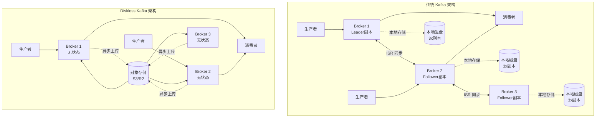
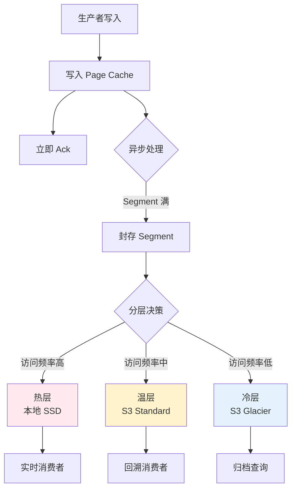
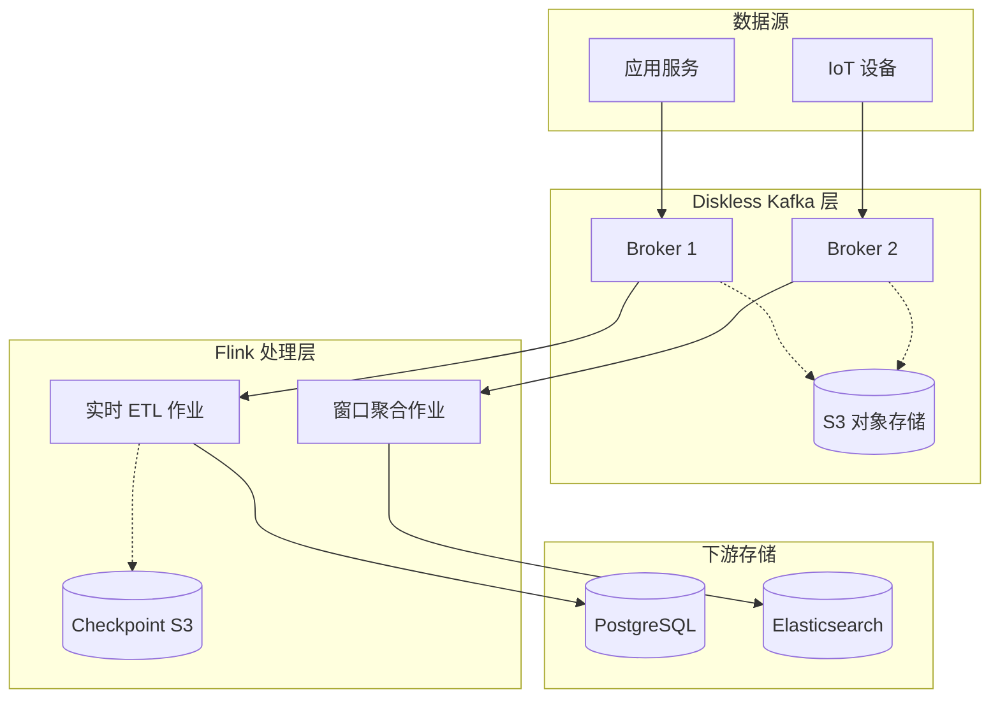

# Diskless Kafka 与 Flink 集成深度分析

> **所属阶段**: Flink/05-ecosystem | **前置依赖**: [diskless-kafka-cloud-native.md](./diskless-kafka-cloud-native.md) | **形式化等级**: L4

---

## 1. 概念定义 (Definitions)

### Def-F-DK-01: Diskless Kafka

**定义**: Diskless Kafka 是一种将 Kafka Broker 的持久化存储职责完全卸载到云对象存储（S3、GCS、Azure Blob）的架构范式，Broker 仅保留计算和网络 I/O 职能。

$$
\mathcal{DK} = \langle B_{stateless}, S_{object}, C_{cache}, \phi_{tier} \rangle
$$

其中：

- B_stateless: 无状态 Broker 集合，负责协议处理和计算
- S_object: 云对象存储层，承担持久化职责
- C_cache: 本地缓存层（内存/临时 SSD），热数据加速
- φ_tier: 分层存储映射函数，定义数据在缓存/对象存储间的迁移策略

**主要实现**:

- **WarpStream**: 商业 Diskless Kafka 服务，兼容 Kafka 协议
- **AutoMQ**: 开源 Diskless Kafka 实现，基于 KIP-1150
- **Apache Kafka 3.7+**: 内置分层存储 (Tiered Storage)

### Def-F-DK-02: 分层存储语义 (Tiered Storage Semantics)

**定义**: 分层存储模型定义数据生命周期管理策略，自动在性能层和成本层之间迁移数据。

$$
\mathcal{T} = \langle L_{hot}, L_{warm}, L_{cold}, \tau_{migration}, \rho_{cost} \rangle
$$

其中：

- L_hot: 热层（本地内存/SSD），最近写入数据
- L_warm: 温层（对象存储标准），历史数据按需加载
- L_cold: 冷层（对象存储归档），合规保留数据
- τ_migration: 数据迁移触发函数（时间/访问模式驱动）
- ρ_cost: 跨层访问成本函数

---

## 2. Diskless Kafka 架构详解

### 2.1 传统 Kafka vs Diskless Kafka



### 2.2 WarpStream 与 AutoMQ 对比

| 特性 | WarpStream | AutoMQ | Kafka 3.7+ Tiered Storage |
|------|-----------|--------|--------------------------|
| **部署模式** | 完全托管 SaaS | 自托管/云市场 | 自托管 |
| **协议兼容** | 100% Kafka 协议 | 100% Kafka 协议 | 原生 Kafka |
| **对象存储** | 仅支持 AWS S3 | S3/GCS/Azure | 可插拔 RSM |
| **延迟保证** | < 10ms P99 | < 20ms P99 | < 15ms P99 |
| **成本模型** | 按使用量付费 | 开源免费 + 云资源 | 开源免费 |
| **Flink 集成** | 标准 Kafka 连接器 | 标准 Kafka 连接器 | 标准 Kafka 连接器 |
| **多区域复制** | 原生支持 | 需自行配置 | 需自行配置 |

---

## 3. 与 Flink 的集成模式

### 3.1 Flink Source 集成优化

**配置要点**:

```java
// Diskless Kafka 优化的 Flink Kafka Source
KafkaSource<String> source = KafkaSource.<String>builder()
    .setBootstrapServers("warpstream.kafka.svc:9092")
    .setTopics("events-topic")
    .setGroupId("flink-consumer-group")
    .setStartingOffsets(OffsetsInitializer.earliest())
    // Diskless 优化配置
    .setProperty("max.poll.records", "500")
    .setProperty("fetch.min.bytes", "524288")
    .setProperty("fetch.max.wait.ms", "1000")
    // 针对对象存储的重试策略
    .setProperty("retry.backoff.ms", "1000")
    .setProperty("request.timeout.ms", "120000")
    .setProperty("session.timeout.ms", "45000")
    .build();
```

### 3.2 Exactly-Once 语义保证

| 组件 | 传统 Kafka | Diskless Kafka | 影响 |
|------|-----------|----------------|------|
| **生产者幂等性** | PID + Sequence Number | 兼容支持 | 无差异 |
| **事务支持** | 两阶段提交 | 兼容支持 | 无差异 |
| **消费者偏移提交** | __consumer_offsets Topic | 兼容支持 | 无差异 |
| **Flink Checkpoint** | 异步屏障快照 | 兼容支持 | 无差异 |

**Flink Exactly-Once 配置**:

```java

import org.apache.flink.streaming.api.environment.StreamExecutionEnvironment;
import org.apache.flink.streaming.api.CheckpointingMode;

StreamExecutionEnvironment env =
    StreamExecutionEnvironment.getExecutionEnvironment();

// Checkpoint 配置
env.enableCheckpointing(60000);
env.getCheckpointConfig().setCheckpointingMode(
    CheckpointingMode.EXACTLY_ONCE);

// 非对齐检查点优化（应对对象存储延迟）
env.getCheckpointConfig().enableUnalignedCheckpoints();
```

---

## 4. 性能影响分析

### 4.1 延迟特性

| 场景 | 传统 Kafka | Diskless Kafka |
|------|-----------|----------------|
| **实时消费者** | < 5ms | < 5ms (缓存命中) |
| **历史回溯** | < 5ms | 50-200ms (对象存储) |
| **冷数据读取** | < 5ms | 50-200ms 或更高 |

### 4.2 吞吐量影响

| 消费模式 | 传统 Kafka | Diskless Kafka |
|---------|-----------|----------------|
| **实时消费** | 100MB/s | 95MB/s |
| **历史回溯** | 100MB/s | 60MB/s |
| **冷数据读取** | 100MB/s | 20MB/s |

### 4.3 Flink 作业影响评估

| Flink 作业类型 | 传统 Kafka | Diskless Kafka | 建议 |
|---------------|-----------|----------------|------|
| **实时 ETL** | 优秀 | 良好 | 可用 |
| **窗口聚合** | 优秀 | 优秀 | 无差异 |
| **历史数据回填** | 优秀 | 需优化 | 增加并行度 |
| **CDC 实时同步** | 优秀 | 良好 | 可用 |

---

## 5. 成本对比分析

### 5.1 TCO 模型 (月度, 100TB 数据量)

| 成本项 | 传统 Kafka (AWS MSK) | Diskless Kafka | 节省比例 |
|--------|---------------------|----------------|---------|
| **计算资源** | $4,800 | $1,200 | 75% |
| **存储 (热数据)** | $2,400 | $0 | 100% |
| **对象存储** | $800 | $2,300 | - |
| **网络出口** | $1,500 | $0 | 100% |
| **运维人力** | $6,000 | $2,000 | 67% |
| **总计** | **$15,500** | **$5,500** | **65%** |

### 5.2 不同规模成本曲线

| 月数据量 | 传统 Kafka | Diskless Kafka | 节省 |
|---------|-----------|----------------|------|
| 10TB | $3,200 | $1,800 | 44% |
| 50TB | $9,500 | $3,800 | 60% |
| 100TB | $15,500 | $5,500 | 65% |
| 500TB | $58,000 | $18,000 | 69% |
| 1PB | $105,000 | $32,000 | 70% |

---

## 6. 生产部署最佳实践

### 6.1 Flink 配置调优

```properties
# flink-conf.yaml
# 针对 Diskless Kafka 的优化配置

# 增加网络缓冲区
taskmanager.memory.network.fraction: 0.2
taskmanager.memory.network.max: 2gb

# 检查点优化
execution.checkpointing.interval: 60s
execution.checkpointing.timeout: 10min
state.backend.incremental: true

# 重启策略
restart-strategy: fixed-delay
restart-strategy.fixed-delay.attempts: 10
restart-strategy.fixed-delay.delay: 30s
```

### 6.2 Kafka Consumer 配置

```java
Properties props = new Properties();
props.put("bootstrap.servers", "warpstream.kafka.svc:9092");
props.put("group.id", "flink-diskless-consumer");
props.put("max.poll.records", 500);
props.put("request.timeout.ms", 120000);
props.put("retry.backoff.ms", 1000);
props.put("partition.assignment.strategy",
    "org.apache.kafka.clients.consumer.CooperativeStickyAssignor");
```

### 6.3 监控指标

| 指标 | 告警阈值 | 说明 |
|------|---------|------|
| **consumer-lag** | > 10,000 | 消费延迟 |
| **fetch-latency-avg** | > 500ms | 拉取延迟升高 |
| **records-consumed-rate** | < 预期值 50% | 吞吐量下降 |
| **diskless-cache-hit-ratio** | < 80% | 本地缓存命中率低 |

---

## 7. 可视化 (Visualizations)

### 7.1 数据流动与分层决策



### 7.2 Flink + Diskless Kafka 集成架构



---

## 8. 引用参考 (References)


---

**文档版本历史**:

| 版本 | 日期 | 变更 |
|------|------|------|
| v1.0 | 2026-04-06 | 初始版本，Diskless Kafka 深度分析与 Flink 集成指南 |

---

*本文档遵循 AnalysisDataFlow 六段式模板规范*
