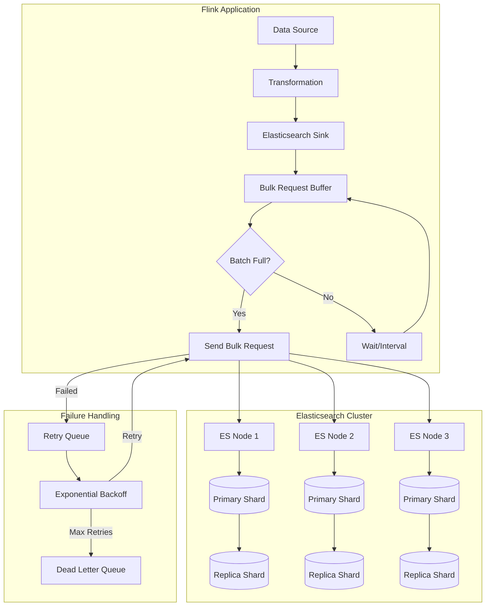
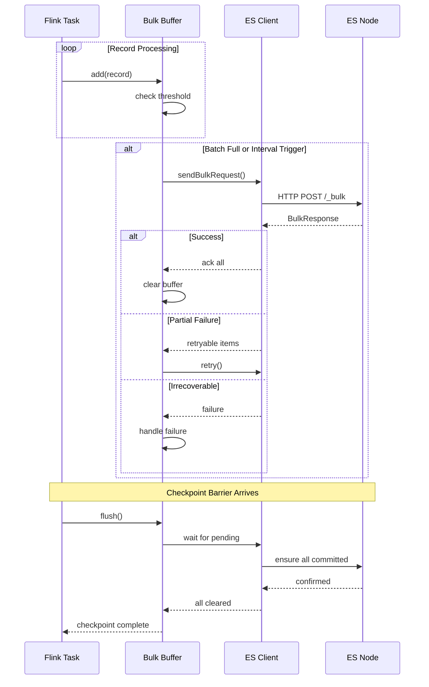
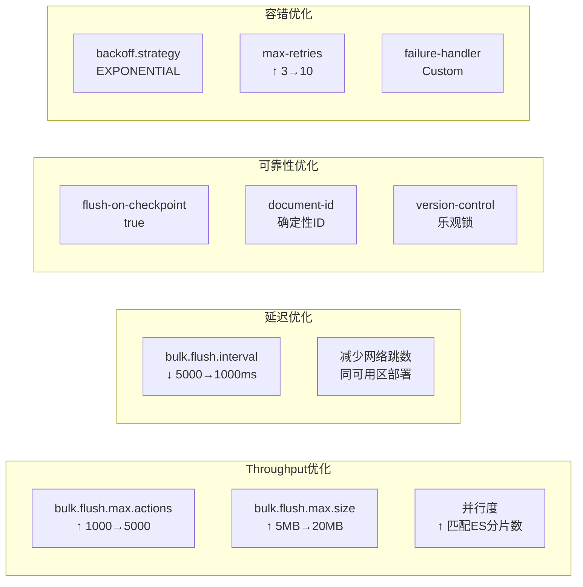

# Elasticsearch Connector 完整指南

> 所属阶段: Flink/Connectors | 前置依赖: [Flink DataStream API](../../03-api/09-language-foundations/flink-datastream-api-complete-guide.md), [Flink Checkpoint机制](../../02-core/checkpoint-mechanism-deep-dive.md) | 形式化等级: L3

---

## 1. 概念定义 (Definitions)

### Def-F-04-01: Elasticsearch Sink

**定义**: Elasticsearch Sink 是 Flink DataStream API 提供的输出算子，用于将流式数据写入 Elasticsearch 集群，支持近实时索引、批量写入和容错语义。

```
ES Sink: DataStream<T> → Elasticsearch Cluster
         ∀ record ∈ T: record → IndexRequest → BulkRequest → ES Node
```

### Def-F-04-02: 索引与文档模型

**定义**: Elasticsearch 采用倒排索引结构，数据组织层级为：

| 层级 | 概念 | 说明 |
|------|------|------|
| Cluster | 集群 | 一个或多个节点的集合 |
| Index | 索引 | 逻辑上的文档集合，对应关系型数据库的表 |
| Shard | 分片 | 索引的物理分割单元，支持水平扩展 |
| Document | 文档 | JSON 格式的数据单元，对应关系型数据库的行 |
| Field | 字段 | 文档的属性，对应关系型数据库的列 |

**形式化表示**:

```
Index = {Doc₁, Doc₂, ..., Docₙ}
Doc = {_id: String, _source: JSON, _version: Long, ...metadata}
```

### Def-F-04-03: 批量写入机制 (Bulk API)

**定义**: Flink ES Connector 使用 Elasticsearch Bulk API 将多条记录打包成一个请求发送，减少网络往返开销。

```
BulkRequest = [IndexRequest | UpdateRequest | DeleteRequest]⁺
             where |BulkRequest| ≤ bulk.flush.max.actions
               and size(BulkRequest) ≤ bulk.flush.max.size
```

**核心参数**:

- `bulk.flush.max.actions`: 单个 bulk 请求的最大操作数（默认 1000）
- `bulk.flush.max.size`: 单个 bulk 请求的最大字节数（默认 5MB）
- `bulk.flush.interval`: 批量刷新间隔（默认 null）

### Def-F-04-04: 幂等写入语义

**定义**: 通过指定文档 ID 和版本控制，ES Sink 可实现 Exactly-Once 语义：

```
∀ checkpoint: records processed → ES committed
              ∧ failure → replay from checkpoint
              ∧ no duplicate documents (by _id)
```

---

## 2. 属性推导 (Properties)

### Prop-F-04-01: 写入性能边界

**命题**: ES Sink 的最大吞吐受以下因素约束：

```
T_max = min(T_bulk, T_es, T_network)
where:
  T_bulk = bulk.flush.max.actions / bulk.flush.interval
  T_es = ES集群索引能力(分片数 × 单分片吞吐)
  T_network = 网络带宽 / 平均文档大小
```

### Prop-F-04-02: 版本冲突处理

**命题**: 当多个并发写入操作针对同一文档时：

```
if (provided_version == current_version) {
    update succeeds
} else if (provided_version > current_version) {
    update succeeds (fast-forward)
} else {
    VersionConflictException
}
```

### Lemma-F-04-01: 批量大小与延迟权衡

**引理**: 增大 `bulk.flush.max.actions` 可提高吞吐但会增加延迟：

```
Latency ≈ (N_actions / ArrivalRate) + NetworkRTT + ES_ProcessingTime
Throughput ≈ N_actions / Latency
```

---

## 3. 关系建立 (Relations)

### 3.1 与其他Connector的关系

```
┌─────────────────────────────────────────────────────────────────┐
│                     Flink Sink Connectors                        │
├──────────────┬──────────────┬──────────────┬────────────────────┤
│  Kafka Sink  │   JDBC Sink  │  ES Sink     │   FileSystem Sink  │
├──────────────┼──────────────┼──────────────┼────────────────────┤
│ Append-Only  │ Upsert       │ Index/Upsert │ Append/Overwrite   │
│ 高吞吐       │ 事务支持      │ 全文检索      │ 批量/流批一体       │
│ 分区有序     │ Exactly-Once │ 近实时        │ 列式存储           │
└──────────────┴──────────────┴──────────────┴────────────────────┘
```

### 3.2 ES Sink 在数据管道中的位置

```
Data Source → Flink Processing → ES Sink → Elasticsearch Cluster
                                                ↓
                                    Kibana / Grafana / Custom App
```

### 3.3 与Flink Checkpoint的关系

```
ES Sink 作为 Stateful Sink:
- Pre-Checkpoint: 等待所有 pending 的 bulk 请求完成
- Snapshot: 记录最后成功确认的 document offset
- Recovery: 从 checkpoint 恢复,重放未确认的记录
```

---

## 4. 论证过程 (Argumentation)

### 4.1 版本兼容性分析

| Flink 版本 | ES 6.x | ES 7.x | ES 8.x | 说明 |
|------------|--------|--------|--------|------|
| 1.13 | ✅ `flink-connector-elasticsearch6` | ✅ `flink-connector-elasticsearch7` | ❌ | 独立artifact |
| 1.14 | ✅ | ✅ | ❌ | |
| 1.15 | ✅ | ✅ | ❌ | |
| 1.16 | ⚠️ | ✅ | ✅ | ES6 进入维护模式 |
| 1.17+ | ❌ | ✅ | ✅ | 移除 ES6 支持 |
| 1.18+ | ❌ | ✅ | ✅ | 推荐 ES7/8 |

### 4.2 架构决策：同步 vs 异步写入

**同步写入**:

```
优点: 简单、异常立即感知
缺点: 吞吐低、网络等待浪费时间
适用: 低吞吐、强一致性场景
```

**异步写入** (ES Sink 采用):

```
优点: 高吞吐、批量优化、网络复用
缺点: 需处理背压、异常延迟感知
适用: 流处理场景(默认)
```

### 4.3 反例分析：错误的动态索引实现

```java

// [伪代码片段 - 不可直接运行] 仅展示核心逻辑
import org.apache.flink.streaming.api.datastream.DataStream;

// ❌ 错误做法:每条记录创建新的 IndexRequest 函数
DataStream<LogEvent> stream = ...;
stream.addSink(new ElasticsearchSink.Builder<LogEvent>(
    config,
    (element, ctx, indexer) -> {
        // 每次调用都创建新的 IndexRequest
        String indexName = "logs-" + element.getDate(); // 运行时计算
        indexer.add(new IndexRequest(indexName).source(element.toJson()));
    }
).build());
// 问题:没有利用批量写入的优势,每条记录单独处理
```

```java
// [伪代码片段 - 不可直接运行] 仅展示核心逻辑
// ✅ 正确做法:使用 IndexRequest 构建器,让 Sink 批量处理
ElasticsearchSink.Builder<LogEvent> builder = new ElasticsearchSink.Builder<>(
    config,
    (element, ctx, indexer) -> {
        String indexName = "logs-" + element.getDate();
        IndexRequest request = Requests.indexRequest()
            .index(indexName)
            .id(element.getId())
            .source(element.toJson(), XContentType.JSON);
        indexer.add(request); // 加入批量队列
    }
);
builder.setBulkFlushMaxActions(1000); // 批量刷新
```

---

## 5. 形式证明 / 工程论证 (Proof / Engineering Argument)

### Thm-F-04-01: ES Sink 的 At-Least-Once 语义保证

**定理**: 配置 `flush-on-checkpoint` 为 true 时，ES Sink 保证 At-Least-Once 语义。

**证明**:

1. **记录发射**: Flink 算子通过 `invoke()` 将记录加入内部缓冲区
2. **批量构建**: 当缓冲区达到 `bulk.flush.max.actions` 或 `bulk.flush.interval` 触发时，构建 BulkRequest
3. **异步发送**: 通过 ES REST Client 异步发送请求
4. **确认回调**: 收到 ES 确认后，从缓冲区移除对应记录
5. **Checkpoint 协调**: Checkpoint 时等待所有 pending 请求完成

```
∀ record r emitted:
    if checkpoint C succeeds:
        then r ∈ ES (committed)
    if checkpoint C fails:
        then r may be replayed (duplicate possible)
```

**工程实现**:

```java
// [伪代码片段 - 不可直接运行] 仅展示核心逻辑
// 启用 checkpoint 同步
builder.setFlushOnCheckpoint(true);
```

### Thm-F-04-02: Exactly-Once 通过幂等 ID 实现

**定理**: 为每条记录提供确定性的 document ID，可实现 Exactly-Once 语义。

**证明**:

设记录 `r` 的唯一标识为 `id(r)`，在 checkpoint `Cₙ` 时：

1. **第一次执行**: ES 中创建文档 `_id = id(r)`
2. **故障恢复**: 从 `Cₙ` 重启，重新发送 `r`
3. **幂等写入**: ES 检测到相同 `_id`，执行更新操作（内容相同）

```
Result: ES 中仅有一份 r 的拷贝,无重复
```

---

## 6. 实例验证 (Examples)

### 6.1 Maven 依赖配置

```xml
<!-- Flink 1.17+ with Elasticsearch 7.x -->
<dependency>
    <groupId>org.apache.flink</groupId>
    <artifactId>flink-connector-elasticsearch7</artifactId>
    <version>3.0.1-1.17</version>
</dependency>

<!-- Flink 1.17+ with Elasticsearch 8.x -->
<dependency>
    <groupId>org.apache.flink</groupId>
    <artifactId>flink-connector-elasticsearch8</artifactId>
    <version>3.0.1-1.17</version>
</dependency>

<!-- 如果使用 Java 11+ -->
<dependency>
    <groupId>org.apache.flink</groupId>
    <artifactId>flink-connector-elasticsearch-base</artifactId>
    <version>3.0.1-1.17</version>
</dependency>
```

### 6.2 基本写入示例（Java）

```java
import org.apache.flink.api.common.functions.RuntimeContext;
import org.apache.flink.streaming.api.datastream.DataStream;
import org.apache.flink.streaming.api.environment.StreamExecutionEnvironment;
import org.apache.flink.streaming.connectors.elasticsearch.ElasticsearchSinkFunction;
import org.apache.flink.streaming.connectors.elasticsearch.RequestIndexer;
import org.apache.flink.streaming.connectors.elasticsearch7.ElasticsearchSink;
import org.apache.http.HttpHost;
import org.elasticsearch.action.index.IndexRequest;
import org.elasticsearch.client.Requests;
import org.elasticsearch.common.xcontent.XContentType;

import java.util.ArrayList;
import java.util.List;

public class ElasticsearchSinkExample {

    public static void main(String[] args) throws Exception {
        StreamExecutionEnvironment env = StreamExecutionEnvironment.getExecutionEnvironment();

        // 示例数据流
        DataStream<UserAction> stream = env.fromElements(
            new UserAction("user1", "click", "product_A", System.currentTimeMillis()),
            new UserAction("user2", "view", "product_B", System.currentTimeMillis()),
            new UserAction("user3", "purchase", "product_C", System.currentTimeMillis())
        );

        // 配置 ES 集群地址
        List<HttpHost> httpHosts = new ArrayList<>();
        httpHosts.add(new HttpHost("127.0.0.1", 9200, "http"));
        httpHosts.add(new HttpHost("127.0.0.1", 9201, "http"));

        // 构建 ES Sink
        ElasticsearchSink.Builder<UserAction> builder = new ElasticsearchSink.Builder<>(
            httpHosts,
            new ElasticsearchSinkFunction<UserAction>() {
                @Override
                public void process(UserAction element, RuntimeContext ctx, RequestIndexer indexer) {
                    // 构建 IndexRequest
                    String json = String.format(
                        "{\"user_id\":\"%s\",\"action\":\"%s\",\"target\":\"%s\",\"timestamp\":%d}",
                        element.getUserId(), element.getAction(),
                        element.getTarget(), element.getTimestamp()
                    );

                    IndexRequest request = Requests.indexRequest()
                        .index("user-actions")
                        .id(element.getUserId() + "_" + element.getTimestamp()) // 确定性ID
                        .source(json, XContentType.JSON);

                    indexer.add(request);
                }
            }
        );

        // 批量写入配置
        builder.setBulkFlushMaxActions(1000);
        builder.setBulkFlushMaxSizeMb(5);
        builder.setBulkFlushInterval(5000); // 5秒刷新

        // 启用 checkpoint 同步
        builder.setFlushOnCheckpoint(true);

        stream.addSink(builder.build());
        env.execute("Elasticsearch Sink Example");
    }
}

// POJO 定义
class UserAction {
    private String userId;
    private String action;
    private String target;
    private long timestamp;

    public UserAction(String userId, String action, String target, long timestamp) {
        this.userId = userId;
        this.action = action;
        this.target = target;
        this.timestamp = timestamp;
    }

    // Getters
    public String getUserId() { return userId; }
    public String getAction() { return action; }
    public String getTarget() { return target; }
    public long getTimestamp() { return timestamp; }
}
```

### 6.3 带认证的 ES Sink 配置

```java
// [伪代码片段 - 不可直接运行] 仅展示核心逻辑
import org.apache.http.auth.AuthScope;
import org.apache.http.auth.UsernamePasswordCredentials;
import org.apache.http.client.CredentialsProvider;
import org.apache.http.impl.client.BasicCredentialsProvider;
import org.elasticsearch.client.RestClientBuilder;

// ... 在 builder 配置中

builder.setRestClientFactory(
    restClientBuilder -> {
        // Basic Auth 配置
        CredentialsProvider credentialsProvider = new BasicCredentialsProvider();
        credentialsProvider.setCredentials(
            AuthScope.ANY,
            new UsernamePasswordCredentials("elastic", "your-password")
        );

        restClientBuilder.setHttpClientConfigCallback(
            httpClientBuilder -> httpClientBuilder
                .setDefaultCredentialsProvider(credentialsProvider)
                // SSL/TLS 配置
                .setSSLContext(sslContext) // 预配置的 SSLContext
                .setSSLHostnameVerifier(NoopHostnameVerifier.INSTANCE)
        );

        // 连接配置
        restClientBuilder.setRequestConfigCallback(
            requestConfigBuilder -> requestConfigBuilder
                .setConnectTimeout(5000)
                .setSocketTimeout(60000)
        );
    }
);
```

### 6.4 动态索引（按时间分区）

```java
import java.util.Map;

import java.time.LocalDateTime;
import java.time.format.DateTimeFormatter;

import org.apache.flink.streaming.api.environment.StreamExecutionEnvironment;
import org.apache.flink.streaming.api.datastream.DataStream;


public class DynamicIndexExample {

    private static final DateTimeFormatter FORMATTER =
        DateTimeFormatter.ofPattern("yyyy.MM.dd");

    public static void main(String[] args) throws Exception {
        StreamExecutionEnvironment env = StreamExecutionEnvironment.getExecutionEnvironment();

        DataStream<LogEvent> logStream = env.addSource(new LogSource());

        List<HttpHost> httpHosts = List.of(
            new HttpHost("es-node1", 9200),
            new HttpHost("es-node2", 9200)
        );

        ElasticsearchSink.Builder<LogEvent> builder = new ElasticsearchSink.Builder<>(
            httpHosts,
            new ElasticsearchSinkFunction<LogEvent>() {
                @Override
                public void process(LogEvent element, RuntimeContext ctx, RequestIndexer indexer) {
                    // 动态计算索引名称
                    LocalDateTime eventTime = LocalDateTime.ofInstant(
                        java.time.Instant.ofEpochMilli(element.getTimestamp()),
                        java.time.ZoneId.systemDefault()
                    );
                    String indexName = "application-logs-" + eventTime.format(FORMATTER);

                    // 构建请求
                    IndexRequest request = Requests.indexRequest()
                        .index(indexName)
                        .id(element.getLogId())
                        .source(element.toJson(), XContentType.JSON);

                    indexer.add(request);
                }
            }
        );

        // 性能优化配置
        builder.setBulkFlushMaxActions(2000);
        builder.setBulkFlushMaxSizeMb(10);
        builder.setBulkFlushInterval(10000);
        builder.setFlushOnCheckpoint(true);

        logStream.addSink(builder.build());
        env.execute("Dynamic Index ES Sink");
    }
}

// 日志事件类
class LogEvent {
    private String logId;
    private String level;
    private String message;
    private String service;
    private long timestamp;
    private Map<String, String> tags;

    public String toJson() {
        // 使用 Jackson 或 Gson 序列化
        return "{\"logId\":\"" + logId + "\",\"level\":\"" + level + "\",...}";
    }

    // Getters
    public String getLogId() { return logId; }
    public long getTimestamp() { return timestamp; }
}
```

### 6.5 带重试策略和死信队列的完整配置

```java
import org.apache.flink.streaming.connectors.elasticsearch.ActionRequestFailureHandler;
import org.apache.flink.streaming.connectors.elasticsearch.RequestIndexer;
import org.elasticsearch.action.ActionRequest;
import org.elasticsearch.common.util.concurrent.EsRejectedExecutionException;
import org.elasticsearch.index.mapper.MapperParsingException;
import org.apache.flink.util.ExceptionUtils;

import org.apache.flink.streaming.api.environment.StreamExecutionEnvironment;
import org.apache.flink.streaming.api.datastream.DataStream;


public class RobustElasticsearchSink {

    public static void main(String[] args) throws Exception {
        StreamExecutionEnvironment env = StreamExecutionEnvironment.getExecutionEnvironment();
        env.enableCheckpointing(60000); // 1分钟 checkpoint

        DataStream<Event> stream = env.addSource(new EventSource());

        // 死信队列流(侧输出)
        OutputTag<Event> deadLetterTag = new OutputTag<Event>("dead-letters") {};

        SingleOutputStreamOperator<Event> mainStream = stream
            .process(new ProcessFunction<Event, Event>() {
                @Override
                public void processElement(Event value, Context ctx, Collector<Event> out) {
                    out.collect(value);
                }
            });

        List<HttpHost> httpHosts = List.of(
            new HttpHost("es-cluster", 9200)
        );

        ElasticsearchSink.Builder<Event> builder = new ElasticsearchSink.Builder<>(
            httpHosts,
            new ElasticsearchSinkFunction<Event>() {
                @Override
                public void process(Event element, RuntimeContext ctx, RequestIndexer indexer) {
                    IndexRequest request = Requests.indexRequest()
                        .index(element.getIndexName())
                        .id(element.getId())
                        .source(element.toJson(), XContentType.JSON)
                        .routing(element.getRoutingKey()); // 路由配置

                    // 版本控制(乐观锁)
                    if (element.getVersion() != null) {
                        request.version(element.getVersion());
                        request.versionType(VersionType.EXTERNAL);
                    }

                    indexer.add(request);
                }
            }
        );

        // 批量配置
        builder.setBulkFlushMaxActions(1000);
        builder.setBulkFlushMaxSizeMb(5);
        builder.setBulkFlushInterval(5000);

        // 重试配置
        builder.setBulkFlushBackoff(true);
        builder.setBulkFlushBackoffType(ElasticsearchSink.FlushBackoffType.EXPONENTIAL);
        builder.setBulkFlushBackoffDelay(100); // 初始延迟 100ms
        builder.setBulkFlushBackoffRetries(8); // 最大重试 8 次

        // 自定义失败处理器
        builder.setFailureHandler(new ActionRequestFailureHandler() {
            @Override
            public void onFailure(ActionRequest action, Throwable failure,
                                  int restStatusCode, RequestIndexer indexer) throws Throwable {

                // 可重试错误:加入重试队列
                if (ExceptionUtils.findThrowable(failure, EsRejectedExecutionException.class).isPresent()
                    || restStatusCode == 429 // Too Many Requests
                    || restStatusCode >= 500) { // 服务器错误

                    indexer.add(action);
                    return;
                }

                // 不可恢复错误:跳过或发送到死信队列
                if (ExceptionUtils.findThrowable(failure, MapperParsingException.class).isPresent()
                    || restStatusCode == 400) { // Bad Request

                    // 记录错误,丢弃请求
                    System.err.println("Dropping invalid request: " + action);
                    return;
                }

                // 其他错误:抛出异常终止任务
                throw failure;
            }
        });

        builder.setFlushOnCheckpoint(true);

        mainStream.addSink(builder.build());
        env.execute("Robust ES Sink");
    }
}
```

### 6.6 完整日志分析场景（Python Table API）

```python
from pyflink.table import StreamTableEnvironment, EnvironmentSettings
from pyflink.datastream import StreamExecutionEnvironment

# 创建执行环境 env = StreamExecutionEnvironment.get_execution_environment()
env.enable_checkpointing(60000)

settings = EnvironmentSettings.new_instance() \
    .in_streaming_mode() \
    .build()

table_env = StreamTableEnvironment.create(env, settings)

# 创建源表(Kafka 日志)
table_env.execute_sql("""
CREATE TABLE kafka_logs (
    log_id STRING,
    timestamp TIMESTAMP(3),
    level STRING,
    service STRING,
    message STRING,
    host STRING,
    proctime AS PROCTIME()
) WITH (
    'connector' = 'kafka',
    'topic' = 'application-logs',
    'properties.bootstrap.servers' = 'kafka:9092',
    'properties.group.id' = 'flink-es-connector',
    'format' = 'json',
    'scan.startup.mode' = 'latest-offset'
)
""")

# 创建 ES Sink 表
# 动态索引通过 DATE_FORMAT 实现 table_env.execute_sql("""
CREATE TABLE es_logs (
    log_id STRING PRIMARY KEY NOT ENFORCED,
    log_time TIMESTAMP(3),
    level STRING,
    service STRING,
    message STRING,
    host STRING,
    idx STRING NOT NULL,
    INDEX idx_service LEVEL service
) WITH (
    'connector' = 'elasticsearch-7',
    'hosts' = 'http://es-node1:9200;http://es-node2:9200',
    'index' = 'application-logs-{idx}',
    'document-id.key-delimiter' = '$',
    'bulk-flush.max-actions' = '1000',
    'bulk-flush.max-size' = '5mb',
    'bulk-flush.interval' = '1000',
    'bulk-flush.backoff.enable' = 'true',
    'bulk-flush.backoff.delay' = '100ms',
    'bulk-flush.backoff.max-retries' = '8',
    'format' = 'json'
)
""")

# 数据转换并写入 ES table_env.execute_sql("""
INSERT INTO es_logs
SELECT
    log_id,
    timestamp as log_time,
    level,
    service,
    message,
    host,
    DATE_FORMAT(timestamp, 'yyyy.MM.dd') as idx
FROM kafka_logs
""")
```

### 6.7 使用 SQL Connector 的高级配置

```sql
-- 带认证的 ES Sink
CREATE TABLE es_secure_logs (
    id STRING PRIMARY KEY NOT ENFORCED,
    content STRING,
    created_at TIMESTAMP(3)
) WITH (
    'connector' = 'elasticsearch-7',
    'hosts' = 'https://es-secure:9200',
    'index' = 'secure-logs',
    'username' = 'elastic',
    'password' = '${ES_PASSWORD}',

    -- SSL 配置
    'security.ssl.enabled' = 'true',
    'security.ssl.verification-mode' = 'certificate',
    'security.ssl.keystore.path' = '/path/to/keystore.jks',
    'security.ssl.keystore.password' = '${KEYSTORE_PASSWORD}',
    'security.ssl.truststore.path' = '/path/to/truststore.jks',
    'security.ssl.truststore.password' = '${TRUSTSTORE_PASSWORD}',

    -- 批量与性能
    'bulk-flush.max-actions' = '2000',
    'bulk-flush.max-size' = '10mb',
    'bulk-flush.interval' = '5000ms',
    'bulk-flush.backoff.strategy' = 'EXPONENTIAL',
    'bulk-flush.backoff.max-retries' = '10',

    -- 连接配置
    'connection.path-prefix' = '',
    'connection.request-timeout' = '60000',
    'connection.timeout' = '5000',

    -- 失败处理
    'sink.failure-handler' = 'retry-rejected',
    'sink.flush-on-checkpoint' = 'true'
);
```

---

## 7. 可视化 (Visualizations)

### 7.1 ES Sink 数据流架构



### 7.2 批量写入时序图



### 7.3 动态索引决策树

```mermaid
flowchart TD
    A[Record Arrives] --> B{Determine Index}
    B -->|Time-based| C[logs-YYYY.MM.dd]
    B -->|Tenant-based| D[logs-tenant-{id}]
    B -->|Service-based| E[logs-{service}]

    C --> F[Check Index Exists]
    D --> F
    E --> F

    F -->|No| G[Create Index with Template]
    F -->|Yes| H[Index Document]
    G --> H

    H --> I{Write Result}
    I -->|Success| J[Next Record]
    I -->|Conflict| K[Handle Conflict]
    I -->|Error| L[Retry/Dead Letter]

    K --> M{Conflict Type}
    M -->|Version| N[Ignore/Update]
    M -->|Mapping| O[Reject to DLQ]
```

### 7.4 性能优化配置矩阵



---

## 8. 引用参考 (References)


---

## 附录：完整配置参数速查表

| 参数 | 类型 | 默认值 | 说明 |
|------|------|--------|------|
| `hosts` | String | 必填 | ES 集群地址，分号分隔 |
| `index` | String | 必填 | 索引名称，支持 `{field}` 占位符 |
| `document-id.key-delimiter` | String | `_` | 复合 ID 分隔符 |
| `bulk-flush.max-actions` | Integer | 1000 | 最大批量操作数 |
| `bulk-flush.max-size` | String | 5mb | 最大批量大小 |
| `bulk-flush.interval` | Duration | null | 批量刷新间隔 |
| `bulk-flush.backoff.enable` | Boolean | false | 启用退避重试 |
| `bulk-flush.backoff.strategy` | Enum | CONSTANT | 退避策略: CONSTANT/EXPONENTIAL |
| `bulk-flush.backoff.delay` | Duration | 50ms | 退避延迟 |
| `bulk-flush.backoff.max-retries` | Integer | 8 | 最大重试次数 |
| `sink.flush-on-checkpoint` | Boolean | true | Checkpoint 时刷新 |
| `format` | String | json | 序列化格式 |
| `username` | String | null | 用户名 |
| `password` | String | null | 密码 |
| `security.ssl.enabled` | Boolean | false | 启用 SSL |
| `connection.timeout` | Integer | 5000 | 连接超时(ms) |
| `connection.request-timeout` | Integer | 60000 | 请求超时(ms) |
| `sink.failure-handler` | String | fail | 失败处理: fail/ignore/retry-rejected/custom |

---

> **维护者备注**: 本文档对应 Flink 1.17+ 和 Elasticsearch 7.x/8.x。ES 6.x 支持已于 Flink 1.17 移除。
> 最后更新: 2026-04-04
