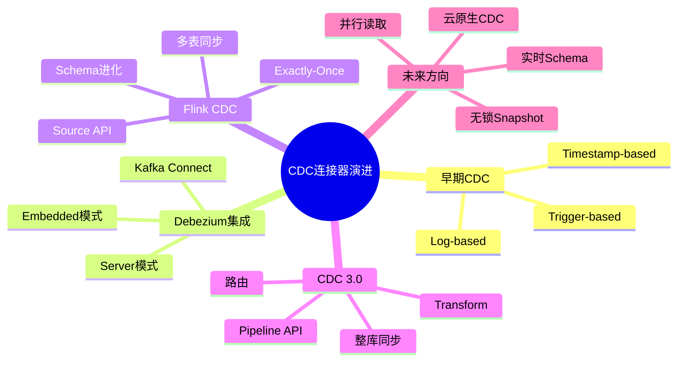
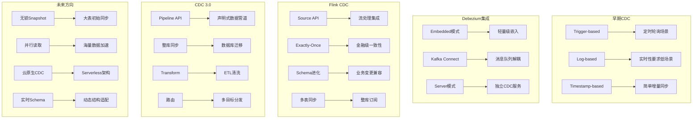
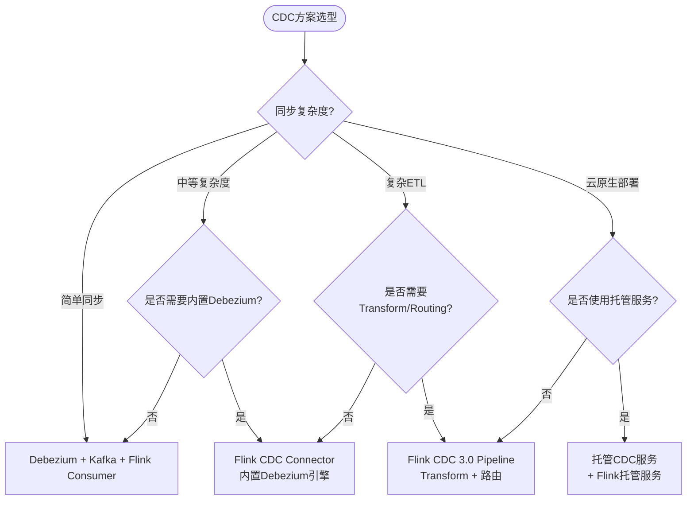

# CDC连接器演进 特性跟踪

> 所属阶段: Flink/connectors/evolution | 前置依赖: [CDC Connector][^1] | 形式化等级: L3

## 1. 概念定义 (Definitions)

### Def-F-Conn-CDC-01: Change Data Capture

变更数据捕获：
$$
\text{CDC} : \text{DB Changes} \to \text{Stream}<\text{ChangeEvent}>
$$

### Def-F-Conn-CDC-02: Change Event

变更事件：
$$
\text{ChangeEvent} = \langle \text{Op}, \text{Before}, \text{After}, \text{Source} \rangle
$$

## 2. 属性推导 (Properties)

### Prop-F-Conn-CDC-01: Consistency Guarantee

一致性保证：
$$
\text{CDC} \implies \text{ExactlyOnce} \land \text{Ordering}
$$

## 3. 关系建立 (Relations)

### CDC演进

| 版本 | 特性 | 状态 | 参考文档 |
|------|------|------|----------|
| 2.3 | Debezium集成 | GA | - |
| 2.4 | 原生CDC | GA | - |
| 2.5 | 多源CDC | GA | - |
| 3.0 | 统一CDC框架 | GA | [CDC 3.0指南](../flink-cdc-3.0-data-integration.md) |
| 3.6.0 | Flink 2.2支持/JDK 11/Oracle Source/Hudi Sink/Schema Evolution增强 | GA (2026-03-30) | [CDC 3.6.0完整指南](../flink-cdc-3.6.0-guide.md) |

## 4. 论证过程 (Argumentation)

### 4.1 支持的数据库

| 数据库 | 捕获模式 | 状态 |
|--------|----------|------|
| MySQL | Binlog | GA |
| PostgreSQL | WAL | GA |
| Oracle | LogMiner | GA |
| MongoDB | Oplog | GA |
| SQL Server | CDC表 | Beta |

## 5. 形式证明 / 工程论证

### 5.1 MySQL CDC Source

```java
// [伪代码片段 - 不可直接运行] 仅展示核心逻辑
MySqlSource<String> mySqlSource = MySqlSource.<String>builder()
    .hostname("mysql")
    .port(3306)
    .databaseList("inventory")
    .tableList("inventory.products")
    .username("flink")
    .password("flinkpwd")
    .deserializer(new JsonDebeziumDeserializationSchema())
    .build();
```

## 6. 实例验证 (Examples)

### 6.1 处理CDC事件

```java
// [伪代码片段 - 不可直接运行] 仅展示核心逻辑
stream.process(new ProcessFunction<String, Row>() {
    @Override
    public void processElement(String event, Context ctx, Collector<Row> out) {
        JsonObject json = JsonParser.parseString(event).getAsJsonObject();
        String op = json.get("op").getAsString();

        switch (op) {
            case "c": // CREATE
            case "r": // READ (snapshot)
                out.collect(parseAfter(json));
                break;
            case "u": // UPDATE
                out.collect(parseAfter(json));
                break;
            case "d": // DELETE
                out.collect(parseBefore(json));
                break;
        }
    }
});
```

## 7. 可视化 (Visualizations)

### 7.1 CDC数据流概览


### 7.2 CDC连接器演进思维导图

以下思维导图以"CDC连接器演进"为中心，放射展开五大演进阶段及其关键技术分支：



### 7.3 CDC版本→核心特性→应用场景多维关联树

以下关联树展示各CDC版本的核心特性及其对应的应用场景映射关系：



### 7.4 CDC方案选型决策树

以下决策树根据同步复杂度、部署模式与功能需求，指导用户选择最合适的CDC技术方案：



## 8. 引用参考 (References)

[^1]: Flink CDC Connector Documentation. https://nightlies.apache.org/flink/flink-cdc-docs-stable/
[^2]: Debezium Documentation, "Debezium Architecture", 2025. https://debezium.io/documentation/reference/stable/architecture.html
[^3]: Flink CDC Documentation, "Flink CDC 3.0 Pipeline API", 2025. https://nightlies.apache.org/flink/flink-cdc-docs-release-3.0/docs/get-started/introduction/
[^4]: T. Akidau et al., "The Dataflow Model", PVLDB, 8(12), 2015. https://doi.org/10.14778/2824032.2824076

---

## 跟踪信息

| 属性 | 值 |
|------|-----|
| 版本 | 2.4-3.6.0 |
| 当前状态 | 持续演进中 |
| 最新GA版本 | 3.6.0 (2026-03-30) |
| 推荐版本 | 3.6.0 (Flink 1.20.x/2.2.x + JDK 11+)

---

*文档版本: v1.0 | 创建日期: 2026-04-19*
