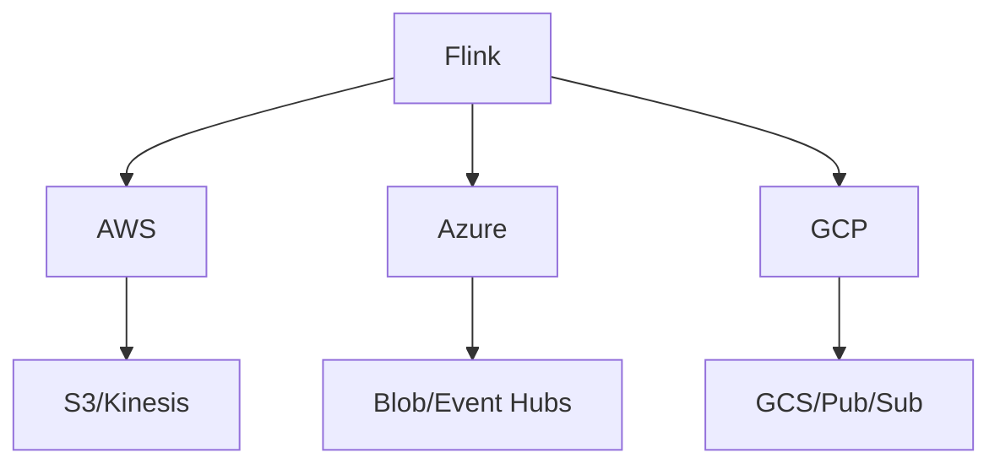
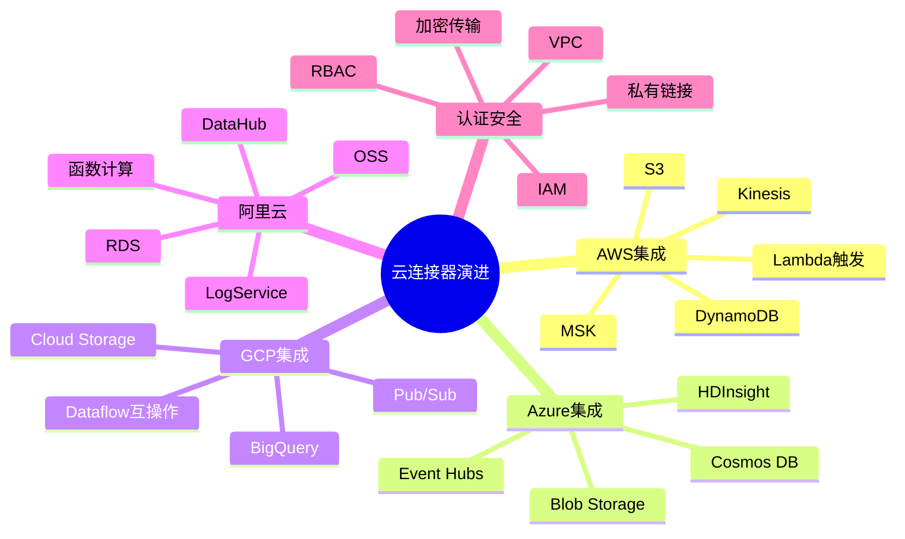
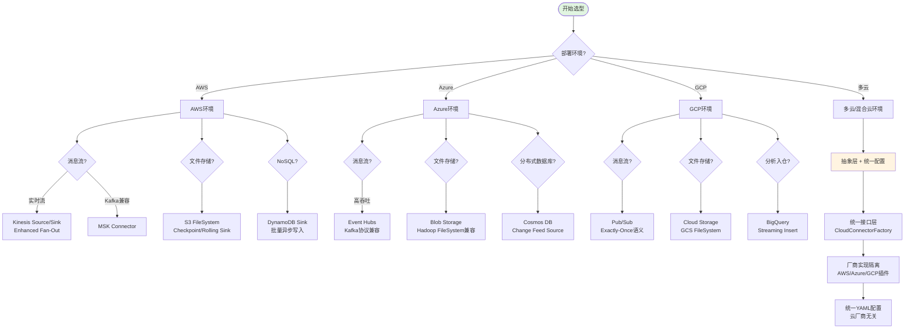

# 云厂商连接器演进 特性跟踪

> 所属阶段: Flink/connectors/evolution | 前置依赖: [Cloud Connectors][^1] | 形式化等级: L3

## 1. 概念定义 (Definitions)

### Def-F-Conn-Cloud-01: Cloud Storage

云存储：
$$
\text{CloudStorage} \in \{\text{S3}, \text{GCS}, \text{Azure Blob}\}
$$

### Def-F-Conn-Cloud-02: Cloud MQ

云消息队列：
$$
\text{CloudMQ} \in \{\text{Kinesis}, \text{Pub/Sub}, \text{Event Hubs}\}
$$

## 2. 属性推导 (Properties)

### Prop-F-Conn-Cloud-01: Native Integration

原生集成：
$$
\text{CloudConnector} \xrightarrow{\text{native SDK}} \text{CloudService}
$$

## 3. 关系建立 (Relations)

### 云连接器演进

| 版本 | 特性 | 状态 |
|------|------|------|
| 2.4 | S3改进 | GA |
| 2.4 | GCS增强 | GA |
| 2.5 | 更多云服务 | GA |
| 3.0 | 统一云API | 设计中 |

## 4. 论证过程 (Argumentation)

### 4.1 云服务支持

| 云服务 | AWS | Azure | GCP |
|--------|-----|-------|-----|
| 对象存储 | ✅ | ✅ | ✅ |
| 消息队列 | ✅ | ✅ | ✅ |
| 数据库 | ✅ | ✅ | ✅ |
| 数据仓库 | ✅ | ✅ | ✅ |

## 5. 形式证明 / 工程论证

### 5.1 S3 FileSystem

```java
// [伪代码片段 - 不可直接运行] 仅展示核心逻辑
env.getConfig().setDefaultFileSystemScheme("s3://");

FileSink<String> sink = FileSink
    .forRowFormat(new Path("s3://bucket/output"), new SimpleStringEncoder<>())
    .build();
```

## 6. 实例验证 (Examples)

### 6.1 AWS Kinesis

```java
// [伪代码片段 - 不可直接运行] 仅展示核心逻辑
FlinkKinesisConsumer<String> consumer = new FlinkKinesisConsumer<>(
    "stream-name",
    new SimpleStringSchema(),
    kinesisProps
);
consumer.setConsumerType(ConsumerType.ENHANCED_FAN_OUT);
```

## 7. 可视化 (Visualizations)



### 云连接器演进思维导图

以下思维导图以"云连接器演进"为中心，放射展开主要云厂商集成与安全维度：



### 多维关联树：云厂商→服务类型→连接器能力

以下关联树展示四大云厂商及阿里云的服务分类，以及 Flink 对应的连接器实现能力：

```mermaid
graph TB
    AWS[AWS] --> AWS_STORAGE[对象存储]
    AWS --> AWS_MQ[消息队列]
    AWS --> AWS_DB[数据库]
    AWS --> AWS_COMP[计算服务]
    AWS_STORAGE --> AWS_S3[S3 FileSystem<br/>Source + Sink]
    AWS_MQ --> AWS_KINESIS[Kinesis Connector<br/>EFO / Polling]
    AWS_MQ --> AWS_MSK[MSK Connector<br/>Kafka协议兼容]
    AWS_DB --> AWS_DYNAMO[DynamoDB Sink<br/>异步批量写入]
    AWS_COMP --> AWS_LAMBDA[Lambda触发<br/>流处理事件驱动]

    Azure[Azure] --> Azure_STORAGE[对象存储]
    Azure --> Azure_MQ[消息队列]
    Azure --> Azure_DB[数据库]
    Azure --> Azure_ANALYTICS[分析平台]
    Azure_STORAGE --> Azure_BLOB[Blob Storage<br/>Hadoop兼容]
    Azure_MQ --> Azure_EVENTHUBS[Event Hubs<br/>Kafka协议兼容]
    Azure_DB --> Azure_COSMOS[Cosmos DB Sink<br/>Change Feed]
    Azure_ANALYTICS --> Azure_HDINSIGHT[HDInsight<br/>托管Flink集群]

    GCP[GCP] --> GCP_STORAGE[对象存储]
    GCP --> GCP_MQ[消息队列]
    GCP --> GCP_DW[数据仓库]
    GCP --> GCP_STREAM[流处理]
    GCP_STORAGE --> GCP_GCS[Cloud Storage<br/>Hadoop兼容]
    GCP_MQ --> GCP_PUBSUB[Pub/Sub<br/>Exactly-Once]
    GCP_DW --> GCP_BIGQUERY[BigQuery Connector<br/>Streaming Insert]
    GCP_STREAM --> GCP_DATAFLOW[Dataflow互操作<br/>Beam Runner]

    ALI[阿里云] --> ALI_STORAGE[对象存储]
    ALI --> ALI_MQ[消息队列]
    ALI --> ALI_DB[数据库]
    ALI --> ALI_COMP[计算服务]
    ALI_STORAGE --> ALI_OSS[OSS FileSystem<br/>Hadoop兼容]
    ALI_MQ --> ALI_DATAHUB[DataHub Connector<br/>实时数据通道]
    ALI_MQ --> ALI_LOG[LogService<br/>日志实时采集]
    ALI_DB --> ALI_RDS[RDS Connector<br/>JDBC批量写入]
    ALI_COMP --> ALI_FC[函数计算<br/>事件触发]

    SECURITY[认证安全层] --> SEC_IAM[IAM角色]
    SECURITY --> SEC_RBAC[RBAC策略]
    SECURITY --> SEC_VPC[VPC网络隔离]
    SECURITY --> SEC_PLINK[私有链接]
    SECURITY --> SEC_ENC[加密传输<br/>TLS/SSL]
```



### 决策树：云连接器选型

以下决策树指导在不同云环境下的 Flink 连接器选型：



## 8. 引用参考 (References)

[^1]: Flink Cloud Connector Documentation

---

## 跟踪信息

| 属性 | 值 |
|------|-----|
| 版本 | 2.4-3.0 |
| 当前状态 | 演进中 |

---

*文档版本: v1.0 | 创建日期: 2026-04-19*
