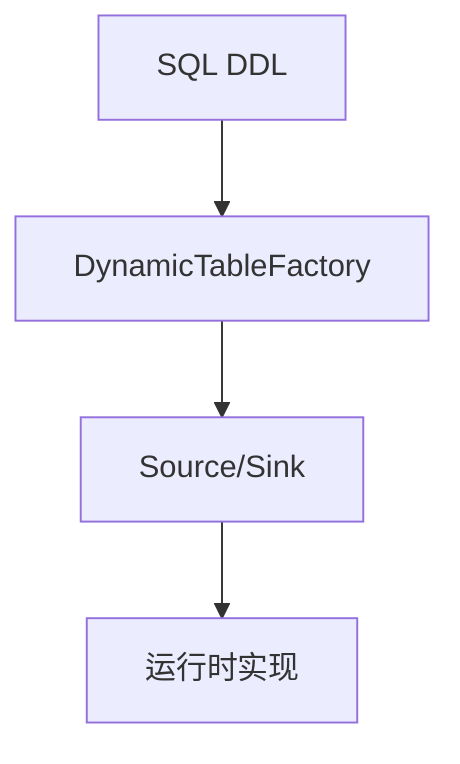

# 连接器框架 演进 特性跟踪

> 所属阶段: Flink/connectors/evolution | 前置依赖: [Connector Framework][^1] | 形式化等级: L3

## 1. 概念定义 (Definitions)

### Def-F-Conn-Frame-01: Unified Connector API

统一连接器API：
$$
\text{UnifiedAPI} = \text{SourceAPI} \cup \text{SinkAPI} \cup \text{TableAPI}
$$

### Def-F-Conn-Frame-02: Dynamic Table

动态表：
$$
\text{DynamicTable} = \text{Changelog} + \text{Schema}
$$

## 2. 属性推导 (Properties)

### Prop-F-Conn-Frame-01: API Consistency

API一致性：
$$
\forall \text{Connector} : \text{SameAPIInterface}
$$

## 3. 关系建立 (Relations)

### 框架演进

| 版本 | 特性 | 状态 |
|------|------|------|
| 2.3 | FLIP-27 | GA |
| 2.4 | FLIP-143 Sink | GA |
| 2.5 | 增强Factory | GA |
| 3.0 | 统一框架 | 设计中 |

## 4. 论证过程 (Argumentation)

### 4.1 框架层次

```
┌─────────────────────────────────────────┐
│           Table API (SQL DDL)           │
├─────────────────────────────────────────┤
│         DataStream API (Java)           │
├─────────────────────────────────────────┤
│    FLIP-27 Source / FLIP-143 Sink       │
├─────────────────────────────────────────┤
│           Connector Specific            │
└─────────────────────────────────────────┘
```

## 5. 形式证明 / 工程论证

### 5.1 DynamicTableFactory

```java
public class MyConnectorFactory implements DynamicTableSourceFactory {

    @Override
    public DynamicTableSource createDynamicTableSource(Context context) {
        final ReadableConfig config = context.getConfiguration();
        return new MyTableSource(config.get(HOST), config.get(PORT));
    }
}
```

## 6. 实例验证 (Examples)

### 6.1 Service Provider

```
# META-INF/services/org.apache.flink.table.factories.Factory
com.example.MyConnectorFactory
```

## 7. 可视化 (Visualizations)



## 8. 引用参考 (References)

[^1]: Flink Connector Framework Documentation

---

## 跟踪信息

| 属性 | 值 |
|------|-----|
| 版本 | 2.4-3.0 |
| 当前状态 | 演进中 |
