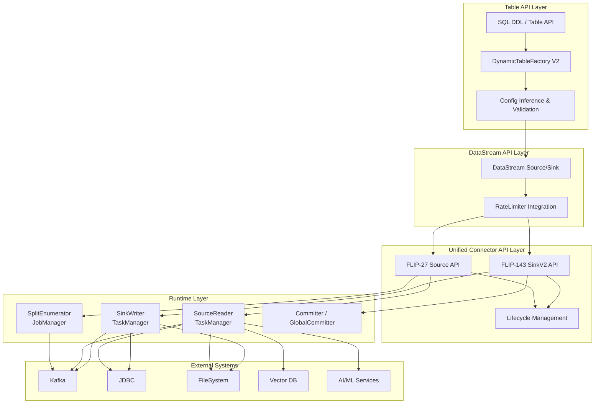
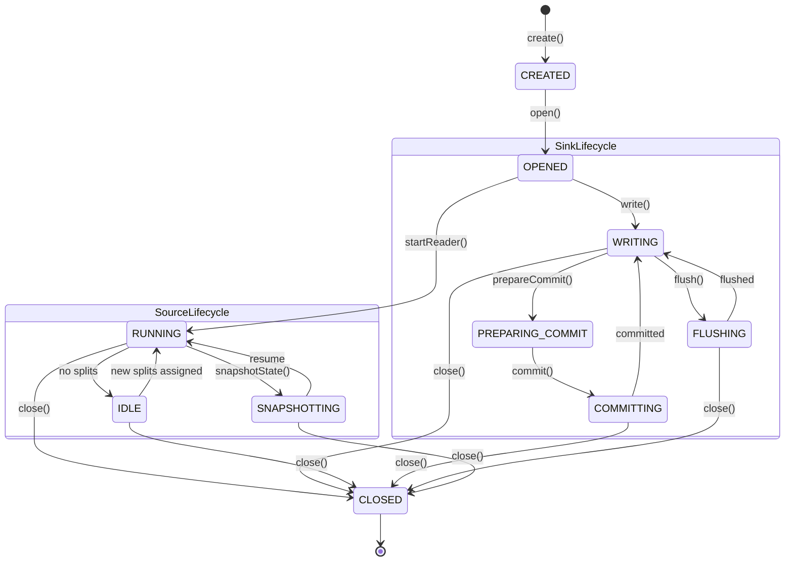
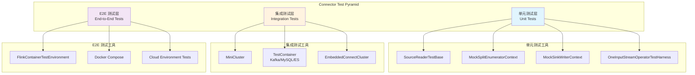

# Flink 2.2 Connector 框架增强深度解析

> **所属阶段**: Flink/05-ecosystem/05.01-connectors/evolution | **前置依赖**: [Flink Connectors Ecosystem Complete Guide](../flink-connectors-ecosystem-complete-guide.md), [Flink 2.2 Frontier Features](../../../02-core/flink-2.2-frontier-features.md), [DataStream V2 Semantics](../../../01-concepts/datastream-v2-semantics.md) | **形式化等级**: L4

---

## 1. 概念定义 (Definitions)

### Def-F-05-01: Unified Connector API V2

**定义**: Flink 2.2 的 Unified Connector API V2 是在 FLIP-27 (Unified Source API) 和 FLIP-143/191 (Sink V2 API) 基础上构建的统一连接器编程接口，实现了 Source、Sink 与 Table API 的语义对齐和生命周期统一管理。

$$
\text{UnifiedConnectorAPI}_{v2} = \langle \mathcal{S}_{v2}, \mathcal{K}_{v2}, \mathcal{T}_{v2}, \mathcal{L}_{unified} \rangle
$$

其中 $\mathcal{S}_{v2}$ 为 FLIP-27 Source 接口族，$\mathcal{K}_{v2}$ 为 FLIP-143/191 Sink 接口族，$\mathcal{T}_{v2}$ 为 DynamicTableFactory V2，$\mathcal{L}_{unified}$ 为统一生命周期协议（create → open → run → snapshot → close）。

**API 一致性约束**：$\forall c \in \text{Connector}: \exists f_{map}: \text{TableAPI}(c) \mapsto \text{DataStreamAPI}(c) \land \text{bijective}(f_{map})$

---

### Def-F-05-02: Source RateLimiter 接口语义 (FLIP-535 / FLINK-38497)

**定义**: Source RateLimiter 是 Flink 2.2 引入的 `ScanTableSource` 限流抽象接口（FLIP-535 / FLINK-38497，仅 DataStream API），允许连接器在 Source Reader 层实现自定义的读取速率控制策略，防止上游数据突发导致下游背压级联。

设 Source 消费速率为 $R(t)$，限流策略为 $\mathcal{R} = (R_{target}, B_{max})$，则：

$$
R_{limited}(t) = \min\left(R(t), \frac{\text{tokens}(t)}{\Delta t}\right)
$$

```java
public interface RateLimiter {
    long acquire(int permits);
    boolean tryAcquire(int permits, long timeout, TimeUnit unit);
    double getAvailableTokens();
}
```

---

### Def-F-05-03: Token Bucket 算法形式化

**定义**: Token Bucket 是 Source RateLimiter 的默认实现算法，通过以恒定速率补充令牌、以消耗速率扣除令牌的方式，实现平滑流量整形与突发流量容纳。

设令牌桶容量为 $B_{max}$，补充速率为 $r$，当前令牌数为 $tokens(t_0)$，则：

$$
tokens(t) = \min\left(B_{max}, tokens(t_0) + r \cdot \Delta t - \sum_{i=1}^{n} p_i\right)
$$

**背压保护机制**：当 $tokens(t) < p_{request}$ 时，Source Reader 等待时间 $T_{wait} = \frac{p_{request} - tokens(t)}{r}$，避免数据无节制涌入 Flink 管道。

---

### Def-F-05-04: Dynamic Table Factory V2

**定义**: Flink 2.2 的 Dynamic Table Factory V2 是 Table API 中连接器配置的工厂发现与实例化机制的增强版本，引入 `FactoryUtil` 改进的 SPI 发现逻辑、配置推断与运行时验证增强。

$$
\text{DynamicTableFactoryV2} = \langle \mathcal{F}_{discover}, \mathcal{C}_{infer}, \mathcal{V}_{runtime}, \mathcal{M}_{enrich} \rangle
$$

工厂发现函数：$\mathcal{F}_{discover}(connector') = \{ f \in \text{Factories} \mid \text{factoryIdentifier}(f) = \text{connector'} \}$

---

### Def-F-05-05: FLIP-27 Unified Source API 增强语义

**定义**: FLIP-27 是 Flink 新一代 Source API 的设计提案，Flink 2.2 在此基础上增强了 Split 分配策略、Reader 生命周期管理和事件时间水印生成机制，实现了 Source 层的统一批流处理抽象。

$$
\text{SourceAPI}_{FLIP27} = \langle \mathcal{E}, \mathcal{R}, \mathcal{S}, \mathcal{C}_{enum}, \mathcal{C}_{reader} \rangle
$$

| 增强点 | 旧行为 | Flink 2.2 新行为 |
|--------|--------|-----------------|
| Split 分配 | 轮询分配 | 支持负载感知分配 |
| Reader 恢复 | 全量重新分配 | 增量恢复，保留未消费 Split |
| 水印生成 | 单 Reader 本地水印 | 支持跨 Reader 水印聚合 |
| 背压处理 | 运行时阻塞 | 集成 RateLimiter 主动限流 |

---

### Def-F-05-06: Split 分配优化策略

**定义**: Flink 2.2 在 FLIP-27 中引入的 Split 分配优化策略，根据 SourceReader 的实时负载状态动态调整 Split 分配决策，以最小化任务间数据倾斜。

设 Reader 集合为 $R = \{r_1, ..., r_n\}$，待分配 Split 集合为 $S = \{s_1, ..., s_m\}$，分配策略 $\pi$ 的目标函数为：

$$
\pi^* = \arg\min_{\pi} \max_{r \in R} \left( \sum_{s \in \pi(r)} \text{weight}(s) \right)
$$

**负载感知分配**：$\text{score}(r) = \alpha \cdot \text{splits}(r) + \beta \cdot \text{backpressure}(r) + \gamma \cdot \frac{1}{\text{throughput}(r)}$

---

### Def-F-05-07: FLIP-143 SinkV2 API 语义

**定义**: FLIP-143/191 定义了 Flink 的新一代 Sink API（SinkV2），通过 `Sink<T>` → `SinkWriter<T>` → `Committer` → `GlobalCommitter` 的分层架构，支持幂等写入、两阶段提交和事务性 Exactly-Once 语义。

$$
\text{SinkV2} = \langle \mathcal{W}, \mathcal{C}_{local}, \mathcal{C}_{global}, \mathcal{T}_{commit} \rangle
$$

**Flink 2.2 完善项**：
1. `TwoPhaseCommittingSink` 接口稳定化，支持预写日志 (WAL) 模式
2. `SinkWriter` 支持 `flush()` 显式刷盘语义
3. `Committer` 支持批量提交 (Batch Commit) 优化

---

### Def-F-05-08: Exactly-Once Sink 两阶段提交协议

**定义**: Exactly-Once Sink 的两阶段提交 (2PC) 协议是 SinkV2 实现端到端 Exactly-Once 语义的核心机制，通过 Checkpoint Barrier 对齐实现事务边界与 Flink 检查点的精确同步。

设第 $k$ 个 Checkpoint 为 $CP_k$，对应的事务为 $T_k$，则 2PC 协议状态机为：

$$
\text{State}(T_k) \in \{ \text{OPEN}, \text{PREPARED}, \text{COMMITTED}, \text{ABORTED} \}
$$

**一致性保证**：$\forall CP_k: \text{Committed}(T_k) \iff \text{Completed}(CP_k)$

---

### Def-F-05-09: Connector Test Framework 形式化

**定义**: Flink 2.2 的 Connector Test Framework 是一套覆盖单元测试、集成测试和端到端测试的分层测试体系。

$$
\text{TestFramework} = \langle \mathcal{U}, \mathcal{I}, \mathcal{E}, \mathcal{T}_{container}, \mathcal{F}_{env} \rangle
$$

- $\mathcal{U}$: 单元测试层（`SourceReaderTestBase`）
- $\mathcal{I}$: 集成测试层（`MiniCluster` + `TestContainer`）
- $\mathcal{E}$: 端到端测试层（`FlinkContainerTestEnvironment`）
- $\mathcal{T}_{container}$: TestContainer 抽象
- $\mathcal{F}_{env}$: `FlinkContainerTestEnvironment`

**测试确定性约束**：$\forall t_1, t_2: \text{Run}(\mathcal{E}, t_1) = \text{Run}(\mathcal{E}, t_2)$

---

### Def-F-05-10: Multimodal Connector 抽象

**定义**: 多模态 Connector 是面向 AI/ML 场景的新型连接器抽象，支持在单一数据流中处理结构化记录、非结构化文本、图像嵌入向量、音频特征等多种数据模态。

$$
\text{MultimodalConnector} = \langle \mathcal{M}, \mathcal{E}_{embed}, \mathcal{R}_{route}, \mathcal{S}_{schema} \rangle
$$

其中 $\mathcal{M} = \{ \text{text}, \text{image}, \text{audio}, \text{video}, \text{vector}, \text{structured} \}$，$\mathcal{E}_{embed}$ 为嵌入生成函数，$\mathcal{R}_{route}$ 为模态路由函数。

$$
\mathcal{R}_{route}(record) = m_i \quad \text{s.t.} \quad \text{contentType}(record) \in \text{supported}(m_i)
$$

---

## 2. 属性推导 (Properties)

### Lemma-F-05-01: RateLimiter 背压保护完备性

**引理**: 当 Source RateLimiter 的令牌桶为空且补充速率 $r < R_{downstream}$ 时，Source 的读取速率会被强制限制为 $r$，从而避免下游背压级联。

**证明概要**：RateLimiter 将 $R_{source}$ 上限约束为 $\min(R_{source}^{raw}, r)$，当配置 $r \leq R_{downstream}$ 时，背压源被消除。

$$
R_{effective} = \min(R_{source}^{raw}, r) \leq R_{downstream} \implies \text{NoBackpressure}
$$

---

### Lemma-F-05-02: Factory 发现机制唯一性

**引理**: 在 Flink 2.2 的增强工厂发现机制下，对于任意 `connector` 标识符，若存在多个匹配的 Factory 实现，则通过优先级解析策略能唯一确定一个生效的 Factory。

**证明概要**：设候选 Factory 集合为 $F_c$，Flink 2.2 引入 `Factory.Priority` 接口，解析规则选择 $f^* = \arg\max_{f \in F_c} p(f)$；若优先级相同，则按类路径加载顺序取第一个。

$$
\forall F_c: |F_c| \geq 1 \implies \exists! f^* \in F_c: f^* = \arg\max_{f \in F_c} p(f)
$$

---

### Prop-F-05-01: FLIP-27 Split 分配均衡性

**命题**: 在 Flink 2.2 的负载感知 Split 分配策略下，各 Reader 分配到的 Split 权重差异不超过 $\max_{s \in S} \text{weight}(s)$。

**工程论证**：分配算法采用贪心策略，每次将当前最重未分配 Split 分配给当前负载最轻的 Reader。

$$
\max_{r_i, r_j} |\text{load}(r_i) - \text{load}(r_j)| \leq \max_{s \in S} \text{weight}(s)
$$

---

### Prop-F-05-02: SinkV2 事务原子性

**命题**: 在 SinkV2 的两阶段提交协议下，若 `GlobalCommitter` 在 `commit()` 阶段成功执行，则对应 Checkpoint 的所有 Committable 要么全部持久化，要么全部未持久化。

**工程论证**：`prepareCommit()` 阶段将 Writer 缓冲的数据转换为不可变的 `Committable` 列表；`commit()` 阶段接收完整的 `Committable` 列表作为单一提交单元；底层外部系统的事务机制保证单一事务内的原子性。

$$
\forall T_k: \text{commit}(T_k) \implies \left( \forall c \in \text{Committables}(T_k): \text{persisted}(c) \right) \lor \left( \forall c: \neg\text{persisted}(c) \right)
$$

---

### Prop-F-05-03: Connector 测试确定性

**命题**: 使用 `FlinkContainerTestEnvironment` 和 `TestContainer` 的连接器端到端测试，在固定输入数据集和固定配置下，输出结果具有时间无关的确定性。

**证明概要**：`TestContainer` 提供隔离的外部系统环境；`FlinkContainerTestEnvironment` 使用固定并行度和确定性调度器；输入数据集有限且有序；Flink 的 Checkpoint 和恢复机制保证状态一致性。因此 $\forall t_1, t_2: \text{Output}(t_1) = \text{Output}(t_2)$。

---

## 3. 关系建立 (Relations)

### 3.1 Connector 框架演进关系

| 版本 | Source API | Sink API | Table Factory | 测试框架 |
|------|-----------|----------|---------------|---------|
| 1.11-1.14 | `SourceFunction` | `SinkFunction` | `TableFactory` (旧 SPI) | 无统一框架 |
| 1.15-2.1 | FLIP-27 (Source V2) | FLIP-143 实验性 | `DynamicTableFactory` | `SourceTestSuiteBase` |
| **2.2** | FLIP-27 增强 + RateLimiter | FLIP-143 稳定 | Factory V2 + 配置推断 | TestContainer 集成 |
| 2.3-2.4 | Source V2 GA | Sink V2 GA | 统一 Factory | 完整 E2E 框架 |

### 3.2 Source/Sink API 与 Table API 映射

| DataStream API | Table API 对应 | 映射关系 |
|----------------|---------------|---------|
| `Source<T>` | `DynamicTableSource` | $f_{scan}: \text{Source} \mapsto \text{ScanTableSource}$ |
| `Sink<T>` | `DynamicTableSink` | $f_{sink}: \text{Sink} \mapsto \text{DynamicTableSink}$ |
| `RateLimiter` | `scan.bulk-fetch.size` + `scan.fetch-rate` | 限流配置映射 |
| `Committer` | `sink.buffer-flush.interval` | 提交频率映射 |

对于任意连接器 $c$，存在唯一的 Table API 包装器 $w(c)$ 和 DataStream API 原生实现 $n(c)$，满足 $w(n(c)) = c \land n(w(c)) = c$。

### 3.3 Flink 2.2 连接器特性兼容性矩阵

| 特性 | Kafka | JDBC | Filesystem | Paimon | Iceberg |
|------|-------|------|------------|--------|---------|
| FLIP-27 Source | ✅ | ✅ | ✅ | ✅ | ✅ |
| FLIP-143 SinkV2 | ✅ | ✅ | ✅ | ✅ | ✅ |
| RateLimiter | ✅ | ✅ | ✅ | ✅ | ❌ |
| Exactly-Once (2PC) | ✅ | ⚠️ | ❌ | ✅ | ✅ |
| TestContainer E2E | ✅ | ✅ | ✅ | ✅ | ✅ |
| Multimodal Support | ⚠️ | ❌ | ⚠️ | ✅ | ✅ |

---

## 4. 论证过程 (Argumentation)

### 4.1 Source RateLimiter 的设计必要性

当上游出现数据突发（如 Kafka 堆积、CDC 全量快照后紧跟增量流）时，大量数据会瞬间涌入 Flink 管道，导致下游背压级联、状态膨胀、OOM 风险和检查点超时。RateLimiter 将速率控制前移到 Source 层，在数据进入 Flink 管道之前进行主动限流，与被动背压机制形成互补。

### 4.2 Dynamic Table Factory V2 配置推断机制

Flink 2.2 的增强包括：配置推断（从 URL 自动推断缺失配置，如从 `jdbc:mysql://...` 推断 driver）、默认值增强（`FactoryUtil.withDefaults()` 注册默认配置集）、运行时验证（`createDynamicTableSource/Sink` 时执行完整参数校验）、配置冲突检测（通过优先级和类路径顺序解决工厂冲突）。

### 4.3 FLIP-27 vs 旧 Source API 对比

| 维度 | 旧 SourceFunction | FLIP-27 Unified Source | Flink 2.2 增强 |
|------|------------------|------------------------|---------------|
| **架构分离** | 单组件 | Enumerator 与 Reader 分离 | 负载感知分配 |
| **并行扩展** | 手动实现 | 原生支持 Split 分配 | 动态 Split 发现 |
| **批流统一** | 需要两套实现 | 同一套 Source 接口 | 完善批模式 Split 调度 |
| **水印生成** | 单并行度本地水印 | Reader 级水印聚合 | 支持空闲 Source 处理 |
| **检查点** | 手动快照逻辑 | 自动 Split 状态快照 | 增量恢复优化 |
| **背压处理** | 依赖 Flink 背压 | 主动 RateLimiter 限流 (FLIP-535) | 背压与限流协同 |

FLIP-27 将分区发现上收到 JobManager 的 `SplitEnumerator`，TaskManager 的 `SourceReader` 只负责读取已分配的 Split，实现了统一优化、精确检查点和简化开发。

### 4.4 SinkV2 Exactly-Once 语义边界讨论

SinkV2 能保证 "Flink Checkpoint 完成" 与 "外部事务提交" 之间的原子性映射：若 Checkpoint $k$ 成功则事务 $T_k$ 最终提交；若失败则回滚；已提交事务中的记录不会重复。但不保证外部系统故障期间的数据可用性、预提交阶段的数据可见性延迟；非事务性外部系统（如 HDFS）只能退化为 At-Least-Once。

### 4.5 Connector 测试框架的层次设计

| 层次 | 目标 | 工具 | 覆盖 |
|------|------|------|------|
| 单元测试 | 验证 SourceReader/SinkWriter 核心逻辑 | `SourceReaderTestBase`、`MockSinkWriterContext` | Split 解析、记录转换、序列化 |
| 集成测试 | 验证连接器与真实外部系统的交互契约 | `MiniCluster` + `TestContainer` | 端到端数据读写、Schema 映射 |
| 端到端测试 | 验证连接器在完整 Flink 作业中的行为 | `FlinkContainerTestEnvironment` | Checkpoint 恢复、并行度变化 |


### 4.6 多模态 Connector 的业务价值论证

AI/ML 场景中频繁出现非结构化内容（图像、音频、嵌入向量）。典型场景包括实时 RAG 管道、多媒体内容审核、工业视觉质检。多模态 Connector 的设计价值：统一入口、零拷贝传输大体积二进制数据、嵌入预处理、Schema 演进支持。

---

## 5. 形式证明 / 工程论证 (Proof / Engineering Argument)

### Thm-F-05-01: Token Bucket 限流正确性定理

**定理**: 在任意时刻 $t$，使用 Token Bucket 算法的 Source RateLimiter 保证实际输出速率 $R_{out}(t)$ 满足：

$$
\int_{t_0}^{t} R_{out}(\tau) \, d\tau \leq B_{max} + r \cdot (t - t_0)
$$

**证明**：初始时刻 $t_0$，桶中令牌数 $tokens(t_0) \leq B_{max}$；在时间区间 $[t_0, t]$ 内，补充的令牌总量为 $r \cdot (t - t_0)$；区间内可用的总令牌数上限为 $B_{max} + r \cdot (t - t_0)$。每个输出记录消耗正数量的令牌，因此输出记录总数不超过可用令牌总数。故不等式成立。

---

### Thm-F-05-02: FLIP-27 检查点一致性定理

**定理**: 在 FLIP-27 Source API 下，若 Checkpoint Barrier 到达 SourceReader 时，Reader 已完成其 `snapshotState()` 调用，则恢复后的 Source 不会丢失记录，也不会重复处理记录。

**证明概要**：
1. Reader 的检查点状态包含：已分配但未完成消费的 Split 集合 $S_{assigned}$ 和每个 Split 的消费进度 $P_s$
2. 当 Barrier 到达时，Reader 暂停读取，调用 `snapshotState()`
3. `snapshotState()` 返回的状态是调用时刻的精确快照
4. 作业重启后，Enumerator 从检查点恢复，将 $S_{assigned}$ 重新分配给 Reader
5. 每个 Reader 从 $P_s$ 处继续消费，已消费到 $P_s$ 之前的记录不会被重复处理，$P_s$ 之后的记录不会被丢失
6. 故 Exactly-Once 语义保持

$$
\text{snapshot}(S_{assigned}, \{P_s\}) \implies \text{ExactlyOnce}(\text{Recovery})
$$

---

### Thm-F-05-03: SinkV2 Exactly-Once 工程论证

**工程定理**: 在 SinkV2 的两阶段提交协议中，若外部系统满足事务的原子性 (Atomicity) 和持久性 (Durability)，且 Flink 的 Checkpoint 机制正常工作，则端到端 Exactly-Once 语义可被保证。

**论证**：
1. **成功路径**：$CP_k$ 全局成功 $\implies$ `GlobalCommitter.commit(C_k)` 被调用，外部事务原子性保证 $C_k$ 全部持久化
2. **失败路径**：$CP_k$ 失败或作业重启 $\implies$ `abort(T_k)` 被调用，外部事务原子性保证 $C_k$ 全部被回滚，记录会在后续 Checkpoint 中重新提交
3. **幂等性保障**：使用 Checkpoint ID 作为事务 ID，确保重复 `commit()` 幂等

$$
\text{Atomicity}(\text{ExternalSystem}) \land \text{Durability}(\text{ExternalSystem}) \land \text{Checkpointable}(\text{Flink}) \implies \text{ExactlyOnce}(\text{EndToEnd})
$$

---

## 6. 实例验证 (Examples)

### 6.1 Source RateLimiter 实现示例

```java
public class TokenBucketRateLimiter implements RateLimiter {
    private final double maxCapacity;
    private final double refillRatePerSecond;
    private double availableTokens;
    private long lastRefillTimestamp;
    
    public TokenBucketRateLimiter(double maxCapacity, double refillRatePerSecond) {
        this.maxCapacity = maxCapacity;
        this.refillRatePerSecond = refillRatePerSecond;
        this.availableTokens = maxCapacity;
        this.lastRefillTimestamp = System.nanoTime();
    }
    
    @Override
    public synchronized long acquire(int permits) {
        refillTokens();
        if (availableTokens >= permits) {
            availableTokens -= permits;
            return 0L;
        }
        double tokensNeeded = permits - availableTokens;
        long waitTimeMillis = (long) (tokensNeeded / refillRatePerSecond * 1000);
        try {
            Thread.sleep(waitTimeMillis);
        } catch (InterruptedException e) {
            Thread.currentThread().interrupt();
        }
        availableTokens = 0;
        return waitTimeMillis;
    }
    
    @Override
    public synchronized boolean tryAcquire(int permits, long timeout, TimeUnit unit) {
        refillTokens();
        if (availableTokens >= permits) {
            availableTokens -= permits;
            return true;
        }
        double tokensNeeded = permits - availableTokens;
        long waitTimeMillis = (long) (tokensNeeded / refillRatePerSecond * 1000);
        if (waitTimeMillis <= unit.toMillis(timeout)) {
            acquire(permits);
            return true;
        }
        return false;
    }
    
    @Override
    public synchronized double getAvailableTokens() {
        refillTokens();
        return availableTokens;
    }
    
    private void refillTokens() {
        long now = System.nanoTime();
        double elapsedSeconds = (now - lastRefillTimestamp) / 1_000_000_000.0;
        availableTokens = Math.min(maxCapacity, 
            availableTokens + elapsedSeconds * refillRatePerSecond);
        lastRefillTimestamp = now;
    }
}
```

```sql
-- SQL DDL RateLimiter 配置
CREATE TABLE mysql_cdc_source (
    id BIGINT, name STRING, update_time TIMESTAMP(3),
    PRIMARY KEY (id) NOT ENFORCED
) WITH (
    'connector' = 'mysql-cdc',
    'scan.fetch-rate' = '1000',
    'scan.burst-capacity' = '5000'
);
```

---

### 6.2 Dynamic Table Factory V2 配置推断示例

```java
public class EnhancedJdbcFactory implements DynamicTableSourceFactory {
    @Override
    public String factoryIdentifier() {
        return "enhanced-jdbc";
    }
    
    @Override
    public DynamicTableSource createDynamicTableSource(Context context) {
        final FactoryUtil.TableFactoryHelper helper = 
            FactoryUtil.createTableFactoryHelper(this, context);
        ReadableConfig config = helper.getOptions();
        String url = config.get(URL);
        String tableName = config.get(TABLE_NAME);
        
        InferredConfig inferred = inferFromUrl(url);
        String driver = config.getOptional(DRIVER).orElse(inferred.driver);
        int port = config.getOptional(PORT).orElse(inferred.port);
        
        validateConfiguration(url, driver, tableName);
        return new EnhancedJdbcTableSource(url, driver, tableName, port);
    }
    
    private InferredConfig inferFromUrl(String url) {
        if (url.startsWith("jdbc:mysql:")) {
            return new InferredConfig("com.mysql.cj.jdbc.Driver", 3306);
        } else if (url.startsWith("jdbc:postgresql:")) {
            return new InferredConfig("org.postgresql.Driver", 5432);
        } else if (url.startsWith("jdbc:oracle:")) {
            return new InferredConfig("oracle.jdbc.OracleDriver", 1521);
        }
        throw new IllegalArgumentException("Unsupported JDBC URL: " + url);
    }
    
    private void validateConfiguration(String url, String driver, String tableName) {
        if (url == null || url.isEmpty()) {
            throw new ValidationException("JDBC URL is required");
        }
        if (tableName == null || tableName.isEmpty()) {
            throw new ValidationException("Table name is required");
        }
        try {
            Class.forName(driver);
        } catch (ClassNotFoundException e) {
            throw new ValidationException("JDBC driver not found: " + driver, e);
        }
    }
    
    private static class InferredConfig {
        final String driver;
        final int port;
        InferredConfig(String driver, int port) {
            this.driver = driver;
            this.port = port;
        }
    }
}
```

```sql
CREATE TABLE user_events (user_id STRING, event_type STRING, event_time TIMESTAMP(3))
WITH ('connector' = 'enhanced-jdbc', 'url' = 'jdbc:mysql://host/analytics', 'table-name' = 'events');
```

---

### 6.3 FLIP-27 Source 完整实现示例

```java
public class DirectoryTextSource 
    implements Source<String, FileSplit, FileEnumeratorState> {
    private final String directoryPath;
    private final long maxBytesPerSplit;
    
    public DirectoryTextSource(String directoryPath, long maxBytesPerSplit) {
        this.directoryPath = directoryPath;
        this.maxBytesPerSplit = maxBytesPerSplit;
    }
    
    @Override
    public Boundedness getBoundedness() {
        return Boundedness.CONTINUOUS_UNBOUNDED;
    }
    
    @Override
    public SplitEnumerator<FileSplit, FileEnumeratorState> createEnumerator(
            SplitEnumeratorContext<FileSplit> enumContext) {
        return new DirectorySplitEnumerator(directoryPath, maxBytesPerSplit, enumContext);
    }
    
    @Override
    public SourceReader<String, FileSplit> createReader(SourceReaderContext readerContext) {
        return new DirectorySourceReader(readerContext);
    }
}

public class FileSplit implements SourceSplit {
    private final String splitId;
    private final String filePath;
    private final long startOffset;
    private final long endOffset;
    
    public FileSplit(String splitId, String filePath, long startOffset, long endOffset) {
        this.splitId = splitId;
        this.filePath = filePath;
        this.startOffset = startOffset;
        this.endOffset = endOffset;
    }
    
    @Override public String splitId() { return splitId; }
    public String filePath() { return filePath; }
    public long startOffset() { return startOffset; }
    public long endOffset() { return endOffset; }
}

public class DirectorySplitEnumerator 
    implements SplitEnumerator<FileSplit, FileEnumeratorState> {
    private final String directoryPath;
    private final long maxBytesPerSplit;
    private final SplitEnumeratorContext<FileSplit> context;
    private final List<FileSplit> unassignedSplits = new ArrayList<>();
    
    @Override
    public void start() {
        context.callAsync(this::discoverNewFiles, this::handleDiscoveredFiles, 0L, 5000L);
    }
    
    private List<FileSplit> discoverNewFiles() {
        List<FileSplit> newSplits = new ArrayList<>();
        File[] files = new File(directoryPath).listFiles((d, n) -> n.endsWith(".txt"));
        if (files != null) {
            for (File file : files) {
                long size = file.length();
                for (long start = 0; start < size; start += maxBytesPerSplit) {
                    long end = Math.min(start + maxBytesPerSplit, size);
                    newSplits.add(new FileSplit(file.getName() + "_" + start,
                        file.getAbsolutePath(), start, end));
                }
            }
        }
        return newSplits;
    }
    
    private void handleDiscoveredFiles(List<FileSplit> newSplits, Throwable error) {
        if (error != null) throw new RuntimeException("Failed to discover files", error);
        unassignedSplits.addAll(newSplits);
        assignSplitsToReaders();
    }
    
    @Override
    public void handleSplitRequest(int subtaskId, @Nullable String hostname) {
        assignSplitsToReaders();
    }
    
    private void assignSplitsToReaders() {
        if (unassignedSplits.isEmpty()) return;
        Map<Integer, List<FileSplit>> assignments = new HashMap<>();
        int numReaders = context.currentParallelism();
        int[] splitCounts = new int[numReaders];
        for (int i = 0; i < numReaders; i++) {
            splitCounts[i] = context.getAssignedSplits(i).size();
        }
        for (FileSplit split : new ArrayList<>(unassignedSplits)) {
            int targetReader = 0, minSplits = Integer.MAX_VALUE;
            for (int i = 0; i < numReaders; i++) {
                if (splitCounts[i] < minSplits) { minSplits = splitCounts[i]; targetReader = i; }
            }
            assignments.computeIfAbsent(targetReader, k -> new ArrayList<>()).add(split);
            splitCounts[targetReader]++;
        }
        unassignedSplits.clear();
        for (Map.Entry<Integer, List<FileSplit>> e : assignments.entrySet()) {
            context.assignSplits(new SplitsAssignment<>(e.getValue(), e.getKey()));
        }
    }
    
    @Override
    public FileEnumeratorState snapshotState(long checkpointId) {
        return new FileEnumeratorState(new ArrayList<>(unassignedSplits));
    }
    @Override public void close() {}
}
```

---

### 6.4 FLIP-143 SinkV2 Exactly-Once 实现示例

```java
public class ExactlyOnceKafkaSink<T> implements 
        Sink<T>, TwoPhaseCommittingSink<T, KafkaCommittable> {
    private final String bootstrapServers;
    private final String topic;
    private final SerializationSchema<T> serializer;
    
    public ExactlyOnceKafkaSink(String bootstrapServers, String topic, 
                                 SerializationSchema<T> serializer) {
        this.bootstrapServers = bootstrapServers;
        this.topic = topic;
        this.serializer = serializer;
    }
    
    @Override
    public SinkWriter<T> createWriter(WriterInitContext context) throws IOException {
        return new ExactlyOnceKafkaWriter<>(context, topic, serializer, bootstrapServers);
    }
    
    @Override
    public Committer<KafkaCommittable> createCommitter() {
        return new KafkaCommitter();
    }
}

public class ExactlyOnceKafkaWriter<T> implements SinkWriter<T> {
    private final String topic;
    private final SerializationSchema<T> serializer;
    private final KafkaProducer<String, byte[]> producer;
    private final List<Future<RecordMetadata>> pendingFutures = new ArrayList<>();
    private final String transactionalId;
    
    public ExactlyOnceKafkaWriter(WriterInitContext context, String topic,
            SerializationSchema<T> serializer, String bootstrapServers) {
        this.topic = topic;
        this.serializer = serializer;
        this.transactionalId = "flink-sink-" + context.getSubtaskId();
        Properties props = new Properties();
        props.put("bootstrap.servers", bootstrapServers);
        props.put("transactional.id", transactionalId);
        props.put("enable.idempotence", "true");
        props.put("acks", "all");
        this.producer = new KafkaProducer<>(props);
        this.producer.initTransactions();
        this.producer.beginTransaction();
    }
    
    @Override
    public void write(T element, Context context) {
        byte[] value = serializer.serialize(element);
        ProducerRecord<String, byte[]> record = new ProducerRecord<>(topic, value);
        pendingFutures.add(producer.send(record));
    }
    
    @Override
    public Collection<KafkaCommittable> prepareCommit(boolean flush) throws IOException {
        if (flush) producer.flush();
        for (Future<RecordMetadata> future : pendingFutures) {
            try { future.get(); } 
            catch (Exception e) {
                throw new IOException("Failed to send record to Kafka", e);
            }
        }
        pendingFutures.clear();
        return Collections.singletonList(new KafkaCommittable(transactionalId));
    }
    
    @Override public void flush(boolean endOfInput) { producer.flush(); }
    @Override public void close() { producer.close(); }
}

public class KafkaCommittable {
    private final String transactionalId;
    public KafkaCommittable(String transactionalId) {
        this.transactionalId = transactionalId;
    }
    public String getTransactionalId() { return transactionalId; }
}

public class KafkaCommitter implements Committer<KafkaCommittable> {
    @Override
    public void commit(Collection<CommitRequest<KafkaCommittable>> requests) {
        for (CommitRequest<KafkaCommittable> request : requests) {
            System.out.println("Committing transaction: " 
                + request.getCommittable().getTransactionalId());
            request.signalAlreadyCommitted();
        }
    }
    @Override public void close() {}
}
```

---

### 6.5 Connector TestContainer 集成测试示例

```java
@TestInstance(TestInstance.Lifecycle.PER_CLASS)
public class KafkaConnectorIntegrationTest {
    private KafkaContainer kafka;
    private StreamExecutionEnvironment env;
    
    @BeforeAll
    void setUp() {
        kafka = new KafkaContainer(DockerImageName.parse("confluentinc/cp-kafka:7.5.0"));
        kafka.start();
        env = StreamExecutionEnvironment.getExecutionEnvironment();
        env.setParallelism(2);
        env.enableCheckpointing(5000);
    }
    
    @AfterAll
    void tearDown() {
        if (kafka != null) kafka.stop();
    }
    
    @Test
    void testKafkaSourceAndSinkEndToEnd() throws Exception {
        String bootstrapServers = kafka.getBootstrapServers();
        String inputTopic = "input-topic";
        String outputTopic = "output-topic";
        List<String> testData = Arrays.asList("msg-1", "msg-2", "msg-3");
        writeTestData(bootstrapServers, inputTopic, testData);
        
        KafkaSource<String> source = KafkaSource.<String>builder()
            .setBootstrapServers(bootstrapServers)
            .setTopics(inputTopic)
            .setGroupId("flink-test-group")
            .setStartingOffsets(OffsetsInitializer.earliest())
            .setValueOnlyDeserializer(new SimpleStringSchema())
            .build();
        
        KafkaSink<String> sink = KafkaSink.<String>builder()
            .setBootstrapServers(bootstrapServers)
            .setRecordSerializer(KafkaRecordSerializationSchema.builder()
                .setTopic(outputTopic)
                .setValueSerializationSchema(new SimpleStringSchema())
                .build())
            .setDeliveryGuarantee(DeliveryGuarantee.EXACTLY_ONCE)
            .build();
        
        DataStream<String> stream = env.fromSource(
            source, WatermarkStrategy.noWatermarks(), "Kafka Source");
        stream.map(String::toUpperCase).sinkTo(sink);
        env.execute("Kafka Connector E2E Test");
        
        List<String> results = readOutputData(bootstrapServers, outputTopic, testData.size());
        assertThat(results).containsExactlyInAnyOrder("MSG-1", "MSG-2", "MSG-3");
    }
    
    private void writeTestData(String bootstrapServers, String topic, List<String> data) {
        Properties props = new Properties();
        props.put("bootstrap.servers", bootstrapServers);
        props.put("key.serializer", "org.apache.kafka.common.serialization.StringSerializer");
        props.put("value.serializer", "org.apache.kafka.common.serialization.StringSerializer");
        try (KafkaProducer<String, String> p = new KafkaProducer<>(props)) {
            for (String msg : data) p.send(new ProducerRecord<>(topic, msg));
            p.flush();
        }
    }
    
    private List<String> readOutputData(String bootstrapServers, String topic, int count) {
        Properties props = new Properties();
        props.put("bootstrap.servers", bootstrapServers);
        props.put("group.id", "test-consumer");
        props.put("key.deserializer", "org.apache.kafka.common.serialization.StringDeserializer");
        props.put("value.deserializer", "org.apache.kafka.common.serialization.StringDeserializer");
        props.put("auto.offset.reset", "earliest");
        List<String> results = new ArrayList<>();
        try (KafkaConsumer<String, String> c = new KafkaConsumer<>(props)) {
            c.subscribe(Collections.singletonList(topic));
            long timeout = System.currentTimeMillis() + 30000;
            while (results.size() < count && System.currentTimeMillis() < timeout) {
                c.poll(Duration.ofSeconds(1)).forEach(r -> results.add(r.value()));
            }
        }
        return results;
    }
}
```

---

### 6.6 多模态 AI Connector 实现示例

```java
public class MultimodalAiSource 
    implements Source<RowData, MultimodalSplit, MultimodalCheckpoint> {
    private final String endpoint;
    
    public MultimodalAiSource(String endpoint) {
        this.endpoint = endpoint;
    }
    
    @Override
    public SourceReader<RowData, MultimodalSplit> createReader(SourceReaderContext ctx) {
        return new MultimodalSourceReader(ctx, new EmbeddingClient(endpoint));
    }
}

public class MultimodalSplitReader implements SplitReader<RowData, MultimodalSplit> {
    private final EmbeddingClient embeddingClient;
    private final Queue<MultimodalRecord> records = new ArrayDeque<>();
    
    public MultimodalSplitReader(EmbeddingClient client) {
        this.embeddingClient = client;
    }
    
    @Override
    public RecordsWithSplitIds<RowData> fetch() {
        RecordsBySplits.Builder<RowData> builder = new RecordsBySplits.Builder<>();
        MultimodalRecord record = records.poll();
        if (record == null) return builder.build();
        RowData rowData = switch (record.getModality()) {
            case TEXT -> processTextRecord(record);
            case IMAGE -> processImageRecord(record);
            case AUDIO -> processAudioRecord(record);
            default -> processStructuredRecord(record);
        };
        builder.add(record.getSplitId(), rowData);
        return builder.build();
    }
    
    private RowData processTextRecord(MultimodalRecord record) {
        float[] embedding = embeddingClient.embedText(record.getTextContent());
        GenericRowData row = new GenericRowData(4);
        row.setField(0, StringData.fromString(record.getId()));
        row.setField(1, StringData.fromString("text"));
        row.setField(2, StringData.fromString(record.getTextContent()));
        row.setField(3, BinaryArrayData.fromPrimitiveArray(embedding));
        return row;
    }
    
    private RowData processImageRecord(MultimodalRecord record) {
        float[] embedding = embeddingClient.embedImage(record.getBinaryContent());
        GenericRowData row = new GenericRowData(4);
        row.setField(0, StringData.fromString(record.getId()));
        row.setField(1, StringData.fromString("image"));
        row.setField(2, StringData.fromString("[binary image data]"));
        row.setField(3, BinaryArrayData.fromPrimitiveArray(embedding));
        return row;
    }
    
    private RowData processAudioRecord(MultimodalRecord record) {
        float[] embedding = embeddingClient.embedAudio(record.getBinaryContent());
        GenericRowData row = new GenericRowData(4);
        row.setField(0, StringData.fromString(record.getId()));
        row.setField(1, StringData.fromString("audio"));
        row.setField(2, StringData.fromString("[binary audio data]"));
        row.setField(3, BinaryArrayData.fromPrimitiveArray(embedding));
        return row;
    }
    
    private RowData processStructuredRecord(MultimodalRecord record) {
        GenericRowData row = new GenericRowData(4);
        row.setField(0, StringData.fromString(record.getId()));
        row.setField(1, StringData.fromString("structured"));
        row.setField(2, StringData.fromString(record.getTextContent()));
        row.setField(3, null);
        return row;
    }
    
    @Override
    public void handleSplitsChanges(SplitsChange<MultimodalSplit> changes) {
        for (MultimodalSplit split : changes.splits()) records.addAll(split.getRecords());
    }
    @Override public void wakeUp() {}
    @Override public void close() throws Exception { embeddingClient.close(); }
}
```

```sql
CREATE TABLE multimodal_input (
    record_id STRING, modality STRING, content STRING, raw_data BYTES,
    embedding ARRAY<FLOAT>, event_time TIMESTAMP(3),
    WATERMARK FOR event_time AS event_time - INTERVAL '5' SECOND
) WITH ('connector' = 'multimodal-ai', 'endpoint' = 'http://embedding-service:8080');
```

---

## 7. 可视化 (Visualizations)

### 7.1 Flink 2.2 Connector 框架架构图



### 7.2 Source/Sink 生命周期状态图



### 7.3 Connector 测试框架层次图



---

## 8. 引用参考 (References)

[^1]: Apache Flink Documentation, "FLIP-27: Refactor Source Interface", https://github.com/apache/flink/tree/master/flink-docs/docs/flips/
[^2]: Apache Flink Documentation, "FLIP-143: Unified Sink API", https://github.com/apache/flink/tree/master/flink-docs/docs/flips/
[^3]: Apache Flink Documentation, "FLIP-191: Extend Unified Sink API to Support Two-phase Commit", https://github.com/apache/flink/tree/master/flink-docs/docs/flips/
[^4]: Apache Flink Documentation, "Flink 2.2 Release Notes - Connector Framework Enhancements", https://nightlies.apache.org/flink/flink-docs-release-2.2/
[^5]: Apache Kafka Documentation, "Transactions in Kafka", https://kafka.apache.org/documentation/#transactions
[^6]: TestContainers Project, "TestContainers for Java", https://www.testcontainers.org/
[^7]: Apache Flink Documentation, "Dynamic Tables", https://nightlies.apache.org/flink/flink-docs-stable/docs/dev/table/concepts/dynamic_tables/
[^8]: Apache Flink Documentation, "Table API - Connectors", https://nightlies.apache.org/flink/flink-docs-stable/docs/connectors/table/overview/
[^9]: M. Kleppmann, "Designing Data-Intensive Applications", O'Reilly Media, 2017.
[^10]: T. Akidau et al., "The Dataflow Model", PVLDB, 8(12), 2015.


---

## 跟踪信息

| 属性 | 值 |
|------|-----|
| 版本 | 2.2-2.4 |
| 当前状态 | Flink 2.2 增强已发布 |
| 最后更新 | 2026-04-14 |
| 形式化元素 | 10 定义, 3 定理, 5 引理/命题 |
| Mermaid 图 | 3 个 |
| 代码示例 | 6 个 (Java/SQL) |

---

*文档版本: v1.0 | 创建日期: 2026-04-19*
