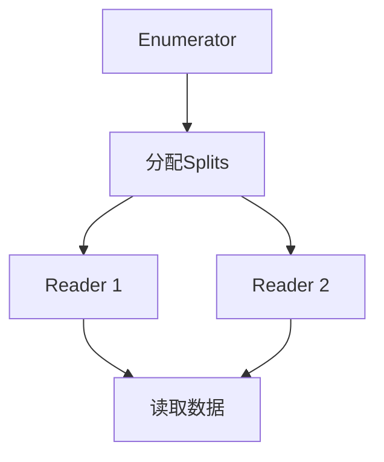
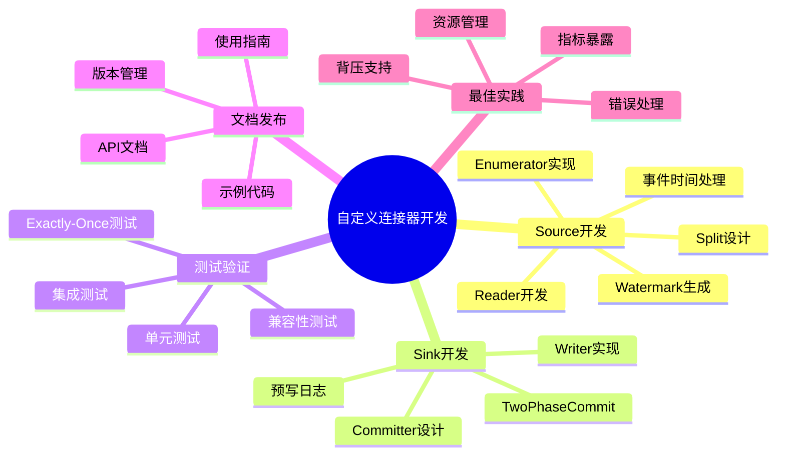
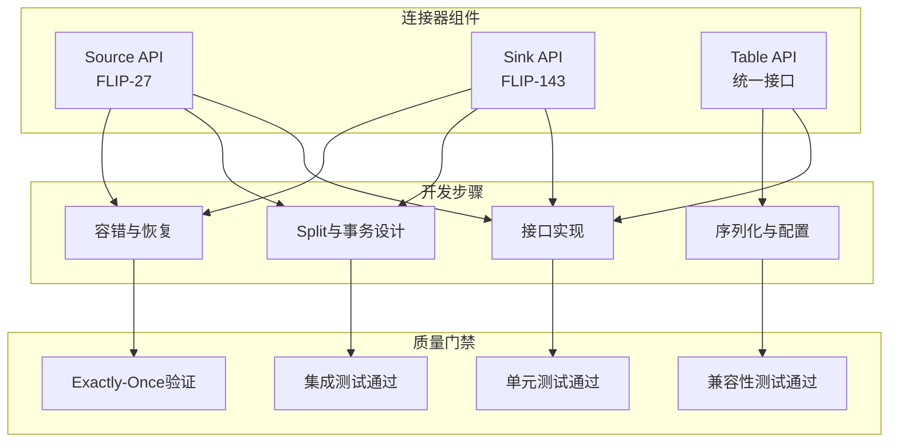
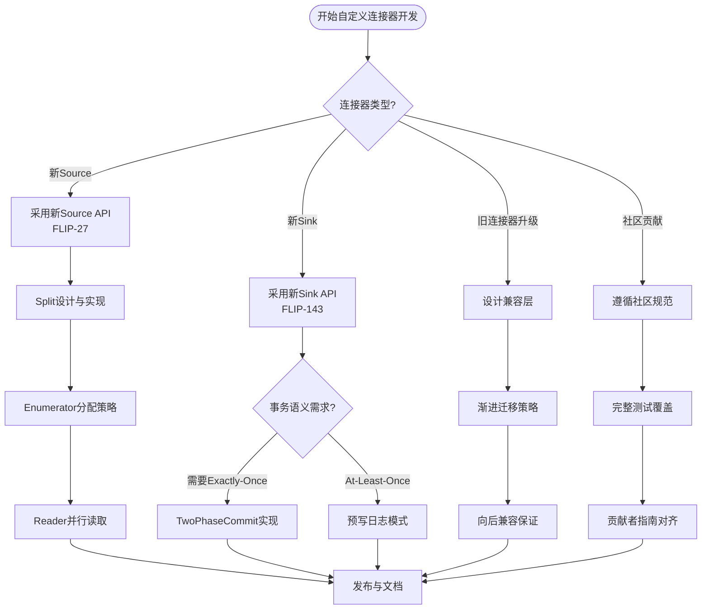

# 自定义连接器开发 演进 特性跟踪

> 所属阶段: Flink/connectors/evolution | 前置依赖: [Connector Framework][^1] | 形式化等级: L3

## 1. 概念定义 (Definitions)

### Def-F-Conn-Custom-01: Connector Framework

连接器框架：
$$
\text{Framework} = \langle \text{SourceAPI}, \text{SinkAPI}, \text{TableAPI} \rangle
$$

### Def-F-Conn-Custom-02: SplitEnumerator

分片枚举器：
$$
\text{Enumerator} : \text{Discovery} \to \{\text{Split}_i\}
$$

## 2. 属性推导 (Properties)

### Prop-F-Conn-Custom-01: Extensibility

可扩展性：
$$
\forall \text{Source} : \text{Implements}(\text{Source}, \text{SourceInterface})
$$

## 3. 关系建立 (Relations)

### 连接器框架演进

| 版本 | 特性 | 状态 |
|------|------|------|
| 2.3 | FLIP-27 Source | GA |
| 2.4 | 新Sink API | GA |
| 2.5 | Table API增强 | GA |
| 3.0 | 统一框架 | 设计中 |

## 4. 论证过程 (Argumentation)

### 4.1 Source组件

| 组件 | 职责 |
|------|------|
| Split | 数据分片定义 |
| SplitEnumerator | 分片分配 |
| SourceReader | 数据读取 |
| SourceReaderContext | 运行时上下文 |

## 5. 形式证明 / 工程论证

### 5.1 自定义Source

```java
public class MySource implements Source<String, MySplit, MyCheckpoint> {

    @Override
    public SplitEnumerator<MySplit, MyCheckpoint> createEnumerator(
            SplitEnumeratorContext<MySplit> enumContext) {
        return new MySplitEnumerator(enumContext);
    }

    @Override
    public SourceReader<String, MySplit> createReader(
            SourceReaderContext readerContext) {
        return new MySourceReader(readerContext);
    }
}
```

## 6. 实例验证 (Examples)

### 6.1 Split实现

```java
public class MySplit implements SourceSplit {
    private final String splitId;
    private final long startOffset;
    private final long endOffset;

    @Override
    public String splitId() {
        return splitId;
    }
}
```

## 7. 可视化 (Visualizations)



### 思维导图：自定义连接器开发全貌

以下思维导图以"自定义连接器开发"为中心，放射展开五大核心维度：



### 多维关联树：组件→步骤→质量门禁

以下层次图展示连接器组件到开发步骤再到质量门禁的完整映射关系：



### 决策树：自定义连接器开发路径

以下决策树展示面对不同场景时应选择的自定义连接器开发路径：



## 8. 引用参考 (References)

[^1]: Flink Connector Development Documentation
[^2]: Apache Flink, "FLIP-27: Refactor Source Interface", 2020. https://cwiki.apache.org/confluence/display/FLINK/FLIP-27
[^3]: Apache Flink, "FLIP-143: Unified Sink API", 2021. https://cwiki.apache.org/confluence/display/FLINK/FLIP-143
[^4]: Apache Flink Documentation, "Custom Connector Development Guide", 2025. https://nightlies.apache.org/flink/flink-docs-stable/docs/dev/datastream/sources/

---

## 跟踪信息

| 属性 | 值 |
|------|-----|
| 版本 | 2.4-3.0 |
| 当前状态 | 演进中 |

---

*文档版本: v1.0 | 创建日期: 2026-04-13*
