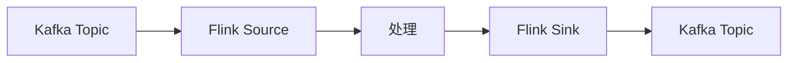
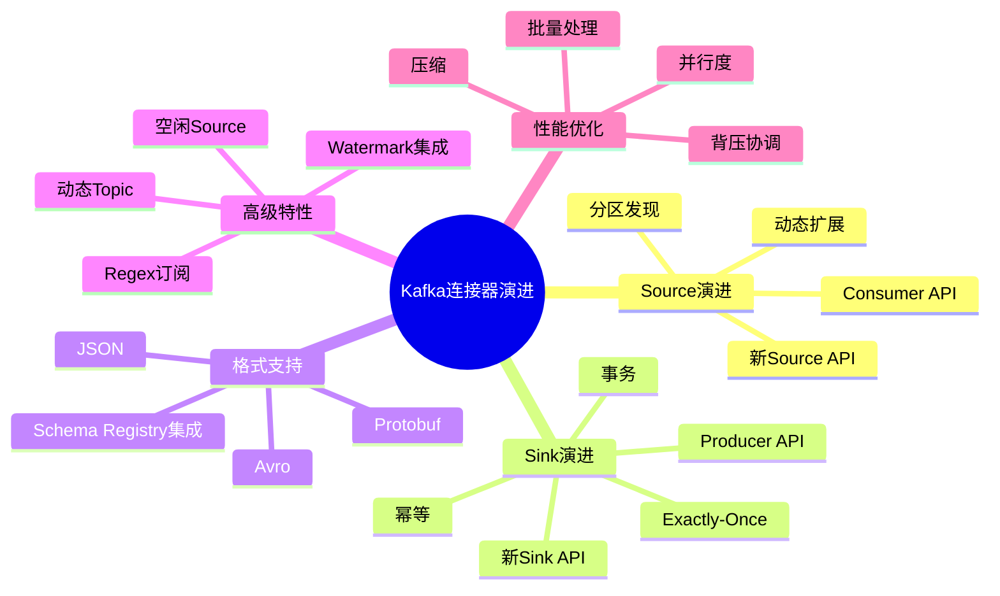
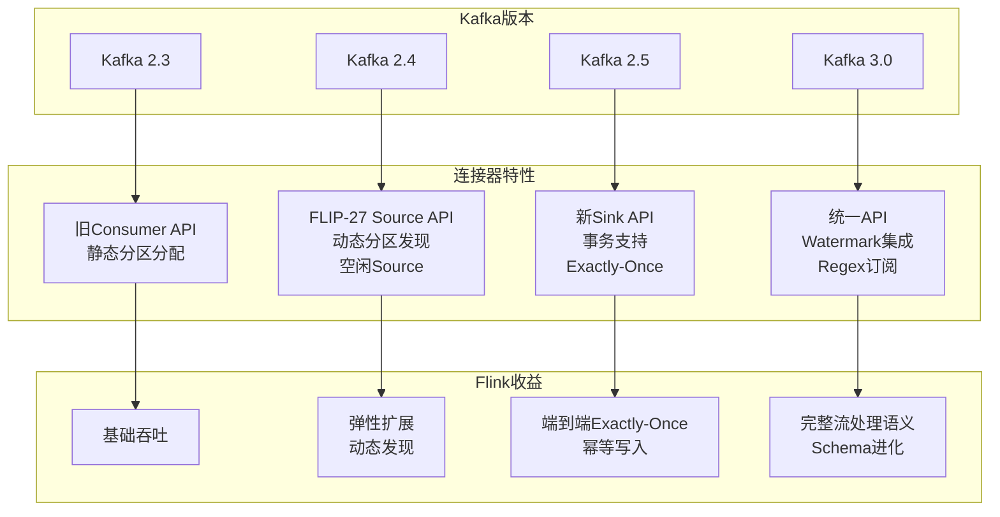
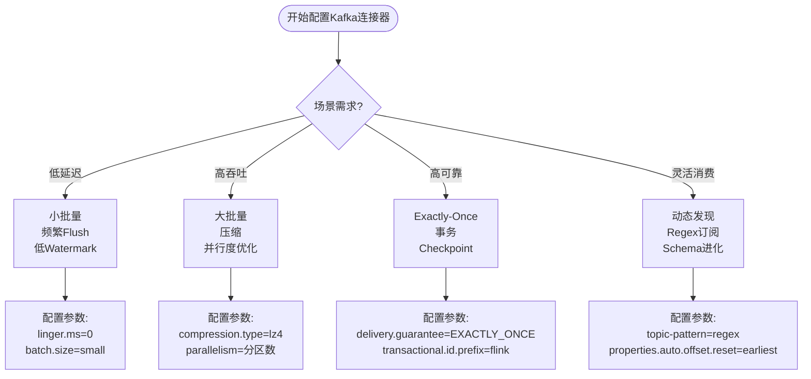
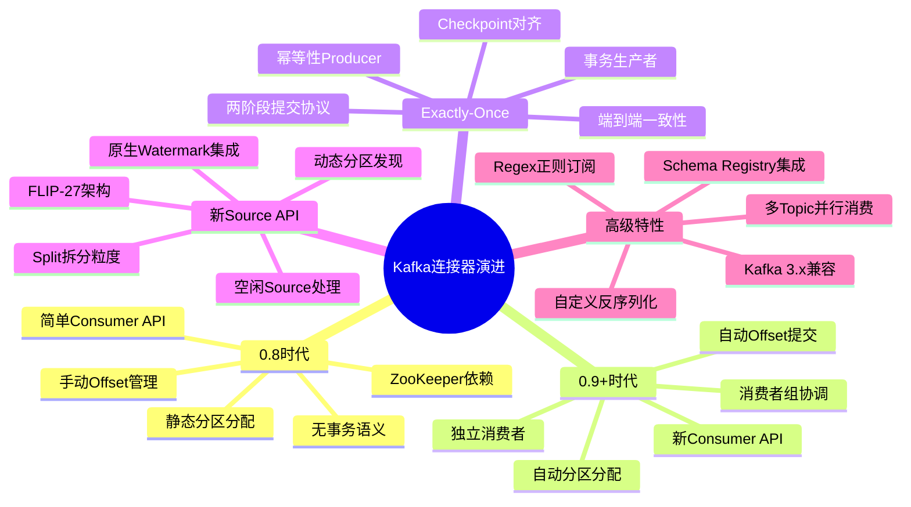
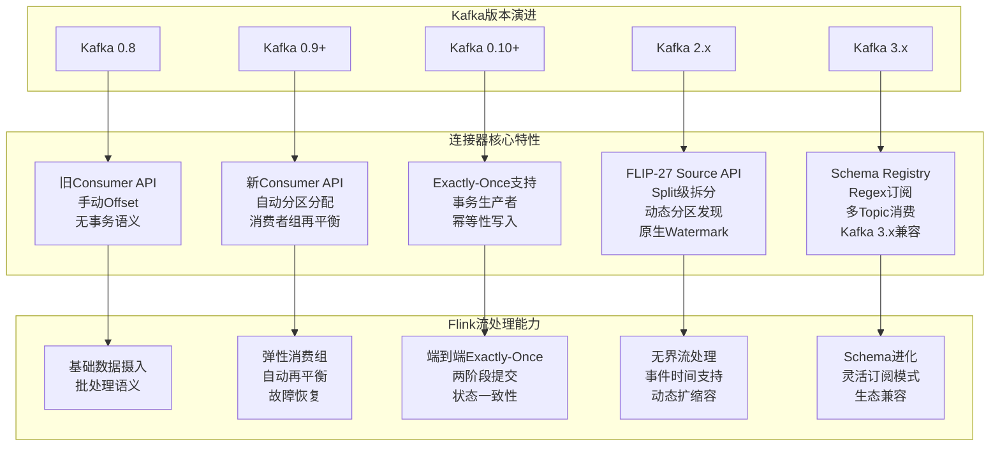
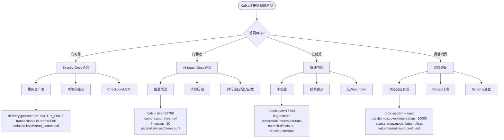

# Kafka连接器演进 特性跟踪

> 所属阶段: Flink/connectors/evolution | 前置依赖: [Kafka Connector][^1] | 形式化等级: L3

## 1. 概念定义 (Definitions)

### Def-F-Conn-Kafka-01: Source Connector

Kafka Source：
$$
\text{KafkaSource} : \text{Topic} \times \text{Partition} \to \text{Stream}
$$

### Def-F-Conn-Kafka-02: Sink Connector

Kafka Sink：
$$
\text{KafkaSink} : \text{Stream} \to \text{Topic}
$$

## 2. 属性推导 (Properties)

### Prop-F-Conn-Kafka-01: Exactly-Once

Exactly-Once语义：
$$
\text{KafkaSink} + \text{Transactions} \implies \text{Exactly-Once}
$$

## 3. 关系建立 (Relations)

### Kafka连接器演进

| 版本 | 特性 | 状态 |
|------|------|------|
| 2.3 | 旧API | 废弃 |
| 2.4 | FLIP-27 Source | GA |
| 2.5 | 增强Sink | GA |
| 3.0 | 统一API | 设计中 |

## 4. 论证过程 (Argumentation)

### 4.1 Source vs Sink

| 特性 | Source | Sink |
|------|--------|------|
| 分区发现 | 动态 | 静态 |
| 偏移提交 | 自动 | - |
| 事务 | - | 支持 |

## 5. 形式证明 / 工程论证

### 5.1 Kafka Source

```java
// [伪代码片段 - 不可直接运行] 仅展示核心逻辑
KafkaSource<String> source = KafkaSource.<String>builder()
    .setBootstrapServers("kafka:9092")
    .setTopics("input-topic")
    .setGroupId("flink-group")
    .setStartingOffsets(OffsetsInitializer.earliest())
    .setValueOnlyDeserializer(new SimpleStringSchema())
    .build();
```

## 6. 实例验证 (Examples)

### 6.1 Exactly-Once Sink

```java
// [伪代码片段 - 不可直接运行] 仅展示核心逻辑
KafkaSink<String> sink = KafkaSink.<String>builder()
    .setBootstrapServers("kafka:9092")
    .setRecordSerializer(KafkaRecordSerializationSchema.builder()
        .setTopic("output-topic")
        .setValueSerializationSchema(new SimpleStringSchema())
        .build())
    .setDeliveryGuarantee(DeliveryGuarantee.EXACTLY_ONCE)
    .build();
```

## 7. 可视化 (Visualizations)



### 7.1 思维导图：Kafka连接器演进全景

以下思维导图以"Kafka连接器演进"为中心，系统展示Source演进、Sink演进、格式支持、高级特性与性能优化五大维度。



### 7.2 多维关联树：Kafka版本→连接器特性→Flink收益

以下层次图展示Kafka版本演进如何映射到连接器特性，并转化为Flink应用的工程收益。



### 7.3 决策树：Kafka连接器配置选型

以下决策树针对四类典型场景给出配置策略与关键参数建议。



### 7.4 思维导图：Kafka连接器演进全景（细化版）

以下思维导图以"Kafka连接器演进"为中心，从五个历史阶段与技术维度放射展开，系统展示从早期简单Consumer到现代高级特性的完整演进脉络。



### 7.5 多维关联树：Kafka版本→连接器特性→Flink能力映射

以下层次图展示Kafka版本演进如何映射到连接器核心特性，并进一步转化为Flink流处理的关键能力。



### 7.6 决策树：Kafka连接器配置选型

以下决策树针对四类典型场景，从语义保障到关键参数给出完整的配置策略。



## 8. 引用参考 (References)

[^1]: Flink Kafka Connector Documentation

---

## 跟踪信息

| 属性 | 值 |
|------|-----|
| 版本 | 2.4-3.0 |
| 当前状态 | 演进中 |

---

*文档版本: v1.0 | 创建日期: 2026-04-19*
