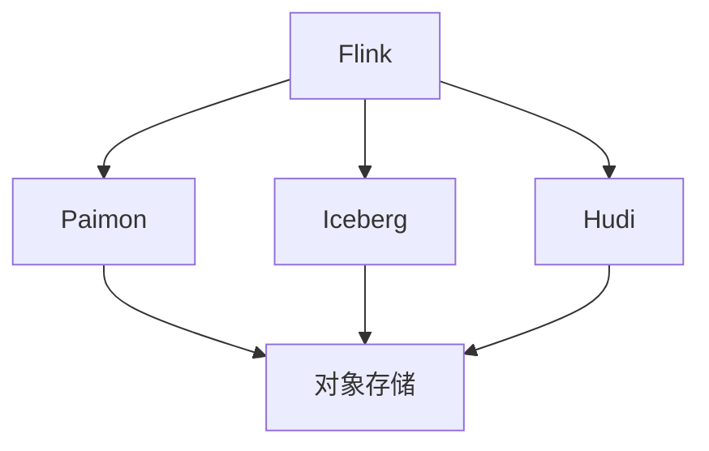

> **状态**: 🔮 前瞻内容 | **风险等级**: 高 | **最后更新**: 2026-04
>
> 此文档描述的内容处于早期规划阶段，可能与最终实现不符。请以 Apache Flink 官方发布为准。
>
# Lakehouse连接器演进 特性跟踪

> 所属阶段: Flink/connectors/evolution | 前置依赖: [Lakehouse Connectors][^1] | 形式化等级: L3

## 1. 概念定义 (Definitions)

### Def-F-Conn-LH-01: Lakehouse

Lakehouse架构：
$$
\text{Lakehouse} = \text{Data Lake} + \text{ACID} + \text{Metadata}
$$

### Def-F-Conn-LH-02: Table Format

表格式：
$$
\text{TableFormat} \in \{\text{Iceberg}, \text{Hudi}, \text{Delta}, \text{Paimon}\}
$$

## 2. 属性推导 (Properties)

### Prop-F-Conn-LH-01: Time Travel

时间旅行：
$$
\text{Query}(t) = \text{Table}_{\text{version}=t}
$$

## 3. 关系建立 (Relations)

### Lakehouse演进

| 版本 | 特性 | 状态 |
|------|------|------|
| 2.4 | Iceberg支持 | GA |
| 2.4 | Paimon发布 | GA |
| 2.5 | Hudi增强 | GA |
| 2.5 | Delta支持 | Preview |

## 4. 论证过程 (Argumentation)

### 4.1 格式对比

| 特性 | Iceberg | Hudi | Delta | Paimon |
|------|---------|------|-------|--------|
| 流读 | ⚠️ | ✅ | ⚠️ | ✅ |
| 流写 | ⚠️ | ✅ | ⚠️ | ✅ |
| 时间旅行 | ✅ | ✅ | ✅ | ✅ |
| CDC | ❌ | ✅ | ❌ | ✅ |

## 5. 形式证明 / 工程论证

### 5.1 Paimon Sink

```java
FlinkSink.forRowData()
    .withTable(table)
    .withOverwritePartition(partition)
    .build();
```

## 6. 实例验证 (Examples)

### 6.1 Iceberg表

```sql
CREATE TABLE iceberg_table (
    id INT,
    data STRING
) WITH (
    'connector' = 'iceberg',
    'catalog-type' = 'hive',
    'warehouse' = 'hdfs:///iceberg-warehouse',
    'database-name' = 'default',
    'table-name' = 'test_table'
);
```

## 7. 可视化 (Visualizations)



## 8. 引用参考 (References)

[^1]: Flink Lakehouse Documentation

---

## 跟踪信息

| 属性 | 值 |
|------|-----|
| 版本 | 2.4-3.0 |
| 当前状态 | 演进中 |
