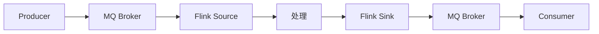

# 消息队列连接器演进 特性跟踪

> 所属阶段: Flink/connectors/evolution | 前置依赖: [MQ Connectors][^1] | 形式化等级: L3

## 1. 概念定义 (Definitions)

### Def-F-Conn-MQ-01: Message Queue

消息队列：
$$
\text{MQ} : \text{Producer} \to \text{Queue} \to \text{Consumer}
$$

### Def-F-Conn-MQ-02: Pub/Sub

发布订阅：
$$
\text{PubSub} : \text{Publisher} \to \{\text{Subscriber}_i\}
$$

## 2. 属性推导 (Properties)

### Prop-F-Conn-MQ-01: Ordering Guarantee

顺序保证：
$$
\text{Partition} \implies \text{Ordering}
$$

## 3. 关系建立 (Relations)

### MQ演进

| 版本 | 特性 | 状态 |
|------|------|------|
| 2.4 | Pulsar支持 | GA |
| 2.4 | Kinesis EFO | GA |
| 2.5 | 更多MQ | GA |
| 3.0 | 统一MQ API | 设计中 |

## 4. 论证过程 (Argumentation)

### 4.1 支持的MQ

| MQ | Source | Sink | 状态 |
|----|--------|------|------|
| RabbitMQ | ✅ | ✅ | GA |
| Pulsar | ✅ | ✅ | GA |
| Kinesis | ✅ | ✅ | GA |
| Pub/Sub | ✅ | ✅ | GA |
| RocketMQ | ✅ | ✅ | GA |

## 5. 形式证明 / 工程论证

### 5.1 Pulsar Source

```java
PulsarSource<String> source = PulsarSource.builder()
    .setServiceUrl("pulsar://localhost:6650")
    .setAdminUrl("http://localhost:8080")
    .setTopics("persistent://public/default/topic")
    .setDeserializationSchema(new SimpleStringSchema())
    .setSubscriptionName("flink-sub")
    .setSubscriptionType(SubscriptionType.Exclusive)
    .build();
```

## 6. 实例验证 (Examples)

### 6.1 RabbitMQ Sink

```java
RMQSink<String> sink = new RMQSink<>(
    new RMQConnectionConfig.Builder()
        .setHost("localhost")
        .setPort(5672)
        .setVirtualHost("/")
        .build(),
    "queue-name",
    new SimpleStringSchema()
);
```

## 7. 可视化 (Visualizations)



## 8. 引用参考 (References)

[^1]: Flink MQ Connector Documentation

---

## 跟踪信息

| 属性 | 值 |
|------|-----|
| 版本 | 2.4-3.0 |
| 当前状态 | 演进中 |
