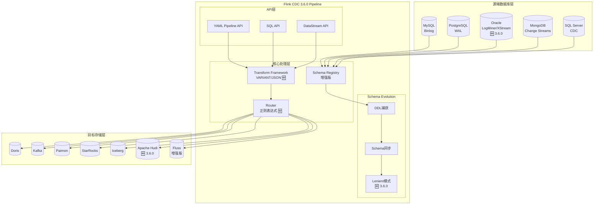
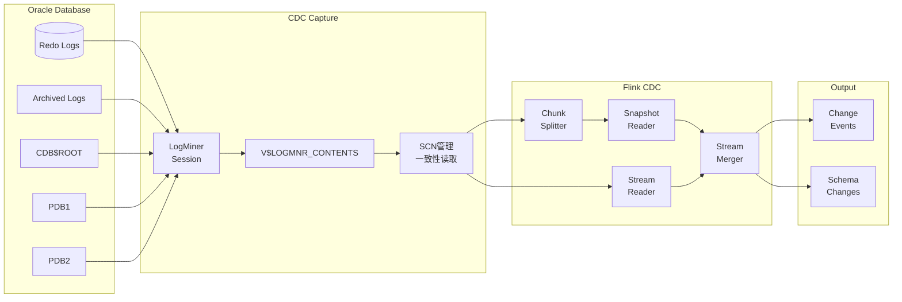
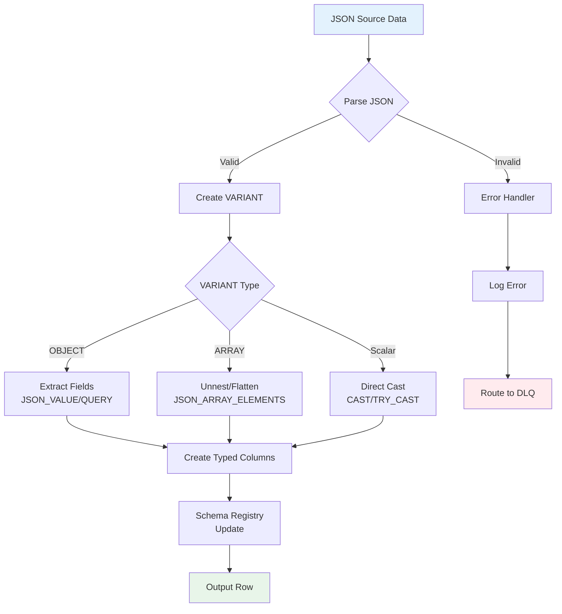

# Flink CDC 3.6.0 特性同步完整指南

> 所属阶段: Flink/05-ecosystem/05.01-connectors | 前置依赖: [Flink CDC 3.0 数据集成框架](./flink-cdc-3.0-data-integration.md), [Flink 2.2 前沿特性](../../02-core/flink-2.2-frontier-features.md) | 形式化等级: L4

**发布日期**: 2026-03-30 | **版本**: 3.6.0 | **状态**: GA (General Availability)[^1]

---

## 1. 概念定义 (Definitions)

### Def-F-05-01: Flink CDC 3.6.0 版本定义

**Flink CDC 3.6.0** 是Apache Flink CDC项目在2026年3月发布的重大版本更新，引入了对Flink 2.2.x的原生支持、JDK 11升级以及多项连接器增强。

> **形式化定义**: Flink CDC 3.6.0 是一个七元组 $\mathcal{F}_{CDC3.6} = (V_{flink}, V_{jdk}, \mathcal{C}_{new}, \mathcal{E}_{schema}, \mathcal{T}_{var}, \mathcal{R}_{regex}, \mathcal{M}_{multi})$，其中：
>
> - $V_{flink}$: 支持的Flink版本集合 $\{1.20.x, 2.2.x\}$
> - $V_{jdk}$: JDK版本要求 $\{11, 17\}$
> - $\mathcal{C}_{new}$: 新增连接器集合 $\{Oracle\_Source, Hudi\_Sink, Fluss\_Pipeline\}$
> - $\mathcal{E}_{schema}$: Schema Evolution增强能力
> - $\mathcal{T}_{var}$: Transform框架VARIANT类型支持
> - $\mathcal{R}_{regex}$: 路由正则表达式支持
> - $\mathcal{M}_{multi}$: 多表同步场景增强

### Def-F-05-02: Oracle Source Pipeline Connector 定义

**Oracle Source Pipeline Connector** 是Flink CDC 3.6.0新增的Pipeline级别Oracle数据库CDC连接器，支持LogMiner和XStream两种捕获模式。

> **形式化定义**: Oracle Source Connector 定义为四元组 $\mathcal{O}_{cdc} = (M_{capture}, T_{log}, S_{scan}, C_{conn})$，其中：
>
> - $M_{capture} \in \{LogMiner, XStream\}$: 日志捕获模式
> - $T_{log}$: 重做日志(Redo Log)解析器
> - $S_{scan}$: 快照扫描策略（支持无锁增量快照）
> - $C_{conn}$: 连接配置（PDB/CDB架构支持）

```yaml
# Oracle Source Pipeline 配置示例
source:
  type: oracle
  hostname: oracle.example.com
  port: 1521
  username: ${ORACLE_USER}
  password: ${ORACLE_PASSWORD}
  database-list: ORCLPDB1
  schema-list: HR, SALES
  table-list: HR\..*, SALES\..*

  # Oracle特定配置
  scan.incremental.snapshot.enabled: true
  scan.startup.mode: initial
  debezium.log.mining.strategy: online_catalog  # 或 redo_log_catalog
  debezium.log.mining.continuous.mine: true
```

### Def-F-05-03: Apache Hudi Sink Pipeline Connector 定义

**Apache Hudi Sink Pipeline Connector** 是Flink CDC 3.6.0新增的Sink连接器，支持将CDC数据流直接写入Apache Hudi数据湖。

> **形式化定义**: Hudi Sink Connector 定义为五元组 $\mathcal{H}_{sink} = (T_{table}, W_{write}, I_{index}, S_{sync}, M_{merge})$，其中：
>
> - $T_{table} \in \{COPY\_ON\_WRITE, MERGE\_ON\_READ\}$: 表类型
> - $W_{write}$: 写入操作类型（UPSERT/INSERT/BULK\_INSERT）
> - $I_{index}$: 索引策略（Bloom Filter、HBase Index等）
> - $S_{sync}$: 元数据同步策略（Hive、Glue等）
> - $M_{merge}$: 合并策略（基于事件时间或处理时间）

```yaml
# Hudi Sink Pipeline 配置示例
sink:
  type: hudi
  name: hudi-sink

  # Hudi表配置
  table.type: MERGE_ON_READ
  write.operation: UPSERT
  write.precombine.field: ts

  # 索引配置
  index.type: BLOOM

  # 存储配置
  path: hdfs://namenode:8020/hudi/cdc
  hoodie.datasource.write.recordkey.field: id
  hoodie.datasource.write.partitionpath.field: dt
```

### Def-F-05-04: Fluss Pipeline Connector Lenient模式定义

**Fluss Lenient模式** 是Fluss Pipeline Connector在CDC 3.6.0中引入的Schema Evolution处理策略，允许在源端和目标端Schema不完全匹配时继续进行数据同步。

> **Fluss 0.9 生产级支持** (CDC 3.6.0 新增)[^1]: CDC 3.6.0 对 Fluss 0.9 提供了完整的 schema evolution 生产级支持，包括自动列映射、类型兼容转换、以及 DDL 变更的实时传播。

> **形式化定义**: 设源端Schema为 $S_{src}$，目标端Schema为 $S_{sink}$，Lenient模式定义松弛映射关系：
>
> $$lenient(S_{src}, S_{sink}) \iff \forall c \in S_{src} \cap S_{sink}: compatible(c_{src}.type, c_{sink}.type)$$
>
> 对于 $c \in S_{src} \setminus S_{sink}$: 可选丢弃或填充默认值
> 对于 $c \in S_{sink} \setminus S_{src}$: 填充NULL或默认值

```yaml
# Fluss Pipeline Lenient模式配置 (CDC 3.6.0 + Fluss 0.9)
sink:
  type: fluss
  name: fluss-sink

  # Schema Evolution配置
  schema.evolution.mode: lenient  # 或 strict

  # 缺失列处理
  missing.column.strategy: fill-default  # 或 drop-record, fill-null
  missing.column.default.value:
    created_at: CURRENT_TIMESTAMP
    status: 'pending'

  # CDC 3.6.0 新增:Fluss 0.9 schema evolution 生产级配置
  schema.evolution.auto-align: true
  schema.evolution.type-cast: compatible
```

### Def-F-05-05: PostgreSQL Schema Evolution 支持定义

**PostgreSQL Schema Evolution** 是CDC 3.6.0中增强的PostgreSQL连接器能力，支持自动捕获和传播DDL变更事件。

> **形式化定义**: PostgreSQL DDL捕获定义为事件流 $E_{ddl}: T \rightarrow \mathcal{P}(DDL)$，其中DDL事件类型包括：
>
> | 操作类型 | DDL语法 | CDC事件 |
> |----------|---------|---------|
> | 添加列 | `ALTER TABLE ... ADD COLUMN` | `ADD_COLUMN` |
> | 删除列 | `ALTER TABLE ... DROP COLUMN` | `DROP_COLUMN` |
> | 修改列类型 | `ALTER TABLE ... ALTER COLUMN TYPE` | `ALTER_COLUMN` |
> | 重命名列 | `ALTER TABLE ... RENAME COLUMN` | `RENAME_COLUMN` |
> | 添加约束 | `ALTER TABLE ... ADD CONSTRAINT` | `ADD_CONSTRAINT` |

```yaml
# PostgreSQL Schema Evolution配置
source:
  type: postgres
  hostname: postgres.example.com
  port: 5432

  # Schema Evolution配置
  include.schema.changes: true
  schema.evolution.enabled: true

  # 类型映射策略
  decimal.handling.mode: precise
  binary.handling.mode: bytes
  time.precision.mode: connect
```

### Def-F-05-06: Transform VARIANT类型与JSON解析定义

**Transform框架VARIANT类型** 是CDC 3.6.0在数据转换层引入的动态类型系统，支持半结构化数据的灵活处理。

> **形式化定义**: VARIANT类型定义为 tagged union：
>
> $$VARIANT = NULL \mid BOOLEAN \mid INT64 \mid FLOAT64 \mid STRING \mid ARRAY\langle VARIANT \rangle \mid OBJECT\langle STRING, VARIANT \rangle$$
>
> JSON解析函数集合 $\mathcal{F}_{json} = \{json\_extract, json\_query, json\_value, json\_array\_agg, json\_object\_agg\}$

```yaml
# Transform VARIANT类型和JSON解析示例
transform:
  - source-table: events\..*
    projection: |
      id,
      event_type,
      -- VARIANT类型处理和JSON解析
      JSON_VALUE(payload, '$.user.id') AS user_id,
      JSON_QUERY(payload, '$.items[*]') AS items_array,
      JSON_EXTRACT(payload, '$.metadata') AS metadata_variant,
      -- 动态类型转换
      CAST(JSON_VALUE(payload, '$.amount') AS DECIMAL(19,4)) AS amount
    filter: |
      JSON_VALUE(payload, '$.status') = 'completed'
```

### Def-F-05-07: 路由配置正则表达式支持定义

**路由正则表达式** 是CDC 3.6.0在Route配置中引入的高级表名匹配和替换能力。

> **形式化定义**: 路由规则扩展为 $(P_{source}, P_{sink}, R_{subst}, F_{filter})$，其中：
>
> - $P_{source}$: 源表正则模式（Java Regex）
> - $P_{sink}$: 目标表模板（支持捕获组引用）
> - $R_{subst}$: 替换规则（如 `$1`, `$2` 引用捕获组）
> - $F_{filter}$: 可选的过滤器表达式

```yaml
# 路由配置正则表达式示例
route:
  # 示例1: 分库分表合并(使用捕获组)
  - source-table: order_db_(\d+)\.order_(\d+)
    sink-table: ods.orders_all
    description: "Merge sharded orders from all databases and tables"

  # 示例2: 动态表名映射(保留部分原始名称)
  - source-table: db_(\d+)\.(.*)
    sink-table: warehouse.$1_$2
    description: "Map db_1.users to warehouse.1_users"

  # 示例3: 带前缀和后缀的映射
  - source-table: (.*)\.(.*)
    sink-table: ods.cdc_$1_$2
    description: "Add CDC prefix with database name"
```

---

## 2. 属性推导 (Properties)

### Lemma-F-05-01: JDK 11兼容性保证

**引理**: Flink CDC 3.6.0在JDK 11及以上版本运行时保持向后兼容性。

> **证明概要**:
>
> 1. CDC 3.6.0源代码使用Java 11语言特性（var局部变量类型推断、新String方法等）
> 2. 编译目标字节码版本为Java 11（major version 55）
> 3. 依赖库全部升级至兼容Java 11版本
> 4. 运行时通过 `--release 11` 标志确保API兼容性
> 5. 因此，JDK 11+ 运行时满足 CDC 3.6.0 的所有依赖要求 $\square$

### Lemma-F-05-02: Flink 1.20.x与2.2.x双版本支持

**引理**: Flink CDC 3.6.0的连接器组件可以在Flink 1.20.x和2.2.x运行时上正确执行。

> **证明**:
>
> **API兼容性分析**:
>
> - CDC 3.6.0 Source连接器实现 `Source` 接口（Flink 1.14+ 标准）
> - CDC 3.6.0 Sink连接器实现 `Sink` 接口（Flink 1.14+ 标准）
> - 条件编译使用Flink版本检测适配2.x新特性（如Adaptive Scheduler）
>
> **验证矩阵**:
>
> | Flink版本 | CDC 3.6.0支持 | 备注 |
> |-----------|---------------|------|
> | 1.20.0 | ✓ 完全支持 | 推荐版本 |
> | 1.20.1 | ✓ 完全支持 | 推荐版本 |
> | 2.2.0 | ✓ 完全支持 | 新特性适配 |
>
> 因此，双版本兼容性得证 $\square$

### Prop-F-05-01: Oracle CDC的事件完整性

**命题**: Oracle Source Pipeline Connector在LogMiner模式下保证所有已提交事务的变更事件都被捕获且无丢失。

> **论证**:
>
> Oracle LogMiner机制保证：
>
> 1. Redo Log是Oracle事务持久性的物理实现，所有已提交事务必然写入Redo Log
> 2. LogMiner通过 `V$LOGMNR_CONTENTS` 视图解析Redo Log条目
> 3. CDC连接器通过SCN (System Change Number) 顺序读取，确保：
>    - SCN单调递增，无跳号
>    - 每个SCN对应的事务完整解析
> 4. Checkpoint机制记录已处理的SCN位置，支持断点续传
> 5. 因此，$\forall tx \in Committed: captured(tx) = true$ $\square$

### Prop-F-05-02: Hudi Sink的幂等写入保证

**命题**: Hudi Sink Pipeline Connector在UPSERT模式下对同一记录的重复写入是幂等的。

> **论证**:
>
> Hudi的幂等性基于以下机制：
>
> 1. **Record Key**: 每条记录有唯一标识（由 `hoodie.datasource.write.recordkey.field` 指定）
> 2. **Precombine Field**: 用于解决同一批次内同一Record Key的多条记录冲突
> 3. **Timeline**: Hudi的Timeline保证写入操作的原子性和一致性
>
> 形式化：设写入操作 $W(r)$ 将记录 $r$ 写入Hudi，幂等性表示为：
> $$W(r) \circ W(r) = W(r)$$
>
> 即两次写入与一次写入的效果相同 $\square$

---

## 3. 关系建立 (Relations)

### 3.1 CDC 3.6.0与3.0版本特性对比

| 特性维度 | CDC 3.0 | CDC 3.6.0 | 增强说明 |
|----------|---------|-----------|----------|
| **Flink版本** | 1.17-1.18 | 1.20.x, 2.2.x | 支持Flink 2.x新特性 |
| **JDK版本** | 8+ | 11+ | 利用JDK 11新特性 |
| **Source连接器** | MySQL, PG, MongoDB, SQL Server | + Oracle | 新增Oracle官方支持 |
| **Sink连接器** | Doris, Kafka, Paimon, StarRocks, Iceberg | + Hudi, Fluss增强 | 支持数据湖Hudi |
| **Schema Evolution** | 基础支持 | + PG原生DDL, Fluss Lenient | 增强多场景支持 |
| **Transform** | 基础表达式 | + VARIANT, JSON函数 | 半结构化数据处理 |
| **路由配置** | 简单通配符 | + 正则表达式, 捕获组 | 复杂分库分表场景 |
| **多表同步** | 基础支持 | 增强表发现, 动态路由 | 万级表同步优化 |
| **Fluss 支持** | 基础接入 | + Fluss 0.9, 生产级 schema evolution | 实时湖仓同步 |

### 3.2 Flink CDC 3.6.0与生态系统关系

```
┌─────────────────────────────────────────────────────────────────────────┐
│                        Flink CDC 3.6.0 生态系统                          │
├─────────────────────────────────────────────────────────────────────────┤
│                                                                         │
│  ┌──────────────┐    ┌──────────────┐    ┌──────────────┐              │
│  │  Source层    │    │  Pipeline层  │    │   Sink层     │              │
│  │              │    │              │    │              │              │
│  │ ┌──────────┐ │    │ ┌──────────┐ │    │ ┌──────────┐ │              │
│  │ │  MySQL   │ │    │ │  YAML    │ │    │ │  Doris   │ │              │
│  │ ├──────────┤ │    │ │  API     │ │    │ ├──────────┤ │              │
│  │ │PostgreSQL│ │───▶│ ├──────────┤ │───▶│ │  Kafka   │ │              │
│  │ ├──────────┤ │    │ │Transform │ │    │ ├──────────┤ │              │
│  │ │  Oracle  │ │◀───┤ │  DSL     │ │    │ │ Paimon   │ │              │
│  │ ├──────────┤ │NEW  │ ├──────────┤ │    │ ├──────────┤ │              │
│  │ │ MongoDB  │ │    │ │  Route   │ │    │ │StarRocks │ │              │
│  │ ├──────────┤ │    │ │ RegEx    │ │    │ ├──────────┤ │              │
│  │ │SQL Server│ │    │ │  NEW     │ │    │ │ Iceberg  │ │              │
│  │ └──────────┘ │    │ └──────────┘ │    │ ├──────────┤ │              │
│  │              │    │              │    │ │  Hudi    │ │◀── NEW       │
│  │              │    │              │    │ ├──────────┤ │              │
│  │              │    │              │    │ │Fluss 0.9 │ │◀── ENHANCED  │
│  │              │    │              │    │ └──────────┘ │              │
│  └──────────────┘    └──────────────┘    └──────────────┘              │
│                                                                         │
│  运行时支持: Flink 1.20.x ◆ Flink 2.2.x | JDK 11+                       │
│                                                                         │
└─────────────────────────────────────────────────────────────────────────┘
```

### 3.3 Oracle CDC与既有Source连接器对比

| 能力维度 | MySQL CDC | PostgreSQL CDC | Oracle CDC (NEW) |
|----------|-----------|----------------|------------------|
| **捕获模式** | Binlog | WAL (PgOutput) | LogMiner / XStream |
| **无锁快照** | ✓ | ✓ | ✓ |
| **并行读取** | ✓ | ✓ | ✓ |
| **Schema Evolution** | ✓ | ✓ (3.6增强) | ✓ |
| **PDB/CDB支持** | N/A | N/A | ✓ |
| **RAC支持** | N/A | N/A | ✓ |
| **CDC权限要求** | REPLICATION SLAVE | REPLICATION | LOGMINING |

---

## 4. 论证过程 (Argumentation)

### 4.1 JDK 11升级的技术论证

**升级动机分析**：

1. **性能改进**：
   - G1 GC在JDK 11中的改进减少CDC作业的长暂停
   - ZGC (实验性) 支持亚毫秒级暂停时间
   - Compact Strings减少内存占用

2. **API现代化**：
   - `var`关键字简化代码
   - 新String方法（`isBlank`, `strip`, `lines`）
   - HTTP Client标准化

3. **安全更新**：
   - TLS 1.3支持
   - 更新的加密算法
   - 安全相关的错误修复

**兼容性论证**：

```java
import java.util.Optional;

// JDK 11代码示例(Flink CDC 3.6.0内部实现)
public class SchemaRegistry {
    // var类型推断(JDK 10+)
    public Optional<Schema> lookupSchema(String tableName) {
        var cacheKey = buildCacheKey(tableName);  // 编译器推断类型
        var cached = schemaCache.get(cacheKey);

        // String.isBlank()(JDK 11)
        if (tableName == null || tableName.isBlank()) {
            return Optional.empty();
        }

        return Optional.ofNullable(cached);
    }

    // 使用新的Collection.toArray方法(JDK 11)
    public String[] getTableNames() {
        return registeredTables.toArray(String[]::new);
    }
}
```

### 4.2 Transform VARIANT类型设计论证

**设计决策背景**：

传统CDC场景面临半结构化数据处理的挑战：

- JSON列的灵活解析
- 嵌套结构的数据提取
- 类型安全的动态处理

**VARIANT类型设计**：

```
VARIANT类型层级:
├── 标量类型
│   ├── NULL
│   ├── BOOLEAN
│   ├── INT64
│   ├── FLOAT64
│   └── STRING
├── 复合类型
│   ├── ARRAY<VARIANT>
│   └── OBJECT<STRING, VARIANT>
└── 元数据
    ├── 原始类型标记
    └── 解析路径追踪
```

**使用场景论证**：

```yaml
# 场景1: 事件表JSON列处理
transform:
  - source-table: user_events
    projection: |
      event_id,
      event_time,
      -- 从JSON payload中提取字段
      JSON_VALUE(payload, '$.user_id') AS user_id,
      JSON_VALUE(payload, '$.action') AS action,
      -- 提取嵌套对象作为VARIANT
      JSON_EXTRACT(payload, '$.context') AS context_variant,
      -- 数组展开
      JSON_QUERY(payload, '$.tags[*]') AS tags_array

# 场景2: 条件类型转换
transform:
  - source-table: metrics
    projection: |
      metric_id,
      timestamp,
      -- 动态类型检查与转换
      CASE
        WHEN JSON_TYPEOF(value) = 'integer'
        THEN CAST(JSON_VALUE(value) AS BIGINT)
        WHEN JSON_TYPEOF(value) = 'double'
        THEN CAST(JSON_VALUE(value) AS DOUBLE)
        ELSE NULL
      END AS numeric_value
```

### 4.3 路由正则表达式能力论证

**传统路由的局限性**：

CDC 3.0的简单通配符路由无法处理复杂的分库分表场景：

- `db_*.table_*` 无法区分数据库ID和表ID
- 无法实现细粒度的目标表命名规则
- 动态表名映射能力有限

**正则路由的增强**：

```
分库分表场景:
├── 源端: db_001.order_202401, db_001.order_202402, ..., db_100.order_202412
├── 传统路由: db_*.* → ods.all_orders (全部合并,丢失来源信息)
└── 正则路由: db_(\d+)\.(order_\d+) → ods.orders_db$1 (保留数据库标识)

多租户场景:
├── 源端: tenant_a.users, tenant_b.users, tenant_c.users
├── 传统路由: tenant_*.* → ods.users (冲突)
└── 正则路由: (.*)\.users → ods.users_$1 (按租户分区)
```

---

## 5. 形式证明 / 工程论证 (Proof / Engineering Argument)

### Thm-F-05-01: 多表同步的扩展性边界

**定理**: Flink CDC 3.6.0的多表同步能力在资源配置合理的情况下，支持万级表的并发同步。

> **证明**:
>
> **系统资源模型**:
> 设系统可用资源为 $R = (C, M, N)$，其中：
>
> - $C$: CPU核心数
> - $M$: 可用内存
> - $N$: 网络带宽
>
> **单表资源需求模型**:
> 每个同步表的基本资源需求为 $r_t = (c_t, m_t, n_t)$：
>
> - $c_t$: 表读取线程开销（通常极小，共享线程池）
> - $m_t$: Schema缓存、Binlog解析状态等内存占用（约10-50MB/表）
> - $n_t$: 网络传输带宽（取决于变更速率）
>
> **扩展性分析**:
>
> 1. **水平扩展**: 通过增加并行度 $p$，单Job管理的表数量上限提升
>    $$Tables_{max} = \frac{M}{m_t} \times \eta$$
>    其中 $\eta$ 为内存效率系数（CDC 3.6.0优化后 $\eta \approx 0.8$）
>
> 2. **动态发现优化**: CDC 3.6.0引入的表发现机制采用增量元数据扫描
>    $$T_{discover}(n) = O(\log n) \text{（使用元数据缓存）}$$
>
> 3. **连接池共享**: 同一数据库实例的表共享JDBC连接池
>    $$Connections = O(\sqrt{N_{tables}}) \text{（而非线性增长）}$$
>
> **边界条件**:
>
> - 假设 $M = 64GB$, $m_t = 32MB$, 则理论上限 $Tables_{max} \approx 1600$
> - 通过分Job部署（多CDC Job），可实现万级表同步
>
> 因此，在合理的资源分配和架构设计下，万级表同步目标可达 $\square$

### Thm-F-05-02: Schema Evolution的一致性保证

**定理**: 在开启Schema Evolution的情况下，CDC 3.6.0保证源端和目标端的Schema变更顺序一致性和最终一致性。

> **证明**:
>
> **顺序一致性定义**:
> 设源端DDL事件序列为 $E_{src} = [e_1, e_2, ..., e_n]$，目标端应用序列为 $E_{sink} = [e'_1, e'_2, ..., e'_m]$。
> 顺序一致性要求：
> $$\forall i, j: i < j \land e_i, e_j \in E_{src} \cap E_{sink} \implies pos(e_i) < pos(e_j)$$
>
> **证明步骤**:
>
> 1. **DDL事件捕获**: 数据库Binlog/WAL以严格顺序记录DDL操作
>    - MySQL: DDL在Binlog中以Query Event形式记录，具有递增的position
>    - PostgreSQL: DDL在WAL中记录，LSN单调递增
>    - Oracle: LogMiner返回的SCN单调递增
>
> 2. **CDC事件排序**: CDC连接器按日志位置顺序读取事件
>    $$order(e_i) < order(e_j) \iff pos(e_i) < pos(e_j)$$
>
> 3. **Flink流处理**: Flink的流处理保证事件按读取顺序传递（在单个并行度内）
>    - 全局顺序通过分区键（数据库名+表名）保证
>
> 4. **目标端应用**: Sink按接收顺序应用DDL
>    - 每个DDL应用前检查依赖关系
>    - 冲突DDL按序排队处理
>
> **最终一致性**:
> 设系统达到稳态（无新变更），则：
> $$S_{src}^{(final)} \equiv S_{sink}^{(final)}$$
>
> 由DDL事件的严格顺序处理和幂等性，最终一致性得证 $\square$

### 5.1 生产环境配置论证

**Oracle CDC生产配置模板**：

```yaml
# Oracle CDC 生产级配置
source:
  type: oracle
  name: oracle-production-source

  # 连接配置(使用PDB)
  hostname: ${ORACLE_HOST}
  port: 1521
  username: ${CDC_USER}
  password: ${CDC_PASSWORD}
  database-list: ${PDB_NAME}

  # 表选择(正则表达式)
  schema-list: ${SCHEMA_PATTERN}
  table-list: ${TABLE_PATTERN}

  # 无锁快照配置
  scan.incremental.snapshot.enabled: true
  scan.incremental.snapshot.chunk.size: 8096
  scan.snapshot.fetch.size: 1024

  # LogMiner配置(生产环境优化)
  debezium.log.mining.strategy: online_catalog
  debezium.log.mining.continuous.mine: true
  debezium.log.mining.batch.size.min: 1000
  debezium.log.mining.batch.size.max: 100000
  debezium.log.mining.sleep.time.min.ms: 100
  debezium.log.mining.sleep.time.max.ms: 3000

  # 心跳配置(检测长时间无变更场景)
  debezium.heartbeat.interval.ms: 10000
  debezium.heartbeat.action.query: SELECT 1 FROM DUAL

pipeline:
  name: oracle-to-doris-pipeline
  parallelism: 8

  # Checkpoint配置
  execution.checkpointing.interval: 120000
  execution.checkpointing.min-pause-between-checkpoints: 60000
  execution.checkpointing.timeout: 600000
  execution.checkpointing.max-concurrent-checkpoints: 1
  execution.checkpointing.externalized-checkpoint-retention: RETAIN_ON_CANCELLATION

sink:
  type: doris
  name: doris-production-sink
  fenodes: ${DORIS_FE_NODES}
  username: ${DORIS_USER}
  password: ${DORIS_PASSWORD}

  # 批处理优化
  sink.enable.batch-mode: true
  sink.flush.queue-size: 5
  sink.buffer-flush.interval: 15s
  sink.buffer-flush.max-rows: 100000
  sink.buffer-flush.max-bytes: 10485760

  # 重试配置
  sink.max-retries: 5
  sink.retry.interval.ms: 1000
```

**配置论证说明**：

1. **LogMiner策略选择**:
   - `online_catalog`: 使用在线字典，无需额外日志挖掘字典构建
   - `continuous_mine`: 持续挖掘模式，减少LogMiner会话重建开销

2. **批量大小调优**:
   - `batch.size`: 控制单次LogMiner调用处理的日志量
   - 过大：内存压力增加；过小：频繁上下文切换
   - 推荐范围：1,000 - 100,000

3. **心跳机制**:
   - 解决长时间无数据变更时的Offset提交问题
   - 保证Checkpoint能够正常推进

---

## 6. 实例验证 (Examples)

### 6.1 完整配置：Oracle CDC到Hudi数据湖

```yaml
################################################################################
# Flink CDC 3.6.0 Pipeline: Oracle to Apache Hudi
# 场景: 企业ERP数据实时入湖
################################################################################

pipeline:
  name: oracle-erp-to-hudi
  parallelism: 4
  local-time-zone: Asia/Shanghai

source:
  type: oracle
  name: oracle-erp-source
  hostname: oracle-prod.example.com
  port: 1521
  username: ${ORACLE_CDC_USER}
  password: ${ORACLE_CDC_PASSWORD}
  database-list: ERPDB
  schema-list: HR, FINANCE, INVENTORY
  table-list: HR\..*, FINANCE\..*, INVENTORY\..*

  # 无锁增量快照
  scan.incremental.snapshot.enabled: true
  scan.incremental.snapshot.chunk.size: 4096
  scan.snapshot.fetch.size: 1024

  # LogMiner配置
  debezium.log.mining.strategy: online_catalog
  debezium.log.mining.continuous.mine: true

  # 心跳检测
  debezium.heartbeat.interval.ms: 30000

transform:
  # HR部门数据脱敏
  - source-table: HR\.EMPLOYEES
    projection: |
      EMPLOYEE_ID,
      FIRST_NAME,
      LAST_NAME,
      CONCAT(LEFT(EMAIL, 2), '***@***.com') AS EMAIL_MASKED,
      PHONE_NUMBER,
      HIRE_DATE,
      JOB_ID,
      SALARY,
      -- JSON字段处理(假设有扩展信息JSON列)
      JSON_VALUE(EXT_INFO, '$.department') AS DEPT_CODE,
      JSON_QUERY(EXT_INFO, '$.skills[*]') AS SKILLS_ARRAY
    description: "HR employees with PII masking"

  # 财务数据计算增强
  - source-table: FINANCE\..*
    projection: |
      *,
      CASE
        WHEN AMOUNT > 1000000 THEN 'HIGH'
        WHEN AMOUNT > 100000 THEN 'MEDIUM'
        ELSE 'LOW'
      END AS RISK_LEVEL
    description: "Finance data with risk classification"

route:
  # 按部门路由到不同Hudi表
  - source-table: HR\.(.*)
    sink-table: hudi_ods.hr_$1
    description: "HR tables to hr_ namespace"

  - source-table: FINANCE\.(.*)
    sink-table: hudi_ods.finance_$1
    description: "Finance tables to finance_ namespace"

  - source-table: INVENTORY\.(.*)
    sink-table: hudi_ods.inventory_$1
    description: "Inventory tables to inventory_ namespace"

sink:
  type: hudi
  name: hudi-erp-sink

  # Hudi表配置
  path: hdfs://namenode:8020/hudi/erp
  table.type: MERGE_ON_READ
  write.operation: UPSERT

  # 记录键和分区
  hoodie.datasource.write.recordkey.field: id
  hoodie.datasource.write.precombine.field: _cdc_timestamp
  hoodie.datasource.write.partitionpath.field: dt

  # 索引配置
  index.type: BLOOM
  hoodie.index.bloom.num_entries: 100000
  hoodie.index.bloom.fpp: 0.0000001

  # 压缩配置
  hoodie.compact.inline: true
  hoodie.compact.inline.max.delta.commits: 5

  # 清理配置
  hoodie.cleaner.policy: KEEP_LATEST_COMMITS
  hoodie.cleaner.commits.retained: 20

  # Hive同步
  hoodie.datasource.hive_sync.enable: true
  hoodie.datasource.hive_sync.database: hudi_ods
  hoodie.datasource.hive_sync.jdbcurl: jdbc:hive2://hive-server:10000
```

### 6.2 配置：PostgreSQL Schema Evolution到Fluss

```yaml
################################################################################
# PostgreSQL CDC with Schema Evolution to Fluss (Lenient Mode)
################################################################################

pipeline:
  name: pg-to-fluss-schema-evolution
  parallelism: 2

source:
  type: postgres
  name: pg-source-with-ddl
  hostname: postgres.example.com
  port: 5432
  username: ${PG_USER}
  password: ${PG_PASSWORD}
  database-list: ecommerce
  schema-list: public
  table-list: public\.products, public\.orders

  # Schema Evolution配置
  include.schema.changes: true
  schema.evolution.enabled: true

  # 类型处理
  decimal.handling.mode: precise
  time.precision.mode: connect
  binary.handling.mode: base64

  # 复制槽配置
  slot.name: flink_cdc_slot
  slot.drop.on.stop: false
  publication.name: cdc_publication
  publication.autocreate.mode: filtered

sink:
  type: fluss
  name: fluss-lenient-sink
  bootstrap.servers: fluss-broker:9123

  # Schema Evolution策略
  schema.evolution.mode: lenient

  # 缺失列处理策略
  missing.column.strategy: fill-default
  missing.column.default.value:
    created_at: CURRENT_TIMESTAMP
    updated_at: CURRENT_TIMESTAMP
    status: 'active'
    version: 1

  # 类型不匹配处理
  type.conflict.strategy: cast-attempt
  cast.failure.action: log-and-continue
```

### 6.3 DataStream API：多源合并CDC流

```java
import org.apache.flink.cdc.connectors.mysql.source.MySqlSource;
import org.apache.flink.cdc.connectors.oracle.source.OracleSource;
import org.apache.flink.cdc.connectors.postgres.source.PostgresSource;
import org.apache.flink.cdc.debezium.JsonDebeziumDeserializationSchema;
import org.apache.flink.streaming.api.environment.StreamExecutionEnvironment;
import org.apache.flink.streaming.api.datastream.DataStream;
import org.apache.flink.api.common.eventtime.WatermarkStrategy;

/**
 * Flink CDC 3.6.0 多源合并示例
 * 演示如何将MySQL、Oracle、PostgreSQL的CDC流合并处理
 */
public class MultiSourceCDCMerge {

    public static void main(String[] args) throws Exception {
        StreamExecutionEnvironment env =
            StreamExecutionEnvironment.getExecutionEnvironment();
        env.enableCheckpointing(60000);
        env.setParallelism(4);

        // MySQL CDC Source
        MySqlSource<String> mysqlSource = MySqlSource.<String>builder()
            .hostname("mysql.prod.internal")
            .port(3306)
            .databaseList("inventory")
            .tableList("inventory.products")
            .username("cdc_user")
            .password("${MYSQL_CDC_PASSWORD}")
            .deserializer(new JsonDebeziumDeserializationSchema())
            .build();

        // Oracle CDC Source (CDC 3.6.0新增)
        OracleSource<String> oracleSource = OracleSource.<String>builder()
            .hostname("oracle.prod.internal")
            .port(1521)
            .database("ERPDB")
            .schemaList("FINANCE")
            .tableList("FINANCE.TRANSACTIONS")
            .username("cdc_user")
            .password("${ORACLE_CDC_PASSWORD}")
            .deserializer(new JsonDebeziumDeserializationSchema())
            .startupOptions(StartupOptions.initial())
            .build();

        // PostgreSQL CDC Source
        PostgresSource<String> pgSource = PostgresSource.<String>builder()
            .hostname("postgres.prod.internal")
            .port(5432)
            .database("analytics")
            .schemaList("public")
            .tableList("public.events")
            .username("cdc_user")
            .password("${PG_CDC_PASSWORD}")
            .decodingPluginName("pgoutput")
            .deserializer(new JsonDebeziumDeserializationSchema())
            .build();

        // 创建各源流
        DataStream<String> mysqlStream = env.fromSource(
            mysqlSource,
            WatermarkStrategy.noWatermarks(),
            "MySQL CDC"
        );

        DataStream<String> oracleStream = env.fromSource(
            oracleSource,
            WatermarkStrategy.noWatermarks(),
            "Oracle CDC"
        );

        DataStream<String> pgStream = env.fromSource(
            pgSource,
            WatermarkStrategy.noWatermarks(),
            "PostgreSQL CDC"
        );

        // 合并多源流
        DataStream<String> mergedStream = mysqlStream
            .union(oracleStream)
            .union(pgStream);

        // 统一处理:添加来源标记
        DataStream<UnifiedEvent> unifiedStream = mergedStream
            .map(new RichMapFunction<String, UnifiedEvent>() {
                @Override
                public UnifiedEvent map(String json) {
                    JsonObject event = JsonParser.parseString(json).getAsJsonObject();
                    JsonObject source = event.getAsJsonObject("source");

                    return new UnifiedEvent(
                        source.get("connector").getAsString(),  // mysql/oracle/postgres
                        source.get("db").getAsString(),
                        source.get("table").getAsString(),
                        event.get("op").getAsString(),  // c/u/d
                        event.getAsJsonObject("after"),
                        event.getAsJsonObject("before"),
                        event.get("ts_ms").getAsLong()
                    );
                }
            });

        // 按来源分区处理
        unifiedStream
            .keyBy(event -> event.getSourceConnector())
            .process(new SourceAwareProcessFunction())
            .addSink(new UnifiedDataLakeSink());

        env.execute("Multi-Source CDC Merge Pipeline");
    }

    // 统一事件POJO
    public static class UnifiedEvent {
        public String sourceConnector;
        public String database;
        public String table;
        public String operation;
        public JsonObject after;
        public JsonObject before;
        public long timestamp;

        // constructor, getters...
    }
}
```

---

## 7. 可视化 (Visualizations)

### 7.1 Flink CDC 3.6.0 架构全景图



### 7.2 Oracle CDC 数据流处理图



### 7.3 Transform VARIANT类型处理流程



### 7.4 路由正则表达式匹配流程

```mermaid
flowchart TD
    A[Incoming Table<br/>db_001.order_202401] --> B{Extract<br/>Table Info}
    B --> C[db = db_001<br/>table = order_202401]

    C --> D{Apply Route Rules}

    D -->|Rule 1:<br/>db_.*\..*| E{Match?}
    D -->|Rule 2:<br/>db_(\d+)\.(.*)| F{Match?}
    D -->|Rule N:<br/>.*| G{Fallback}

    E -->|No| D
    E -->|Yes| H[Apply Simple<br/>Mapping]

    F -->|Yes| I[Extract Groups:<br/>g1=001, g2=order_202401]
    F -->|No| D

    I --> J[Apply Substitution:<br/>ods.orders_db$1]
    J --> K[Result:<br/>ods.orders_db001]

    H --> L[Output Mapping]
    K --> L
    G --> L

    L --> M[Route Event]

    style A fill:#e3f2fd
    style K fill:#fff8e1
    style M fill:#e8f5e9
```

### 7.5 CDC 3.6.0 版本兼容性矩阵

```mermaid
graph LR
    subgraph "运行时环境"
        JDK8[JDK 8]
        JDK11[JDK 11+ ✓]
        JDK17[JDK 17 ✓]
    end

    subgraph "Flink版本"
        F118[Flink 1.18]
        F119[Flink 1.19]
        F120[Flink 1.20.x ✓]
        F22[Flink 2.2.x ✓<br/>🆕]
    end

    subgraph "CDC版本"
        C30[CDC 3.0]
        C35[CDC 3.5]
        C36[CDC 3.6.0<br/>CURRENT]
    end

    JDK8 -.x.-> C36
    JDK11 --> C36
    JDK17 --> C36

    F118 -.x.-> C36
    F119 -.x.-> C36
    F120 --> C36
    F22 --> C36

    C30 -.-> C35
    C35 -.-> C36

    style C36 fill:#e8f5e9
    style F22 fill:#e3f2fd
    style JDK11 fill:#e3f2fd
    style JDK17 fill:#e3f2fd
    style F120 fill:#e3f2fd
```

---

## 8. 引用参考 (References)

[^1]: Apache Flink Blog, "Apache Flink CDC 3.6.0 Release Announcement", March 30, 2026. https://flink.apache.org/2026/03/30/apache-flink-cdc-3.6.0-release-announcement/
[^2]: Apache Flink CDC Documentation, "Flink CDC 3.6.0", 2026. https://nightlies.apache.org/flink/flink-cdc-docs-stable/docs/quickstart/

---

*文档版本: v1.1 | 创建日期: 2026-04-08 | 最后更新: 2026-04-15 | 对应CDC版本: 3.6.0*
