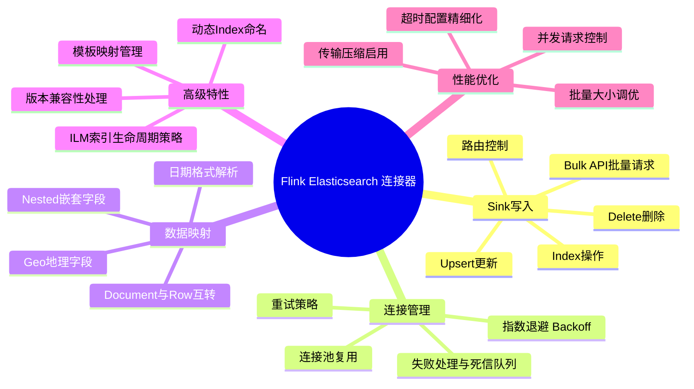
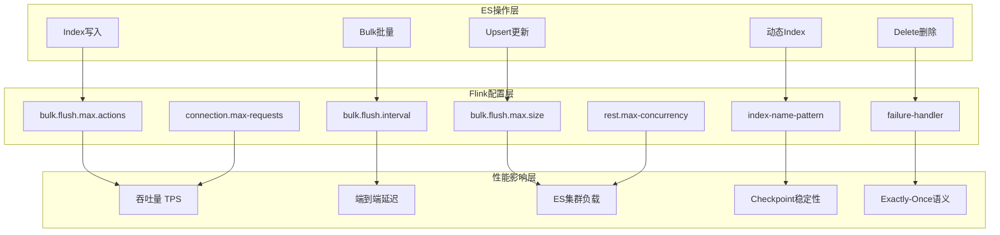
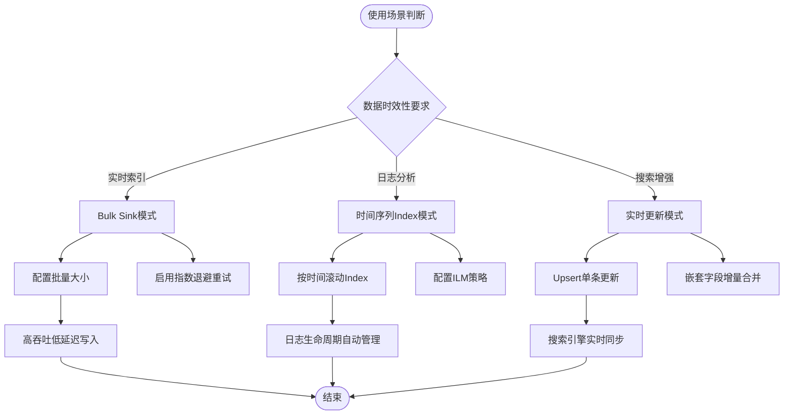

> **状态**: 📦 已归档 | **归档日期**: 2026-04-20
>
> 本文档内容已整合至主文档，此处保留为重定向入口。
> **主文档**: [Flink\05-ecosystem\05.01-connectors\elasticsearch-connector-complete-guide.md](../../../Flink/05-ecosystem/05.01-connectors/elasticsearch-connector-complete-guide.md)
> **归档位置**: [../../../archive/content-deduplication/2026-04/Flink/05-ecosystem/05.01-connectors/flink-elasticsearch-connector-guide.md](../../../archive/content-deduplication/2026-04/Flink/05-ecosystem/05.01-connectors/flink-elasticsearch-connector-guide.md)

---

## 思维表征补充

### 思维导图：Flink Elasticsearch 连接器全景

以下思维导图以"Flink Elasticsearch 连接器"为中心，放射展开五大核心维度：

### 多维关联树：ES 操作 → Flink 配置 → 性能影响

### 决策树：ES 连接器使用模式选择

## 引用参考
