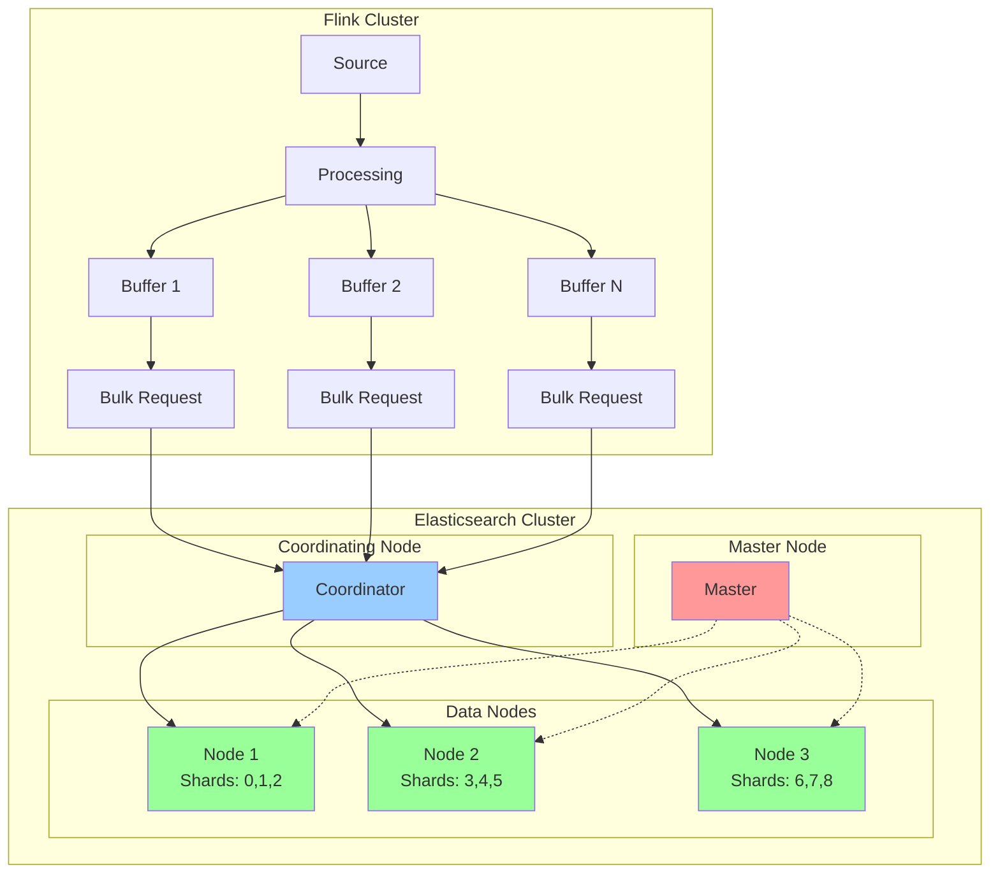
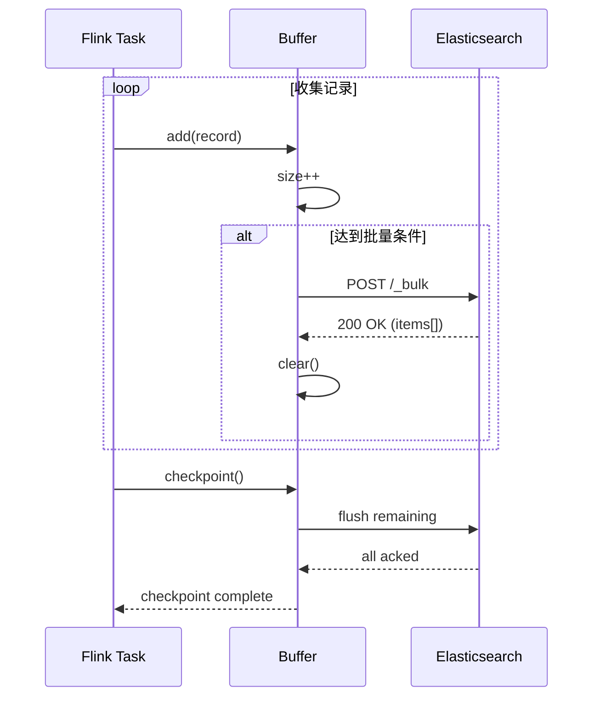
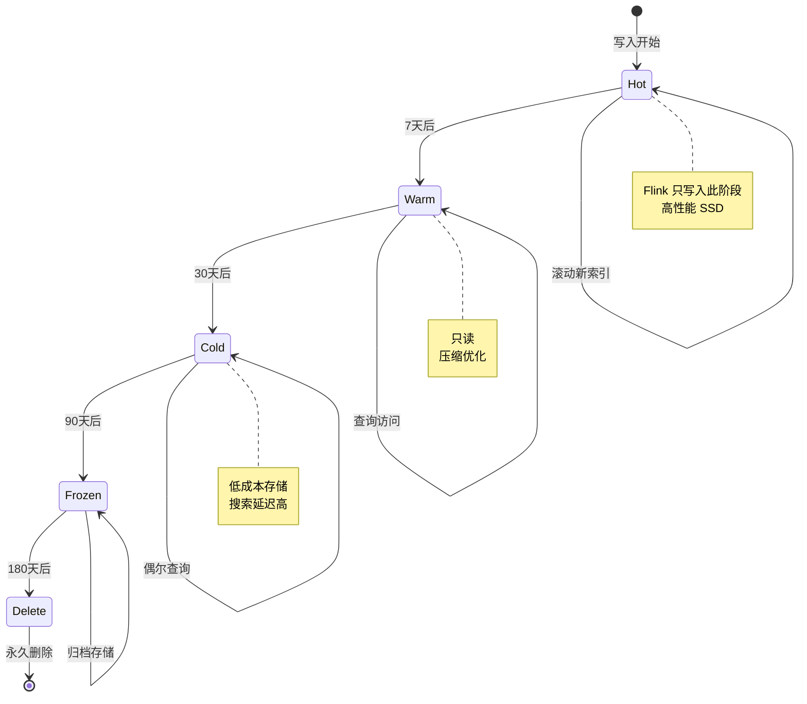

# Flink Elasticsearch Connector 详细指南

> **所属阶段**: Flink/connectors | **前置依赖**: [Flink Connectors生态](flink-connectors-ecosystem-complete-guide.md), [Checkpoint机制](../../02-core/checkpoint-mechanism-deep-dive.md) | **形式化等级**: L4

---

## 目录

- [Flink Elasticsearch Connector 详细指南](#flink-elasticsearch-connector-详细指南)
  - [目录](#目录)
  - [1. 概念定义 (Definitions)](#1-概念定义-definitions)
    - [Def-F-CE-01 (Elasticsearch Connector 形式化定义)](#def-f-ce-01-elasticsearch-connector-形式化定义)
    - [Def-F-CE-02 (版本兼容模型)](#def-f-ce-02-版本兼容模型)
    - [Def-F-CE-03 (批量写入机制)](#def-f-ce-03-批量写入机制)
    - [Def-F-CE-04 (索引模板与动态映射)](#def-f-ce-04-索引模板与动态映射)
    - [Def-F-CE-05 (故障恢复模型)](#def-f-ce-05-故障恢复模型)
  - [2. 属性推导 (Properties)](#2-属性推导-properties)
    - [Prop-F-CE-01 (批量写入吞吐边界)](#prop-f-ce-01-批量写入吞吐边界)
    - [Lemma-F-CE-01 (批量大小与延迟权衡)](#lemma-f-ce-01-批量大小与延迟权衡)
    - [Prop-F-CE-02 (幂等写入保证)](#prop-f-ce-02-幂等写入保证)
  - [3. 关系建立 (Relations)](#3-关系建立-relations)
    - [3.1 ES Connector 与其他组件的关系](#31-es-connector-与其他组件的关系)
    - [3.2 与 Flink Checkpoint 的集成](#32-与-flink-checkpoint-的集成)
    - [3.3 与索引生命周期的关系](#33-与索引生命周期的关系)
  - [4. 论证过程 (Argumentation)](#4-论证过程-argumentation)
    - [4.1 版本兼容性分析](#41-版本兼容性分析)
    - [4.2 同步 vs 异步写入架构决策](#42-同步-vs-异步写入架构决策)
    - [4.3 分片策略与并行度匹配](#43-分片策略与并行度匹配)
  - [5. 形式证明 / 工程论证 (Proof / Engineering Argument)](#5-形式证明--工程论证-proof--engineering-argument)
    - [Thm-F-CE-01 (ES Sink At-Least-Once 正确性定理)](#thm-f-ce-01-es-sink-at-least-once-正确性定理)
    - [Thm-F-CE-02 (批量写入最优大小定理)](#thm-f-ce-02-批量写入最优大小定理)
  - [6. 实例验证 (Examples)](#6-实例验证-examples)
    - [6.1 Maven 依赖配置](#61-maven-依赖配置)
    - [6.2 DataStream API 完整示例](#62-datastream-api-完整示例)
    - [6.3 Table API / SQL 配置](#63-table-api--sql-配置)
    - [6.4 索引模板配置](#64-索引模板配置)
    - [6.5 安全认证配置](#65-安全认证配置)
  - [7. 可视化 (Visualizations)](#7-可视化-visualizations)
    - [7.1 ES Connector 数据流架构](#71-es-connector-数据流架构)
    - [7.2 Bulk 写入流程](#72-bulk-写入流程)
    - [7.3 索引生命周期管理](#73-索引生命周期管理)
  - [8. 故障排查 (Troubleshooting)](#8-故障排查-troubleshooting)
    - [8.1 常见问题与解决方案](#81-常见问题与解决方案)
      - [问题 1: 429 Too Many Requests](#问题-1-429-too-many-requests)
      - [问题 2: 版本冲突 (Version Conflict)](#问题-2-版本冲突-version-conflict)
      - [问题 3: 集群不可用 (ClusterBlockException)](#问题-3-集群不可用-clusterblockexception)
      - [问题 4: 序列化异常 (MapperParsingException)](#问题-4-序列化异常-mapperparsingexception)
    - [8.2 诊断命令](#82-诊断命令)
  - [9. 性能优化 (Performance Optimization)](#9-性能优化-performance-optimization)
    - [9.1 写入性能调优清单](#91-写入性能调优清单)
    - [9.2 Flink 侧优化](#92-flink-侧优化)
    - [9.3 ES 集群优化](#93-es-集群优化)
    - [9.4 监控指标](#94-监控指标)
  - [10. 引用参考 (References)](#10-引用参考-references)

---

## 1. 概念定义 (Definitions)

### Def-F-CE-01 (Elasticsearch Connector 形式化定义)

**定义**: Flink Elasticsearch Connector 是将流式数据写入 Elasticsearch 集群的输出连接器，支持近实时索引、批量写入和故障恢复。

**形式化结构**:

```
ESConnector = ⟨Cluster, Index, Document, Bulk⟩

其中:
- Cluster: ES 集群配置 ⟨hosts, auth, ssl⟩
- Index: 索引配置 ⟨name, mapping, settings⟩
- Document: 文档结构 ⟨_id, _source, routing⟩
- Bulk: 批量写入策略 ⟨size, actions, flush_interval⟩
```

**ES 数据模型层级**:

| 层级 | 概念 | Flink 映射 | 说明 |
|------|------|-----------|------|
| Cluster | 集群 | 写入目标 | 一个或多个节点的集合 |
| Index | 索引 | Table | 逻辑上的文档集合 |
| Shard | 分片 | 并行写入单元 | 索引的物理分割单元 |
| Document | 文档 | Row | JSON 格式的数据单元 |
| Field | 字段 | Column | 文档的属性 |

---

### Def-F-CE-02 (版本兼容模型)

**定义**: Flink Elasticsearch Connector 针对不同 ES 版本提供专门的实现。

**版本映射表**:

| Flink 版本 | ES 6.x | ES 7.x | ES 8.x | 说明 |
|------------|--------|--------|--------|------|
| 1.13-1.15 | ✅ `flink-connector-elasticsearch6` | ✅ `flink-connector-elasticsearch7` | ❌ | 独立 artifact |
| 1.16-1.17 | ⚠️ 维护模式 | ✅ | ✅ | ES6 进入维护模式 |
| 1.18+ | ❌ 已移除 | ✅ | ✅ | 推荐 ES7/8 |

**Maven 依赖**:

```xml
<!-- ES 7.x -->
<dependency>
    <groupId>org.apache.flink</groupId>
    <artifactId>flink-connector-elasticsearch7</artifactId>
    <version>${flink.version}</version>
</dependency>

<!-- ES 8.x -->
<dependency>
    <groupId>org.apache.flink</groupId>
    <artifactId>flink-connector-elasticsearch8</artifactId>
    <version>${flink.version}</version>
</dependency>
```

---

### Def-F-CE-03 (批量写入机制)

**定义**: Elasticsearch Connector 使用 Bulk API 将多条记录打包成单个请求，减少网络开销。

**形式化定义**:

```
BulkRequest = ⟨Actions, Payload⟩

Actions = [IndexAction | UpdateAction | DeleteAction | CreateAction]⁺
        where |Actions| ≤ bulk.flush.max.actions
          and size(Payload) ≤ bulk.flush.max.size

IndexAction = ⟨_index, _id, _source⟩
UpdateAction = ⟨_index, _id, doc⟩
DeleteAction = ⟨_index, _id⟩
```

**批量刷新策略**:

| 策略 | 触发条件 | 适用场景 |
|------|----------|----------|
| 大小触发 | `bulk.flush.max.size` ≥ 阈值 | 大数据量场景 |
| 数量触发 | `bulk.flush.max.actions` ≥ 阈值 | 高频率小数据 |
| 时间触发 | `bulk.flush.interval` 到达 | 低延迟要求 |
| Checkpoint 触发 | Checkpoint 请求时 | Exactly-Once |

---

### Def-F-CE-04 (索引模板与动态映射)

**定义**: 索引模板预定义索引的配置和映射，支持动态创建索引。

```
IndexTemplate = ⟨IndexPattern, Settings, Mappings, Aliases⟩

IndexPattern: 匹配索引名称模式，如 "logs-*"
Settings: ⟨shards, replicas, refresh_interval⟩
Mappings: 字段类型定义
Aliases: 索引别名
```

**动态映射策略**:

| 策略 | 行为 | 适用场景 |
|------|------|----------|
| `strict` | 拒绝未知字段 | 严格 Schema 控制 |
| `runtime` | 未知字段作为 runtime 字段 | 灵活查询 |
| `false` | 忽略未知字段 | 节省存储 |
| `true` | 自动推断类型（默认）| 快速原型 |

---

### Def-F-CE-05 (故障恢复模型)

**定义**: ES Sink 提供基于 Checkpoint 的故障恢复机制，保证数据不丢失。

```
RecoveryModel = ⟨AtLeastOnce, ExactlyOnce⟩

AtLeastOnce: 异步批量写入，失败时重试
ExactlyOnce: Checkpoint 同步等待 Bulk 确认

Recovery = if (failure) {
    restore_from_checkpoint();
    replay_unacknowledged_records();
}
```

---

## 2. 属性推导 (Properties)

### Prop-F-CE-01 (批量写入吞吐边界)

**命题**: ES Sink 的最大吞吐量受以下因素约束：

```
T_max = min(
    T_bulk,                    // 批量处理速率
    T_es × num_shards,         // ES 集群索引能力
    Network_bandwidth / doc_size,  // 网络带宽
    1 / (bulk_flush_interval + es_index_latency)  // 延迟约束
)

其中:
  T_bulk = bulk_flush_max_actions / bulk_flush_interval
  T_es = 单分片索引吞吐（通常 10-50MB/s）
```

---

### Lemma-F-CE-01 (批量大小与延迟权衡)

**引理**: 增大 `bulk.flush.max.actions` 可提高吞吐但会增加延迟：

```
Latency = (N_actions / ArrivalRate) + NetworkRTT + ES_ProcessingTime
Throughput ≈ N_actions / Latency

最优批量大小:
N_optimal = sqrt(2 × ArrivalRate × NetworkRTT / ES_ProcessingTime)
```

---

### Prop-F-CE-02 (幂等写入保证)

**命题**: 通过显式指定文档 `_id`，ES Sink 可实现幂等写入：

```
∀ record: if (same _id)
    then (overwrite previous document)
    else (insert new document)
```

**幂等性条件**:

1. 为每条记录提供稳定的 `_id`（如业务主键）
2. 使用 Index 操作而非 Create 操作
3. 版本控制：`version_type = external`

---

## 3. 关系建立 (Relations)

### 3.1 ES Connector 与其他组件的关系

```
┌─────────────────────────────────────────────────────────────────┐
│                     Flink 数据流                                 │
│  ┌──────────┐    ┌──────────┐    ┌──────────┐                  │
│  │  Source  │───▶│ Process  │───▶│ ES Sink  │                  │
│  └──────────┘    └──────────┘    └────┬─────┘                  │
└───────────────────────────────────────┼─────────────────────────┘
                                        │
                    ┌───────────────────┴───────────────────┐
                    ▼                                       ▼
        ┌───────────────────────┐              ┌───────────────────────┐
        │   Elasticsearch       │              │   Kibana/Grafana      │
        │   ┌─────┐ ┌─────┐     │              │   (可视化)             │
        │   │Node1│ │Node2│ ... │              │                       │
        │   └──┬──┘ └──┬──┘     │              │   搜索/分析/监控       │
        │      └───┬───┘        │              │                       │
        │      Master/Data      │              └───────────────────────┘
        └───────────────────────┘
```

### 3.2 与 Flink Checkpoint 的集成

```
Checkpoint 周期:
    │
    ├── Pre-Checkpoint
    │   └── 等待所有 pending BulkRequest 完成
    │
    ├── Snapshot
    │   └── 记录最后成功确认的 document offset
    │
    └── Post-Checkpoint
        └── 异步清理已确认的记录

恢复流程:
    1. 从 Checkpoint 恢复状态
    2. 重放未确认的记录（通过 _id 去重）
    3. 恢复正常写入
```

### 3.3 与索引生命周期的关系

```
ILM (Index Lifecycle Management) 集成:

Hot Phase    Warm Phase    Cold Phase    Frozen/Delete
    │             │             │              │
    ▼             ▼             ▼              ▼
┌────────┐   ┌────────┐   ┌────────┐    ┌──────────┐
│ 高写入  │──▶│ 只读   │──▶│ 归档   │───▶│ 删除     │
│ 高性能  │   │ 压缩   │   │ 低成本 │    │          │
└────────┘   └────────┘   └────────┘    └──────────┘

Flink 只写入 Hot 阶段的索引
```

---

## 4. 论证过程 (Argumentation)

### 4.1 版本兼容性分析

**ES 6.x vs 7.x 关键差异**:

| 特性 | ES 6.x | ES 7.x+ | 影响 |
|------|--------|---------|------|
| 类型(_type) | 必需 | 移除（默认 `_doc`）| 映射简化 |
| 主分片数 | 默认 5 | 默认 1 | 资源优化 |
| 间隔查询 | 支持 | 移除 | 功能变更 |
| 自适应副本选择 | 不支持 | 支持 | 查询性能 |
| 跨集群复制 | 实验性 | 正式支持 | 高可用 |

**迁移建议**:

```java
// ES 6.x 映射
{
  "mappings": {
    "my_type": {  // 显式类型
      "properties": { ... }
    }
  }
}

// ES 7.x+ 映射
{
  "mappings": {
    "properties": { ... }  // 无类型
  }
}
```

### 4.2 同步 vs 异步写入架构决策

| 维度 | 同步写入 | 异步写入 |
|------|----------|----------|
| 延迟 | 高（等待确认） | 低（立即返回） |
| 吞吐 | 低 | 高 |
| 一致性 | 强 | 弱 |
| 实现复杂度 | 简单 | 复杂（需缓冲） |
| 适用场景 | Exactly-Once | At-Least-Once |

**Flink 实现**: 采用异步写入 + 回调确认模式，兼顾吞吐和可靠性。

### 4.3 分片策略与并行度匹配

```
最佳实践:

Flink Sink 并行度 = ES 索引主分片数

原因:
- 避免单个 Task 写入多个分片导致的网络跳数
- 每个 Task 专属一个分片，写入本地化
- 便于故障隔离和并行恢复
```

---

## 5. 形式证明 / 工程论证 (Proof / Engineering Argument)

### Thm-F-CE-01 (ES Sink At-Least-Once 正确性定理)

**定理**: 在启用 Checkpoint 且配置适当的重试策略时，ES Sink 保证 At-Least-Once 语义。

**证明**:

**前提**:

1. Bulk Request 失败时触发重试
2. Checkpoint 记录最后成功请求的 offset
3. 恢复时从 Checkpoint 位置重放

**执行流程**:

```
正常写入:
  records → buffer → BulkRequest → ES → ack → remove from buffer

故障场景 1: Bulk Request 失败
  → 重试（指数退避）
  → 成功: 继续
  → 失败超过 max_retries: 抛出异常，触发 Task 重启

故障场景 2: Task 崩溃
  → 从 Checkpoint 恢复
  → 重放未确认记录（可能重复）
  → 通过 _id 实现幂等（如配置）
```

**结论**: 每条记录至少被写入一次，满足 At-Least-Once。

---

### Thm-F-CE-02 (批量写入最优大小定理)

**定理**: 存在最优批量大小 $N^*$ 使得吞吐最大且延迟可接受。

**证明**:

设:

- $T_{fixed}$ = 固定开销（网络往返 + ES 处理）
- $T_{var}$ = 每条记录的变量开销
- $\lambda$ = 记录到达率

总延迟:
$$L(N) = \frac{N}{\lambda} + T_{fixed} + N \times T_{var}$$

吞吐:
$$T(N) = \frac{N}{L(N)} = \frac{N}{\frac{N}{\lambda} + T_{fixed} + N \times T_{var}}$$

对 $T(N)$ 求导并令为 0:
$$\frac{dT}{dN} = 0 \Rightarrow N^* = \sqrt{\frac{\lambda \times T_{fixed}}{T_{var}}}$$

**工程经验值**: $N^* \in [500, 5000]$（通常 1000）

---

## 6. 实例验证 (Examples)

### 6.1 Maven 依赖配置

```xml
<!-- Flink Elasticsearch Connector (ES 7.x) -->
<dependency>
    <groupId>org.apache.flink</groupId>
    <artifactId>flink-connector-elasticsearch7</artifactId>
    <version>1.18.0</version>
</dependency>

<!-- 如果需要认证 -->
<dependency>
    <groupId>org.apache.httpcomponents</groupId>
    <artifactId>httpclient</artifactId>
    <version>4.5.14</version>
</dependency>
```

### 6.2 DataStream API 完整示例

```java
import org.apache.flink.streaming.connectors.elasticsearch.*;
import org.apache.flink.streaming.connectors.elasticsearch7.*;
import org.apache.http.HttpHost;
import org.elasticsearch.action.index.IndexRequest;
import org.elasticsearch.client.Requests;

import java.util.*;

import org.apache.flink.streaming.api.environment.StreamExecutionEnvironment;
import org.apache.flink.streaming.api.datastream.DataStream;


public class ElasticsearchSinkExample {

    public static void main(String[] args) throws Exception {
        StreamExecutionEnvironment env =
            StreamExecutionEnvironment.getExecutionEnvironment();
        env.enableCheckpointing(60000);

        // 数据源
        DataStream<Event> events = env.addSource(new EventSource());

        // ES 连接配置
        List<HttpHost> httpHosts = Arrays.asList(
            new HttpHost("localhost", 9200),
            new HttpHost("localhost", 9201),
            new HttpHost("localhost", 9202)
        );

        // 创建 ElasticsearchSink
        ElasticsearchSink.Builder<Event> builder =
            new ElasticsearchSink.Builder<>(
                httpHosts,
                new ElasticsearchSinkFunction<Event>() {
                    @Override
                    public void process(
                            Event event,
                            RuntimeContext ctx,
                            RequestIndexer indexer) {

                        // 构建索引请求
                        IndexRequest request = Requests.indexRequest()
                            .index("events-" + event.getDate())  // 按日期分索引
                            .id(event.getId())                    // 指定文档 ID（幂等）
                            .source(convertToJson(event));

                        // 添加路由（可选）
                        if (event.getUserId() != null) {
                            request.routing(event.getUserId());
                        }

                        indexer.add(request);
                    }
                }
            );

        // 批量写入配置
        builder.setBulkFlushMaxActions(1000);      // 每批最多 1000 条
        builder.setBulkFlushMaxSizeMb(5);          // 每批最大 5MB
        builder.setBulkFlushInterval(5000);        // 每 5 秒刷新一次

        // 重试配置
        builder.setBulkFlushBackoff(
            ElasticsearchSinkBase.FlushBackoffType.EXPONENTIAL,
            8,      // 最大重试次数
            1000,   // 初始延迟 (ms)
            5000    // 最大延迟 (ms)
        );

        // 失败处理
        builder.setFailureHandler(
            new ElasticsearchSinkFunctionBase.FailureHandler<Event>() {
                @Override
                public void onFailure(
                        Event event,
                        Throwable failure,
                        int restStatusCode,
                        RequestIndexer indexer) {

                    if (restStatusCode == 400) {
                        // 400 Bad Request: 跳过或记录到死信队列
                        log.error("Invalid document: {}", event, failure);
                    } else {
                        // 其他错误：重新抛出触发重试
                        throw new RuntimeException(failure);
                    }
                }
            }
        );

        // 添加 Sink
        events.addSink(builder.build());

        env.execute("Elasticsearch Sink Example");
    }

    private static String convertToJson(Event event) {
        // 转换为 JSON
        return "{\"timestamp\":\"" + event.getTimestamp() + "\",...}";
    }
}
```

### 6.3 Table API / SQL 配置

```java
// 创建 ES 连接器表
String createTableSQL = """
    CREATE TABLE es_events (
        id STRING,
        user_id STRING,
        event_type STRING,
        payload STRING,
        event_time TIMESTAMP(3),

        PRIMARY KEY (id) NOT ENFORCED
    ) WITH (
        'connector' = 'elasticsearch-7',
        'hosts' = 'http://localhost:9200;http://localhost:9201',
        'index' = 'events-{event_time|yyyy.MM.dd}',
        'document-type' = '_doc',

        -- 批量写入配置
        'sink.bulk-flush.max-actions' = '1000',
        'sink.bulk-flush.max-size' = '5mb',
        'sink.bulk-flush.interval' = '1000ms',

        -- 重试配置
        'sink.bulk-flush.backoff.type' = 'EXPONENTIAL',
        'sink.bulk-flush.backoff.max-retries' = '8',
        'sink.bulk-flush.backoff.delay' = '1000ms',

        -- 连接配置
        'connection.max-retry-timeout' = '60s',
        'connection.path-prefix' = '',

        -- 格式配置
        'format' = 'json',
        'json.fail-on-missing-field' = 'false',
        'json.ignore-parse-errors' = 'true'
    )
""";

tableEnv.executeSql(createTableSQL);

// 写入数据
tableEnv.executeSql("""
    INSERT INTO es_events
    SELECT
        id,
        user_id,
        event_type,
        payload,
        event_time
    FROM kafka_events
""");
```

### 6.4 索引模板配置

```json
// 创建索引模板
PUT _index_template/events_template
{
  "index_patterns": ["events-*"],
  "template": {
    "settings": {
      "number_of_shards": 3,
      "number_of_replicas": 1,
      "refresh_interval": "5s",
      "index.lifecycle.name": "events_policy",
      "index.lifecycle.rollover_alias": "events"
    },
    "mappings": {
      "dynamic_templates": [
        {
          "strings_as_keywords": {
            "match_mapping_type": "string",
            "mapping": {
              "type": "keyword"
            }
          }
        }
      ],
      "properties": {
        "id": { "type": "keyword" },
        "user_id": { "type": "keyword" },
        "event_type": { "type": "keyword" },
        "payload": { "type": "text", "index": false },
        "event_time": { "type": "date" },
        "@timestamp": { "type": "date" }
      }
    }
  },
  "priority": 500
}

// ILM 策略
PUT _ilm/policy/events_policy
{
  "policy": {
    "phases": {
      "hot": {
        "actions": {
          "rollover": {
            "max_size": "10GB",
            "max_age": "1d"
          }
        }
      },
      "warm": {
        "min_age": "7d",
        "actions": {
          "shrink": { "number_of_shards": 1 },
          "forcemerge": { "max_num_segments": 1 }
        }
      },
      "cold": {
        "min_age": "30d",
        "actions": {
          "freeze": {}
        }
      },
      "delete": {
        "min_age": "90d",
        "actions": {
          "delete": {}
        }
      }
    }
  }
}
```

### 6.5 安全认证配置

```java
// 启用 HTTPS + 基本认证
ElasticsearchSink.Builder<Event> builder =
    new ElasticsearchSink.Builder<>(httpHosts, sinkFunction);

// 配置 RestClientBuilder
builder.setRestClientFactory(
    restClientBuilder -> {
        // 基本认证
        final CredentialsProvider credentialsProvider =
            new BasicCredentialsProvider();
        credentialsProvider.setCredentials(
            AuthScope.ANY,
            new UsernamePasswordCredentials("username", "password")
        );

        restClientBuilder.setHttpClientConfigCallback(
            httpClientBuilder -> {
                httpClientBuilder.setDefaultCredentialsProvider(
                    credentialsProvider
                );

                // SSL 配置（如果使用自签名证书）
                try {
                    SSLContext sslContext = SSLContexts.custom()
                        .loadTrustMaterial(
                            new File("/path/to/truststore.jks"),
                            "password".toCharArray()
                        )
                        .build();

                    httpClientBuilder.setSSLContext(sslContext);
                } catch (Exception e) {
                    throw new RuntimeException(e);
                }

                return httpClientBuilder;
            }
        );

        // 连接配置
        restClientBuilder.setRequestConfigCallback(
            requestConfigBuilder -> {
                requestConfigBuilder.setConnectTimeout(5000);
                requestConfigBuilder.setSocketTimeout(30000);
                return requestConfigBuilder;
            }
        );
    }
);
```

---

## 7. 可视化 (Visualizations)

### 7.1 ES Connector 数据流架构



### 7.2 Bulk 写入流程



### 7.3 索引生命周期管理



---

## 8. 故障排查 (Troubleshooting)

### 8.1 常见问题与解决方案

#### 问题 1: 429 Too Many Requests

**现象**:

```
ElasticsearchException[Elasticsearch exception [type=es_rejected_execution_exception,
reason=rejected execution of processing operation [bulk]...]]
```

**原因**: ES 集群负载过高，无法处理更多写入请求。

**解决方案**:

```java
// 1. 降低批量大小和频率
builder.setBulkFlushMaxActions(500);   // 从 1000 降低
builder.setBulkFlushInterval(2000);    // 从 1000ms 增加

// 2. 增加退避时间
builder.setBulkFlushBackoff(
    ElasticsearchSinkBase.FlushBackoffType.EXPONENTIAL,
    16,     // 增加重试次数
    2000,   // 增加初始延迟
    10000   // 增加最大延迟
);

// 3. 检查 ES 集群资源
// - 增加数据节点
// - 增加分片数（如果写入集中在少数分片）
// - 优化 refresh_interval
```

---

#### 问题 2: 版本冲突 (Version Conflict)

**现象**:

```
ElasticsearchException[Elasticsearch exception [type=version_conflict_engine_exception,
reason=[doc-id]: version conflict, current version [2] is higher than the one provided [1]]]
```

**原因**: 相同 _id 的文档被并发更新。

**解决方案**:

```java
// 1. 确保 _id 稳定且唯一
String docId = event.getOrderId() + "_" + event.getTimestamp();

// 2. 使用外部版本控制
IndexRequest request = Requests.indexRequest()
    .index("events")
    .id(event.getId())
    .source(json)
    .version(event.getVersion())  // 使用业务版本
    .versionType(VersionType.EXTERNAL);

// 3. 冲突处理
builder.setFailureHandler((event, failure, statusCode, indexer) -> {
    if (failure instanceof VersionConflictEngineException) {
        log.warn("Version conflict for doc: {}", event.getId());
        // 忽略或合并更新
    } else {
        throw new RuntimeException(failure);
    }
});
```

---

#### 问题 3: 集群不可用 (ClusterBlockException)

**现象**:

```
ClusterBlockException[blocked by: [FORBIDDEN/12/index read-only / allow delete (api)];
```

**原因**: 磁盘水位线达到阈值，ES 自动将索引设为只读。

**解决方案**:

```bash
# 1. 临时解除只读（治标不治本）
PUT /_all/_settings
{
  "index.blocks.read_only_allow_delete": null
}

# 2. 清理磁盘空间
# - 删除旧索引
# - 增加磁盘容量
# - 调整水位线（临时）
PUT /_cluster/settings
{
  "transient": {
    "cluster.routing.allocation.disk.watermark.low": "90%",
    "cluster.routing.allocation.disk.watermark.high": "95%",
    "cluster.routing.allocation.disk.watermark.flood_stage": "97%"
  }
}
```

---

#### 问题 4: 序列化异常 (MapperParsingException)

**现象**:

```
MapperParsingException[failed to parse field [count] of type [long]]
```

**原因**: 字段类型与映射定义不匹配。

**解决方案**:

```java
// 1. 数据清洗
public String sanitizeJson(Event event) {
    Map<String, Object> map = new HashMap<>();

    // 确保数值类型正确
    if (event.getCount() != null) {
        map.put("count", event.getCount().longValue());
    }

    // 日期格式标准化
    if (event.getTimestamp() != null) {
        map.put("@timestamp", DateTimeFormatter.ISO_DATE_TIME
            .format(event.getTimestamp()));
    }

    return objectMapper.writeValueAsString(map);
}

// 2. 动态映射模板
PUT _index_template/my_template
{
  "mappings": {
    "dynamic_templates": [
      {
        "longs_as_strings": {
          "match_mapping_type": "string",
          "match": "*_id",
          "mapping": {
            "type": "keyword"
          }
        }
      }
    ]
  }
}
```

---

### 8.2 诊断命令

```bash
# 查看集群健康
curl -X GET "localhost:9200/_cluster/health?pretty"

# 查看索引统计
curl -X GET "localhost:9200/_stats/indexing?pretty"

# 查看 Task 状态
curl -X GET "localhost:9200/_cat/tasks?v&actions=*bulk*&detailed"

# 查看慢查询日志
curl -X GET "localhost:9200/_cluster/settings?include_defaults=true&filter_path=**.search"

# 查看节点资源
curl -X GET "localhost:9200/_cat/nodes?v&h=name,heap.percent,ram.percent,cpu,load_1m,disk.avail"

# 查看索引分配
curl -X GET "localhost:9200/_cat/shards/events-*?v"
```

---

## 9. 性能优化 (Performance Optimization)

### 9.1 写入性能调优清单

| 优化项 | 配置 | 建议值 | 预期提升 |
|--------|------|--------|----------|
| 批量大小 | `bulk.flush.max.actions` | 1000-5000 | 5-10x |
| 批量字节 | `bulk.flush.max.size` | 5-10MB | 减少网络往返 |
| 刷新间隔 | `index.refresh_interval` | 5-30s | 降低 I/O |
| 副本数 | `index.number_of_replicas` | 0（写入时）| 避免二次写入 |
| 分片数 | `index.number_of_shards` | 与并行度匹配 | 均匀分布 |
| Translog | `index.translog.durability` | async | 降低 fsync |

---

### 9.2 Flink 侧优化

```java
// 1. 启用对象复用
env.getConfig().enableObjectReuse();

// 2. 调整 Checkpoint 间隔
env.enableCheckpointing(60000);  // 60秒，避免过于频繁

// 3. 异步 Snapshot
env.getCheckpointConfig().enableUnalignedCheckpoints();

// 4. 背压处理
// 启用 Buffer Debloating（Flink 1.14+）
env.getConfig().setAutoWatermarkInterval(200);
```

---

### 9.3 ES 集群优化

```json
// 索引设置
PUT /events-000001
{
  "settings": {
    "number_of_shards": 4,
    "number_of_replicas": 0,
    "refresh_interval": "10s",
    "translog": {
      "durability": "async",
      "sync_interval": "5s"
    },
    "index.routing.allocation.total_shards_per_node": 2
  }
}

// 集群设置
PUT /_cluster/settings
{
  "transient": {
    "indices.store.throttle.type": "none",
    "threadpool.bulk.queue_size": 1000,
    "threadpool.index.queue_size": 1000
  }
}
```

---

### 9.4 监控指标

```java
// 自定义 ES Sink 指标
public class MetricsElasticsearchSink<T> extends ElasticsearchSink<T> {

    private transient Counter docsOut;
    private transient Counter bytesOut;
    private transient Histogram bulkSize;
    private transient Meter bulkThroughput;

    @Override
    public void open(Configuration parameters) {
        super.open(parameters);

        MetricGroup metricGroup = getRuntimeContext().getMetricGroup();
        docsOut = metricGroup.counter("documentsOut");
        bytesOut = metricGroup.counter("bytesOut");
        bulkSize = metricGroup.histogram("bulkRequestSize",
            new DropwizardHistogramWrapper(
                new Histogram(new SlidingWindowReservoir(500))
            ));
    }

    // 在 process 中更新指标
}
```

---

## 10. 引用参考 (References)
