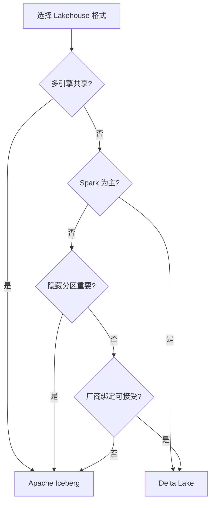
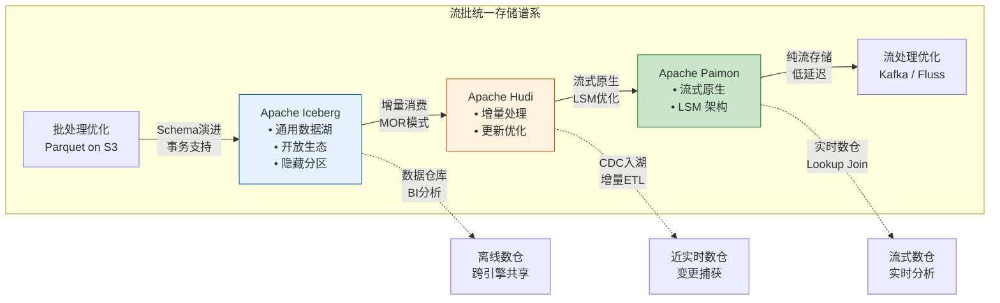
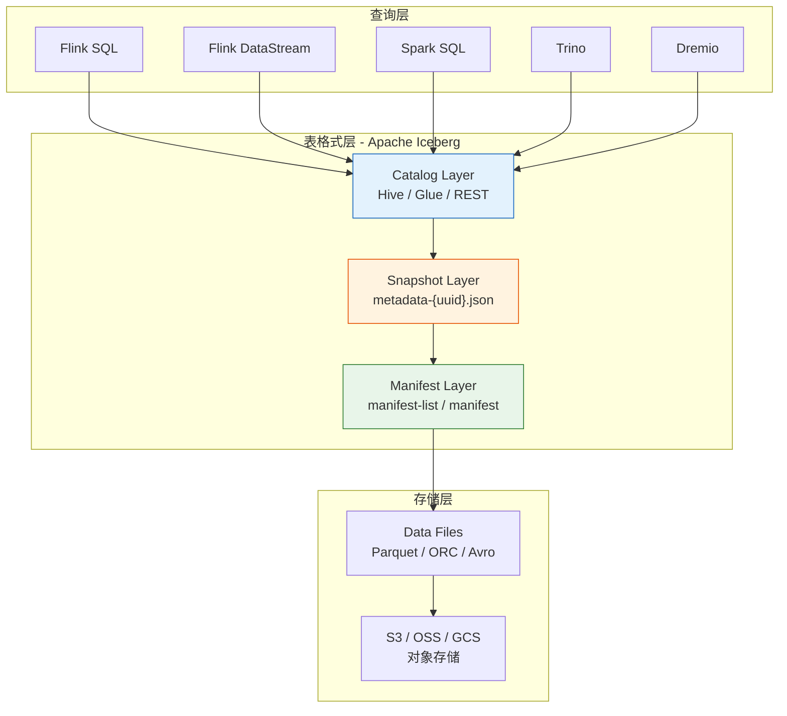
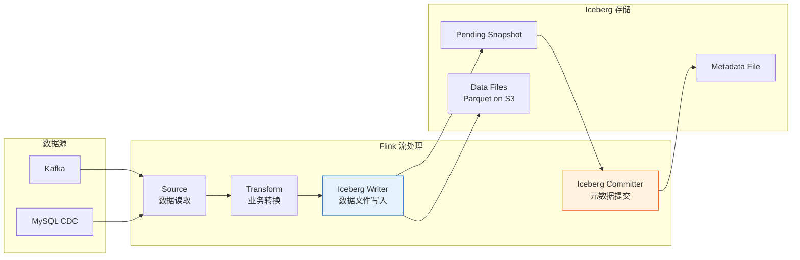
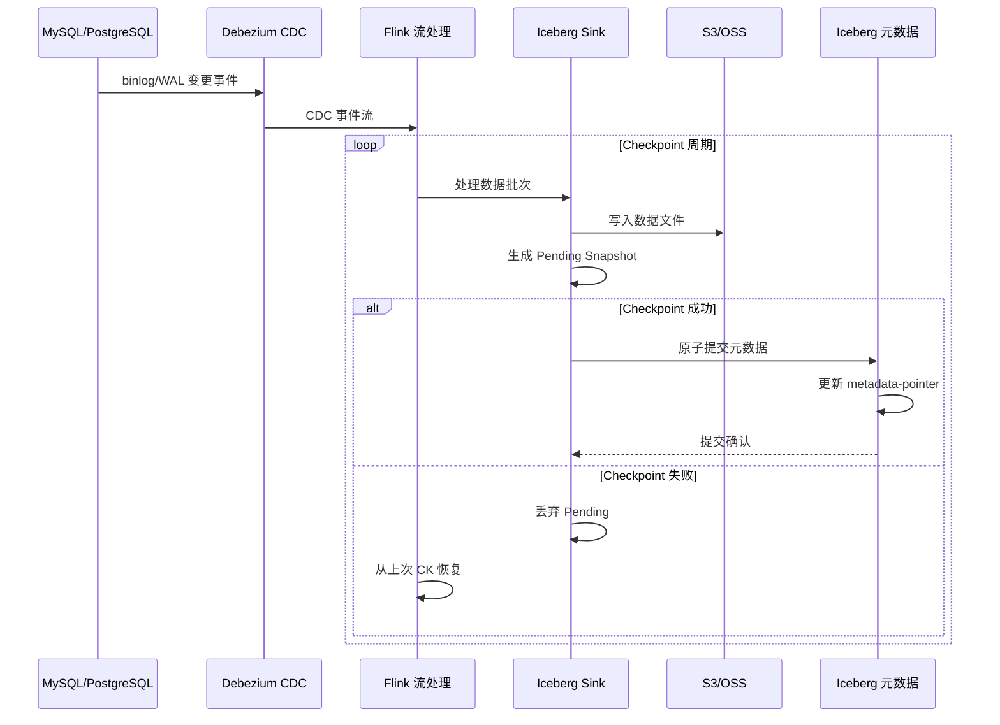
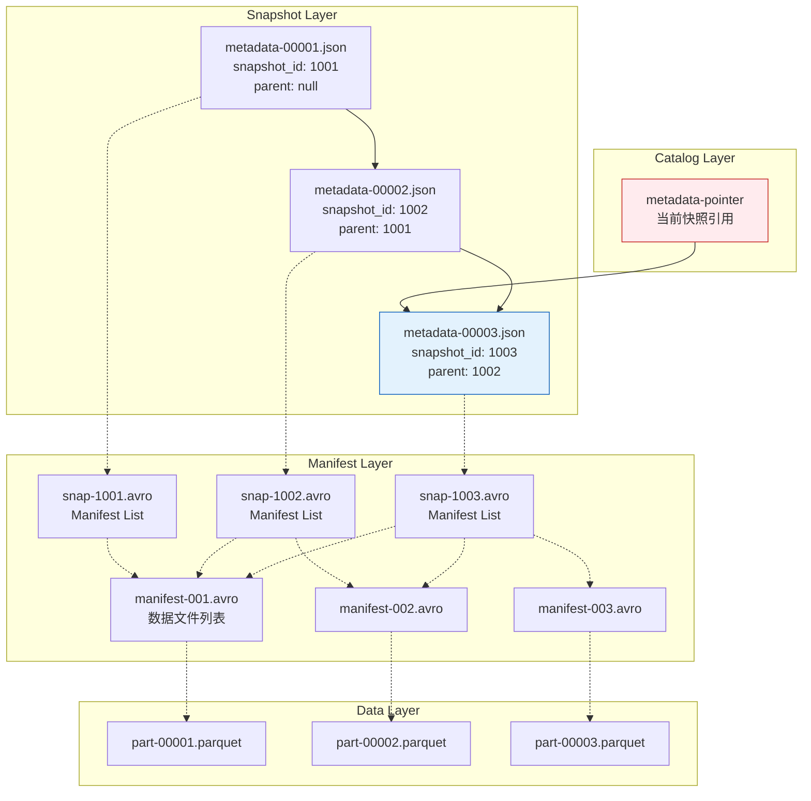

# Flink + Apache Iceberg 深度集成：开放 Lakehouse 表格式

> **所属阶段**: Flink/04-connectors | **前置依赖**: [04.04-cdc-debezium-integration.md](./04.04-cdc-debezium-integration.md), [flink-delta-lake-integration.md](./flink-delta-lake-integration.md) | **形式化等级**: L4-L5 | **版本**: Flink 1.17+, Iceberg 1.4+

---

## 1. 概念定义 (Definitions)

### Def-F-04-50: Iceberg 表格式形式化定义

**定义**: Apache Iceberg 是一种**开放表格式 (Open Table Format)**，通过分层元数据架构实现大规模数据集的 ACID 事务管理、模式演进和时间旅行查询，设计目标为**引擎无关性**和**云原生存储优化**。

**形式化结构**:

```
IcebergTable = ⟨Namespace, Schema, Snapshot, PartitionSpec, MetadataLayer, TableProperties⟩

其中:
- Namespace: 表的逻辑命名空间 (database.table)
- Schema: 列定义与类型系统,支持嵌套类型和演进
- Snapshot: 不可变的时间点表状态集合
- PartitionSpec: 分区策略定义(支持隐藏分区与分区演化)
- MetadataLayer: 三层元数据架构
- TableProperties: 表级配置参数集合
```

**三层元数据架构形式化**:

```
MetadataLayer = ⟨CatalogLayer, SnapshotLayer, ManifestLayer⟩

CatalogLayer:
  └── metadata-pointer → 当前最新快照的 metadata.json 位置 (原子更新)

SnapshotLayer (metadata-{uuid}.json):
  ├── snapshot_id: 唯一标识符 (64-bit long)
  ├── parent_snapshot_id: 父快照引用(形成 DAG 历史)
  ├── manifest_list: 指向 manifest-list-{uuid}.avro
  ├── schema_id: 当前快照使用的 schema 版本
  ├── partition_spec_id: 分区规范 ID
  └── timestamp_ms: 快照创建时间戳

ManifestLayer:
  ├── manifest-list.avro: manifest 文件列表,含分区范围统计
  │   └── 每个条目: (manifest_path, partition_spec, num_files, partitions)
  └── manifest.avro: 数据文件列表,含列级统计(min/max/null_count)
      └── 每个条目: (file_path, file_format, partition, record_count,
                     column_stats, sort_order_id)
```

**数据文件层级布局**:

```
Table Data Layout:
├── metadata/
│   ├── metadata-pointer → metadata-00003-{uuid}.json (当前)
│   ├── metadata-00001-{uuid}.json (快照 V1)
│   ├── metadata-00002-{uuid}.json (快照 V2)
│   ├── metadata-00003-{uuid}.json (快照 V3)
│   ├── snap-10001-{uuid}.avro (manifest list V1)
│   ├── snap-10002-{uuid}.avro (manifest list V2)
│   └── snap-10003-{uuid}.avro (manifest list V3)
└── data/
    ├── category=electronics/
    │   ├── 00001-3-{uuid}.parquet
    │   └── 00002-4-{uuid}.parquet
    ├── category=books/
    │   └── 00003-5-{uuid}.parquet
    └── category=clothing/
        └── 00004-6-{uuid}.parquet
```

---

### Def-F-04-51: Lakehouse 架构定义

**定义**: Lakehouse 是一种**统一数据架构范式**，将数据湖的低成本对象存储与数据仓库的 ACID 事务、数据质量管理能力结合，通过**开放表格式**实现存算分离。

**形式化定义**:

```
Lakehouse = ⟨StorageLayer, TableFormat, ComputeEngines, MetadataService, Governance⟩

其中:
- StorageLayer: 对象存储 (S3/ADLS/GCS/OSS/HDFS),提供低成本持久化
- TableFormat: 开放表格式 (Iceberg/Delta Lake/Hudi/Paimon)
- ComputeEngines: {Flink, Spark, Trino, Presto, Dremio, ...}
- MetadataService: 元数据服务 (Hive Metastore / Glue / REST Catalog)
- Governance: 权限控制、数据血缘、质量监控、合规审计
```

**Iceberg 在 Lakehouse 中的定位**:

| 特性 | Iceberg 实现 | 优势 |
|------|-------------|------|
| **开放标准** | 开源中立，Apache TLP | 无厂商锁定 |
| **引擎无关** | 支持多引擎并行访问 | 灵活选择计算引擎 |
| **云原生** | 针对对象存储优化 | 低存储成本 |
| **标准格式** | Parquet/ORC/Avro | 兼容现有生态 |

---

### Def-F-04-52: 隐藏分区 (Hidden Partitioning) 形式化

**定义**: Hidden Partitioning 是 Iceberg 的核心特性，允许数据按**派生列**分区，而无需用户显式创建分区列，实现分区策略的透明化和查询简化。

**形式化定义**:

```
隐藏分区函数: H: Domain(SourceColumn) → Domain(PartitionColumn)

常见隐藏分区变换函数:
- Year(ts):   TIMESTAMP → INT (年份,如 2024)
- Month(ts):  TIMESTAMP → INT (年月编码,如 202401)
- Day(ts):    TIMESTAMP → INT (日期,如 20240115)
- Hour(ts):   TIMESTAMP → INT (小时,如 2024011508)
- Bucket(n, col):  ANY → INT (哈希分桶,0..n-1)
- Truncate(w, col): STRING → STRING (前缀截断,如 truncate(3, 'abcde') = 'abc')

分区规范演化:
  PartitionSpec_v0 → PartitionSpec_v1 → PartitionSpec_v2
  (支持在线添加/删除分区字段,历史数据保持兼容)
```

**与传统 Hive 分区对比**:

| 特性 | Hive 分区 | Iceberg 隐藏分区 |
|------|-----------|------------------|
| **分区列可见性** | 显式列（如 `dt STRING`） | 透明（无物理列） |
| **分区值生成** | 用户负责（INSERT 时指定） | 自动派生（基于源列） |
| **分区演化** | 需重建表 | 支持在线变更 |
| **查询语法** | `WHERE dt='2024-01-01'` | `WHERE event_time >= '2024-01-01'` |
| **过滤下推** | 需指定分区列 | 自动转换并下推 |

---

### Def-F-04-53: 分区演化 (Partition Evolution) 形式化

**定义**: 分区演化允许在表生命周期内**动态修改分区策略**，新数据使用新策略分区，历史数据保持原有分区不变，通过分区规范版本管理实现向后兼容。

**形式化模型**:

```
分区规范历史: PS = [ps_0, ps_1, ..., ps_n]

其中每个 ps_i = ⟨spec_id, fields, source_schema_id⟩

数据文件 f 的分区归属:
  partition(f) = ps_k.fields.apply(f.data),
  其中 k = f.partition_spec_id

查询分区裁剪:
  对于查询 Q 的过滤条件 filter(Q),
  对每个 ps_k ∈ PS:
    若 filter(Q) 可与 ps_k 的变换函数交集,
    则裁剪该 spec 下的无关分区文件
```

**演化类型**:

| 演化操作 | 兼容性 | 影响范围 |
|----------|--------|----------|
| **添加分区字段** | 完全兼容 | 新数据使用新策略 |
| **删除分区字段** | 兼容读取 | 历史数据仍可按旧策略过滤 |
| **修改变换函数** | 创建新 spec | 新旧数据分区方式不同 |

---

### Def-F-04-54: 行级删除 (Row-Level Deletes) 形式化

**定义**: Iceberg 支持基于**位置删除文件 (Position Delete)** 和**等值删除文件 (Equality Delete)** 的行级删除，无需重写整个数据文件即可实现更新和删除操作。

**删除机制形式化**:

```
数据文件集合: D = {d_1, d_2, ..., d_n}
删除文件集合: Del = {del_pos, del_eq}

位置删除 (Position Delete):
  del_pos = {(file_path, row_position), ...}
  适用场景: 已知被删行的物理位置
  实现方式: 读取时过滤指定位置的行

等值删除 (Equality Delete):
  del_eq = {(equality_fields, values), ...}
  适用场景: 基于主键或等值条件的删除
  实现方式: 读取时根据等值条件过滤

有效数据:
  Effective(D, Del) = {r | r ∈ D ∧ r ∉ Del}
```

**删除模式对比**:

| 模式 | 写放大 | 读放大 | 适用场景 |
|------|--------|--------|----------|
| **Copy-on-Write** | 高（重写文件） | 低 | 读密集型 |
| **Merge-on-Read (Position Delete)** | 低 | 中 | 已知行位置 |
| **Merge-on-Read (Equality Delete)** | 低 | 高 | 主键删除/CDC |

---

### Def-F-04-55: Flink-Iceberg Source 语义

**定义**: Flink Iceberg Source 支持**批处理全量读取**和**流式增量读取**两种模式，利用快照隔离保证一致性，支持元数据驱动的分区裁剪和文件过滤。

**读取模式形式化**:

```
IcebergSource = ⟨SnapshotSelector, ReadMode, SchemaProjection, FilterPushdown⟩

批处理模式 (BATCH):
  Source(V_snapshot) = {f | f ∈ manifests(V_snapshot).files}
  全表扫描: 读取指定快照的所有数据文件

流式增量模式 (STREAMING):
  设快照序列: S = [s_0, s_1, ..., s_n]
  增量批次: Δ_i = files(s_i) \ files(s_{i-1})
  Source(V_start) = Stream of Δ_i where i > start_index

消费位点管理:
  消费者维护: (snapshot_id, consumed_files)
  故障恢复: 从 checkpoint 的 snapshot_id 重新扫描
```

**增量消费配置**:

| 参数 | 说明 | 默认值 |
|------|------|--------|
| `streaming` | 启用流式读取 | `false` |
| `monitor-interval` | 新快照检查间隔 | `10s` |
| `start-snapshot-id` | 起始快照 ID | `latest` |
| `start-tag` | 起始标签 | - |
| `end-snapshot-id` | 结束快照 ID（有限流） | - |

---

### Def-F-04-56: Flink-Iceberg Sink 语义

**定义**: Flink Iceberg Sink 通过**两阶段提交协议**实现端到端的 Exactly-Once 语义，支持流式写入的增量可见性和批量写入的快照隔离。

**流式写入语义形式化**:

```
设:
- Checkpoint 周期: T_chk
- 每个 Checkpoint 对应的事务: txn_i
- 数据文件集合写入: D_i = {d_i1, d_i2, ..., d_in}
- 元数据快照: S_i

事务提交序列:
  txn_1: D_1 → Pending Snapshot S_1 → Commit → Visible
  txn_2: D_2 → Pending Snapshot S_2 → Commit → Visible
  ...
  txn_n: D_n → Pending Snapshot S_n → Commit → Visible

可见性保证:
  ∀ t < T_commit(txn_i): Query(t) ∩ D_i = ∅
  ∀ t ≥ T_commit(txn_i): Query(t) ⊇ D_i
```

**两阶段提交流程**:

```
Phase 1 (Pre-commit):
  1. Writer Task 将数据编码为 Parquet/ORC 文件
  2. 上传数据文件到对象存储
  3. 生成 pending snapshot,记录文件列表
  4. 向 Coordinator 汇报 pending 信息

Phase 2 (Commit):
  触发条件: Checkpoint 成功(所有算子完成 preCommit)
  操作:
  1. Committer Task 按顺序提交 pending snapshots
  2. 原子更新 metadata-pointer(CAS 操作)
  3. 新快照立即可见
```

---

### Def-F-04-57: 时间旅行 (Time Travel) 形式化

**定义**: Time Travel 是 Iceberg 基于**不可变快照**实现的历史数据回溯能力，支持按快照 ID、时间戳或相对时间查询历史数据状态。

**时间旅行形式化模型**:

```
时间旅行查询:
  Q(t) = {r | r ∈ S(t).files, r.creation_time ≤ t}

  其中:
  - t: 目标时间戳或快照 ID
  - S(t): 时间 t 对应的快照
  - r: 数据记录

时间旅行类型:
  1. 基于快照 ID: Q(snapshot_id = sid)
  2. 基于时间戳: Q(timestamp_ms = ts)
  3. 基于相对时间: Q(as_of = "3 days ago")
  4. 基于标签: Q(tag = "monthly_backup_2024_01")

快照选择函数:
  snapshot(ts) = argmax_{s ∈ Snapshots} {s.timestamp_ms ≤ ts}
```

---

## 2. 属性推导 (Properties)

### Lemma-F-04-50: Iceberg 快照的不可变性与线性历史

**引理**: Iceberg 的快照一旦创建即为不可变对象，且快照历史形成严格的偏序关系。

**证明**:

```
给定:
- 快照创建操作: create_snapshot(parent, files) → snapshot
- 快照提交操作: commit(snapshot) → 元数据原子更新

不可变性证明:
  设快照 s = (id, parent_id, manifest_list, timestamp)
  由于 manifest_list 引用的是不可变的 Avro 文件,
  且元数据 JSON 文件写入后不可修改(对象存储语义),
  ∴ s 的所有字段在创建后不可变更。

线性历史证明:
  定义偏序关系 ≤: s_i ≤ s_j  iff  s_j 可通过 parent 链追溯到 s_i

  自反性: s ≤ s (显然成立)

  反对称性: 若 s_i ≤ s_j 且 s_j ≤ s_i,
           则 s_i.parent* = s_j 且 s_j.parent* = s_i
           由于 parent 关系是 DAG,不存在环路,
           ∴ s_i = s_j

  传递性: 若 s_i ≤ s_j 且 s_j ≤ s_k,
         则 s_k.parent* = s_j, s_j.parent* = s_i
         ∴ s_k.parent* = s_i,即 s_i ≤ s_k

  ∴ 快照历史构成偏序集 (V, ≤) ∎
```

---

### Lemma-F-04-51: 隐藏分区的查询透明性

**引理**: Iceberg 隐藏分区对用户查询透明，查询优化器自动将源列过滤条件转换为分区过滤条件。

**证明概要**:

```
设分区规范包含隐藏分区: H(source_col) → partition_col

用户查询过滤: WHERE source_col OP value

优化器转换:
  1. 识别可逆变换: H^{-1}(H(value_range)) ⊆ value_range
  2. 生成分区过滤: WHERE partition_col IN H(valid_values)
  3. 文件级裁剪: 仅扫描匹配分区的数据文件

由于 H 是确定性函数,变换结果正确且完备。
```

---

### Lemma-F-04-52: 增量消费完备性

**引理**: Flink 从 Iceberg 的增量消费保证**不遗漏**、**不重复**、**有序**三大性质。

**证明**:

```
定义:
- 快照序列: S = [s_1, s_2, ..., s_n],其中 s_i.parent = s_{i-1}
- 消费者位点: c = 当前消费到的 snapshot_id
- 增量批次: B_i = scan_incremental(s_i, s_{i+1})

不遗漏证明:
  需证: ∀ record r ∈ Table, ∃ B_i: r ∈ B_i
  由于 Iceberg 表的所有数据都存在于某个快照中,
  且快照序列 S 覆盖了表的全部历史,
  设 r ∈ s_k.files,则当消费者从 s_{k-1} 消费到 s_k 时,
  r ∈ B_{k-1}
  ∴ 不遗漏 ∎

不重复证明:
  需证: ∀ record r, |{B_i | r ∈ B_i}| ≤ 1
  由于 Iceberg 快照的不可变性,
  一旦 r 被写入 s_k,则 ∀ s_j (j ≥ k): r ∈ s_j.files
  增量扫描算法: B_i = files(s_{i+1}) \ files(s_i)
  对于 r ∈ s_k:
  - 若 i+1 < k: r ∉ files(s_{i+1}),∴ r ∉ B_i
  - 若 i+1 = k: r ∈ files(s_k) 且 r ∉ files(s_{k-1}),∴ r ∈ B_{k-1}
  - 若 i+1 > k: r ∈ files(s_i) 且 r ∈ files(s_{i+1}),∴ r ∉ B_i
  ∴ r 仅出现在 B_{k-1} 中,不重复 ∎

有序性证明:
  需证: ∀ i < j, ∀ r_i ∈ B_i, r_j ∈ B_j: order(r_i) < order(r_j)
  由于快照序列按 commit_time 排序,
  且数据文件在快照中的可见性与 commit_time 一致,
  若 r_i ∈ B_i = scan(s_i, s_{i+1}),
     r_j ∈ B_j = scan(s_j, s_{j+1}),
     且 i < j
  则 r_i 的 commit_time < r_j 的 commit_time
  ∴ 有序性得证 ∎
```

---

### Prop-F-04-50: Flink 流式写入的幂等性保证

**命题**: 在 Flink Checkpoint 失败并重启的场景下，Iceberg Sink 的写入操作具有幂等性，不会导致重复数据。

**推导**:

```
场景设定:
- Checkpoint N 触发,Iceberg Sink 进入 preCommit 阶段
- 写入数据文件到临时位置,生成 pending snapshot
- Checkpoint N 失败,作业重启

幂等性保证:
┌─────────────────────────────────────────────────────────────┐
│ Step 1: 重启后从 Checkpoint N-1 恢复                        │
│                                                             │
│ Step 2: 重新处理数据,再次触发 preCommit                    │
│         - 相同输入数据 → 相同数据文件内容                     │
│         - Iceberg 文件命名包含 UUID,新文件路径不同           │
│                                                             │
│ Step 3: Checkpoint N 成功,调用 commit                      │
│         - 新 snapshot 提交成功                              │
│         - 旧 pending snapshot 无人引用,成为孤儿             │
│                                                             │
│ Step 4: 孤儿文件清理作业定期删除未引用文件                    │
│         - 临时数据文件被清理                                │
└─────────────────────────────────────────────────────────────┘

结论: 即使 Checkpoint 多次失败重试,最终数据不重复 ∎
```

---

### Prop-F-04-51: CDC 到 Iceberg 的变更合并一致性

**命题**: 通过 Flink CDC 将 MySQL/PostgreSQL 变更同步到 Iceberg 时，基于主键的 Upsert 操作保证最终一致性。

**形式化推导**:

```
设 CDC 事件流: E = [e_1, e_2, ..., e_n]
其中 e_i = (op, key, ts, data), op ∈ {INSERT, UPDATE, DELETE}

变更应用规则:
  INSERT: 若 key 不存在,插入 data;若存在,根据策略忽略或报错
  UPDATE: 若 key 存在,更新为 data;若不存在,视为 INSERT
  DELETE: 若 key 存在,删除;若不存在,忽略

最终一致性条件:
  设源数据库在 T 时刻的状态为 S_source(T)
  Iceberg 表在应用完所有 ts ≤ T 的事件后状态为 S_iceberg
  则 S_iceberg = S_source(T)

证明概要:
  1. CDC 连接器保证事件按 binlog/WAL 顺序输出
  2. Flink 按事件时间顺序处理(Watermark 对齐)
  3. Iceberg Sink 按 Checkpoint 顺序提交,保证事件顺序
  4. 基于主键的 Upsert 保证相同 key 的变更按序应用
  ∴ 最终一致性成立 ∎
```

---

## 3. 关系建立 (Relations)

### 3.1 Iceberg vs Delta Lake 功能对比矩阵

| 对比维度 | Apache Iceberg | Delta Lake | 关键差异 |
|----------|---------------|------------|----------|
| **诞生背景** | Netflix/Apple (2018) | Databricks (2019) | Iceberg 开源中立，Delta 厂商驱动 |
| **开源协议** | Apache 2.0 | Apache 2.0 | 协议相同 |
| **引擎支持** | Flink/Spark/Trino/Dremio/Hive | Spark(原生)/Flink/Trino | Iceberg 引擎无关性更强 |
| **存储格式** | Parquet/ORC/Avro | Parquet (主要) | Iceberg 格式更灵活 |
| **隐藏分区** | **原生支持** | 有限支持 | Iceberg 查询更透明 |
| **分区演化** | **支持** | 支持 | 两者均支持 |
| **删除向量** | **Position + Equality Delete** | Deletion Vectors (V4+) | Iceberg 更早支持行级删除 |
| **元数据服务** | Hive/ Glue/ REST/ JDBC | DBFS/S3/ADLS | Iceberg Catalog 更灵活 |
| **时间旅行** | 完整支持 | 完整支持 | 功能对等 |
| **CDC 生产** | 需外部转换 | 需外部转换 | 均依赖 Flink/Spark |
| **视图支持** | 支持 | 支持 | 功能对等 |
| **分支/标签** | **支持** | 支持 | 两者均支持 |
| **生态成熟度** | ⭐⭐⭐⭐⭐ | ⭐⭐⭐⭐ | Iceberg 社区更大 |

**选型决策树**:



---

### 3.2 Iceberg vs Apache Hudi 对比关系

| 对比维度 | Apache Iceberg | Apache Hudi | 影响分析 |
|----------|---------------|-------------|----------|
| **核心设计** | 表格式规范优先 | 存储引擎能力优先 | Iceberg 更开放，Hudi 功能更完整 |
| **更新模式** | Copy-on-Write / MOR | MOR / COW 原生 | Hudi MOR 写放大更低 |
| **增量查询** | 基于快照差集 | 基于时间线服务 | Hudi 增量消费更成熟 |
| **Compaction** | 外部调度（Spark/Flink） | 内置服务 | Hudi 运维更简单 |
| **Flink 集成** | 连接器模式 | 连接器模式 | Iceberg 社区更大 |
| **并发控制** | Optimistic Concurrency | MVCC | Hudi 并发写入更优 |
| **时间旅行** | 完整快照历史 | 基于时间线 | 两者功能对等 |
| **小文件管理** | 需外部优化 | 自动合并 | Hudi 更省心 |

---

### 3.3 Iceberg vs Apache Paimon 对比关系

| 对比维度 | Apache Iceberg | Apache Paimon | 关键差异 |
|----------|---------------|---------------|----------|
| **定位** | 通用开放表格式 | Flink 原生流批存储 | Paimon 更专注流场景 |
| **存储模型** | 不可变文件集 | LSM Tree + 文件 | Paimon 支持实时更新 |
| **流式延迟** | 分钟级（Checkpoint） | 秒级（异步 Compaction） | Paimon 延迟更低 |
| **Lookup Join** | 有限支持 | **原生支持** | Paimon 更适合维表 |
| **Changelog 生产** | 外部转换 | **内置支持** | Paimon CDC 更高效 |
| **社区归属** | Apache TLP | Apache Incubator | Iceberg 更成熟 |
| **生态广度** | Spark/Flink/Trino/Dremio | 主要为 Flink | Iceberg 生态更广 |

---

### 3.4 流批统一存储谱系关系



---

## 4. 论证过程 (Argumentation)

### 4.1 Lakehouse 架构选型论证

**传统 Lambda 架构的问题**:

```
Lambda 架构痛点:
┌─────────────────────────────────────────────────────────────┐
│  流处理层 (Kafka + Flink)                                    │
│  ├── 低延迟,但存储成本高(SSD/内存)                         │
│  └── 数据保留期短(天级)                                    │
│                                                             │
│  批处理层 (Hive + Spark)                                     │
│  ├── 低成本对象存储(S3/OSS)                                │
│  └── 数据保留期长(年级)                                    │
│                                                             │
│  问题:                                                       │
│  1. 数据冗余: 同一份数据存两份                               │
│  2. Schema 分裂: 流 Schema ≠ 批 Schema                       │
│  3. 结果不一致: 流统计 ≠ 批统计(让用户困惑)                 │
└─────────────────────────────────────────────────────────────┘

Iceberg 统一方案:
┌─────────────────────────────────────────────────────────────┐
│  统一存储层 (Iceberg on S3)                                  │
│  ├── 流写入: Flink Checkpoint 提交事务                       │
│  ├── 批查询: Spark/Trino 全表扫描                            │
│  └── 增量消费: Flink 流读变更数据                            │
│                                                             │
│  优势:                                                       │
│  1. 单一真相源: 一份数据,多种访问模式                        │
│  2. Schema 统一: 元数据层统一管理                            │
│  3. 结果一致: 相同快照保证相同结果                            │
│  4. 隐藏分区: 查询透明,无需指定分区列                        │
│  5. 时间旅行: 支持回溯重算和审计                             │
└─────────────────────────────────────────────────────────────┘
```

---

### 4.2 为何选择 Iceberg 作为 Lakehouse 格式

**核心优势论证**:

| 优势维度 | 技术实现 | 业务价值 |
|----------|----------|----------|
| **引擎无关性** | 开放表格式规范 | 避免厂商锁定，自由选择计算引擎 |
| **隐藏分区** | 分区变换函数透明化 | 简化查询，降低用户门槛 |
| **分区演化** | 在线修改分区策略 | 适应业务变化，无需重建表 |
| **行级删除** | Position/Equality Delete | 支持 CDC 和 GDPR 合规删除 |
| **元数据优化** | 分层元数据 + 统计信息 | 快速查询规划，减少 I/O |

---

### 4.3 Iceberg 流式写入的性能边界

**性能影响因素分析**:

| 因素 | 影响机制 | 优化策略 |
|------|----------|----------|
| **Checkpoint 间隔** | 决定事务提交频率 | 平衡延迟与吞吐（推荐 30s-5min） |
| **文件大小** | 影响扫描效率 | 目标 128MB/256MB |
| **分区粒度** | 影响文件数量和元数据大小 | 避免过细分区 |
| **并发写入** | 乐观并发控制可能冲突 | 使用独立分区或序列化写入 |
| **小文件数量** | 影响元数据扫描和读取性能 | 定期 Compaction |

**性能边界量化**:

```
场景: 10,000 条/秒写入,平均记录大小 1KB

配置参数:
- Checkpoint 间隔: 60s
- 目标文件大小: 128MB
- 分区策略: 按天分区

理论计算:
- 每 Checkpoint 数据量: 10,000 × 60 × 1KB = 600MB
- 每 Checkpoint 生成文件数: 600MB / 128MB ≈ 5 个文件
- 每小时生成文件数: 5 × 60 = 300 个文件/小时
- 每天生成文件数: 300 × 24 = 7,200 个文件/天

边界约束:
- Iceberg 元数据文件建议 < 100MB
- 单个 manifest 文件可引用约 50,000 个数据文件
- ∴ 单表可支持约 50,000 × 文件滚动周期 的数据量
```

---

### 4.4 UPSERT vs Append 模式选择

**形式化对比**:

```
Append 模式:
  操作: T_append(R) = Table ∪ R
  特性: 仅追加,不可变
  适用: 事件流、日志、时序数据

UPSERT 模式 (基于 Equality Delete):
  操作: T_upsert(K, R) = (Table \ {r | r.K = R.K}) ∪ {R}
  特性: 按主键更新,支持删除
  适用: CDC 同步、维度表、状态表
```

**实现机制对比**:

| 维度 | Append 模式 | UPSERT 模式 |
|------|-------------|-------------|
| **写入路径** | 直接追加数据文件 | 数据文件 + Equality Delete 文件 |
| **读取开销** | 无额外开销 | 需合并 Delete 文件过滤 |
| **Compaction** | 简单文件合并 | 需处理 Delete 文件合并 |
| **延迟** | Checkpoint 间隔 | Checkpoint 间隔 + 合并延迟 |
| **存储放大** | 1x | 1.2-2x（含 Delete 文件） |

**选择决策矩阵**:

```
IF 数据源是 CDC (MySQL/PostgreSQL):
    IF 表有主键 AND 需要更新/删除:
        → UPSERT 模式
    ELSE:
        → Append 模式
ELSE IF 数据源是事件流 (Kafka):
    → Append 模式(事件天然追加)
ELSE IF 需要维护最新状态:
    → UPSERT 模式 + 定期 Compaction
ELSE:
    → Append 模式(默认,性能最优)
```

---

## 5. 形式证明 / 工程论证 (Proof / Engineering Argument)

### Thm-F-04-40: Flink + Iceberg 端到端 Exactly-Once 语义定理

**定理**: 在 Flink 与 Iceberg 的集成中，通过两阶段提交协议，可以保证端到端的 Exactly-Once 处理语义。

**证明**:

```
前提假设:
- P1: Flink Checkpoint 机制保证作业状态的 Exactly-Once
- P2: Iceberg 元数据更新是原子操作(基于对象存储的 put-if-absent)
- P3: 数据文件写入和元数据提交满足因果序

两阶段提交流程形式化:
┌────────────────────────────────────────────────────────────────────┐
│ Phase 1: Pre-commit                                               │
│ ───────────────────────────────────────────────────────────────── │
│ 输入: 待写入数据记录集合 R = {r_1, r_2, ..., r_n}                  │
│                                                                  │
│ 操作:                                                             │
│ 1. Writer 将 R 编码为数据文件集合 F = encode(R)                    │
│ 2. 将 F 写入对象存储的临时位置                                      │
│ 3. 生成 pending snapshot P = (parent, manifest_list(F))           │
│ 4. 向 Coordinator 汇报 P 和写入的文件列表                           │
│                                                                  │
│ 不变式 I1: F 已持久化到对象存储,但尚未被任何查询可见               │
└────────────────────────────────────────────────────────────────────┘

┌────────────────────────────────────────────────────────────────────┐
│ Phase 2: Commit                                                   │
│ ───────────────────────────────────────────────────────────────── │
│ 触发条件: Checkpoint 成功(所有算子完成 preCommit)               │
│                                                                  │
│ 操作:                                                             │
│ 1. Committer 按 Checkpoint 顺序提交 pending snapshots             │
│ 2. 对 P 执行 commit_transaction():                                │
│    a. 读取当前 metadata-pointer 指向的 M_current                  │
│    b. 基于 M_current 创建新的 metadata M_new,包含 P               │
│    c. 原子更新 metadata-pointer → M_new(CAS 操作)               │
│ 3. 通知 Coordinator 提交完成                                      │
│                                                                  │
│ 不变式 I2: P 已永久成为表历史的一部分,查询可见                    │
└────────────────────────────────────────────────────────────────────┘

故障恢复分析:
Case 1: Checkpoint 失败,Phase 2 未执行
  - pending snapshot P 未被提交
  - 作业从上一个成功 Checkpoint 恢复
  - R 被重新处理,生成新的 P'
  - 由于 I1,P 中的文件不影响正确性

Case 2: Commit 过程中 Committer 失败
  - 部分 P 可能已提交,部分未提交
  - 新的 Committer 从 Checkpoint 恢复
  - 对未提交的 P 重新执行 commit_transaction()
  - Iceberg 的 CAS 保证幂等性(重复提交同一 P 无影响)

Case 3: Writer 失败,数据文件写入不完整
  - Checkpoint 失败,进入 Case 1
  - 孤儿文件由后台清理作业处理

综上,端到端 Exactly-Once 得证 ∎
```

---

### Thm-F-04-41: 隐藏分区优化有效性定理

**定理**: Iceberg 隐藏分区通过查询重写实现分区裁剪，可显著减少扫描数据量。

**证明**:

```
设:
- 源列: event_time (TIMESTAMP)
- 隐藏分区: day(event_time) → dt (INT)
- 总数据文件数: N
- 分区数: P
- 查询时间范围: [T_start, T_end]
- 涉及天数: D = day(T_end) - day(T_start) + 1

传统方式(无隐藏分区):
  扫描文件数: N_full = N
  I/O 成本: O(N)

隐藏分区优化:
  查询转换:
    WHERE event_time >= '2024-01-01' AND event_time < '2024-01-02'
    ↓ 优化器重写
    WHERE dt = 20240101

  扫描文件数: N_pruned = N × (D / P) = N × (1 / P_per_day)
  假设均匀分布: N_pruned ≈ N × D / P

  对于单日查询 (D=1):
    N_pruned = N / P
    优化比: η = N_pruned / N = 1/P

示例:
  若按天分区 (P=365),单日查询:
    η = 1/365 ≈ 0.27%
    I/O 减少: 99.73%

因此隐藏分区优化有效 ∎
```

---

### Thm-F-04-42: CDC 到 Iceberg 的一致性定理

**定理**: Flink CDC 将 MySQL/PostgreSQL 变更同步到 Iceberg 时，基于主键的 Upsert 操作保证最终一致性和幂等性。

**证明**:

```
定义:
- 源数据库状态: S_source(t)
- Iceberg 表状态: S_iceberg(t)
- CDC 事件流: E = [(op_1, k_1, ts_1, v_1), ..., (op_n, k_n, ts_n, v_n)]
- 事件应用函数: apply(S, e) → S'

最终一致性:
  需证: 对于任意时间 T,
        S_iceberg(T) = S_source(T)
        其中 S_iceberg(T) = apply_all(S_0, {e | e.ts ≤ T})

证明:
  1. CDC 连接器(Debezium)保证:
     - 事件按 binlog/WAL 顺序输出
     - 每个事件包含唯一的 LSN (Log Sequence Number)
     - 事件不丢失、不重复

  2. Flink 处理保证:
     - 事件按 ts 排序处理(Watermark 对齐)
     - Checkpoint 保证状态一致性

  3. Iceberg Upsert 保证:
     - 基于主键的去重/更新
     - 相同 key 的变更按序应用

  4. 由 1-3,对于任意 key k:
     设 E_k = {e ∈ E | e.key = k},按 ts 排序
     apply_all 的结果等于源库对 k 的最终状态

  ∴ S_iceberg(T) = S_source(T) ∎

幂等性:
  对于重复事件 e = (op, k, ts, v):
  - INSERT: 若 k 存在,无变化(或报错)
  - UPDATE: 更新为相同值,无变化
  - DELETE: 删除不存在的数据,无变化
  ∴ 幂等性成立 ∎
```

---

### Thm-F-04-43: Iceberg vs Delta Lake 选型论证

**工程论证**: 在多引擎共享场景下，Iceberg 相比 Delta Lake 具有更好的开放性和兼容性。

**论证过程**:

```
评估维度:
┌─────────────────────────────────────────────────────────────────┐
│ 1. 引擎兼容性                                                   │
│    Iceberg: Flink/Spark/Trino/Dremio/Presto/Hive/DuckDB        │
│    Delta:   Spark(原生)/Flink(有限)/Trino(有限)                 │
│    结论: Iceberg 在多引擎环境更有优势                          │
├─────────────────────────────────────────────────────────────────┤
│ 2. 隐藏分区                                                     │
│    Iceberg: 原生支持,查询透明                                  │
│    Delta:   有限支持,需显式指定分区列                          │
│    结论: Iceberg 用户学习成本更低                               │
├─────────────────────────────────────────────────────────────────┤
│ 3. 行级删除                                                     │
│    Iceberg: Position + Equality Delete 完整支持                 │
│    Delta:   Deletion Vectors (V4+)                              │
│    结论: Iceberg 更早成熟支持 CDC 场景                          │
├─────────────────────────────────────────────────────────────────┤
│ 4. 厂商锁定风险                                                 │
│    Iceberg: 开源中立,Apache TLP                                │
│    Delta:   Databricks 主导,功能优先在 Databricks 平台         │
│    结论: Iceberg 更利于长期技术战略                            │
├─────────────────────────────────────────────────────────────────┤
│ 5. 社区生态                                                     │
│    Iceberg: 更大社区,更多贡献者                                │
│    Delta:   社区相对集中                                        │
│    结论: Iceberg 生态更活跃                                     │
└─────────────────────────────────────────────────────────────────┘

推荐场景:
- 多引擎共享 → Iceberg
- 纯 Spark 环境 → Delta Lake (功能更完整)
- 需要隐藏分区 → Iceberg
- Databricks 平台 → Delta Lake
```

---

## 6. 实例验证 (Examples)

### 6.1 Flink SQL 完整示例

#### 6.1.1 创建 Iceberg Catalog 和表

```sql
-- ============================================
-- 步骤 1: 创建 Iceberg Catalog
-- ============================================
CREATE CATALOG iceberg_catalog WITH (
    'type' = 'iceberg',
    'catalog-type' = 'hive',  -- 或 'hadoop', 'rest', 'jdbc'
    'uri' = 'thrift://hive-metastore:9083',
    'warehouse' = 'oss://my-bucket/iceberg-warehouse',
    'io-impl' = 'org.apache.iceberg.aliyun.oss.OSSFileIO'
);

USE CATALOG iceberg_catalog;
CREATE DATABASE IF NOT EXISTS ecommerce;
USE ecommerce;

-- ============================================
-- 步骤 2: 创建 Iceberg 表(支持流式读写)
-- ============================================
CREATE TABLE IF NOT EXISTS user_orders (
    order_id STRING,
    user_id STRING,
    product_id STRING,
    amount DECIMAL(18, 2),
    status STRING,
    order_time TIMESTAMP(3),
    PRIMARY KEY (order_id) NOT ENFORCED
) PARTITIONED BY (
    -- 隐藏分区: 按天自动派生,无需显式 dt 列
    days(order_time),
    -- 哈希分桶: 优化 user_id 查询
    bucket(16, user_id)
) WITH (
    -- 写入配置
    'write.format.default' = 'parquet',
    'write.parquet.compression-codec' = 'zstd',
    'write.parquet.compression-level' = '3',
    'write.target-file-size-bytes' = '134217728',  -- 128MB

    -- 元数据配置
    'commit.manifest.min-count-to-merge' = '5',
    'commit.manifest-merge-enabled' = 'true',

    -- 快照保留策略
    'history.expire.max-snapshot-age-ms' = '604800000',  -- 7天
    'history.expire.min-snapshots-to-keep' = '5',

    -- 流读配置
    'read.streaming.enabled' = 'true',
    'read.streaming.start-mode' = 'earliest',
    'monitor-interval' = '10s'
);
```

#### 6.1.2 流式写入数据

```sql
-- ============================================
-- 步骤 3: 从 Kafka 流式写入 Iceberg
-- ============================================

-- 创建 Kafka Source 表
CREATE TABLE kafka_orders (
    order_id STRING,
    user_id STRING,
    product_id STRING,
    amount DECIMAL(18, 2),
    status STRING,
    order_time TIMESTAMP(3),
    WATERMARK FOR order_time AS order_time - INTERVAL '5' SECOND
) WITH (
    'connector' = 'kafka',
    'topic' = 'orders',
    'properties.bootstrap.servers' = 'kafka:9092',
    'properties.group.id' = 'iceberg-sink-group',
    'scan.startup.mode' = 'earliest-offset',
    'format' = 'json',
    'json.fail-on-missing-field' = 'false',
    'json.ignore-parse-errors' = 'true'
);

-- 启动流式写入作业
INSERT INTO user_orders
SELECT order_id, user_id, product_id, amount, status, order_time
FROM kafka_orders;
```

#### 6.1.3 CDC 数据入湖（Upsert 模式）

```sql
-- ============================================
-- 步骤 4: MySQL CDC → Iceberg(Upsert 模式)
-- ============================================

-- CDC Source 表
CREATE TABLE mysql_orders_cdc (
    order_id STRING,
    user_id STRING,
    product_id STRING,
    amount DECIMAL(18, 2),
    status STRING,
    order_time TIMESTAMP(3),
    PRIMARY KEY (order_id) NOT ENFORCED
) WITH (
    'connector' = 'mysql-cdc',
    'hostname' = 'mysql-host',
    'port' = '3306',
    'username' = 'flink_user',
    'password' = '${MYSQL_PASSWORD}',
    'database-name' = 'ecommerce',
    'table-name' = 'orders',
    'server-time-zone' = 'Asia/Shanghai',
    -- 增量快照配置
    'scan.incremental.snapshot.enabled' = 'true',
    'scan.incremental.snapshot.chunk.size' = '8096'
);

-- 启用 UPSERT 模式写入 Iceberg
SET 'execution.checkpointing.interval' = '60s';

INSERT INTO user_orders
SELECT * FROM mysql_orders_cdc;
```

#### 6.1.4 流式读取 Iceberg

```sql
-- ============================================
-- 步骤 5: 增量消费 Iceberg 数据
-- ============================================

-- 创建流式读取视图
SET 'execution.runtime-mode' = 'streaming';

-- SQL 增量消费
SELECT
    order_id,
    user_id,
    amount,
    status,
    order_time,
    -- Iceberg 元数据列
    __iceberg_file_path,
    __iceberg_pos,
    __iceberg_spec_id
FROM user_orders
/*+ OPTIONS(
    'streaming' = 'true',
    'monitor-interval' = '5s',
    'start-snapshot-id' = '1234567890'
) */;

-- 消费变更数据(CDC 模式)
CREATE TABLE iceberg_orders_changes (
    order_id STRING,
    user_id STRING,
    amount DECIMAL(18, 2),
    status STRING,
    order_time TIMESTAMP(3),
    _change_type STRING,  -- INSERT, UPDATE_BEFORE, UPDATE_AFTER, DELETE
    _change_timestamp TIMESTAMP(3)
) WITH (
    'connector' = 'iceberg',
    'catalog-name' = 'iceberg_catalog',
    'catalog-database' = 'ecommerce',
    'catalog-table' = 'user_orders',
    'streaming' = 'true',
    'streaming-scheme' = 'incremental-snapshot',
    'monitor-interval' = '10s'
);

-- 将变更数据写入下游 Kafka
INSERT INTO kafka_order_changes
SELECT
    order_id,
    user_id,
    amount,
    status,
    CASE _change_type
        WHEN 'INSERT' THEN 'CREATED'
        WHEN 'UPDATE_AFTER' THEN 'UPDATED'
        WHEN 'DELETE' THEN 'DELETED'
    END AS event_type,
    _change_timestamp
FROM iceberg_orders_changes
WHERE _change_type IN ('INSERT', 'UPDATE_AFTER', 'DELETE');
```

#### 6.1.5 时间旅行查询

```sql
-- ============================================
-- 步骤 6: Time Travel 时间旅行查询
-- ============================================

-- 查询历史快照列表
SELECT * FROM user_orders$snapshots;

-- 查看标签
SELECT * FROM user_orders$tags;

-- 基于快照 ID 查询
SELECT * FROM user_orders FOR SYSTEM_VERSION AS OF 1234567890123;

-- 基于时间戳查询
SELECT * FROM user_orders
FOR SYSTEM_TIME AS OF TIMESTAMP '2026-03-01 00:00:00';

-- 基于相对时间查询
SELECT * FROM user_orders
FOR SYSTEM_TIME AS OF TIMESTAMP '2026-04-02 00:00:00' - INTERVAL '7' DAY;

-- 基于标签查询
SELECT * FROM user_orders FOR SYSTEM_VERSION AS OF 'monthly_backup_2024_01';

-- 流处理中使用 Time Travel(回溯重算)
INSERT INTO result_table
SELECT
    DATE_FORMAT(order_time, 'yyyy-MM-dd') AS dt,
    COUNT(*) AS order_count,
    SUM(amount) AS total_amount
FROM user_orders
FOR SYSTEM_TIME AS OF TIMESTAMP '2026-03-15 00:00:00'
WHERE order_time >= TIMESTAMP '2026-03-01 00:00:00'
GROUP BY DATE_FORMAT(order_time, 'yyyy-MM-dd');
```

---

### 6.2 DataStream API 完整示例

#### 6.2.1 流式写入 Iceberg

```java
import org.apache.flink.streaming.api.datastream.DataStream;
import org.apache.flink.streaming.api.environment.StreamExecutionEnvironment;
import org.apache.flink.table.data.RowData;
import org.apache.iceberg.flink.FlinkCatalog;
import org.apache.iceberg.flink.sink.FlinkSink;
import org.apache.iceberg.Table;
import org.apache.iceberg.catalog.Catalog;
import org.apache.iceberg.catalog.TableIdentifier;
import org.apache.iceberg.hive.HiveCatalog;
import org.apache.iceberg.Schema;
import org.apache.iceberg.types.Types;
import org.apache.hadoop.hive.conf.HiveConf;

import org.apache.flink.streaming.api.CheckpointingMode;
import org.apache.flink.api.common.typeinfo.Types;


public class IcebergStreamWriteExample {

    public static void main(String[] args) throws Exception {
        StreamExecutionEnvironment env =
            StreamExecutionEnvironment.getExecutionEnvironment();

        // 启用 Checkpoint,这是 Exactly-Once 的前提
        env.enableCheckpointing(60000);  // 60 秒
        env.getCheckpointConfig().setCheckpointingMode(
            CheckpointingMode.EXACTLY_ONCE);
        env.getCheckpointConfig().setMinPauseBetweenCheckpoints(30000);

        // ============================================
        // 步骤 1: 初始化 Iceberg Catalog
        // ============================================
        HiveConf hiveConf = new HiveConf();
        hiveConf.set("hive.metastore.uris", "thrift://hive-metastore:9083");

        Catalog catalog = new HiveCatalog(
            "iceberg_catalog",
            null,
            hiveConf,
            "oss://my-bucket/iceberg-warehouse"
        );

        // 加载或创建表
        TableIdentifier tableId = TableIdentifier.of("ecommerce", "user_orders");
        Table table;
        if (!catalog.tableExists(tableId)) {
            // 定义 Schema
            Schema schema = new Schema(
                Types.NestedField.required(1, "order_id", Types.StringType.get()),
                Types.NestedField.required(2, "user_id", Types.StringType.get()),
                Types.NestedField.optional(3, "product_id", Types.StringType.get()),
                Types.NestedField.optional(4, "amount", Types.DecimalType.of(18, 2)),
                Types.NestedField.optional(5, "status", Types.StringType.get()),
                Types.NestedField.optional(6, "order_time", Types.TimestampType.withZone())
            );

            // 定义分区规范(隐藏分区)
            PartitionSpec spec = PartitionSpec.builderFor(schema)
                .day("order_time")           // 按天分区
                .bucket("user_id", 16)       // 按 user_id 哈希分 16 桶
                .build();

            // 创建表
            table = catalog.createTable(tableId, schema, spec);
        } else {
            table = catalog.loadTable(tableId);
        }

        // ============================================
        // 步骤 2: 创建数据流
        // ============================================
        DataStream<RowData> orderStream = env
            .addSource(new KafkaSource<RowData>("orders"))
            .map(new OrderParser())
            .assignTimestampsAndWatermarks(
                WatermarkStrategy.<RowData>forBoundedOutOfOrderness(
                    Duration.ofSeconds(5))
                    .withTimestampAssigner((event, timestamp) ->
                        event.getTimestamp(5).getMillisecond())
            );

        // ============================================
        // 步骤 3: 写入 Iceberg
        // ============================================
        FlinkSink.Builder<RowData> sinkBuilder = FlinkSink.forRowData()
            .table(table)
            .tableLoader(() -> catalog.loadTable(tableId))
            .overwrite(false);

        // 针对 CDC 场景启用 Upsert
        if (isCDCMode) {
            sinkBuilder = sinkBuilder
                .equalityFieldColumns(Arrays.asList("order_id"))
                .upsert(true);
        }

        orderStream.sinkTo(sinkBuilder.build());

        env.execute("Iceberg Stream Write Job");
    }
}
```

#### 6.2.2 流式读取 Iceberg

```java
import org.apache.iceberg.flink.source.FlinkSource;
import org.apache.iceberg.flink.source.StreamingStartingStrategy;
import org.apache.iceberg.Table;
import org.apache.iceberg.catalog.Catalog;
import org.apache.iceberg.hive.HiveCatalog;
import org.apache.flink.streaming.api.datastream.DataStream;
import org.apache.flink.table.data.RowData;

import org.apache.flink.streaming.api.environment.StreamExecutionEnvironment;
import org.apache.flink.streaming.api.windowing.time.Time;


public class IcebergStreamReadExample {

    public static void main(String[] args) throws Exception {
        StreamExecutionEnvironment env =
            StreamExecutionEnvironment.getExecutionEnvironment();

        // ============================================
        // 步骤 1: 初始化 Catalog 和表
        // ============================================
        Catalog catalog = initHiveCatalog();
        Table table = catalog.loadTable(
            TableIdentifier.of("ecommerce", "user_orders"));

        // ============================================
        // 步骤 2: 配置流式 Source
        // ============================================

        // 方式 1: 从最新快照开始消费
        DataStream<RowData> streamFromLatest = FlinkSource.forRowData()
            .tableLoader(() -> table)
            .streaming(true)
            .streamingStartingStrategy(StreamingStartingStrategy.INCREMENTAL_FROM_LATEST_SNAPSHOT)
            .monitorInterval(Duration.ofSeconds(10))
            .buildStream(env);

        // 方式 2: 从最早快照开始消费(全量+增量)
        DataStream<RowData> streamFromEarliest = FlinkSource.forRowData()
            .tableLoader(() -> table)
            .streaming(true)
            .streamingStartingStrategy(StreamingStartingStrategy.INCREMENTAL_FROM_EARLIEST_SNAPSHOT)
            .monitorInterval(Duration.ofSeconds(10))
            .buildStream(env);

        // 方式 3: 从指定快照 ID 开始消费
        long startSnapshotId = 1234567890123L;
        DataStream<RowData> streamFromSnapshot = FlinkSource.forRowData()
            .tableLoader(() -> table)
            .streaming(true)
            .streamingStartingStrategy(StreamingStartingStrategy.INCREMENTAL_FROM_SNAPSHOT_ID)
            .startSnapshotId(startSnapshotId)
            .monitorInterval(Duration.ofSeconds(10))
            .buildStream(env);

        // 方式 4: 从指定时间戳开始消费(Time Travel)
        long startTimestamp = System.currentTimeMillis() - 24 * 60 * 60 * 1000;
        DataStream<RowData> streamFromTimestamp = FlinkSource.forRowData()
            .tableLoader(() -> table)
            .streaming(true)
            .streamingStartingStrategy(StreamingStartingStrategy.INCREMENTAL_FROM_SNAPSHOT_TIMESTAMP)
            .startSnapshotTimestamp(startTimestamp)
            .monitorInterval(Duration.ofSeconds(10))
            .buildStream(env);

        // ============================================
        // 步骤 3: 处理数据流
        // ============================================
        streamFromLatest
            .map(row -> {
                String orderId = row.getString(0).toString();
                String userId = row.getString(1).toString();
                BigDecimal amount = row.getDecimal(3, 18, 2).toBigDecimal();
                return new OrderEvent(orderId, userId, amount);
            })
            .keyBy(OrderEvent::getUserId)
            .window(TumblingEventTimeWindows.of(Time.minutes(5)))
            .aggregate(new OrderAggregationFunction())
            .addSink(new ResultSink());

        env.execute("Iceberg Stream Read Job");
    }
}
```

---

### 6.3 完整 CDC Pipeline 实现

```java
import org.apache.flink.streaming.api.environment.StreamExecutionEnvironment;

import org.apache.flink.table.api.TableEnvironment;
import org.apache.flink.streaming.api.CheckpointingMode;


public class MySQLCDCToIcebergPipeline {

    public static void main(String[] args) throws Exception {
        StreamExecutionEnvironment env =
            StreamExecutionEnvironment.getExecutionEnvironment();
        env.enableCheckpointing(60000);
        env.getCheckpointConfig().setCheckpointingMode(
            CheckpointingMode.EXACTLY_ONCE);

        StreamTableEnvironment tEnv = StreamTableEnvironment.create(env);

        // ============================================
        // 完整 CDC 入湖 Pipeline
        // ============================================

        // 1. 创建 MySQL CDC Source
        tEnv.executeSql("""
            CREATE TABLE mysql_cdc_source (
                order_id STRING,
                user_id STRING,
                product_id STRING,
                amount DECIMAL(18,2),
                status STRING,
                order_time TIMESTAMP(3),
                PRIMARY KEY (order_id) NOT ENFORCED
            ) WITH (
                'connector' = 'mysql-cdc',
                'hostname' = 'mysql-host',
                'port' = '3306',
                'username' = 'flink',
                'password' = 'flink-pwd',
                'database-name' = 'ecommerce',
                'table-name' = 'orders',
                'server-time-zone' = 'Asia/Shanghai',
                'scan.incremental.snapshot.enabled' = 'true',
                'scan.incremental.snapshot.chunk.size' = '8096'
            )
        """);

        // 2. 创建 Iceberg Sink 表(启用 Upsert)
        tEnv.executeSql("""
            CREATE TABLE iceberg_upsert_sink (
                order_id STRING,
                user_id STRING,
                product_id STRING,
                amount DECIMAL(18,2),
                status STRING,
                order_time TIMESTAMP(3),
                PRIMARY KEY (order_id) NOT ENFORCED
            ) PARTITIONED BY (days(order_time)) WITH (
                'connector' = 'iceberg',
                'catalog-name' = 'iceberg_catalog',
                'catalog-database' = 'ecommerce',
                'catalog-table' = 'orders_upsert',
                'write.format.default' = 'parquet',
                'write.target-file-size-bytes' = '134217728',
                'write.upsert.enabled' = 'true',
                'write.delete.mode' = 'merge-on-read',
                'write.update.mode' = 'merge-on-read'
            )
        """);

        // 3. 执行 CDC 入湖(Upsert 模式)
        tEnv.executeSql("""
            INSERT INTO iceberg_upsert_sink
            SELECT order_id, user_id, product_id, amount, status, order_time
            FROM mysql_cdc_source
        """);
    }
}
```

---

### 6.4 高级特性示例

#### 6.4.1 分区演化

```sql
-- ============================================
-- 分区演进:在线修改分区策略
-- ============================================

-- 初始表:按天分区
CREATE TABLE events (
    event_id STRING,
    user_id STRING,
    event_time TIMESTAMP(3)
) PARTITIONED BY (days(event_time));

-- 演进 1:添加小时级分区(更细粒度)
ALTER TABLE events ADD PARTITION FIELD hours(event_time);

-- 演进 2:添加哈希分桶(优化查询)
ALTER TABLE events ADD PARTITION FIELD bucket(16, user_id);

-- 演进 3:删除旧分区字段(保留新数据按新策略)
ALTER TABLE events DROP PARTITION FIELD days(event_time);

-- 查看分区演进历史
SELECT * FROM events$partition_specs;

-- 注意:分区演进是增量式的,历史数据保持原分区,新数据使用新分区策略
```

#### 6.4.2 元数据表查询

```sql
-- ============================================
-- Iceberg 元数据表查询
-- ============================================

-- 查看所有快照历史
SELECT * FROM user_orders$snapshots;

-- 查看文件清单
SELECT * FROM user_orders$files;

-- 查看 Manifest 文件列表
SELECT * FROM user_orders$manifests;

-- 查看分区信息
SELECT * FROM user_orders$partitions;

-- 查看历史操作日志
SELECT * FROM user_orders$history;

-- 查看表属性
SELECT * FROM user_orders$properties;

-- 实用查询:查找大文件
SELECT file_path, file_size_in_bytes, record_count
FROM user_orders$files
ORDER BY file_size_in_bytes DESC
LIMIT 10;

-- 实用查询:分区数据分布
SELECT partition, file_count, record_count, total_size
FROM user_orders$partitions
ORDER BY record_count DESC;

-- 查看标签
SELECT * FROM user_orders$tags;

-- 查看分支
SELECT * FROM user_orders$branches;
```

#### 6.4.3 行级删除与更新

```sql
-- ============================================
-- 行级删除与更新
-- ============================================

-- 行级删除(生成 Position Delete 文件)
DELETE FROM user_orders
WHERE status = 'CANCELLED'
  AND order_time < TIMESTAMP '2026-01-01 00:00:00';

-- 行级更新(通过 Delete + Insert 实现)
-- Iceberg V2 支持 Merge-on-Read 模式

-- 查看 Delete 文件统计
SELECT
    content,
    file_path,
    record_count,
    equality_field_ids
FROM user_orders$files
WHERE content = 2;  -- content=2 表示 Equality Delete 文件

-- 强制 Compaction(合并 Delete 文件)
CALL iceberg_catalog.system.rewrite_data_files(
    table => 'ecommerce.user_orders',
    options => map(
        'min-input-files', '2',
        'delete-file-threshold', '1'
    )
);
```

---

## 7. 可视化 (Visualizations)

### 7.1 Flink + Iceberg 架构层次图



### 7.2 Flink-Iceberg 流式写入数据流图



### 7.3 CDC → Iceberg 数据处理流程



### 7.4 Iceberg 三层元数据架构图



### 7.5 Iceberg vs Delta Lake vs Hudi 对比矩阵

```mermaid
graph LR
    subgraph "功能对比矩阵"
        direction TB

        ROW1[""]
        ROW2[""]
        ROW3[""]
        ROW4[""]
        ROW5[""]
    end

    ICEBERG["Apache<br/>Iceberg"]
    DELTA["Delta<br/>Lake"]
    HUDI["Apache<br/>Hudi"]

    ICEBERG -->|"隐藏分区<br/>⭐⭐⭐⭐⭐"| F1
    DELTA -->|"隐藏分区<br/>⭐⭐"| F1
    HUDI -->|"隐藏分区<br/>⭐⭐⭐"| F1

    ICEBERG -->|"引擎支持<br/>⭐⭐⭐⭐⭐"| F2
    DELTA -->|"引擎支持<br/>⭐⭐⭐"| F2
    HUDI -->|"引擎支持<br/>⭐⭐⭐⭐"| F2

    ICEBERG -->|"行级删除<br/>⭐⭐⭐⭐"| F3
    DELTA -->|"行级删除<br/>⭐⭐⭐⭐"| F3
    HUDI -->|"行级删除<br/>⭐⭐⭐⭐⭐"| F3

    ICEBERG -->|"CDC 支持<br/>⭐⭐⭐"| F4
    DELTA -->|"CDC 支持<br/>⭐⭐⭐"| F4
    HUDI -->|"CDC 支持<br/>⭐⭐⭐⭐⭐"| F4

    ICEBERG -->|"社区生态<br/>⭐⭐⭐⭐⭐"| F5
    DELTA -->|"社区生态<br/>⭐⭐⭐⭐"| F5
    HUDI -->|"社区生态<br/>⭐⭐⭐⭐"| F5

    style ICEBERG fill:#e3f2fd,stroke:#1565c0
    style DELTA fill:#fff3e0,stroke:#e65100
    style HUDI fill:#c8e6c9,stroke:#2e7d32
```

---

## 8. 性能调优指南

### 8.1 写入优化配置

| 参数 | 说明 | 推荐值 | 调优建议 |
|------|------|--------|----------|
| `write.target-file-size-bytes` | 目标文件大小 | 134217728 (128MB) | 平衡写入吞吐和读取效率 |
| `write.format.default` | 默认写入格式 | `parquet` | Parquet 查询性能最优 |
| `write.parquet.compression-codec` | 压缩算法 | `zstd` | 压缩比和速度均衡 |
| `write.parquet.compression-level` | 压缩级别 | `3` | 1-9，越高压缩比越大 |
| `write.distribution-mode` | 数据分布模式 | `hash` | `none`/`hash`/`range` |
| `write.metadata.delete-after-commit.enabled` | 删除旧元数据 | `false` | 保留用于回滚 |
| `write.metadata.previous-versions-max` | 保留元数据版本数 | `100` | 根据磁盘调整 |

**Flink Checkpoint 调优**:

```java

// [伪代码片段 - 不可直接运行] 仅展示核心逻辑
import org.apache.flink.streaming.api.CheckpointingMode;

// 推荐配置
env.enableCheckpointing(60000);  // 60s
env.getCheckpointConfig().setCheckpointingMode(
    CheckpointingMode.EXACTLY_ONCE);
env.getCheckpointConfig().setMinPauseBetweenCheckpoints(30000);
env.getCheckpointConfig().setCheckpointTimeout(600000);
env.getCheckpointConfig().setMaxConcurrentCheckpoints(1);
```

### 8.2 读取优化配置

| 参数 | 说明 | 推荐值 |
|------|------|--------|
| `read.parquet.vectorization.enabled` | 向量化读取 | `true` |
| `read.parquet.vectorization.batch-size` | 向量化批次大小 | `5000` |
| `read.split.target-size` | 分片目标大小 | 134217728 (128MB) |
| `read.split.open-file-cost` | 打开文件成本估算 | 4194304 (4MB) |
| `read.split.planning-lookback` | 分片规划回溯 | 10 |

**查询优化示例**:

```sql
-- 启用布隆过滤器(点查优化)
ALTER TABLE user_orders SET TBLPROPERTIES (
    'write.parquet.bloom-filter-enabled.column.order_id' = 'true',
    'write.parquet.bloom-filter-max-bytes' = '1048576'
);

-- 收集列统计信息
ALTER TABLE user_orders SET TBLPROPERTIES (
    'write.metadata.metrics.default' = 'full',
    'write.metadata.metrics.column.order_id' = 'full',
    'write.metadata.metrics.column.amount' = 'truncate(16)'
);

-- 查询时利用分区裁剪和布隆过滤器
SELECT * FROM user_orders
WHERE order_id = 'ORD-12345'           -- 布隆过滤器加速
  AND order_time >= TIMESTAMP '2026-01-01 00:00:00'  -- 分区裁剪
  AND order_time < TIMESTAMP '2026-01-02 00:00:00';
```

### 8.3 压缩策略

**手动 Compaction**:

```sql
-- 重写数据文件(合并小文件)
CALL iceberg_catalog.system.rewrite_data_files(
    table => 'ecommerce.user_orders',
    options => map(
        'min-input-files', '5',
        'max-input-file-size-bytes', '104857600',
        'min-output-file-size-bytes', '134217728',
        'max-output-file-size-bytes', '268435456',
        'target-file-size-bytes', '134217728'
    )
);

-- 按分区压缩
CALL iceberg_catalog.system.rewrite_data_files(
    table => 'ecommerce.user_orders',
    partition_filter => map('days(order_time)', '2026-01-01'),
    options => map('min-input-files', '3')
);
```

**Java API Compaction**:

```java
import org.apache.flink.table.api.Table;

// 独立 Compaction 作业
public class IcebergCompactionJob {
    public static void main(String[] args) throws Exception {
        Table table = loadTable("ecommerce", "user_orders");

        // 重写数据文件
        RewriteDataFiles.Result result = Actions.forTable(table)
            .rewriteDataFiles()
            .targetSizeInBytes(128 * 1024 * 1024)
            .maxConcurrentFileGroupRewrites(5)
            .execute();

        System.out.println("Rewrote " + result.rewrittenDataFilesCount() +
                          " files into " + result.addedDataFilesCount() +
                          " files");

        // 删除过期快照
        ExpireSnapshots.Result expireResult = Actions.forTable(table)
            .expireSnapshots()
            .expireOlderThan(System.currentTimeMillis() - TimeUnit.DAYS.toMillis(7))
            .retainLast(5)
            .execute();

        // 清理孤儿文件
        DeleteOrphanFiles.Result orphanResult = Actions.forTable(table)
            .deleteOrphanFiles()
            .olderThan(System.currentTimeMillis() - TimeUnit.DAYS.toMillis(7))
            .execute();
    }
}
```

### 8.4 元数据管理优化

**快照过期策略**:

```sql
-- 设置表级过期策略
ALTER TABLE user_orders SET TBLPROPERTIES (
    -- 快照最大保留时间(7天)
    'history.expire.max-snapshot-age-ms' = '604800000',
    -- 最少保留快照数
    'history.expire.min-snapshots-to-keep' = '5'
);

-- 手动触发过期
CALL iceberg_catalog.system.expire_snapshots(
    table => 'ecommerce.user_orders',
    older_than => TIMESTAMP '2026-03-01 00:00:00.000',
    retain_last => 10
);
```

**Manifest 合并**:

```sql
-- 自动合并配置
ALTER TABLE user_orders SET TBLPROPERTIES (
    'commit.manifest.min-count-to-merge' = '5',
    'commit.manifest-merge-enabled' = 'true'
);
```

---

## 9. 引用参考 (References)
