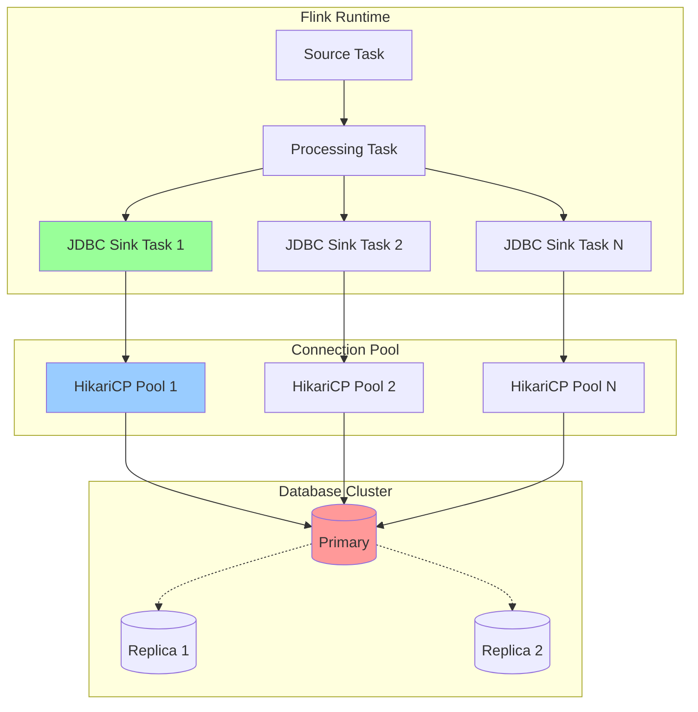
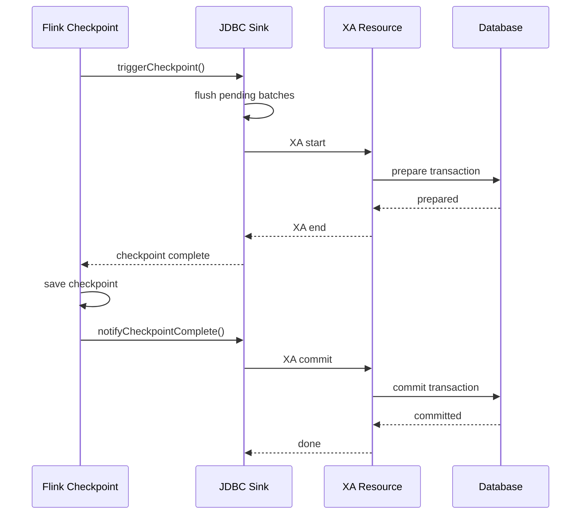
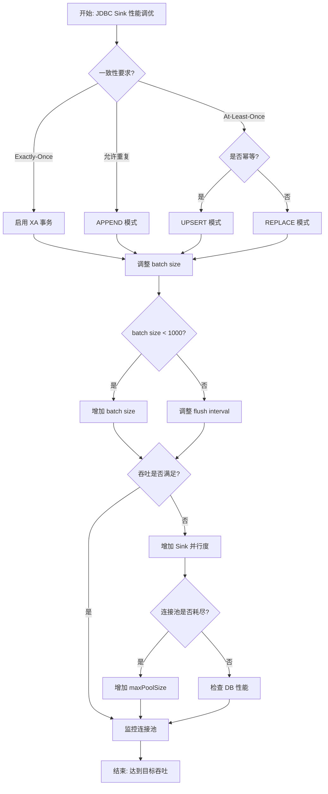

# Flink JDBC Connector 详细指南

> **所属阶段**: Flink/connectors | **前置依赖**: [Flink Connectors生态](../04-connectors/flink-connectors-ecosystem-complete-guide.md), [Checkpoint机制](../02-core-mechanisms/checkpoint-mechanism-deep-dive.md) | **形式化等级**: L4

---

## 目录

- [Flink JDBC Connector 详细指南](#flink-jdbc-connector-详细指南)
  - [目录](#目录)
  - [1. 概念定义 (Definitions)](#1-概念定义-definitions)
    - [Def-F-CJ-01 (JDBC Connector 形式化定义)](#def-f-cj-01-jdbc-connector-形式化定义)
    - [Def-F-CJ-02 (连接池配置模型)](#def-f-cj-02-连接池配置模型)
    - [Def-F-CJ-03 (写入语义模型)](#def-f-cj-03-写入语义模型)
  - [2. 属性推导 (Properties)](#2-属性推导-properties)
    - [Prop-F-CJ-01 (批量写入性能边界)](#prop-f-cj-01-批量写入性能边界)
    - [Lemma-F-CJ-01 (连接池无死锁条件)](#lemma-f-cj-01-连接池无死锁条件)
    - [Prop-F-CJ-02 (XA 事务一致性保证)](#prop-f-cj-02-xa-事务一致性保证)
  - [3. 关系建立 (Relations)](#3-关系建立-relations)
    - [3.1 JDBC Connector 与 Flink API 的关系](#31-jdbc-connector-与-flink-api-的关系)
    - [3.2 与 Checkpoint 机制的关系](#32-与-checkpoint-机制的关系)
    - [3.3 与 CDC 连接器的关系](#33-与-cdc-连接器的关系)
  - [4. 论证过程 (Argumentation)](#4-论证过程-argumentation)
    - [4.1 分区读取策略分析](#41-分区读取策略分析)
    - [4.2 XA 事务实现机制](#42-xa-事务实现机制)
    - [4.3 反压处理策略](#43-反压处理策略)
  - [5. 形式证明 / 工程论证 (Proof / Engineering Argument)](#5-形式证明--工程论证-proof--engineering-argument)
    - [Thm-F-CJ-01 (JDBC Exactly-Once 正确性定理)](#thm-f-cj-01-jdbc-exactly-once-正确性定理)
    - [Thm-F-CJ-02 (批量写入吞吐优化定理)](#thm-f-cj-02-批量写入吞吐优化定理)
  - [6. 实例验证 (Examples)](#6-实例验证-examples)
    - [6.1 Maven 依赖配置](#61-maven-依赖配置)
    - [6.2 DataStream API 完整示例](#62-datastream-api-完整示例)
    - [6.3 Table API / SQL 配置](#63-table-api--sql-配置)
    - [6.4 自定义连接池配置 (HikariCP)](#64-自定义连接池配置-hikaricp)
    - [6.5 XA 事务配置示例](#65-xa-事务配置示例)
  - [7. 可视化 (Visualizations)](#7-可视化-visualizations)
    - [7.1 JDBC Connector 架构图](#71-jdbc-connector-架构图)
    - [7.2 XA 事务执行流程](#72-xa-事务执行流程)
    - [7.3 写入性能优化决策树](#73-写入性能优化决策树)
  - [8. 故障排查 (Troubleshooting)](#8-故障排查-troubleshooting)
    - [8.1 常见问题与解决方案](#81-常见问题与解决方案)
      - [问题 1: Connection Pool Exhausted (连接池耗尽)](#问题-1-connection-pool-exhausted-连接池耗尽)
      - [问题 2: Deadlock on Upsert (UPSERT 死锁)](#问题-2-deadlock-on-upsert-upsert-死锁)
      - [问题 3: XA Transaction Timeout (XA 事务超时)](#问题-3-xa-transaction-timeout-xa-事务超时)
      - [问题 4: 数据类型不匹配](#问题-4-数据类型不匹配)
    - [8.2 诊断命令](#82-诊断命令)
  - [9. 性能优化 (Performance Optimization)](#9-性能优化-performance-optimization)
    - [9.1 写入性能调优清单](#91-写入性能调优清单)
    - [9.2 数据库优化建议](#92-数据库优化建议)
    - [9.3 监控指标](#93-监控指标)
  - [10. 引用参考 (References)](#10-引用参考-references)

---

## 1. 概念定义 (Definitions)

### Def-F-CJ-01 (JDBC Connector 形式化定义)

**定义**: Flink JDBC Connector 是通过标准 JDBC 协议与关系型数据库交互的连接器，提供 Source（读取）和 Sink（写入）两种能力。

**形式化结构**:

```
JDBCConnector = ⟨Source, Sink, Dialect, Pool⟩

其中:
- Source: 数据读取组件 ⟨Query, SplitStrategy, FetchSize⟩
- Sink: 数据写入组件 ⟨Statement, Buffer, FlushPolicy⟩
- Dialect: 数据库方言 ⟨Quote, Limit, UpsertSyntax⟩
- Pool: 连接池管理 ⟨HikariCP, Druid, Custom⟩
```

**支持的数据库**:

| 数据库 | 驱动类 | 方言标识 | 版本支持 |
|--------|--------|----------|----------|
| MySQL | `com.mysql.cj.jdbc.Driver` | mysql | 5.7+ |
| PostgreSQL | `org.postgresql.Driver` | postgresql | 9.6+ |
| Oracle | `oracle.jdbc.OracleDriver` | oracle | 11g+ |
| SQL Server | `com.microsoft.sqlserver.jdbc.SQLServerDriver` | mssql | 2016+ |
| Derby | `org.apache.derby.jdbc.EmbeddedDriver` | derby | 10.14+ |

---

### Def-F-CJ-02 (连接池配置模型)

**定义**: 连接池管理数据库连接的创建、复用和销毁，优化资源利用率。

**形式化定义**:

```
ConnectionPool = ⟨PoolConfig, Lifecycle⟩

PoolConfig = ⟨
    maxPoolSize: ℕ (默认10),
    minIdle: ℕ (默认5),
    maxLifetime: Duration (默认30min),
    connectionTimeout: Duration (默认30s),
    idleTimeout: Duration (默认10min),
    validationTimeout: Duration (默认5s)
⟩

Lifecycle = {CREATED, IDLE, ACTIVE, EXPIRED}
```

**HikariCP 推荐配置**:

| 参数 | 说明 | 推荐值 | 注意事项 |
|------|------|--------|----------|
| `maximumPoolSize` | 最大连接数 | CPU核心数 × 2 + 1 | 过高会耗尽DB资源 |
| `minimumIdle` | 最小空闲连接 | 与maxPoolSize相同 | 避免连接抖动 |
| `connectionTimeout` | 获取连接超时 | 30000 (ms) | 超过此时间会抛出异常 |
| `idleTimeout` | 空闲连接超时 | 600000 (ms) | 0表示不回收 |
| `maxLifetime` | 连接最大生命周期 | 1800000 (ms) | 应小于数据库wait_timeout |
| `connectionTestQuery` | 连接测试SQL | SELECT 1 | MySQL推荐 |

---

### Def-F-CJ-03 (写入语义模型)

**定义**: JDBC Sink 支持多种写入语义，满足不同一致性要求。

```
WriteSemantics = {APPEND, UPSERT, REPLACE, EXACTLY_ONCE}

APPEND: INSERT INTO table VALUES (...)
UPSERT: INSERT ... ON DUPLICATE KEY UPDATE (MySQL)
        INSERT ... ON CONFLICT UPDATE (PostgreSQL)
        MERGE INTO ... (Oracle, SQL Server)
REPLACE: DELETE + INSERT
EXACTLY_ONCE: XA 二阶段提交
```

**语义对比**:

| 语义 | 幂等性 | 性能 | 适用场景 |
|------|--------|------|----------|
| APPEND | ❌ 否 | ⭐⭐⭐ 高 | 日志追加、无重复数据 |
| UPSERT | ✅ 是 | ⭐⭐ 中 | 有主键的数据更新 |
| REPLACE | ✅ 是 | ⭐ 低 | 全量替换场景 |
| EXACTLY_ONCE | ✅ 是 | ⭐⭐ 中 | 金融交易、订单处理 |

---

## 2. 属性推导 (Properties)

### Prop-F-CJ-01 (批量写入性能边界)

**命题**: JDBC Sink 的批量写入吞吐量受以下因素约束：

```
Throughput_max = min(
    batchSize / (batchInterval + DB_latency),
    connectionPoolSize × singleConnectionThroughput,
    Network_bandwidth / avgRecordSize
)
```

**参数优化建议**:

| 参数 | 默认值 | 调优范围 | 影响 |
|------|--------|----------|------|
| `sink.buffer-flush.max-rows` | 100 | 100-10000 | 批次越大吞吐越高，延迟越大 |
| `sink.buffer-flush.interval` | 1s | 100ms-10s | 控制刷新频率 |
| `sink.max-retries` | 3 | 1-10 | 失败重试次数 |
| `sink.parallelism` | 上游并行度 | 1-50 | 过高会打满连接池 |

---

### Lemma-F-CJ-01 (连接池无死锁条件)

**引理**: 当满足以下条件时，JDBC 连接池不会出现死锁：

```
∀ Task: requiredConnections ≤ availableConnections

其中:
- requiredConnections = parallelism × connectionPerTask
- connectionPerTask ≤ maxPoolSize / totalParallelism
```

**证明概要**:

1. 每个 Task 在同一时刻最多持有一个连接（同步写入）
2. 连接池大小 ≥ Task 并行度
3. 因此总有一个连接可用，满足资源分配图无环条件

---

### Prop-F-CJ-02 (XA 事务一致性保证)

**命题**: 使用 XA 事务时，JDBC Sink 提供端到端的 Exactly-Once 语义：

```
∀ checkpoint:
    records_before_checkpoint ⊆ DB_committed_records
    ∧ no_duplicate_records
    ∧ recovery_replays_from_checkpoint
```

---

## 3. 关系建立 (Relations)

### 3.1 JDBC Connector 与 Flink API 的关系

```
┌─────────────────────────────────────────────────────────────┐
│                    Flink API 层                              │
├──────────────┬──────────────┬───────────────────────────────┤
│ DataStream   │ Table/SQL    │ DataSet (Deprecated)          │
│ API          │ API          │                               │
├──────────────┼──────────────┼───────────────────────────────┤
│ JdbcSink.    │ jdbc()       │ JDBCInputFormat               │
│ sink()       │ connector    │ JDBCOutputFormat              │
├──────────────┴──────────────┴───────────────────────────────┤
│              JDBC Connector 核心层                           │
├─────────────────────────────────────────────────────────────┤
│  Connection Pool → SQL Dialect → PreparedStatement          │
├─────────────────────────────────────────────────────────────┤
│              JDBC 驱动层                                     │
├─────────────────────────────────────────────────────────────┤
│  MySQL    PostgreSQL    Oracle    SQL Server    Derby       │
└─────────────────────────────────────────────────────────────┘
```

### 3.2 与 Checkpoint 机制的关系

```
Flink Checkpoint
       │
       ├── Source: 记录消费偏移量
       ├── Processing: 算子状态快照
       └── JDBC Sink:
           ├── AT_LEAST_ONCE: 异步刷盘，不等待确认
           ├── EXACTLY_ONCE: XA prepare → checkpoint → XA commit
           └── 恢复时: 回滚 pending 事务，重放未确认记录
```

### 3.3 与 CDC 连接器的关系

| 特性 | JDBC Source | CDC 连接器 (Debezium) |
|------|-------------|----------------------|
| 读取方式 | 轮询查询 | 监听 Binlog |
| 实时性 | 秒级延迟 | 毫秒级延迟 |
| 资源开销 | 高（周期性查询） | 低（事件驱动） |
| 增量识别 | 需时间戳/自增列 | 自动捕获所有变更 |
| 删除事件 | 软删除/无法捕获 | 原生支持 |

---

## 4. 论证过程 (Argumentation)

### 4.1 分区读取策略分析

**主键范围分片**:

```sql
-- 自动生成分片查询
SELECT * FROM table
WHERE id BETWEEN ? AND ?
-- 分片1: 1-10000
-- 分片2: 10001-20000
-- ...
```

**适用条件**: 主键连续、数据分布均匀

**不均匀数据处理**:

```sql
-- 使用动态分片
SELECT * FROM table
WHERE MOD(HASH(id), ${parallelism}) = ${task_index}
```

### 4.2 XA 事务实现机制

**两阶段提交流程**:

```
Phase 1 (Prepare):
1. Flink 启动 checkpoint
2. Sink 暂停接收新数据
3. 等待所有 pending batch 完成
4. 执行 XA prepare (记录到 XA log)
5. 返回 checkpoint 确认

Phase 2 (Commit):
1. Checkpoint 完成后
2. 异步执行 XA commit
3. 释放事务资源
```

### 4.3 反压处理策略

```
高写入速率
    ↓
连接池耗尽
    ↓
触发反压 → 向上游传播 → 降低 Source 消费速率
    ↓
待连接可用 → 恢复写入 → 反压解除
```

---

## 5. 形式证明 / 工程论证 (Proof / Engineering Argument)

### Thm-F-CJ-01 (JDBC Exactly-Once 正确性定理)

**定理**: 在启用 XA 事务且 Checkpoint 成功完成的情况下，JDBC Sink 保证 Exactly-Once 语义。

**证明**:

**前提**:

1. XA 事务支持原子性 prepare/commit
2. Checkpoint 机制保证 Flink 状态一致性
3. 恢复时从最后一个成功 checkpoint 重启

**情况分析**:

| 故障时机 | 行为 | 结果 |
|----------|------|------|
| XA prepare 前 | 事务未开始，无影响 | 无重复 |
| XA prepare 后，checkpoint 前 | 恢复后重新 prepare | 可能重复 prepare（幂等） |
| Checkpoint 后，XA commit 前 | 恢复后重新 commit | 可能重复 commit（幂等） |
| XA commit 后 | 已确认，checkpoint 已记录 | 无重复 |

**结论**: 由于 XA prepare 和 commit 都是幂等操作，即使重复执行也不会产生重复数据。

---

### Thm-F-CJ-02 (批量写入吞吐优化定理)

**定理**: 在连接池资源充足的情况下，批量写入吞吐与批次大小成正比，与网络延迟成反比。

**证明**:

设:

- $N$ = 批次大小
- $L$ = 网络往返延迟
- $T_{db}$ = 数据库处理时间
- $R$ = 吞吐 (records/second)

对于单条写入:
$$T_{single} = L + T_{db}$$

对于批量写入:
$$T_{batch} = L + T_{db} + (N-1) \times T_{process}$$
$$R = \frac{N}{T_{batch}} \approx \frac{N}{L} \text{ (当 N 较大时)}$$

因此吞吐与批次大小 $N$ 成正比。

---

## 6. 实例验证 (Examples)

### 6.1 Maven 依赖配置

```xml
<!-- Flink JDBC Connector -->
<dependency>
    <groupId>org.apache.flink</groupId>
    <artifactId>flink-connector-jdbc</artifactId>
    <version>${flink.version}</version>
</dependency>

<!-- 数据库驱动 -->
<!-- MySQL -->
<dependency>
    <groupId>mysql</groupId>
    <artifactId>mysql-connector-java</artifactId>
    <version>8.0.33</version>
</dependency>

<!-- PostgreSQL -->
<dependency>
    <groupId>org.postgresql</groupId>
    <artifactId>postgresql</artifactId>
    <version>42.6.0</version>
</dependency>
```

### 6.2 DataStream API 完整示例

```java
import org.apache.flink.connector.jdbc.*;

// JDBC Source 配置
JdbcSourceBuilder<Order> sourceBuilder = JdbcSourceBuilder
    .<Order>builder()
    .setDBUrl("jdbc:mysql://localhost:3306/mydb")
    .setUsername("user")
    .setPassword("pass")
    .setQuery("SELECT id, amount, create_time FROM orders")
    .setRowConverter(new OrderRowConverter())
    .setFetchSize(1000)
    .setParallelism(4);

DataStream<Order> orders = env.fromSource(
    sourceBuilder.build(),
    WatermarkStrategy.noWatermarks(),
    "jdbc-source"
);

// JDBC Sink 配置 (带幂等写入)
String upsertSQL = "INSERT INTO order_summary (id, total_amount, count) " +
    "VALUES (?, ?, ?) " +
    "ON DUPLICATE KEY UPDATE " +
    "total_amount = VALUES(total_amount), " +
    "count = VALUES(count)";

JdbcSinkBuilder<OrderAgg> sinkBuilder = JdbcSinkBuilder
    .<OrderAgg>builder()
    .setDBUrl("jdbc:mysql://localhost:3306/mydb")
    .setUsername("user")
    .setPassword("pass")
    .setQuery(upsertSQL)
    .setBatchSize(1000)
    .setBatchIntervalMs(1000)
    .setMaxRetries(3);

aggregatedOrders.addSink(sinkBuilder.build());
```

### 6.3 Table API / SQL 配置

```java
// 注册 JDBC Catalog
tableEnv.executeSql("""
    CREATE CATALOG my_jdbc_catalog WITH (
        'type' = 'jdbc',
        'default-database' = 'mydb',
        'username' = 'user',
        'password' = 'pass',
        'base-url' = 'jdbc:mysql://localhost:3306'
    )
""");

// 创建 JDBC Table
// MySQL
String createTableSQL = """
    CREATE TABLE orders (
        id BIGINT PRIMARY KEY NOT ENFORCED,
        user_id STRING,
        amount DECIMAL(10, 2),
        create_time TIMESTAMP(3),
        WATERMARK FOR create_time AS create_time - INTERVAL '5' SECOND
    ) WITH (
        'connector' = 'jdbc',
        'url' = 'jdbc:mysql://localhost:3306/mydb',
        'table-name' = 'orders',
        'username' = 'user',
        'password' = 'pass',
        'driver' = 'com.mysql.cj.jdbc.Driver',

        -- 连接池配置
        'connection.max-retry-timeout' = '60s',

        -- 批量写入配置
        'sink.buffer-flush.max-rows' = '1000',
        'sink.buffer-flush.interval' = '1s',
        'sink.max-retries' = '3',

        -- 语义配置
        'sink.semantic' = 'at-least-once'
    )
""";

tableEnv.executeSql(createTableSQL);

// PostgreSQL (带 UPSERT)
tableEnv.executeSql("""
    CREATE TABLE orders_upsert (
        id BIGINT PRIMARY KEY NOT ENFORCED,
        total_amount DECIMAL(10, 2),
        update_count INT
    ) WITH (
        'connector' = 'jdbc',
        'url' = 'jdbc:postgresql://localhost:5432/mydb',
        'table-name' = 'order_stats',
        'username' = 'user',
        'password' = 'pass',

        -- 启用 UPSERT
        'sink.semantic' = 'upsert'
    )
""");
```

### 6.4 自定义连接池配置 (HikariCP)

```java
import com.zaxxer.hikari.HikariConfig;
import com.zaxxer.hikari.HikariDataSource;

public class CustomJdbcSink {

    public static DataSource createDataSource() {
        HikariConfig config = new HikariConfig();
        config.setJdbcUrl("jdbc:mysql://localhost:3306/mydb");
        config.setUsername("user");
        config.setPassword("pass");

        // 连接池优化
        config.setMaximumPoolSize(20);
        config.setMinimumIdle(10);
        config.setConnectionTimeout(30000);
        config.setIdleTimeout(600000);
        config.setMaxLifetime(1800000);
        config.setLeakDetectionThreshold(60000);

        // 性能优化
        config.addDataSourceProperty("cachePrepStmts", "true");
        config.addDataSourceProperty("prepStmtCacheSize", "250");
        config.addDataSourceProperty("prepStmtCacheSqlLimit", "2048");
        config.addDataSourceProperty("useServerPrepStmts", "true");
        config.addDataSourceProperty("useLocalSessionState", "true");
        config.addDataSourceProperty("rewriteBatchedStatements", "true");
        config.addDataSourceProperty("cacheResultSetMetadata", "true");
        config.addDataSourceProperty("cacheServerConfiguration", "true");
        config.addDataSourceProperty("elideSetAutoCommits", "true");
        config.addDataSourceProperty("maintainTimeStats", "false");

        return new HikariDataSource(config);
    }
}
```

### 6.5 XA 事务配置示例

```java
// 启用 Exactly-Once 语义
JdbcExactlyOnceSink<Order> xaSink = JdbcExactlyOnceSink
    .<Order>builder()
    .setDBUrl("jdbc:mysql://localhost:3306/mydb")
    .setUsername("user")
    .setPassword("pass")
    .setQuery("INSERT INTO orders (id, amount) VALUES (?, ?)")
    .setMaxPoolSize(10)
    .build();

// 配合 Checkpoint 配置
env.enableCheckpointing(60000);
env.getCheckpointConfig().setCheckpointingMode(
    CheckpointingMode.EXACTLY_ONCE
);
env.getCheckpointConfig().setMinPauseBetweenCheckpoints(30000);

orders.addSink(xaSink);
```

---

## 7. 可视化 (Visualizations)

### 7.1 JDBC Connector 架构图



### 7.2 XA 事务执行流程



### 7.3 写入性能优化决策树



---

## 8. 故障排查 (Troubleshooting)

### 8.1 常见问题与解决方案

#### 问题 1: Connection Pool Exhausted (连接池耗尽)

**现象**:

```
java.sql.SQLException: Connection pool is exhausted
    at com.zaxxer.hikari.pool.HikariPool.getConnection
```

**原因分析**:

1. Sink 并行度过高，超过连接池容量
2. 长时间运行的事务未释放连接
3. 连接泄漏（未正确关闭）

**解决方案**:

```java
// 1. 确保连接池大小 ≥ Sink 并行度
config.setMaximumPoolSize(sinkParallelism + 5);

// 2. 启用连接泄漏检测
config.setLeakDetectionThreshold(60000); // 60秒

// 3. 设置合理的超时
config.setConnectionTimeout(30000);
config.setMaxLifetime(1800000);
```

---

#### 问题 2: Deadlock on Upsert (UPSERT 死锁)

**现象**:

```
com.mysql.cj.jdbc.exceptions.MySQLTransactionRollbackException:
    Deadlock found when trying to get lock; try restarting transaction
```

**原因分析**:
多个并行 Task 同时写入相同记录，导致数据库行锁冲突。

**解决方案**:

```java
// 1. 使用分区策略避免热点
// 按主键分区，确保相同 _id 的数据进入同一 Task
DataStream<Order> partitioned = orders
    .partitionCustom(
        new HashPartitioner(),
        Order::getId  // 使用主键分区
    );

// 2. 调整批量大小和重试策略
JdbcSinkBuilder.builder()
    .setBatchSize(100)  // 减小批次，减少冲突窗口
    .setMaxRetries(10)  // 增加重试次数
    .build();

// 3. 数据库层面优化（MySQL）
SET GLOBAL innodb_lock_wait_timeout = 50;
SET GLOBAL innodb_deadlock_detect = ON;
```

---

#### 问题 3: XA Transaction Timeout (XA 事务超时)

**现象**:

```
javax.transaction.xa.XAException: XAER_RMFAIL:
    The command cannot be completed when the global transaction is in the IDLE state
```

**原因分析**:

1. Checkpoint 间隔过长，XA 事务超时
2. 数据库 XA 事务超时设置过短

**解决方案**:

```java
// 1. 缩短 Checkpoint 间隔
env.enableCheckpointing(30000); // 30秒

// 2. 设置数据库 XA 超时
// MySQL
SET GLOBAL innodb_rollback_on_timeout = ON;
SET GLOBAL lock_wait_timeout = 600;

// PostgreSQL
SET max_prepared_transactions = 100;
```

---

#### 问题 4: 数据类型不匹配

**现象**:

```
java.sql.SQLException: Data truncation: Out of range value for column 'amount'
```

**解决方案**:

```java
// 1. 显式类型映射
public class OrderRowConverter implements JdbcRowConverter<Order> {
    @Override
    public Order convert(ResultSet rs) throws SQLException {
        return new Order(
            rs.getLong("id"),
            rs.getBigDecimal("amount"),  // 使用 BigDecimal
            rs.getTimestamp("create_time").toLocalDateTime()
        );
    }

    @Override
    public void setValues(PreparedStatement ps, Order order) throws SQLException {
        ps.setLong(1, order.getId());
        ps.setBigDecimal(2, order.getAmount());
        ps.setTimestamp(3, Timestamp.valueOf(order.getCreateTime()));
    }
}
```

---

### 8.2 诊断命令

```sql
-- MySQL: 查看当前连接
SHOW PROCESSLIST;
SELECT * FROM information_schema.PROCESSLIST
WHERE USER = 'flink_user';

-- 查看 XA 事务
XA RECOVER;

-- PostgreSQL: 查看连接
SELECT * FROM pg_stat_activity
WHERE usename = 'flink_user';

-- 查看锁
SELECT * FROM pg_locks WHERE NOT granted;
```

---

## 9. 性能优化 (Performance Optimization)

### 9.1 写入性能调优清单

| 优化项 | 配置参数 | 建议值 | 预期提升 |
|--------|----------|--------|----------|
| 批量大小 | `sink.buffer-flush.max-rows` | 1000-5000 | 5-10x |
| 刷新间隔 | `sink.buffer-flush.interval` | 1-5s | 降低延迟 |
| 连接池大小 | `maximumPoolSize` | 并行度+5 | 避免等待 |
| Sink 并行度 | `sink.parallelism` | 4-16 | 线性扩展 |
| 预处理语句缓存 | `cachePrepStmts` | true | 10-20% |
| 批量重写 | `rewriteBatchedStatements` | true (MySQL) | 3-5x |

### 9.2 数据库优化建议

**MySQL**:

```sql
-- 启用二进制日志（CDC 必需）
SET GLOBAL binlog_format = 'ROW';
SET GLOBAL binlog_row_image = 'FULL';

-- 优化 InnoDB
SET GLOBAL innodb_buffer_pool_size = <内存的70%>;
SET GLOBAL innodb_log_file_size = 512M;
SET GLOBAL innodb_flush_log_at_trx_commit = 2;
```

**PostgreSQL**:

```sql
-- 优化写入性能
SET synchronous_commit = off;
SET wal_buffers = 16MB;
SET max_wal_size = 2GB;

--  prepared transactions for XA
SET max_prepared_transactions = 100;
```

### 9.3 监控指标

```java
// 自定义指标收集
public class MetricsJdbcSink extends RichSinkFunction<Order> {
    private transient Counter recordsOut;
    private transient Histogram batchSize;
    private transient Meter throughput;

    @Override
    public void open(Configuration parameters) {
        recordsOut = getRuntimeContext()
            .getMetricGroup()
            .counter("recordsOut");
        batchSize = getRuntimeContext()
            .getMetricGroup()
            .histogram("batchSize", new DropwizardHistogramWrapper(
                new com.codahale.metrics.Histogram(
                    new SlidingWindowReservoir(500)
                )));
    }

    @Override
    public void invoke(Order value, Context context) {
        // 写入逻辑
        recordsOut.inc();
    }
}
```

---

## 10. 引用参考 (References)
