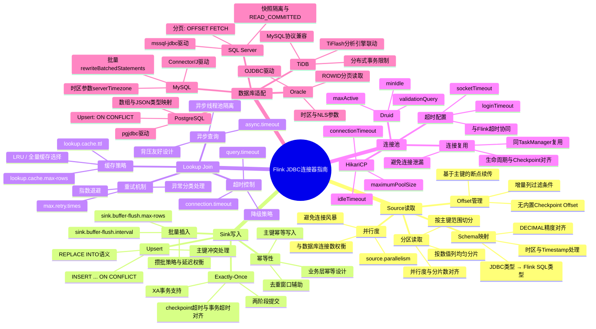
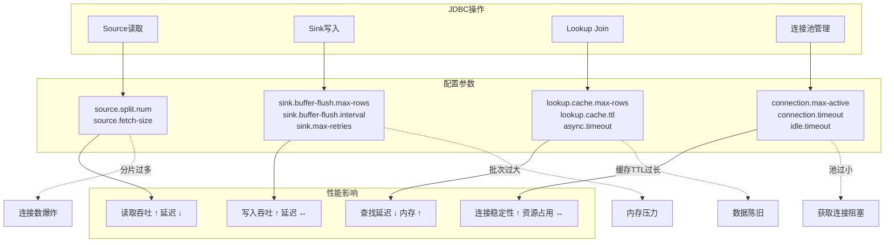
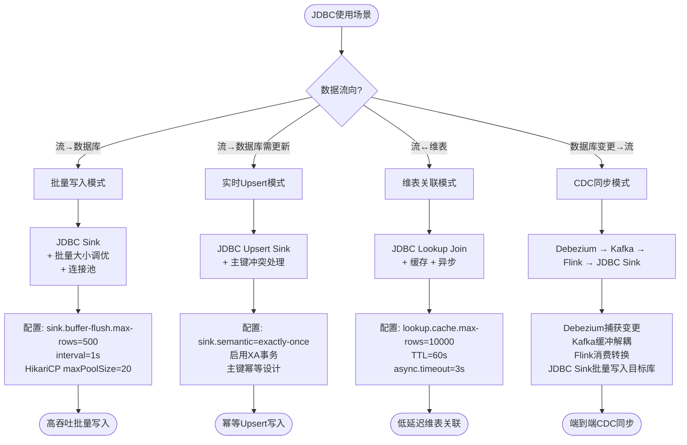

> **状态**: 📦 已归档 | **归档日期**: 2026-04-20
>
> 本文档内容已整合至主文档，此处保留为重定向入口。
> **主文档**: [Flink\05-ecosystem\05.01-connectors\jdbc-connector-complete-guide.md](../../../Flink/05-ecosystem/05.01-connectors/jdbc-connector-complete-guide.md)
> **归档位置**: [../../../archive/content-deduplication/2026-04/Flink/05-ecosystem/05.01-connectors/flink-jdbc-connector-guide.md](../../../archive/content-deduplication/2026-04/Flink/05-ecosystem/05.01-connectors/flink-jdbc-connector-guide.md)

---

# Flink JDBC 连接器思维表征

> 所属阶段: Flink/05-ecosystem/05.01-connectors | 前置依赖: [jdbc-connector-complete-guide.md](../../../Flink/05-ecosystem/05.01-connectors/jdbc-connector-complete-guide.md) | 形式化等级: L3

## 1. 思维导图：Flink JDBC 连接器全景

以下思维导图以"Flink JDBC连接器指南"为中心，放射展开五大核心维度。

## 2. 多维关联树：JDBC 操作 → 配置参数 → 性能影响

## 3. 决策树：JDBC 使用模式选型

## 4. 引用参考
