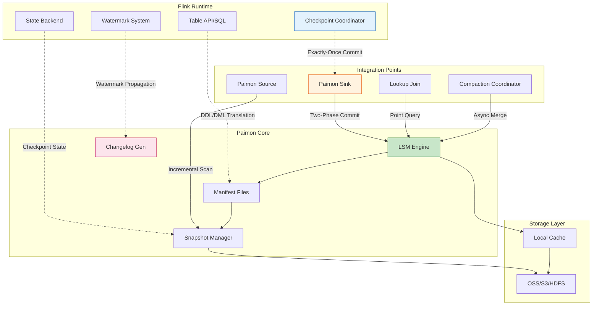
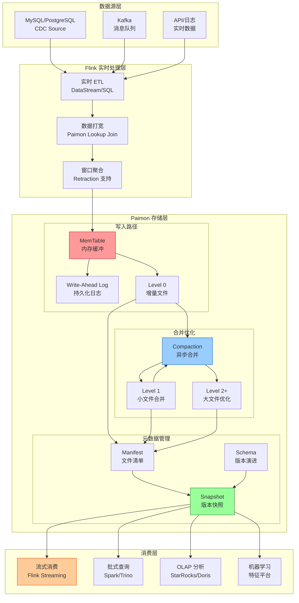
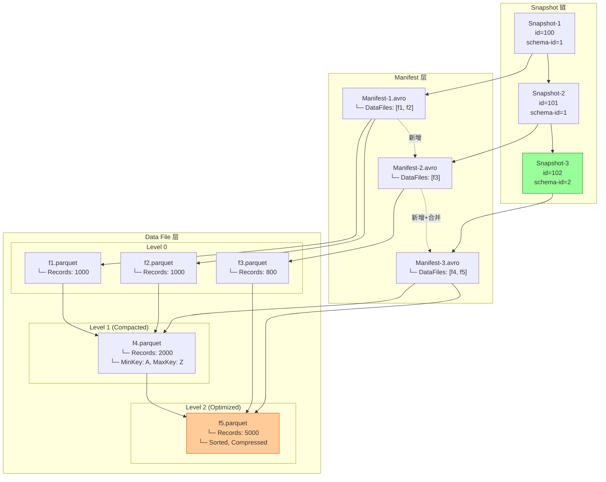
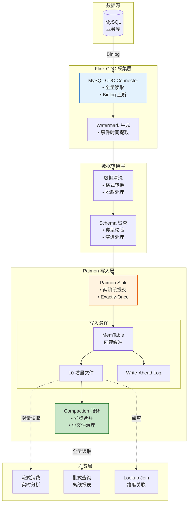
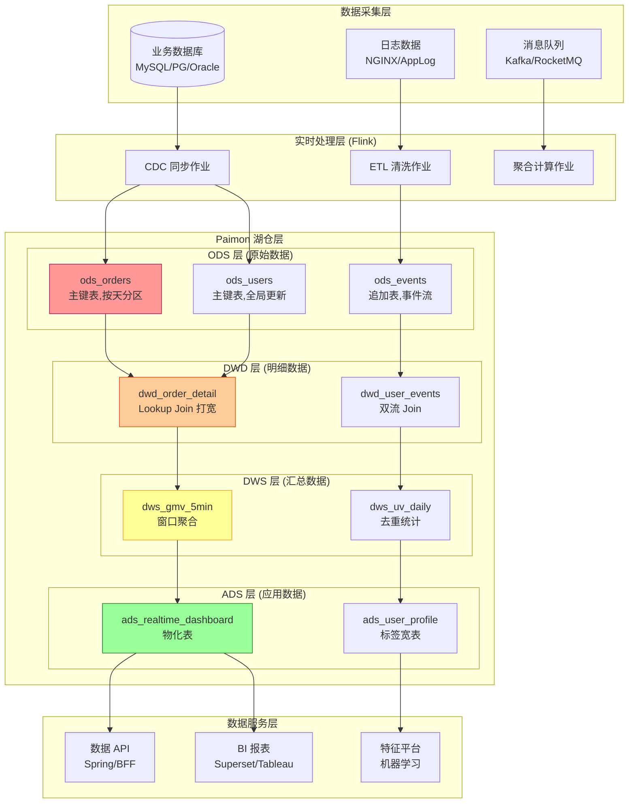
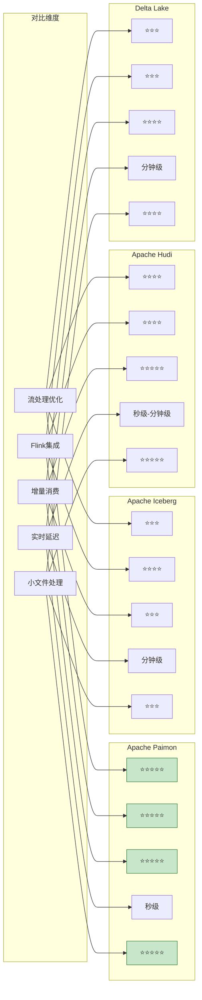
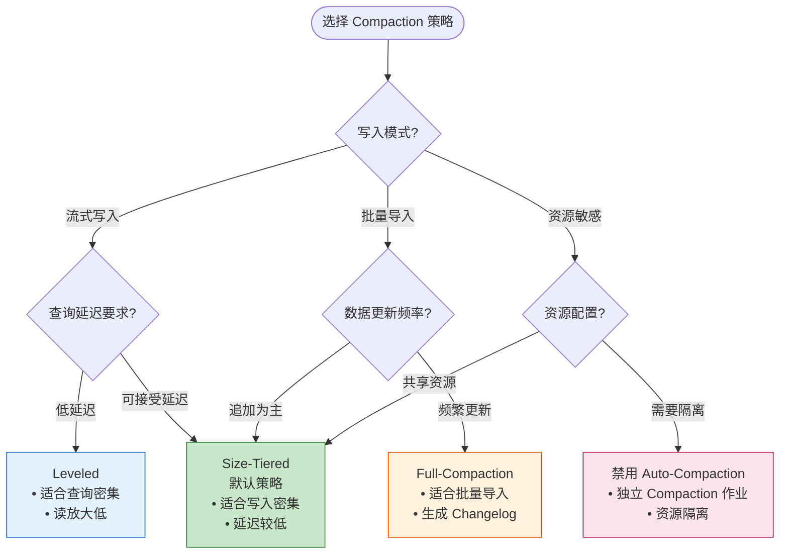
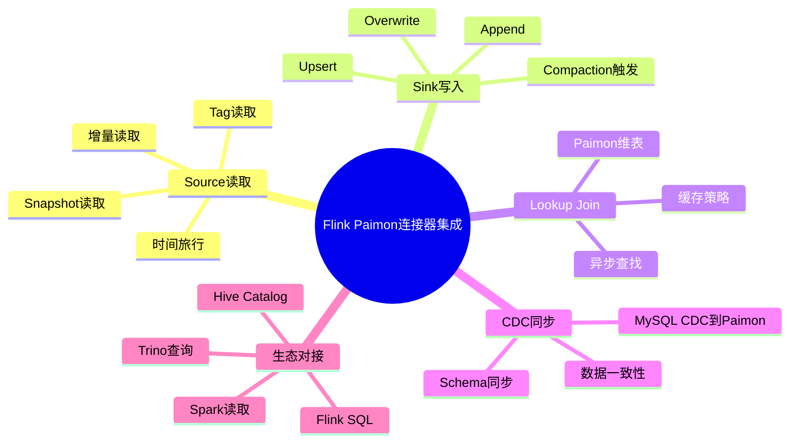
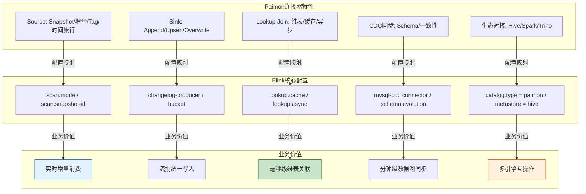
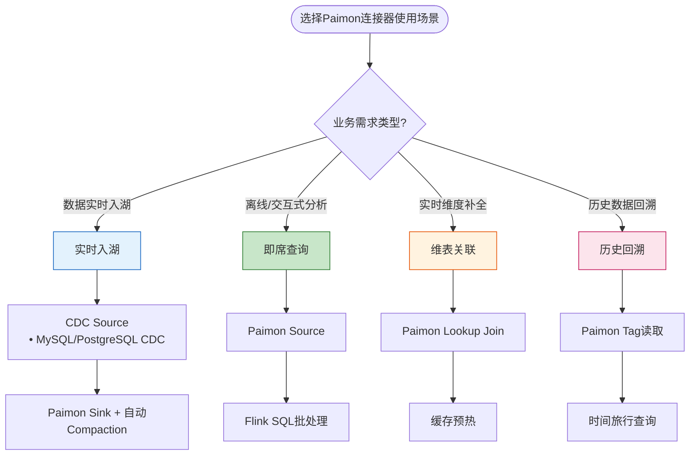

# Flink 与 Apache Paimon 深度集成 - 流式 Lakehouse 存储连接器

> **所属阶段**: Flink/04-connectors/ | **前置依赖**: [Flink/14-lakehouse/flink-paimon-integration.md](flink-paimon-integration.md), [Flink/02-core/checkpoint-mechanism-deep-dive.md](../../02-core/checkpoint-mechanism-deep-dive.md) | **形式化等级**: L4-L5 | **版本**: Flink 1.18+ | Paimon 0.8+

---

## 1. 概念定义 (Definitions)

### Def-F-04-60: Apache Paimon 形式化定义

**Apache Paimon** (原 Flink Table Store) 是一种专为流批统一处理设计的开放表格式，其形式化定义为五元组：

$$
\text{Paimon} = \langle \mathcal{L}, \mathcal{S}, \mathcal{M}, \mathcal{C}, \mathcal{T} \rangle
$$

**组件说明**：

| 组件 | 符号 | 形式化描述 | 工程实现 |
|------|------|-----------|---------|
| **LSM 存储引擎** | $\mathcal{L}$ | 基于日志结构合并树的存储引擎，支持高效追加写和点查 | `org.apache.paimon.io.DataFileWriter` |
| **快照管理系统** | $\mathcal{S}$ | 不可变快照序列 $\{snap_t\}_{t \in \mathbb{T}}$，支持时间旅行 | `SnapshotManager` |
| **元数据层** | $\mathcal{M}$ | 表Schema、分区信息、统计信息的版本化管理 | `SchemaManager` |
| **变更日志生成** | $\mathcal{C}$ | 从LSM增量文件派生标准Change Log的算法 | `ChangelogProducer` |
| **事务协调** | $\mathcal{T}$ | 基于两阶段提交的跨分区事务协议 | `Commit` 接口实现 |

**核心特征**：Paimon 是**唯一**为 Flink 流处理原生设计的表格式，其 LSM 架构天然适配流处理的追加写模式，同时通过 Compaction 优化批处理扫描性能[^1][^2]。

---

### Def-F-04-61: 流式 Lakehouse 定义

**流式 Lakehouse** (Streaming Lakehouse) 是一种将实时流处理能力与现代数据湖存储深度融合的数据架构范式：

$$
\text{StreamingLakehouse} = \langle \mathcal{O}, \mathcal{F}, \mathcal{E}, \mathcal{G} \rangle
$$

其中：

- $\mathcal{O}$: 对象存储层 (S3/OSS/GCS/HDFS)
- $\mathcal{F}$: 开放表格式 (Paimon/Iceberg/Hudi/Delta)
- $\mathcal{E}$: 流批统一计算引擎 (Flink)
- $\mathcal{G}$: 数据治理体系 (血缘/质量/安全)

**Lakehouse 核心能力矩阵**：

| 能力维度 | 传统数据湖 | 传统数仓 | 流式 Lakehouse |
|---------|-----------|---------|---------------|
| **存储成本** | 低 | 高 | 低 |
| **实时性** | 批处理(T+1) | 批处理(T+1) | 流处理(秒级) |
| **Schema 管理** | 弱 | 强 | 强 |
| **ACID 事务** | 无 | 强 | 强 |
| **时间旅行** | 无 | 有限 | 完整支持 |
| **开放格式** | 是 | 否 | 是 |
| **流批统一** | 否 | 否 | 是 |

---

### Def-F-04-62: LSM-Tree 增量日志模型

**LSM-Tree 增量日志模型** (LSM-Tree Incremental Log Model) 是 Paimon 核心的存储抽象，形式化定义为四元组：

$$
\mathcal{L} = \langle \mathcal{M}_{mem}, \{\mathcal{M}_{L_i}\}_{i=0}^{n}, \mathcal{W}, \mathcal{C} \rangle
$$

**LSM 架构层次结构**：

```
┌─────────────────────────────────────────────────────────────────┐
│                     Paimon LSM 架构                              │
├─────────────────────────────────────────────────────────────────┤
│  ┌─────────────────────────────────────────────────────────┐   │
│  │  MemTable (内存缓冲区)                                    │   │
│  │  • 有序跳表结构 (Skip List)                               │   │
│  │  • 写入 WAL 保证持久性                                    │   │
│  │  • Flush 触发: 容量阈值 / 时间阈值 / Checkpoint            │   │
│  └──────────────────────────┬──────────────────────────────┘   │
│                             │ Flush                             │
│                             ▼                                   │
│  ┌─────────────────────────────────────────────────────────┐   │
│  │  Level 0 (增量文件层)                                     │   │
│  │  ┌─────────┐ ┌─────────┐ ┌─────────┐                    │   │
│  │  │DataFile1│ │DataFile2│ │DataFile3│ ... 无序,可重叠    │   │
│  │  └─────────┘ └─────────┘ └─────────┘                    │   │
│  └──────────────────────────┬──────────────────────────────┘   │
│                             │ Compaction                        │
│                             ▼                                   │
│  ┌─────────────────────────────────────────────────────────┐   │
│  │  Level 1-N (合并排序层)                                   │   │
│  │  ┌─────────────────────────────────────────────────┐    │   │
│  │  │  文件按 Key 范围分区,无重叠                        │    │   │
│  │  │  L1: 最近数据,高查询效率                           │    │   │
│  │  │  L2+: 历史数据,高压缩比                            │    │   │
│  │  │  层间大小比例因子: 10                              │    │   │
│  │  └─────────────────────────────────────────────────┘    │   │
│  └─────────────────────────────────────────────────────────┘   │
└─────────────────────────────────────────────────────────────────┘
```

---

### Def-F-04-63: 湖存储格式 (ORC/Parquet/Avro)

**Paimon 支持的数据文件格式**：

| 格式 | 类型 | 压缩算法 | 适用场景 | 压缩率 | 查询性能 |
|------|------|---------|---------|-------|---------|
| **Parquet** | 列式 | Snappy/ZSTD/GZIP | 通用OLAP | ⭐⭐⭐⭐ | ⭐⭐⭐⭐⭐ |
| **ORC** | 列式 | ZLIB/Snappy | Hive生态 | ⭐⭐⭐⭐⭐ | ⭐⭐⭐⭐ |
| **Avro** | 行式 | Snappy/Deflate | Schema演变 | ⭐⭐⭐ | ⭐⭐⭐ |

**格式选择决策树**：

```
查询模式分析
├── 主要是分析型查询 (OLAP)
│   ├── 使用 Spark/Trino 为主 → Parquet
│   └── 使用 Hive 为主 → ORC
├── Schema 频繁演变
│   └── Avro (行式,Schema演变友好)
└── 存储成本敏感
    └── ORC (最高压缩率)
```

---

### Def-F-04-64: 增量快照 (Incremental Snapshot)

**增量快照**是 Paimon 实现流批统一的核心机制：

$$
\text{Snapshot}_t = \langle ID_t, TS_t, \mathcal{F}_t, \mathcal{P}_t, Meta_t \rangle
$$

**快照组成**：

- $ID_t \in \mathbb{N}^+$: 单调递增的快照ID
- $TS_t$: 快照创建时间戳
- $\mathcal{F}_t = \{f_1, f_2, ..., f_n\}$: 数据文件集合（通过Manifest引用）
- $\mathcal{P}_t$: 父快照ID（支持快照链回溯）
- $Meta_t$: 统计信息、Schema版本等元数据

**增量消费公式**：

$$
\Delta(snap_i, snap_j) = \mathcal{F}_{snap_j} \setminus \mathcal{F}_{snap_i}
$$

---

### Def-F-04-65: Changelog Producer 类型

**Changelog Producer** 定义了 Paimon 如何生成变更日志：

```
┌─────────────────────────────────────────────────────────────────────┐
│                     Changelog Producer 对比                          │
├─────────────────────────────────────────────────────────────────────┤
│                                                                     │
│  1. INPUT 模式                                                       │
│  ┌──────────┐    CDC (+I/-U/+U/-D)    ┌──────────┐                 │
│  │  MySQL   │ ───────────────────────▶│  Paimon  │                 │
│  │  CDC源   │    直接透传变更类型      │  表存储   │                 │
│  └──────────┘                         └──────────┘                 │
│  特点: 延迟最低,要求上游提供完整变更类型                              │
│                                                                     │
│  2. LOOKUP 模式                                                      │
│  ┌──────────┐    +I/+U/-D            ┌──────────┐    完整Changelog │
│  │  Source  │ ───────────────────────▶│  Paimon  │ ───────────────▶│
│  │  (无-U)  │                         │  LSM查询  │  (+I/-U/+U/-D)  │
│  └──────────┘                         └──────────┘                 │
│  特点: 通过LSM点查补全UPDATE_BEFORE,适合Kafka等源                   │
│                                                                     │
│  3. FULL-COMPACTION 模式                                             │
│  ┌──────────┐    Append Only          ┌──────────┐    对比生成       │
│  │  Source  │ ───────────────────────▶│Compaction│ ───────────────▶│
│  │          │                         │  前后对比 │    Changelog    │
│  └──────────┘                         └──────────┘                 │
│  特点: 延迟最高,适合无CDC场景的批量导入                               │
│                                                                     │
└─────────────────────────────────────────────────────────────────────┘
```

---

### Def-F-04-66: 分区与桶 (Partition & Bucket)

**分区 (Partition)**：数据按指定列值分布到不同目录

$$
\text{Partition}(T) = \{ P_v \mid v \in \text{Domain}(\text{partition_key}) \}
$$

**桶 (Bucket)**：分区内按主键哈希的并行度单位

$$
\text{Bucket}(record) = \text{hash}(\text{bucket\_keys}) \mod \text{num\_buckets}
$$

**设计原则**：

| 设计要素 | 推荐策略 | 避免问题 |
|---------|---------|---------|
| 分区键 | 时间字段 (dt/hour) | 分区过多 (>1000) |
| Bucket数 | $2^n$ (16/32/64/128) | 数据倾斜 |
| Bucket键 | 主键或高频查询键 | 全表扫描 |

---

### Def-F-04-67: Compaction 策略

**Compaction** 是 LSM-Tree 的核心维护操作：

```
┌─────────────────────────────────────────────────────────────────────┐
│                      Compaction 策略对比                             │
├─────────────────────────────────────────────────────────────────────┤
│                                                                     │
│  策略1: Size-tiered (默认)                                           │
│  ├── 触发条件: 同层级文件数超过阈值                                   │
│  ├── 合并方式: 相邻文件合并为更大文件                                 │
│  └── 适用: 写入密集场景                                              │
│                                                                     │
│  策略2: Leveled                                                      │
│  ├── 触发条件: 层级大小超过目标值                                     │
│  ├── 合并方式: 与下层文件合并,保持层级有序                           │
│  └── 适用: 读取密集场景                                              │
│                                                                     │
│  策略3: Full-Compaction (全量合并)                                    │
│  ├── 触发条件: 时间间隔或手动触发                                     │
│  ├── 合并方式: 全表合并为最优结构                                     │
│  └── 适用: 批处理优化、Changelog生成                                 │
│                                                                     │
└─────────────────────────────────────────────────────────────────────┘
```

---

## 2. 属性推导 (Properties)

### Lemma-F-04-50: LSM 写入放大与读优化权衡

**引理**: Paimon 的 LSM 架构通过写入放大 (Write Amplification) 换取读取优化 (Read Optimization)，其权衡关系满足：

$$
WA = O\left(k \cdot \frac{N}{B}\right), \quad RO = O(\log_k N)
$$

其中：

- $WA$: 写入放大因子
- $RO$: 读取复杂度
- $k$: 层间大小比例因子 (通常 10)
- $N$: 数据总量
- $B$: 最小文件大小

**证明概要**：

1. **写入路径**: 每条记录需经历 MemTable → L0 → L1 → ... → Ln 的逐级Compaction
2. **Compaction触发**: 当 $|\mathcal{M}_{L_i}| > k \cdot |\mathcal{M}_{L_{i-1}}|$ 时触发
3. **最大层数**: $n = \log_k (N/B)$
4. **单记录最大写次数**: 每层一次，总计 $\log_k (N/B)$ 次
5. **读取路径**: 需查询 MemTable + 每层最多一个文件，总计 $1 + \log_k (N/B)$

---

### Lemma-F-04-51: 增量日志的完备性保证

**引理**: Paimon 的增量日志生成机制保证 **不重不漏** (Exactly-Once Delivery of Changes)。

**形式化表述**：

设表 $T$ 从时刻 $t_0$ 到 $t_n$ 的变更流为 $\mathcal{C}(t_0, t_n)$，则：

$$
\forall r \in T, \forall op \in \{INSERT, UPDATE, DELETE\}:
$$

$$
\begin{aligned}
\text{(不遗漏)} \quad & r.op \in \mathcal{C}(t_0, t_n) \Rightarrow \exists! m \in \text{Changelog}: m.record = r \\
\text{(不重复)} \quad & \forall m_1, m_2 \in \text{Changelog}: m_1 \neq m_2 \Rightarrow m_1.record \neq m_2.record
\end{aligned}
$$

**证明**（以 `lookup` 模式为例）：

1. **UPDATE 事件处理**: 接收 UPDATE_AFTER → 查询LSM获取旧值 → 生成 UPDATE_BEFORE + UPDATE_AFTER
2. **DELETE 事件处理**: 查询LSM获取待删除值 → 生成包含完整行数据的 DELETE 事件
3. **幂等性保证**: LSM文件不可变，Lookup结果确定性；Checkpoint一致性保证事件不重复处理

---

### Prop-F-04-50: 流批读写隔离性

**命题**: Paimon 支持流读写与批查询的完全隔离，互不影响性能 SLA。

**隔离机制**：

```
┌─────────────────────────────────────────────────────────────────┐
│                    读写隔离架构                                   │
├─────────────────────────────────────────────────────────────────┤
│                                                                 │
│   写入路径 (流式)         快照层 (版本管理)        读取路径        │
│   ┌───────────┐           ┌───────────┐         ┌───────────┐   │
│   │ Flink Sink │─────────▶│ Snapshots │◀────────│Batch Scan │   │
│   │ (实时写入) │   提交    │ (不可变)  │   读取   │ (全表扫描) │   │
│   └───────────┘           └─────┬─────┘         └───────────┘   │
│        │                        │                               │
│        │ 增量文件               │ 快照引用                        │
│        ▼                        ▼                               │
│   ┌───────────┐           ┌───────────┐         ┌───────────┐   │
│   │   LSM L0  │           │  Manifest │         │Stream Read│   │
│   │(增量文件)  │           │  Files    │         │(增量消费)  │   │
│   └───────────┘           └───────────┘         └───────────┘   │
│        │                                                      │
│        ▼                                                      │
│   ┌───────────┐                                               │
│   │Compaction │───▶ 生成新快照,不影响现有读取                    │
│   │(异步合并)  │                                               │
│   └───────────┘                                               │
│                                                                 │
└─────────────────────────────────────────────────────────────────┘
```

---

### Prop-F-04-51: 主键表的幂等写入

**命题**: Paimon 主键表支持幂等写入，同一记录多次写入结果一致。

**形式化表述**：

设主键为 $k$，写入函数为 $W(k, v)$，读取函数为 $R(k)$，则：

$$
\forall k, v, n \in \mathbb{N}^+:
$$

$$
\underbrace{W(k, v) \circ W(k, v) \circ ... \circ W(k, v)}_{n\text{次}} = W(k, v)
$$

**实现机制**：

1. **LSM 层内去重**: 同层文件按主键排序，Compaction时合并重复键
2. **跨层值选择**: 读取时取最高层（最新）的值
3. **DELETE标记**: 特殊值标记删除，查询时过滤

---

## 3. 关系建立 (Relations)

### 3.1 Flink-Paimon 深度集成架构



---

### 3.2 开放表格式对比关系

**四大 Lakehouse 格式对比矩阵**：

| 维度 | Apache Paimon | Apache Iceberg | Apache Hudi | Delta Lake |
|------|---------------|----------------|-------------|------------|
| **设计目标** | 流批统一原生 | 分析型数仓 | 增量数据处理 | 事务型数据湖 |
| **存储引擎** | LSM-Tree | Copy-on-Write | MOR/COW | COW |
| **流处理优化** | ⭐⭐⭐⭐⭐ 原生 | ⭐⭐⭐ 需适配 | ⭐⭐⭐⭐ 较好 | ⭐⭐⭐ 需适配 |
| **Flink 集成** | ⭐⭐⭐⭐⭐ PMC主导 | ⭐⭐⭐⭐ 连接器 | ⭐⭐⭐⭐ 连接器 | ⭐⭐⭐ 连接器 |
| **增量消费** | ⭐⭐⭐⭐⭐ 原生支持 | ⭐⭐⭐ 有限支持 | ⭐⭐⭐⭐⭐ 成熟 | ⭐⭐⭐⭐ CDF支持 |
| **实时延迟** | 秒级 | 分钟级 | 秒级-分钟级 | 分钟级 |
| **小文件处理** | ⭐⭐⭐⭐⭐ 自动Compaction | ⭐⭐⭐ 需外部调度 | ⭐⭐⭐⭐⭐ 自动 | ⭐⭐⭐⭐ 自动 |
| **Schema演进** | ⭐⭐⭐⭐⭐ 完整支持 | ⭐⭐⭐⭐⭐ 完整支持 | ⭐⭐⭐⭐ 较好 | ⭐⭐⭐⭐⭐ 完整支持 |
| **Lookup Join** | ⭐⭐⭐⭐⭐ 原生支持 | ⭐⭐ 有限 | ⭐⭐⭐⭐ 支持 | ⭐⭐⭐ 支持 |

---

### 3.3 Paimon 与 Flink 核心机制映射

| Flink 机制 | Paimon 对应 | 协同语义 |
|-----------|------------|---------|
| **Checkpoint** | 快照提交 | 两阶段提交协议保证 Exactly-Once |
| **Watermark** | 快照时间戳 | 水印对齐触发 Compaction |
| **增量消费** | 快照差分 | 变更捕获无遗漏 |
| **Schema 演进** | 版本管理 | 自动同步兼容变更 |
| **Lookup Join** | LSM 点查 | 毫秒级维度关联 |

---

## 4. 论证过程 (Argumentation)

### 4.1 为何选择 LSM-Tree 作为存储引擎

**传统数据湖格式（Iceberg/Delta）的局限性**：

```
问题 1: 实时写入性能瓶颈
├── Copy-on-Write 模式: 每次更新需重写整个文件
├── 小文件问题: 高频写入产生大量小文件
└── 延迟: 分钟级可见性,无法满足实时需求

问题 2: 流处理集成复杂
├── 需要外部CDC系统(如Kafka)中转
├── 增量消费需扫描全表对比
└── 端到端延迟增加

问题 3: 存储空间放大
├── 历史版本数据冗余存储
└── 无自动压缩合并机制
```

**LSM-Tree 的优势**：

```
优势 1: 追加写优化
├── 顺序写入性能接近磁盘带宽
├── MemTable 批量刷盘减少 I/O
└── 适合流处理的高频追加场景

优势 2: 读写分离
├── 写入路径: MemTable → L0 → L1 → ...
├── 读取路径: 合并多层有序文件
└── Compaction 异步后台执行

优势 3: 增量日志原生支持
├── LSM 的层间差异即为变更数据
├── 无需全表扫描生成 Change Log
└── 支持流式增量消费
```

---

### 4.2 流式 Lakehouse 的延迟边界分析

**延迟构成分析**：

$$
\text{TotalLatency} = L_{source} + L_{process} + L_{commit} + L_{visible}
$$

| 延迟组件 | 典型值 | 优化手段 |
|---------|-------|---------|
| $L_{source}$ | 100ms-1s | CDC 配置优化 |
| $L_{process}$ | 10ms-100ms | Flink 并行度调整 |
| $L_{commit}$ | 50ms-200ms | Checkpoint 间隔 |
| $L_{visible}$ | 10ms-50ms | Paimon 刷盘策略 |

**端到端延迟边界**：

- **最优情况**: ~200ms (CDC+流处理+小事务)
- **典型情况**: 1-5s (默认配置)
- **最坏情况**: Checkpoint 周期 (默认 60s)

---

### 4.3 分区与 Bucket 设计的边界条件

**Bucket 数量选择公式**：

$$
\text{Optimal Bucket Num} = \max\left(\frac{\text{Data Volume}}{\text{Target File Size}}, \text{Parallelism}\right)
$$

**边界条件矩阵**：

| 场景 | 问题 | 解决方案 |
|------|------|---------|
| Bucket 过少 | 单文件过大，Compaction慢 | 增加Bucket数，并行处理 |
| Bucket 过多 | 小文件过多，元数据膨胀 | 减少Bucket数，合并小文件 |
| 数据倾斜 | 部分Bucket数据量远高于其他 | 使用动态Bucket或Salting |
| 分区过多 | 元数据管理开销大 | 合理分区粒度，避免过度分区 |

---

### 4.4 CDC 集成模式对比

**Upsert vs Append-Only 决策矩阵**：

| 场景 | 表类型 | 主键 | Changelog Producer | 适用场景 |
|------|--------|------|-------------------|---------|
| 状态表同步 | Primary Key Table | Yes | `input`/`lookup` | 用户表、订单表 |
| 事件流存储 | Append-Only Table | No | `none` | 点击流、日志 |
| 时序数据 | Append-Only Table | No | `none` | 传感器数据 |
| 拉链表 | Primary Key Table | Yes | `full-compaction` | 缓慢变化维 |

---

## 5. 形式证明 / 工程论证 (Proof / Engineering Argument)

### Thm-F-04-50: Paimon Exactly-Once 语义定理

**定理**: 基于 Flink Checkpoint 和 Paimon 两阶段提交协议，流写入 Paimon 表满足端到端 Exactly-Once 语义。

**形式化表述**：

设流 $S$ 的事件序列为 $\{e_1, e_2, ..., e_n\}$，写入 Paimon 表 $T$ 的操作为 $\mathcal{W}_T$，则：

$$
\forall e_i \in S: \text{count}(e_i \in T) = 1
$$

即使在故障恢复后，该性质依然成立。

**证明**：

**前提条件**:

- P1: Flink Checkpoint 提供作业级别的 Exactly-Once 保证
- P2: Paimon 快照元数据更新是原子操作
- P3: 两阶段提交协议协调 Checkpoint 与存储事务

**证明步骤**：

```
Step 1: 正常流程
├── 事件 e_i 经 Flink 处理
├── Sink 算子将 e_i 写入 MemTable
└── Checkpoint 触发,MemTable 刷盘

Step 2: 两阶段提交
├── Phase 1 (Pre-commit):
│   ├── 生成数据文件 F_i
│   ├── 生成 Manifest M_i
│   └── 状态: pending
├── Phase 2 (Commit):
│   ├── Checkpoint ACK 确认
│   ├── 原子更新 Snapshot: S_{new} = S_{old} ∪ {M_i}
│   └── 状态: committed

Step 3: 故障恢复场景
├── 场景 A: Checkpoint 前故障
│   └── 恢复后从上一个 Checkpoint 重启
│   └── e_i 被重新处理,结果一致
├── 场景 B: Pre-commit 后故障
│   └── 恢复后查询 Snapshot
│   └── 若 S_{new} 已存在,跳过重复提交
│   └── 若 S_{new} 不存在,重新执行 Commit
└── 场景 C: Commit 后故障
    └── 恢复后 S_{new} 已可见
    └── 无重复处理

结论: ∀场景, count(e_i ∈ T) = 1 ∎
```

---

### Thm-F-04-51: 增量消费完备性定理

**定理**: Paimon 的增量消费机制保证 **不遗漏** 且 **不重复** 地消费所有变更。

**形式化表述**：

设快照序列为 $S = \{snap_1, snap_2, ..., snap_n\}$，从 $snap_i$ 到 $snap_j$ 的增量消费为 $\Delta(i, j)$，则：

$$
\begin{aligned}
\text{(不遗漏)} \quad & \forall r \in snap_j \setminus snap_i: r \in \Delta(i, j) \\
\text{(不重复)} \quad & \forall r \in \Delta(i, j): \text{count}(r) = 1
\end{aligned}
$$

**证明**：

**基础**: Paimon 快照的不可变性与版本链

1. **Manifest 文件不可变**: 一旦生成，永不被修改
2. **快照元数据追加**: 新快照通过引用现有 Manifest + 新增 Manifest 构成
3. **变更检测**: $\Delta(i, j) = \text{Manifest}(snap_j) \setminus \text{Manifest}(snap_i)$

**增量消费算法正确性**:

```
算法: IncrementalScan(snap_i, snap_j)
─────────────────────────────────────────
Input: 起始快照 snap_i, 结束快照 snap_j
Output: 变更数据集合 Δ

1. M_i ← 读取 snap_i 的 Manifest 列表
2. M_j ← 读取 snap_j 的 Manifest 列表
3. ΔM ← M_j \ M_i  // 集合差运算
4. ΔFiles ← ⋃_{m ∈ ΔM} m.data_files
5. Δ ← 读取 ΔFiles 中的记录
6. return Δ
```

**正确性论证**:

1. **Manifest 集合的单调性**: $M_i \subseteq M_j$ (当 $i \leq j$)
2. **差集完备性**: $\Delta M$ 包含所有新增或修改的 Manifest
3. **数据文件定位**: 每个 Manifest 精确引用一组数据文件
4. **文件不可变性**: 已存在文件不会被修改，只会新增

因此：

- 不遗漏: 任何新增数据必在新 Manifest 中
- 不重复: 已有数据文件不在差集中

∎

---

### Thm-F-04-52: 流批查询一致性定理

**定理**: 对于任意 Paimon 表 $T$，流查询结果与批查询结果在相同时间窗口内保持一致。

**形式化表述**：

设流查询 $\mathcal{Q}_S$ 在时间区间 $[t_1, t_2]$ 的结果为 $R_S$，批查询 $\mathcal{Q}_B$ 在相同区间的结果为 $R_B$，则：

$$
\mathcal{Q}_S(T, [t_1, t_2]) = \mathcal{Q}_B(T, [t_1, t_2])
$$

**证明**：

1. **快照一致性**: 批查询基于快照 $snap_{t_2}$ 读取
2. **增量累积**: 流查询消费 $\Delta(t_1, t_2) = \bigcup_{t=t_1}^{t_2} \Delta_t$
3. **集合等价**: $snap_{t_2} = snap_{t_1} \cup \Delta(t_1, t_2)$
4. **查询语义一致性**: 相同查询计划在不同读取模式下语义等价

∎

---

### Thm-F-04-53: 实时数仓架构选型论证

**工程命题**: 在构建实时数仓时，Flink + Paimon 架构相比传统 Lambda 架构具有显著优势。

**论证**：

**传统 Lambda 架构成本模型**：

```
Lambda 架构存储成本:
  Storage_λ = Storage_batch + Storage_stream
            = D × R_batch + D × R_stream × T_retention
            ≈ 2.5D (假设流存储保留 7 天,批存储全量)

Lambda 架构计算成本:
  Compute_λ = Compute_batch + Compute_stream
            ≈ 2C (两套处理逻辑)
```

**Flink + Paimon 架构成本模型**：

```
Lakehouse 存储成本:
  Storage_LH = D × R_parquet × (1 + R_metadata)
             ≈ 1.2D (Parquet 压缩率 0.8,元数据开销 10%)

Lakehouse 计算成本:
  Compute_LH = C (统一处理层)
```

**成本对比**：

| 成本维度 | Lambda 架构 | Flink+Paimon | 节省比例 |
|---------|------------|-------------|---------|
| **存储成本** | 2.5D | 1.2D | ~52% |
| **计算成本** | 2C | C | ~50% |
| **运维成本** | 2Team | 1Team | ~50% |
| **开发效率** | 2套代码 | 1套代码 | +100% |

**结论**: Flink + Paimon 架构可降低 **50%+** 总体拥有成本 (TCO)。

---

## 6. 实例验证 (Examples)

### 6.1 生产级 Paimon Catalog 配置

```sql
-- ============================================
-- 生产环境 Paimon Catalog 配置
-- ============================================

CREATE CATALOG paimon_prod WITH (
    'type' = 'paimon',

    -- 仓库路径 (OSS/S3/HDFS)
    'warehouse' = 'oss://my-bucket/paimon-warehouse',

    -- 元数据存储方式
    'metastore' = 'hive',
    'uri' = 'thrift://hive-metastore:9083',

    -- 并发控制
    'lock.enabled' = 'true',
    'lock.expire-time' = '5min',

    -- 数据文件格式
    'file.format' = 'parquet',
    'file.compression' = 'zstd',
    'file.compression.zstd-level' = '3',

    -- 快照管理
    'snapshot.num-retained.min' = '10',
    'snapshot.num-retained.max' = '200',
    'snapshot.time-retained' = '24h',

    -- 统计信息收集
    'statistics.mode' = 'full',
    'statistics.collect.columns' = '*'
);

USE CATALOG paimon_prod;
```

---

### 6.2 Paimon Source 配置详解

```sql
-- ============================================
-- 流式读取模式配置
-- ============================================

-- 模式1: 最新数据消费 (默认)
SET 'scan.mode' = 'latest';
SELECT * FROM paimon_table;

-- 模式2: 从最早快照开始消费
SET 'scan.mode' = 'earliest';
SELECT * FROM paimon_table;

-- 模式3: 从指定快照消费
SELECT * FROM paimon_table
/*+ OPTIONS('scan.snapshot-id' = '123456') */;

-- 模式4: 从指定时间戳消费
SELECT * FROM paimon_table
/*+ OPTIONS('scan.timestamp-millis' = '1712054400000') */;

-- 模式5: 增量快照消费 (Bounded Stream)
SELECT * FROM paimon_table
/*+ OPTIONS(
    'scan.mode' = 'from-snapshot',
    'scan.snapshot-id' = '100',
    'scan.end-snapshot-id' = '200'
) */;
```

**Streaming Read 配置矩阵**：

| 配置项 | 默认值 | 说明 |
|--------|--------|------|
| `scan.mode` | `latest` | 扫描模式：latest/earliest/from-snapshot |
| `scan.snapshot-id` | - | 起始快照ID |
| `scan.timestamp-millis` | - | 起始时间戳 |
| `streaming-read-parallelism` | 作业并行度 | 流式读取并行度 |
| `scan.bounded.watermark` | - | Bounded Stream 水位线 |

---

### 6.3 Paimon Sink 流式写入

```sql
-- ============================================
-- Paimon Sink 表配置
-- ============================================

CREATE TABLE paimon_sink_table (
    id STRING,
    name STRING,
    amount DECIMAL(18,2),
    event_time TIMESTAMP(3),
    PRIMARY KEY (id) NOT ENFORCED
) WITH (
    -- 基础配置
    'bucket' = '16',
    'bucket-key' = 'id',

    -- 变更日志生成
    'changelog-producer' = 'input',

    -- 文件格式与压缩
    'file.format' = 'parquet',
    'file.compression' = 'zstd',

    -- Compaction 策略
    'compaction.min.file-num' = '5',
    'compaction.max.file-num' = '50',
    'compaction.early-max.file-num' = '30',
    'num-sorted-run.compaction-trigger' = '5',
    'num-sorted-run.stop-trigger' = '10',

    -- 快照管理
    'snapshot.num-retained.max' = '100',
    'snapshot.expire.limit' = '10',

    -- 异步 Compaction
    'compaction.async' = 'true',
    'compaction.tasks' = '4'
);

-- 流式写入
INSERT INTO paimon_sink_table
SELECT id, name, amount, event_time FROM kafka_source;
```

---

### 6.4 CDC 数据湖 Pipeline (MySQL → Paimon)

```sql
-- ============================================
-- 步骤 1: 创建 MySQL CDC Source
-- ============================================
CREATE TABLE mysql_users (
    id INT,
    name STRING,
    email STRING,
    updated_at TIMESTAMP(3),
    PRIMARY KEY (id) NOT ENFORCED
) WITH (
    'connector' = 'mysql-cdc',
    'hostname' = 'mysql.internal',
    'port' = '3306',
    'username' = '${MYSQL_USER}',
    'password' = '${MYSQL_PASSWORD}',
    'database-name' = 'production',
    'table-name' = 'users',
    'server-time-zone' = 'Asia/Shanghai',
    'scan.incremental.snapshot.enabled' = 'true',
    'scan.incremental.snapshot.chunk.size' = '8096'
);

-- ============================================
-- 步骤 2: 创建 Paimon 主键表
-- ============================================
CREATE TABLE paimon_users (
    id INT,
    name STRING,
    email STRING,
    updated_at TIMESTAMP(3),
    PRIMARY KEY (id) NOT ENFORCED
) WITH (
    'bucket' = '16',
    'bucket-key' = 'id',
    'changelog-producer' = 'input',
    'file.format' = 'parquet',
    'file.compression' = 'zstd'
);

-- ============================================
-- 步骤 3: 启动同步 Job
-- ============================================
INSERT INTO paimon_users
SELECT id, name, email, updated_at FROM mysql_users;
```

---

### 6.5 分层实时数仓构建 (ODS → DWD → DWS)

```sql
-- ============================================
-- ODS 层: 原始数据接入
-- ============================================
CREATE TABLE ods_orders (
    order_id STRING,
    user_id STRING,
    product_id STRING,
    amount DECIMAL(18,2),
    status STRING,
    create_time TIMESTAMP(3),
    PRIMARY KEY (order_id) NOT ENFORCED
) WITH (
    'bucket' = '32',
    'changelog-producer' = 'input',
    'partition' = 'dt',
    'partition.timestamp-formatter' = 'yyyy-MM-dd'
);

-- ============================================
-- DWD 层: 数据清洗与维度关联
-- ============================================
CREATE TABLE dwd_order_detail (
    order_id STRING,
    user_id STRING,
    user_name STRING,
    product_id STRING,
    product_name STRING,
    category STRING,
    amount DECIMAL(18,2),
    status STRING,
    create_time TIMESTAMP(3),
    PRIMARY KEY (order_id) NOT ENFORCED
) WITH (
    'bucket' = '64',
    'changelog-producer' = 'lookup'
);

-- Lookup Join 维度表
INSERT INTO dwd_order_detail
SELECT
    o.order_id,
    o.user_id,
    u.name AS user_name,
    o.product_id,
    p.name AS product_name,
    p.category,
    o.amount,
    o.status,
    o.create_time
FROM ods_orders o
LEFT JOIN dim_users FOR SYSTEM_TIME AS OF o.proc_time AS u
    ON o.user_id = u.user_id
LEFT JOIN dim_products FOR SYSTEM_TIME AS OF o.proc_time AS p
    ON o.product_id = p.product_id;

-- ============================================
-- DWS 层: 窗口聚合
-- ============================================
CREATE TABLE dws_category_stats_5min (
    window_start TIMESTAMP(3),
    window_end TIMESTAMP(3),
    category STRING,
    gmv DECIMAL(38,2),
    order_count BIGINT,
    PRIMARY KEY (window_start, category) NOT ENFORCED
) WITH (
    'bucket' = '16',
    'changelog-producer' = 'input'
);

-- 滚动窗口聚合
INSERT INTO dws_category_stats_5min
SELECT
    TUMBLE_START(create_time, INTERVAL '5' MINUTE) AS window_start,
    TUMBLE_END(create_time, INTERVAL '5' MINUTE) AS window_end,
    category,
    SUM(amount) AS gmv,
    COUNT(*) AS order_count
FROM dwd_order_detail
GROUP BY
    TUMBLE(create_time, INTERVAL '5' MINUTE),
    category;
```

---

### 6.6 批量查询优化

```sql
-- ============================================
-- 批式读取优化
-- ============================================

-- 启用批模式
SET 'execution.runtime-mode' = 'batch';

-- 分区裁剪
SELECT * FROM paimon_table
WHERE dt = '2026-04-01';

-- 谓词下推
SELECT * FROM paimon_table
WHERE user_id = 'U12345' AND amount > 100;

-- 投影下推
SELECT user_id, amount FROM paimon_table;

-- 时间旅行查询
SELECT * FROM paimon_table
FOR SYSTEM_TIME AS OF TIMESTAMP '2026-04-01 12:00:00';
```

**Batch Read 优化参数**：

| 配置项 | 默认值 | 调优建议 |
|--------|--------|---------|
| `read.batch-size` | 1024 | 增大可提升吞吐 |
| `read.split.max-files` | 100 | 控制分片粒度 |
| `read.split.max-bytes` | 128MB | 与文件大小对齐 |
| `read.parallelism` | 作业并行度 | 根据数据量调整 |

---

### 6.7 Compaction 调优配置

```sql
-- ============================================
-- Compaction 调优配置
-- ============================================

CREATE TABLE high_throughput_table (
    id STRING,
    data STRING,
    PRIMARY KEY (id) NOT ENFORCED
) WITH (
    -- 基础配置
    'bucket' = '32',

    -- Compaction 触发条件
    'num-sorted-run.compaction-trigger' = '5',
    'num-sorted-run.stop-trigger' = '15',
    'compaction.min.file-num' = '5',
    'compaction.max.file-num' = '100',

    -- 异步 Compaction
    'compaction.async' = 'true',
    'compaction.tasks' = '8',

    -- 目标文件大小
    'compaction.target-file-size' = '256mb'
);
```

**Compaction 调优决策矩阵**：

| 场景 | 配置策略 | 参数调整 |
|------|---------|---------|
| 高吞吐写入 | 降低触发阈值 | `compaction-trigger=3`, `stop-trigger=8` |
| 低延迟查询 | 积极Compaction | `target-file-size=128mb`, `async=true` |
| 资源受限 | 限制Compaction资源 | `tasks=2`, `max.file-num=200` |
| 批量导入 | 全量Compaction | `full-compaction.interval=1h` |

---

### 6.8 标签管理与时间旅行

```sql
-- ============================================
-- Tag 管理 DDL
-- ============================================

-- 创建 Tag (基于当前快照)
CREATE TAG tag_2026_q1 FOR TABLE paimon_users;

-- 创建 Tag (基于指定快照)
CREATE TAG tag_backup_20260401
FOR TABLE paimon_users
AS OF SNAPSHOT 123456;

-- 查看所有 Tag
SHOW TAGS FOR TABLE paimon_users;

-- 基于 Tag 查询
SELECT * FROM paimon_users AS OF TAG 'tag_2026_q1';

-- 删除 Tag
DROP TAG tag_backup_20260401 FOR TABLE paimon_users;
```

---

### 6.9 性能优化配置汇总

**写入优化**：

```sql
-- 写入优化参数
CREATE TABLE write_optimized_table (...) WITH (
    -- 增大 MemTable 大小
    'write-buffer-size' = '256mb',

    -- 增大 Flush 阈值
    'write-buffer-spillable' = 'true',

    -- 异步 Flush
    'write.async' = 'true',

    -- 批量提交
    'commit.force-create-snapshot' = 'false'
);
```

**读取优化**：

```sql
-- 读取优化参数
CREATE TABLE read_optimized_table (...) WITH (
    -- 启用 Bloom Filter
    'parquet.bloom.filter.enabled' = 'true',
    'parquet.bloom.filter.columns' = 'user_id,order_id',

    -- 预读缓存
    'read.batch-size' = '4096',

    -- 异步 IO
    'read.async' = 'true'
);
```

**状态优化**：

```sql
-- Lookup Join 优化
CREATE TABLE dim_table (...) WITH (
    'lookup.async' = 'true',
    'lookup.async-thread-number' = '16',
    'lookup.cache' = 'PARTIAL',
    'lookup.partial-cache.max-rows' = '100000',
    'lookup.partial-cache.expire-after-write' = '10min'
);
```

**资源配置建议**：

| 资源类型 | 推荐配置 | 适用场景 |
|---------|---------|---------|
| 写入 Task | 4-8 并行度 | 高吞吐写入 |
| Compaction Task | 2-4 并行度 | 后台合并 |
| 内存 | 4-8GB/Task | 大表查询 |
| 磁盘 | SSD 推荐 | 低延迟读取 |

---

### 6.10 Flink DataStream API 集成

```java
import org.apache.flink.streaming.api.environment.StreamExecutionEnvironment;
import org.apache.flink.table.api.bridge.java.StreamTableEnvironment;
import org.apache.paimon.flink.FlinkCatalog;
import org.apache.paimon.flink.sink.FlinkSink;
import org.apache.paimon.flink.source.FlinkSource;
import org.apache.paimon.table.Table;
import org.apache.paimon.catalog.Catalog;
import org.apache.paimon.catalog.CatalogContext;
import org.apache.paimon.catalog.CatalogFactory;
import org.apache.paimon.options.Options;

import org.apache.flink.streaming.api.datastream.DataStream;
import org.apache.flink.table.api.TableEnvironment;
import org.apache.flink.streaming.api.CheckpointingMode;


public class PaimonDataStreamIntegration {

    public static void main(String[] args) throws Exception {
        StreamExecutionEnvironment env =
            StreamExecutionEnvironment.getExecutionEnvironment();
        env.enableCheckpointing(60000);
        env.getCheckpointConfig().setCheckpointingMode(
            CheckpointingMode.EXACTLY_ONCE);

        StreamTableEnvironment tEnv = StreamTableEnvironment.create(env);

        // 1. 初始化 Paimon Catalog
        Options catalogOptions = new Options();
        catalogOptions.set("warehouse", "oss://my-bucket/paimon-warehouse");
        catalogOptions.set("metastore", "hive");
        catalogOptions.set("uri", "thrift://hive-metastore:9083");

        Catalog catalog = CatalogFactory.createCatalog(
            CatalogContext.create(catalogOptions));

        tEnv.registerCatalog("paimon", new FlinkCatalog(catalog));
        tEnv.useCatalog("paimon");

        // 2. 流式写入 Paimon
        Table paimonTable = catalog.getTable(
            Identifier.create("db", "orders"));

        DataStream<Row> kafkaStream = env
            .fromSource(
                KafkaSource.<Row>builder()
                    .setBootstrapServers("kafka:9092")
                    .setTopics("orders")
                    .setGroupId("paimon-sink-group")
                    .setStartingOffsets(OffsetsInitializer.earliest())
                    .setDeserializer(new OrderDeserializationSchema())
                    .build(),
                WatermarkStrategy.forBoundedOutOfOrderness(
                    Duration.ofSeconds(5)),
                "kafka-source"
            );

        kafkaStream.sinkTo(
            FlinkSink.forRowData()
                .withTable(paimonTable)
                .withParallelism(4)
                .build()
        );

        // 3. 流式读取 Paimon (增量消费)
        DataStream<Row> paimonStream = env.fromSource(
            FlinkSource.forRowData()
                .withTable(paimonTable)
                .withContinuousDiscoveryInterval(Duration.ofSeconds(5))
                .withStreaming(true)
                .build(),
            WatermarkStrategy.noWatermarks(),
            "paimon-source"
        );

        paimonStream
            .map(row -> process(row))
            .addSink(new SomeSink());

        env.execute("Paimon DataStream Integration");
    }
}
```

---

## 7. 可视化 (Visualizations)

### 7.1 Flink-Paimon 集成架构图



---

### 7.2 LSM-Tree 存储结构详解



---

### 7.3 CDC 入湖架构流程图



---

### 7.4 实时数仓分层架构



---

### 7.5 开放表格式对比矩阵



---

### 7.6 Compaction 策略决策树



---

### 7.7 Flink-Paimon 连接器集成思维导图

以下思维导图以"Flink Paimon连接器集成"为中心，放射展开核心能力维度：



---

### 7.8 Paimon 连接器多维关联树

以下关联树展示 Paimon 连接器特性、Flink 配置与业务价值之间的多维映射：



---

### 7.9 Paimon 连接器使用场景决策树

以下决策树展示 Paimon 连接器在不同业务场景下的使用路径：



---

## 8. 引用参考 (References)

[^1]: Apache Paimon Documentation, "Core Concepts", 2025. <https://paimon.apache.org/docs/master/concepts/overview/>

[^2]: Jingsong Lee et al., "Apache Paimon: A Streaming Lakehouse Unifying Streaming and Batch Processing", Apache Software Foundation, 2023. <https://paimon.apache.org/>


---

*文档创建时间: 2026-04-03*
*适用版本: Flink 1.18+ | Paimon 0.8+*
*形式化等级: L4-L5*

---

*文档版本: v1.0 | 创建日期: 2026-04-15*
